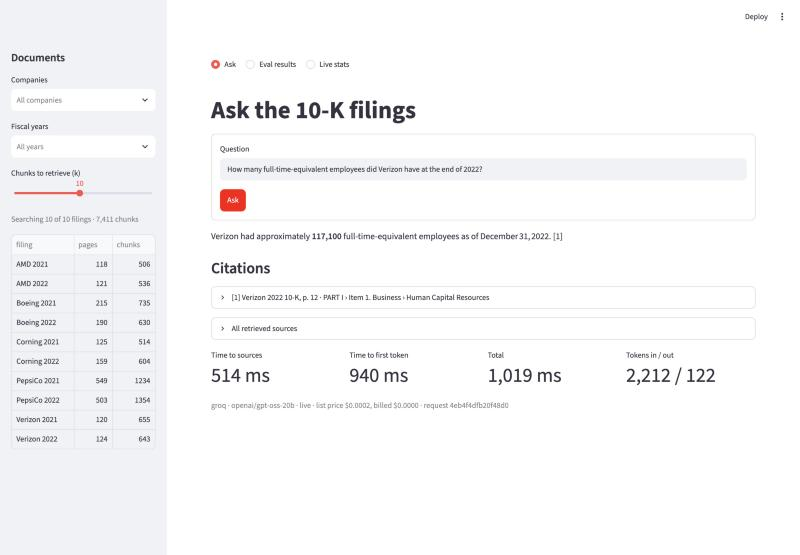

# RAG assistant with a self-built evaluation harness

A question-answering assistant over ten SEC 10-K annual reports. It answers only from the documents, cites the exact PDF page and character span each claim came from, and says so when the answer isn't there. It also has an evaluation harness and a 57-configuration ablation study that show, with confidence intervals, which retrieval choices actually help.

Built from scratch in 16 phases as a teaching project: plain Python, Postgres + pgvector, no LangChain beyond one text splitter. Each component has a doc that explains it from first principles ([docs/](docs/00-START-HERE.md)).



## Headline numbers

All measured; each has its command and raw output in the linked doc.

| What | Result | Where |
|---|---|---|
| Retrieval, 61-question golden set (52 answerable) | **hit@5 0.769** [95% CI 0.65–0.88] · recall@10 0.760 · MRR 0.535 | [15](docs/15-eval-harness.md) |
| By question type (hit@5) | factual 0.909 · exact figure 0.875 · table 0.615 · multi-hop 0.556 | [15](docs/15-eval-harness.md) |
| External check: FinanceBench, 28 analyst questions | page-hit@10 0.286 (0.607 with the right-filing filter) | [15](docs/15-eval-harness.md) |
| Answer correctness, with retrieval vs closed book (same model) | **0.721** [0.60–0.84] vs **0.067** · won 37 questions vs 4 | [16](docs/16-experiments-and-ablations.md) |
| Faithfulness to cited sources · answers citing an evidence passage | 0.923 · 92.5% | [16](docs/16-experiments-and-ablations.md) |
| Unanswerable questions refused · answerable wrongly refused | 9 / 9 · 23% | [16](docs/16-experiments-and-ablations.md) |
| Ablation (57 configs: chunking × size × mode × rerank) | reranking helps in 23 of 27 pairs (+0.067 hit@5); no config significantly beats the default; 30 are significantly worse | [16](docs/16-experiments-and-ablations.md) |
| Prompt-injection suite (7 attacks × 4 questions, real model) | 6 / 28 succeed on the Phase 13 system → **1 / 28** with the guards (that one is cited to the poisoned upload, not laundered) | [18](docs/18-security-prompt-injection.md) |
| Latency, unthrottled (server medians) | retrieval ~320 ms · first token 402 ms · full answer 862 ms | [17](docs/17-cost-and-observability.md) |
| Cost per answer | ~$0.0016–0.0026 at list price ($2.60 per 1k); $0 billed on Groq's free tier | [17](docs/17-cost-and-observability.md) |
| Fresh clone from GitHub → install, ingest, tests, eval | 483 s · **479 / 479 tests pass** · hit@5 **0.769, identical** to the published run (0 per-question metric differences; 60 / 61 retrieved lists identical) | [20](docs/20-deployment-and-demo.md) |

**Honest caveats.**
- The golden set is mine, written from the filings, so it flatters keyword search. Across the 54 ablation configurations, golden-set and FinanceBench scores correlate *negatively* (Spearman −0.53), which is why the default is the configuration that holds up on both.
- The answer numbers were measured with prompt template 1. Template 2 (the Phase 14 security default) has not yet been re-scored on the golden set: the generator's daily quota ran out (T-063).
- The LLM judge hasn't been checked against human grades.

## Architecture


- **Ingestion:** PyMuPDF + pdfplumber parse each PDF into one canonical text with page and character offsets and block bounding boxes. Structure-aware chunking cuts 256-token pieces (7,411 chunks); `bge-small-en-v1.5` embeds them (384-d, local).
- **Storage:** Postgres 16 holds pgvector HNSW, a full-text `tsvector`, the LLM response cache and the request log.
- **Retrieval:** vector and keyword search (50 each), fused by Reciprocal Rank Fusion (k = 60), with the top 10 reordered by a MiniLM cross-encoder.
- **Generation:** sources are fenced and screened for injected instructions, and a Groq-hosted model answers with `[n]` markers. Code, not the model, maps each marker back to the stored chunk, page and character span. Links and images are stripped from the output.
- **Serving:** FastAPI with Server-Sent Events streaming, `/stats`, and a page-preview endpoint. A Streamlit UI talks to the API over HTTP only.

## Quick start

Prerequisites (macOS, tested on an 8 GB M1): Python 3.11, Colima + Docker CLI, Node + `mmdc` only for re-rendering diagrams. Exact versions: [docs/00-START-HERE.md](docs/00-START-HERE.md#prerequisites).

```bash
colima start --cpu 2 --memory 2 --disk 10
```

```bash
cp .env.example .env
```

```bash
make ingest
```

```bash
make test
```

`make ingest` creates the venv and installs pinned requirements, then:
1. starts Postgres + pgvector (pinned by image digest);
2. downloads the 10 filings and verifies their sha256 hashes;
3. parses, chunks, embeds and indexes them.

`make test` runs the suite. Without an API key, set `LLM_PROVIDER=fake` in `.env` to use the deterministic offline model. With a free [Groq](https://console.groq.com) key in `GROQ_API_KEY`, the defaults below apply.

```bash
make serve
```

```bash
make ui
```

```bash
make demo
```

`make ui` opens the Streamlit app at http://127.0.0.1:8501. `make demo` runs four scripted questions in the terminal ([docs/20](docs/20-deployment-and-demo.md)). `make eval NAME=mine` scores the golden set; add `ARGS="--generate --judge"` for answer quality.

## Models: why the generator and the judge are different

| Role | Model | Provider (OpenAI-compatible API) | Configured by |
|---|---|---|---|
| Embeddings | `BAAI/bge-small-en-v1.5` (local) | sentence-transformers | `EMBEDDING_MODEL` (pinned revision; never changed, as re-embedding would invalidate every eval number) |
| Reranker | `cross-encoder/ms-marco-MiniLM-L6-v2` (local) | sentence-transformers | `RERANK_MODEL` |
| **Generator** (writes answers) | `qwen/qwen3.8-27b` (Alibaba Qwen family) | Groq | `LLM_PROVIDER`, `LLM_BASE_URL`, `LLM_MODEL`, `GROQ_API_KEY` |
| **Judge** (grades answers in the eval) | `openai/gpt-oss-120b` (OpenAI open-weights family) | Groq | `LLM_JUDGE_PROVIDER`, `LLM_JUDGE_BASE_URL`, `LLM_JUDGE_MODEL` |

The judge is deliberately **a different model from a different family** than the generator:

- **Self-preference.** A model grading its own output tends to rate it favourably. It recognises its own phrasing and shares its reasoning habits.
- **Shared blind spots.** A judge that makes the same mistakes as the generator (here: taking the wrong year's column from a table) won't catch them. Two families trained differently are less likely to fail the same way.
- **Independence of the measurement.** Switching the generator must not silently change the ruler. With a separate judge setting, generator experiments are graded by a fixed, pinned judge.

The judge is also larger (120B vs 27B parameters), so it grades a smaller model rather than a peer.

It is still an LLM judge with known biases. It scored one confidently wrong but cited number as "faithful" because the number does appear in the cited table (see [docs/16](docs/16-experiments-and-ablations.md)). Its verdicts are a relative measure for comparing configurations; agreement with human grades hasn't been measured. Retrieval itself is graded without any LLM, against exact evidence spans.

**How we got here** (each step is in [docs/23-troubleshooting.md](docs/23-troubleshooting.md)): OpenAI (account had no credits) → Gemini 3.5 Flash (the free tier allowed 20 requests/day; a full eval needs 61) → Gemini 3.5 Flash-Lite (the project then returned HTTP 402 "prepayment credits depleted") → Qwen on Groq's free tier, with a judge from another family. Any OpenAI-compatible provider can be swapped in by editing `.env`; see the template in [.env.example](.env.example). The UI screenshots were generated with `openai/gpt-oss-20b` (labelled in each), because Qwen's daily quota was spent.

## Repository

| Path | What |
|---|---|
| `app/` | `config` · `telemetry` · `store` · `embed` · `ingest` · `retrieve` · `generate` · `api`; layering enforced by `tests/test_architecture.py` |
| `ui/` | Streamlit app (HTTP-only, test-enforced) |
| `eval/` | Golden set, metrics, runner, ablation, closed-book baseline, injection suite; `eval/results/` is write-once |
| `scripts/` | Benchmarks, demo, diagram tooling |
| `docs/` | 24 docs, 51 diagrams with ASCII twins, 51 decision cards, `interview/` question bank |

## Documentation

Start at [docs/00-START-HERE.md](docs/00-START-HERE.md). Every component has a teaching doc written in the same phase as its code, with rendered diagrams and text versions of each. Interview preparation is in [docs/interview/](docs/interview/00-how-interviews-go.md). The project write-up, covering what was built, what was measured and what I'd do next, is [docs/WRITEUP.md](docs/WRITEUP.md). The full build log is [PROGRESS.md](PROGRESS.md).
