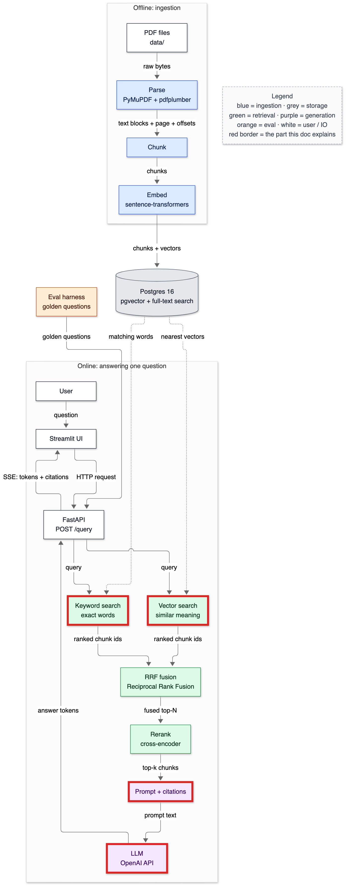
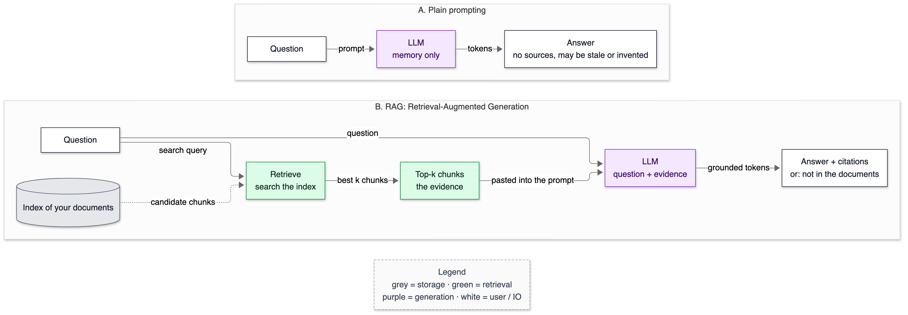

# 01 — What is RAG?

**Status:** written in Phase 0 (2026-10-02). Owns the concepts: LLM, token, context window, hallucination, grounding, retrieval, RAG, fine-tuning, long-context stuffing, abstention.

> **New to all of this?** Read [§7a Prerequisite concepts](#7a-prerequisite-concepts) first, then come back to the top.

---

## 1. In one paragraph

Imagine two exams. In a **closed-book exam** you answer from memory: you may remember wrongly, you cannot prove where an answer came from, and you know nothing published after you studied. In an **open-book exam** you first look up the right page, then write your answer from it, and you can say "see page 47". A language model on its own is a student in a closed-book exam. **RAG (Retrieval-Augmented Generation)** turns it into an open-book exam: before the model answers, our system searches *our* documents for the passages most likely to contain the answer, pastes them into the question, and tells the model to answer only from them and to cite them. If nothing relevant is found, the honest answer is "that is not in the documents".

## 2. Why it exists

Without retrieval, asking an LLM about a company's annual report goes wrong in four concrete ways:

1. **It may never have seen the document.** Private, recent, or obscure documents are not in its training data.
2. **Its knowledge is frozen.** Anything published after its **training cutoff** (the date its training data ends) is unknown to it.
3. **It answers anyway.** An LLM is trained to produce *plausible* text, not to check facts. Asked for a number it does not know, it produces a number-shaped answer. This is **hallucination**.
4. **It cannot show its work.** Even when it is right, nothing points to the page that proves it. For financial or legal text, an answer you cannot verify is close to useless.

RAG fixes 1, 2 and 4 directly and reduces 3. It does **not** eliminate hallucination — the model can still misread the evidence, or retrieval can hand it the wrong passage. That is why this project measures retrieval and answer faithfulness separately ([15-eval-harness.md](15-eval-harness.md)).

## 3. Where it sits

RAG is not one box — it is the pattern the whole online path follows. The highlighted boxes are the **R** (retrieval: the two searches) and the **G** (generation: prompt + LLM).



<details><summary>Same diagram as text (for terminal viewing)</summary>

```text
 OFFLINE
 ┌───────────┐  ┌───────┐  ┌───────┐  ┌───────┐   ┌─────────────────────────────┐
 │ PDF files │─▶│ Parse │─▶│ Chunk │─▶│ Embed │──▶│ Postgres 16                 │
 └───────────┘  └───────┘  └───────┘  └───────┘   │ pgvector + full-text search │
                                                  └──────────────┬──────────────┘
 ONLINE                                                          │ searched by
 ┌───────────┐  ┌─────────┐     query     ╔══════════════════════▼══════════════╗
 │ Streamlit │─▶│ FastAPI │──────────────▶║ Vector search  +  Keyword search    ║
 └─────▲─────┘  └──┬───▲──┘               ╚══════════════════════╤══════════════╝
       │    SSE    │   │ answer tokens                           │ two ranked lists
       └───────────┘   │                                         ▼
               ╔═══════╧══════╗  ╔════════════════════╗  ┌────────┐  ┌────────────┐
               ║ LLM (OpenAI) ║◀═║ Prompt + citations ║◀─│ Rerank │◀─│ RRF fusion │
               ╚══════════════╝  ╚════════════════════╝  └────────┘  └────────────┘

 Double-line boxes (╔═╗) = the parts this doc explains: Retrieval + Generation.
```
</details>

## 4. The flow



<details><summary>Same diagram as text (for terminal viewing)</summary>

```text
 A. PLAIN PROMPTING
 ┌──────────┐   prompt   ┌─────────────┐   tokens   ┌───────────────────────────────────┐
 │ Question │ ─────────▶ │ LLM         │ ─────────▶ │ Answer                            │
 └──────────┘            │ memory only │            │ no sources; may be stale/invented │
                         └─────────────┘            └───────────────────────────────────┘

 B. RAG: RETRIEVAL-AUGMENTED GENERATION
                            ┌────────────────┐
                            │ Index of your  │
                            │ documents      │
                            └───────┬────────┘
                                    ┊ candidate chunks
                                    ▼
 ┌──────────┐ search query  ┌────────────────┐ best k chunks ┌──────────────┐
 │ Question │ ────────────▶ │ Retrieve       │ ────────────▶ │ Top-k chunks │
 └────┬─────┘               │ search the     │               │ the evidence │
      │                     │ index          │               └──────┬───────┘
      │                     └────────────────┘                      │ pasted into the prompt
      │ question                                                    ▼
      │                                                      ┌──────────────────┐
      └─────────────────────────────────────────────────────▶│ LLM              │
                                                             │ question +       │
                                                             │ evidence         │
                                                             └────────┬─────────┘
                                                                      │ grounded tokens
                                                                      ▼
                                                     ┌──────────────────────────┐
                                                     │ Answer + citations       │
                                                     │ or: not in the documents │
                                                     └──────────────────────────┘
 Legend (colours appear in the image): grey = storage · green = retrieval
                                       purple = generation · white = user / IO
```
</details>

**Path A — plain prompting.** The question goes straight to the LLM. The only knowledge available is what is stored in the model's weights. The answer comes back with no source.

**Path B — RAG**, step by step:

1. **Index ahead of time (offline).** Long before any question, every document is split into **chunks** — passages a few hundred words long — and stored in a searchable **index**. A chunk is the unit we search, return and cite. (How: [05-pdf-parsing.md](05-pdf-parsing.md), [06-chunking.md](06-chunking.md), [07-embeddings.md](07-embeddings.md).)
2. **Search (online).** The question is used as a search query against the index. The index returns **candidate chunks** with a relevance score each.
3. **Keep the best k.** We keep the **top-k** — the k highest-scoring chunks. Small k risks missing the answer; large k adds noise and cost. Choosing k is measured, not guessed ([16-experiments-and-ablations.md](16-experiments-and-ablations.md)).
4. **Augment the prompt.** The chunks are pasted into the prompt next to the question, with instructions such as "answer only from these passages; cite them; if they do not contain the answer, say so". Instructing the model this way is called **grounding**.
5. **Generate.** The LLM writes the answer token by token. Because the evidence is in front of it, the answer can quote figures and cite chunk ids.
6. **Answer or abstain.** If the evidence does not contain the answer, the correct output is a refusal. Refusing when evidence is weak is called **abstention** — card #3, decided in Phase 9.

The thing to notice: in path B the LLM is no longer the source of truth — the documents are. The LLM's job shrinks to *reading and writing*, which it is good at, instead of *remembering*, which it is bad at.

## 5. The code

There is no RAG code yet — Phase 0 builds the environment. This is where each step of path B will live, so you can follow it as it gets built:

| Step | Will live in | Explained in | Built in |
|---|---|---|---|
| Parse PDFs into text blocks with page + character offsets | `app/ingest/` | [05-pdf-parsing.md](05-pdf-parsing.md) | Phase 2 |
| Split into chunks | `app/ingest/` | [06-chunking.md](06-chunking.md) | Phase 3 |
| Embed chunks, store in Postgres | `app/embed/`, `app/store/` | [07-embeddings.md](07-embeddings.md), [08-database-schema.md](08-database-schema.md) | Phase 4 |
| Search (vector, keyword, fused, reranked) | `app/retrieve/` | [09](09-vector-search.md), [10](10-keyword-search.md), [11](11-hybrid-rrf.md), [12](12-reranking.md) | Phases 5–8 |
| Build the grounded prompt, map citations | `app/generate/` | [13-prompting-and-citations.md](13-prompting-and-citations.md) | Phase 9 |
| Serve over HTTP with streaming | `app/api/` | [14-api-and-streaming.md](14-api-and-streaming.md) | Phase 10 |

What exists today is the foundation every step will use: `app/config.py` (all settings) and `app/store/db.py` (database connections), both explained in [03-environment-and-infra.md](03-environment-and-infra.md).

## 6. Data in / data out

We have no LLM wired in yet, but we *can* run the **R** of RAG today: Postgres' built-in keyword search, on four made-up passages. This is real output from this repo's database (command in [§9](#9-try-it-yourself)).

**In** — the question "How much did revenue grow in 2023?", turned into a search query:

```text
       query_lexemes
----------------------------
 'revenu' | 'grow' | '2023'
```

**Out** — the passages that match, best first:

```text
 id | score  |                                  body
----+--------+-------------------------------------------------------------------------
  2 | 0.0405 | Total revenue grew 12 percent in fiscal 2023, driven by cloud services.
  4 | 0.0203 | Revenue from hardware declined as customers moved to subscriptions.
```

Field by field:

- `query_lexemes` — the question reduced to search terms. Common words ("how", "much", "did", "in") are dropped; "revenue" is cut down to its stem `revenu`, so it also matches "revenues". The `|` means OR.
- `id` — which passage. Passages 1 (cafeteria) and 3 (founding year) did not match at all, so they are not returned.
- `score` — `ts_rank`, a relevance score: higher means more query terms, more often. Passage 2 matched two terms (`revenu`, `2023`); passage 4 matched one (`revenu`).
- `body` — the text that would be pasted into the prompt as evidence.

Two lessons hide in this tiny output, and they drive the whole retrieval design:

1. **Keyword search missed a word.** Passage 2 says "grew", the question says "grow". The stemmer does not connect irregular verbs, so `grow` matched nothing — passage 2 won on `revenu` and `2023` alone. A search that understands *meaning* would have caught it. That is vector search ([09-vector-search.md](09-vector-search.md)).
2. **Keyword search matches words, not meaning.** Passage 4 is about revenue *declining*, yet it ranks second because it contains "revenue". This is why we fuse two searches ([11-hybrid-rrf.md](11-hybrid-rrf.md)) and rerank ([12-reranking.md](12-reranking.md)).

## 7. Decisions & alternatives

<!-- card:start id=1 -->
#### Decision: RAG over our own documents  (rejected: fine-tuning, long-context stuffing, plain prompting)

**One-line defence.** Answers must come from specific filings, cite the exact passage, and stay correct when a filing changes — RAG is the only option of the four that gives all three without retraining anything.

**What problem is this even solving?** An LLM alone answers from what it memorised in training: it may never have seen our documents, cannot cite them, and cannot be updated without retraining. The slot this decision fills is "how does knowledge from our documents reach the model at answer time?" Delete retrieval entirely and you are left with plain prompting: confident answers with no source, and no way to tell a 2023 figure from a 2022 one.

**The options, compared.**

| Option | How it works (1 line) | Strengths | Weaknesses | When it's the right call |
|---|---|---|---|---|
| ✅ RAG | Search the documents at question time; paste the best passages into the prompt | Fresh: re-index a document, no retraining. Citable. Can refuse when nothing matches. Works with any LLM. | Many moving parts (parse, chunk, index, search), each a failure point. Answer quality is capped by retrieval quality. Adds search latency. | Knowledge is large, changes, or must be cited |
| Fine-tuning | Continue training the model's weights on our documents or Q&A pairs | Teaches format, tone, domain vocabulary. No search at query time. | No citations. Facts seen a few times are not reliably recallable — studies comparing fine-tuning with retrieval for adding new knowledge favour retrieval (Ovadia et al., 2023, *Fine-Tuning or Retrieval?*). Every document change means retraining. Needs GPUs or a paid tuning API. | Changing how the model *behaves*, not what it *knows* |
| Long-context stuffing | Paste entire documents into the prompt every time | Least code: no index. The model sees everything. | Cost is the full corpus in tokens on *every* question. Latency grows with input length. Models use the middle of long inputs worst ("lost in the middle", Liu et al., 2023). Impossible once the corpus exceeds the window. | Corpus fits comfortably, few queries, one-off analysis |
| Plain prompting | Ask the LLM directly | Zero infrastructure, fastest, cheapest | Frozen at training cutoff; blind to private documents; hallucinates; cannot cite | General knowledge where a wrong answer is cheap |

**What would actually change if we swapped it.**
- *To fine-tuning:* `app/retrieve/`, the vector and full-text parts of `app/store/`, and Phases 3–8 disappear; a training-data pipeline and a training job appear. An 8 GB laptop cannot train a useful model, so this means a paid fine-tuning API. Citations become impossible, so Phase 9's citation mapping and Phase 15's citation UI go too. Retrieval metrics (recall@k, MRR) stop meaning anything; only answer-level metrics remain. Every corrected filing means a new training run. This is a different project, not a refactor.
- *To long-context stuffing:* Phases 3–8 are deleted; per-question input tokens become *all corpus tokens* (not yet measured — Phase 1 counts them). Cost per 1,000 queries grows linearly with corpus size; time-to-first-token grows with prompt length. New failure modes: lost-in-the-middle misses, and a hard wall at the context-window size. Roughly two days of rework, mostly deletion.
- *To plain prompting:* everything except one API call is deleted. No citations, no abstention, answers limited to what the model memorised.

**The decision rule.** Choose RAG when the knowledge is large, changes, or must be cited. Choose fine-tuning when you need to change behaviour (output format, tone, a skill), not add facts. Choose long-context stuffing when the whole corpus fits comfortably in the window and query volume is low. The RAG-vs-stuffing crossover is where *corpus tokens × queries × price per token* exceeds the cost of building and running retrieval — or simply where the corpus no longer fits.

**Where our choice breaks.** (1) If the corpus were two or three short documents queried rarely, stuffing would be simpler and probably just as accurate. (2) Questions that need *the whole corpus at once* — "which of the ten companies grew R&D fastest?" — break top-k retrieval, because the evidence is spread over ten documents and k chunks may not cover them. Migration path: retrieve per document, or extract key figures into a SQL table at ingest time, or decompose the question into sub-questions.

**The number.** Not yet measured. Phase 1 measures the corpus size in tokens (does it even fit in a context window?). Phase 12 will run a **closed-book baseline** — the same golden questions with retrieval switched off — against RAG, which is the direct evidence for this card. (Proposed addition to the Phase 12 matrix; see [PROGRESS.md](../PROGRESS.md).)

**Interview script (3 sentences).** "I used RAG because every answer has to come from a specific filing and cite the exact passage, and the filings change. Fine-tuning changes how a model behaves but is unreliable for storing exact figures and can't cite; stuffing the whole corpus costs every token of it on every question. I measured RAG against a closed-book baseline on my golden set: ⟨number from Phase 12⟩."

**Follow-ups they will ask:**
- Q: Context windows are a million tokens now. Isn't RAG obsolete? → A: Not for this workload. Stuffing pays for the whole corpus on every question, latency grows with prompt length, and models use the middle of long inputs worst. RAG also lets you send only chunks a user is *allowed* to see — stuffing would need per-user document sets. For a corpus of a few documents queried rarely, I'd agree stuffing is fine; Phase 1's token count tells us where we are.
- Q: Why not fine-tune so the model just knows the filings? → A: Fine-tuning adjusts weights from examples; a fact seen a handful of times isn't reliably recallable, nothing points back to a source, and correcting one figure means retraining. The right use of fine-tuning here would be *format* — e.g., always citing in our marker style — combined with RAG for facts.
- Q: Does RAG eliminate hallucination? → A: No. It reduces it by putting evidence in front of the model, but the model can ignore or misread the evidence, and retrieval can hand it the wrong passage — then you get a confident wrong answer *with a citation*. That's why faithfulness (does the answer follow from the cited text?) is measured separately from retrieval recall in Phase 11.
- Q: What is the weakest link in a RAG pipeline? → A: Usually retrieval. If the right chunk isn't in the top-k, the generator cannot recover it. That's why I measure retrieval metrics before generation metrics — a generation fix can't paper over a retrieval miss.
- Q (the hard one): How would you answer a question that needs data from all ten filings at once? → A (honest): My current design handles that poorly — top-k retrieval returns k chunks, which may all come from two filings. I'd fix it with per-document retrieval, or by extracting the metric into a table at ingest so it becomes a SQL query, or by decomposing the question. I haven't built any of those; the golden set includes multi-hop questions so the weakness will show up as a number.
- Q: Why not use a managed "file search" product from the LLM provider? → A: It hides chunking, retrieval and ranking — exactly the parts this project exists to measure and tune. For a team without retrieval expertise shipping fast, a managed product is a legitimate choice.

**The trap.** Saying "RAG means a vector database" or "RAG stops hallucinations". RAG is a *pattern* — retrieve, then generate. The retriever can be keyword search, SQL, or web search, and RAG reduces hallucination rather than eliminating it. Candidates who equate RAG with a vector DB can't explain why this project also uses keyword search.
<!-- card:end -->

## 7a. Prerequisite concepts

Read these in order; each builds on the one before.

**Large language model (LLM)** — a neural network trained on huge amounts of text to predict the next piece of text. Generating an answer is just doing that prediction over and over: predict one piece, append it, predict the next.

**Token** — the piece of text an LLM reads and writes, usually a word or part of a word. "Revenue" may be one token; a rare word or a number like "4,817.3" may be several. Token counts are what LLM APIs bill for and what context limits are measured in, so they are not the same as word counts. Exact counts depend on the model's **tokenizer** (the program that splits text into tokens); we measure ours in Phase 9.

**Context window** — the maximum number of tokens a model can take in one call: instructions + evidence + question + the answer it writes. Anything outside the window does not exist for the model.

**Training cutoff** — the date the model's training data ends. The model knows nothing after it.

**Parametric vs non-parametric memory** — terms from the paper that named RAG (Lewis et al., 2020, *Retrieval-Augmented Generation for Knowledge-Intensive NLP Tasks*). **Parametric memory** is knowledge stored in the model's weights (its parameters): fixed after training, cannot be cited. **Non-parametric memory** is knowledge stored outside the model, in an index you can search, update and cite. RAG = an LLM (parametric) + a searchable index (non-parametric).

**Hallucination** — fluent output that is not supported by any source, or is simply false. Why it happens: training rewards *plausible continuations*. When the model lacks the fact, the most plausible continuation of "Revenue in 2023 was" is still a number — just not the right one.

**Retrieval** — finding the passages most relevant to a query. Two families, both used here:
- **Keyword (lexical) search** — matches the words themselves, after normalising them. Great for exact figures, names and section numbers. Blind to synonyms ("grew" vs "grow" above). See [10-keyword-search.md](10-keyword-search.md).
- **Vector (semantic) search** — turns text into lists of numbers (**embeddings**) so that similar meanings land close together, then finds the nearest ones. Catches paraphrases; weaker on exact tokens. See [07-embeddings.md](07-embeddings.md) and [09-vector-search.md](09-vector-search.md).

**Chunk** — a passage of a document small enough to search precisely and to fit, several at a time, into the prompt. How big is a trade-off measured in Phase 12.

**Top-k** — the k highest-scoring results of a search. "Top-5" = the best five.

**Grounding** — making the model answer *from the supplied evidence*: instructions in the prompt, evidence placed next to the question, and checks afterwards. Covered in [13-prompting-and-citations.md](13-prompting-and-citations.md).

**Citation** — a pointer from a claim in the answer back to its source. Ours will be precise: chunk id + page number + character start/end, so the UI can highlight the exact passage.

**Abstention** — deliberately not answering ("this is not in the documents") when the evidence is too weak. A system that never abstains will hallucinate on every unanswerable question.

**Fine-tuning** — continuing to train an already-trained model on new examples, which changes its weights.

**Long-context stuffing** — skipping search and pasting whole documents into a very large context window on every question.

A worked example of why stuffing gets expensive, with made-up round numbers (the real ones come in Phase 1): if a corpus is 1,000,000 tokens and you ask 1,000 questions, stuffing sends 1,000 × 1,000,000 = 1,000,000,000 input tokens. RAG with five 400-token chunks plus a 300-token question sends 1,000 × (5 × 400 + 300) = 2,300,000 — about 435 times fewer. The ratio, not the made-up inputs, is the point: stuffing cost scales with corpus size, RAG cost scales with k.

## 7b. What if we used something else?

| If we had used… | Immediate effect | Effect on quality metrics | Effect on latency/cost | Effect on complexity | Would I defend it? |
|---|---|---|---|---|---|
| Fine-tuning instead of RAG | No retrieval code; a training pipeline instead | Retrieval metrics undefined; faithfulness can't be checked against a source; exact-figure accuracy likely worse (not measured here) | Training cost up front and on every document change; shorter prompts per question | High: training data, training jobs, model versioning | No — wrong tool for citable facts |
| Long-context stuffing | Phases 3–8 deleted | Depends on the model's long-input recall; lost-in-the-middle risk | Input tokens per question = whole corpus | Low code, high running cost | Only for a tiny corpus |
| Plain prompting | About twenty lines of code | No citations; this *is* the closed-book baseline we will measure in Phase 12 | Cheapest and fastest | Trivial | No — cannot see or cite our documents |
| RAG + a fine-tuned generator | Both pipelines | May improve citation-format adherence | Adds training cost | Highest | Only if Phase 11 shows format errors RAG alone can't fix |

## 8. Failure modes

No RAG code runs yet, so there are no stack traces to show. These are the behaviours you will see once it does, and where each is handled:

| Symptom | Cause | How to debug | Owned by |
|---|---|---|---|
| "Not found in the documents" for a question you know is answerable | Retrieval miss: the right chunk is not in the top-k | Look at the retrieved chunk ids vs the golden answer's location; the eval runner prints both | [15-eval-harness.md](15-eval-harness.md) |
| Confident answer, real citation, wrong number | Near-duplicate chunk from the wrong year or company (10-K boilerplate repeats yearly) | Open the cited chunk; check its document and year; add metadata filters | [09-vector-search.md](09-vector-search.md) |
| Answer contains facts not in any cited chunk | The model fell back on parametric memory | Faithfulness metric flags it; tighten grounding instructions | [13-prompting-and-citations.md](13-prompting-and-citations.md) |
| Cost or latency jumps as k grows | More chunks = more input tokens | Per-request token accounting | [17-cost-and-observability.md](17-cost-and-observability.md) |
| The model follows instructions hidden in a document | Prompt injection through retrieved text | Injection test suite | [18-security-prompt-injection.md](18-security-prompt-injection.md) |

## 9. Try it yourself

Run the keyword-retrieval demo from §6 against the project database. With the database running (`make up`), paste this whole block into a terminal at the repo root:

```bash
docker compose exec -T db sh -c 'psql -U "$POSTGRES_USER" -d "$POSTGRES_DB"' <<'SQL'
SELECT to_tsquery('english', 'revenue | grow | 2023') AS query_lexemes;
WITH passages(id, body) AS (VALUES
  (1, 'The cafeteria serves lunch from noon to two.'),
  (2, 'Total revenue grew 12 percent in fiscal 2023, driven by cloud services.'),
  (3, 'The company was founded in 1998 in Austin.'),
  (4, 'Revenue from hardware declined as customers moved to subscriptions.')
)
SELECT id,
       round(ts_rank(to_tsvector('english', body), q)::numeric, 4) AS score,
       body
FROM passages, to_tsquery('english', 'revenue | grow | 2023') AS q
WHERE to_tsvector('english', body) @@ q
ORDER BY score DESC;
SELECT to_tsvector('english', 'Total revenue grew 12 percent in fiscal 2023') AS passage_2_lexemes;
SQL
```

Expected output (the two result tables from §6, then):

```text
                          passage_2_lexemes
----------------------------------------------------------------------
 '12':4 '2023':8 'fiscal':7 'grew':3 'percent':5 'revenu':2 'total':1
```

It worked if passage 2 ranks first with score `0.0405`. The last table shows *why* "grow" missed: the passage's word is stored as `grew`, not `grow`.

**Experiment:** change the query to `'revenue | grew | 2023'` and re-run. Passage 2's score should rise because three terms now match. You just did by hand what vector search will do automatically: bridge the gap between the user's words and the document's words.

## 10. Numbers

| What | Value | Produced by |
|---|---|---|
| `ts_rank` of the best toy passage | 0.0405 | §9 command |
| Corpus size in tokens (does it fit a context window?) | not yet measured | Phase 1 |
| Closed-book vs RAG accuracy on the golden set | not yet measured | Phase 12 |

## 11. Interview talking points

- **60-second version:** "An LLM alone answers from memory — frozen, uncitable, and it guesses when it doesn't know. RAG retrieves the relevant passages from our documents at question time and makes the model answer from them with citations, or refuse. I chose it over fine-tuning because fine-tuning doesn't reliably store exact figures and can't cite, and over stuffing the whole corpus into a long context because that costs the entire corpus on every question."
- RAG is a *pattern*, not a product: the retriever here is two searches (keyword + vector), fused and reranked.
- RAG reduces hallucination; it does not remove it. That's why retrieval quality and answer faithfulness are measured separately.
- The weakest link is retrieval; the project measures it first.
- Expect: "Isn't long context making RAG obsolete?", "When would you fine-tune instead?", "How do you know the answer used the evidence?"

## 12. Check yourself

1. A colleague says "we'll fine-tune the model on our 10-Ks so it knows every figure". Give two concrete reasons this is the wrong tool, and name what fine-tuning *is* good for.
2. In the §6 output, why did passage 4 score above zero even though it is about revenue *declining*?
3. Your RAG system answers "Revenue grew 14%" and cites a real chunk — but the true figure is 12%. Name two different places in the pipeline that could have caused this.

<details><summary>Answers</summary>

1. (a) No citations — nothing in the weights points back to a page. (b) Facts seen a few times aren't reliably recallable, and every corrected or new filing needs another training run. Fine-tuning is good for *behaviour*: output format, tone, domain style.
2. Keyword search matches words, not meaning: passage 4 contains "revenue", which matches the lexeme `revenu`. Nothing in keyword search knows "declined" is the opposite of "grew".
3. Retrieval: the cited chunk may be from a different year or company (near-duplicate boilerplate), so the citation is real but the wrong evidence. Generation: the right chunk was retrieved but the model misread it or mixed in a remembered figure — a faithfulness failure.

</details>

## 13. New terms added to the glossary

closed-book / open-book, RAG, LLM, token, tokenizer, context window, training cutoff, parametric memory, non-parametric memory, hallucination, retrieval, keyword (lexical) search, vector (semantic) search, embedding, chunk, index, top-k, grounding, citation, abstention, fine-tuning, long-context stuffing, lost in the middle, closed-book baseline — see [21-glossary.md](21-glossary.md).
