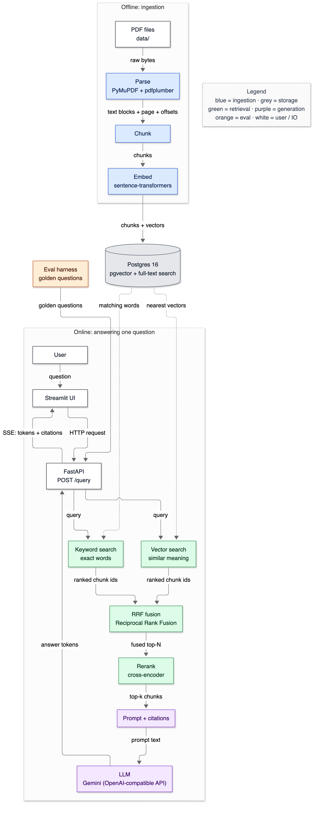
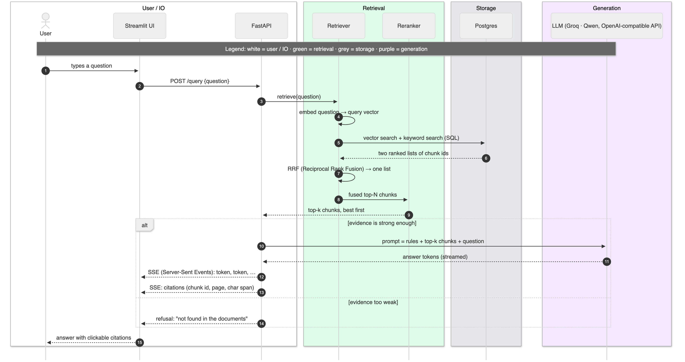

# 02 — Architecture overview

**Status:** written in Phase 0 (2026-10-02); the component status table is refreshed at the end of every phase. Owns: pipeline, offline/online path, latency percentiles, time-to-first-token, workload contract, modular monolith, layering, ablation.

> Read this after [01-what-is-rag.md](01-what-is-rag.md). Every later doc opens with a cut of the diagram below, with its own component highlighted.

---

## 1. In one paragraph

Think of a research library. Before anyone asks anything, **archivists** read every new report, cut it into index cards, and file each card twice — once in a catalogue sorted by *meaning*, once in a catalogue sorted by *exact words* (the **offline path**). When a visitor asks a question (the **online path**), two librarians search the two catalogues at the same time, a senior librarian merges their two piles and re-reads the best cards closely to put them in the right order, and a writer drafts an answer that quotes the cards and names the page each came from — or says "we don't have that". An **inspector** walks in daily with a list of questions whose correct answers are already known, and scores the whole library. That is this system: ingestion, two retrievers, fusion, reranking, grounded generation, and an eval harness.

## 2. Why it exists

Why this *shape* — separate stages, one database, an offline/online split — rather than one big function?

- **Each stage can be measured on its own.** If an answer is wrong we can ask "was the right chunk retrieved?" before asking "did the model misread it?". A single function hides which step failed.
- **Each stage can be swapped by configuration.** The project's main result is an **ablation** table (switch one component off or swap it, measure what changes — see [16-experiments-and-ablations.md](16-experiments-and-ablations.md)). That only works if chunking, retrieval mode, reranking and top-k are independent, config-driven stages.
- **Expensive work happens once.** Parsing and embedding a 200-page PDF takes far longer than a user will wait. Doing it offline keeps the online path to "search + rank + generate".
- **One database for text, vectors and metadata.** Postgres holds the chunks, their vectors and their keyword index together, so a document update is one transaction and a filter like "only 2023 filings" is a plain SQL `WHERE`. (Card #15 in [03-environment-and-infra.md](03-environment-and-infra.md) defends Postgres.)

## 3. Where it sits

This doc *is* the overview — here is the whole target system. Phases 1–16 fill it in; [the status table](#component-status) says what exists today.



<details><summary>Same diagram as text (for terminal viewing)</summary>

```text
 OFFLINE: ingestion                       ONLINE: answering one question

 ┌──────────────────────┐                 ┌──────────────────────────┐
 │ PDF files (data/)    │                 │ User                     │◀─────┐
 └──────────┬───────────┘                 └────────────┬─────────────┘      │ answer +
            │ raw bytes                                │ question           │ citations
            ▼                                          ▼                    │
 ┌──────────────────────┐                 ┌──────────────────────────┐      │
 │ Parse                │                 │ Streamlit UI             │──────┘
 │ PyMuPDF + pdfplumber │                 │                          │◀─────┐
 └──────────┬───────────┘                 └────────────┬─────────────┘      │ SSE: tokens
            │ text blocks + page + offsets             │ HTTP request       │ + citations
            ▼                                          ▼                    │
 ┌──────────────────────┐                 ┌──────────────────────────┐      │
 │ Chunk                │                 │ FastAPI  POST /query     │──────┘
 │                      │                 │                          │◀─────┐
 └──────────┬───────────┘                 └────────────┬─────────────┘      │
            │ chunks                                   │ query              │
            ▼                                          │ (to both)          │
 ┌──────────────────────┐                              │                    │
 │ Embed                │                              │                    │
 │ sentence-transformers│                              │                    │
 └──────────┬───────────┘                              ▼                    │
            │ chunks + vectors            ┌────────────┬─────────────┐      │
            ▼                             │ Vector     │ Keyword     │      │
 ┌──────────────────────┐ nearest vectors │ search     │ search      │      │
 │ Postgres 16          │ ──────────────▶ │ (similar   │ (exact      │      │
 │ pgvector + full-text │ matching words  │  meaning)  │  words)     │      │
 │ search               │                 └─────┬──────┴──────┬──────┘      │
 └──────────────────────┘                       │ ranked ids  │ ranked ids  │
                                                ▼             ▼             │
                                          ┌──────────────────────────┐      │
                                          │ RRF fusion               │      │
                                          │ Reciprocal Rank Fusion   │      │
                                          └────────────┬─────────────┘      │
                                                       │ fused top-N        │
                                                       ▼                    │
                                          ┌──────────────────────────┐      │
                                          │ Rerank (cross-encoder)   │      │
                                          └────────────┬─────────────┘      │
                                                       │ top-k chunks       │
                                                       ▼                    │
                                          ┌──────────────────────────┐      │
                                          │ Prompt + citations       │      │
                                          └────────────┬─────────────┘      │
                                                       │ prompt text        │ answer
                                                       ▼                    │ tokens
                                          ┌──────────────────────────┐      │
                                          │ LLM (OpenAI API)         │──────┘
                                          └──────────────────────────┘

 ┌──────────────────────┐ golden questions
 │ Eval harness         │ ───────────────────▶ FastAPI POST /query (same door as the UI)
 └──────────────────────┘

 Legend (colours appear in the image): blue = ingestion · grey = storage · green = retrieval
                                       purple = generation · orange = eval · white = user / IO
```
</details>

### Component status

| Component | Doc | Phase | Status |
|---|---|---|---|
| Environment: Docker Compose, Postgres 16 + pgvector, Makefile, settings, tests | [03](03-environment-and-infra.md) | 0 | ✅ built |
| Docs pipeline: diagrams, ASCII twins, card mirroring, integrity tests | [00](00-START-HERE.md) | 0 | ✅ built |
| Corpus: 10 × 10-K, pinned manifest, inspection | [04](04-corpus.md) | 1 | ✅ built |
| Parse (PyMuPDF + pdfplumber): blocks, offsets, tables, headings | [05](05-pdf-parsing.md) | 2 | ✅ built |
| Chunk: fixed / recursive / structure-aware, exact offsets | [06](06-chunking.md) | 3 | ✅ built |
| Embed (bge-small, MPS) + schema + HNSW/GIN + `make ingest` | [07](07-embeddings.md), [08](08-database-schema.md) | 4 | ✅ built |
| Vector search: HNSW, filters (iterative), ef_search 160 | [09](09-vector-search.md) | 5 | ✅ built |
| Keyword search: Postgres FTS, OR + phrases, ts_rank (BM25 option) | [10](10-keyword-search.md) | 6 | ✅ built |
| RRF fusion + `retrieval_mode` switch (vector / keyword / hybrid) | [11](11-hybrid-rrf.md) | 7 | ✅ built |
| Rerank: cross-encoder MiniLM-L6 over fused top 10, `RERANK_ENABLED` / `RERANK_N` | [12](12-reranking.md) | 8 | ✅ built |
| Prompt + citations + LLM (Gemini via OpenAI-compatible Chat Completions, provider in settings; fake for offline; Postgres response cache; retries) | [13](13-prompting-and-citations.md) | 9 | ✅ built (provider switched to Gemini 2026-10-02) |
| FastAPI: /health, /documents, /query, /query/stream (SSE) | [14](14-api-and-streaming.md) | 10 | ✅ built |
| Eval harness: golden set v1 (61 q), span-graded metrics, abstention, LLM judge, timestamped results | [15](15-eval-harness.md) | 11 | ✅ built |
| Ablations: 57 retrieval configs (`eval/ablate.py`), closed-book mode | [16](16-experiments-and-ablations.md) | 12 | ✅ retrieval done; generation runs pending LLM quota |
| Cost + observability | [17](17-cost-and-observability.md) | 13 | planned |
| Security | [18](18-security-prompt-injection.md) | 14 | planned |
| Streamlit UI | [19](19-frontend.md) | 15 | planned |

## 4. The flow

### The online path: one question, start to finish



<details><summary>Same diagram as text (for terminal viewing)</summary>

```text
   User      Streamlit UI     FastAPI      Retriever     Reranker      Postgres    LLM (Gemini)
     │             │             │             │             │             │             │
     │ 1 question  │             │             │             │             │             │
     ├────────────▶│             │             │             │             │             │
     │             │ 2 /query    │             │             │             │             │
     │             ├────────────▶│             │             │             │             │
     │             │             │ 3 retrieve  │             │             │             │
     │             │             ├────────────▶│             │             │             │
     │             │             │             ├─┐ 4 embed question → vector             │
     │             │             │             │◀┘           │             │             │
     │             │             │             │ 5 vector SQL + keyword SQL│             │
     │             │             │             ├──────────────────────────▶│             │
     │             │             │             │ 6 two ranked lists of ids │             │
     │             │             │             │◀╌╌╌╌╌╌╌╌╌╌╌╌╌╌╌╌╌╌╌╌╌╌╌╌╌╌┤             │
     │             │             │             ├─┐ 7 RRF fusion → one list │             │
     │             │             │             │◀┘           │             │             │
     │             │             │             │ 8 top-N     │             │             │
     │             │             │             ├────────────▶│             │             │
     │             │             │ 9 top-k chunks, best first│             │             │
     │             │             │◀╌╌╌╌╌╌╌╌╌╌╌╌╌╌╌╌╌╌╌╌╌╌╌╌╌╌┤             │             │
 ┄┄ alt: evidence is strong enough ┄┄┄┄┄┄┄┄┄┄┄┄┄┄┄┄┄┄┄┄┄┄┄┄┄┄┄┄┄┄┄┄┄┄┄┄┄┄┄┄┄┄┄┄┄┄┄┄┄┄┄┄┄┄┄┄┄┄┄┄┄┄┄┄┄
     │             │             │ 10 prompt = rules + top-k chunks + question           │
     │             │             ├──────────────────────────────────────────────────────▶│
     │             │             │ 11 answer tokens (streamed)             │             │
     │             │             │◀╌╌╌╌╌╌╌╌╌╌╌╌╌╌╌╌╌╌╌╌╌╌╌╌╌╌╌╌╌╌╌╌╌╌╌╌╌╌╌╌╌╌╌╌╌╌╌╌╌╌╌╌╌╌┤
     │             │ 12 tokens   │             │             │             │             │
     │             │◀╌╌╌╌╌╌╌╌╌╌╌╌┤             │             │             │             │
     │             │ 13 cites    │             │             │             │             │
     │             │◀╌╌╌╌╌╌╌╌╌╌╌╌┤             │             │             │             │
 ┄┄ else: evidence too weak ┄┄┄┄┄┄┄┄┄┄┄┄┄┄┄┄┄┄┄┄┄┄┄┄┄┄┄┄┄┄┄┄┄┄┄┄┄┄┄┄┄┄┄┄┄┄┄┄┄┄┄┄┄┄┄┄┄┄┄┄┄┄┄┄┄┄┄┄┄┄┄┄
     │             │ 14 refusal  │             │             │             │             │
     │             │◀╌╌╌╌╌╌╌╌╌╌╌╌┤             │             │             │             │
 ┄┄ end ┄┄┄┄┄┄┄┄┄┄┄┄┄┄┄┄┄┄┄┄┄┄┄┄┄┄┄┄┄┄┄┄┄┄┄┄┄┄┄┄┄┄┄┄┄┄┄┄┄┄┄┄┄┄┄┄┄┄┄┄┄┄┄┄┄┄┄┄┄┄┄┄┄┄┄┄┄┄┄┄┄┄┄┄┄┄┄┄┄┄┄┄
     │ 15 answer   │             │             │             │             │             │
     │◀╌╌╌╌╌╌╌╌╌╌╌╌┤             │             │             │             │             │
     │             │             │             │             │             │             │
 Solid arrow ─▶ = a call. Dashed arrow ◀╌ = its reply.
 Legend (colours appear in the image): white = user / IO · green = retrieval · grey = storage
                                       purple = generation
```
</details>

Step by step (numbers match the diagram):

1. **The user types a question** into the Streamlit UI.
2. **The UI sends `POST /query`** to the FastAPI service with the question as JSON.
3. **FastAPI asks the retriever** for evidence.
4. **The question is embedded** — turned into a vector by the same embedding model that embedded the chunks. Using a *different* model here is a silent killer: no error, just garbage results ([07-embeddings.md](07-embeddings.md)).
5. **Two searches run against Postgres:** nearest vectors (meaning) and full-text match (exact words).
6. **Postgres returns two ranked lists** of chunk ids — usually overlapping, never identical.
7. **RRF (Reciprocal Rank Fusion) merges them** into one list using only the *ranks*, not the incomparable raw scores ([11-hybrid-rrf.md](11-hybrid-rrf.md)).
8. **The top-N fused chunks go to the reranker**, a slower but more accurate model that reads question and chunk together ([12-reranking.md](12-reranking.md)).
9. **The best k come back**, ordered.
10. **If the evidence is strong enough**, FastAPI builds a grounded prompt — rules + the k chunks + the question — and sends it to the LLM.
11. **The LLM streams the answer back** token by token.
12. **FastAPI forwards each token** to the UI as an SSE (Server-Sent Events) event, so text appears as it is written instead of after a long pause ([14-api-and-streaming.md](14-api-and-streaming.md)).
13. **Then it sends the citations**: chunk id, page number, character span.
14. **If the evidence is too weak**, the LLM is never called; the UI gets a refusal. How "too weak" is decided is card #3 (Phase 9).
15. **The UI shows the answer** with clickable citations that open the source passage.

### The offline path: getting documents in

`make ingest` (Phase 4) reads each PDF in `data/`, **parses** it into text blocks while recording the page number and character offsets of every block, **chunks** those blocks, **embeds** each chunk, and **writes** chunk text, vector and keyword index to Postgres. It runs once per document version, not per question.

## 5. The code

Phase 0 creates the skeleton every later phase plugs into. This is the real tree today (`find app tests scripts -name '*.py' | sort`):

```text
app/__init__.py
app/config.py
app/store/__init__.py
app/store/db.py
scripts/__init__.py
scripts/collect_cards.py
scripts/where_it_sits.py
tests/conftest.py
tests/test_architecture.py
tests/test_config.py
tests/test_db_smoke.py
tests/test_docs_integrity.py
tests/test_tooling.py
```

The folders `app/ingest/`, `app/embed/`, `app/retrieve/`, `app/generate/`, `app/api/` and `app/telemetry/` are created in the phase that first puts code in them — an empty folder would be a promise, not code.

### The layering rule, enforced by a test

Each package may import only the packages *below* it. The table lives in `tests/test_architecture.py`:

```python
ALLOWED: dict[str, set[str]] = {
    "config": set(),
    "telemetry": {"config"},
    "store": {"config", "telemetry"},
    "embed": {"config", "telemetry"},
    "ingest": {"config", "telemetry", "store", "embed"},
    "retrieve": {"config", "telemetry", "store", "embed"},
    "generate": {"config", "telemetry", "store", "retrieve"},
    "api": {"config", "telemetry", "store", "embed", "retrieve", "generate"},
}
```

- `config` imports nothing from the app, so every other layer can use it without creating a cycle.
- `store` (the database layer) does not know retrieval exists. You can test it with a database and nothing else.
- `api` sits on top and may use everything; nothing may import `api`. HTTP concerns (status codes, request parsing) can never leak downward.

The test reads every file under `app/` with Python's `ast` module (it parses the code into a tree without running it), collects `import app.x` and `from app.x import ...` statements, and fails on any import the table doesn't allow. Proof that it bites — a deliberately planted `from app.api import routes` inside `app/store/` produced:

```text
E       AssertionError: forbidden imports:
E         app/store/_tmp_violation.py: store -> api
1 failed, 1 passed in 0.02s
```

Without this test, the rule would live only in this doc and erode the first time a deadline made a shortcut tempting.

### One place for settings

Every tunable value — database address today; chunk size, retrieval mode, top-k and model names later — is declared in `app/config.py` and nowhere else. No module reads `os.environ` directly. That gives the ablation runner one object to vary, and gives a reader one file to answer "what can be configured?". The code is walked through line by line in [03-environment-and-infra.md §5](03-environment-and-infra.md#5-the-code).

## 6. Data in / data out

### Today: the project's interface is the Makefile

Real output of `make help`:

```text
  help       List available targets
  install    Create .venv (Python 3.11) and install pinned requirements
  up         Start Postgres + pgvector and wait until it accepts connections
  down       Stop Postgres (data is kept in the pgdata volume)
  db-reset   DESTRUCTIVE: stop Postgres and delete its volume (all local data)
  psql       Open a psql shell inside the database container
  test       Run the full test suite (starts Postgres if needed)
  diagrams   Render docs/diagrams sources to SVG + PNG in docs/diagrams/out/
  cards      Copy every Decision Card in docs/ into docs/interview/09-tradeoff-cards.md
  docs       Render diagrams, collect cards, then check links, images and ASCII twins
```

`ingest` arrives in Phase 4 and `eval` in Phase 11 — targets are added when they do something.

### The workload contract

Senior interviewers often open with *workload* questions before architecture ones. These are this system's answers; every design choice in later docs should be traceable to one of these rows.

| Question | Our answer | Consequence |
|---|---|---|
| Corpus size? | 10 annual-report PDFs: 2,224 pages, 1.42 M LLM tokens (measured in Phase 1) | Fits on one Postgres node; exact search may even be fast enough (Phase 5 measures) |
| How often do documents change? | Rarely — filings are annual; re-ingest on demand | Batch ingestion is fine; no streaming pipeline |
| Query volume? | One user, interactive demo; the eval runner sends questions sequentially | No load balancer, no caching layer needed yet |
| Permissions over the corpus? | None: single tenant, everyone sees everything | No per-document ACL filter at retrieval time ([18](18-security-prompt-injection.md) discusses what would change) |
| Citations required? | Yes, to the character span | Offsets must be captured at parse time (Phase 2 hard requirement) |
| When evidence is inadequate? | Refuse rather than guess | Needs an abstention rule and unanswerable golden questions |
| Optimise first-token or full-answer latency? | First token for the UI; full answer for eval throughput | Streaming (SSE) for the UI; targets set after Phase 13 measures |

### Planned: the query contract (built in Phase 10 — not real yet)

Shown so you know where the system is going; the real request and response will replace this once they exist.

```text
POST /query   {"question": "What was total revenue in fiscal 2023?"}
→ SSE stream:  event: token     data: "Total"
               event: token     data: " revenue"
               …
               event: citations data: [{"chunk_id": …, "page": …, "char_start": …, "char_end": …}]
```

## 7. Decisions & alternatives

<!-- card:start id=34 -->
#### Decision: Plain Python for the data path; LangChain only for its text splitter  (rejected: LangChain end-to-end, LlamaIndex, Haystack)

**One-line defence.** Every step the eval harness measures — chunk offsets, SQL, ranking, prompt assembly — is code I can read on one screen; a framework would hide exactly the parts this project exists to inspect.

**What problem is this even solving?** Something has to glue the stages together: load, split, embed, store, search, fuse, rerank, prompt, call the LLM, stream. Frameworks sell that glue. Delete the framework and you write the glue yourself — which is what we do, except for one solved problem (recursive text splitting, Phase 3) where we borrow LangChain's implementation and verify its offsets with tests.

**The options, compared.**

| Option | How it works (1 line) | Strengths | Weaknesses | When it's the right call |
|---|---|---|---|---|
| ✅ Plain Python + official SDKs; `langchain-text-splitters` only | Our own functions, psycopg SQL, the OpenAI SDK; one LangChain package for splitting | Every line visible and testable; stack traces point at our code; exact control of SQL, offsets and index parameters; no framework upgrade churn | More code to write and maintain (retries, streaming, prompt templates); no plug-and-play integrations | The pipeline *is* the product and each step must be measured and defended |
| LangChain end-to-end | Compose loaders, splitters, vector stores, retrievers and LLM calls as chained components | Very large integration catalogue; fast prototypes; swap stores/LLMs by config | Abstractions hide SQL and prompts; a history of reorganisations (e.g., the 2024 split into `langchain-core` / `langchain-community` packages); deeper stack traces | Prototypes, many integrations, teams standardised on it |
| LlamaIndex | Framework for indexing documents and querying them through "query engines" | Strong ingestion and indexing primitives; built-in evaluation helpers | Same opacity problem; its own document/node model may fight our offset schema | Document-heavy apps that accept its abstractions |
| Haystack | Pipeline framework of typed, connected components | Explicit pipeline graph; production-minded design | Another abstraction layer to learn; smaller ecosystem than LangChain (my impression, not measured) | Teams that want typed, declarative pipelines |

**What would actually change if we swapped it.** Moving to LangChain end-to-end would replace `app/retrieve/*` with LangChain retriever classes and its Postgres vector-store integration. As far as I know that integration manages its own table layout and keeps metadata in a JSON column, so `page_number`, `char_start` and `char_end` would stop being typed, constrained columns — harder to index and easy to get silently wrong. The eval harness would need framework callbacks to see intermediate rankings. Latency impact: probably negligible next to model calls (not measured). Rework: about two to three days, plus re-learning how to debug through the framework.

**The decision rule.** Use a framework when breadth of integrations and speed to first demo matter more than visibility; write plain code when the pipeline steps are what you measure, debug and defend. A rule of thumb (mine, not a law): once you would override more than about a third of a framework's defaults, it costs more than it saves.

**Where our choice breaks.** If the system needed many integrations — ten source types, several vector stores, tool-using agents — hand-written glue becomes a maintenance burden. Migration path: wrap our existing functions as framework components one stage at a time, keeping the tests.

**The number.** Not yet measured. The Phase 13 latency breakdown will show per-stage time; framework overhead would be one line of it. Lines of glue code we own will be reported at Phase 16.

**Interview script (3 sentences).** "I kept the data path in plain Python because the whole point of the project is measuring each retrieval step, and a framework hides exactly those steps. Where a problem was genuinely solved — recursive text splitting — I used LangChain's splitter and wrote tests proving its character offsets are exact. If I needed ten integrations instead of one, I'd make the opposite call."

**Follow-ups they will ask:**
- Q: Isn't that reinventing the wheel? → A: For the splitter, yes — so I didn't. For SQL retrieval and prompt assembly, the "wheel" is about thirty lines each, and hiding them costs more than writing them, because those are the lines I tune and debug.
- Q: How do you swap LLM providers without a framework? → A: One small interface — `generate(prompt) → stream of tokens` — with one class per provider. That's the Strategy pattern; it's what frameworks do internally, minus the rest of the framework.
- Q: Did you evaluate LangChain's Postgres vector store? → A: I looked at it. As far as I know it manages its own tables and stores metadata as JSON; I wanted typed offset columns and direct control of HNSW parameters. I'd re-check the current version before saying that in a design review.
- Q: What exactly does the LangChain splitter give you? → A: Recursive splitting over a priority list of separators (paragraph, line, sentence, word) with overlap, plus a start index per chunk. Our tests check that `text[char_start:char_end]` equals the chunk for every chunk.
- Q (the hard one): Frameworks give you tracing tools out of the box. How do you observe your pipeline? → A (honest): With structured logs that carry per-stage timings and token counts (Phase 13) — it works, but it's less polished than a hosted tracing product, and I'd adopt one (or OpenTelemetry) in a team setting.
- Q: When would you pick LlamaIndex? → A: An ingestion-heavy product with many document types, where its node parsers and index types save weeks and I don't need per-character control.

**The trap.** Saying "LangChain is bad" or "frameworks are for beginners". Interviewers want the cost/benefit for *this* project: visibility of measured steps versus integration breadth. Dismissing frameworks outright signals inexperience, not taste.
<!-- card:end -->

<!-- card:start id=x-modular-monolith -->
#### Decision: One Python service + one Postgres — a modular monolith  (rejected: microservices, a separate vector DB + search engine, serverless functions)

**One-line defence.** One process and one database means one deploy, one transaction boundary and no network hops between stages — the right shape for one developer and single-digit queries per second — and the module boundaries are drawn so that a stage can be split out later.

**What problem is this even solving?** The stages have to run *somewhere* and talk to each other somehow. The choice sets how many things you deploy, how a document update stays consistent, and how many network hops a query pays for. "Delete the decision" isn't possible — every system has a deployment shape; the question is which one.

**The options, compared.**

| Option | How it works (1 line) | Strengths | Weaknesses | When it's the right call |
|---|---|---|---|---|
| ✅ Modular monolith | One Python app with strict internal layers, one Postgres | One deploy, in-process calls, one transaction per document update, simple local dev | Stages share CPU and memory — heavy reranking can slow request handling; scaling one stage means scaling all | Small team, low QPS, fast iteration |
| Microservices | Ingest, retrieval and generation as separate HTTP services | Independent scaling and deploys; isolate GPU work | Network hop per stage; partial failures; version skew between services; needs tracing and service discovery | Different stages owned by different teams, or with very different hardware or scaling needs |
| Separate vector DB + search engine | Vectors in a vector DB, keywords in Elasticsearch, metadata in Postgres | Each store tuned for its job; mature scale-out | Three systems to keep consistent: a deleted document must vanish from all three; joins happen in application code | Very large corpora where one store can't serve both workloads |
| Serverless functions | One function per request, platform-managed | Scales to zero; no servers to run | Cold starts load the embedding model; connection storms against Postgres | Spiky, low-volume traffic with light models |

**What would actually change if we swapped it.** To microservices: each `app/` package becomes a service with its own HTTP API, health checks and deploy; every query gains network round trips (not measured here); we would need distributed tracing to debug latency; and a new failure mode appears — the retriever is up but the reranker is down. To three stores: `app/store/` becomes three clients, a document update becomes a multi-system write with no shared transaction (so we'd need retries plus reconciliation), and filtered search joins across systems in Python. Either is weeks of rework.

**The decision rule.** Split a component out when it has a different scaling profile, deploy cadence, hardware need or owning team. Until then, keep one deployable and enforce module boundaries in code — here with `tests/test_architecture.py`. The crossover usually arrives when one stage needs different hardware (e.g., a GPU reranker) than the rest.

**Where our choice breaks.** When CPU-bound embedding and reranking compete with request handling under concurrent load (Phases 10 and 13 measure this). Migration path: move model inference into a separate worker or service behind the same Python interface; the layering test means callers don't change.

**The number.** Not yet measured. The Phase 13 latency waterfall will show what fraction of a request is spent in model inference — the stage most likely to be split out first.

**Interview script (3 sentences).** "It's a modular monolith: one Python service and one Postgres, with layering enforced by a test so no lower layer imports a higher one. That gives one deploy and one transaction for document updates, which is right for one developer and low traffic. The first thing I'd split out is model inference, once measurements show it competing with request handling."

**Follow-ups they will ask:**
- Q: Don't microservices scale better? → A: Scaling comes from statelessness and running more copies; a stateless monolith can run ten copies behind a load balancer too. Microservices let you scale *different stages differently* — that's the real benefit, and it only matters once stages have different needs.
- Q: How do you keep the monolith from becoming a big ball of mud? → A: An explicit dependency table enforced by a test that parses imports; a violation fails `make test`.
- Q: What would you split first and why? → A: The reranker and embedder: they're CPU/GPU-bound, need different hardware from the API, and are the most likely source of tail latency.
- Q: How does a document update stay consistent? → A: Chunks, vectors and keyword index live in one Postgres, so deleting old chunks and inserting new ones is a single transaction — readers see either the old version or the new one, never half. (Details in Phase 4.)
- Q (the hard one): At 1,000 QPS, what breaks first in this design? → A (honest, pending numbers): I expect CPU-bound reranking in Python to saturate first, then database connections. I'll answer with measured per-stage latencies after Phase 13 — before that it's a hypothesis.

**The trap.** "Microservices because it's how big companies do it." Splitting buys independent scaling and team autonomy at the price of network hops, partial failures and distributed consistency. For one developer at one QPS that price buys nothing.
<!-- card:end -->

## 7a. Prerequisite concepts

**Pipeline / stage** — a pipeline is a sequence of steps where each step's output is the next step's input; each step is a stage. Ours: parse → chunk → embed → store, and query → search → fuse → rerank → generate.

**Offline (batch) path vs online (request) path** — offline work runs ahead of time, on a schedule or on demand, and nobody waits for it. Online work runs while a user waits. Moving work from online to offline is the oldest latency trick there is: we embed chunks once at ingest instead of at every question.

**Latency** — how long one request takes. **Throughput** — how many requests per second the system can finish. **QPS** — queries per second. They are different: a system can have low latency and low throughput (fast, but serves one at a time).

**Percentiles (p50, p95, p99)** — sort all measured latencies; p50 is the value half the requests beat (the median), p95 the value 95% beat. Why not the average? Worked example with ten made-up latencies in ms:

```text
measured: 120 130 125 140 135 128 132 900 138 127
sorted:   120 125 127 128 130 132 135 138 140 900
mean = 2075 / 10 = 207.5 ms     ← dragged up by one slow request
p50  = (130 + 132) / 2 = 131 ms ← what a typical user feels
p90  = 9th of 10 values = 140 ms (nearest-rank method)
max  = 900 ms                   ← with only 10 samples, p99 is just the maximum
```

Without the 900 ms request the mean would be 1175 / 9 ≈ 130.6 ms; that one slow request pushed it up by about 77 ms, while the typical user still saw about 131 ms. Percentiles show the **tail** — the slow requests that make users complain — which the mean hides. Phase 13 reports p50 and p95 per stage.

**Time to first token (TTFT) vs total latency** — TTFT is how long until the first word of the answer appears; total latency is until the last. Streaming doesn't make the answer finish sooner, but it makes TTFT what the user feels.

**Workload contract** — the answers to "how big, how often, how many, who can see what, what happens when unsure, which latency matters" (table in §6). A design without one is a design for an imaginary system.

**Modular monolith** — one deployable application divided into modules with enforced boundaries. **Microservices** — each module deployed as its own service, talking over the network.

**Layering / dependency direction** — lower layers (database access) never depend on higher ones (HTTP API). Benefit: you can test and reuse lower layers without the upper ones, and cycles are impossible.

**Configuration as a single source of truth** — all settings declared in one typed object, loaded from the environment. The opposite — `os.environ["X"]` sprinkled through the code — makes "what can I configure?" unanswerable.

**Ablation** — remove or swap one component, hold everything else fixed, measure the change. The term comes from ML research. It is how we will know whether, say, reranking actually helps *on our data*.

**Golden set** — questions whose correct answers (and evidence locations) are known in advance, used to score the system. Built in Phase 11 ([15-eval-harness.md](15-eval-harness.md)).

## 7b. What if we used something else?

| If we had used… | Immediate effect | Effect on quality metrics | Effect on latency/cost | Effect on complexity | Would I defend it? |
|---|---|---|---|---|---|
| LangChain end-to-end | Less glue code to write | Same models, so probably similar; harder to *see* why a ranking changed | Small framework overhead (not measured) | Lower to start, higher to debug | For a prototype, yes; for this project, no |
| Microservices | Three or more deployables | None directly | Extra network hop per stage | Much higher: tracing, retries, versioning | Not at one developer and one QPS |
| Separate vector DB + Elasticsearch | Three stores | Possibly better BM25 than Postgres FTS (measurable) | Extra hops; more infrastructure cost | High: cross-store consistency | Only at a scale this corpus will never reach |
| Embedding at query time instead of ingest time | No offline path | Same | Every question re-embeds every chunk — unusable | Lower | No |
| No layering test | Less code | None | None | Rules erode silently | No — the test costs nothing |

## 8. Failure modes

System-level failures that cross stage boundaries:

| Symptom | Cause | What you see | Debug |
|---|---|---|---|
| Search results are nonsense but nothing errors | Query embedded with a different model than the chunks | Low, near-random similarity scores; recall collapses | Phase 4 stores the model name with each vector; compare against the query-time model |
| Citation highlights the wrong text | Character offsets didn't survive parsing → chunking | Highlighted span doesn't contain the quoted words | Test: `doc_text[char_start:char_end] == chunk_text` for every chunk (Phases 2–3) |
| `make test` fails with a forbidden import | A lower layer imported a higher one | `AssertionError: forbidden imports: app/store/…: store -> api` | Move the shared code down a layer, or change `ALLOWED` deliberately |
| Every DB test errors at once | Postgres not running | `Cannot reach Postgres at 127.0.0.1:5432. Start it with make up.` | [03-environment-and-infra.md §8](03-environment-and-infra.md#8-failure-modes) |
| Answers stall mid-stream | LLM API slow or down | SSE stream stops; no `done` event | Timeouts and error events (Phase 10) |

## 9. Try it yourself

```bash
make help
```

Expected: the target list shown in §6.

```bash
make test
```

Expected (last line; the count grows each phase):

```text
238 passed in 0.23s
```

It worked if the line says `passed` with no `failed` or `error`. Then break the layering on purpose and watch the test catch it:

```bash
echo "from app.api import routes" > app/store/_oops.py && .venv/bin/python -m pytest tests/test_architecture.py -q; rm app/store/_oops.py
```

Expected: `1 failed, 1 passed` with `store -> api` in the message.

## 10. Numbers

| What | Value | Produced by |
|---|---|---|
| Tests in the suite after Phase 0 | 238 passed in 0.23 s (most are per-doc checks parametrized over every Markdown file) | `make test` (2026-10-02) |
| Per-stage latency of a query | not yet measured | Phase 13 |
| Retrieval quality per configuration | not yet measured | Phases 11–12 |

## 11. Interview talking points

- **60-second version:** "Two paths. Offline, PDFs are parsed with page and character offsets, chunked, embedded and stored in Postgres with both a vector index and a full-text index. Online, a question runs vector and keyword search in parallel, the two rankings are fused with RRF, a cross-encoder reranks the top few, and the LLM answers only from those chunks with character-level citations — or refuses. It's a modular monolith: one service, one database, layering enforced by a test."
- Every stage is config-driven so the ablation table can swap one thing at a time.
- One database means a document update is one transaction.
- The workload contract (§6) justifies the simple shape; say it before drawing boxes.
- Expect: "Why one database?", "What breaks at scale?", "What would you split out first?"

## 12. Check yourself

1. Why does the system embed chunks offline but embed the *question* online?
2. Ten latencies have a mean of 207.5 ms and a p50 of 131 ms. What does the gap tell you, and which number would you put in a dashboard?
3. A teammate adds `from app.api.routes import get_user` inside `app/retrieve/vector.py`. What happens, and why is the rule there?

<details><summary>Answers</summary>

1. Chunks are known in advance, so embedding them once at ingest keeps that cost off every query. The question only exists when the user asks it, so it can only be embedded then — with the *same* model as the chunks.
2. A small number of very slow requests (a long tail) is pulling the mean up; the typical request is ~131 ms. Dashboard p50 *and* p95/p99 — the mean hides the tail that users complain about.
3. `make test` fails: `tests/test_architecture.py` reports `retrieve -> api` as a forbidden import. The rule keeps lower layers independent of the HTTP layer, so retrieval can be tested and reused (by the eval runner, for example) without a web server, and import cycles can't form.

</details>

## 13. New terms added to the glossary

pipeline, stage, offline path, online path, latency, throughput, QPS, percentile (p50/p95/p99), tail latency, time to first token (TTFT), workload contract, modular monolith, microservices, layering, ablation, golden set, SSE (Server-Sent Events), RRF (Reciprocal Rank Fusion), reranker, cross-encoder — see [21-glossary.md](21-glossary.md).
