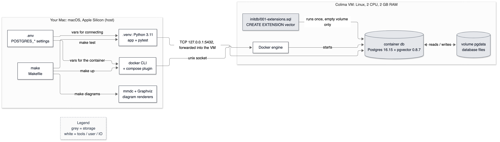

# 03 — Environment and infrastructure

**Status:** written in Phase 0 (2026-10-02). Owns: container, VM, image, volume, Docker Compose, Colima, port binding, Postgres roles and auth, extensions, pgvector (the extension itself), environment variables, virtualenv, pinning, Make, healthcheck, idempotency, autocommit.

> Every command in this doc was run on the build machine (Apple M1, 8 GB RAM, macOS 27) and the output pasted from that run.

---

## 1. In one paragraph

Before cooking you set up the kitchen: same oven, same measuring cups, same recipe card, every time. This doc is the kitchen. **Postgres** — the database that will hold every chunk, vector and keyword index — runs inside a **container**: a sealed box holding exactly the Postgres version we tested, with the **pgvector** extension already inside. Because containers need a Linux computer and a Mac is not one, a small Linux virtual machine called **Colima** runs in the background to host the box. A **Makefile** is the recipe card (`make up`, `make test`), and one **`.env`** file is the settings sheet that both the database and our Python code read from, so they can never disagree.

## 2. Why it exists

Without this layer, concretely:

- **"Works on my machine."** Installing Postgres with Homebrew gives whatever version is current on the day you install it, and pgvector must then be compiled against that exact version. Two laptops a month apart end up with different databases and different bugs.
- **Results stop being reproducible.** The project's main deliverable is numbers. If the database or a Python package version shifts between runs, a change in recall@5 could be the code, or could be the environment. Pinning everything (the image down to its digest, every package with `==`) removes the second explanation.
- **Setup becomes a wiki page.** One `make up` replaces "install Postgres, create a user, create a database, install pgvector, enable the extension".
- **Mistakes are disposable.** `make db-reset` throws the database away and the next `make up` recreates it from scratch in about six seconds.

## 3. Where it sits

Everything stored by the system lives in the highlighted box; everything in this doc exists to run it reliably.


<details><summary>Same diagram as text (for terminal viewing)</summary>

```text
 OFFLINE
 ┌───────────┐  ┌───────┐  ┌───────┐  ┌───────┐   ╔═════════════════════════════╗
 │ PDF files │─▶│ Parse │─▶│ Chunk │─▶│ Embed │──▶║ Postgres 16                 ║
 └───────────┘  └───────┘  └───────┘  └───────┘   ║ pgvector + full-text search ║
                                                  ╚══════════════╤══════════════╝
 ONLINE                                                          │ searched by
 ┌───────────┐  ┌─────────┐     query     ┌──────────────────────▼──────────────┐
 │ Streamlit │─▶│ FastAPI │──────────────▶│ Vector search  +  Keyword search    │
 └─────▲─────┘  └──┬───▲──┘               └──────────────────────┬──────────────┘
       │    SSE    │   │ answer tokens                           │ two ranked lists
       └───────────┘   │                                         ▼
               ┌───────┴──────┐  ┌────────────────────┐  ┌────────┐  ┌────────────┐
               │ LLM (Gemini) │◀─│ Prompt + citations │◀─│ Rerank │◀─│ RRF fusion │
               └──────────────┘  └────────────────────┘  └────────┘  └────────────┘

 Double-line box (╔═╗) = the part this doc explains: the Postgres database and the
 environment it runs in.
```
</details>

## 4. The flow



<details><summary>Same diagram as text (for terminal viewing)</summary>

```text
 ┌─ YOUR MAC (host: macOS, Apple Silicon) ──────────────────────────────────────────────┐
 │                                                                                      │
 │  ┌──────────────┐ make diagrams ┌───────────────────┐                                │
 │  │ make         │ ────────────▶ │ mmdc + Graphviz   │                                │
 │  │ (Makefile)   │               │ diagram renderers │                                │
 │  └──┬────────┬──┘               └───────────────────┘                                │
 │     │        │ make test                                                             │
 │     │        ▼                                                                       │
 │     │   ┌────────────────────┐  vars for connecting  ┌─────────────────────┐         │
 │     │   │ .venv: Python 3.11 │ ◀──────────────────── │ .env                │         │
 │     │   │ app + pytest       │                       │ POSTGRES_* settings │         │
 │     │   └──────────┬─────────┘                       └──────────┬──────────┘         │
 │     │ make up      │                                            │ vars for the       │
 │     ▼              │                                            │ container          │
 │  ┌────────────┐    │                                            │                    │
 │  │ docker CLI │ ◀──┼────────────────────────────────────────────┘                    │
 │  │ + compose  │    │                                                                 │
 │  └─────┬──────┘    │ TCP 127.0.0.1:5432                                              │
 └────────┼───────────┼─────────────────────────────────────────────────────────────────┘
          │ unix      │ port forward
          │ socket    │ into the VM
 ┌─ COLIMA VM (Linux, 2 CPU, 2 GB RAM) ─────────────────────────────────────────────────┐
 │        ▼           │                                                                 │
 │  ┌─────────────┐   │                                                                 │
 │  │ Docker      │   │                                                                 │
 │  │ engine      │   │                                                                 │
 │  └─────┬───────┘   ▼                                                                 │
 │        │ starts ┌──────────────────────────────┐ reads /  ┌──────────────────┐        │
 │        └───────▶│ container db                 │ writes   │ volume pgdata    │        │
 │                 │ Postgres 16.15 +             │ ◀──────▶ │ database files   │        │
 │                 │ pgvector 0.8.7               │          └──────────────────┘        │
 │                 └──────────────▲───────────────┘                                     │
 │                                │ runs once, empty volume only                        │
 │                 ┌──────────────┴───────────────┐                                     │
 │                 │ initdb/001-extensions.sql    │                                     │
 │                 │ CREATE EXTENSION vector      │                                     │
 │                 └──────────────────────────────┘                                     │
 └──────────────────────────────────────────────────────────────────────────────────────┘
 Legend (colours appear in the image): grey = storage · white = tools / user / IO
```
</details>

What happens when you type `make up`, then `make test`:

1. **`make up` checks for `.env`.** If it's missing, Make copies `.env.example` to `.env`. (Make only runs that rule when the file doesn't exist.)
2. **It checks Docker is reachable** with `docker info`. If Colima isn't running you get a one-line fix instead of a wall of socket errors.
3. **`docker compose up -d --wait`** reads `docker-compose.yml`, substitutes the `POSTGRES_*` values from `.env`, and sends the request to the Docker engine inside the Colima VM over a **unix socket** (a file that acts like a network connection between programs on one machine).
4. **The engine starts the `db` container** from the pinned image, attaches the `pgdata` volume and publishes port 5432 on `127.0.0.1`.
5. **First start only:** the volume is empty, so Postgres initialises a fresh database and runs every file in `docker/initdb/` — ours enables pgvector. On every later start the volume already holds a database and the scripts are skipped.
6. **`--wait` blocks until the healthcheck passes** (`pg_isready` says Postgres accepts connections), so the next command never races a half-started database.
7. **`make test`** runs pytest from `.venv`. `app/config.py` reads the same `.env`, and `app/store/db.py` connects over TCP to `127.0.0.1:5432`, which Colima forwards into the VM and Docker forwards into the container.

## 5. The code

### 5.1 `docker-compose.yml` — the database, declared

```yaml
    image: pgvector/pgvector:0.8.7-pg16-bookworm@sha256:7b822b0aac60967beb1ea5e576b8602c94c300a157d187f385ae3e0da199b90a
```

Pinned twice. The **tag** (`0.8.7-pg16-bookworm`) is a human-readable label: pgvector 0.8.7, Postgres 16, Debian "bookworm". Tags can be moved — the publisher can push a new image under the same tag (for example to ship a Postgres security patch). The **digest** (`sha256:7b82…`) is a hash of the image's content, so it can never point at different bytes. With both, a reader sees what we meant and Docker guarantees what we get. Without the digest, two machines pulling a month apart could silently get different Postgres minor versions.

```yaml
      POSTGRES_PASSWORD: ${POSTGRES_PASSWORD:?set POSTGRES_PASSWORD in .env (copy .env.example)}
```

`${VAR:?message}` means "substitute VAR; if it is unset or empty, refuse to start and print the message". Without the `?`, a missing `.env` would give an empty string — and the Postgres image refuses an empty password with a less obvious error.

```yaml
      - "127.0.0.1:${POSTGRES_PORT:-5432}:5432"
```

Publish container port 5432 on the host, **bound to 127.0.0.1 only**. A bare `"5432:5432"` binds `0.0.0.0` — every network interface — so anyone on the same café Wi-Fi could try to log in. `${POSTGRES_PORT:-5432}` uses 5432 unless `.env` says otherwise (useful if the port is taken, see §8).

```yaml
      - pgdata:/var/lib/postgresql/data
      - ./docker/initdb:/docker-entrypoint-initdb.d:ro
```

The first line mounts a **named volume** where Postgres keeps its data files, so data survives `make down` and container re-creation. The second mounts our init scripts read-only (`:ro`) where the official image looks for them.

```yaml
    healthcheck:
      test: ["CMD-SHELL", "pg_isready -U \"$${POSTGRES_USER}\" -d \"$${POSTGRES_DB}\""]
```

A running container is not the same as a ready database — Postgres takes a moment to start accepting connections. `pg_isready` checks the latter. `$$` is Compose's escape for a literal `$`, so the variable is expanded *inside the container* at check time, not by Compose when reading the file.

### 5.2 `docker/initdb/001-extensions.sql`

```sql
CREATE EXTENSION IF NOT EXISTS vector;
```

pgvector is *installed* in the image, but like every Postgres extension it must be *enabled* per database before the `vector` type exists. `IF NOT EXISTS` makes the statement **idempotent** — running it twice is harmless — which matters because Phase 4's migrations will run it again. The file's header comment records the most surprising fact about it: it runs **once**, on an empty volume, and never again.

### 5.3 `.env.example` → `.env`

```text
POSTGRES_HOST=127.0.0.1
POSTGRES_PORT=5432
POSTGRES_DB=rag
POSTGRES_USER=rag
POSTGRES_PASSWORD=rag_local_dev_only
```

`.env.example` is committed; `.env` is git-ignored. Docker Compose reads `.env` automatically for `${…}` substitution, and `app/config.py` reads the same file. One file, two readers, zero chance of the app and the database disagreeing about the password. The values are local-only: the port is bound to 127.0.0.1.

### 5.4 `Makefile` — the recipe card

```make
STAMP := $(VENV)/.requirements-installed

$(STAMP): requirements.txt
	test -x $(PY) || $(PYTHON_BIN) -m venv $(VENV)
	$(PY) -m pip install --quiet --upgrade pip==26.2.1
	$(PY) -m pip install --quiet -r requirements.txt
	touch $(STAMP)
```

Make rebuilds a target when it is older than its prerequisites. Here the target is a **stamp file**: an empty file whose only job is to record *when* requirements were last installed. Edit `requirements.txt` and the stamp is older, so the next `make test` reinstalls. Why not use `.venv/bin/python` itself as the target? It is a **symlink** to the system Python, and `touch` follows symlinks — it would change the timestamp of the system interpreter, not the venv.

`PYTHON_BIN ?= python3.11` — on this machine plain `python3` is 3.14. Naming the version explicitly is what keeps the venv on 3.11.

```make
.env:
	cp .env.example .env
```

A **file target** with no prerequisites: Make runs it only if `.env` does not exist, so it never overwrites your edited file.

```make
up: .env ## Start Postgres + pgvector and wait until it accepts connections
	@docker info >/dev/null 2>&1 || { echo "Docker is not running. Start it with: colima start"; exit 1; }
	docker compose up -d --wait
```

The `docker info` probe turns Docker's raw socket error into the one fix you need (real output in §8). `-d` runs the container in the background; `--wait` blocks until the healthcheck passes.

```make
psql: ## Open a psql shell inside the database container
	docker compose exec db sh -c 'psql -U "$$POSTGRES_USER" -d "$$POSTGRES_DB"'
```

`$$` in a Makefile is a literal `$`, so `$POSTGRES_USER` reaches the container's shell, which knows the value from its environment. The host's shell may not.

```make
test: install up ## Run the full test suite (starts Postgres if needed)
```

Prerequisites chain: `make test` installs requirements if needed and starts the database if needed. `make up` is cheap when the database is already up (0.67 s measured, §10).

### 5.5 `app/config.py` — one typed settings object

```python
REPO_ROOT = Path(__file__).resolve().parents[1]

class Settings(BaseSettings):
    model_config = SettingsConfigDict(
        env_file=REPO_ROOT / ".env",
        env_file_encoding="utf-8",
        extra="ignore",
    )
```

`BaseSettings` (from **pydantic-settings**) reads each field from an environment variable of the same name (case-insensitive), falling back to `.env`, and **converts types**: `POSTGRES_PORT=6543` arrives as the integer `6543`, and `POSTGRES_PORT=abc` fails at startup instead of deep inside a connection call. The `env_file` path is built from `__file__`, not the current directory: run pytest from `tests/` or from an IDE and it still finds the repo's `.env`. `extra="ignore"` lets `.env` hold keys meant only for Docker without crashing the app.

```python
    postgres_password: str = Field(repr=False)
```

No default, so a missing password fails at startup with a clear message (§8). `repr=False` keeps it out of `print(settings)`, logs and error reports — verified by `tests/test_config.py::test_password_never_appears_in_repr`.

```python
@lru_cache(maxsize=1)
def get_settings() -> Settings:
    return Settings()
```

Read the environment once per process and share the object. Every caller sees the same settings, and tests can still build their own `Settings(...)` directly.

### 5.6 `app/store/db.py` — opening a connection

```python
    return psycopg.connect(
        host=s.postgres_host,
        port=s.postgres_port,
        dbname=s.postgres_db,
        user=s.postgres_user,
        password=s.postgres_password,
        connect_timeout=5,
        application_name="rag-assistant",
        **kwargs,
    )
```

- **Keyword arguments, not a URL.** A URL like `postgresql://rag:p@ss@host/db` breaks the moment a password contains `@`, `:` or `/` unless you percent-encode it. Keyword arguments need no escaping.
- **`connect_timeout=5`.** Without it, a connection to a stopped or unreachable server can hang far longer than you'd wait. Five seconds turns "hang" into "error".
- **`application_name`.** Postgres records it per session in `pg_stat_activity`, so when Phase 10 has many connections you can tell ours apart from `psql`. Tested by `test_connections_identify_themselves`.

### 5.7 `tests/conftest.py` and `tests/test_db_smoke.py`

```python
        connection = connect(autocommit=True)
    except psycopg.OperationalError as exc:
        pytest.fail(f"Cannot reach Postgres at ... Start it with `make up`. ...", pytrace=False)
```

- **`autocommit=True`.** By default psycopg starts a transaction and every statement joins it. One failing statement then poisons the whole transaction. Real output from this database, autocommit off:

  ```text
  first error : DataException - different vector dimensions 3 and 2
  next query  : InFailedSqlTransaction - current transaction is aborted, commands ignored until end of transaction block
  ```

  With a shared test connection, one test that *expects* an error would make every later test fail. Autocommit makes each statement its own transaction.
- **Fail, don't skip.** If the database is down, the fixture fails loudly. A skipped database test shows up as "passed with skips" and proves nothing.

The smoke tests check behaviour against **hand-computed values**, not just "does it run":

| Test | Query | Hand calculation |
|---|---|---|
| L2 distance | `'[1,2,3]' <-> '[4,5,6]'` | √(3²+3²+3²) = √27 ≈ 5.196 |
| cosine distance, perpendicular | `'[1,0]' <=> '[0,1]'` | cos 90° = 0 → distance 1 − 0 = 1 |
| cosine distance, same direction | `'[1,2,3]' <=> '[2,4,6]'` | parallel → cos = 1 → distance 0 (length is ignored) |
| negative inner product | `'[1,2,3]' <#> '[4,5,6]'` | 1·4 + 2·5 + 3·6 = 32 → returns −32 |
| dimension mismatch | `'[1,2,3]' <-> '[1,2]'` | must raise `different vector dimensions 3 and 2` |
| English full-text search | `to_tsvector('english', 'The runners were running')` | stop words dropped, stems kept: `'run':4 'runner':2` |
| wrong password rejected | connect with a wrong password | must raise `password authentication failed` |

Why `<#>` returns −32 rather than 32: every pgvector operator is a *distance*, where smaller means closer, so `ORDER BY … ASC LIMIT k` always means "nearest first". Negating the inner product keeps that rule true for it too. What these distances *mean* for embeddings is owned by [07-embeddings.md](07-embeddings.md).

### 5.8 Docs tooling: how diagrams and cards stay honest

- **`scripts/render_diagrams.sh`** renders every `docs/diagrams/src/*.mmd` (and `*.dot`) to SVG and PNG. It starts with `set -euo pipefail` (stop on any error, on unset variables, and on failures inside pipes), deletes old outputs *before* rendering so a failed render can't leave a stale image that still passes "file exists", checks every output is non-empty (`[ -s file ]`), and writes `out/manifest.tsv` with a sha256 of each source. `tests/test_docs_integrity.py` recomputes the hashes, so editing a diagram without re-rendering fails `make test`.
- **`scripts/where_it_sits.py`** generates each doc's "where it sits" diagram from the one architecture source plus a two-column table (`docs/diagrams/where-it-sits.tsv`), so twenty highlighted copies can never drift from the real architecture. An unknown node id raises an error instead of quietly highlighting nothing.
- **`scripts/collect_cards.py`** copies every Decision Card (wrapped in `<!-- card:start id=… -->` markers) into `docs/interview/09-tradeoff-cards.md`. A test checks the copy is exact.

### 5.9 `requirements.txt` — pinning

```text
psycopg==3.3.6            # Phase 0: Postgres driver (plain SQL, no ORM)
...
pydantic_core==2.46.5     # via pydantic
```

Every package is pinned with `==`, including **transitive dependencies** — packages we never import ourselves but that our packages import (pydantic-settings needs pydantic, which needs pydantic_core). Pinning only direct dependencies leaves the transitive ones free to change underneath you.

## 6. Data in / data out

**`.env` in → `Settings` out** (real `print(get_settings())`):

```text
postgres_host='127.0.0.1' postgres_port=5432 postgres_db='rag' postgres_user='rag'
```

The password field exists but is absent from the printout — `repr=False` at work. `postgres_port` is an `int`, not the string `"5432"`.

**`make up` in → a healthy container out** (`docker compose ps`):

```text
NAME                 IMAGE                                                                                                           STATUS                   PORTS
rag-assistant-db-1   pgvector/pgvector:0.8.7-pg16-bookworm@sha256:7b822b0aac60967beb1ea5e576b8602c94c300a157d187f385ae3e0da199b90a   Up 5 seconds (healthy)   127.0.0.1:5432->5432/tcp
```

- `NAME` — Compose names containers `<project>-<service>-<n>`; the project name comes from `name: rag-assistant`.
- `STATUS … (healthy)` — the healthcheck has passed; without a healthcheck you'd only ever see `Up`.
- `PORTS 127.0.0.1:5432->5432/tcp` — host address and port → container port. The `127.0.0.1` is the proof the database is not exposed to the network.

**What the server says about itself** (`SELECT version()`):

```text
PostgreSQL 16.15 (Debian 16.15-1.pgdg12+2) on aarch64-unknown-linux-gnu, compiled by gcc (Debian 12.2.0-14+deb12u1) 12.2.0, 64-bit
```

`aarch64` = 64-bit ARM: the image is native to Apple Silicon, so nothing runs under slow emulation.

**Extensions in our database** (`\dx` inside `make psql`):

```text
  Name   | Version |   Schema   |                     Description
---------+---------+------------+------------------------------------------------------
 plpgsql | 1.0     | pg_catalog | PL/pgSQL procedural language
 vector  | 0.8.7   | public     | vector data type and ivfflat and hnsw access methods
```

**Who may connect, and how** — the image's generated `pg_hba.conf` (comments removed):

```text
local   all             all                                     trust
host    all             all             127.0.0.1/32            trust
host    all             all             ::1/128                 trust
...
host all all all scram-sha-256
```

Rules are checked top to bottom; the first match wins. Connections from *inside* the container (its own loopback) are trusted without a password. Ours arrive from the Docker bridge network — the server sees our address as `172.18.0.1` (`SELECT inet_client_addr()`) — so they fall through to the last line and must prove the password with **SCRAM-SHA-256**. `test_wrong_password_is_rejected` locks that in.

## 7. Decisions & alternatives

<!-- card:start id=39 -->
#### Decision: Docker Compose for Postgres; the app runs on the host  (rejected: managed Postgres, bare-metal/Homebrew Postgres, Kubernetes)

**One-line defence.** Compose gives every machine the exact same Postgres 16.15 + pgvector 0.8.7, pinned by digest, in one command with nothing installed on the host — and the same image runs anywhere later.

**What problem is this even solving?** The project needs a Postgres with a specific extension at a specific version, reproducibly, on a laptop, and disposable when experiments go wrong. Delete this decision and each developer installs and configures Postgres by hand — version drift and a setup wiki page.

**The options, compared.**

| Option | How it works (1 line) | Strengths | Weaknesses | When it's the right call |
|---|---|---|---|---|
| ✅ Docker Compose, app on host | A YAML file declares the database container; the Python app runs in a local venv | Exact pinned image; one command; isolated from the host; `make db-reset` gives a fresh database in seconds; fast edit-run-debug loop for the app | macOS needs a Linux VM (memory overhead, an extra moving part); not production-grade — no backups, no high availability; data lives inside a VM disk | Local development and CI |
| Managed Postgres (RDS, Cloud SQL, Neon, Supabase…) | A cloud provider runs Postgres for you | Backups, failover, upgrades, monitoring done for you | Costs money; network latency from a laptop; needs internet; credentials to manage; the provider's pgvector version may lag | Production; teams without DBAs |
| Bare metal / Homebrew on the host | Install Postgres natively and build pgvector against it | No VM overhead; native speed | pgvector must match the Postgres build; versions drift per machine; pollutes the host | Dedicated servers run by people who manage them |
| Kubernetes + a Postgres operator | Postgres as a managed workload on a cluster | Production-grade orchestration and failover | Huge overkill on a laptop; steep learning curve | Platform teams already on Kubernetes |

**What would actually change if we swapped it.** To managed Postgres: `.env` points at a remote host and adds `sslmode=require`; `docker-compose.yml` and `docker/initdb/` go away (the extension is enabled by a migration instead); tests hit a shared remote database, so they need isolated schemas or a disposable branch database; every query pays internet latency (not measured); monthly cost appears. About half a day of work plus ongoing cost. To Homebrew: `brew install postgresql@16`, then build pgvector from source against that install's `pg_config`; every developer repeats it, and versions drift as Homebrew updates. One hour per machine, forever.

**The decision rule.** Containers for development and CI, because they are reproducible and disposable. Managed services for production, unless you have people to run databases *and* a reason — cost at scale, compliance, a feature the provider lacks — to self-host. Bare metal when performance or control justify the operations burden.

**Where our choice breaks.** The moment anyone other than the developer depends on this database: there are no backups, no failover, and the data sits inside a VM disk that `colima delete` would erase. Migration path: managed Postgres with pgvector for anything shared; keep Compose for development; enable the extension and create tables with migrations (Phase 4) so both environments are built the same way.

**The number.** `make up`: 0.67 s when already running, 5.76 s from stopped, 5.73 s on a brand-new volume (initdb included). Image: 157 MB download, 650 MB on disk. Colima VM: 2 CPU, 2 GB RAM; first start 13 min 17 s (almost all of it downloading the VM image on this connection), later starts 44 s. Commands in §10.

**Interview script (3 sentences).** "Postgres runs in Docker Compose, pinned by image digest, so every machine gets exactly Postgres 16.15 with pgvector 0.8.7 from one command. The app runs on the host for a fast edit-and-debug loop. In production I'd use managed Postgres with pgvector and keep Compose for development and CI."

**Follow-ups they will ask:**
- Q: Why not put the app in Docker too? → A: During development the app changes every few minutes; running it natively gives instant restarts and a normal debugger. It has no system dependencies beyond Python wheels. A production image for the app comes with deployment in Phase 16.
- Q: What's the difference between a container and a VM? → A: A VM emulates a whole computer and runs its own kernel; a container is ordinary processes on the host's kernel, isolated with namespaces (what they can see) and cgroups (what they can use). That's why containers start in about a second and why Linux containers on macOS need a Linux VM underneath.
- Q: How do you guarantee everyone gets the same database? → A: Image pinned by digest, extension enabled by a checked-in script, and from Phase 4 the schema built by migrations. Same inputs, same database.
- Q: How would you deploy this for real? → A: Managed Postgres with pgvector, the app as a container on a platform such as ECS or Cloud Run, secrets in a secrets manager instead of `.env`, migrations run in CI before each deploy.
- Q (the hard one): Your data lives in a volume inside a VM. What happens if the VM is deleted? → A (honest): The data is gone. Here that's acceptable because everything in the database can be rebuilt from the PDFs with `make ingest`. Anything holding data that *can't* be re-derived needs backups — `pg_dump` at minimum, point-in-time recovery for production.
- Q: Why does `make up` take ~6 s when Postgres itself starts faster? → A: Most of it is waiting for the healthcheck to report healthy (it polls every 2 s), not Postgres startup. I chose correctness — never racing a half-started database — over shaving seconds.

**The trap.** "It's in Docker, so it's production-ready." Compose on a laptop gives reproducibility, not reliability: no backups, no failover, no monitoring. Interviewers probe exactly this gap.
<!-- card:end -->

<!-- card:start id=15 -->
#### Decision: Postgres + pgvector as the only datastore  (rejected: Pinecone, Qdrant, Weaviate, Milvus, FAISS, Elasticsearch/OpenSearch)

**One-line defence.** At about ten documents and one user, one Postgres holding chunk text, vectors, the full-text index and metadata beats running a second system: one transaction per document update, SQL filters and joins, and both halves of hybrid search in one database.

**What problem is this even solving?** Vector search needs somewhere to store vectors and an index to find nearest neighbours fast. Delete this component and every query compares the question vector against every chunk in Python — fine for 1,000 chunks, hopeless for 10 million. The real question is *where* that index lives: inside the database that already holds the text, or in a separate system.

**The options, compared.**

| Option | How it works (1 line) | Strengths | Weaknesses | When it's the right call |
|---|---|---|---|---|
| ✅ Postgres + pgvector | Extension adding a `vector` type, distance operators and HNSW / IVFFlat indexes to Postgres | One system; ACID transactions across text, vectors and metadata; SQL joins and filters; native full-text search for hybrid; mature backups and replicas; open source | Vector index scales vertically on one node (no built-in sharding); HNSW builds need memory; filtered approximate search needs care; fewer vector-specific features | Small-to-medium corpora; teams already on Postgres; when transactions with metadata matter |
| Pinecone | Proprietary, fully managed vector database as a service | No operations; scales for you | Data leaves your infrastructure; vendor lock-in; per-usage cost; metadata lives in a second system; no SQL | Teams without database operations, large scale, SaaS acceptable |
| Qdrant | Open-source vector database (written in Rust) with rich payload filtering | Fast filtered vector search; quantisation; self-host or cloud | A second system to keep consistent; no SQL joins | Vector-heavy workloads with complex filters |
| Weaviate | Open-source vector database with built-in keyword + vector hybrid search | Hybrid search built in; pluggable vectoriser modules | Heavier to run; another API to learn; still a second system | Teams that want hybrid search off the shelf |
| Milvus | Open-source distributed vector database aimed at very large scale | Horizontal scale-out; many index types including GPU | Operationally heavy in distributed mode (several supporting services) | Billion-vector scale |
| FAISS | A library (from Meta) for in-memory similarity search — not a database | Very fast; many index types; GPU support | No persistence, transactions, filtering or server — you build all of that | Research, offline batch jobs, static data embedded in a service |
| Elasticsearch / OpenSearch | Search engine with BM25 keyword ranking plus dense-vector fields | Best-in-class keyword ranking and analysers; mature scale-out; hybrid in one system | JVM cluster, memory-hungry (matters on an 8 GB laptop); separate from the source-of-truth database; near-real-time (index refresh) rather than transactional | Search-first products, or teams already running it |

**What would actually change if we swapped it.** To Qdrant (keeping Postgres for text and metadata): a second container competing for the laptop's 8 GB; `app/store/` gains a Qdrant client; ingestion writes to two stores with no shared transaction, so it needs idempotent upserts keyed by chunk id plus a reconciliation job for partial failures; metadata filters are duplicated into Qdrant payloads; hybrid search either moves to Qdrant's sparse vectors or fuses results across two systems in Python. About two to three days, plus a permanent consistency burden. To Pinecone: the same, plus an API key, per-query cost and network latency on every search (not measured).

**The decision rule.** Use a vector extension on your existing relational database when vectors are one feature among several and the index fits on one node. Use a dedicated vector database when vector search *is* the workload — very large vector counts, high query rates, or needs like sharding and large-scale multi-tenancy that the extension doesn't cover. The crossover is usually reached when the index no longer fits one node's memory, or when vector query volume needs horizontal scale.

**Where our choice breaks.** Back-of-envelope (arithmetic, not measurement): a 384-dimension vector stored as 4-byte floats is 384 × 4 = 1,536 bytes. One million vectors ≈ 1.5 GB before index overhead — one node is fine. A hundred million ≈ 154 GB — past the point where one node keeps the HNSW graph in memory comfortably. Migration path: read replicas first; then partition by document set or tenant; then a dedicated vector database with Postgres kept as the source of truth and changes streamed across.

**The number.** Phase 0: pgvector 0.8.7 on Postgres 16.15, verified by `tests/test_db_smoke.py`. Search latency and recall: not yet measured — Phase 5 (`docs/09-vector-search.md`) measures approximate vs exact search on our corpus.

**Interview script (3 sentences).** "Everything lives in Postgres with pgvector: chunk text, vectors, the full-text index and metadata. That means a document update is one transaction and filters are plain SQL, and both halves of hybrid search sit in one database. A dedicated vector DB earns its keep at hundreds of millions of vectors or very high query rates — at about ten documents it would only add a consistency problem."

**Follow-ups they will ask:**
- Q: How far can pgvector scale? → A (honest): It depends on dimensions, memory and index parameters, and I've only measured my own corpus. The arithmetic says one million 384-dimension float vectors is about 1.5 GB raw, comfortably one node; a hundred million is about 154 GB, which is where I'd look at half-precision vectors, partitioning, or a dedicated system.
- Q: FAISS is faster — why not use it? → A: FAISS is a library, not a database. I'd have to build persistence, filtering, updates, concurrency and backups around it — which is what Postgres already gives me.
- Q: Isn't Elasticsearch's BM25 better than Postgres full-text ranking? → A: Probably, for ranking quality — Postgres `ts_rank` is not BM25 and lacks its length normalisation. Whether that matters *on our data* is card #21, measured in Phase 6. Running a JVM cluster on an 8 GB laptop has a real memory cost.
- Q: What happens when you filter, e.g. `WHERE company = 'X'`, on an approximate index? → A: The index finds the nearest vectors first and the filter removes rows afterwards, so you can get fewer than k results — a recall cliff. pgvector 0.8 added iterative index scans to keep searching until enough rows pass the filter. Card #18, Phase 5.
- Q (the hard one): What happens to the HNSW index when rows are deleted or updated? → A (honest): Postgres doesn't delete rows in place — an update writes a new row version and the old one becomes dead until VACUUM cleans it up, and index entries pointing at dead rows are cleaned then too. I'm not sure of the exact graph-repair mechanics inside pgvector's HNSW implementation; I'd read its source and docs before claiming more.
- Q: Why not Pinecone and skip the operations work? → A: For a company already on a cloud with no database people, that's a defensible trade. Here the documents stay local, there's no per-query bill, and the eval harness can run a whole ablation matrix without network calls.

**The trap.** Either "vector databases are always faster, so use one" or "pgvector doesn't scale" — both without numbers. The defensible answer is about workload size and the cost of keeping two systems consistent.
<!-- card:end -->

<!-- card:start id=x-colima -->
#### Decision: Colima as the Docker runtime on macOS  (rejected: Docker Desktop, OrbStack, Podman)

**One-line defence.** Colima is open source, installed and driven entirely from the command line, and lets me cap the Linux VM at 2 CPUs and 2 GB — which matters on an 8 GB laptop that also has to run embedding models.

**What problem is this even solving?** Linux containers need a Linux kernel and macOS doesn't have one, so *something* must run a Linux VM and a Docker engine inside it. Remove the runtime and `docker compose up` has nothing to talk to.

**The options, compared.**

| Option | How it works (1 line) | Strengths | Weaknesses | When it's the right call |
|---|---|---|---|---|
| ✅ Colima | Open-source CLI that runs a Lima Linux VM with Docker inside | Free and open source; scriptable install; explicit CPU/RAM/disk caps; standard `docker` CLI | No GUI; one more thing to start after a reboot; occasional VM networking quirks | Developers comfortable in a terminal, resource-constrained machines |
| Docker Desktop | Docker's official desktop app (GUI + VM + engine) | Most widely used and documented; GUI dashboard; extensions | Licence terms require a paid plan for larger companies; GUI-driven setup | Teams standardised on it, users who want a GUI |
| OrbStack | Commercial macOS-native container and VM app | Fast and light by reputation; polished | Paid licence for business use; closed source | Mac developers who value polish and speed |
| Podman | Daemonless, rootless container engine from Red Hat | No root daemon; good security story | Compose compatibility via extra tooling; small behaviour differences from Docker | Security-sensitive or Red Hat environments |

**What would actually change if we swapped it.** Almost nothing in the repo: `docker-compose.yml` and the Makefile are runtime-agnostic. The `up` target's hint ("Start it with: colima start") would change. Docker Desktop would add a GUI install and licence check; Podman might need small Compose adjustments. Under an hour.

**The decision rule.** Pick the runtime your team already uses; on a personal machine with limited memory, pick one that lets you cap resources and install from the command line.

**Where our choice breaks.** In a team where everyone else uses Docker Desktop and shares its GUI-based settings, being the odd one out costs more than Colima saves.

**The number.** VM: 2 CPU, 2 GB RAM (Docker reports `mem=2054766592` bytes), 10 GB disk cap. First start 13 min 17 s — almost all of it downloading the VM image over this connection. Later starts 44 s. `~/.colima` uses 1.8 GB on disk.

**Interview script (3 sentences).** "On macOS, Linux containers need a Linux VM; I used Colima because it's open source, scriptable, and lets me cap the VM at 2 GB on an 8 GB machine. The compose file doesn't care which runtime runs it. In a team I'd use whatever the team uses."

**Follow-ups they will ask:**
- Q: Why do containers need a VM on a Mac at all? → A: A container is processes sharing the host's kernel. Our image is Linux, and the macOS kernel isn't Linux, so the Linux processes need a Linux kernel to run on — the VM provides it.
- Q: Does the VM slow the database down? → A: Some overhead, yes, especially on file I/O across the VM boundary — but the database files live on the VM's own disk, not a shared folder, which avoids the worst case. I haven't benchmarked it against native.
- Q: What happens to the database after a reboot? → A: The VM stops; `colima start` brings it back (44 s measured) and the data is still in the volume. The `make up` probe tells you if you forgot.
- Q: Is 2 GB enough for Postgres? → A: For this corpus, yes: the default `shared_buffers` is 128 MB and our data is small. Building an HNSW index on much more data would need more `maintenance_work_mem` (64 MB by default) and possibly more VM memory.
- Q (the hard one): Your first `docker pull` failed with a TLS handshake timeout. Why, and how do you make that robust? → A (honest): It happened on a registry request after the layers had downloaded, on a slow connection; a retry succeeded with the layers already cached. For CI I'd pull through a registry mirror or cache, and retry pulls with backoff. I don't know exactly which registry call was slow beyond what the error said.

**The trap.** "Docker runs natively on Mac." It doesn't — Linux containers always run inside a Linux VM on macOS, whichever app you use. Not knowing that suggests you've never debugged one.
<!-- card:end -->

<!-- card:start id=x-psycopg-plain-sql -->
#### Decision: psycopg 3 with hand-written SQL  (rejected: psycopg2, asyncpg, SQLAlchemy ORM)

**One-line defence.** The SQL *is* the retrieval algorithm in this project — vector distance, full-text rank, filters — so it should be written and read directly, and psycopg 3 is the maintained driver that supports both sync and async code.

**What problem is this even solving?** Python needs a driver to talk to Postgres, and the code needs some way to express queries. Delete the decision and there's no database access at all; make it badly and the retrieval logic hides behind an abstraction you can't tune.

**The options, compared.**

| Option | How it works (1 line) | Strengths | Weaknesses | When it's the right call |
|---|---|---|---|---|
| ✅ psycopg 3 + plain SQL | The current major version of the standard Postgres driver; we write SQL strings with bound parameters | Sync and async in one library; server-side parameter binding; pgvector's Python adapter supports it; every query visible in the code and docs | We write and maintain SQL by hand; no automatic migrations; easy to repeat boilerplate | When queries are the product and must be tuned with `EXPLAIN` |
| psycopg2 | The long-standing previous major version | Extremely mature; everywhere | Previous generation; no native async | Legacy codebases |
| asyncpg | High-performance asyncio-only driver with its own API | Very fast async | Not the standard Python database API; async-only; different parameter style | High-throughput async services |
| SQLAlchemy ORM | Map tables to Python classes; queries built in Python | Migrations (with Alembic), relationships, portable across databases | Hides the SQL we need to tune; vector and full-text features need extra types; one more layer to learn | CRUD-heavy apps with many tables |

**What would actually change if we swapped it.** To SQLAlchemy: table definitions become Python classes; queries become builder expressions; `EXPLAIN ANALYZE` output in Phase 5 docs would need the generated SQL printed first; vector columns need the pgvector SQLAlchemy type. A day of rework, and every retrieval doc gets one step further from the SQL that actually runs. To asyncpg: every call site becomes async, and parameters change from `%s` to `$1`.

**The decision rule.** Use an ORM when most of your code is create/read/update/delete over many related tables. Write SQL when a few performance-critical queries *are* the product. Mixing is fine: ORM for admin tables, raw SQL for hot paths.

**Where our choice breaks.** If the schema grows to dozens of tables with relationships (users, teams, permissions), hand-written SQL for all of it becomes tedious and error-prone. Migration path: SQLAlchemy Core or an ORM for those tables, raw SQL kept for retrieval.

**The number.** Not a performance decision at this scale; the driver's overhead will be one line of the Phase 13 latency waterfall.

**Interview script (3 sentences).** "I used psycopg 3 with hand-written SQL because the SQL is the retrieval logic — distance operators, ranking functions, filters — and I need to read it, `EXPLAIN` it and tune it directly. psycopg 3 supports both sync and async in one maintained library. If the app grew lots of ordinary CRUD tables, I'd add an ORM for those and keep raw SQL for retrieval."

**Follow-ups they will ask:**
- Q: How do you prevent SQL injection without an ORM? → A: Values always travel as bound parameters (`%s` placeholders filled by the driver), never by string formatting. Phase 14 tests it with malicious filter values.
- Q: How will you manage schema changes? → A: Numbered SQL migration files applied in order and recorded in a table (Phase 4). That's what a migration tool automates; at our size, a short script does it.
- Q: Why sync code if FastAPI is async? → A: Phase 10 decides that with measurements (card #32). psycopg 3 supports both, so the choice doesn't lock us in.
- Q: What's server-side binding? → A: The query text and the values are sent to Postgres separately, so values can never be parsed as SQL. psycopg2 interpolated values into the query on the client side (safely escaped); psycopg 3 sends them separately.
- Q (the hard one): How do you test SQL without an ORM's abstractions? → A: Against a real Postgres — the same one `make up` starts — with hand-computed expected values, like the smoke tests. Mocking the database would test my mock, not my SQL.

**The trap.** "ORMs prevent SQL injection, raw SQL doesn't." Parameter binding prevents injection; ORMs simply bind for you. Raw SQL with bound parameters is equally safe, and an ORM with string-built `text()` fragments is not.
<!-- card:end -->

## 7a. Prerequisite concepts

**Kernel** — the core of an operating system: it schedules processes, manages memory, and talks to disks and networks. macOS's kernel is called XNU; Linux is a different kernel.

**Virtual machine (VM)** — software pretending to be a whole computer, running its own operating system and kernel. Colima starts one through Apple's Virtualization framework (its log: "colima is running using macOS Virtualization.Framework").

**Container** — ordinary processes on a host, isolated so they see their own filesystem, network and process list (**namespaces**) and can use only a limited share of CPU and memory (**cgroups**). There's no second kernel, which is why containers start in about a second. Our Postgres container needs a *Linux* kernel, hence the VM on macOS.

**Image vs container vs volume** — an **image** is a read-only template built from stacked layers (Debian, then Postgres, then pgvector). A **container** is a running instance of an image with a thin writable layer on top; delete it and that layer is gone. A **volume** is storage managed by Docker that outlives containers — our database files live in volume `pgdata`.

**Tag vs digest** — a tag (`0.8.7-pg16-bookworm`) is a movable name. A digest (`sha256:…`) is a hash of the image content and cannot change. Pin a digest when reproducibility matters.

**Docker Compose** — a YAML file declaring containers, their settings, ports and volumes, plus a command (`docker compose up`) that makes reality match the file.

**Port publishing and bind addresses** — a container port is private until published. `127.0.0.1:5432:5432` makes it reachable *only from this machine*; `0.0.0.0` (the default) means every network interface, including Wi-Fi.

**Postgres in five terms** — the **server** is the long-running database program; it starts one **backend process per connection** (which is why connection pools matter later). A **database** is a named collection of tables inside the server. A **role** (user) is who you log in as. **`pg_hba.conf`** ("host-based authentication") lists, top to bottom, which roles may connect from which addresses using which method. **SCRAM-SHA-256** is a challenge-response password method: the server verifies you know the password without it ever crossing the network in readable form.

**Extension** — a package that adds types, functions, operators or index types to Postgres. Installed once into the server, enabled per database with `CREATE EXTENSION`. **pgvector** adds the `vector(n)` type, distance operators (`<->` L2, `<=>` cosine distance, `<#>` negative inner product, among others) and two approximate-search index types (HNSW and IVFFlat, explained in [08-database-schema.md](08-database-schema.md)).

**Full-text search (preview)** — Postgres can turn text into a `tsvector`: a sorted list of normalised words (**lexemes**) with their positions, dropping **stop words** ("the", "were") and reducing words to stems ("runners" → "runner"). Owned by [10-keyword-search.md](10-keyword-search.md).

**Environment variable** — a named value a process inherits from whoever started it (`POSTGRES_PORT=5432`). Keeping configuration in the environment, not in code, lets the same code run anywhere — one of the "twelve-factor app" principles. A **`.env` file** is a convenience that loads such values from a file.

**Virtual environment (venv)** — a folder with its own Python interpreter link and its own installed packages, so this project's packages never clash with another project's.

**Pinning and transitive dependencies** — `pkg==1.2.3` means exactly that version. A **transitive dependency** is a package your packages depend on. Pin both, or the transitive ones change under you.

**Make** — a tool that runs recipes to build **targets** from **prerequisites**, rebuilding only what is out of date. A **phony target** (`up`, `test`) is a name for a command, not a file. **`$$`** in a recipe is a literal `$`.

**Healthcheck (readiness)** — a command the container engine runs periodically to decide whether the service is *ready*, not just running.

**Idempotent** — doing it twice has the same effect as doing it once. `CREATE EXTENSION IF NOT EXISTS`, `make up` and `make install` are all idempotent.

**Transaction, autocommit, aborted transaction** — a **transaction** groups statements so they all happen or none do. In psycopg's default mode every statement joins an open transaction until you commit; after an error, Postgres refuses every further statement in that transaction ("current transaction is aborted") until you roll back. **Autocommit** makes each statement its own transaction.

## 7b. What if we used something else?

| If we had used… | Immediate effect | Effect on quality metrics | Effect on latency/cost | Effect on complexity | Would I defend it? |
|---|---|---|---|---|---|
| `image: pgvector/pgvector:pg16` (no version, no digest) | Simpler line | None today; future pulls may change pgvector or Postgres silently, making old and new numbers incomparable | None | Lower, until it bites | No |
| Port `"5432:5432"` (all interfaces) | Database reachable from the local network | None | None | Same | No — needless exposure |
| No healthcheck / no `--wait` | `make test` can start before Postgres accepts connections | None | Flaky first test run | Lower | No |
| Settings read with `os.environ[...]` across modules | No pydantic-settings dependency | None | None | Config scattered; types unchecked | No |
| Tests skip when the DB is down | Green-looking runs on a broken machine | Hidden failures | None | Same | No |
| Managed Postgres for development | No local Docker | None | Internet latency on every test; monthly cost | Shared-state test isolation problems | Only for a team sharing one dev database |
| Docker Desktop instead of Colima | GUI install | None | Similar | Similar | Yes, in a team that standardises on it |

## 8. Failure modes

Every error below was actually produced on this machine during Phase 0.

| What you did | What you see | Cause | Fix |
|---|---|---|---|
| `make up` with Colima stopped | `Docker is not running. Start it with: colima start` (raw Docker: `failed to connect to the docker API at unix:///var/run/docker.sock; … no such file or directory`) | The VM, and so the Docker engine, isn't running | `colima start` (44 s measured) |
| `make test` with the container stopped | `Cannot reach Postgres at 127.0.0.1:5432. Start it with make up.` then `Driver said: … Connection refused` | Nothing listening on the port | `make up` |
| Started a second thing on port 5432 | `Bind for 127.0.0.1:5432 failed: port is already allocated` | Another container or a local Postgres holds the port | Find it: `lsof -nP -iTCP:5432 -sTCP:LISTEN`; stop it, or set `POSTGRES_PORT=5433` in `.env` |
| Changed `POSTGRES_PASSWORD` in `.env` after the first `make up` | Container reports `(healthy)`, but every connection fails: `FATAL: password authentication failed for user "rag"` | The image reads `POSTGRES_PASSWORD` **only when initialising an empty volume**; the old password is stored inside the database | Restore the old value, or `make db-reset` (**deletes all data**) and `make up` |
| Edited `docker/initdb/001-extensions.sql` | Nothing changes | Init scripts run only on an empty volume | Run the SQL by hand in `make psql`, or `make db-reset` |
| No `.env` and no `POSTGRES_PASSWORD` in the environment | `ValidationError: 1 validation error for Settings` / `postgres_password` / `Field required [type=missing …]` | The field has no default, on purpose | `make up` creates `.env`, or `cp .env.example .env` |
| Ran a failing statement, then another, without autocommit | `InFailedSqlTransaction - current transaction is aborted, commands ignored until end of transaction block` | Postgres blocks the rest of a transaction after an error | `conn.rollback()`, or use autocommit for independent statements |
| Compared vectors of different sizes | `DataException … different vector dimensions 3 and 2` | pgvector refuses to compare vectors of different lengths | Make every vector the model's dimension; Phase 4 enforces it with `vector(384)`-style column types |
| `docker pull` on a slow connection | `failed to do request: Get "https://registry-1.docker.io/v2/pgvector/pgvector/referrers/sha256:…": net/http: TLS handshake timeout` | A registry request timed out after the layers had downloaded | Retry; the second attempt reused the downloaded layers |
| `make diagrams` with the PNG flags from the original plan | `error: unknown option '-w'` | mermaid-cli 12 removed `-w`/`--width` | Use `--size 1800 -s 2` (done in `scripts/render_diagrams.sh`) |

Full error log with dates: [23-troubleshooting.md](23-troubleshooting.md).

## 9. Try it yourself

From a fresh clone, with the tools in [00-START-HERE.md](00-START-HERE.md#prerequisites) installed:

```bash
colima start --cpu 2 --memory 2 --disk 10
```

```bash
make up
```

Expected, ending with:

```text
 Container rag-assistant-db-1 Healthy
```

```bash
make test
```

Expected: a final line with `passed` and no `failed`/`error` (count in [§10](#10-numbers)).

Look inside the database:

```bash
make psql
```

Then at the `rag=#` prompt type `\dx` — expected: the extension table in §6 with `vector | 0.8.7`. Then try:

```sql
SELECT '[1,2,3]'::vector <-> '[4,5,6]'::vector AS l2_distance;
```

Expected `5.196152422706632` — the √27 from §5.7. Type `\q` to leave.

**Experiment — prove the password lives in the volume.** Change `POSTGRES_PASSWORD` in `.env`, run `make down`, then `make up`: the container still reports healthy. Now `make test` fails with `password authentication failed`. Put the old value back (or run `make db-reset` if you don't mind losing the data) and it passes again.

## 10. Numbers

All measured on 2026-10-02 on the build machine.

| What | Value | Command |
|---|---|---|
| `make up`, container already running | 0.67 s | `/usr/bin/time -p make up` |
| `make up`, container stopped, volume kept | 5.76 s | `make down`, then `/usr/bin/time -p make up` |
| `make up`, brand-new volume (initdb runs) | 5.73 s | `make db-reset`, then `/usr/bin/time -p make up` |
| Colima first start (includes VM image download) | 13 min 17 s | `time colima start --cpu 2 --memory 2 --disk 10` |
| Colima later start | 44 s | `/usr/bin/time -p colima start` |
| Postgres image | 157 MB compressed, 650 MB on disk | `docker image inspect`, `docker images` |
| Database volume, empty database | 47.8 MB | `docker system df` |
| Disk used by the toolchain | `~/.colima` 1.8 GB · headless Chrome for Mermaid 557 MB · mermaid-cli 455 MB · `.venv` 65 MB | `du -sh` |
| Smoke + config tests | 13 passed in 0.05 s (part of the full suite) | `.venv/bin/python -m pytest tests/test_db_smoke.py tests/test_config.py` |
| Rendering all 6 Phase 0 diagrams | 9.7 s | `time bash scripts/render_diagrams.sh` |

## 11. Interview talking points

- **60-second version:** "Postgres 16 with pgvector runs in Docker Compose, pinned by image digest; on macOS that container runs inside a small Colima VM capped at 2 GB. The app runs natively in a Python 3.11 venv with every package pinned. One `.env` feeds both the database and a typed settings object, so they can't disagree. `make up` waits on a healthcheck, and `make test` proves the database is reachable, password-protected and does vector maths that matches hand calculations."
- The port is bound to 127.0.0.1, and a test proves a wrong password is rejected.
- Know the gotcha: Postgres' password and init scripts are applied once, on an empty volume.
- Know the honest gap: no backups or failover — fine for re-derivable data, wrong for production.
- Expect: "Container vs VM?", "Why not managed Postgres?", "How do you make it reproducible?", "Why pgvector and not a vector DB?"

## 12. Check yourself

1. You change `POSTGRES_PASSWORD` in `.env` and restart. The container says healthy, but every connection fails. Why, and what are your two options?
2. Why does `tests/conftest.py` open its connection with `autocommit=True`? Describe exactly what would go wrong without it.
3. Why is the image pinned with *both* a tag and a digest? What does each one give you?

<details><summary>Answers</summary>

1. The Postgres image reads `POSTGRES_PASSWORD` only when it initialises an *empty* volume; after that the password lives inside the database. Options: put the old password back in `.env`, or `make db-reset` (destroys all data) and `make up` to re-initialise with the new one. (A third: change the password inside Postgres with `ALTER ROLE rag PASSWORD '…'`, then update `.env`.)
2. Without autocommit, statements share one transaction. `test_vectors_of_different_dimensions_are_rejected` deliberately triggers an SQL error, which aborts that transaction, and every test after it on the shared connection would fail with `InFailedSqlTransaction`. Autocommit makes each statement its own transaction, so one expected error can't poison the rest.
3. The tag is the human-readable intent (pgvector 0.8.7, Postgres 16, bookworm) but can be re-pointed by the publisher. The digest is a content hash that can never change, which guarantees identical bytes on every machine and every future pull.

</details>

## 13. New terms added to the glossary

kernel, virtual machine, container, namespaces, cgroups, image, volume, tag, digest, Docker Compose, Colima, port publishing, bind address, Postgres server, backend process, role, pg_hba.conf, SCRAM-SHA-256, extension, pgvector, `vector` type, distance operator, tsvector (preview), lexeme (preview), stop word (preview), environment variable, `.env`, twelve-factor app, virtual environment, pinning, transitive dependency, Make target / prerequisite / phony target, stamp file, healthcheck, idempotent, transaction, autocommit, aborted transaction, unix socket, digest pinning — see [21-glossary.md](21-glossary.md).
