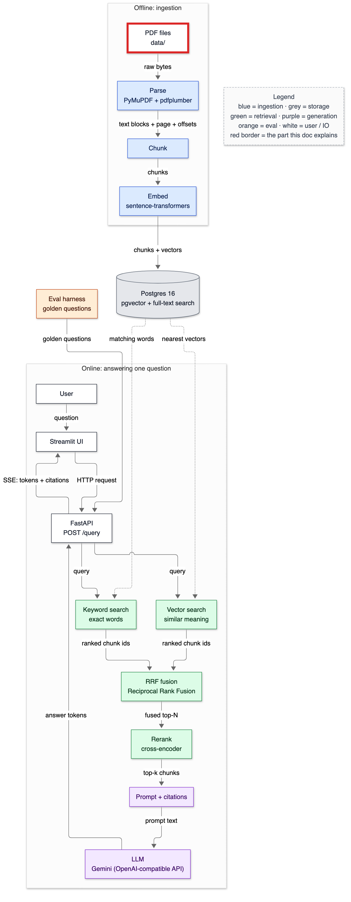
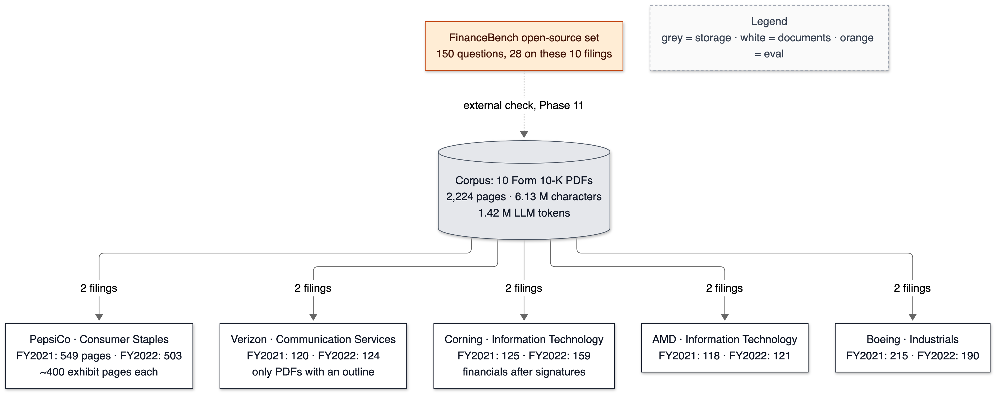
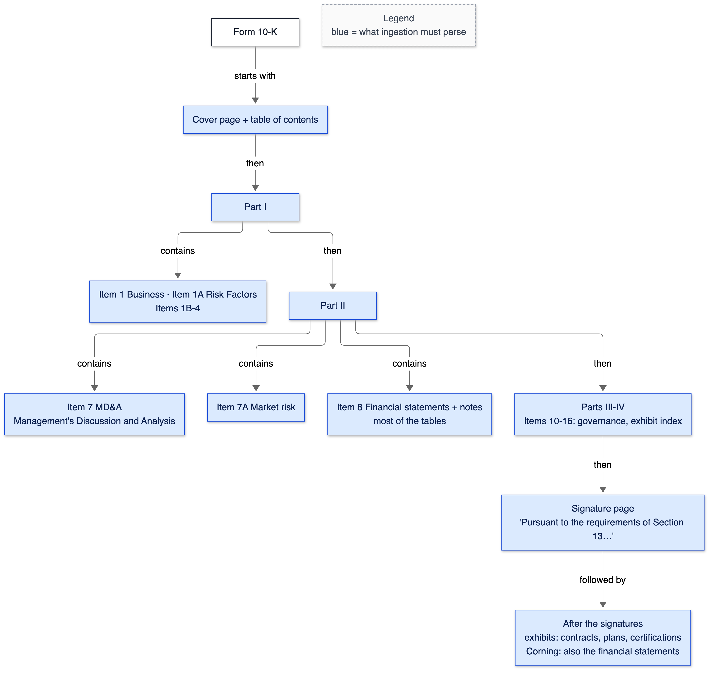
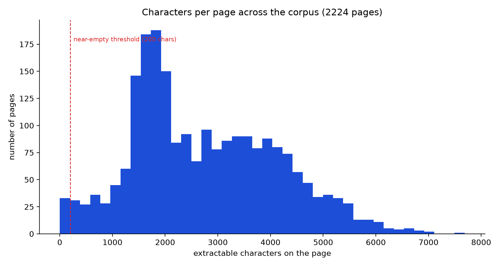
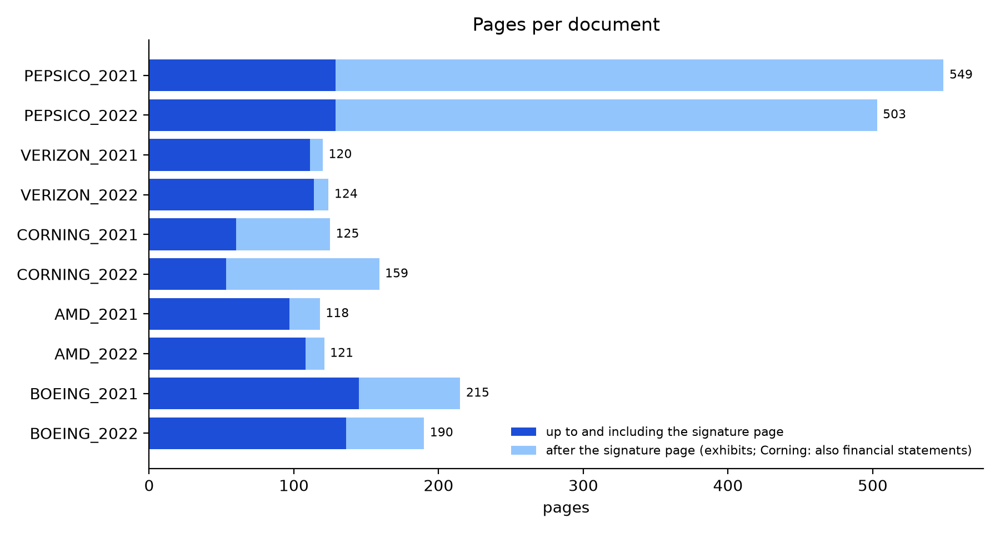

# 04 — Corpus

**Status:** written in Phase 1 (2026-10-02). Owns: Form 10-K, Item (10-K section), exhibit, corpus manifest, content hash, text extractability, scanned page, running header, non-breaking space, PDF outline.

> Prerequisites: [01-what-is-rag.md](01-what-is-rag.md) (what a chunk and retrieval are). Every number here comes from `make inspect`, run on 2026-10-02.

---

## 1. In one paragraph

Before building a search engine you look hard at what it will search. Our library is ten **Form 10-K** filings — the annual report every US-listed company must file with the SEC — from five companies (PepsiCo, Verizon, Corning, AMD, Boeing), each for fiscal 2021 and fiscal 2022. They are long (2,224 pages in total), full of financial tables, organised into numbered legal sections, and nearly identical from one year to the next. A script opens every PDF and reports what later phases will trip over: how much text each page really yields, whether anything is a scanned image, where the tables are, where the signature page and exhibits are, which lines repeat on every page, and how many LLM tokens the whole corpus is.

## 2. Why it exists

The project's differentiator is evaluation on a *structurally complex* corpus. A toy corpus — a few clean web articles — would hide every interesting failure. What this inspection found, concretely, would otherwise have surfaced weeks later as mysteriously bad retrieval:

- **PepsiCo's PDFs are 77% exhibits.** 420 of 549 pages (2021) come *after* the signature page — pension-plan documents and bond indentures. Without knowing that, a third of every chunking experiment would be measuring legal boilerplate.
- **"After the signatures" does not mean "exhibits".** Corning puts its financial statements *after* the signature page (income statement on p.65, signatures on p.60). A rule like "drop everything after SIGNATURES" would silently delete Corning's numbers.
- **One file is full of invisible characters.** Corning 2021 separates almost every word with a non-breaking space (65,886 of them), which costs about 64% more LLM tokens than the same text would at Corning 2022's rate (433,032 characters ÷ 4.34 characters per token ≈ 99,800 tokens expected; 163,836 measured) and breaks naive string matching.
- **A running header on almost every page.** "Table of Contents" (a back-link) sits at the top of 144 of Boeing 2021's 215 pages. Left in, it becomes a chunk of noise or pollutes every chunk.

## 3. Where it sits

The corpus is the input to everything: the highlighted box.



<details><summary>Same diagram as text (for terminal viewing)</summary>

```text
 OFFLINE
 ╔═══════════╗  ┌───────┐  ┌───────┐  ┌───────┐   ┌─────────────────────────────┐
 ║ PDF files ║─▶│ Parse │─▶│ Chunk │─▶│ Embed │──▶│ Postgres 16                 │
 ╚═══════════╝  └───────┘  └───────┘  └───────┘   │ pgvector + full-text search │
                                                  └──────────────┬──────────────┘
 ONLINE                                                          │ searched by
 ┌───────────┐  ┌─────────┐     query     ┌──────────────────────▼──────────────┐
 │ Streamlit │─▶│ FastAPI │──────────────▶│ Vector search  +  Keyword search    │
 └─────▲─────┘  └──┬───▲──┘               └──────────────────────┬──────────────┘
       │    SSE    │   │ answer tokens                           │ two ranked lists
       └───────────┘   │                                         ▼
               ┌───────┴──────┐  ┌────────────────────┐  ┌────────┐  ┌────────────┐
               │ LLM (Gemini) │◀─│ Prompt + citations │◀─│ Rerank │◀─│ RRF fusion │
               └──────────────┘  └────────────────────┘  └────────┘  └────────────┘

 Double-line box (╔═╗) = the part this doc explains: the PDF corpus.
```
</details>

## 4. The flow

### What is in the corpus



<details><summary>Same diagram as text (for terminal viewing)</summary>

```text
                 ┌─────────────────────────────────────────────┐
                 │ FinanceBench open-source set                │
                 │ 150 questions, 28 on these 10 filings       │
                 └──────────────────────┬──────────────────────┘
                                        ┊ external check, Phase 11
                                        ▼
                 ┌─────────────────────────────────────────────┐
                 │ Corpus: 10 Form 10-K PDFs                   │
                 │ 2,224 pages · 6.13 M characters             │
                 │ 1.42 M LLM tokens                           │
                 └──┬────────┬──────────┬──────────┬────────┬──┘
           2 filings│        │          │          │        │2 filings
     ┌──────────────▼──┐ ┌───▼──────┐ ┌─▼────────┐ ┌▼─────┐ ┌▼───────┐
     │ PepsiCo         │ │ Verizon  │ │ Corning  │ │ AMD  │ │ Boeing │
     │ 549 / 503 pages │ │ 120/124  │ │ 125/159  │ │118/  │ │215/190 │
     │ ~400 exhibit pp │ │ outline  │ │financials│ │121   │ │        │
     │ each            │ │ (only)   │ │after sig.│ │      │ │        │
     └─────────────────┘ └──────────┘ └──────────┘ └──────┘ └────────┘
 Legend (colours appear in the image): grey = storage · white = documents · orange = eval
```
</details>

### What a 10-K looks like inside

Every 10-K follows the same legal outline (set by the SEC's Regulation S-K), which is what makes "structure-aware" chunking possible later ([06-chunking.md](06-chunking.md)):



<details><summary>Same diagram as text (for terminal viewing)</summary>

```text
 ┌───────────┐
 │ Form 10-K │
 └─────┬─────┘
       │ starts with
       ▼
 ┌──────────────────────────────┐
 │ Cover page + table of        │
 │ contents                     │
 └─────┬────────────────────────┘
       │ then
       ▼
 ┌──────────┐ contains ┌─────────────────────────────────────────┐
 │ Part I   │─────────▶│ Item 1 Business · 1A Risk Factors · 1B-4│
 └─────┬────┘          └─────────────────────────────────────────┘
       │ then
       ▼
 ┌──────────┐ contains ┌─────────────────────────────────────────┐
 │ Part II  │─────────▶│ Item 7 MD&A (Management's Discussion    │
 │          │          │ and Analysis) · Item 7A Market risk     │
 │          │─────────▶│ Item 8 Financial statements + notes     │
 └─────┬────┘          │ (most of the tables)                    │
       │ then          └─────────────────────────────────────────┘
       ▼
 ┌────────────────────────────────────┐
 │ Parts III-IV: Items 10-16          │
 │ governance, exhibit index          │
 └─────┬──────────────────────────────┘
       │ then
       ▼
 ┌────────────────────────────────────┐
 │ Signature page: "Pursuant to the   │
 │ requirements of Section 13 …"      │
 └─────┬──────────────────────────────┘
       │ followed by
       ▼
 ┌────────────────────────────────────┐
 │ After the signatures: exhibits     │
 │ (contracts, plans, certifications) │
 │ Corning: also the financial        │
 │ statements                         │
 └────────────────────────────────────┘
 Legend (colours appear in the image): blue = what ingestion must parse
```
</details>

### How the inspection runs (`make inspect`)

1. **`make corpus`** reads `data/manifest.json`, downloads any missing file, and verifies every file's sha256 against the pinned value.
2. For each PDF, **PyMuPDF** opens it and reads every page's text, images and block positions.
3. **Per page:** count extractable characters; measure how much of the page images cover; flag *near-empty* (<200 characters) and *scanned-suspect* (near-empty **and** images cover ≥50%).
4. **Per document:** find the 10-K Item headings, the signature page, the first income-statement page, lines that repeat in the top or bottom 8% of pages, and the PDF outline (bookmarks).
5. **pdfplumber** checks every page for tables.
6. **tiktoken** counts the whole text in OpenAI's `o200k_base` tokenizer.
7. Results go to `data/inspection.json` (git-ignored); charts to `docs/diagrams/out/04-*.png`.

## 5. The code

### `data/manifest.json` + `scripts/fetch_corpus.py` — a pinned corpus

```json
{"doc_key": "CORNING_2021_10K", "company": "Corning", "ticker": "GLW", "fiscal_year": 2021,
 "form": "10-K", "path": "pdfs/CORNING_2021_10K.pdf",
 "source_url": "https://raw.githubusercontent.com/patronus-ai/financebench/main/pdfs/CORNING_2021_10K.pdf",
 "sha256": "…", "bytes": 1131912}
```

`data/` is git-ignored — the PDFs aren't ours to redistribute and don't belong in git — **except** this one file (`.gitignore` has `data/*` then `!data/manifest.json`). A fresh clone therefore knows exactly which bytes it needs.

```python
    tmp = dest.with_suffix(dest.suffix + ".part")
    ...
    tmp.replace(dest)
```

Download to `name.pdf.part`, rename only when complete. Without this, an interrupted download leaves a truncated `name.pdf` that *looks* present; the hash check would catch it, but only after confusing you.

```python
TLS = ssl.create_default_context(cafile=certifi.where())
```

The python.org build of Python 3.11 on macOS ships without a certificate bundle — its default file `/Library/Frameworks/Python.framework/Versions/3.11/etc/openssl/cert.pem` does not exist — so the first download failed with `CERTIFICATE_VERIFY_FAILED` (T-011). Pointing at `certifi`'s bundle (pinned in `requirements.txt`) fixes it inside the project rather than by modifying the system Python.

### `scripts/inspect_corpus.py` — the checks

```python
def page_stats(page):
    text = page.get_text()
    covered = sum(pymupdf.Rect(info["bbox"]).get_area() for info in page.get_image_info())
    ...
        "scanned_suspect": chars < NEAR_EMPTY_CHARS and coverage >= SCANNED_IMAGE_COVERAGE,
```

A scanned page is a photograph of text: the PDF holds an image and no (or almost no) text. Requiring *both* low text and high image coverage avoids flagging a blank separator page (low text, no image) or a page with a logo (image, plenty of text).

```python
SIGNATURE_STATEMENT = re.compile(r"(?i)pursuant to the requirements of section 13")
```

The first version searched for the word "SIGNATURES" on its own line and reported Boeing's signatures on page 2 — because the *table of contents* lists "Signatures" (T-012). The legal sentence on the real signature page is fixed text, so it's a far more reliable anchor. Boeing writes "Section 13" without "or 15(d)", so only that prefix is required.

```python
def repeated_edge_lines(doc):
    ...
            if y1 <= h * EDGE_FRACTION or y0 >= h * (1 - EDGE_FRACTION):
                line = re.sub(r"\d+", "#", " ".join(text.split()))
```

Running headers and footers live in the top and bottom strips of the page. Collapsing digits to `#` makes "Verizon 2021 Annual Report on Form 10-K 47" and "… 48" count as the same line.

```python
        "llm_tokens_o200k": tokens,
        "chars_per_token": round(len(text) / tokens, 2),
```

The corpus size in LLM tokens is the number card #1 was waiting for: is stuffing everything into a prompt even possible?

### `tests/test_corpus.py`

Two kinds of tests. Synthetic: the test builds a 7-page PDF with a running header, a TOC that mentions "Signatures", an image-only page and an income statement on page 6, so every expected value is known by construction. Real: the facts this doc quotes (2,224 pages; Corning's signatures on p.60 and income statement on p.65; 65,886 non-breaking spaces; only Verizon has an outline) are asserted, so the doc can't silently go stale.

## 6. Data in / data out

**In:** the ten PDFs. **Out:** `make inspect` (real output, 2026-10-02):

```text
document           pages after     chars med/pg empty scan? tbl pg items    tokens ch/tok   nbsp outline
--------------------------------------------------------------------------------------------------------
PEPSICO_2021_10K     549   420   1119863   1792     9     0     62    21    249514   4.49      0       0
PEPSICO_2022_10K     503   374   1179865   2009     9     0     70    21    264270   4.47   9138       0
VERIZON_2021_10K     120     9    488389   4192     3     0     71    22    104846   4.66      0     338
VERIZON_2022_10K     124    10    493965   4239     4     0     66    22    106212   4.66      0     344
CORNING_2021_10K     125    65    433032   3654     0     0     67    22    163836   2.64  65886       0
CORNING_2022_10K     159   106    499888   3162     3     0     57    22    115347   4.34  14968       0
AMD_2021_10K         118    21    381611   3542     1     0     33    22     79611   4.80      0       0
AMD_2022_10K         121    13    413606   3524     0     0     39    22     87702   4.72   1761       0
BOEING_2021_10K      215    70    608108   2873     3     0     73    21    130393   4.67      0       0
BOEING_2022_10K      190    54    509973   2785     3     0     68    22    113281   4.50   3079       0
--------------------------------------------------------------------------------------------------------
TOTAL               2224  1142   6128300           35     0    606         1415012
```

Column by column:

- `pages` — PDF pages. `after` — pages after the signature page.
- `chars` — extractable characters (what text extraction yields; images contribute nothing). `med/pg` — median per page.
- `empty` — near-empty pages (<200 characters): covers, separator pages, signature continuation pages.
- `scan?` — scanned-suspect pages. **Zero.** Every page is "born digital", so no OCR (optical character recognition) is needed — card #4 in Phase 2 builds on that.
- `tbl pg` — pages where pdfplumber's default line-based strategy finds a table: 606 of 2,224 (27%).
- `items` — distinct 10-K Item headings found (22 expected for these years). PepsiCo shows 21 because it has no "Item 6" line; Boeing 2021 has no Item 9C.
- `tokens` — `o200k_base` tokens. `ch/tok` — characters per token. `nbsp` — non-breaking spaces.
- `outline` — PDF bookmark entries; only Verizon has any.

And the per-document notes from the same run (abridged):

```text
CORNING_2021_10K: … signatures p.60; income statement p.65 (AFTER signatures)
BOEING_2021_10K: … items missing: 9C; signatures p.145; income statement p.59 (before signatures)
    repeated edge line on 144 pages: 'Table of Contents'
VERIZON_2021_10K: …
    repeated edge line on 114 pages: 'Verizon # Annual Report on Form #-K'
```

### Characters per page



<details><summary>Same chart as text (for terminal viewing)</summary>

```text
 characters on page   pages   (█ ≈ 12 pages)
      0 -   200          35   ███
    200 - 1,000         129   ███████████
  1,000 - 2,000         678   ████████████████████████████████████████████████████████
  2,000 - 3,000         468   ███████████████████████████████████████
  3,000 - 4,000         450   ██████████████████████████████████████
  4,000 - 5,000         310   ██████████████████████████
  5,000 - 6,000         124   ██████████
  6,000 - 8,000          30   ██
                      -----
                      2,224   (max 7,686)
```
</details>

The tall peak at 1,000–2,000 characters is mostly PepsiCo, whose PDFs are printed with large margins (median 1,792 per page against Verizon's 4,192). That matters for chunking: a "one chunk per page" rule would make PepsiCo chunks less than half the size of Verizon's.

### Pages per document



<details><summary>Same chart as text (for terminal viewing)</summary>

```text
 document          up to signatures   after signatures   total
 PEPSICO_2021      ████ 129           ██████████████ 420   549
 PEPSICO_2022      ████ 129           ████████████ 374     503
 VERIZON_2021      ████ 111           9                    120
 VERIZON_2022      ████ 114           10                   124
 CORNING_2021      ██ 60              ██ 65 (incl. financial statements)   125
 CORNING_2022      ██ 53              ████ 106 (incl. financial statements) 159
 AMD_2021          ███ 97             █ 21                 118
 AMD_2022          ████ 108           13                   121
 BOEING_2021       █████ 145          ██ 70                215
 BOEING_2022       █████ 136          ██ 54                190
 (█ ≈ 30 pages)
```
</details>

## 7. Decisions & alternatives

<!-- card:start id=2 -->
#### Decision: Ten real 10-K filings (5 companies × 2 consecutive years) as the corpus  (rejected: a toy corpus of clean articles, Wikipedia, a single long document, Indian regulatory circulars)

**One-line defence.** 10-Ks have exactly the structure that breaks naive RAG — 600+ table pages, a fixed legal outline, exhibits that dwarf the report, and near-identical text year to year — and FinanceBench gives externally written questions on them, so the evaluation isn't only my own.

**What problem is this even solving?** Every retrieval and evaluation result is only as meaningful as the data it was measured on. On a toy corpus every technique looks good, so an ablation table would show nothing. The corpus is the test bench; delete the decision and there is nothing to measure.

**The options, compared.**

| Option | How it works (1 line) | Strengths | Weaknesses | When it's the right call |
|---|---|---|---|---|
| ✅ 10 SEC 10-Ks, 2 years × 5 companies | Public annual reports as PDFs, mirrored by FinanceBench | Real tables, legal section structure, exhibits, year-to-year near-duplicates; 28 external questions with evidence pages; public records | Mostly single-column (multi-column parsing barely exercised); finance vocabulary; PepsiCo's exhibits make the corpus lopsided (1,052 of 2,224 pages) | Evaluating retrieval on structured, numeric, versioned documents |
| Toy corpus (blogs, clean articles) | A few dozen short HTML pages | Fast; easy to write questions | Hides every interesting failure; no tables; results don't transfer | Demonstrating the plumbing only |
| Wikipedia subset | Encyclopedic articles | Huge, clean, many public QA datasets | LLMs have memorised Wikipedia — a closed-book model scores well, so retrieval's value is hard to see | Open-domain QA research |
| One very long document | e.g. one 500-page manual | Simple | One structure; metadata filters and wrong-document errors can't occur | Single-manual assistants |
| Indian regulatory circulars (RBI/SEBI) | Numbered clauses with amendments | Excellent versioning story; local relevance | Harder to write correct questions; no external question set; more scanned PDFs | A compliance-assistant product |

**What would actually change if we swapped it.** A different corpus changes `data/manifest.json`, the inspection numbers, every test in `tests/test_corpus.py`, and the whole golden set (Phase 11). The pipeline code shouldn't change — if it did, that would mean it was overfitted to 10-Ks. A toy corpus would make the Phase 12 ablation flat (every configuration near-perfect), which is the real cost: no findings.

**The decision rule.** Pick the corpus that matches the *hardest realistic* version of the target workload, and has an external source of questions if one exists. Choose a toy corpus only to test plumbing; never to report quality.

**Where our choice breaks.** Ten documents is small: anything said about scale is reasoning, not measurement. The corpus is unbalanced — PepsiCo is 47% of pages, mostly exhibits — so corpus-wide averages are dominated by one company. Migration path: add more companies, and report metrics per document, not only pooled.

**The number.** 2,224 pages, 6,128,300 characters, 1,415,012 `o200k_base` tokens, 606 table pages, 0 scanned pages; 28 FinanceBench questions on these filings. (`make inspect`.)

**Interview script (3 sentences).** "I used ten real 10-K filings — five companies, two consecutive years — because they have what breaks naive RAG: hundreds of table pages, a fixed legal structure, exhibits bigger than the report itself, and near-duplicate text across years. An inspection script measured all of that before I wrote any retrieval code — for example, one filing uses non-breaking spaces between every word, which inflates its token count by about 64%. FinanceBench also has 28 externally written questions on these exact filings, so not all of my evaluation is self-written."

**Follow-ups they will ask:**
- Q: Why two years of the same company? → A: To create the hardest realistic confusion: the 2021 and 2022 10-Ks share most of their wording, so retrieval can easily return the right passage from the wrong year. That's a failure mode real financial users would hit, and metadata filtering (Phase 5) has to solve it.
- Q: Isn't ten documents too small? → A: For scale claims, yes, and I don't make them. For retrieval quality it's 1.4 million tokens and — after chunking — thousands of chunks to search, with hard near-duplicates. The honest limit is statistical: the question set, not the corpus, is the small part.
- Q: Do you keep the exhibits? → A: They're kept and labelled: users do ask about exhibit content (e.g. note terms), and deleting them by position would also delete Corning's financial statements, which sit after the signatures. Phase 2 tags pages after the signature page instead of dropping them.
- Q: How do you know there are no scanned pages? → A: Every page was checked: a page is scanned-suspect only if it has under 200 extractable characters *and* images cover at least half of it. Zero pages matched; the 35 near-empty pages are covers, separators and signature continuations with little or no imagery.
- Q (the hard one): FinanceBench's licence is non-commercial. Is that a problem? → A (honest): For a student portfolio project, no — CC BY-NC 4.0 allows non-commercial use with attribution, which the manifest and docs give. A commercial product couldn't reuse their questions without permission; the filings themselves are public SEC records. The GitHub repo itself has no licence file — the licence comes from the Hugging Face dataset card — which I'd clarify with the authors before any commercial use.
- Q: Why PDFs and not EDGAR's HTML? → A: The plan is a PDF pipeline because most real enterprise documents arrive as PDFs, where layout, page numbers and offsets are the hard part. HTML filings would be easier to parse — and less instructive.

**The trap.** Picking the corpus last, or calling a clean toy corpus "realistic". Interviewers ask "what was hard about your data?" — an answer without specifics (like the exhibit share or the non-breaking spaces) suggests the data was never looked at.
<!-- card:end -->

## 7a. Prerequisite concepts

**Form 10-K** — the annual report US public companies must file with the SEC (Securities and Exchange Commission). Its contents are set by regulation, so every 10-K has the same skeleton.

**Item** — a numbered section of a 10-K, e.g. Item 1A Risk Factors, Item 7 MD&A (Management's Discussion and Analysis), Item 8 Financial Statements. Items are grouped into Parts I–IV. Item 6 became "[Reserved]" for these years; Item 9C (foreign jurisdictions preventing inspections) was added for fiscal 2021.

**Exhibit** — a document attached to the filing: contracts, bond terms, benefit plans, officer certifications. Listed in Item 15 and usually placed after the signature page.

**Fiscal year** — a company's accounting year; it need not match the calendar (PepsiCo's fiscal 2022 ended on 31 December 2022, but many companies end in June or September).

**What a PDF stores** (preview — owned by [05-pdf-parsing.md](05-pdf-parsing.md)) — not paragraphs, but instructions: "draw these glyphs in this font at these coordinates". Text extraction reconstructs words and lines from those instructions. A **born-digital** PDF has real text instructions; a **scanned** PDF has only a picture of the page, and needs OCR to recover text.

**Text extractability** — how many characters extraction actually yields per page. A page can *look* full and extract nothing (scan), or extract text in a garbled order (complex layouts).

**Running header / footer** — a line repeated near the top or bottom of every page (company name, page number, a "Table of Contents" back-link). Useful to a reader, noise to a search engine.

**Non-breaking space** (U+00A0, written `\xa0`) — a space character that tells layout engines "don't break the line here". It *looks* identical to a normal space. Python's `" ".join(text.split())` treats it as whitespace; `text.split(" ")` does not; tokenizers may encode it differently. Worked example from this corpus: Corning 2021 has 433,032 characters and 163,836 tokens (2.64 characters per token); Corning 2022 has 499,888 characters and 115,347 tokens (4.34). Similar text, but 2021 costs ~42% more tokens than 2022 *despite being shorter* — the difference is 65,886 vs 14,968 non-breaking spaces.

**PDF outline (bookmarks)** — an optional table of contents stored in the PDF itself, with page targets. Only Verizon's files have one (338 and 344 entries), so a parser can't rely on it.

**Content hash (sha256)** — a 64-hex-character fingerprint of a file's bytes. Any change, even one byte, changes it. Used here to pin the corpus.

**Corpus manifest** — a list of every corpus file with its source, expected size and hash; the corpus equivalent of `requirements.txt`.

## 7b. What if we used something else?

| If we had used… | Immediate effect | Effect on quality metrics | Effect on latency/cost | Effect on complexity | Would I defend it? |
|---|---|---|---|---|---|
| A toy corpus | Faster to build | Near-perfect on every config; ablation shows nothing | Tiny | Lower | No — no findings |
| Only one year per company | No wrong-year confusion | Looks better than reality | Half the ingest | Lower | No — hides a real failure |
| Drop everything after the signature page | 1,142 fewer pages | Corning's financial statements disappear → table questions fail | ~half the embedding cost | Same | No — measured as wrong for Corning |
| Keep PDFs in git | Clone always has the corpus | None | 21 MB repo growth per corpus version | Lower | No — not ours to redistribute; the manifest + hashes give the same reproducibility |
| EDGAR HTML instead of PDF | Easier parsing, exact tags | Probably better parsing quality | Faster parse | Lower | Not for a PDF-pipeline project |

## 8. Failure modes

| What you see | Cause | Fix |
|---|---|---|
| `urllib.error.URLError: <urlopen error [SSL: CERTIFICATE_VERIFY_FAILED] certificate verify failed: unable to get local issuer certificate (_ssl.c:1006)>` | python.org macOS Python has no CA bundle (T-011) | Use `certifi` (done in `fetch_corpus.py`) |
| `corpus verification FAILED: pdfs/X.pdf: sha256 … != expected …` | A truncated download or a changed upstream file | Delete the file and re-run `make corpus`; if it still differs, upstream changed — decide deliberately whether to re-pin with `--pin` (all numbers in this doc would need re-running) |
| Signature page reported on p.2–3 | Matching the word "Signatures" hits the table of contents (T-012) | Match the legal sentence instead |
| `test_every_file_is_present_and_matches_its_pinned_hash` fails with "missing — run `make corpus`" | Fresh clone, corpus not fetched | `make corpus` (`make test` runs it automatically) |
| `warning: The fitz API is deprecated` | `import fitz` is PyMuPDF's old name | `import pymupdf` |

## 9. Try it yourself

```bash
make corpus
```

Expected: `corpus OK: 12 files verified against data/manifest.json` (it downloads first on a fresh clone — 43 s here).

```bash
make inspect
```

Expected: the table in §6 (about 3 minutes; pdfplumber's table check is most of it), then `charts written to docs/diagrams/out/04-*.png`.

**Experiment — see the non-breaking spaces yourself:**

```bash
.venv/bin/python -c "import pymupdf; t=pymupdf.open('data/pdfs/CORNING_2021_10K.pdf')[9].get_text(); print(repr(t[:80]))"
```

Expected: `'Table\xa0of\xa0Contents\n\xa0\nCorning\xa0strives\xa0to\xa0attract\xa0and\xa0recruit\xa0diverse\xa0q'` — every gap between words is `\xa0`, not a space.

## 10. Numbers

| What | Value | Command |
|---|---|---|
| Documents / companies / years | 10 / 5 / 2 | `data/manifest.json` |
| Download size | 21,336,480 bytes (PDFs) | `make corpus` (43 s on first run) |
| Pages | 2,224 (1,142 after signature pages) | `make inspect` |
| Characters | 6,128,300 | `make inspect` |
| LLM tokens (`o200k_base`) | 1,415,012 | `make inspect` |
| Pages with tables (pdfplumber) | 606 (27%) | `make inspect` |
| Scanned-suspect pages | 0 | `make inspect` |
| Near-empty pages (<200 chars) | 35 | `make inspect` |
| FinanceBench questions on these filings | 28 of 150 (17 domain-relevant, 7 novel, 4 metrics) | `data/financebench/financebench_open_source.jsonl` |
| Inspection runtime | 3 min 17 s | `time make inspect` |
| Table detection speed, AMD 2021 (118 pages) | PyMuPDF 7.1 s (52 tables, 31 pages) vs pdfplumber 12.5 s (55 tables, 33 pages); page-level agreement 116/118 | one-off comparison script, 2026-10-02 |

What 1.4 M tokens means for card #1: the whole corpus can't be stuffed into a typical context window on every question, and even a model with a window that large would pay for 1.4 M input tokens per question — RAG's few-thousand-token prompts are several hundred times smaller.

## 11. Interview talking points

- "Ten 10-Ks, five companies, two consecutive years: 2,224 pages, 1.4 M tokens, 606 table pages, zero scanned pages."
- "The inspection found things that would have silently skewed results: PepsiCo is three-quarters exhibits, Corning's financial statements come after the signature page, and one file uses non-breaking spaces between every word."
- "The corpus is pinned like code: a manifest with sha256 hashes, verified on every test run."
- "FinanceBench provides 28 externally written questions on these filings — an outside check on my own golden set."
- Expect: "What was hard about your data?", "Why two years?", "How do you know there's no OCR needed?"

## 12. Check yourself

1. Why would "drop every page after the signature page" be a bad way to remove exhibits in this corpus?
2. Corning 2021 has fewer characters than Corning 2022 but more tokens. Why, and what else might the same cause break?
3. What two conditions make a page "scanned-suspect", and why both?

<details><summary>Answers</summary>

1. Corning places its financial statements after the signature page (income statement p.65 vs signatures p.60 in 2021), so position-based dropping would delete Corning's financial tables. Content after the signatures varies by company.
2. It separates words with non-breaking spaces (65,886 vs 14,968), which the tokenizer encodes less efficiently (2.64 vs 4.34 characters per token). The same character could break exact string matching — e.g. finding a golden-set evidence quote in the text — so Phase 2 normalises it.
3. Fewer than 200 extractable characters *and* images covering at least half the page. Low text alone also matches blank separator pages; images alone also match pages with a logo. Together they describe a photograph of text.

</details>

## 13. New terms added to the glossary

Form 10-K, Item (10-K), exhibit, fiscal year, born-digital PDF, scanned PDF, OCR, text extractability, running header/footer, non-breaking space, PDF outline (bookmarks), content hash, corpus manifest — see [21-glossary.md](21-glossary.md).
