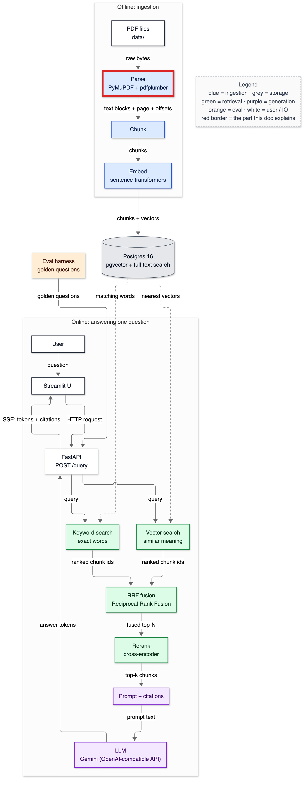
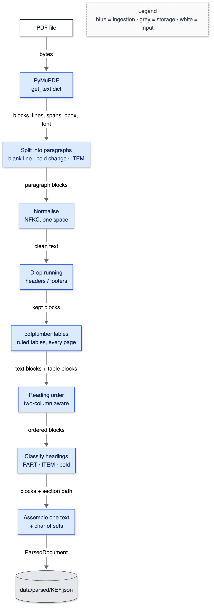
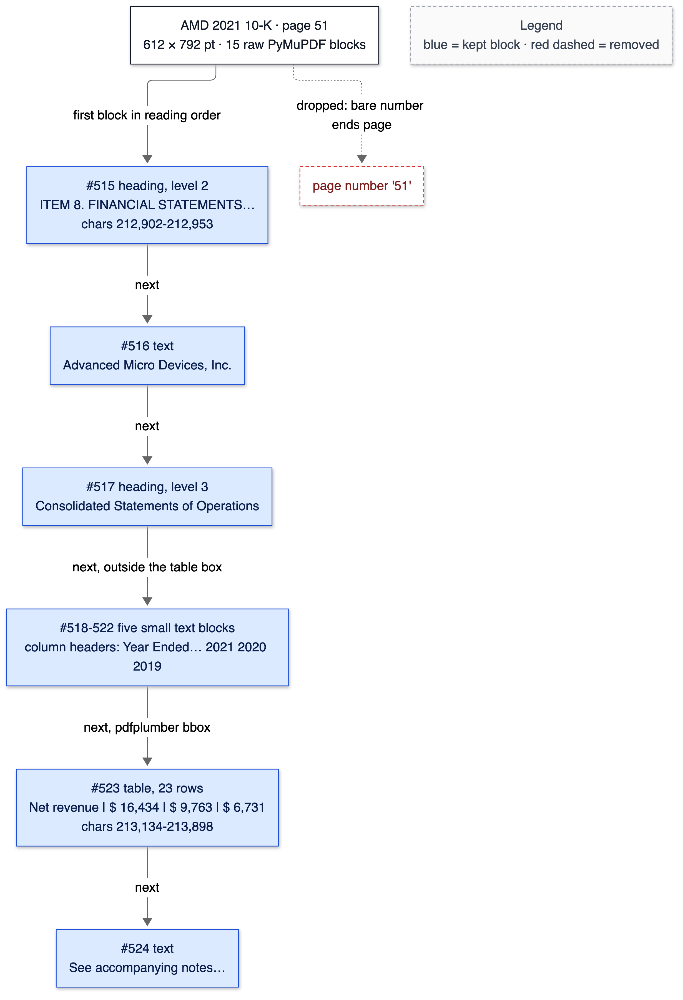

# 05 — PDF parsing

**Status:** written in Phase 2 (2026-10-02). Owns: PDF content stream, glyph, text block / line / span, bounding box, reading order, NFKC normalisation, canonical text, character offset, running-header removal, table extraction, heading classification, section path.

> Prerequisites: [04-corpus.md](04-corpus.md) (the quirks this parser must handle). All numbers below come from `make parse` and `tests/test_pdf_parser.py`, run on 2026-10-02.

---

## 1. In one paragraph

A PDF is not a document in the way a Word file is; it's a set of drawing instructions — "put these letters at these coordinates in this font". The parser turns those instructions back into something a search engine can use: a list of **blocks** (paragraphs, headings, tables) in reading order, each tagged with its page, its position on the page, the section it belongs to ("PART II › ITEM 8 › Consolidated Statements of Operations"), and — most importantly — exactly which characters it occupies in one long, clean text for the whole document. Think of a librarian who photocopies every page, cuts out the paragraphs, throws away the repeated page headers, glues the rest onto one long scroll in order, and writes on each piece "page 51, characters 212,902 to 212,953". Every later citation depends on those numbers.

## 2. Why it exists

Plain `page.get_text()` on this corpus would give you, concretely:

- **Noise in every chunk.** "Table of Contents" on 144 of Boeing's 215 pages; "Verizon 2022 Annual Report on Form 10-K" plus a page number on every Verizon page. Measured: the parser removed 1,334 such header/footer blocks and 1,275 bare page numbers across the corpus.
- **Invisible characters.** 65,886 non-breaking spaces in Corning 2021 that break exact matching and inflate token counts ([04](04-corpus.md#7a-prerequisite-concepts)).
- **Tables as word soup.** AMD's income statement extracted line by line reads "Net revenue $ 16,434 $ 9,763 $ 6,731 Cost of sales 8,505…" with no row structure. As a table block it reads `Net revenue | $ 16,434 | $ 9,763 | $ 6,731` — one row per line.
- **No structure.** Without headings you can't chunk by section (Phase 3) or show "this answer comes from Item 7, MD&A".
- **No way back to the page.** Without character offsets, a citation can say "AMD 2021" but can't highlight the sentence. Card #5 makes offsets mandatory from this phase on, because adding them later means re-parsing and re-ingesting everything.

## 3. Where it sits



<details><summary>Same diagram as text (for terminal viewing)</summary>

```text
 OFFLINE
 ┌───────────┐  ╔═══════╗  ┌───────┐  ┌───────┐   ┌─────────────────────────────┐
 │ PDF files │─▶║ Parse ║─▶│ Chunk │─▶│ Embed │──▶│ Postgres 16                 │
 └───────────┘  ╚═══════╝  └───────┘  └───────┘   │ pgvector + full-text search │
                                                  └──────────────┬──────────────┘
 ONLINE                                                          │ searched by
 ┌───────────┐  ┌─────────┐     query     ┌──────────────────────▼──────────────┐
 │ Streamlit │─▶│ FastAPI │──────────────▶│ Vector search  +  Keyword search    │
 └─────▲─────┘  └──┬───▲──┘               └──────────────────────┬──────────────┘
       │    SSE    │   │ answer tokens                           │ two ranked lists
       └───────────┘   │                                         ▼
               ┌───────┴──────┐  ┌────────────────────┐  ┌────────┐  ┌────────────┐
               │ LLM (Gemini) │◀─│ Prompt + citations │◀─│ Rerank │◀─│ RRF fusion │
               └──────────────┘  └────────────────────┘  └────────┘  └────────────┘

 Double-line box (╔═╗) = the part this doc explains: parsing.
```
</details>

## 4. The flow



<details><summary>Same diagram as text (for terminal viewing)</summary>

```text
 ┌──────────┐
 │ PDF file │
 └────┬─────┘
      │ bytes
      ▼
 ┌──────────────────────────────┐
 │ PyMuPDF get_text("dict")     │
 └────┬─────────────────────────┘
      │ blocks › lines › spans (text, bbox, font, size, bold flag)
      ▼
 ┌──────────────────────────────┐
 │ Split into paragraphs        │  at blank lines, bold ↔ normal changes,
 └────┬─────────────────────────┘  and lines that start PART / ITEM
      │ paragraph blocks
      ▼
 ┌──────────────────────────────┐
 │ Normalise: NFKC, one space   │
 └────┬─────────────────────────┘
      │ clean text
      ▼
 ┌──────────────────────────────┐
 │ Drop running headers/footers │  repeated in the top/bottom 8% band
 └────┬─────────────────────────┘
      │ kept blocks
      ▼
 ┌──────────────────────────────┐
 │ pdfplumber: ruled tables     │  text blocks inside a table box are replaced
 └────┬─────────────────────────┘
      │ text blocks + table blocks
      ▼
 ┌──────────────────────────────┐
 │ Reading order (2-col aware)  │
 └────┬─────────────────────────┘
      │ ordered blocks
      ▼
 ┌──────────────────────────────┐
 │ Classify headings            │  PART = 1, ITEM = 2, other bold = 3
 └────┬─────────────────────────┘
      │ blocks + section path
      ▼
 ┌──────────────────────────────┐
 │ Assemble one text + offsets  │
 └────┬─────────────────────────┘
      │ ParsedDocument (JSON)
      ▼
 ┌──────────────────────────────┐
 │ data/parsed/KEY.json (cache) │
 └──────────────────────────────┘
 Legend (colours appear in the image): blue = ingestion · grey = storage · white = input
```
</details>

Step by step, for one PDF:

1. **Extract.** PyMuPDF returns, per page, *blocks* of *lines* of *spans* (runs of text in one font), each with a bounding box and font information.
2. **Split into paragraphs.** PyMuPDF's blocks aren't reliably paragraphs: Corning 2021 puts a whole section — header, two Item headings and body — in one block, separated only by lines containing a non-breaking space. So the parser walks line by line and starts a new paragraph at a blank line, at a change between bold and normal text, or at a line beginning "PART …" / "ITEM …".
3. **Normalise.** Each paragraph's text goes through Unicode NFKC normalisation and whitespace collapsing — *before* any offset exists.
4. **Drop running headers and footers.** Any block in the top or bottom 8% of the page whose text (digits replaced by `#`, a leading/trailing page number dropped) repeats on at least 10% of pages and at least 5 pages is removed. A bare number closing the page is removed too.
5. **Tables.** pdfplumber finds tables bounded by drawn lines; their rows become one `table` block (`cell | cell` per row), and the PyMuPDF text blocks inside that box are discarded so table text isn't duplicated.
6. **Reading order.** Blocks are sorted top-to-bottom, left-to-right — unless a column gutter is found, in which case the whole left column comes before the right.
7. **Headings.** PART lines become level 1, ITEM lines level 2, other short bold or large lines level 3. A running stack of headings gives every block its **section path**.
8. **Assemble.** Block texts are joined with a blank line (`\n\n`) into one **canonical text**; each block records `char_start` / `char_end` into it, and each page records the range its blocks cover.
9. **Cache.** The result is saved as JSON keyed by the PDF's sha256 and the parser version, so it's rebuilt only when either changes.

### One real page, decomposed



<details><summary>Same diagram as text (for terminal viewing)</summary>

```text
 ┌──────────────────────────────────────────────────┐
 │ AMD 2021 10-K · page 51 · 612 × 792 pt           │
 │ 15 raw PyMuPDF blocks                            │
 └──┬──────────────────────────────────────────┬────┘
    │ first block in reading order             ┊ dropped: bare number ends page
    ▼                                          ▼
 ┌──────────────────────────────────────┐  ┌ ─ ─ ─ ─ ─ ─ ─ ─ ─ ┐
 │ #515 heading L2: ITEM 8. FINANCIAL   │    page number '51'
 │ STATEMENTS…  chars 212,902-212,953   │  └ ─ ─ ─ ─ ─ ─ ─ ─ ─ ┘
 └──┬───────────────────────────────────┘
    │ next
    ▼
 ┌──────────────────────────────────────┐
 │ #516 text: Advanced Micro Devices    │
 └──┬───────────────────────────────────┘
    │ next
    ▼
 ┌──────────────────────────────────────┐
 │ #517 heading L3: Consolidated        │
 │ Statements of Operations             │
 └──┬───────────────────────────────────┘
    │ next, outside the table box
    ▼
 ┌──────────────────────────────────────┐
 │ #518-522 five small text blocks:     │
 │ column headers (Year Ended… 2021…)   │
 └──┬───────────────────────────────────┘
    │ next, pdfplumber bbox
    ▼
 ┌──────────────────────────────────────┐
 │ #523 table, 23 rows                  │
 │ Net revenue | $ 16,434 | $ 9,763 | … │
 │ chars 213,134-213,898                │
 └──┬───────────────────────────────────┘
    │ next
    ▼
 ┌──────────────────────────────────────┐
 │ #524 text: See accompanying notes…   │
 └──────────────────────────────────────┘
 Legend (colours appear in the image): blue = kept block · red dashed = removed
```
</details>

Notice the honest flaw in that output: the column headers (*which column is 2021?*) sit above the ruled area, so they come out as five fragments outside the table. §8 discusses the consequence.

## 5. The code

### `app/ingest/models.py` — the shapes

```python
@dataclass(frozen=True)
class Block:
    index: int
    page_number: int
    char_start: int
    char_end: int
    kind: str               # "text", "heading" or "table"
    heading_level: int      # 1 = PART, 2 = ITEM, 3 = other heading, 0 = not a heading
    section: tuple[str, ...]
    bbox: tuple[float, float, float, float]
    text: str
```

The module docstring states the invariant everything rests on: `doc.text[b.char_start:b.char_end] == b.text`. `frozen=True` makes blocks immutable, so nothing downstream can "fix" a block's text without its offsets going stale. `bbox` is kept for Phase 15, where a citation highlights the passage on the rendered page (agreed change B).

```python
    def page_of(self, char_offset: int) -> int:
        lo, hi = 0, len(self.pages) - 1
        while lo < hi:
            mid = (lo + hi + 1) // 2
            if self.pages[mid].char_start <= char_offset:
```

Binary search over page start offsets: given any character position — say a chunk's start in Phase 3 — find its page in O(log pages) instead of scanning. `mid = (lo + hi + 1) // 2` rounds *up*, which is what guarantees the loop ends when searching for "the last page starting at or before the offset".

### `app/ingest/pdf_parser.py` — the rules

```python
def normalise(text: str) -> str:
    return " ".join(unicodedata.normalize("NFKC", text).split())
```

**NFKC** ("compatibility composition") folds characters that *mean* the same into one form: a non-breaking space becomes a space, the "fi" ligature becomes "fi", full-width digits become ASCII. Then `split()`/`join` collapses every run of whitespace to one space. This runs on each block *before* assembly; if it ran afterwards, any length change would shift every offset after it.

```python
            if not spans:            # blank (or non-breaking-space-only) line = paragraph break
                flush(current)
```

`spans` keeps only spans with visible characters, so a line holding only `\xa0` counts as blank. This one condition is what splits Corning's merged blocks; without it Corning 2021 parsed into 509 blocks with 18 headings, with it 1,429 blocks and 169 headings.

```python
    key = re.sub(r"\d+", "#", normalise(text))
    return re.sub(r"^#\s+|\s+#$", "", key)
```

The running-footer fingerprint. Digits become `#` so "Page 12" and "Page 13" match; the second line drops a leading or trailing page number, because Verizon prints "5 Verizon 2022 Annual Report on Form 10-K" on odd pages and "…Form 10-K 6" on even ones. Without it, 10 Verizon footers survived (caught by `test_verizon_running_header_removed`, T-015).

```python
    threshold = max(MIN_REPEAT_PAGES, int(len(pages) * REPEAT_SHARE))
```

At least 5 pages and at least 10% of pages. The first version required 30% of pages; PepsiCo's "Table of Contents" header is on its 129 body pages but 30% of 503 pages is 150, so it was never removed (T-014).

```python
def clean_table(rows):
    ...
            if merged and merged[-1] in {"$", "€", "£"}:
                merged[-1] = f"{merged[-1]} {cell}"
```

pdfplumber splits `$ 16,434` into two cells, and merged cells come back as `None`. Empty cells are dropped and a lone currency symbol joins the amount after it, giving `Net revenue | $ 16,434 | $ 9,763 | $ 6,731`.

```python
def inside(block, table):
    cx, cy = (x0 + x1) / 2, (y0 + y1) / 2
    return tx0 - TABLE_PAD <= cx <= tx1 + TABLE_PAD and ...
```

A text block is "part of the table" if its *centre* lies within the table's box (with 2 points of slack). Using the centre rather than full containment tolerates blocks that stick out by a pixel. Without this step every number would appear twice: once in the table block and once as loose text.

```python
def find_gutter(blocks, width):
    for x in [width * f / 100 for f in range(35, 66)]:
        if any(b.bbox[0] < x < b.bbox[2] for b in blocks):
            continue
        left = [b for b in blocks if b.bbox[2] <= x and is_prose(b)]
        ...
        if len(left) >= 3 and len(right) >= 3:
```

Two-column detection: a vertical line in the middle 30% of the page that no block crosses, with at least three *prose* blocks (≥80 characters, ≥60% letters) on each side. The prose requirement stops unruled tables — narrow numeric blocks side by side — from being mistaken for columns. Measured on this corpus: **0 two-column pages** (10-Ks are single-column), so this rule is exercised only by its synthetic test. That's stated, not hidden.

```python
    if PART_HEADING.match(block.text) and len(block.text) <= 40:
        return 1
    if ITEM_HEADING.match(block.text) and styled:
        return 2
    ...
    if (styled and len(block.text.split()) >= 2 and not re.search(r"\d", block.text)
            and letters / len(block.text) >= 0.7 and not block.text.endswith((".", ",", ";"))
            and not block.text.startswith("(")):
        return 3
```

Font size alone fails here: AMD's "ITEM 8. FINANCIAL STATEMENTS…" is 8.0 pt bold Arial, the same size as body text (8.0 pt is 344,567 of AMD's characters). So a heading is short and *styled* (all bold, or ≥1.2× body size). Level 3 excludes digits and parentheses to keep bold table captions such as "Year Ended December 25, 2021" and "(In millions, except per share amounts)" out of the section path.

```python
            if level:
                section = [s for s in section if s[0] < level] + [(level, raw.text)]
```

The section stack: a new heading pops every heading at its level or deeper, then pushes itself. An ITEM heading therefore replaces the previous ITEM and its sub-headings but stays under the current PART.

### `app/ingest/parse_corpus.py` — the cache

```python
        if cached["parser_version"] == PARSER_VERSION and cached["source_sha256"] == entry["sha256"]:
            return ParsedDocument.from_json(cached)
```

Parsing the corpus takes about 3 minutes, so results are cached — but only reused when both the input bytes and the parser version match. Bumping `PARSER_VERSION` whenever parsing rules change (it went 2.0 → 2.3 during this phase) guarantees no stale output is mixed with new.

## 6. Data in / data out

**In:** page 51 of `AMD_2021_10K.pdf` — 15 raw PyMuPDF text blocks. **Out:** seven blocks (real JSON, text truncated):

```json
{"index": 515, "kind": "heading", "level": 2, "char_start": 212902, "char_end": 212953,
 "bbox": [23.8, 64.57, 268.07, 73.51],
 "section": ["PART II", "ITEM 8. FINANCIAL STATEMENTS AND SUPPLEMENTARY DATA"],
 "text": "ITEM 8. FINANCIAL STATEMENTS AND SUPPLEMENTARY DATA"}
{"index": 523, "kind": "table", "level": 0, "char_start": 213134, "char_end": 213898,
 "bbox": [23.8, 151.05, 587.89, 394.13],
 "section": ["PART II", "ITEM 8. FINANCIAL STATEMENTS AND SUPPLEMENTARY DATA", "Consolidated Statements of Operations"],
 "text": "Net revenue | $ 16,434 | $ 9,763 | $ 6,731\nCost of sales | 8,505 | 5,416 | 3,863\nGross profit | 7,929 | 4,347 …"}
```

and the page record:

```json
{"page_number": 51, "char_start": 212902, "char_end": 213960, "width": 612.0, "height": 792.0, "region": "body"}
```

Field by field: `index` — position in reading order across all 1,402 AMD blocks. `kind`/`level` — what the block is. `char_start`/`char_end` — half-open range into the canonical text (`text[212902:212953]` is exactly the heading). `bbox` — x0, y0, x1, y1 in PDF points from the top-left corner (612 × 792 points = US Letter). `section` — headings above it, outermost first. `region` — `body` or `after_signatures` (Corning's financial statements are `after_signatures` but kept).

**Whole corpus** (`make parse`, 3 min 4 s):

```text
document           pages blocks heads tables  edge- pgno- 2-col     chars  secs
PEPSICO_2021_10K     549   8601   310    131    129   200     0   1124852  25.4
PEPSICO_2022_10K     503   6907   329    149    129   280     0   1180390  30.2
VERIZON_2021_10K     120   2000   378    138    247     0     0    477041  12.3
VERIZON_2022_10K     124   2232   396    128    171     0     0    473482   9.2
CORNING_2021_10K     125   1429   169     98    119   119     0    413106  16.1
CORNING_2022_10K     159   1587   213     86    153   106     0    483000  20.6
AMD_2021_10K         118   1402   218     55      0    95     0    382827  16.0
AMD_2022_10K         121   1514   238     69    108   105     0    412685  17.6
BOEING_2021_10K      215   2397   208    110    144   198     0    610729  16.4
BOEING_2022_10K      190   2258   196    109    134   172     0    512027  20.2
```

`edge-` = header/footer blocks removed, `pgno-` = bare page numbers removed, `2-col` = pages read as two columns. Totals: 30,327 blocks, 2,655 headings, 1,073 tables, 1,334 header/footer blocks and 1,275 page numbers removed, 0 two-column pages.

## 7. Decisions & alternatives

<!-- card:start id=4 -->
#### Decision: PyMuPDF for text and layout + pdfplumber for ruled tables  (rejected: pdfplumber alone, unstructured.io, OCR with Tesseract, LLM/vision-model parsing)

**One-line defence.** Every page in this corpus is born-digital (0 scanned pages), so the job is reconstructing layout from real text instructions — PyMuPDF does that fast with fonts and bounding boxes, and pdfplumber's line-based table finder gives clean rows; OCR or a vision model would add cost and error for no gain.

**What problem is this even solving?** Something has to turn drawing instructions into ordered, structured text with positions. Remove it and there is no text to chunk; pick badly and every downstream metric inherits the errors (missing tables, noise, wrong order).

**The options, compared.**

| Option | How it works (1 line) | Strengths | Weaknesses | When it's the right call |
|---|---|---|---|---|
| ✅ PyMuPDF + pdfplumber | PyMuPDF (MuPDF engine) for blocks/lines/spans/fonts; pdfplumber (pdfminer) for tables from drawn lines | Fast (PyMuPDF text for 118 pages in ~1 s); fonts and bold flags for heading detection; exact bboxes; pdfplumber gives row/cell structure | Two libraries; tables without drawn lines are missed; header rows above the ruled area are lost; heuristics for headings and order | Born-digital PDFs where you need positions and control |
| pdfplumber alone | pdfminer layout analysis for text and tables | One library; good tables | Slower (12.5 s vs 7.1 s just for table finding on AMD 2021); weaker font/flags API for headings | Table-heavy, small corpora |
| unstructured.io | A library that partitions documents into typed elements (Title, NarrativeText, Table) | Many formats; element types out of the box | Its own heuristics and models to trust; heavier dependencies; offsets back into *our* canonical text not guaranteed | Heterogeneous inputs (Word, HTML, email, PDF) |
| OCR (Tesseract) | Render each page to an image, recognise characters | Works on scans | Slow; introduces recognition errors into text that is already perfect; loses font info | Scanned pages — none here |
| LLM / vision-model parsing | Send page images to a multimodal model, ask for structured output | Understands complex layouts and table headers | Cost per page × 2,224 pages; non-deterministic; can hallucinate cells; offsets meaningless | Small numbers of messy, high-value documents |

**What would actually change if we swapped it.** To unstructured.io: `app/ingest/pdf_parser.py` would shrink to a mapping from its element types to our `Block`, but `char_start`/`char_end` would have to be recomputed by locating each element's text in our own assembled text — and the tests in `tests/test_pdf_parser.py` would need re-deriving. To a vision model: per-page API cost on 2,224 pages for every re-parse, minutes to hours of latency, and a new failure mode — invented table cells — that no offset check can catch. About a day of rework for unstructured; a different cost profile entirely for vision.

**The decision rule.** Born-digital PDFs: extract text with a layout-aware library and keep coordinates. Scanned PDFs: OCR, keeping confidence scores. Layout too complex for heuristics (multi-level table headers, forms) and few documents: consider a vision model, with validation. The crossover is when heuristic failures on your measured sample cost more than the per-page price of a model.

**Where our choice breaks.** (1) Unruled tables — aligned columns with no drawn lines — are missed by pdfplumber's default strategy and come out as loose text. (2) Column headers above a table's ruled area are separated from it (AMD p.51). (3) Truly multi-column layouts would rely on a gutter heuristic tested only synthetically. Migration path: pdfplumber's text-alignment strategy for unruled tables, a rule attaching the text blocks directly above a table as its header row, or a vision model for table pages only.

**The number.** 2,224 pages parsed in 3 min 4 s; 1,073 tables; 30,327 blocks; offsets exact for every block in all 10 documents (`test_real_offsets_are_exact_and_pages_consistent`); 0 scanned pages. Table-detection timing: PyMuPDF 7.1 s vs pdfplumber 12.5 s on AMD 2021, agreeing on 116/118 pages.

**Interview script (3 sentences).** "All 2,224 pages are born-digital, so I didn't need OCR: PyMuPDF gives me text with fonts and bounding boxes, and pdfplumber turns ruled tables into rows. On top of that I wrote tested rules for paragraph splitting, header/footer removal, reading order and headings, and every block carries exact character offsets into one canonical text. The known weak spot is table header rows that sit above the ruled area — they end up as loose text."

**Follow-ups they will ask:**
- Q: Why not just use one library? → A: PyMuPDF's span-level font flags made heading detection possible (headings here are bold at body size), and pdfplumber's tables came out with cleaner cells. Both share PDF coordinates (origin top-left, points), so combining them was just a box-containment test.
- Q: How do you know your heading detection works? → A: On AMD 2021 the ITEM headings come out exactly in order 1, 1A, 1B, 2 … 16 (a test asserts the full list), and the section path of a block on the income-statement page is `PART II › ITEM 8 › Consolidated Statements of Operations`. Level-3 headings have some noise; I measured the first fix (excluding captions with digits/parentheses), not perfection.
- Q: What about scanned documents in a real system? → A: Detect them as in Phase 1 (little text, big image), route those pages to OCR, store OCR confidence, and keep offsets into the OCR text. None exist here, so I didn't build it.
- Q: Why not send pages to a vision model — they read tables well? → A: Cost and trust: 2,224 pages per full re-parse, non-deterministic output, and a model can invent a cell value — the one error a financial QA system must never have. I'd consider it for the few hundred table pages if eval showed table questions failing because of parsing.
- Q (the hard one): Your tables lose their column headers. How bad is that? → A (honest): For a question like "AMD's 2021 net revenue", the table block says `Net revenue | $ 16,434 | $ 9,763 | $ 6,731` and the year labels are in separate blocks nearby. If both land in the same chunk the LLM can infer the order; if a chunk boundary separates them, it can't. I haven't measured how often that happens yet — table-reading golden questions in Phase 11 will show it.
- Q: What does TEXT_DEHYPHENATE do? → A: It rejoins words hyphenated across a line break ("manage-" / "ment" → "management"), which matters for keyword search. The risk is joining a real hyphenated word that happened to break at its hyphen; I accepted that.

**The trap.** "PDF parsing is a solved problem — call `get_text()`." Interviewers ask what was hard about the data; an answer with no specifics about headers, tables or reading order suggests the parsing was never inspected.
<!-- card:end -->

<!-- card:start id=5 -->
#### Decision: Store page_number, char_start, char_end (and a bbox) for every block — offsets into one canonical text  (rejected: text only, page number only, offsets into raw extracted text, offsets per page)

**One-line defence.** A citation is only checkable if it points at exact characters; capturing offsets at parse time costs two integers per block, while adding them later would mean re-parsing and re-ingesting the whole corpus.

**What problem is this even solving?** The answer has to say *where* its evidence is, precisely enough to highlight the sentence (Phase 15) and to score retrieval against evidence spans (Phase 11). Text-only storage can find chunks but can't place them.

**The options, compared.**

| Option | How it works (1 line) | Strengths | Weaknesses | When it's the right call |
|---|---|---|---|---|
| ✅ Offsets into one canonical normalised text per document (+ page table + bbox) | Every block and chunk is a `[char_start, char_end)` range of `doc.text`; pages map to ranges | Exact, testable invariant; chunks spanning pages work (`page_of`); evidence spans comparable across chunking configs | Canonical text must never change without re-parsing; normalisation choices are baked in | Citations, highlighting, span-based eval |
| Text only | Store chunk text, nothing else | Simplest | No page numbers, no highlighting, can't compare chunks to evidence spans | Prototypes |
| Page number only | Chunk text + page | Coarse citations | Can't highlight; a chunk crossing pages has no single page | Page-level citation is enough |
| Offsets into raw (un-normalised) text | Offsets computed before cleaning | Matches the PDF's raw extraction | Raw text contains headers and non-breaking spaces; any cleaning step invalidates offsets | When you never clean text |
| Offsets relative to each page | `(page, start, end)` within that page's text | Simple per page | Chunks spanning two pages need two ranges; cross-page comparisons awkward | Single-page units only |

**What would actually change if we swapped it.** Text only: `Block`/chunk models lose four fields; Phase 11's relevance rule (evidence-span overlap) becomes impossible, so labels would revert to chunk ids — which break across the chunking ablation (agreed change A); Phase 15's highlight feature disappears. Adding offsets back later: re-parse (3 minutes) plus re-chunk and re-embed every configuration (Phase 4 numbers), and every golden label re-derived.

**The decision rule.** If answers must be verifiable or evaluation compares retrieved text to labelled evidence, capture character-level positions at the first point text exists, against one canonical text, and test the invariant. If page-level citation is enough and labels are per document, store pages only.

**Where our choice breaks.** Any change to normalisation or block order changes the canonical text and silently invalidates stored offsets and golden spans — which is why the parser version is part of the cache key and Phase 4 will store it with each document. Highlighting on the original PDF also needs the bbox, which is per block, not per character: a highlight can only be as precise as a block unless character boxes are stored (they are not).

**The number.** Invariant `doc.text[b.char_start:b.char_end] == b.text` holds for all 30,327 blocks in the 10 parsed documents (checked in the spot-check run and by `test_real_offsets_are_exact_and_pages_consistent` on three of them). Storage cost: two integers per block plus a four-float bbox.

**Interview script (3 sentences).** "Every block — and later every chunk — stores its page and its exact character range in one canonical, normalised text per document, plus its bounding box. A test checks that slicing the text with those offsets returns exactly the block, for every block. It costs a few integers per row and it's what makes citations checkable and lets my eval compare retrieved chunks with labelled evidence spans across different chunking strategies."

**Follow-ups they will ask:**
- Q: Why normalise before computing offsets? → A: NFKC can change string length, so normalising afterwards would shift every offset after the first changed character. Normalise first, then offsets are into the text you actually store and search.
- Q: How do you handle a chunk that spans two pages? → A: Its offsets are a single range of the canonical text; `page_of(char_start)` and `page_of(char_end - 1)` give the first and last page. That's why there's `page_end` in the agreed schema.
- Q: Can you highlight on the original PDF from character offsets? → A: Only to block precision: each block has a bbox, so I can highlight the paragraph or table containing the cited span. Word-level highlighting would need per-character boxes from PyMuPDF, which I chose not to store.
- Q: What if you change the parser? → A: The parser version is in the cache key, so everything is re-parsed; golden evidence spans are derived from text quotes located in the new canonical text, so they're rebuilt mechanically rather than hand-edited.
- Q (the hard one): Your canonical text isn't the PDF's text — it has headers removed and spaces normalised. Isn't the citation then "of" something the user never saw? → A (honest): Yes, the cited string is the normalised one. The displayed citation shows our text plus the page and highlighted box on the real PDF, so the user can check it against the original. A character-exact mapping back to raw PDF text would need a second offset table; I judged the block box sufficient.

**The trap.** "Store the page number, that's enough for citations." It's not enough to evaluate retrieval across chunking strategies or to highlight evidence — and retrofitting offsets is the expensive part.
<!-- card:end -->

## 7a. Prerequisite concepts

**How a PDF stores text** — a PDF page has a **content stream**: drawing commands such as "select font F1 at 8 pt, move to (24, 65), show the string 'ITEM 8.'". The characters are **glyphs** (shapes) from a font, mapped back to Unicode through a table embedded in the file. There are no paragraphs, no reading order and often no spaces: a "space" may just be a gap between two positioned strings. Extraction tools rebuild words, lines and paragraphs from coordinates.

**Blocks, lines, spans** — PyMuPDF's hierarchy: a **span** is a run of characters in one font and size; a **line** is spans on one baseline; a **block** is lines PyMuPDF guesses belong together.

**Bounding box (bbox)** — the smallest rectangle around something, as `(x0, y0, x1, y1)`. PDF units are **points** (1/72 inch); a US Letter page is 612 × 792. PyMuPDF and pdfplumber both use a top-left origin with y growing downward.

**Reading order** — the sequence a human reads text in. Sorting blocks top-to-bottom works for one column; for two columns it interleaves lines from both, which is why gutter detection exists.

**Unicode normalisation (NFKC)** — the same visible text can be encoded several ways (a non-breaking space vs a space; "fi" as one ligature character vs "f" + "i"). NFKC rewrites "compatibility" characters into their plain equivalents. Worked example: `normalise("Table\xa0of\xa0Contents  finance")` returns `"Table of Contents finance"` (test `test_normalise_folds_non_breaking_spaces_and_ligatures`).

**Canonical text and half-open offsets** — one string per document that every position refers to. A range `[char_start, char_end)` includes `char_start` and excludes `char_end`, so its length is `char_end - char_start` and adjacent ranges don't overlap. Worked example from AMD p.51: the heading is `[212902, 212953)` — 51 characters, exactly the length of "ITEM 8. FINANCIAL STATEMENTS AND SUPPLEMENTARY DATA"; the next block starts at 212,955 because the two characters 212,953–212,954 are the `\n\n` separator.

**Running header removal** — finding text that repeats across pages in the same band and dropping it. The fingerprint trick (digits → `#`) is what makes "page 12" and "page 13" identical.

**Table extraction** — pdfplumber's default "lines" strategy finds drawn horizontal and vertical segments, intersects them into a grid, and assigns characters to cells. Tables drawn without lines need the text-alignment strategy instead.

**Heading detection by style** — headings differ from body text by font size, weight (bold) or position. In this corpus weight is the reliable signal; size isn't.

**Section path** — the chain of headings a block sits under, e.g. `PART II › ITEM 7 › Liquidity and Capital Resources`. Used by structure-aware chunking (Phase 3) and shown in citations.

## 7b. What if we used something else?

| If we had used… | Immediate effect | Effect on quality metrics | Effect on latency/cost | Effect on complexity | Would I defend it? |
|---|---|---|---|---|---|
| `page.get_text()` only | 50 lines of code | Headers in chunks, tables as word soup, no sections → lower precision, worse table questions (to be measured) | Faster parse | Much lower | No |
| PyMuPDF blocks without line-level splitting | Corning 2021 = 509 blocks, 18 headings | Sections wrong for one company → structure-aware chunking degrades | Same | Lower | No — measured as broken |
| 30% repeat threshold | PepsiCo headers survive | Noise chunks in the biggest document | Same | Same | No — measured as wrong |
| OCR everything | Recognition errors on perfect text | Worse exact-match retrieval | Many times slower | Higher | No |
| Normalise after computing offsets | Offsets drift | Citations point at wrong text | Same | Same | Never |
| Pre-filter pages without drawings before pdfplumber | Extra rule | None (output identical) | Saved ~2% (AMD 14.9 s vs 15.2 s) | Higher | No — measured and removed |

## 8. Failure modes

| What you see | Cause | How to debug / fix |
|---|---|---|
| A table's numbers with no idea which year is which column | Column headers sit above the ruled table and come out as separate small blocks (AMD p.51 #518–522) | Known limitation. Mitigation candidates: attach blocks directly above a table as its header row; check table questions in Phase 11 |
| Unruled tables come out as loose text lines | pdfplumber's line strategy needs drawn lines | Inspect a page with `make parse` output; try pdfplumber's `text` strategy |
| `test_verizon_running_header_removed` fails: `assert not True` | Footer variants with the page number first/last weren't matched (T-015) | Fixed by dropping leading/trailing `#` in `edge_key` |
| A company's headings vanish from section paths | PyMuPDF merged a whole section into one block (T-016, Corning 2021) | Line-level paragraph splitting |
| Running header remains in a long document | Repeat threshold relative to *all* pages, exhibits included (T-014) | Absolute floor of 5 pages + 10% share |
| `warning: The fitz API is deprecated` | Old import name | `import pymupdf` |
| Stale parse output after editing rules | Cache reused | Bump `PARSER_VERSION` (part of the cache key), or `python -m app.ingest.parse_corpus --force` |
| `Consider using the pymupdf_layout package…` printed | PyMuPDF advertises an optional add-on on `find_tables()` | Harmless; not used |

## 9. Try it yourself

```bash
make parse
```

Expected: the corpus table from §6 (first run about 3 minutes; later runs are instant because of the cache).

Look at one block and prove its offsets:

```bash
.venv/bin/python -c "from app.ingest.parse_corpus import manifest_documents, load_or_parse; d = load_or_parse(next(e for e in manifest_documents() if e['doc_key']=='AMD_2021_10K')); b = d.blocks[523]; print(b.kind, b.page_number, b.char_start, b.char_end); print(d.text[b.char_start:b.char_end].splitlines()[0])"
```

Expected:

```text
table 51 213134 213898
Net revenue | $ 16,434 | $ 9,763 | $ 6,731
```

```bash
.venv/bin/python -m pytest tests/test_pdf_parser.py -q
```

Expected: `16 passed`.

## 10. Numbers

| What | Value | Command |
|---|---|---|
| Parse whole corpus (2,224 pages) | 3 min 4 s | `time make parse` with no cache |
| Blocks / headings / tables | 30,327 / 2,655 / 1,073 | `make parse` |
| Header/footer blocks removed | 1,334 | `make parse` (`edge-`) |
| Bare page numbers removed | 1,275 | `make parse` (`pgno-`) |
| Two-column pages detected | 0 | `make parse` (`2-col`) |
| Blocks with exact offsets | 30,327 / 30,327 | spot-check script, 2026-10-02 |
| Corning 2021 blocks / headings before vs after line-level splitting | 509 / 18 → 1,429 / 169 | `make parse` before and after the change |
| pdfplumber pre-filter saving | AMD 14.9 s vs 15.2 s; Boeing 16.3 s vs 16.6 s; identical output | one-off comparison, 2026-10-02 |
| Parser tests | 16 passed | `pytest tests/test_pdf_parser.py` |

## 11. Interview talking points

- "A PDF is drawing instructions, not paragraphs; the parser rebuilds blocks, reading order, headings and tables, and every block gets exact character offsets into one canonical normalised text."
- "Real quirks drove each rule: Corning's merged blocks with non-breaking-space 'blank' lines, PepsiCo's exhibit-inflated page count breaking a percentage threshold, Verizon's alternating footers."
- "I removed an optimisation after measuring it saved 2%."
- "Known weak spot: table column headers above the ruled area; table questions in the eval will show its cost."
- Expect: "Why not OCR / a vision model?", "How do you handle multi-column?", "How do you know your offsets are right?"

## 12. Check yourself

1. Why must Unicode normalisation happen *before* offsets are computed?
2. PepsiCo's "Table of Contents" header survived the first version of header removal. Why, and what was the fix?
3. Why doesn't font size identify headings in this corpus, and what does the parser use instead?

<details><summary>Answers</summary>

1. Normalisation can change the length of the text (removing characters, or expanding a ligature into two letters). Offsets computed before it would point at the wrong characters afterwards. Normalising each block first means offsets index the text that's actually stored.
2. The threshold was 30% of all pages. The header is on PepsiCo's 129 body pages, but the PDF has 503 pages including exhibits, and 30% is 150. The fix is an absolute floor (≥5 pages) with a 10% share.
3. Headings like "ITEM 8. FINANCIAL STATEMENTS…" are bold at the body size (8.0 pt in AMD). The parser requires a short block that is all-bold or ≥1.2× body size, plus PART/ITEM patterns for levels 1–2, and excludes digits/parentheses for level 3.

</details>

## 13. New terms added to the glossary

content stream, glyph, span / line / block (PyMuPDF), bounding box, PDF point, reading order, column gutter, NFKC normalisation, canonical text, half-open range, running-header fingerprint, ruled vs unruled table, heading level, section path, parser version (cache key), dehyphenation — see [21-glossary.md](21-glossary.md).
