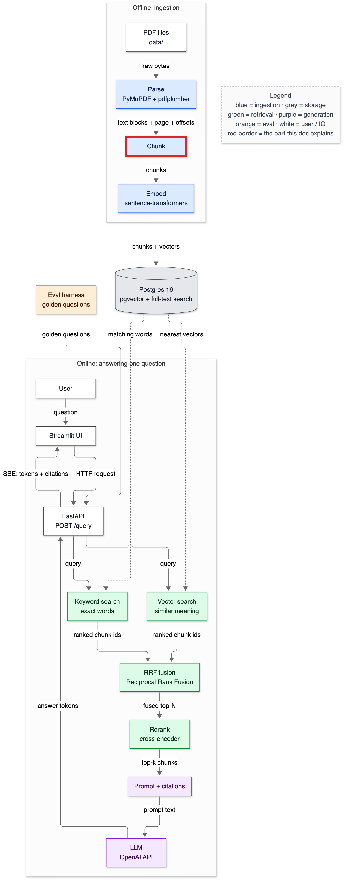
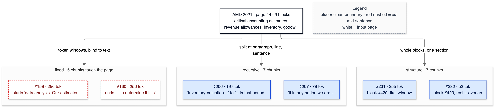
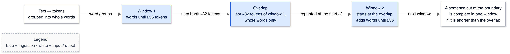

# 06 — Chunking

**Status:** written in Phase 3 (2026-10-02). Owns: chunk, chunking strategy (fixed / recursive / structure-aware / semantic), chunk size, overlap, WordPiece tokenizer, special tokens, truncation, offset mapping, parent-document retrieval, Strategy and Factory patterns (as used here).

> Prerequisites: [05-pdf-parsing.md](05-pdf-parsing.md) (blocks, sections, the offset invariant). Numbers come from `python -m app.ingest.chunk_corpus --check` and `tests/test_chunking.py`, run on 2026-10-02.

---

## 1. In one paragraph

Search engines don't return whole 500-page filings; they return passages. **Chunking** decides where one passage ends and the next begins. Think of cutting a long newspaper into index cards: cut every 20 lines regardless of content (*fixed*), cut at paragraph or sentence breaks when you can (*recursive*), or cut along the article's own headings so each card is one section (*structure-aware*). Each card must fit what the embedding model can read (510 tokens here), each should make sense on its own, and — the rule this project never breaks — each remembers exactly which characters of the document it came from.

## 2. Why it exists

- **The embedding model has a hard input limit.** bge-small reads at most 512 tokens *including* its two special tokens, and anything longer is silently cut off. A whole page of Verizon text (~4,200 characters ≈ 900 tokens) can't be embedded as one unit without losing half of it.
- **Precision.** A vector for a whole section averages many topics; a question about one sentence matches it weakly. Smaller chunks give sharper matches — but too small and a chunk loses the context that makes it answerable ("it increased 19%" — *what* did?).
- **Prompt budget.** The LLM sees top-k chunks. Chunk size × k is the evidence budget in tokens per question.
- **It's an experiment lever.** Strategy and size are two axes of the Phase 12 ablation. That's why chunkers are interchangeable objects driven by configuration.

## 3. Where it sits



<details><summary>Same diagram as text (for terminal viewing)</summary>

```text
 OFFLINE
 ┌───────────┐  ┌───────┐  ╔═══════╗  ┌───────┐   ┌─────────────────────────────┐
 │ PDF files │─▶│ Parse │─▶║ Chunk ║─▶│ Embed │──▶│ Postgres 16                 │
 └───────────┘  └───────┘  ╚═══════╝  └───────┘   │ pgvector + full-text search │
                                                  └──────────────┬──────────────┘
 ONLINE                                                          │ searched by
 ┌───────────┐  ┌─────────┐     query     ┌──────────────────────▼──────────────┐
 │ Streamlit │─▶│ FastAPI │──────────────▶│ Vector search  +  Keyword search    │
 └─────▲─────┘  └──┬───▲──┘               └──────────────────────┬──────────────┘
       │    SSE    │   │ answer tokens                           │ two ranked lists
       └───────────┘   │                                         ▼
               ┌───────┴──────┐  ┌────────────────────┐  ┌────────┐  ┌────────────┐
               │ LLM (OpenAI) │◀─│ Prompt + citations │◀─│ Rerank │◀─│ RRF fusion │
               └──────────────┘  └────────────────────┘  └────────┘  └────────────┘

 Double-line box (╔═╗) = the part this doc explains: chunking.
```
</details>

## 4. The flow

### The same page, three ways

Page 44 of AMD's 2021 10-K (critical accounting estimates — revenue allowances, inventory, goodwill), 256-token chunks:



<details><summary>Same diagram as text (for terminal viewing)</summary>

```text
                     ┌──────────────────────────────────────────┐
                     │ AMD 2021 · page 44 · 9 blocks            │
                     │ revenue allowances, inventory, goodwill  │
                     └──────┬──────────────┬──────────────┬─────┘
       token windows, blind │ split at     │ whole blocks,│
       to text              │ ¶ / line /   │ one section  │
                            ▼ sentence     ▼              ▼
 ┌─ fixed · 5 chunks ──────────┐ ┌─ recursive · 7 ─────────┐ ┌─ structure · 7 ─────────┐
 │ ┌ ─ ─ ─ ─ ─ ─ ─ ─ ─ ─ ─ ─ ┐ │ │ ┌─────────────────────┐ │ │ ┌─────────────────────┐ │
 │  #158 · 256 tok            │ │ │ #206 · 197 tok      │ │ │ │ #231 · 255 tok      │ │
 │ │starts "data analysis.  │ │ │ │ "Inventory Valuation│ │ │ │ block #420, first   │ │
 │  Our estimates…"           │ │ │ …in that period."   │ │ │ │ window              │ │
 │ └ ─ ─ ─ ─ ─ ─ ─ ─ ─ ─ ─ ─ ┘ │ │ └─────────────────────┘ │ │ └─────────────────────┘ │
 │ ┌ ─ ─ ─ ─ ─ ─ ─ ─ ─ ─ ─ ─ ┐ │ │ ┌─────────────────────┐ │ │ ┌─────────────────────┐ │
 │  #160 · 256 tok            │ │ │ #207 · 78 tok       │ │ │ │ #232 · 52 tok       │ │
 │ │ends "…to determine if  │ │ │ │ "If in any period   │ │ │ │ block #420, rest +  │ │
 │  it is"                    │ │ │ we are…"            │ │ │ │ overlap             │ │
 │ └ ─ ─ ─ ─ ─ ─ ─ ─ ─ ─ ─ ─ ┘ │ │ └─────────────────────┘ │ │ └─────────────────────┘ │
 └─────────────────────────────┘ └─────────────────────────┘ └─────────────────────────┘
 Legend (colours appear in the image): blue = clean boundary · red dashed = cut mid-sentence
```
</details>

The real output (`[char_start, char_end)`, tokens, first and last words):

```text
== fixed
  chunk 157 p43-44 [187395,188855) 256 tok | 'subjective and complex judgments. Revenue Allowances.' … 'attainment rates and estimates of'
  chunk 158 p44-44 [188667,190149) 256 tok | 'data analysis. Our estimates of necessary' … 'utilize relevant, trended actual historical'
  chunk 159 p44-44 [189962,191486) 256 tok | 'estimate adjustments to revenue to account' … 'such as recent historical sales'
  chunk 160 p44-44 [191302,192688) 256 tok | 'products, and changes in technology or' … 'to determine if it is'
  chunk 161 p44-45 [192519,193965) 256 tok | 'The analysis may include both qualitative' … 'to that reporting unit. Income'
== recursive
  chunk 203 p43-44 [187226,188681) 251 tok | 'Management believes the following critical accounting' … 'and external market data analysis.'
  chunk 204 p44-44 [188683,189582) 157 tok | 'Our estimates of necessary adjustments for' … 'they qualify for expense recognition.'
  chunk 205 p44-44 [189584,190743) 195 tok | 'We also provide limited product return' … 'our revenue and operating results.'
  chunk 206 p44-44 [190745,191867) 197 tok | 'Inventory Valuation. We value inventory at' … 'gross margin in that period.'
  chunk 207 p44-44 [191868,192285) 78 tok | 'If in any period we are' … 'materially consistent with actual results.'
  chunk 208 p44-44 [192287,193119) 151 tok | 'Goodwill. We perform our goodwill impairment' … 'perform a quantitative impairment test.'
  chunk 209 p44-45 [193121,194391) 218 tok | 'If we conclude it is more' … 'and financial statement reporting purposes.'
== structure
  chunk 228 p43-44 [187430,188681) 222 tok | 'Revenue Allowances. Revenue contracts with our' … 'and external market data analysis.'
  chunk 229 p44-44 [188683,189582) 157 tok | 'Our estimates of necessary adjustments for' … 'they qualify for expense recognition.'
  chunk 230 p44-44 [189584,190743) 195 tok | 'We also provide limited product return' … 'our revenue and operating results.'
  chunk 231 p44-44 [190745,192161) 255 tok | 'Inventory Valuation. We value inventory at' … 'our gross margin in that'
  chunk 232 p44-44 [192000,192285) 52 tok | 'a previous period, related revenue would' … 'materially consistent with actual results.'
  chunk 233 p44-44 [192287,193119) 151 tok | 'Goodwill. We perform our goodwill impairment' … 'perform a quantitative impairment test.'
  chunk 234 p44-45 [193121,194391) 218 tok | 'If we conclude it is more' … 'and financial statement reporting purposes.'
```

What to see: **fixed** chunks are always exactly 256 tokens and start and end mid-sentence ("data analysis. Our estimates…", "…to determine if it is"). **Recursive** chunks end at paragraph or sentence breaks, so sizes vary (78–251). **Structure** chunks are whole paragraphs from one section; block #420 ("Inventory Valuation…", 1,540 characters) is bigger than 256 tokens, so it's split into two windows that overlap by 161 characters (#231 ends at 192,161; #232 starts at 192,000). Recursive and structure agree on four of seven chunks here — both respect paragraphs.

### How overlap works



<details><summary>Same diagram as text (for terminal viewing)</summary>

```text
 ┌──────────────────┐ word groups ┌──────────────────┐ step back   ┌──────────────────┐
 │ Text → tokens,   │ ──────────▶ │ Window 1: words  │ ~32 tokens  │ Overlap: last    │
 │ grouped into     │             │ until 256 tokens │ ──────────▶ │ ~32 tokens, whole│
 │ whole words      │             └──────────────────┘             │ words only       │
 └──────────────────┘                                              └────────┬─────────┘
                                                                            │ repeated at
                                                                            ▼ the start of
 ┌──────────────────────────────┐  next window  ┌──────────────────────────────────────┐
 │ A sentence cut at a boundary │ ◀──────────── │ Window 2: starts at the overlap,     │
 │ is complete in one window if │               │ adds words until 256 tokens          │
 │ shorter than the overlap     │               └──────────────────────────────────────┘
 └──────────────────────────────┘
 Legend (colours appear in the image): blue = ingestion · white = input / effect
```
</details>

## 5. The code

### One interface, three implementations — `app/ingest/chunking.py`

```python
class Chunker(Protocol):
    name: str
    size: int
    overlap: int

    def chunk(self, doc: ParsedDocument) -> list[Chunk]: ...
```

A `Protocol` says "anything with these attributes and this method is a Chunker" — no base class needed. This is the **Strategy pattern**: callers (ingestion, the ablation runner) hold a `Chunker` and never ask which one.

```python
CHUNKERS = {"fixed": FixedSizeChunker, "recursive": RecursiveChunker, "structure": StructureChunker}

def get_chunker(strategy: str, size: int, overlap: int) -> Chunker:
    limit = get_settings().embedding_max_tokens - 2
    if not 0 < size <= limit:
        raise ValueError(...)
```

The **Factory**: the one place a configuration string becomes an object. The size check exists because the first corpus run with size 512 produced chunks of 511–512 tokens; bge-small reads 512 tokens *including* `[CLS]` and `[SEP]`, so they would have lost their last tokens silently (T-020). The largest allowed size is 510.

### `Chunk` — what every strategy returns

```python
@dataclass(frozen=True)
class Chunk:
    chunk_index: int
    char_start: int
    char_end: int
    page_number: int        # page where the chunk starts
    page_end: int           # page where it ends
    section: tuple[str, ...]
    token_count: int
    text: str
```

`page_end` exists because chunks cross page breaks — at 256 tokens, between 1,321 (structure) and 2,416 (fixed) chunks of the corpus do. `make_chunk` fills both with `doc.page_of(...)` (the binary search from [05](05-pdf-parsing.md#5-the-code)).

### Windows of whole words

```python
def word_groups(spans):
    for start, end in spans:
        if groups and start == groups[-1][1]:
            groups[-1][1] = end
            groups[-1][2] += 1
```

The tokenizer's **offset mapping** gives each token's character span. A token that starts exactly where the previous one ended is part of the same word ("16,434" → `16 | , | 43 | ##4`, four tokens, one word). The first version cut windows at arbitrary tokens; a window starting at `##4` re-tokenizes differently on its own, and a "256-token" window measured 257 (T-018). Cutting only between words makes the window's count exact.

```python
        back, repeated = last, 0
        while back - 1 > first and repeated + words[back - 1][2] <= overlap:
            back -= 1
            repeated += words[back][2]
        first = back
```

Overlap: step back from the end of the window, one whole word at a time, until about `overlap` tokens would repeat — and always at least one word past the previous start, so the loop can't stall.

### Recursive: LangChain's splitter, our offsets

```python
        self.splitter = RecursiveCharacterTextSplitter(
            chunk_size=size, chunk_overlap=overlap, length_function=count_tokens,
            separators=["\n\n", "\n", ". ", " ", ""], keep_separator="end")
...
            start = doc.text.find(text, previous + 1)
```

The splitter tries `\n\n` (our block separator) first, then line breaks, sentence ends, spaces, and finally characters, merging pieces up to `chunk_size` measured by `count_tokens`. `keep_separator="end"` keeps a sentence's full stop at the end of its chunk; the default starts the next chunk with ". ".

Why `find` instead of LangChain's `add_start_index`? Its implementation (langchain-text-splitters 1.1.2) computes the search position as `index + previous_chunk_len - self._chunk_overlap` — subtracting the overlap as **characters**. Ours is 32 *tokens* (~150 characters), so it starts searching after the real chunk start and returns -1 (T-019). Since every chunk starts after the previous one, `find(text, previous + 1)` is exact; a test asserts both the LangChain bug and our fix.

### Structure-aware

```python
            has_body = any(b.kind != "heading" for b in group)
            new_section = bool(group) and block.section[:2] != group[-1].section[:2]
            if (has_body and (block.kind == "heading" or new_section)) or group_tokens + tokens > self.size:
                flush()
```

Whole blocks accumulate until the next would exceed `size`, a heading arrives, or the PART/ITEM changes. `has_body` was added after the first corpus run: without it, "PART II", "ITEM 5…" and the first paragraph became three separate chunks of a few tokens (5th-percentile chunk: 4–6 tokens → 12–19 after the fix).

```python
            if tokens > self.size:
                flush()
                spans = [(s + block.char_start, e + block.char_start) for s, e in token_spans(block.text)]
                ranges.extend(token_windows(spans, self.size, self.overlap))
```

A single block bigger than a chunk (long tables, long paragraphs) falls back to overlapping word windows *inside* that block, with offsets shifted into document coordinates.

## 6. Data in / data out

**In:** a `ParsedDocument` (e.g. AMD 2021: 382,827 characters, 1,402 blocks). **Out:** a list of `Chunk`s; one real structure chunk:

```text
Chunk(chunk_index=229, char_start=188683, char_end=189582, page_number=44, page_end=44,
      section=('PART II', 'ITEM 7. MANAGEMENT’S DISCUSSION AND ANALYSIS OF FINANCIAL CONDITION AND RESULTS OF OPERATIONS', …),
      token_count=157, text='Our estimates of necessary adjustments for OEM price incentives …')
```

`text` is exactly `doc.text[188683:189582]` — never a copy that could drift.

**The whole corpus, every configuration** (`python -m app.ingest.chunk_corpus --check`, 2 min 46 s; overlap = size ÷ 8):

```text
strategy  size ovl chunks   p5  p50  p95  max  <25% x-page   tokens  secs
fixed      128  16  11206  126  128  128  128     1   2456  1429197   8.1
fixed      256  32   5604  254  256  256  256     1   2416  1431386   6.0
fixed      510  63   2809  508  510  510  510     0   2117  1429862   6.3
recursive  128  16  13870   24  105  127  128  1087   1439  1281398  17.5
recursive  256  32   6538   66  223  255  256   306   1808  1310436  12.8
recursive  510  63   3042  240  473  508  510    76   1872  1330665  11.2
structure  128  16  14513   12  107  128  128  1947   1020  1308474   6.9
structure  256  32   7411   19  196  256  256  1061   1321  1275337   6.2
structure  510  63   4183   16  335  507  510    984   1406  1260067   5.6
```

- `chunks` — how many vectors Phase 4 must compute and store for that configuration.
- `p5 / p50 / p95 / max` — token-count percentiles. Fixed is uniform by construction; recursive and structure vary because they respect boundaries.
- `<25%` — chunks under a quarter of the target size. Structure has the most (984–1,947): genuinely short sections like "Item 4. Mine Safety Disclosures — Not applicable." Many tiny chunks can crowd the top-k with low-information matches; whether that hurts is a Phase 12 question.
- `x-page` — chunks that cross a page break, which is why `page_end` exists.
- `tokens` — total tokens across all chunks. Fixed counts the overlap on every window, so it's highest; structure overlaps only inside split blocks.

## 7. Decisions & alternatives

<!-- card:start id=8 -->
#### Decision: Three pluggable chunkers — fixed, recursive, structure-aware — with structure-aware as the default  (rejected: one hard-coded strategy, semantic chunking, LLM-based chunking)

**One-line defence.** Which strategy wins is an empirical question on this corpus, so all three exist behind one interface with identical offset guarantees; structure-aware is the default because 10-Ks have reliable section structure and its chunks never mix two Items.

**What problem is this even solving?** Something must decide passage boundaries. Bad boundaries split an answer across two chunks (neither matches well) or mix topics (the vector is a blur). Delete chunking and you embed whole documents — 250,000 tokens into a 510-token model.

**The options, compared.**

| Option | How it works (1 line) | Strengths | Weaknesses | When it's the right call |
|---|---|---|---|---|
| ✅ Structure-aware (default) | Whole blocks within one section, heading opens a chunk, big blocks windowed | Chunks are self-contained sections; never mixes Items; headings at chunk starts | Variable sizes; many tiny chunks (1,061 under 64 tokens at size 256); depends on parser heading quality | Documents with reliable structure |
| ✅ Recursive character | Split at ¶, line, sentence, word — whichever fits | Natural boundaries without needing headings; mature implementation | Can mix the end of one section with the next; still variable sizes | Unstructured or inconsistently structured text |
| ✅ Fixed size | Equal token windows with overlap | Simplest; uniform cost; perfect baseline | Cuts mid-sentence and mid-table; blind to sections | Baselines; uniform text like transcripts |
| Semantic chunking | Embed sentences; cut where consecutive similarity drops | Topic-coherent chunks | Embeds every sentence (cost); thresholds to tune; boundaries non-obvious to debug | Long unstructured prose with topic shifts |
| LLM-based chunking | Ask an LLM to segment the text | Can follow complex structure | Cost and latency per page; non-deterministic; offsets must be recovered | Small, high-value document sets |

**What would actually change if we swapped it.** Adding semantic chunking: a fourth class in `app/ingest/chunking.py` plus one dictionary entry; it would embed roughly every sentence of 6 M characters at ingest (Phase 4 measures embedding throughput), and its boundaries depend on a similarity threshold that would become a new ablation axis. Nothing downstream changes — that's the point of the interface. Removing the alternatives and keeping only one: the ablation's strategy axis disappears and card #9's numbers can't be produced.

**The decision rule.** Respect the document's own structure when it's reliable; fall back to natural-language boundaries (paragraph, sentence) when it isn't; use fixed windows only as a baseline or for uniform text. Make the choice configurable and measure, because the winner depends on the questions as much as the documents.

**Where our choice breaks.** Structure-aware is only as good as heading detection: Corning 2021 had 18 headings before the parser fix and would have produced section-blind chunks. It also creates many tiny chunks for short sections, which can crowd the top-k. Migration path: merge tiny sections with their neighbour within the same Item, or prepend the section path to each chunk's *embedding input* (not its stored text).

**The number.** At 256 tokens: fixed 5,604 chunks (p50 256), recursive 6,538 (p50 223), structure 7,411 (p50 196, 1,061 under 64 tokens). Retrieval quality per strategy: not yet measured — Phase 12.

**Interview script (3 sentences).** "I built three chunkers behind one interface — fixed windows, LangChain's recursive splitter, and a structure-aware one that groups whole blocks within a 10-K section — all with exact character offsets. Structure-aware is the default because these filings have reliable headings, and its chunks never mix two Items. Which one actually retrieves best is a measured result in my ablation, not an assumption: ⟨Phase 12⟩."

**Follow-ups they will ask:**
- Q: Why not semantic chunking? → A: It needs an embedding per sentence at ingest and a similarity threshold to tune, and its boundaries are hard to explain when they're wrong. 10-Ks already mark topic boundaries with headings, which are free and explainable. If my structure chunks underperformed on prose-heavy sections, semantic chunking is what I'd try next.
- Q: How do you know structure-aware chunks don't mix sections? → A: A test walks every structure chunk of AMD 2021 and checks that all non-heading blocks inside it share one PART/ITEM.
- Q: Isn't a heading-only chunk useless? → A: Yes, which is why consecutive headings now stay with the body that follows; that raised the 5th-percentile chunk from 4–6 tokens to 12–19.
- Q: Do the strategies produce comparable results for evaluation? → A: Yes — that's why offsets matter: every chunk from every strategy is a range of the same canonical text, so relevance is judged by overlap with one set of evidence spans.
- Q (the hard one): Your recursive and structure chunkers agree on most of page 44. Is the distinction even meaningful? → A (honest): On prose pages they converge because both respect paragraphs; they differ at section boundaries (recursive will merge the end of one Item into the next) and around tables. Whether that difference moves recall is exactly what the ablation measures — it might not, and I'll report it if it doesn't.
- Q: Why LangChain for one chunker? → A: Recursive splitting is a solved problem and theirs is battle-tested. But its `start_index` is wrong when chunk length is measured in tokens, so I compute offsets myself — and a test pins both the bug and the fix.

**The trap.** Naming a "best" chunking strategy without data. The right answer is "it depends on the documents and the questions — here's how I measured it."
<!-- card:end -->

<!-- card:start id=9 -->
#### Decision: Sizes 128 / 256 / 510 tokens with overlap = size ÷ 8; default 256 / 32  (rejected: character-based sizes, sizes over the model limit, zero overlap, 50% overlap)

**One-line defence.** Sizes are measured in the embedding model's own tokens because that's the unit it truncates in; 510 is the hard ceiling, and the three sizes bracket the precision-versus-context trade-off for the ablation.

**What problem is this even solving?** Chunk size sets how much text one vector summarises and how much evidence each retrieved result carries into the prompt; overlap decides whether a sentence cut at a boundary survives intact somewhere.

**The options, compared.**

| Option | How it works (1 line) | Strengths | Weaknesses | When it's the right call |
|---|---|---|---|---|
| ✅ Token sizes 128/256/510, overlap 1/8 | Count with the embedding tokenizer; three sizes as ablation levels | No silent truncation; directly comparable; modest storage overhead | More chunks at 128 (≈14k) → more vectors and slower ingest | Default for this project |
| Character sizes (e.g. 1,000 chars) | Count characters | Tokenizer-free, simple | Token count per character varies (Corning: 2.64 vs 4.34 chars/token) → some chunks silently truncated | Models with very large limits |
| Size above the model limit (e.g. 1,024) | Bigger chunks | More context per chunk | The model only sees the first 510 tokens; the rest is invisible to vector search | Never with this model |
| Zero overlap | Windows end-to-end | Fewest chunks | A sentence straddling a boundary is split in both chunks | Structure-aware chunks of whole blocks (we only window oversized blocks) |
| 50% overlap | Each window repeats half the previous one | Boundary-cut sentences always appear whole | Doubles the number of chunks and vectors; near-duplicate results crowd top-k | Very short, dense windows |

**What would actually change if we swapped it.** Moving the default to 510: ~4,200 structure chunks instead of ~7,400 (roughly 45% fewer vectors, and less embedding time in Phase 4), but each retrieved chunk carries ~2× the tokens into the prompt, so a top-5 evidence budget grows from about 1,000 to about 1,700 tokens (5 × the median chunk: 196 vs 335) and LLM input cost per query rises accordingly. Moving to characters: one setting changes, and a new failure mode appears — silent truncation on token-dense text.

**The decision rule.** Measure size in the units of the component that enforces the limit. Pick the smallest size whose chunks are still self-explanatory for the questions you expect; bracket it (½×, 1×, 2×) and measure. Use overlap only where boundaries are arbitrary, and keep it small (10–15%) so it doesn't create near-duplicate results.

**Where our choice breaks.** Questions needing context spread over more than ~500 tokens (a whole table with its headers, a multi-paragraph explanation) can't be answered by one chunk at any allowed size. Migration path: parent-document retrieval (card #10) or a long-context embedding model.

**The number.** Chunks at 128 / 256 / 510: fixed 11,206 / 5,604 / 2,809; recursive 13,870 / 6,538 / 3,042; structure 14,513 / 7,411 / 4,183. Quality per size: not yet measured — Phase 12.

**Interview script (3 sentences).** "Chunk sizes are in the embedding model's own tokens — 128, 256 and 510 — because that's the unit it silently truncates in, and 510 is its 512 limit minus the two special tokens. Overlap is an eighth of the size, applied only where a boundary is arbitrary. The trade-off is precision versus context per chunk, and my ablation measures it instead of guessing."

**Follow-ups they will ask:**
- Q: Why exactly 510 and not 512? → A: bge-small's 512-token limit includes `[CLS]` at the start and `[SEP]` at the end. A 512-content-token chunk becomes 514 tokens and loses its last two. My first run at size 512 produced exactly such chunks; the factory now rejects sizes above 510.
- Q: What does overlap buy you? → A: If a sentence is cut by a window boundary, overlap repeats the end of one window at the start of the next, so a sentence shorter than the overlap appears whole in at least one chunk. The cost is more chunks and near-duplicate neighbours in results.
- Q: Why count tokens and not characters? → A: Characters per token vary from 2.64 to 4.80 across this corpus (Phase 1), so a fixed character budget overflows the model on some documents.
- Q: How does chunk size affect the LLM cost? → A: The prompt carries k chunks, so its evidence tokens ≈ k × average chunk size; going from 256 to 510 roughly doubles the per-question input.
- Q (the hard one): Your structure chunks average under the target size. Are you comparing like with like across strategies? → A (honest): Not exactly — "size 256" is a ceiling for recursive and structure but an exact length for fixed (p50 196 vs 256). I'll report the actual median chunk size next to each result, so a strategy can't win just by having bigger chunks.

**The trap.** "Bigger chunks give the LLM more context, so they're better." Past the model limit the extra text isn't embedded at all, and bigger chunks blur the vector.
<!-- card:end -->

<!-- card:start id=10 -->
#### Decision: Retrieve at chunk level  (rejected for now: sentence-level retrieval, parent-document retrieval, multi-granularity)

**One-line defence.** One unit for both matching and context keeps the pipeline and its evaluation simple; parent-document retrieval is the planned escalation if table and multi-paragraph questions fail.

**What problem is this even solving?** The unit you *match* on and the unit you *give to the LLM* don't have to be the same. Small units match precisely but carry little context; big units carry context but match vaguely.

**The options, compared.**

| Option | How it works (1 line) | Strengths | Weaknesses | When it's the right call |
|---|---|---|---|---|
| ✅ Chunk-level | Match and return the same 128–510-token chunks | Simple; one index; eval unit = retrieval unit | Precision/context trade-off fixed by one size | Default |
| Sentence-level | Embed every sentence; return sentences | Very precise matches | Too little context to answer; ~10× more vectors | Fact lookup with short answers |
| Parent-document | Match small child chunks, return their larger parent (section) | Precise matching *and* full context | Two levels to store and keep in sync; larger prompts; eval must decide which level counts | Answers spanning paragraphs or tables |
| Multi-granularity | Index several sizes, fuse results | Best of each | Duplicate content in results; complex | Mature systems with measured need |

**What would actually change if we swapped it.** Parent-document: a `parent_chunk_id` column in Phase 4's schema, a second chunking pass (structure sections as parents, small windows as children), retrieval that maps child hits to parents before reranking, and evidence-span relevance judged on the returned parent. Prompt tokens per question would rise with parent size. About a day of work.

**The decision rule.** Start with one granularity sized for the typical answer. Split matching from context only when evaluation shows answers spanning more than one chunk.

**Where our choice breaks.** Questions whose evidence is a whole table or spans several paragraphs. The evidence for that will come from Phase 11's multi-hop and table questions.

**The number.** Not yet measured — Phase 11 reports how many golden answers' evidence spans more than one chunk.

**Interview script (3 sentences).** "I retrieve at chunk level, so the unit I match on is the unit I hand to the LLM, which keeps both the pipeline and the evaluation simple. If the eval shows answers spanning several chunks — big tables are the likely case — the next step is parent-document retrieval: match small chunks, return their section. I'd add it on evidence, not by default."

**Follow-ups they will ask:**
- Q: What is parent-document retrieval? → A: Index small "child" chunks for precise matching, but return the larger "parent" they belong to, so the LLM sees the full context. Child and parent are linked by id.
- Q: Why not just make chunks bigger? → A: Bigger chunks blur the vector — a 510-token chunk about three topics matches each topic weakly — and you can't exceed the model's 510 tokens anyway.
- Q: How would evaluation change with parents? → A: Relevance would be judged on the returned parent span, which is larger, so precision@k would look worse even if answers improve. I'd report both levels.
- Q: Sentence-level for numbers? → A: A sentence like "Net revenue grew 19%" lacks the subject (which segment? which year?), so it'd need its section prepended — which is half-way to parent retrieval.
- Q (the hard one): Wouldn't parent retrieval fix your table header problem? → A (honest): Partly — returning the whole table's section would include the column headers that the parser separated from the table block. But a big statement can exceed the prompt budget on its own. I haven't measured it.

**The trap.** Assuming the unit of retrieval must be the unit of context. Separating them is a standard technique — and a sign you understand the trade-off.
<!-- card:end -->

## 7a. Prerequisite concepts

**Tokenizer and WordPiece** — bge-small uses a BERT **WordPiece** tokenizer: text is lowercased, split on whitespace and punctuation, then each word is broken into the longest pieces found in a 30,522-entry vocabulary. Pieces that continue a word are marked `##`. Real example: `Net revenue | $ 16,434` → `net, revenue, |, $, 16, ",", 43, ##4` — 8 tokens. Numbers are expensive: one figure, four tokens.

**Special tokens** — the model wraps every input as `[CLS] … [SEP]`. They count against the 512-token limit, leaving 510 for text.

**Truncation** — when input exceeds the limit, the tokenizer drops everything after token 512, without an error. The vector then represents only the beginning of the chunk.

**Offset mapping** — a fast tokenizer can return, for each token, the `[start, end)` character span it came from. That's the bridge from token windows back to character offsets in the canonical text. Measured: tokenizing all 1,180,390 characters of PepsiCo 2022 → 247,369 tokens with offsets in 0.5 s.

**Chunk overlap** — repeating the last few tokens of one chunk at the start of the next. Worked example from page 44: block #420 is split into windows `[190745, 192161)` and `[192000, 192285)`, so characters 192,000–192,160 appear in both.

**Recursive splitting** — try the coarsest separator first (`\n\n`); any piece still too big is split by the next separator (`\n`), then `. `, then ` `, then single characters; small neighbouring pieces are merged back up to the size limit.

**Semantic chunking** — embed each sentence; cut where the similarity between consecutive sentences drops below a threshold (a topic shift). Not built here; see card #8.

**Strategy and Factory patterns** — *Strategy*: several interchangeable implementations behind one interface (`Chunker`). *Factory*: one function that turns configuration into the right implementation (`get_chunker`). Together they make "strategy" a single setting in `app/config.py` (`chunk_strategy`, `chunk_size`, `chunk_overlap`).

## 7b. What if we used something else?

| If we had used… | Immediate effect | Effect on quality metrics | Effect on latency/cost | Effect on complexity | Would I defend it? |
|---|---|---|---|---|---|
| Size 512 instead of 510 | Some chunks lose their last 1–2 tokens | Slightly blurred vectors for those chunks | None | Same | No — measured as truncating |
| LangChain's `start_index` | Offsets of -1 | Citations and span-based eval break | None | Lower | No — measured as wrong |
| Windows cut at any token | Off-by-one token counts | Rare truncation at the 510 limit | None | Lower | No |
| Default `keep_separator` | Chunks start with ". " | Negligible | None | Same | No — cosmetic but sloppy |
| Only fixed-size chunking | No strategy axis in the ablation | Probably worse on section questions (to be measured) | Fewest tokens per chunk count | Lowest | Only as a baseline |
| Semantic chunking | A fourth strategy | Unknown | An embedding per sentence at ingest | Higher | Maybe later, on evidence |

## 8. Failure modes

| What you see | Cause | Fix |
|---|---|---|
| `ValueError: AMD_2021_10K: LangChain start_index -1 does not match chunk 1` (first version) | LangChain subtracts `chunk_overlap` as characters (T-019) | Locate chunks with `find(text, previous + 1)` |
| A "256-token" fixed chunk measures 257 | Window started mid-word (`##` piece) (T-018) | Cut windows only between whole words |
| Chunks of 511–512 tokens | Size 512 ignores `[CLS]`/`[SEP]` (T-020) | Factory rejects size > 510 |
| `ValueError: chunk size 512 must be between 1 and 510 tokens` | Asked for an oversized configuration | Use ≤ 510 |
| Many 4–6-token chunks | Each heading started its own chunk | Keep heading runs with the following body (`has_body`) |
| `Warning: You are sending unauthenticated requests to the HF Hub` | First tokenizer download without an HF token | Harmless for public models; set `HF_TOKEN` for higher rate limits |
| Structure chunks mix two sections | Parser missed a heading | Check the parser's headings for that document ([05](05-pdf-parsing.md)); `test_real_structure_chunks_stay_inside_one_item` guards AMD |

## 9. Try it yourself

```bash
.venv/bin/python -m app.ingest.chunk_corpus --check
```

Expected: the nine-row table from §6 (about 3 minutes; the first run also downloads the tokenizer files, under 1 MB, into `data/models/`).

See one chunk and prove its offsets:

```bash
.venv/bin/python -c "from app.ingest.chunking import get_chunker; from app.ingest.parse_corpus import manifest_documents, load_or_parse; d = load_or_parse(next(e for e in manifest_documents() if e['doc_key']=='AMD_2021_10K')); c = get_chunker('structure', 256, 32).chunk(d)[229]; print(c.char_start, c.char_end, c.token_count, d.text[c.char_start:c.char_end] == c.text)"
```

Expected: `188683 189582 157 True`.

```bash
.venv/bin/python -m pytest tests/test_chunking.py -q
```

Expected: `13 passed`.

## 10. Numbers

| What | Value | Command |
|---|---|---|
| Chunks per configuration | see §6 table (2,809 – 14,513) | `python -m app.ingest.chunk_corpus` |
| Chunking all 10 docs, one config | 5.6 – 17.5 s | same |
| Tokenizer speed | 1,180,390 chars → 247,369 tokens + offsets in 0.5 s | one-off check, 2026-10-02 |
| Structure p5 chunk size before/after heading fix (256) | 5 → 19 tokens | `chunk_corpus` before and after |
| Retrieval quality per strategy/size | not yet measured | Phase 12 |

## 11. Interview talking points

- "Three chunkers behind one interface — fixed, recursive, structure-aware — all returning chunks with exact character offsets into the same canonical text, so they're comparable in evaluation."
- "Sizes are in the embedding model's tokens; the ceiling is 510 because of `[CLS]` and `[SEP]` — I found that by measuring 511–512-token chunks."
- "LangChain's `start_index` is wrong when length is in tokens; I verify offsets myself and a test pins the bug."
- "Which strategy wins is an ablation result, not an opinion."
- Expect: "Why not semantic chunking?", "How did you pick the size?", "What does overlap do?"

## 12. Check yourself

1. Why is the maximum chunk size 510 and not 512?
2. Why did LangChain's `start_index` return -1, and how does the project compute offsets instead?
3. A fixed-size window measured 257 tokens when re-tokenized. What happened, and what's the fix?

<details><summary>Answers</summary>

1. bge-small reads 512 tokens *including* the `[CLS]` and `[SEP]` it adds around every input, so only 510 are available for text; anything more is silently truncated.
2. LangChain computes the search position as `index + previous_chunk_len - chunk_overlap`, treating the overlap as characters. With a token length function, 32 tokens of overlap is ~150 characters, so the search starts after the true start and `find` fails. The project searches with `doc.text.find(chunk, previous_start + 1)`, valid because each chunk starts after the previous one, and verifies every result.
3. The window started on a `##` continuation token (mid-word). Re-tokenizing that slice alone produces different pieces, so the count changed. Windows are now cut only between whole words (tokens grouped by contiguous offsets).

</details>

## 13. New terms added to the glossary

chunking strategy (fixed, recursive, structure-aware, semantic), chunk overlap, WordPiece, special tokens ([CLS], [SEP]), truncation, offset mapping, parent-document retrieval, Strategy pattern, Factory pattern, Protocol (Python typing) — see [21-glossary.md](21-glossary.md).
