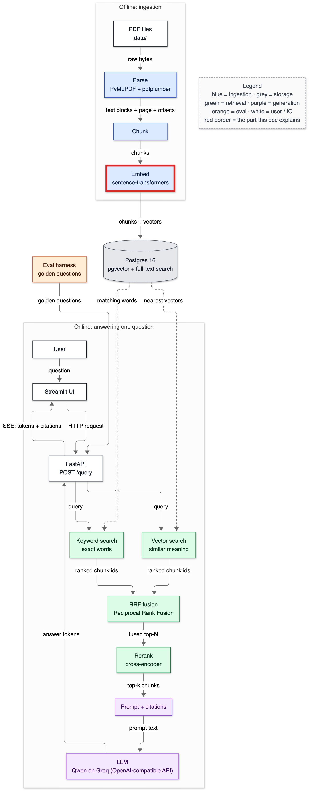
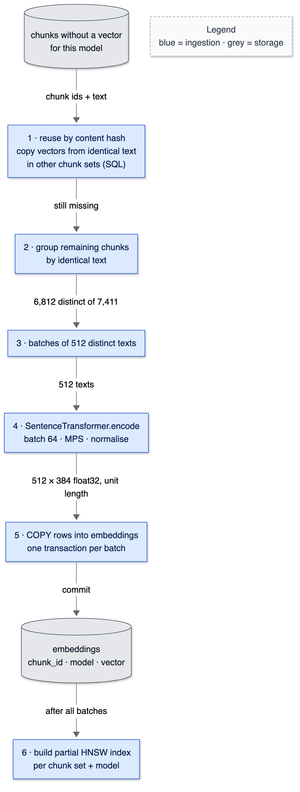

# 07 — Embeddings

**Status:** written in Phase 4 (2026-10-02). Owns: vector, embedding, dimension, dot product, norm, cosine similarity, normalisation, bi-encoder, pooling, contrastive training, query instruction, batching, embedding cache, device (CPU / MPS), model revision pinning, re-embedding migration.

> Prerequisites: [06-chunking.md](06-chunking.md) (what gets embedded, and the 510-token limit). Numbers come from `make ingest` and the benchmark in §10, run on 2026-10-02.

---

## 1. In one paragraph

An **embedding** turns a piece of text into a list of numbers — here 384 of them — such that texts with similar meaning get similar lists. Imagine placing every chunk as a pin on a map: chunks about revenue cluster in one neighbourhood, chunks about pension plans in another, and the cafeteria menu somewhere far away. A question is turned into a pin on the same map, and "search" becomes "find the nearest pins". This doc covers how the numbers are made (a small neural model, bge-small, running on the laptop's GPU), what "near" means mathematically (cosine similarity), and how 6,812 distinct chunks become stored vectors in 70 seconds.

## 2. Why it exists

Keyword search matches words. In Phase 0 it missed "grew" for "grow" ([01](01-what-is-rag.md#6-data-in--data-out)); in general it can't see that "sales grew" and "revenue increased" say the same thing. Measured on the model used here: those two sentences have cosine similarity 0.715, while "revenue increased" vs "the cafeteria serves lunch" scores 0.366. Embeddings give the system a sense of *meaning*; without them, every paraphrased question depends on the user guessing the document's exact wording.

## 3. Where it sits



<details><summary>Same diagram as text (for terminal viewing)</summary>

```text
 OFFLINE
 ┌───────────┐  ┌───────┐  ┌───────┐  ╔═══════╗   ┌─────────────────────────────┐
 │ PDF files │─▶│ Parse │─▶│ Chunk │─▶║ Embed ║──▶│ Postgres 16                 │
 └───────────┘  └───────┘  └───────┘  ╚═══════╝   │ pgvector + full-text search │
                                                  └──────────────┬──────────────┘
 ONLINE                                                          │ searched by
 ┌───────────┐  ┌─────────┐     query     ┌──────────────────────▼──────────────┐
 │ Streamlit │─▶│ FastAPI │──────────────▶│ Vector search  +  Keyword search    │
 └─────▲─────┘  └──┬───▲──┘               └──────────────────────┬──────────────┘
       │    SSE    │   │ answer tokens                           │ two ranked lists
       └───────────┘   │                                         ▼
               ┌───────┴──────┐  ┌────────────────────┐  ┌────────┐  ┌────────────┐
               │ LLM (Groq)   │◀─│ Prompt + citations │◀─│ Rerank │◀─│ RRF fusion │
               └──────────────┘  └────────────────────┘  └────────┘  └────────────┘

 Double-line box (╔═╗) = the part this doc explains: embedding (offline for chunks,
 online for each question).
```
</details>

## 4. The flow



<details><summary>Same diagram as text (for terminal viewing)</summary>

```text
 ┌──────────────────────────────────┐
 │ chunks without a vector for this │  (grey: storage)
 │ model                            │
 └────┬─────────────────────────────┘
      │ chunk ids + text
      ▼
 ┌──────────────────────────────────┐
 │ 1 · reuse by content hash: copy  │  identical text in another chunk set
 │ vectors via SQL                  │
 └────┬─────────────────────────────┘
      │ still missing
      ▼
 ┌──────────────────────────────────┐
 │ 2 · group by identical text      │
 └────┬─────────────────────────────┘
      │ 6,812 distinct of 7,411
      ▼
 ┌──────────────────────────────────┐
 │ 3 · batches of 512 distinct texts│
 └────┬─────────────────────────────┘
      │ 512 texts
      ▼
 ┌──────────────────────────────────┐
 │ 4 · SentenceTransformer.encode   │  batch 64 · Apple GPU (MPS) · normalise
 └────┬─────────────────────────────┘
      │ 512 × 384 float32, unit length
      ▼
 ┌──────────────────────────────────┐
 │ 5 · COPY into embeddings         │  one transaction per batch
 └────┬─────────────────────────────┘
      │ commit
      ▼
 ┌──────────────────────────────────┐
 │ embeddings: chunk_id·model·vector│  (grey: storage)
 └────┬─────────────────────────────┘
      │ after all batches
      ▼
 ┌──────────────────────────────────┐
 │ 6 · build partial HNSW index     │  → docs/08-database-schema.md
 └──────────────────────────────────┘
 Legend (colours appear in the image): blue = ingestion · grey = storage
```
</details>

1. **Find what's missing.** Chunks of this chunk set with no vector for this model (`name@revision`). A re-run finds none and does nothing.
2. **Reuse across chunk sets.** A chunk whose exact text (sha256) already has a vector in *another* chunk set gets a copy; recursive and fixed chunking produced 8 such matches.
3. **Reuse within the set.** Group by identical text: 599 of 7,411 structure chunks repeat another chunk word for word (boilerplate copied between years, §6), so only 6,812 texts reach the model.
4. **Batch.** 512 distinct texts per database transaction, so an interrupted run keeps its progress; the model itself processes 64 at a time.
5. **Encode** on the Apple GPU (MPS), normalising each vector to length 1.
6. **Store** with `COPY`, then build the HNSW index once at the end ([08](08-database-schema.md)).

**At query time** the same model embeds the question — with a short instruction prepended (§5) — and the result is cached in memory.

## 5. The code

### `app/embed/embedder.py`

```python
        if device == "auto":
            device = "mps" if torch.backends.mps.is_available() else "cpu"
```

**MPS** (Metal Performance Shaders) is PyTorch's backend for Apple GPUs. Measured on this M1 with 506 real chunks: CPU 45.7 chunks/s, MPS 116.4 chunks/s (batch 64), and the two devices' vectors differ by at most 3.3 × 10⁻⁷ (minimum cosine 0.99999988). So MPS is used for speed without changing results.

```python
        return self.model.encode(texts, batch_size=self.batch_size, normalize_embeddings=True,
                                 convert_to_numpy=True, show_progress_bar=False).astype(np.float32)
```

`normalize_embeddings=True` divides each vector by its length, so every stored vector has length 1. Then cosine similarity is just the dot product, and cosine distance (`<=>`) and negative inner product (`<#>`) rank results identically — card #13. A test asserts every vector's norm is 1 within 10⁻⁵.

```python
    def _embed_query_uncached(self, text: str) -> tuple[float, ...]:
        vec = self.model.encode([self.query_instruction + text], normalize_embeddings=True, ...)[0]
        return tuple(float(x) for x in vec)  # hashable, so lru_cache can store it
```

Queries get `"Represent this sentence for searching relevant passages: "` prepended — the instruction bge v1.5's model card recommends for retrieval queries (passages get none). It changes the vector (`test_queries_get_the_instruction_and_are_cached`). The result is cached with `functools.lru_cache`, which needs hashable arguments and return values — hence the tuple; the eval harness asks the same questions many times.

```python
        self.texts_embedded = 0  # counts real model calls
```

A counter, not a log line: tests use it to prove caching works (a repeated query adds 1, not 2; a re-ingest adds 0).

### `app/ingest/pipeline.py` — the embedding step

```python
    by_text: dict[str, list[int]] = {}
    for chunk_id, text in missing:
        by_text.setdefault(text, []).append(chunk_id)
```

Group chunk ids by identical text, embed each text once, write its vector to every id. This was added after measuring 599 duplicate texts in the default chunk set; it removed 8% of model calls.

### `app/store/repository.py` — storing and reusing vectors

```python
def vector_literal(vec):
    return "[" + ",".join(repr(float(x)) for x in vec) + "]"
```

pgvector accepts vectors as text like `[0.1,0.2,…]`. Python's `repr` of a float32 converted to float64 round-trips exactly, so nothing is lost in transit; `COPY` streams all rows in one round trip.

```python
           JOIN chunks donor ON donor.content_sha256 = c.content_sha256 AND donor.id <> c.id
           JOIN embeddings e ON e.chunk_id = donor.id AND e.model = %(model)s
```

The cross-set **embedding cache**: identical chunk text (by sha256) in any other chunk set already has a vector for this model, so copy it instead of recomputing. The cache key includes the *model*, so a vector from a different model is never reused (they live in different spaces — card #14).

## 6. Data in / data out

**In:** the text of chunk 229 of AMD 2021 (structure/256): `"Our estimates of necessary adjustments for OEM price incentives …"`. **Out:** a row of `embeddings`:

```text
chunk_id | model                          | chunk_set_id | dims | embedding
     …   | BAAI/bge-small-en-v1.5@5c38ec7c | 1            | 384  | [-0.0064, -0.041, 0.0376, -0.0072, 0.0628, …]
```

(The five numbers shown are the first dimensions of a real vector, for "Revenue increased in 2022."; its length is 1.0.) Each number on its own means nothing human-readable; meaning lives in the *direction* of the whole 384-dimensional vector.

**Real similarities** from this model (cosine of unit vectors = dot product):

```text
cos = 0.715  'Revenue increased in 2022.'  vs  'Sales grew last year.'
cos = 0.707  'Revenue increased in 2022.'  vs  'Net revenue | $ 16,434 | $ 9,763 | $ 6,731'
cos = 0.366  'Revenue increased in 2022.'  vs  'The cafeteria serves lunch at noon.'
query "What was AMD's net revenue in 2021?" (with instruction) vs the table row: 0.657
query vs the cafeteria sentence:                                             0.323
```

Two lessons. Paraphrases score high with no words in common ("sales grew" ↔ "revenue increased"). And unrelated text still scores 0.37, not 0 — embedding spaces aren't spread evenly, so similarity scores are only meaningful *relative to each other*, never as absolute thresholds (which matters for abstention, card #3).

**Whole-corpus ingest** (`make ingest`, default structure/256/32, from an empty database):

```text
chunk set 1: structure size=256 overlap=32 | model BAAI/bge-small-en-v1.5@5c38ec7c on mps
chunks inserted 7411 | embeddings reused 599 computed 6812 | index embeddings_hnsw_set1_da415afb (created)
rows: documents=10 pages=2224 blocks=30327 chunks(set)=7411 embeddings(set)=7411
seconds: parse/load-cache=0.2 model-load=1.7 chunk=5.7 store_documents_and_chunks=1.5 embed=69.6 index=1.4 total=80.2
```

**How much repeats between years** (structure/256, exact text matches):

```text
AMD     :   75 of  536 FY2022 chunks have text identical to a FY2021 chunk (14%)
Boeing  :   98 of  630 FY2022 chunks have text identical to a FY2021 chunk (16%)
Corning :   30 of  604 FY2022 chunks have text identical to a FY2021 chunk (5%)
PepsiCo :  225 of 1354 FY2022 chunks have text identical to a FY2021 chunk (17%)
Verizon :   93 of  643 FY2022 chunks have text identical to a FY2021 chunk (14%)
```

Identical text means identical vectors: for these chunks, vector search *cannot* tell the years apart. Only metadata (fiscal year) can — the reason Phase 5 adds filters.

## 7. Decisions & alternatives

<!-- card:start id=11 -->
#### Decision: A local open model — BAAI/bge-small-en-v1.5, pinned by revision  (rejected: OpenAI / Cohere / Voyage embedding APIs, larger local models as the default)

**One-line defence.** A 134 MB MIT-licensed model running on the laptop's GPU embeds the whole corpus in about 70 seconds for $0, deterministically, offline — which matters when the ablation re-embeds the corpus for every chunking configuration.

**What problem is this even solving?** Vector search needs a function from text to vector. Without one there is no semantic retrieval at all — only keywords.

**The options, compared.**

| Option | How it works (1 line) | Strengths | Weaknesses | When it's the right call |
|---|---|---|---|---|
| ✅ bge-small-en-v1.5 (local) | 33 M-parameter BERT-style model via sentence-transformers | Free; fast on MPS (116 chunks/s); deterministic; data never leaves the machine; pinned revision | 384 dims, 512-token limit; likely weaker than large API models (not measured here); English only | Experiments, privacy, offline, cost-sensitive |
| OpenAI embeddings API | Send text, receive vectors | Strong general quality; long inputs; no local compute | Cost per token on every re-embed; network latency; vendor can retire models; data leaves your machine | Production apps without ML infrastructure |
| Cohere / Voyage APIs | Same model-as-a-service shape | Retrieval-tuned models; some domain-specific options | Same cost/latency/vendor issues | Teams that want a hosted model tuned for retrieval |
| Larger local (bge-base 768d, bge-large 1024d) | Same family, bigger | Usually better quality | 3–10× slower on this laptop (not measured); 2–2.7× the storage | When eval shows small is the bottleneck |

**What would actually change if we swapped it.** To an API: `app/embed/embedder.py` becomes an HTTP client with retries and rate limiting; ingest time becomes network-bound; each re-embed of the corpus (~1.3 M tokens per chunking configuration, Phase 3 table) costs money — and the ablation runs nine configurations; the `embedding_dims` setting, the HNSW index cast and `vector_literal` sizes change to the API model's dimension. A new failure mode: the provider deprecates the model and every stored vector must be regenerated on their schedule. About a day of work.

**The decision rule.** Use a local model when you'll re-embed often, need determinism or privacy, or the corpus is small enough that local throughput is fine. Use an API when quality must be state of the art, there's no ML infrastructure, and the embed-once cost is acceptable. The crossover is roughly when corpus size × re-embed frequency × price exceeds the cost of running inference yourself.

**Where our choice breaks.** Quality on hard financial paraphrases is probably below larger models — unmeasured. Speed at scale: this corpus averages 741 chunks per filing, so 10 M filings is ~7.4 billion chunks — at ~100 chunks/s, about 2.3 years on one laptop. Migration path: GPU inference servers, or an API model, with the re-embedding migration in card #14.

**The number.** 6,812 distinct chunks in 69.6 s on MPS (whole-ingest rate ~98/s); model 134 MB; vectors equal across CPU/MPS within 3.3 × 10⁻⁷. Quality vs a larger model: not yet measured (candidate Phase 12 axis).

**Interview script (3 sentences).** "I embed with bge-small-en-v1.5 locally, pinned to an exact model revision: 384 dimensions, 116 chunks a second on the M1's GPU, zero cost and fully deterministic. That matters because my ablation re-embeds the corpus for every chunking configuration. If evaluation showed the embedding model was the bottleneck, I'd test a larger bge model or an API model on the same golden set before switching."

**Follow-ups they will ask:**
- Q: Why not OpenAI's embeddings — they're better? → A: Possibly, on general benchmarks; I haven't measured them on this corpus. For this project determinism, zero marginal cost per re-embed, and keeping data local outweighed an unmeasured quality gain. It's a one-class swap if the eval says otherwise.
- Q: What does "pinned by revision" mean? → A: Hugging Face models are git repositories; `from_pretrained(..., revision="5c38ec7c…")` loads that exact commit, so a model update upstream can't silently change my vectors.
- Q: Why bge and not all-MiniLM-L6-v2? → A: Both are small; bge v1.5 was trained specifically for retrieval with a query instruction. I didn't benchmark MiniLM; I'd expect the difference to show on paraphrase-heavy questions.
- Q: What's the GPU doing that makes it 2.5× faster? → A: The model is mostly matrix multiplications; a batch of 64 chunks becomes large matrix operations that the GPU parallelises far better than four CPU cores.
- Q (the hard one): Your query and document embeddings are produced differently. Isn't that inconsistent? → A (honest): It's by design for this model family — bge v1.5 was trained with an instruction on the query side, so the model expects it. I verified the instruction changes the vector; I haven't measured how much it improves retrieval here. That's a cheap ablation I could add.

**The trap.** "Bigger model = better retrieval" without measuring. On a narrow corpus, chunking and hybrid search often matter more than model size.
<!-- card:end -->

<!-- card:start id=12 -->
#### Decision: 384 dimensions  (rejected for now: 768, 1024, 1536)

**One-line defence.** 384 is what bge-small produces; it keeps vectors at 1,536 bytes each, and whether more dimensions buy recall on this corpus is a measurement for Phase 12, not an assumption.

**What problem is this even solving?** The dimension is how many numbers describe each text: more numbers can encode finer distinctions, but every vector costs memory, index size and distance-computation time in proportion.

**The options, compared.**

| Option | How it works (1 line) | Strengths | Weaknesses | When it's the right call |
|---|---|---|---|---|
| ✅ 384 (bge-small) | 384 float32 numbers per chunk | 1,536 B/vector; fast distance math; small index (13.9 MB for 7,411) | Less capacity for fine distinctions | Small/medium corpora, laptop scale |
| 768 (bge-base) | 768 numbers | More capacity | 2× storage and distance cost | When small measurably underperforms |
| 1024 (bge-large) | 1,024 numbers | Even more capacity | 2.7× storage; slower model | High-stakes retrieval |
| 1536 (typical API models) | 1,536 numbers | Strong general models | 4× storage; HNSW memory grows | Hosted-model setups |

**What would actually change if we swapped it.** Setting `embedding_dims`, the HNSW index cast `vector(768)`, and a new `embeddings` row per chunk under the new model key — no schema change, because the column is an untyped `vector` and indexes are per model. Storage for the default set: vectors 7,411 × 3,072 B ≈ 22.8 MB instead of 11.4 MB (raw); index roughly doubles.

**The decision rule.** Choose the smallest dimension that meets your recall target on *your* evaluation; dimension is a proxy for model capacity, not a quality guarantee. Reduce dimensions (smaller model, or truncation-trained models) when memory or latency binds.

**Where our choice breaks.** At hundreds of millions of vectors memory dominates any dimension (card #15); at the other end, if 768 dims improves recall@5 meaningfully on the golden set, 384 was the wrong economy.

**The number.** 1,536 bytes per vector (384 × 4); embeddings table 26.8 MB and HNSW index 13.9 MB for 7,411 rows. Recall vs 768: not yet measured.

**Interview script (3 sentences).** "My vectors are 384-dimensional because that's what bge-small outputs — 1,536 bytes each, a 14 MB index for the whole default chunk set. Dimension is really a proxy for model capacity, so the honest comparison is bge-small vs bge-base on my golden set. The schema already supports both side by side because the vector column is untyped and indexes are per model."

**Follow-ups they will ask:**
- Q: Do more dimensions always help? → A: No — extra dimensions only help if the model learned to use them; a well-trained small model can beat a poorly matched large one on a narrow domain.
- Q: Can you just cut a 1,536-d vector to 384? → A: Only for models trained for it (Matryoshka-style training); for others, truncating destroys the geometry. bge-small isn't truncation-trained, so I'd change models instead.
- Q: How does dimension affect HNSW speed? → A: Each distance computation is O(d), so search cost scales roughly linearly with dimension for the same number of visited nodes.
- Q: Why float32 and not float16? → A: Default and exact enough; pgvector's `halfvec` would halve storage (card #19) at a small precision cost — measured in Phase 5 if at all.
- Q (the hard one): How would you know dimension, not the model, explains a quality difference? → A (honest): You can't separate them by switching models — bge-base differs in size, training and dimension at once. The clean experiment is one truncation-trained model at several dimensions; I don't have one here, so I'd describe the result as "model A vs model B", not "384 vs 768".

**The trap.** Treating dimension as an independent quality knob.
<!-- card:end -->

<!-- card:start id=13 -->
#### Decision: Normalise every vector to unit length; rank by cosine distance (`<=>`, `vector_cosine_ops`)  (rejected: inner product on unnormalised vectors, L2 distance)

**One-line defence.** bge is trained with cosine similarity; with unit vectors, cosine, inner product and L2 all give the same ranking, and cosine stays correct even if a future model returns unnormalised vectors.

**What problem is this even solving?** "Nearest" needs a definition. Different distance functions can rank the same vectors differently when lengths vary; matching the function the model was trained with keeps "nearest" meaning "most similar".

**The options, compared.**

| Option | How it works (1 line) | Strengths | Weaknesses | When it's the right call |
|---|---|---|---|---|
| ✅ Cosine distance on unit vectors | `1 − (a·b)/(‖a‖‖b‖)`, operator `<=>` | Ignores length; matches training; robust to unnormalised inputs | Computes norms (trivially cheap here) | Default for sentence-embedding models |
| Inner product | `a·b`, operator `<#>` (negated) | Cheapest; equals cosine when normalised | Wrong ranking if vectors aren't unit length — long vectors win | Normalised vectors when every cycle counts |
| L2 (Euclidean) | `‖a − b‖`, operator `<->` | Intuitive geometry | Sensitive to length; for unit vectors `‖a−b‖² = 2 − 2cos`, so same ranking | Models trained with L2 |

**What would actually change if we swapped it.** To inner product: the index opclass becomes `vector_ip_ops` and queries use `<#>`; rankings would be identical today because every vector is unit length (tested). Without normalisation, inner product would favour longer vectors — often longer or more generic texts — a silent quality bug.

**The decision rule.** Use the similarity the model was trained with. If vectors are normalised, cosine and inner product are interchangeable and inner product is marginally cheaper; if you're not sure they're normalised, cosine is the safe choice.

**Where our choice breaks.** Practically never for this model; the only cost is a few extra multiplications per comparison, invisible at our scale.

**The number.** All stored vectors have norm 1 within 10⁻⁵ (`test_vectors_are_384_dimensional_and_unit_length`); the Phase 0 smoke tests pin the operators' arithmetic.

**Interview script (3 sentences).** "Vectors are normalised to length one at embedding time and searched with cosine distance, which is what bge was trained with. For unit vectors cosine, inner product and L2 all give the same ranking — L2 squared is two minus two cosine — so the choice is about robustness: cosine stays correct even if a future model doesn't normalise. A test checks every vector's length."

**Follow-ups they will ask:**
- Q: Prove cosine and L2 rank the same for unit vectors. → A: `‖a−b‖² = ‖a‖² + ‖b‖² − 2a·b = 2 − 2cos(a,b)`; a monotone decreasing function of cosine, so smallest L2 = largest cosine.
- Q: Why does pgvector negate inner product? → A: Every operator is a distance (smaller = closer), so `ORDER BY … ASC` always means nearest-first; negating the dot product keeps that convention.
- Q: Would inner product be faster? → A: Slightly — no division by norms. At 384 dims and thousands of rows the difference is far below measurement noise; I didn't measure it.
- Q: What if one model normalises and another doesn't? → A: Each model has its own rows and its own index; normalising at our embedding step makes every model's vectors unit length regardless.
- Q (the hard one): Is cosine similarity a meaningful absolute score? → A (honest): No. Unrelated text scored 0.37 in my test, not 0, because embedding spaces are anisotropic. Scores are only comparable within one model and one query, which is why abstention can't be a fixed cosine threshold.

**The trap.** "Cosine similarity of 0.7 means 70% relevant." It's a geometric quantity, not a probability.
<!-- card:end -->

<!-- card:start id=14 -->
#### Decision: Store vectors per (chunk, model) so an embedding-model upgrade runs side by side  (rejected: one vector column overwritten in place, a table per model)

**One-line defence.** Vectors from different models live in different spaces and can't be mixed, so an upgrade means re-embedding everything — the schema lets the new model's vectors and index be built next to the old ones and switched over only after the golden set says so.

**What problem is this even solving?** Upgrading the embedding model is a data migration, not a deploy: a query embedded with model B searched against vectors from model A returns garbage with no error.

**The options, compared.**

| Option | How it works (1 line) | Strengths | Weaknesses | When it's the right call |
|---|---|---|---|---|
| ✅ `embeddings(chunk_id, model)` rows + per-model partial index | Each model's vectors and index coexist | Zero-downtime switch; A/B on the golden set; rollback = keep old rows | Storage for both during migration; queries must name the model | Any system that will ever change models |
| Overwrite one column in place | `UPDATE chunks SET embedding = …` | Simplest | During re-embed, half the rows are model A and half B — mixed results; no rollback | Throwaway prototypes |
| Separate table per model | `embeddings_bge_small`, `embeddings_bge_base` | Fixed dimension per table | Schema change per model; joins per table | When dimensions must be typed columns |

**What would actually change if we swapped it.** Overwriting in place would remove the `model` column and per-model indexes; re-embedding 6,812 texts (~70 s here, hours to days at scale) would leave search inconsistent for that whole window.

**The decision rule.** Treat a model change like a schema migration: build the new representation alongside the old, validate it offline, switch reads atomically, then delete the old. Never mix vectors from two models in one search.

**Where our choice breaks.** At very large scale, holding two full copies of the vectors and two indexes during migration may not fit; then migrate shard by shard, or route each query to the model its shard was built with.

**The number.** Re-embedding the default chunk set: 69.6 s for 6,812 texts. Storage overhead of a second 384-d model: another ~27 MB of rows and ~14 MB of index.

**Interview script (3 sentences).** "Vectors are stored per chunk *and* per model, with a separate partial HNSW index for each, because vectors from two models live in different spaces and can't be compared. Upgrading the model means embedding everything again into new rows, evaluating on the golden set, then switching the query side to the new model key — the old rows are the rollback. Here a re-embed takes about 70 seconds; in production it's the expensive part, so it's planned like a migration."

**Follow-ups they will ask:**
- Q: Why can't you mix old and new vectors? → A: Each model defines its own coordinate system; dimension 17 of model A means nothing in model B. Even same-dimension models are incompatible.
- Q: How do you prevent a query from using the wrong model? → A: The query path embeds with the configured model and filters `WHERE model = <that key>`; the partial index exists only for that model, so a mismatch returns no index rather than wrong neighbours.
- Q: How do you handle documents added during the migration? → A: Ingest writes vectors for both models until the switch, so neither side falls behind.
- Q: What about the query cache? → A: It's keyed by text inside one Embedder instance; switching models creates a new instance, so no stale vectors cross over.
- Q (the hard one): Your pipeline reuses vectors by content hash. Could that reuse a vector from the wrong model? → A (honest): The reuse query joins on `e.model = <current model>`, so no — but it's exactly the kind of bug that would be silent, so I'd want a test that ingests with two models and checks no cross-model copy happens. The current test covers reuse within one model only.

**The trap.** "Just re-run the embedding job." Without side-by-side storage, the system is broken for the whole duration of the re-run.
<!-- card:end -->

## 7a. Prerequisite concepts

**Vector** — an ordered list of numbers, e.g. `[3, 4]`. Geometrically, an arrow from the origin to that point.

**Dot product** — multiply matching positions and add: `[1,2,3]·[4,5,6] = 4 + 10 + 18 = 32`. Large when vectors point the same way.

**Norm (length)** — `‖[3,4]‖ = √(3² + 4²) = 5`.

**Normalisation** — divide by the norm so the length becomes 1: `[3,4] / 5 = [0.6, 0.8]`, and `0.6² + 0.8² = 1`.

**Cosine similarity** — the cosine of the angle between two vectors: `a·b / (‖a‖‖b‖)`. Worked example in 3 dimensions: a = [1, 2, 2] (norm 3), b = [2, 1, 2] (norm 3): a·b = 2 + 2 + 4 = 8, so cos = 8 / 9 ≈ 0.889 — close directions. c = [2, −2, 1] (norm 3): a·c = 2 − 4 + 2 = 0 → cos = 0, perpendicular. **Cosine distance** = 1 − cosine.

**Why similar meaning → nearby vectors** — the model was trained on huge numbers of (question, relevant passage) pairs with a **contrastive** objective: pull each pair's vectors together, push them away from other passages in the batch. After training, "nearby" has come to mean "used in similar contexts and answering similar questions". It's learned, statistical similarity — not understanding — which is why identical boilerplate from different years is indistinguishable.

**Bi-encoder** — a model that embeds the query and the passage *separately* into vectors, then compares them with a cheap distance. Passages can be embedded once in advance. (A cross-encoder reads both together — more accurate, but can't be precomputed; [12-reranking.md](12-reranking.md).)

**Pooling** — a transformer outputs one vector per token; pooling turns those into one vector for the text. bge uses the vector at the `[CLS]` position.

**Batching** — feeding many texts through the model at once so the hardware works on big matrices. Measured: batch 64 vs 16 on MPS: 116.4 vs 94.5 chunks/s.

**Determinism** — the same input gives the same output. Measured differences across batch sizes (1.5 × 10⁻⁷) and devices (3.3 × 10⁻⁷) are floating-point noise far below anything that changes a ranking.

**Embedding cache** — reusing a stored vector when the exact same text (same hash) with the same model appears again.

## 7b. What if we used something else?

| If we had used… | Immediate effect | Effect on quality metrics | Effect on latency/cost | Effect on complexity | Would I defend it? |
|---|---|---|---|---|---|
| CPU instead of MPS | Same vectors (±3 × 10⁻⁷) | None | 2.5× slower ingest | Same | Only without a GPU |
| No normalisation + inner product | Longer vectors favoured | Likely worse ranking | Marginally faster | Same | No |
| No query instruction | Different query vectors | Unknown (cheap ablation) | Same | Slightly simpler | Only if measured equal |
| Embed duplicates separately | 599 extra model calls | None | +8% embed time | Simpler | No |
| An API embedding model | Network calls | Possibly better | Cost per re-embed, latency | HTTP client, retries | If eval demanded it |
| One shared HNSW index for all chunk sets | Filters inside ANN | Recall cliff risk (card #18) | Fewer indexes | Simpler DDL | No |

## 8. Failure modes

| What you see | Cause | Fix |
|---|---|---|
| `FutureWarning: The get_sentence_embedding_dimension method has been renamed to get_embedding_dimension` | sentence-transformers 6 API rename | Use `get_embedding_dimension()` (done) |
| `Warning: You are sending unauthenticated requests to the HF Hub` | No `HF_TOKEN`; harmless for public models | Optional: set `HF_TOKEN` |
| Results are nonsense, no error | Query embedded with a different model than the stored vectors | Queries filter on `model = <key>`; the key includes the revision |
| Search returns year-confused results | Identical boilerplate → identical vectors (5–17% of FY2022 chunks) | Metadata filter on fiscal year (Phase 5) |
| `CheckViolation … vector_dims(embedding) = dims` | A vector of the wrong length was inserted | Check the model's dimension matches `embedding_dims` |
| Ingest slow (~46 chunks/s) | Running on CPU | `embedding_device=auto` picks MPS when available |

## 9. Try it yourself

```bash
make ingest
```

Expected on an empty database: the report in §6 (about 80 s). Run it again — expected: every document `unchanged`, `computed 0`, total about 3 s.

Compare meanings yourself:

```bash
.venv/bin/python -c "from app.embed.embedder import get_embedder; e = get_embedder(); a, b, c = e.embed_documents(['Revenue increased in 2022.', 'Sales grew last year.', 'The cafeteria serves lunch at noon.']); print(round(float(a @ b), 3), round(float(a @ c), 3))"
```

Expected: `0.715 0.366`.

```bash
.venv/bin/python -m pytest tests/test_embedder.py tests/test_store.py -q
```

Expected: `11 passed`.

## 10. Numbers

| What | Value | Command |
|---|---|---|
| Throughput, 506 AMD chunks, batch 64 | CPU 45.7/s · MPS 116.4/s | benchmark script, 2026-10-02 |
| Throughput, batch 16 | CPU 39.6/s · MPS 94.5/s | same |
| CPU vs MPS max difference | 3.3 × 10⁻⁷ (min cosine 0.99999988) | same |
| Model size on disk | 139 MB (`data/models`) | `du -sh data/models` |
| Model load | 14.3 s first time (download) · ~1.7 s cached | benchmark / `make ingest` |
| Default ingest from empty | 80.2 s total, 69.6 s embedding 6,812 texts | `make ingest` |
| Duplicate chunk texts (structure/256) | 599 of 7,411 | SQL in §6 |
| Re-run with nothing to do | 2.8 s | `make ingest` again |
| Cosine: paraphrase / unrelated | 0.715 / 0.366 | §9 command |

## 11. Interview talking points

- "bge-small-en-v1.5, local, pinned by revision: 384-d unit vectors, 116 chunks/s on the M1 GPU, identical to CPU within 3 × 10⁻⁷."
- "Each distinct text is embedded once — 599 of 7,411 chunks were exact duplicates, mostly boilerplate repeated between years."
- "Vectors are stored per chunk and per model, each model with its own partial HNSW index, so a model upgrade runs side by side."
- "Cosine scores are relative: unrelated text still scores 0.37 here."
- Expect: "Why not OpenAI embeddings?", "What does normalisation do?", "How would you upgrade the model?"

## 12. Check yourself

1. Compute the cosine similarity of [1, 2, 2] and [2, 1, 2].
2. Why does normalising vectors make cosine distance and inner product rank results identically?
3. Why can't vector search alone tell PepsiCo's 2021 and 2022 filings apart for 17% of the 2022 chunks?

<details><summary>Answers</summary>

1. Dot product 1·2 + 2·1 + 2·2 = 8; both norms are √9 = 3; cosine = 8/9 ≈ 0.889.
2. Cosine = a·b / (‖a‖‖b‖); with ‖a‖ = ‖b‖ = 1 it equals a·b, so ordering by one orders by the other (pgvector's `<#>` is −a·b, still the same order).
3. Those chunks have exactly the same text as a 2021 chunk, so they get exactly the same vector — the same distance to any query. Only metadata (fiscal year) can separate them.

</details>

## 13. New terms added to the glossary

vector, dot product, norm, unit vector, cosine similarity / distance, normalisation, bi-encoder, contrastive training, pooling (CLS), query instruction, batching, MPS, embedding cache, model revision pinning, anisotropy, re-embedding migration — see [21-glossary.md](21-glossary.md).
