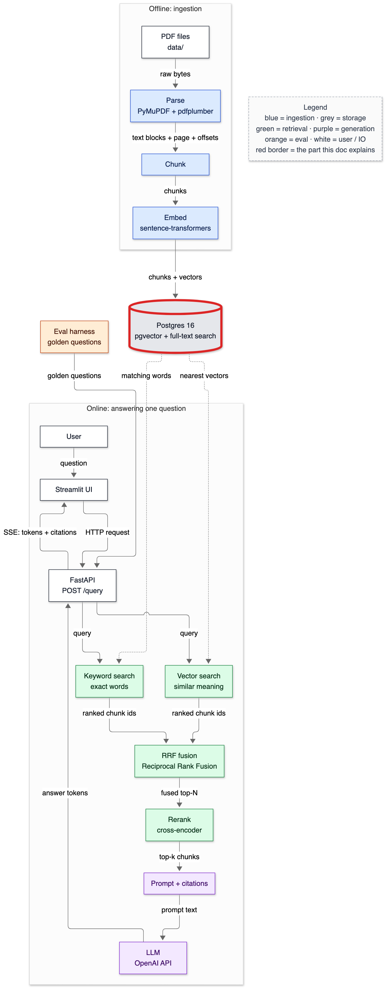
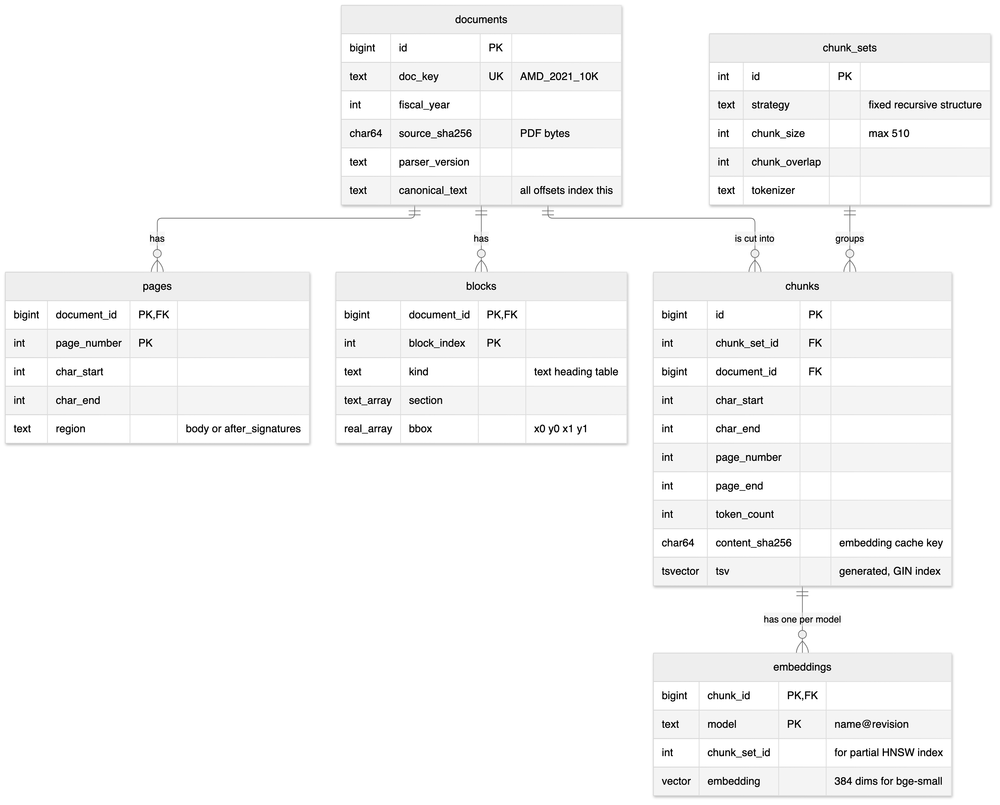
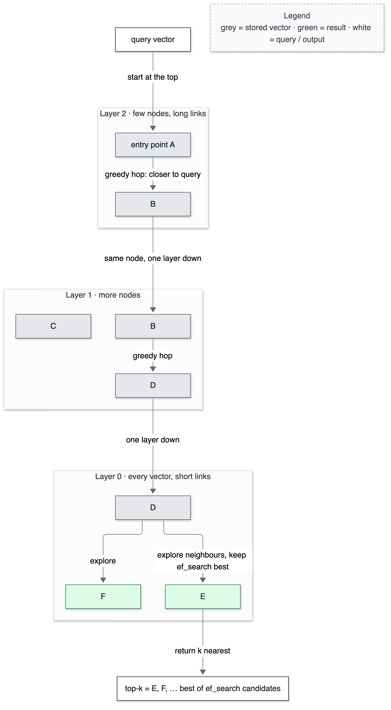

# 08 — Database schema

**Status:** written in Phase 4 (2026-10-02). Owns: table, primary / foreign / unique key, cascade delete, CHECK constraint, generated column, migration, B-tree index, GIN index, inverted index (overview), HNSW, IVFFlat, partial index, expression index, `COPY`, MVCC (overview), idempotent ingestion, content-hash deduplication.

> Prerequisites: [03-environment-and-infra.md](03-environment-and-infra.md) (Postgres basics) and [07-embeddings.md](07-embeddings.md) (what a vector is). All numbers are from the database after `make ingest`, 2026-10-02.

---

## 1. In one paragraph

The schema is the filing cabinet. **documents** holds each filing with its full canonical text; **pages** and **blocks** record where every page and paragraph sits in that text; **chunk_sets** names each chunking configuration; **chunks** holds the passages of each configuration, with a keyword index Postgres maintains itself; **embeddings** holds one vector per chunk per model, with a graph index for fast nearest-neighbour search. Every position in every table points into one string per document, and deleting a document removes everything derived from it in one transaction.

## 2. Why it exists

- **Citations need structure.** A chunk must know its document, page range and exact characters (card #5); a flat list of strings can't.
- **Ablations need coexistence.** Phase 12 compares nine chunking configurations. Without `chunk_sets` each would wipe the last; with it, they coexist — two (structure/256 and fixed/256) were loaded side by side for the size measurements in §6.
- **Search needs indexes.** Without them every query scans every row: fine at 7,411 chunks, hopeless at millions. The GIN index answers a keyword query in 0.1 ms; the HNSW index answers a vector query in 2.6 ms (§6).
- **Updates must be atomic.** A re-filed 10-K must replace its old pages, blocks, chunks and vectors at once; cascading deletes inside one transaction guarantee readers never see half of each version.

## 3. Where it sits



<details><summary>Same diagram as text (for terminal viewing)</summary>

```text
 OFFLINE
 ┌───────────┐  ┌───────┐  ┌───────┐  ┌───────┐   ╔═════════════════════════════╗
 │ PDF files │─▶│ Parse │─▶│ Chunk │─▶│ Embed │──▶║ Postgres 16                 ║
 └───────────┘  └───────┘  └───────┘  └───────┘   ║ pgvector + full-text search ║
                                                  ╚══════════════╤══════════════╝
 ONLINE                                                          │ searched by
 ┌───────────┐  ┌─────────┐     query     ┌──────────────────────▼──────────────┐
 │ Streamlit │─▶│ FastAPI │──────────────▶│ Vector search  +  Keyword search    │
 └─────▲─────┘  └──┬───▲──┘               └──────────────────────┬──────────────┘
       │    SSE    │   │ answer tokens                           │ two ranked lists
       └───────────┘   │                                         ▼
               ┌───────┴──────┐  ┌────────────────────┐  ┌────────┐  ┌────────────┐
               │ LLM (OpenAI) │◀─│ Prompt + citations │◀─│ Rerank │◀─│ RRF fusion │
               └──────────────┘  └────────────────────┘  └────────┘  └────────────┘

 Double-line box (╔═╗) = the part this doc explains: the schema inside Postgres.
```
</details>

## 4. The flow

### The tables



<details><summary>Same diagram as text (for terminal viewing)</summary>

```text
 ┌──────────────────────────┐                         ┌──────────────────────────┐
 │ documents                │                         │ chunk_sets               │
 │ id PK · doc_key UK       │                         │ id PK                    │
 │ fiscal_year              │                         │ strategy · chunk_size    │
 │ source_sha256            │                         │ chunk_overlap · tokenizer│
 │ parser_version           │                         └────────────┬─────────────┘
 │ canonical_text           │                                      │ 1
 └──┬──────────┬─────────┬──┘                                      │ groups
    │ 1        │ 1       │ 1  is cut into                          │ many
    │ has      │ has     └─────────────────────┐                   │
    │ many     │ many                          │ many              │
    ▼          ▼                               ▼                   ▼
 ┌──────────┐ ┌──────────────────┐   ┌──────────────────────────────────────┐
 │ pages    │ │ blocks           │   │ chunks                               │
 │ doc,page │ │ doc,block_index  │   │ id PK · chunk_set_id FK · doc FK     │
 │ PK       │ │ PK · kind        │   │ char_start · char_end                │
 │ char_    │ │ section[]        │   │ page_number · page_end · token_count │
 │ start/end│ │ bbox[4]          │   │ content_sha256 · tsv (generated)     │
 │ region   │ └──────────────────┘   └──────────────────┬───────────────────┘
 └──────────┘                                           │ 1
                                                        │ has one per model
                                                        ▼ many
                                     ┌──────────────────────────────────────┐
                                     │ embeddings                           │
                                     │ (chunk_id, model) PK · chunk_set_id  │
                                     │ dims · embedding vector              │
                                     └──────────────────────────────────────┘
```
</details>

### How HNSW finds neighbours



<details><summary>Same diagram as text (for terminal viewing)</summary>

```text
            query vector
                 │ start at the top
 ┌─ Layer 2: few nodes, long links ───────────────┐
 │   [ A entry ] ──greedy hop, closer──▶ [ B ]    │
 └──────────────────────────────────────────┬─────┘
                                            │ same node, one layer down
 ┌─ Layer 1: more nodes ────────────────────▼─────┐
 │   [ C ]              [ B ] ──greedy hop──▶ [ D ]│
 └───────────────────────────────────────────┬────┘
                                             │ one layer down
 ┌─ Layer 0: every vector, short links ──────▼────┐
 │                    [ D ]                       │
 │        explore ┌──────┴──────┐ explore, keep    │
 │                ▼             ▼ ef_search best   │
 │             ( F )         ( E )                 │
 └─────────────────────────────┬──────────────────┘
                               │ return k nearest
                               ▼
              top-k = E, F, … best of ef_search candidates
 Legend (colours appear in the image): grey = stored vector · green = result
```
</details>

**HNSW (Hierarchical Navigable Small World)** is a layered graph. Every vector is a node on layer 0; a random, exponentially shrinking subset also sits on layers 1, 2, …, like an express-train network on top of local trains. Each node links to about `m` near neighbours on each layer it belongs to.

1. **Search starts at a fixed entry node on the top layer.**
2. **Greedy hop:** look at the current node's neighbours; move to whichever is closer to the query; repeat until no neighbour is closer.
3. **Drop a layer** and repeat from the same node, with denser, shorter links.
4. **On layer 0, keep a candidate list** of the `ef_search` closest nodes seen so far (default 40), keep expanding their neighbours until the list stops improving, and return the best k.

Because it visits only a small fraction of nodes, it's **approximate**: it can miss a true nearest neighbour that the greedy walk never reached. Larger `ef_search` explores more and misses less, at more cost — the recall/latency knob measured in Phase 5. **Building** inserts each vector by searching for its neighbours (with a candidate list of `ef_construction`, default 64) and linking to the best `m` (default 16).

## 5. The code

### `app/store/migrations/0001_documents_chunks_embeddings.sql`

```sql
CREATE TABLE documents (
    id              bigint GENERATED ALWAYS AS IDENTITY PRIMARY KEY,
    doc_key         text        NOT NULL UNIQUE,
    ...
    source_sha256   char(64)    NOT NULL,
    parser_version  text        NOT NULL,
```

A surrogate key (`id`, generated by Postgres) for joins, plus the natural key (`doc_key`) as `UNIQUE`. `source_sha256` and `parser_version` are what let ingestion decide "unchanged / replace" (card #6).

```sql
CREATE TABLE pages (
    document_id  bigint  NOT NULL REFERENCES documents(id) ON DELETE CASCADE,
    ...
    PRIMARY KEY (document_id, page_number),
    CHECK (char_start <= char_end)
);
```

`ON DELETE CASCADE`: deleting a document deletes its pages (and blocks, chunks, and through chunks, embeddings) in the same statement. The `CHECK` constraints turn offset bugs into insert errors (`test_constraints_reject_inverted_offsets`) instead of silent bad citations.

```sql
CREATE TABLE chunk_sets (
    ...
    UNIQUE (strategy, chunk_size, chunk_overlap, tokenizer),
    CHECK (chunk_overlap < chunk_size)
);
```

One row per chunking configuration. The unique constraint makes "get or create" safe. (The first version used `INSERT … ON CONFLICT DO NOTHING` alone, and each idempotent re-run silently consumed an identity value — the second configuration got id 3, not 2. Postgres reserves an identity value before checking the conflict; the repository now looks the row up first, T-022.)

```sql
    tsv             tsvector GENERATED ALWAYS AS (to_tsvector('english', text)) STORED,
...
CREATE INDEX chunks_tsv_gin ON chunks USING gin (tsv);
```

A **generated column**: Postgres computes it from `text` on every insert and update, so it can never be stale or forgotten. The **GIN** index on it is an inverted index — lexeme → list of rows containing it — explained in [10-keyword-search.md](10-keyword-search.md).

```sql
CREATE TABLE embeddings (
    chunk_id      bigint  NOT NULL REFERENCES chunks(id) ON DELETE CASCADE,
    model         text    NOT NULL,
    chunk_set_id  integer NOT NULL,
    dims          integer NOT NULL CHECK (dims > 0),
    embedding     vector  NOT NULL,
    PRIMARY KEY (chunk_id, model),
    CHECK (vector_dims(embedding) = dims)
);
```

Vectors in their own table, one row per (chunk, model) — card #17. `embedding` is an *untyped* `vector` so models with different dimensions can coexist; `CHECK (vector_dims(embedding) = dims)` keeps each row honest. `chunk_set_id` is copied from `chunks` (a deliberate denormalisation) so the HNSW index below can be *partial* per chunk set without a join.

### `app/store/repository.py` — the index

```python
        """CREATE INDEX {name} ON embeddings
           USING hnsw ((embedding::vector({dims})) vector_cosine_ops)
           WITH (m = {m}, ef_construction = {ef})
           WHERE chunk_set_id = {set} AND model = {model}"""
```

Three ideas in one statement:

- **Expression index** — `embedding::vector(384)`. HNSW needs a fixed dimension, and the column has none, so the index is on the column *cast* to 384 dims. Queries must use the same expression (`embedding::vector(384) <=> …`) for the planner to match it.
- **Partial index** — `WHERE chunk_set_id = 1 AND model = '…'`. The index contains only that configuration's vectors. A search for chunk set 1 walks a graph made only of set-1 vectors, instead of a shared graph from which other sets' rows must be filtered out afterwards — which is how approximate search loses results (card #18).
- **Operator class** — `vector_cosine_ops` builds the graph with cosine distance, so only `<=>` queries can use it (card #13).

Identifiers and literals go through `psycopg.sql` (`sql.Identifier`, `sql.Literal`), never string formatting, because DDL can't take bound parameters.

### `app/store/migrate.py`

```python
    for path in sorted(MIGRATIONS.glob("*.sql")):
        if path.name in applied:
            continue
        with conn.transaction():
            conn.execute(path.read_text())
            conn.execute("INSERT INTO schema_migrations (name) VALUES (%s)", (path.name,))
```

Numbered files applied in name order, each in its own transaction together with its record in `schema_migrations`: a failing migration leaves no partial schema and no record, so it's retried next time. Postgres runs DDL inside transactions (many databases don't), which is what makes this safe.

### `app/ingest/pipeline.py` — transactions per document

```python
    for entry, doc in docs:
        with conn.transaction():
            doc_id, action = repo.upsert_document(conn, entry, doc)
            ...
                report.chunks_inserted += repo.insert_chunks(conn, report.chunk_set_id, doc_id, chunks)
```

Each document — its row, pages, blocks and chunks — commits or rolls back as a unit. Interrupt ingestion and re-run it: finished documents are `unchanged`, the interrupted one starts again cleanly.

## 6. Data in / data out

**Row counts** after `make ingest` (structure/256) plus one extra configuration (fixed/256):

```text
rows: documents=10 pages=2224 blocks=30327 chunks(set)=7411 embeddings(set)=7411
```

**Sizes** (`pg_total_relation_size`, two chunk sets loaded):

```text
   embeddings                                 47.37 MB
   chunks                                     37.74 MB
   embeddings_hnsw_set1_da415afb              13.84 MB
   embeddings_hnsw_set3_da415afb              11.35 MB
   blocks                                      8.00 MB
   chunks_tsv_gin                              6.91 MB
   documents                                   2.56 MB
   chunks_content_sha256                       1.59 MB
```

Per vector: 26.8 MB / 7,411 rows ≈ 3.6 KB per embeddings row for 1,536 bytes of vector — the rest is the row header, the model name string, the other columns and page slack. The HNSW index for 7,411 vectors is 13.8 MB, about 1.9 KB per vector: the vector copy plus neighbour links.

**A vector query uses the partial HNSW index** (literal constants, real plan):

```text
Limit  (cost=487.57..498.95 rows=5 width=16) (actual rows=5 loops=1)
  ->  Index Scan using embeddings_hnsw_set1_da415afb on embeddings  (cost=487.57..17354.75 rows=7411 width=16) (actual rows=5 loops=1)
        Order By: ((embedding)::vector(384) <=> '[-0.0042613773,…]'::vector(384))
Planning Time: 1.430 ms
Execution Time: 2.581 ms
```

Read line by line: `Index Scan using embeddings_hnsw_set1_…` — the planner chose our partial index (it proved `chunk_set_id = 1 AND model = …` matches the index predicate). `Order By: … <=> …` — the index produces rows in distance order, so `Limit` stops after 5. `rows=7411` is the planner's estimate of rows the index *could* return, not rows read.

**A keyword query uses the GIN index:**

```text
Limit  (cost=21.62..83.97 rows=10 width=8) (actual time=0.078..0.085 rows=10 loops=1)
  ->  Bitmap Heap Scan on chunks  (cost=21.62..96.44 rows=12 width=8) (actual time=0.077..0.084 rows=10 loops=1)
        Recheck Cond: (tsv @@ '''goodwil'' & ''impair'''::tsquery)
        Filter: (chunk_set_id = 1)
        Heap Blocks: exact=8
        ->  Bitmap Index Scan on chunks_tsv_gin  (cost=0.00..21.62 rows=20 width=0) (actual time=0.066..0.066 rows=208 loops=1)
              Index Cond: (tsv @@ '''goodwil'' & ''impair'''::tsquery)
Execution Time: 0.099 ms
```

The GIN index found 208 chunks containing both lexemes `goodwil` and `impair` across *both* chunk sets; the heap scan then filtered to `chunk_set_id = 1` and stopped at 10. Note `rows=20` estimated vs 208 actual — the planner underestimated, harmless here. More in [10](10-keyword-search.md).

## 7. Decisions & alternatives

<!-- card:start id=6 -->
#### Decision: Idempotent batch ingestion — skip, insert or replace per document, keyed by PDF hash + parser version  (rejected: wipe-and-reload, streaming/CDC ingestion, append-only versions)

**One-line defence.** Filings change once a year, so a re-runnable batch job is enough; keying on the PDF's sha256 and the parser version makes re-runs cheap (2.8 s with nothing to do) and makes a changed document replace its old rows atomically.

**What problem is this even solving?** Documents get added, corrected and re-parsed. Ingestion must handle all three without duplicates, without stale derived rows, and without leaving a half-updated document visible.

**The options, compared.**

| Option | How it works (1 line) | Strengths | Weaknesses | When it's the right call |
|---|---|---|---|---|
| ✅ Idempotent upsert per document | Compare hash + parser version; skip, insert, or delete-cascade-and-reinsert in one transaction | Safe to re-run and interrupt; updates are atomic; cheap no-op runs | Replacing a document re-embeds all its chunks; no history of old versions | Low change rate, batch arrivals |
| Wipe and reload everything | `TRUNCATE`, re-ingest all | Simplest | Downtime; re-embeds everything every time (~80 s here, days at scale) | Tiny prototypes |
| Streaming / change-data-capture | Each document change becomes an event processed continuously | Fresh within seconds | Queues, ordering, retries, dead letters; overkill for annual filings | High change rates (news, tickets) |
| Append-only versions | Keep every version, mark the current one | Full history, time-travel queries | Storage grows; every query must filter to current | Audit or "as of date" requirements |

**What would actually change if we swapped it.** To streaming: an event queue in front of `ingest()`, a worker that processes one document per message, and HNSW inserts per message instead of a batch build (slower per vector); the same per-document transaction still applies. To append-only: a `version` and `is_current` on `documents`, every query filtered on `is_current`, and an index per version or a filtered index.

**The decision rule.** Match ingestion to the change rate: batch for daily-or-slower changes, streaming when freshness requirements are minutes. Always make ingestion idempotent (keyed on content), so retries and re-runs are safe either way.

**Where our choice breaks.** If documents changed constantly, re-embedding a whole document for one changed paragraph would be wasteful — then diff at chunk level (content hashes already exist) and update only changed chunks. If users needed "what did the 2021 filing say before its amendment", append-only versions.

**The number.** First ingest 80.2 s; re-run with nothing changed 2.8 s (`documents=… unchanged`, `computed 0`); replacement path covered by `test_changed_pdf_replaces_the_document_and_cascades`.

**Interview script (3 sentences).** "Ingestion is an idempotent batch job: for each document it compares the PDF's hash and the parser version with what's stored, then skips, inserts, or deletes and re-inserts inside one transaction, with cascading deletes removing old chunks and vectors. A re-run with nothing changed takes under three seconds, and an interrupted run resumes cleanly. With annual filings, streaming would add a queue and retry machinery for no freshness gain."

**Follow-ups they will ask:**
- Q: What does a query see while a document is being replaced? → A: The old version until commit, then the new one — never a mix. Postgres's MVCC (multi-version concurrency control) keeps the old rows visible to other transactions until the replacing transaction commits.
- Q: Why delete-and-reinsert rather than update in place? → A: Chunk boundaries can all move when a document changes, so there's no stable mapping from old chunks to new; deleting and inserting is simpler and, inside one transaction, equally atomic.
- Q: What happens to the HNSW index on delete? → A: Deleted rows become dead tuples; their index entries are cleaned up by VACUUM. I'm not certain how pgvector repairs graph links around removed nodes — it's on my honest-answers list.
- Q: How would you ingest 10,000 new filings a day? → A: Same idempotent unit (one document per transaction), many workers in parallel, embedding on GPU workers, and periodic index maintenance. The per-document contract doesn't change.
- Q (the hard one): Two workers ingest the same changed document at once. What happens? → A (honest): Both may try to delete and insert; the unique `doc_key` makes one of them fail at insert rather than create duplicates, but the loser's work is wasted and its error must be handled. I'd add a per-document advisory lock (`pg_advisory_xact_lock(hash(doc_key))`). Not built — ingestion here is single-process.

**The trap.** Describing ingestion as "a script that loads PDFs" with no answer for re-runs, updates or partial failures.
<!-- card:end -->

<!-- card:start id=7 -->
#### Decision: Keep duplicate chunks as separate rows (they're in different filings) but embed each distinct text once  (rejected: dropping duplicate chunks, near-duplicate merging at ingest, embedding every chunk)

**One-line defence.** 599 of 7,411 chunks repeat another chunk word for word — mostly boilerplate copied from 2021 into 2022 — and each copy must stay, because it's citable evidence in *its* filing; but identical text gets an identical vector, so it's computed once.

**What problem is this even solving?** Ten-Ks repeat themselves year to year (5–17% of FY2022 chunks are exact copies of FY2021 chunks here). Duplicates waste embedding compute and storage, and in results they crowd the top-k with copies.

**The options, compared.**

| Option | How it works (1 line) | Strengths | Weaknesses | When it's the right call |
|---|---|---|---|---|
| ✅ Keep rows, dedupe embedding by content hash | One model call per distinct text; vector copied to every duplicate row | No lost evidence; 8% fewer model calls; deterministic | Duplicate rows still appear together in results | Versioned documents where each copy is citable |
| Drop exact duplicates | Keep one chunk per distinct text | Smaller index, no duplicate hits | Loses the citation for the other filing; which year "owns" the text? | Single-version corpora |
| Near-duplicate merging (MinHash/SimHash) | Treat almost-identical chunks as one | Catches small edits | Merges chunks whose differing numbers are the whole point ("grew 19%" vs "grew 8%") | Web crawls, forum posts |
| Embed everything | No dedupe | Simplest | 599 extra calls (~8% more embed time) | When compute is free |

**What would actually change if we swapped it.** Dropping duplicates would delete rows from `chunks` and break evidence spans pointing at them (Phase 11), and year-filtered searches would find nothing for boilerplate sections in one of the years. Embedding everything: remove ~10 lines in `pipeline.py`, +8% embedding time.

**The decision rule.** Deduplicate *computation* by exact content hash always (it's free and lossless). Deduplicate *data* only when copies carry no distinct meaning — not when the same text in two documents is two different facts ("this was in the 2021 filing" vs "this was in the 2022 filing").

**Where our choice breaks.** Near-duplicates that differ by one number (the dangerous ones) aren't deduplicated and look almost identical to vector search; only metadata filters and keyword search on the number can separate them. And duplicate rows can still fill the top-k with copies — collapsing identical results at query time (keep one, cite both) is a Phase 9 option.

**The number.** Structure/256: 7,411 chunks, 6,812 distinct texts; FY2022 chunks identical to an FY2021 chunk — AMD 14%, Boeing 16%, Corning 5%, PepsiCo 17%, Verizon 14%. Embedding: 6,812 computed, 599 copied.

**Interview script (3 sentences).** "About 8% of my chunks are exact copies of another chunk — mostly boilerplate repeated between the 2021 and 2022 filings. I keep every row, because each copy is evidence for its own filing, but I embed each distinct text once and copy the vector. The dangerous duplicates are the *near* ones that differ by a single number, and those are handled by year filters and keyword search, not deduplication."

**Follow-ups they will ask:**
- Q: How do you detect duplicates? → A: sha256 of the chunk text, stored in `content_sha256` with a B-tree index; identical hash = identical text.
- Q: Why not MinHash for near-duplicates? → A: Near-duplicate filings differ exactly in the numbers users ask about; merging them would erase the answer.
- Q: Do duplicates hurt retrieval? → A: Identical chunks get identical scores, so both years appear together in the top-k, using two slots for one piece of text. Without a year filter, that's 50/50 which year gets cited first.
- Q: Could you exploit duplicates? → A: Yes — a duplicate pair is a signal that a passage didn't change between years, useful for "what changed?" questions. Not built.
- Q (the hard one): Your cross-set cache only reused 8 vectors between fixed and structure chunking. Is it worth having? → A (honest): Between strategies, barely — chunk boundaries rarely coincide. It pays off for overlap-only changes (identical chunks, 100% reuse in the test) and for re-ingests. Within a set, the distinct-text grouping saved 599 calls. I measured both; the second matters more.

**The trap.** "Deduplicate the corpus" without asking whether the copies mean different things.
<!-- card:end -->

<!-- card:start id=16 -->
#### Decision: HNSW with pgvector defaults (m = 16, ef_construction = 64), one partial index per chunk set + model  (rejected: IVFFlat, exact scan only, one shared index)

**One-line defence.** HNSW gives high recall without a training step and keeps working as rows are added; at 7,411 vectors it builds in 1.4 s and answers in a few milliseconds — and partial indexes mean each configuration searches its own graph.

**What problem is this even solving?** Finding the nearest vectors without comparing the query to every row. Without an index, search is exact but linear in rows.

**The options, compared.**

| Option | How it works (1 line) | Strengths | Weaknesses | When it's the right call |
|---|---|---|---|---|
| ✅ HNSW | Layered proximity graph, greedy search | High recall at low latency; no training; incremental inserts | More memory (13.8 MB for 7,411 here); slower builds than IVFFlat; approximate | Default for most workloads |
| IVFFlat | Cluster vectors into `lists`; search the nearest `probes` clusters | Smaller, faster to build | Needs data present before building (clusters are trained); recall drops as data drifts from the clusters | Large, mostly static data where build time matters |
| Exact scan | Compute distance to every row, sort | Perfect recall; no index | Linear cost; slow at scale | Small tables, or as ground truth for measuring ANN recall |
| One shared index for all chunk sets | One graph; filter by chunk set after | Fewer indexes | Filter applied after approximate search → fewer than k results (recall cliff) | Never with many configurations in one table |

**What would actually change if we swapped it.** IVFFlat: `USING ivfflat … WITH (lists = N)` built *after* loading, with `SET ivfflat.probes` at query time; adding many vectors later would require a rebuild to keep recall. Exact: drop the index; queries stay correct and get slower roughly linearly in rows — measured in Phase 5. Shared index: one `CREATE INDEX` without `WHERE`; filtered queries would need iterative scans (`hnsw.iterative_scan`, pgvector ≥ 0.8) to avoid returning fewer than k rows.

**The decision rule.** Under ~10⁴–10⁵ vectors exact search is often fast enough — measure it. Above that, HNSW for recall and dynamic data; IVFFlat when build time or memory dominates and data is static. Tune `ef_search` for the recall target before touching `m` or `ef_construction`.

**Where our choice breaks.** Memory: the graph wants to be in RAM; at ~2 KB per 384-d vector here, 100 M vectors would need ~190 GB of index. Builds: `maintenance_work_mem` is 64 MB in this container — enough for 7,411 vectors, not for millions. Migration: quantised vectors (`halfvec`), larger memory, partitioning, or a dedicated vector database (card #15).

**The number.** Build 1.4 s for 7,411 vectors; index 13.84 MB; one query via the index 2.6 ms execution. Recall vs exact search and latency vs `ef_search`: not yet measured — Phase 5.

**Interview script (3 sentences).** "Vectors are indexed with HNSW — a layered proximity graph searched greedily — using pgvector's defaults, m = 16 and ef_construction = 64. Each chunk set and model gets its own partial index, so a search never has to filter out other configurations' vectors after the approximate step. At this size it builds in 1.4 seconds and queries in about 2.6 milliseconds; whether it's even faster than an exact scan here is something I measure in Phase 5."

**Follow-ups they will ask:**
- Q: What do m and ef_construction control? → A: `m` is how many neighbours each node links to (more = better recall, more memory); `ef_construction` is how widely the builder searches for those neighbours (more = better graph, slower build). `ef_search` is the query-time equivalent and the knob to tune first.
- Q: Why not IVFFlat? → A: It needs representative data before building (its clusters are trained), and recall degrades as new data drifts from them. HNSW handles inserts without retraining. IVFFlat would be smaller and faster to build.
- Q: Why a partial index per chunk set? → A: All nine ablation configurations share one table; a single index would make every search walk a graph of all configurations' vectors and filter afterwards — returning fewer than k results when the wanted set is a minority.
- Q: What's the index's memory footprint? → A: Measured 13.84 MB for 7,411 vectors (~1.9 KB each, including a copy of the 1,536-byte vector plus links).
- Q (the hard one): Do queries with bound parameters still use the partial index? → A (honest): Postgres can only use a partial index if it can prove the query's WHERE matches the index's at planning time. With literal values it does (EXPLAIN shows it). With prepared statements, after five executions Postgres may switch to a generic plan that can't prove it. I verify that in Phase 5 and design the query to be safe either way.

**The trap.** "HNSW is exact" or "always use an index". It's approximate, and below some size an exact scan is simpler and fast enough.
<!-- card:end -->

<!-- card:start id=17 -->
#### Decision: Vectors in a separate `embeddings` table keyed by (chunk_id, model)  (rejected: a vector column on `chunks`, a separate table per model)

**One-line defence.** One chunk can have vectors from several models (the dimension and model ablation, and every future upgrade), which a single column can't hold; a separate table keeps `chunks` narrow and lets each model have its own index.

**What problem is this even solving?** Where the vector lives determines how many models you can keep, how wide the hot table is, and how you swap models.

**The options, compared.**

| Option | How it works (1 line) | Strengths | Weaknesses | When it's the right call |
|---|---|---|---|---|
| ✅ `embeddings(chunk_id, model)` table | One row per chunk per model | Multiple models; per-model partial indexes; `chunks` stays narrow; side-by-side upgrades | A join (or second lookup) to get chunk text; duplicate `chunk_set_id` column | Anything that will compare or change models |
| `embedding vector(384)` column on `chunks` | Vector stored with the text | No join; simplest | One model only; changing models rewrites the hot table; wide rows slow keyword scans | One fixed model forever |
| Table per model | `embeddings_bge_small`, `embeddings_bge_base` | Typed dimension column | Schema change per model; code branches by table name | A handful of permanent models |

**What would actually change if we swapped it.** Column on `chunks`: the migration adds `embedding vector(384)`, the HNSW index moves to `chunks`, vector search needs no join, and a second model needs a second column (`ALTER TABLE` on the biggest table). Keyword scans would read wider rows.

**The decision rule.** Keep vectors in their own table when you'll have more than one model or need to re-embed without downtime; inline them when the model is fixed and the join cost matters.

**Where our choice breaks.** If a single model were final, the join on every vector search would be pure overhead (small, but non-zero; Phase 13 will show whether it's visible). The denormalised `chunk_set_id` must always equal the chunk's — enforced by the pipeline, not by a constraint.

**The number.** `embeddings` 26.8 MB vs `chunks` 21.4 MB for one chunk set: putting vectors inline would roughly double the width of every `chunks` row read by keyword search.

**Interview script (3 sentences).** "Vectors live in their own table keyed by chunk and model, because one chunk can have vectors from several models — for the model comparison and for upgrades — and each model gets its own partial HNSW index. The cost is a join from a vector hit back to chunk text, which is a primary-key lookup. I also copied `chunk_set_id` into the vector table on purpose, so the index can be partial without a join."

**Follow-ups they will ask:**
- Q: Isn't copying `chunk_set_id` denormalisation? → A: Yes, deliberately: a partial index can only filter on columns of its own table. The pipeline writes it from the chunk; a test ingests and checks counts, but no database constraint enforces equality — a composite foreign key on `(chunk_id, chunk_set_id)` would, and that's a reasonable hardening.
- Q: What does the join cost? → A: For top-k results it's k primary-key lookups — microseconds each. I'll see its share in Phase 13's latency breakdown.
- Q: Why an untyped `vector` column? → A: So vectors of different dimensions can share the table; each row's `dims` is checked, and each index casts to its model's dimension.
- Q: How do you delete a model's vectors? → A: `DELETE FROM embeddings WHERE model = …` and drop its partial index; no schema change.
- Q (the hard one): Would you keep this design at 100 M vectors? → A (honest): Probably not in one table: I'd partition `embeddings` by model (and maybe by chunk set) so indexes and vacuums stay per partition. Postgres declarative partitioning supports that; I haven't tested pgvector indexes on partitions.

**The trap.** "Store the vector with the text, it's simpler" — true until the first model change.
<!-- card:end -->

## 7a. Prerequisite concepts

**Table, row, column** — a table is a set of rows with the same columns; Postgres enforces each column's type.

**Primary key** — the column(s) that uniquely identify a row (`documents.id`; `pages(document_id, page_number)`). **Foreign key** — a column that must match a primary key in another table (`pages.document_id → documents.id`). **Unique constraint** — no two rows may share these values (`documents.doc_key`).

**ON DELETE CASCADE** — deleting the referenced row deletes the referencing rows too, in the same statement.

**CHECK constraint** — a condition every row must satisfy (`char_start <= char_end`); violations abort the insert with `CheckViolation`.

**Identity column** — `GENERATED ALWAYS AS IDENTITY`: Postgres assigns increasing ids from a sequence. Values are consumed even by inserts that later fail or conflict, so ids can have gaps.

**Generated column** — a column computed from other columns of the same row, maintained by Postgres (`tsv` from `text`).

**Migration** — a versioned, ordered change to the schema, applied once and recorded.

**Index** — a separate data structure that lets Postgres find rows without scanning the whole table. Types used here:
- **B-tree** — sorted keys; great for `=`, `<`, ranges (primary keys, `content_sha256`).
- **GIN** (Generalized Inverted Index) — maps each element (here, each lexeme) to the rows containing it; great for "contains" queries.
- **HNSW** — approximate nearest-neighbour graph (§4).
- **IVFFlat** — clusters vectors into lists; search the closest lists only.
- **Partial index** — indexes only rows matching a `WHERE` clause.
- **Expression index** — indexes the result of an expression (`embedding::vector(384)`), usable only by queries with the same expression.

**`COPY`** — Postgres's bulk-load command: streams many rows in one operation instead of one `INSERT` round trip each.

**Exact vs approximate nearest neighbour** — exact: compare with every vector (perfect, linear time). Approximate (ANN): visit a small part of an index, usually find the true neighbours, occasionally miss one. **Recall** of an ANN index = fraction of true top-k it returns.

**MVCC (overview)** — Postgres never overwrites a row in place: an update writes a new version, and each transaction sees the versions committed before it started. Old versions ("dead tuples") are removed later by **VACUUM**. That's why a replacing transaction is invisible until it commits.

## 7b. What if we used something else?

| If we had used… | Immediate effect | Effect on quality metrics | Effect on latency/cost | Effect on complexity | Would I defend it? |
|---|---|---|---|---|---|
| No `chunk_sets` (one chunking at a time) | Each ablation config wipes the last | None | Re-ingest per experiment | Simpler schema | No |
| One HNSW index for all sets | Post-filtered ANN | Fewer than k results for minority sets | Fewer indexes | Simpler DDL | No |
| `tsv` maintained by application code | Can go stale | Keyword misses on stale rows | Same | More code | No |
| No CHECK constraints | Bad offsets accepted silently | Wrong citations | Marginally faster inserts | Same | No |
| IVFFlat instead of HNSW | Must build after load; probes knob | Recall depends on clusters | Smaller, faster build | Rebuilds on growth | For static, huge data |
| Inline vector column | No join | None | Wider chunk rows | One model only | Not with model ablations |

## 8. Failure modes

| What you see | Cause | Fix |
|---|---|---|
| Chunk set ids 1, 3 (gap) | `INSERT … ON CONFLICT DO NOTHING` consumes identity values on conflict (T-022) | Look up first, insert only if missing |
| `psycopg.errors.CheckViolation` on pages/blocks/chunks | An offset bug upstream | Fix the producer; the constraint did its job |
| `EXPLAIN` shows `Seq Scan` instead of the HNSW index | Query's expression or WHERE doesn't match the index (e.g. missing `::vector(384)`, or `chunk_set_id` as a generic parameter) | Use the exact expression and predicate; see Phase 5 |
| HNSW build slow or `memory required … maintenance_work_mem` notice | Graph doesn't fit in `maintenance_work_mem` (64 MB here) | Raise it for the build session; not needed at 7,411 vectors |
| A re-run duplicates chunks | — (prevented) | `UNIQUE (chunk_set_id, document_id, chunk_index)` and `has_chunks` check |
| Tests change real data | — (prevented) | Tests use the `rag_test` database (`tests/conftest.py`) |

## 9. Try it yourself

```bash
make migrate
```

Expected: `schema up to date` (or `applied: 0001_…` on a fresh database).

```bash
make psql
```

Then:

```sql
\dt
SELECT strategy, chunk_size, chunk_overlap, count(c.id) FROM chunk_sets s JOIN chunks c ON c.chunk_set_id = s.id GROUP BY 1, 2, 3;
SELECT indexname FROM pg_indexes WHERE indexname LIKE 'embeddings_hnsw%';
```

Expected: the six tables plus `schema_migrations`; `structure | 256 | 32 | 7411`; one `embeddings_hnsw_set…` index per loaded chunk set.

```bash
.venv/bin/python -m pytest tests/test_store.py -q
```

Expected: `7 passed`.

## 10. Numbers

| What | Value | Command |
|---|---|---|
| Rows | documents 10 · pages 2,224 · blocks 30,327 · chunks 7,411 (set 1) | `make ingest` |
| Table sizes (one set) | embeddings 26.8 MB · chunks 21.4 MB · blocks 8.0 MB · documents 2.5 MB | `make ingest` sizes line |
| HNSW index (7,411 × 384) | 13.84 MB, built in 1.4 s | `make ingest` |
| GIN index on tsv | 5.6 MB (one set) / 6.91 MB (two sets) | relation sizes |
| Vector query via HNSW | 2.581 ms execution | `EXPLAIN ANALYZE` in §6 |
| Keyword query via GIN | 0.099 ms execution | `EXPLAIN ANALYZE` in §6 |
| Re-run with no changes | 2.8 s | `make ingest` |
| Recall of HNSW vs exact | not yet measured | Phase 5 |

## 11. Interview talking points

- "Six tables: documents with canonical text, pages and blocks with offsets and boxes, chunk sets for each chunking configuration, chunks with a generated tsvector and GIN index, and embeddings per chunk per model."
- "One partial HNSW index per chunk set and model — an expression index on the untyped vector cast to 384 dims — so each configuration searches its own graph."
- "Ingestion is idempotent per document: hash + parser version decide skip / insert / replace, and cascades make replacement atomic."
- "Constraints turn offset bugs into insert errors."
- Expect: "Why a separate embeddings table?", "HNSW vs IVFFlat?", "What happens on update?"

## 12. Check yourself

1. Why is the HNSW index *partial*, and what would go wrong with one shared index?
2. What does `GENERATED ALWAYS AS (to_tsvector('english', text)) STORED` guarantee that application code couldn't?
3. Why did the second chunk set get id 3?

<details><summary>Answers</summary>

1. All chunking configurations share the `embeddings` table. A shared index would make a search for one set walk a graph containing all sets, then filter out the others after the approximate step — returning fewer than k results when the wanted set is a minority. A partial index contains only that set's vectors.
2. The `tsv` column is recomputed by Postgres on every insert and update of `text`, so it can never be stale, missing or computed with a different configuration by mistake.
3. `INSERT … ON CONFLICT DO NOTHING` on the idempotent re-run of the first configuration reserved identity value 2 before discovering the conflict; identity values aren't returned. The repository now looks up the row first.

</details>

## 13. New terms added to the glossary

primary key, foreign key, unique constraint, cascade delete, CHECK constraint, identity column, generated column, migration, B-tree, GIN, inverted index, HNSW, IVFFlat, m / ef_construction / ef_search, partial index, expression index, operator class, COPY, exact vs approximate nearest neighbour, ANN recall, MVCC, dead tuple, VACUUM, idempotent ingestion — see [21-glossary.md](21-glossary.md).
