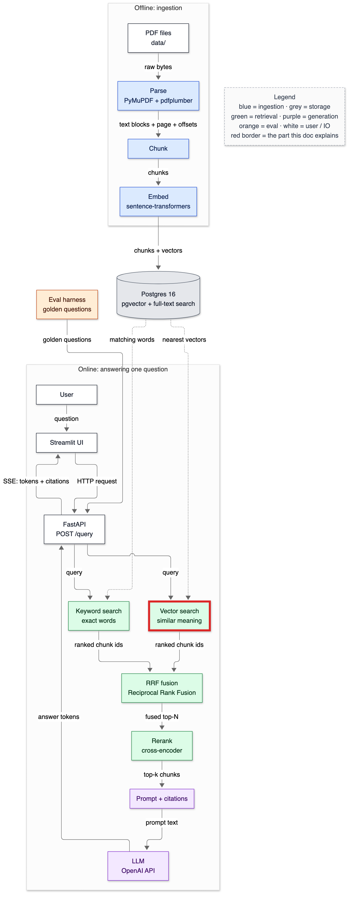
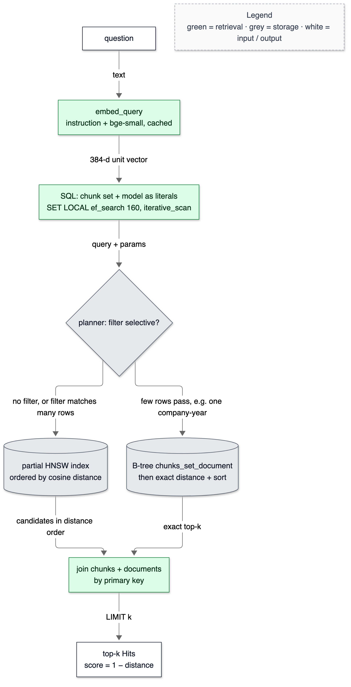
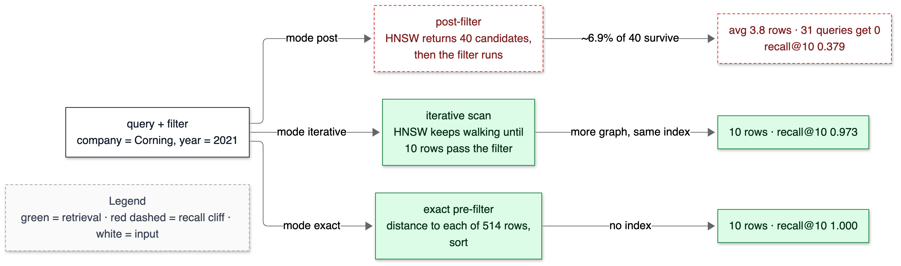
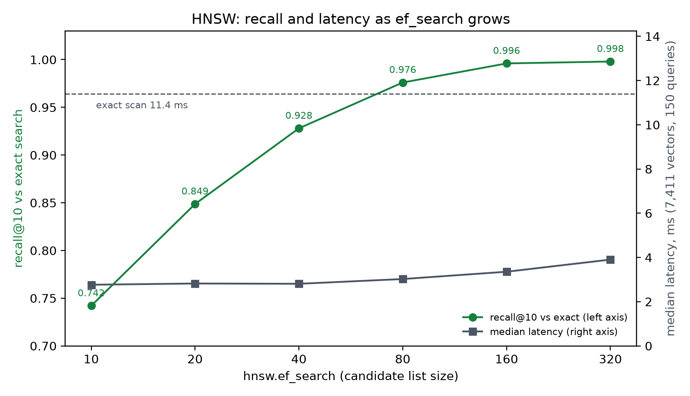

# 09 — Vector search

**Status:** written in Phase 5 (2026-10-02). Owns: k-nearest-neighbour search, ANN recall, `ef_search`, query plan, pre-filtering, post-filtering, iterative index scan, recall cliff, generic vs custom plan, prepared statement, `SET LOCAL` scope, quantisation (halfvec, binary).

> Prerequisites: [07-embeddings.md](07-embeddings.md) (vectors, cosine) and [08-database-schema.md](08-database-schema.md) (HNSW, partial index). Numbers come from `make bench-vector` (raw output: [diagrams/bench_vector_2026-10-02.txt](diagrams/bench_vector_2026-10-02.txt)) and `tests/test_vector.py`, 2026-10-02.

---

## 1. In one paragraph

Vector search answers "which stored chunks mean the most similar thing to this question?". The question is turned into a vector with the same model as the chunks, and Postgres returns the k chunks whose vectors point in the most similar direction. Doing this exactly means comparing against every chunk; the HNSW index walks a graph instead and usually finds the same answers ten times faster. The hard part isn't the search itself but the *filters* — "only Corning, only 2021" — because filtering after an approximate search can quietly throw away almost every result.

## 2. Why it exists

Keyword search can't find paraphrases (doc [01](01-what-is-rag.md) showed "grew" vs "grow"). Vector search can: for "What was AMD's net revenue in 2021?" its top hit is "Computing and Graphics net revenue of $9.3 billion in 2021 increased by 45%…" with no requirement that the words match. And without careful filtering a user asking about one company-year could get *zero* results: measured below, a post-filtered HNSW search returned nothing for 31 of 150 questions.

## 3. Where it sits



<details><summary>Same diagram as text (for terminal viewing)</summary>

```text
 OFFLINE
 ┌───────────┐  ┌───────┐  ┌───────┐  ┌───────┐   ┌─────────────────────────────┐
 │ PDF files │─▶│ Parse │─▶│ Chunk │─▶│ Embed │──▶│ Postgres 16                 │
 └───────────┘  └───────┘  └───────┘  └───────┘   │ pgvector + full-text search │
                                                  └──────────────┬──────────────┘
 ONLINE                                                          │ searched by
 ┌───────────┐  ┌─────────┐     query     ╔══════════════════════▼══════════════╗
 │ Streamlit │─▶│ FastAPI │──────────────▶║ Vector search  +  Keyword search    ║
 └─────▲─────┘  └──┬───▲──┘               ╚══════════════════════╤══════════════╝
       │    SSE    │   │ answer tokens                           │ two ranked lists
       └───────────┘   │                                         ▼
               ┌───────┴──────┐  ┌────────────────────┐  ┌────────┐  ┌────────────┐
               │ LLM (OpenAI) │◀─│ Prompt + citations │◀─│ Rerank │◀─│ RRF fusion │
               └──────────────┘  └────────────────────┘  └────────┘  └────────────┘

 Double-line box (╔═╗) = this doc explains the vector half of the search box.
```
</details>

## 4. The flow



<details><summary>Same diagram as text (for terminal viewing)</summary>

```text
 ┌──────────┐
 │ question │
 └────┬─────┘
      │ text
      ▼
 ┌──────────────────────────────────┐
 │ embed_query: instruction +       │
 │ bge-small, LRU-cached            │
 └────┬─────────────────────────────┘
      │ 384-d unit vector
      ▼
 ┌──────────────────────────────────┐
 │ SQL: chunk set + model literals; │
 │ SET LOCAL ef_search, iterative   │
 └────┬─────────────────────────────┘
      │ query + params
      ▼
 ┌──────────────────────────────────┐
 │ planner: is the filter selective?│
 └────┬───────────────────────┬─────┘
      │ no filter / broad     │ few rows pass (one company-year)
      ▼                       ▼
 ┌──────────────────────┐  ┌──────────────────────────────┐
 │ partial HNSW index,  │  │ B-tree chunks_set_document,  │
 │ distance order       │  │ exact distance + sort        │
 └────┬─────────────────┘  └────┬─────────────────────────┘
      │ candidates             │ exact top-k
      └──────────┬─────────────┘
                 ▼
 ┌──────────────────────────────────┐
 │ join chunks + documents (PK)     │
 └────┬─────────────────────────────┘
      │ LIMIT k
      ▼
 ┌──────────────────────────────────┐
 │ top-k Hits, score = 1 − distance │
 └──────────────────────────────────┘
 Legend (colours appear in the image): green = retrieval · grey = storage · white = I/O
```
</details>

1. **Embed the question** with the bge query instruction; repeated questions come from an in-memory cache.
2. **Build the SQL.** The chunk set id and model name are written in as *literals*; the query vector, k and filter values are bound parameters (why: §5).
3. **Set two knobs for this transaction only:** `hnsw.ef_search` (how many candidates the graph walk keeps; default here 160) and `hnsw.iterative_scan` (keep walking until enough rows pass the filter).
4. **The planner chooses.** With no filter, or a broad one, it walks the partial HNSW index in distance order. With a very selective filter (Corning 2021 is 514 rows, 6.9%) it is cheaper to fetch those rows by B-tree and compute exact distances — so it does that, by itself.
5. **Join** each candidate to its chunk and document by primary key (documents are memoised — 3 cache hits for 5 rows in the real plan).
6. **Return** the top k as `Hit`s with `score = 1 − cosine distance`.

### Filtering and the recall cliff



<details><summary>Same diagram as text (for terminal viewing)</summary>

```text
 ┌─────────────────────────────────┐
 │ query + filter: Corning, 2021   │
 └──┬──────────────┬──────────────┬┘
    │ mode post    │ mode         │ mode exact
    ▼              │ iterative    ▼
 ┌──────────────┐  ▼           ┌──────────────────┐
 │ HNSW top-40, │ ┌──────────┐ │ distance to each │
 │ then filter  │ │ HNSW walk│ │ of 514 rows, sort│
 └──────┬───────┘ │ until 10 │ └────────┬─────────┘
        │ ~6.9%   │ pass     │          │ no index
        │ survive └────┬─────┘          ▼
        ▼              │ same index  ┌──────────────────┐
 ┌──────────────┐      ▼             │ 10 rows          │
 │ avg 3.8 rows │ ┌──────────────┐   │ recall 1.000     │
 │ 31 get 0     │ │ 10 rows      │   └──────────────────┘
 │ recall 0.379 │ │ recall 0.973 │
 └──────────────┘ └──────────────┘
 (HNSW path forced with enable_sort = off; 150 FinanceBench questions; k = 10)
```
</details>

### Recall vs latency



<details><summary>Same chart as text (for terminal viewing)</summary>

```text
 ef_search   recall@10   p50 ms
    10         0.742      2.77   ███████████████████████████████████████
    20         0.849      2.82   ████████████████████████████████████████████
    40         0.928      2.81   ████████████████████████████████████████████████
    80         0.976      3.02   ███████████████████████████████████████████████████
   160         0.996      3.35   ████████████████████████████████████████████████████  ← default
   320         0.998      3.90   ████████████████████████████████████████████████████
 exact         1.000     11.39   (bars = recall)
```
</details>

## 5. The code — `app/retrieve/vector.py`

```python
        distance = sql.SQL("e.embedding::vector({dims}) <=> %(q)s::vector({dims})")
        ...
        where = [sql.SQL("e.chunk_set_id = {s}").format(s=sql.Literal(self.chunk_set_id)),
                 sql.SQL("e.model = {m}").format(m=sql.Literal(self.embedder.key))]
```

The distance expression matches the index expression character for character (`embedding::vector(384)`), or the index can't be used. Chunk set and model are **literals** because Postgres can only use the *partial* index if it can prove, at planning time, that `chunk_set_id = 1 AND model = '…'` matches the index's WHERE. A **prepared statement** is planned once and reused; after five runs Postgres may switch to a **generic plan** that is planned without knowing parameter values — and a generic plan for `chunk_set_id = $3` can't prove anything. `test_generic_plan_still_uses_the_partial_index_because_set_and_model_are_literals` forces a generic plan and shows the index name in the literal version's plan and *not* in the `$3` version's. Literals are safe here because these values come from configuration, never from users.

```python
        order = sql.SQL("({d}) + 0").format(d=distance) if exact else distance
```

Exact mode: `+ 0` makes the ORDER BY an expression the index can't produce, so Postgres must compute every distance and sort — the brute-force ground truth. The test `test_exact_mode_equals_numpy_brute_force` checks it against numpy.

```python
        with conn.transaction():
            conn.execute(sql.SQL("SET LOCAL hnsw.ef_search = {}").format(sql.Literal(self.ef_search)))
            conn.execute(sql.SQL("SET LOCAL hnsw.iterative_scan = {}").format(
                sql.Literal("relaxed_order" if self.filter_mode == "iterative" else "off")))
```

`SET LOCAL` changes a setting until the end of the **top-level** transaction. The first version only set `iterative_scan` when it was wanted. But psycopg's `conn.transaction()` inside an already-open transaction is just a *savepoint*, so an iterative search left the setting on for the next "post" search on the same connection — found when two benchmark runs disagreed (T-025). Now both are set every time; `test_settings_do_not_leak_between_searches` fails on the old code with `assert 'relaxed_order' == 'off'`.

```python
        rows.sort(key=lambda r: r[-1])
```

`relaxed_order` lets the iterative scan return rows slightly out of distance order (in exchange for not having to keep everything sorted while it keeps walking); re-sorting the k rows restores exact order.

## 6. Data in / data out

**In:** `"What was AMD's net revenue in 2021?"`, k = 5, chunk set 1 (structure/256). **Out** (real):

```text
#1 0.793 AMD_2021_10K p46 'Computing and Graphics' | 'Computing and Graphics net revenue of $9.3 billion in 2021 increased by 45%, compared …'
#2 0.760 AMD_2021_10K p42 'ITEM 7. MANAGEMENT'S DISCUSSION AND ANAL' | 'Our leadership portfolio of high-performance products, robust customer demand, and consistent execution helped…'
#3 0.742 AMD_2021_10K p46 'Gross Margin' | 'Gross margin as a percentage of net revenue was 48% in 2021 compared to 45% in 2020…'
#4 0.738 AMD_2022_10K p43 'ITEM 7. MANAGEMENT'S DISCUSSION AND ANAL' | 'Our 2022 financial results reflect the strength of our diversified business model…'
#5 0.727 AMD_2022_10K p48 'Year Ended' | 'December 31, 2022 December 25, 2021 (In millions) Net revenue: Data Center | $ 6,043 | $ 3,694…'
```

Fields: rank, score (1 − cosine distance), document, page, last heading of the section path, text. Three honest observations: (1) the actual answer — the income-statement row `Net revenue | $ 16,434` on p.51 — is **not** in the top 5; vector search prefers prose *about* revenue over the table that states it. Keyword search should catch it (Phase 6). (2) Hits #4 and #5 are from the **2022** filing — the wrong-year problem. With `Filters(companies=("AMD",), fiscal_years=(2021,))` the 2022 hits disappear. (3) Hit #5's section is "Year Ended" — a parser heading false positive (bold column header without digits); harmless here, visible in citations.

**The real plan** (no filter, `ef_search` 160):

```text
Limit (actual time=4.203..4.255 rows=5)
  ->  Nested Loop
        ->  Nested Loop
              ->  Index Scan using embeddings_hnsw_set1_da415afb on embeddings e (actual rows=5)
                    Order By: ((embedding)::vector(384) <=> '[…384 numbers…]'::vector(384))
              ->  Index Scan using chunks_pkey on chunks c (actual rows=1 loops=5)
        ->  Memoize (Hits: 3  Misses: 2)
              ->  Index Scan using documents_pkey on documents d (loops=2)
Execution Time: 4.348 ms
```

**Benchmark** (`make bench-vector`, 150 FinanceBench questions, k = 10):

```text
method                   recall@10  p50 ms  p95 ms
exact scan                   1.000   11.39   13.37
hnsw ef_search=10            0.742    2.77    3.23
hnsw ef_search=40            0.928    2.81    3.16
hnsw ef_search=160           0.996    3.35    3.80
hnsw ef_search=320           0.998    3.90    4.47

filtered search: company=Corning, fiscal_year=2021 — 6.9% of the chunk set
exact (pre-filter scan)      10.0 rows   recall 1.000   3.09 ms
post ef_search=40            10.0 rows   recall 1.000   3.00 ms   ← the planner pre-filtered by itself
iterative ef_search=40       10.0 rows   recall 1.000   3.01 ms

same filter, HNSW path forced (SET LOCAL enable_sort = off)
post ef_search=40     avg 3.8 rows, 133/150 queries short, 31 with 0 rows, recall 0.379
iterative ef_search=40     10.0 rows, 0 short,                            recall 0.973

quantisation at ef_search=40 (raw query, no joins)
vector (32-bit)   13.87 MB            recall 0.928   2.39 ms
halfvec (16-bit)   7.93 MB  build 0.69 s  recall 0.925   2.35 ms
binary (1-bit) + rerank of 40   2.37 MB  build 0.61 s  recall 0.572   2.32 ms
```

## 7. Decisions & alternatives

<!-- card:start id=18 -->
#### Decision: Iterative index scans (`hnsw.iterative_scan = relaxed_order`) as the default filter mode, with the planner free to pre-filter  (rejected: plain post-filtering, always pre-filtering, one index per filter value)

**One-line defence.** Post-filtering an approximate search returned zero results for 31 of 150 questions when the HNSW path was used; iterative scans fixed that (recall 0.973) at no measurable cost, and the planner still switches to an exact pre-filter when the filter is selective enough.

**What problem is this even solving?** Users scope questions: "Corning, 2021". The index finds nearest neighbours among *all* vectors; if the filter runs afterwards, most neighbours may be thrown away. That's the **recall cliff** — results shrink, or vanish, as the filter gets more selective.

**The options, compared.**

| Option | How it works (1 line) | Strengths | Weaknesses | When it's the right call |
|---|---|---|---|---|
| ✅ Iterative scan + planner choice | HNSW keeps walking until k rows pass; planner may pre-filter instead | k results even for selective filters; one index | Slightly more graph traversal; `relaxed_order` needs a re-sort; pgvector ≥ 0.8 | Default for filtered vector search |
| Post-filter | HNSW returns ef_search candidates, then filter | Fastest | Fewer than k — or zero — results under selective filters (measured 3.8 avg, 31 zeros) | Unfiltered or very broad filters only |
| Always pre-filter (exact) | Fetch rows passing the filter, compute every distance | Perfect recall | Cost grows with filtered rows; slow for broad filters on big tables | Small filtered subsets |
| Index per filter value | Partial HNSW per company or year | Search only matching vectors | Explodes with combinations (company × year × …) | A few large, fixed partitions (e.g. tenants) |

**What would actually change if we swapped it.** To post-filtering: one setting (`filter_mode="post"`); on a table where the planner can't pre-filter cheaply, filtered questions lose most of their evidence — a silent quality bug. To always-exact: correct everywhere, but broad filters on millions of rows would scan millions of vectors per query.

**The decision rule.** Filtered ANN needs one of: an index that only contains the filtered rows (partial / partitioned), a search that continues until enough rows pass (iterative), or an exact search over the filtered subset. Choose by filter selectivity: exact when the subset is small, iterative otherwise, partitioned indexes when one filter (like tenant) is on every query.

**Where our choice breaks.** Extremely selective filters on huge tables: the iterative walk may traverse much of the graph before finding k matches (pgvector caps it with `hnsw.max_scan_tuples`), and latency grows. Then an exact pre-filter (planner's choice) or a partitioned index is the fix.

**The number.** Filter Corning 2021 (514 rows, 6.9%), HNSW path forced, 150 questions: post — avg 3.8 rows, 31 queries with 0 rows, recall@10 0.379; iterative — 10 rows, recall 0.973; exact — recall 1.000. With the planner free, it pre-filtered by itself (all modes recall 1.000, ~3 ms).

**Interview script (3 sentences).** "Filtering after an approximate search is a classic trap: when I forced the HNSW path with a filter matching 7% of rows, post-filtering returned under four of ten results on average and nothing at all for 31 of 150 questions. pgvector 0.8's iterative scan keeps walking the graph until enough rows pass, which brought recall back to 0.97, so that's my default. At this table size Postgres's planner actually avoids the problem by itself by pre-filtering with a B-tree and computing exact distances — which is exactly why I had to force the index path to see the cliff."

**Follow-ups they will ask:**
- Q: Why didn't you see the cliff without forcing it? → A: The planner estimated 514 matching rows and found an exact pre-filter plan (B-tree, then sort) cheaper than walking the HNSW graph. On a table of millions, the same filter would match tens of thousands of rows and the planner would choose the index — where the cliff lives.
- Q: What does `relaxed_order` give up? → A: Strict distance order during the scan; rows may come back slightly unordered, so I re-sort the final k. `strict_order` exists but does more work.
- Q: How did you force the HNSW path? → A: `SET LOCAL enable_sort = off` removes the Sort the exact plan needs. And I had to do it on a connection with auto-prepare off, because a cached plan ignores later planner-setting changes (T-026).
- Q: Would a partial index per company help? → A: For one fixed filter dimension, yes; for company × year × any future filter, the number of indexes explodes.
- Q (the hard one): How does iterative scan behave when *nothing* matches the filter? → A (honest): It keeps walking until it hits `hnsw.max_scan_tuples` (a pgvector limit) and returns what it has — possibly nothing — after more work than a post-filter would do. I haven't measured that worst case; a guard is to check filter cardinality first and route empty or tiny filters to exact search.

**The trap.** "Just add a WHERE clause." With approximate search, where the filter runs decides whether you get your k results at all.
<!-- card:end -->

<!-- card:start id=19 -->
#### Decision: Keep full-precision (32-bit) vectors and index; no quantisation at this size  (rejected for now: halfvec, binary quantisation with rerank)

**One-line defence.** halfvec would halve the index (13.87 → 7.93 MB) at the same recall (0.925 vs 0.928) — a good trade at scale, irrelevant at 14 MB; binary quantisation of 384-d vectors loses too much (recall 0.572 even after reranking 40 candidates).

**What problem is this even solving?** Memory. HNSW is fast when the graph is in RAM; at hundreds of millions of vectors, 1,536 bytes each is the binding constraint. Quantisation stores fewer bits per number.

**The options, compared.**

| Option | How it works (1 line) | Strengths | Weaknesses | When it's the right call |
|---|---|---|---|---|
| ✅ `vector` (float32) | 4 bytes per dimension | Exact distances; simplest | Largest | Small/medium corpora |
| `halfvec` (float16) | 2 bytes per dimension, index on `embedding::halfvec(384)` | Half the index (7.93 MB); measured recall unchanged (0.925 vs 0.928) | Small precision loss; another expression to keep in sync | When memory binds and recall must stay |
| Binary + rerank | 1 bit per dimension (sign), Hamming distance, rerank top N with full vectors | 6× smaller than float32 here (2.37 MB); fast | Recall 0.572 with 384 dims and rerank-40 | High-dimensional models (1,000+ dims) with large rerank pools |
| Product quantisation (PQ) | Compress sub-vectors to codebook ids | Very compact | Not in pgvector; training; recall loss | Billion-scale systems (FAISS, Milvus) |

**What would actually change if we swapped it.** halfvec: the index expression and query cast become `::halfvec(384)` with `halfvec_cosine_ops`; stored vectors could stay float32 (expression index) or be stored as halfvec to save table space too. A test would need to check the cast in the query matches the index.

**The decision rule.** Quantise when vector memory, not latency or recall, is the binding constraint. Try half precision first (cheap, small recall loss); binary only for high-dimensional embeddings and always with a full-precision rerank; measure recall against exact search each time.

**Where our choice breaks.** At ~100 M vectors (≈ 190 GB of float32 HNSW index by our 1.9 KB/vector measurement) — then halfvec roughly halves it.

**The number.** At ef_search 40: float32 13.87 MB recall 0.928; halfvec 7.93 MB recall 0.925, built in 0.69 s; binary + rerank 40: 2.37 MB recall 0.572. Latencies all ~2.3–2.4 ms on the raw query.

**Interview script (3 sentences).** "I measured quantisation instead of guessing: a half-precision HNSW index was 43% smaller with essentially the same recall, while binary quantisation of 384-dimensional vectors dropped recall to 0.57 even with a full-precision rerank of 40 candidates. At 14 MB of index there's nothing to save, so I keep float32. At a hundred million vectors halfvec would be my first move."

**Follow-ups they will ask:**
- Q: Why does binary do so badly here? → A: One bit per dimension keeps only the sign; with 384 dimensions that's too little information to rank finely, and the 40 candidates often don't include the true top 10. It works better for 1,024+ dimension models and larger rerank pools.
- Q: Does halfvec change scores? → A: Slightly — float16 has ~3 significant digits — enough to swap near-ties, which is why recall moved 0.928 → 0.925.
- Q: Could you keep float32 vectors but a halfvec index? → A: Yes — that's what the benchmark did: an expression index on `embedding::halfvec(384)`; the table keeps full precision for reranking.
- Q: What's product quantisation? → A: Split each vector into sub-vectors, replace each by the id of its nearest centroid in a learned codebook; distances are approximated from lookup tables. Much smaller, needs training, not in pgvector.
- Q (the hard one): Your latencies for all three are the same ~2.4 ms. Doesn't quantisation make search faster? → A (honest): At 7,411 vectors the query is dominated by fixed overheads (planning, the round trip), not by distance math or memory bandwidth, so smaller vectors don't show up in latency. The speed benefit appears when the index no longer fits in memory — which I can't demonstrate at this size.

**The trap.** Quantising by default "because it's faster". Measure recall loss first; at small scale there's nothing to gain.
<!-- card:end -->

## 7a. Prerequisite concepts

**k-nearest-neighbour (kNN) search** — find the k stored vectors closest to a query vector. **Exact kNN** compares with all of them (here 7,411 distances: 11.4 ms). **Approximate (ANN)** visits a fraction via an index (2.8–3.9 ms) and may miss some.

**Recall@k of an ANN index** — the share of the exact top-k that the approximate search also returned. Worked example: exact top-10 = {1…10}; HNSW returns {1…8, 14, 22} → 8/10 = 0.8. (Not the same as retrieval recall@k in [15-eval-harness.md](15-eval-harness.md), which compares against *labelled relevant* chunks.)

**`ef_search`** — the HNSW search's candidate-list size; the walk stops when the list stops improving. Bigger = more nodes visited = higher recall, more time. Measured: 10 → 0.742, 40 → 0.928, 160 → 0.996.

**Query plan and planner** — Postgres turns SQL into a plan (which indexes, which join order) by estimating costs; `EXPLAIN ANALYZE` shows the plan and real timings.

**Pre-filter vs post-filter** — apply metadata conditions *before* the vector search (search only matching rows) or *after* (search everything, then discard). Post-filtering an approximate top-N can leave fewer than k rows: the **recall cliff**.

**Iterative index scan** — pgvector ≥ 0.8: if too few rows pass the filter, keep walking the graph for more candidates instead of stopping.

**Prepared statement, custom vs generic plan** — a prepared statement is parsed once and executed many times. Postgres plans the first five executions with the actual parameter values (*custom* plans), then may switch to one cached *generic* plan built without them. psycopg prepares a query automatically after it has run 5 times on a connection.

**`SET LOCAL` and savepoints** — `SET LOCAL x = y` lasts until the end of the current *top-level* transaction. A nested `conn.transaction()` in psycopg is a savepoint, which doesn't end it — so the setting outlives the block.

**Quantisation** — storing numbers with fewer bits: float32 → float16 (`halfvec`) halves size; 1-bit (sign) binary vectors compared by **Hamming distance** (count of differing bits) shrink 32×, usually followed by a full-precision rerank of the top candidates.

## 7b. What if we used something else?

| If we had used… | Immediate effect | Effect on quality metrics | Effect on latency/cost | Effect on complexity | Would I defend it? |
|---|---|---|---|---|---|
| `ef_search` 40 (default) | Fewer candidates | Recall vs exact 0.928 instead of 0.996 | ~0.5 ms faster | Same | Only under latency pressure |
| Exact search only (drop HNSW) | Perfect recall | None lost | 11.4 ms instead of 3.4 ms; linear in rows | Simpler | Yes at this size — honestly |
| Bound parameter for chunk set | Shorter SQL | None | Generic plan can't use partial index → seq scan | Same | No (tested) |
| Post-filter mode | Fast | Recall cliff under selective filters | Slightly faster | Same | No |
| halfvec index | 43% smaller index | ~0.003 recall | Same here | One more cast | At scale, yes |
| No metadata filters at all | Wrong-year hits | Wrong citations | Same | Simpler | No |

## 8. Failure modes

| What you see | Cause | Fix |
|---|---|---|
| Fewer than k results with a filter, or none | Post-filtered approximate search (recall cliff) | `filter_mode="iterative"` (default) or exact |
| Two benchmark runs disagree on the same experiment (10 vs 3.8 rows) | `SET LOCAL` from an earlier search survived in the outer transaction (T-025) | Set every HNSW setting on every search |
| A `SET LOCAL enable_*` experiment has no effect | psycopg auto-prepared the query; the cached plan ignores later planner settings (T-026) | `conn.prepare_threshold = None` for that connection |
| `EXPLAIN` shows Seq Scan + Sort | Missing `::vector(384)` cast, wrong operator, chunk set as a generic parameter, or a selective filter (planner's legitimate choice) | Match the index expression; literals for set/model |
| Right answer missing although it exists | Vector search prefers prose about the topic over the table stating it | Hybrid with keyword search (Phase 7), reranking (Phase 8) |
| Hits from the wrong year | Identical boilerplate across years | Year filter when the question names a year |

## 9. Try it yourself

```bash
make bench-vector
```

Expected: the tables in §6 (about 20 seconds) and a refreshed `docs/diagrams/out/09-recall-vs-ef-search.png`. Recall values should match exactly (same data, same index); latencies vary by ±1 ms.

```bash
.venv/bin/python -c "from app.embed.embedder import get_embedder; from app.retrieve.vector import VectorRetriever; from app.retrieve.types import Filters; from app.store.db import connect; r = VectorRetriever(get_embedder(), 1); c = connect(); [print(h.rank, round(h.score, 3), h.doc_key, h.page_number) for h in r.search(c, \"What was AMD's net revenue in 2021?\", k=5, filters=Filters(companies=('AMD',), fiscal_years=(2021,)))]"
```

Expected: five AMD_2021_10K hits, the first `1 0.793 AMD_2021_10K 46`.

```bash
.venv/bin/python -m pytest tests/test_vector.py -q
```

Expected: `6 passed`.

## 10. Numbers

| What | Value | Command |
|---|---|---|
| Exact scan, 7,411 vectors | 11.39 ms p50 | `make bench-vector` |
| HNSW recall@10 at ef_search 40 / 160 | 0.928 / 0.996 | same |
| HNSW p50 at ef_search 40 / 160 | 2.81 / 3.35 ms | same |
| Full retriever query (joins) | 4.35 ms execution | `EXPLAIN ANALYZE`, §6 |
| Recall cliff (forced HNSW, 6.9% filter) | post 0.379 (31/150 zero) · iterative 0.973 | `make bench-vector` |
| halfvec index | 7.93 MB vs 13.87 MB, recall 0.925 vs 0.928 | same |
| Binary + rerank 40 | 2.37 MB, recall 0.572 | same |

## 11. Interview talking points

- "HNSW recall vs exact: 0.93 at the pgvector default ef_search of 40, 0.996 at 160 for half a millisecond more — so 160 is my default. An exact scan is only 11 ms at this size, and I say so."
- "I measured the filtered-search recall cliff: post-filtering returned nothing for 31 of 150 questions; iterative scans fixed it. Postgres avoids it by itself at this size by pre-filtering."
- "Chunk set and model are SQL literals so the partial index survives generic plans — a test forces a generic plan to prove it."
- "Two subtle bugs found by benchmarks that disagreed: SET LOCAL leaking through savepoints, and cached plans ignoring planner settings."
- Expect: "What's the recall cliff?", "How do you tune HNSW?", "Is ANN even needed at your size?"

## 12. Check yourself

1. Why did post-filtering show *no* recall cliff until the HNSW path was forced?
2. Why are the chunk set id and model written into the SQL as literals rather than bound parameters?
3. What did `SET LOCAL` have to do with a benchmark returning 10 rows one time and 3.8 rows another?

<details><summary>Answers</summary>

1. With a filter matching 514 rows, the planner found it cheaper to fetch those rows through a B-tree index and compute exact distances than to walk the HNSW graph — an exact pre-filter, which can't lose results. The cliff appears only when the index is used and the filter runs afterwards.
2. The planner can use a *partial* index only if it can prove the query's WHERE implies the index's WHERE. In a generic plan, `chunk_set_id = $1` has no known value, so the proof fails and the index can't be used; literals make it provable.
3. `SET LOCAL hnsw.iterative_scan` lasts until the end of the top-level transaction, and psycopg's nested `conn.transaction()` is only a savepoint, so the setting from an earlier iterative search leaked into later "post" searches on the same connection, quietly turning them iterative (10 rows). Setting both values on every search fixed it.

</details>

## 13. New terms added to the glossary

kNN, ANN recall, `ef_search` (tuning), query planner, pre-filter, post-filter, recall cliff, iterative index scan, prepared statement, custom vs generic plan, `SET LOCAL`, savepoint, quantisation, halfvec, binary quantisation, Hamming distance — see [21-glossary.md](21-glossary.md).
