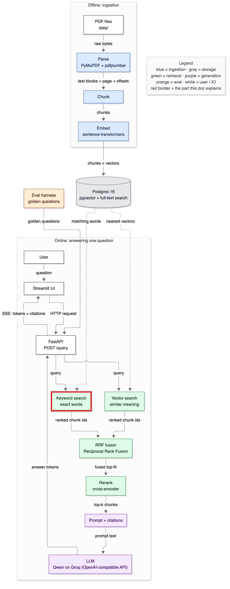
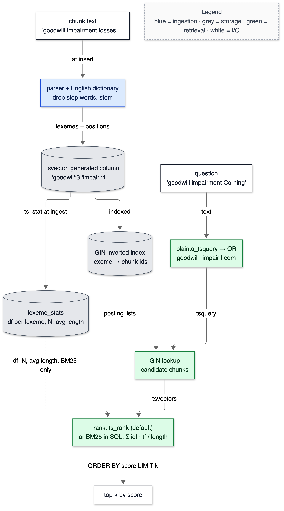

# 10 — Keyword search

**Status:** written in Phase 6 (2026-10-02); default ranking ts_rank, BM25 kept as an alternative after measurement. Owns: inverted index (in depth), token, lexeme, stop word, stemming, tsvector, tsquery, AND/OR/phrase queries, ts_rank, ts_rank_cd, term frequency, document frequency, IDF, BM25 (k1, b), stemming false positive.

> Prerequisites: [08-database-schema.md](08-database-schema.md) (the generated `tsv` column and its GIN index). Numbers come from `make bench-keyword` and `tests/test_keyword.py`, 2026-10-02.

---

## 1. In one paragraph

Keyword search is the back-of-the-book index: every important word points to the pages that contain it. Postgres builds that index from each chunk (dropping words like "the", reducing "impairments" to `impair`), and at question time looks up the question's words and ranks the chunks that contain them. It's blind to meaning — it can't tell "sales grew" from "revenue increased" — but it never misses an exact token: a figure like 16,434, a section like "Item 7A", a product code like MI250X. This doc builds it, compares Postgres's two built-in rankings with **BM25** (the formula behind Elasticsearch, implemented here in SQL), and measures, honestly, where keyword search helps and where it doesn't.

## 2. Why it exists

Vector search failed in ways keyword search doesn't: asked for "16,434", vector search returned random tables of numbers (the top hit was a Corning regional sales table, similarity 0.61), while keyword search returned AMD's revenue tables containing that exact figure. Embeddings treat numbers and codes as weak signals; users quoting a figure or a section number expect exact matches. The design fuses both kinds of search (Phase 7) because each fails where the other works.

## 3. Where it sits



<details><summary>Same diagram as text (for terminal viewing)</summary>

```text
 OFFLINE
 ┌───────────┐  ┌───────┐  ┌───────┐  ┌───────┐   ┌─────────────────────────────┐
 │ PDF files │─▶│ Parse │─▶│ Chunk │─▶│ Embed │──▶│ Postgres 16                 │
 └───────────┘  └───────┘  └───────┘  └───────┘   │ pgvector + full-text search │
                                                  └──────────────┬──────────────┘
 ONLINE                                                          │ searched by
 ┌───────────┐  ┌─────────┐     query     ╔══════════════════════▼══════════════╗
 │ Streamlit │─▶│ FastAPI │──────────────▶║ Vector search  +  Keyword search    ║
 └─────▲─────┘  └──┬───▲──┘               ╚══════════════════════╤══════════════╝
       │    SSE    │   │ answer tokens                           │ two ranked lists
       └───────────┘   │                                         ▼
               ┌───────┴──────┐  ┌────────────────────┐  ┌────────┐  ┌────────────┐
               │ LLM (Groq)   │◀─│ Prompt + citations │◀─│ Rerank │◀─│ RRF fusion │
               └──────────────┘  └────────────────────┘  └────────┘  └────────────┘

 Double-line box (╔═╗) = this doc explains the keyword half of the search box.
```
</details>

## 4. The flow



<details><summary>Same diagram as text (for terminal viewing)</summary>

```text
 ┌──────────────────────────┐                     ┌─────────────────────────────┐
 │ chunk text               │                     │ question                    │
 └────┬─────────────────────┘                     │ 'goodwill impairment Corning'│
      │ at insert                                 └────┬────────────────────────┘
      ▼                                                │ text
 ┌──────────────────────────┐                          ▼
 │ parser + English dict:   │                     ┌─────────────────────────────┐
 │ drop stop words, stem    │                     │ plainto_tsquery → OR        │
 └────┬─────────────────────┘                     │ goodwil | impair | corn     │
      │ lexemes + positions                       └────┬────────────────────────┘
      ▼                                                │ tsquery
 ┌──────────────────────────┐  indexed  ┌──────────┐   ▼
 │ tsvector (generated col) │ ────────▶ │ GIN index│ ┌────────────────────────┐
 │ 'goodwil':3 'impair':4 … │           │ lexeme → │─▶ GIN lookup: candidates │
 └────┬─────────────────────┘           │ chunk ids│ └────┬───────────────────┘
      │ ts_stat at ingest               └──────────┘      │ tsvectors
      ▼                                                   ▼
 ┌──────────────────────────┐  df, N, avg length  ┌───────────────────────────┐
 │ lexeme_stats             │ ──────────────────▶ │ rank: ts_rank (default)   │
 │ df per lexeme, N, avg len│                     │ or BM25 (idf · tf / len)  │
 └──────────────────────────┘                     └────┬──────────────────────┘
                                                       │ ORDER BY score LIMIT k
                                                       ▼
                                                  ┌──────────────┐
                                                  │ top-k        │
                                                  └──────────────┘
 Legend (colours appear in the image): blue = ingestion · grey = storage · green = retrieval
```
</details>

1. **At insert**, Postgres turns each chunk into a **tsvector**: the parser splits text into tokens, the English dictionary drops **stop words** and **stems** the rest into **lexemes**, recording positions. The generated column keeps it in sync automatically.
2. **The GIN index** maps each lexeme to the chunks containing it (an **inverted index**).
3. **At ingest**, `ts_stat` counts, for every lexeme, how many chunks contain it (**df**), stored in `lexeme_stats` with the chunk count N and average length.
4. **At query time**, the question becomes lexemes; they're **OR-ed** (AND matched almost nothing — §5). Quoted text and grouped numbers become required **phrases**.
5. **GIN lookup** returns the candidate chunks that contain any lexeme.
6. **Rank** each candidate — `ts_rank` by default (term frequency, length-normalised), or BM25 (term frequencies, length and the lexemes' IDF from `lexeme_stats`) — and return the top k.

## 5. The code — `app/retrieve/keyword.py`

```python
        words = sql.SQL("replace(plainto_tsquery('english', %(rest)s)::text, '&', '|')::tsquery")
```

`plainto_tsquery` normalises the question exactly like the documents (stop words out, stems in) and joins lexemes with `&` (AND). Measured: "What was AMD's net revenue in 2021?" became `'amd' & 'net' & 'revenu' & '2021'` and matched **1** chunk; a long FinanceBench question matched **0**. Replacing `&` with `|` on the query's text form gives OR: the same question matches 2,808 chunks and ranking decides. Without this line keyword search returns nothing for most natural questions.

```python
GROUPED_NUMBER = re.compile(r"\b\d{1,3}(?:,\d{3})+(?:\.\d+)?\b")
...
        parts = [sql.SQL("phraseto_tsquery('english', {})").format(sql.Placeholder(f"p{i}")) ...]
```

The parser splits "16,434" at the comma into `16` and `434` (`to_tsvector('english', 'Net revenue | $ 16,434')` → `'16':3 '434':4 'net':1 'revenu':2`). OR-ing those would match any chunk containing "16" — so grouped numbers (and "quoted text") become **phrase** queries `'16' <-> '434'` ("16 immediately followed by 434") that every result must satisfy. The phrases alone decide what matches; the remaining question words only *rank* the matches. (Corrected in Phase 11, T-042: the first version also required at least one other word, so "What does the figure $404,381 represent in Boeing's FY2022 10-K?" matched nothing. The backlog table contains the figure but none of those words. The Phase 6 benches query bare figures and were unaffected.)

```python
        if conn.execute(sql.SQL("SELECT numnode({q})").format(q=q), params).fetchone()[0] == 0:
            return []
```

A question of only stop words ("what is it?") produces an empty tsquery; `numnode` counts its nodes, so we return nothing instead of letting Postgres emit a notice and match nothing anyway.

```python
            idf AS (SELECT t.lexeme, ln(1 + (s.n_chunks - coalesce(l.df, 0) + 0.5) / (coalesce(l.df, 0) + 0.5)) AS idf ...
                SELECT cand.id, sum(idf.idf * u.tf * ({k1} + 1)
                                    / (u.tf + {k1} * (1 - {b} + {b} * length(cand.tsv) / s.avg_length))) AS score
                ...
                CROSS JOIN LATERAL (SELECT lexeme, cardinality(positions) AS tf FROM unnest(cand.tsv)) u
```

BM25 in SQL (`rank_function="bm25"`). `unnest(tsvector)` returns each lexeme with its positions; the number of positions is the term frequency `tf`. `length(tsvector)` is the number of distinct lexemes (our document length — an approximation of BM25's word count, stated honestly). Why build it: neither built-in ranking uses **IDF**, so a word that appears in every Corning chunk (`corn`) counts as much as a rare one (`goodwil`). The built-in `ts_rank_cd` (cover density) was fooled outright: "goodwill impairment Corning" returned lists of Corning *subsidiaries* first, because the repeated word forms dense clusters. `ts_rank` with length normalisation and BM25 both ranked the goodwill note first.

### `app/store/repository.py` — the statistics

```python
    inner = sql.SQL("SELECT tsv FROM chunks WHERE chunk_set_id = {}").format(sql.Literal(chunk_set_id))
    cur = conn.execute(sql.SQL("""INSERT INTO lexeme_stats (chunk_set_id, lexeme, df)
                                  SELECT {s}, word, ndoc FROM ts_stat({q})""") ...
```

`ts_stat` takes a *query string*, so the inner query is composed with `sql.Literal` (an integer id from our own table — no user input). The pipeline refreshes stats whenever it inserts chunks, so df stays consistent with the index.

## 6. Data in / data out

**Keyword vs vector on real queries** (top-1 each, chunk set 1):

```text
"16,434"
  keyword         8.82 AMD_2022_10K p48 | 'Year Ended … (In millions) Net revenue: Data Center | $ …'   ← contains the figure
  vector          0.610 CORNING_2022_10K p106 | '| 640 | 3,479 | 748 | 3,597 Other | 729 | …'          ← random numbers
"goodwill impairment Corning"
  ts_rank_cd      0.556 CORNING_2021_10K p120 | 'Corning Holding GmbH Germany Corning Hungary …'       ← subsidiary list
  ts_rank         0.015 CORNING_2022_10K p80  | 'Corning's gross goodwill balance and accumulated impairment losses …'
  bm25            16.90 CORNING_2021_10K p90  | 'Corning's gross goodwill balance and accumulated impairment losses …'
  vector          0.830 CORNING_2022_10K p80  | 'Corning's gross goodwill balance and accumulated impairment losses …'
"MI250X"
  keyword         the only chunk containing 'mi250x'  (AMD_2022_10K p31)
  vector          0.638 AMD_2021_10K p9 | 'Data Center Graphics. Our AMD Instinct family …'      ← related, not exact
```

**BM25 worked on the real top hit** (N = 7,411 chunks, average 52.7 distinct lexemes; this chunk has 24):

```text
 lexeme  | df  |  idf  | tf | len | avg_len | contribution
 corn    | 459 | 2.781 |  2 |  24 |    52.7 |        4.515
 goodwil | 183 | 3.699 |  3 |  24 |    52.7 |        6.580
 impair  | 332 | 3.104 |  4 |  24 |    52.7 |        5.800
                                              score = 16.895
```

By hand for `corn`: idf = ln(1 + (7411 − 459 + 0.5)/(459 + 0.5)) = ln(16.131) = 2.781. Denominator = tf + k1·(1 − b + b·len/avg) = 2 + 1.2·(0.25 + 0.75·24/52.7) = 2 + 1.2·0.5916 = 2.710. Contribution = 2.781 · 2 · (1.2 + 1) / 2.710 = 4.515. The rarer the lexeme (smaller df), the bigger its idf; the short chunk (24 < 52.7) gets a boost.

**On FinanceBench's labelled questions** (`make bench-keyword`; 28 questions with evidence pages; hit = a top-k chunk from the evidence document covering an evidence page):

```text
method                  hit@5 hit@10  p50 ms
vector (bge-small)      0.286  0.357    24.1
keyword ts_rank         0.071  0.143    31.5
keyword ts_rank_cd      0.071  0.071    47.2
keyword bm25            0.071  0.071    71.6

hit@10 overlap, vector vs bm25: both 2, vector only 8, bm25 only 0, neither 18
```

Read honestly: on these natural-language questions keyword search is far weaker than vector search and added nothing vector didn't already find. ts_rank vs BM25 differ by 2 questions — 7 percentage points on 28 questions, which is noise; but nothing here shows BM25 *better*, and it is 2.3× slower, so **ts_rank is the default** and BM25 is kept as an ablation option for the larger golden set. Why keyword struggles here: questions say "FY22" where filings say "fiscal 2022"; many end with a long instruction ("Respond to the question by assuming the perspective of an investment analyst…") whose words match all kinds of chunks; and 18 of 28 questions were missed by *both* methods, most needing a cash-flow or income-statement table. These are the questions keyword search is *not* for; its value is exact tokens, which the Phase 11 golden set adds deliberately.

## 7. Decisions & alternatives

<!-- card:start id=21 -->
#### Decision: Postgres full-text search, ranked by ts_rank with length normalisation; BM25 implemented in SQL as an alternative  (rejected: ts_rank_cd, Elasticsearch/OpenSearch BM25, SPLADE)

**One-line defence.** Keyword search lives next to the vectors in the same Postgres, so hybrid search is one database round trip; I implemented BM25 to test the textbook claim that it beats Postgres's ranking, and on this corpus it didn't — so the faster built-in ts_rank is the default.

**What problem is this even solving?** Exact-token retrieval: figures, section numbers, product codes, names — things embeddings blur. Without it, a question quoting "16,434" gets random number tables.

**The options, compared.**

| Option | How it works (1 line) | Strengths | Weaknesses | When it's the right call |
|---|---|---|---|---|
| ✅ Postgres FTS + `ts_rank` (normalisation 1) | tsvector/GIN matching; rank by term frequency divided by 1 + log(length) | Built in (C code), 31 ms here; same database as vectors | No IDF: common words count fully | Default for this corpus — measured |
| BM25 in SQL (built here) | IDF from ts_stat + saturated tf + length normalisation over GIN candidates | Principled IDF ranking; handled the "Corning" case | 72 ms (scores every candidate in SQL); FinanceBench hit@10 0.071 vs ts_rank 0.143 (noise) | If the larger golden set shows a gain |
| `ts_rank_cd` (cover density) | Rewards query terms close together | Good for phrase-like queries | Fooled by repetition: ranked subsidiary lists first | Short multi-word queries without repeated terms |
| Elasticsearch / OpenSearch | Dedicated engine with BM25, analyzers, sharding | Mature, fast BM25 via precomputed impacts; scales out | A second system to keep consistent; JVM memory on an 8 GB laptop | Search-first products at scale |
| SPLADE | Neural sparse term weights with vocabulary expansion | Fixes lexical mismatch ("FY22" vs "fiscal 2022") | Model inference at ingest and query; new index format | When vocabulary mismatch is the measured problem |

**What would actually change if we swapped it.** To BM25: one setting (`rank_function="bm25"`), +40 ms per query, `lexeme_stats` must stay fresh (the pipeline refreshes it). To Elasticsearch: a third container, a sync job (inserts/deletes mirrored with retry and reconciliation), and hybrid fusion across two systems. To SPLADE: a second model and a sparse-vector index.

**The decision rule.** Measure the ranking function on your own questions before adopting the textbook default. Use the database's built-in search while the corpus fits; move to a search engine for analyzers, languages or scale; consider learned sparse models when lexical mismatch is the measured failure.

**Where our choice breaks.** Queries where a very common word dominates frequency counts — ts_rank has no IDF, so it would need BM25 or a stop-list for corpus-specific common words (company names). The English stemmer also maps "Corning" to `corn`, matching PepsiCo's corn. And BM25's SQL cost grows with the number of OR-matched candidates.

**The number.** FinanceBench (28 questions) hit@10: vector 0.357, ts_rank 0.143, ts_rank_cd 0.071, BM25 0.071; p50 31.5 / 47.2 / 71.6 ms for the keyword variants. "goodwill impairment Corning" top-1: ts_rank and BM25 the goodwill note; ts_rank_cd a subsidiary list. BM25 worked example: 16.895 = 4.515 + 6.580 + 5.800.

**Interview script (3 sentences).** "Keyword search is Postgres full-text search with OR semantics and phrase-required figures. I implemented BM25 in SQL to test whether it beats Postgres's ranking here — it fixed a failure of the cover-density ranker, but plain ts_rank fixed it too, matched it on FinanceBench and was twice as fast, so ts_rank is the default and BM25 is an ablation option. Measured honestly, keyword search alone found the evidence page for 2–4 of 28 natural-language questions versus 10 for vector search; its job is exact tokens, which is why it's fused, not used alone."

**Follow-ups they will ask:**
- Q: Why OR instead of AND? → A: Postgres's plainto_tsquery ANDs every word, so the AMD question matched 1 chunk and a long FinanceBench question 0. OR plus ranking returns candidates and lets ranking order them.
- Q: Explain BM25's k1 and b. → A: k1 (1.2) controls term-frequency saturation — the second occurrence counts less than the first, the tenth barely. b (0.75) controls length normalisation — how much long chunks are penalised.
- Q: You built BM25 and then didn't use it? → A: I built it to test a claim, and the measurement said the simpler built-in was as good and faster on this data. It stays switchable, and the larger golden set in Phase 12 gets the final word. Building something to measure it, then choosing the simpler option, is the point.
- Q: Why did ts_rank_cd fail? → A: Cover density rewards query terms appearing close together; a subsidiary list repeating "Corning" again and again is a dense cluster of a query term.
- Q (the hard one): Your keyword search found nothing that vector search missed. Why keep it at all? → A (honest): On those 28 paraphrased questions, it earned nothing. Its measured wins are exact-token queries ("16,434", "MI250X") where vector search returned noise. Whether that matters overall depends on how many real questions contain exact tokens; the golden set includes such questions, and Phase 7/12 show whether fusion helps, hurts or does nothing.

**The trap.** "BM25 is always better than Postgres's ranking" — or "keyword search is obsolete". Both are claims to measure; here the first was false and the second only half true.
<!-- card:end -->

## 7a. Prerequisite concepts

**Inverted index** — instead of "document → words", store "word → documents". For "goodwill & impairment", fetch the two posting lists and intersect them; no document is read that doesn't contain the words. GIN is Postgres's inverted index ([08](08-database-schema.md)).

**Token → lexeme** — the parser splits text into tokens (words, numbers, URLs…); a dictionary turns each into a normalised **lexeme**, or discards it.

**Stop words** — very common words ("the", "was", "in") dropped because they appear everywhere and carry little meaning.

**Stemming** — cutting words to a common stem with rules (Snowball for English): "impairments", "impaired" → `impair`. It's rule-based, not dictionary-based, so it makes mistakes: **"Corning" → `corn`** (test `test_stemming_quirk_corning_becomes_corn`), and it doesn't connect irregular forms ("grew" ≠ "grow").

**tsvector / tsquery** — a tsvector is a document's sorted lexemes with positions (`'goodwil':3 'impair':4`); a tsquery is a boolean query over lexemes: `&` AND, `|` OR, `!` NOT, `<->` "followed by".

**Term frequency (tf)** — how many times a term appears in a document. **Document frequency (df)** — how many documents contain it. **IDF** — inverse document frequency, `ln(1 + (N − df + 0.5)/(df + 0.5))`: high for rare terms, near zero for terms in almost every document.

**BM25 intuition** — a document scores highly if it contains rare query terms (IDF), contains them more than once but with diminishing returns (saturation, k1), and isn't long merely to contain more words (length normalisation, b). Formula per term: `idf · tf·(k1+1) / (tf + k1·(1 − b + b·len/avg_len))`; sum over query terms.

**ts_rank vs ts_rank_cd** — Postgres's built-ins: ts_rank weighs term frequency (and optional weights/normalisation); ts_rank_cd ("cover density") rewards query terms appearing close together. Neither uses IDF.

**Phrase query** — `phraseto_tsquery('net revenue')` → `'net' <-> 'revenu'`: the terms must be adjacent, in order.

## 7b. What if we used something else?

| If we had used… | Immediate effect | Effect on quality metrics | Effect on latency/cost | Effect on complexity | Would I defend it? |
|---|---|---|---|---|---|
| AND semantics (Postgres default) | Most questions match nothing | Keyword recall near zero (1 hit for the AMD question) | Fast | Same | No |
| OR without phrases for numbers | "16,434" matches every chunk with "16" | Exact-figure queries degrade | Same | Simpler | No |
| BM25 instead of ts_rank | ~40 ms slower | FinanceBench 2/28 vs 4/28 (noise); IDF-aware | Slower | Stats table to maintain | As an ablation, yes |
| ts_rank_cd instead of ts_rank | Proximity-based ranking | Fooled by repeated terms (subsidiary lists) | Slower (47 ms) | Same | No |
| Elasticsearch | Second store | Probably better analyzers | Network hop; ops | Sync job | Not at this size |
| `simple` dictionary (no stemming) | No `corn` false positive | Misses plural/inflected forms | Same | Same | Possibly for names; not as default |

## 8. Failure modes

| What you see | Cause | Fix |
|---|---|---|
| Keyword search returns nothing for a natural question | AND semantics | OR the lexemes (done) |
| A figure matches unrelated chunks | "16,434" split into 16 and 434 | Grouped numbers → phrase queries (done) |
| Results dominated by a company's subsidiary list | ts_rank_cd rewards repeated terms | ts_rank (default) or BM25 |
| Corning queries match PepsiCo corn | Stemmer: "Corning" → `corn` | Filter by company; or a custom dictionary |
| `KeyError: 'evidence_doc_name'` reading FinanceBench | The README's field name differs from the file's (`doc_name`) | Read the data, not the docs (fixed in `bench_keyword.py`) |
| BM25 scores look stale after re-ingest | lexeme_stats not refreshed | Pipeline refreshes stats when chunks are inserted |
| "FY22" doesn't match "fiscal 2022" | Lexical mismatch | Vector search; query rewriting (not built) |

## 9. Try it yourself

```bash
make bench-keyword
```

Expected: the table in §6 (hit rates identical; latencies ±10 ms).

```bash
docker compose exec -T db sh -c 'psql -U "$POSTGRES_USER" -d "$POSTGRES_DB" -Atc "SELECT to_tsvector('"'"'english'"'"', '"'"'Net revenue | \$ 16,434'"'"')"'
```

Expected: `'16':3 '434':4 'net':1 'revenu':2`.

```bash
.venv/bin/python -m pytest tests/test_keyword.py -q
```

Expected: `11 passed`.

## 10. Numbers

| What | Value | Command |
|---|---|---|
| AND vs OR matches, "What was AMD's net revenue in 2021?" | 1 vs 2,808 chunks | SQL in Phase 6 notes |
| Lexemes in chunk set 1 / avg distinct per chunk | 9,787 / 52.7 | `chunk_set_stats` |
| FinanceBench hit@10: vector / ts_rank / ts_rank_cd / BM25 | 0.357 / 0.143 / 0.071 / 0.071 | `make bench-keyword` |
| Latency p50: ts_rank / BM25 | 31.5 / 71.6 ms | same |
| BM25 top score, worked example | 16.895 | §6 |

## 11. Interview talking points

- "Postgres FTS with OR semantics and phrase-required figures. I implemented BM25 in SQL to test whether it beats the built-in ranking; on this corpus it didn't, so the faster ts_rank is the default."
- "Measured honestly: on natural-language questions keyword alone is much weaker than vector search (2–4 vs 10 of 28) and found nothing vector missed; its wins are exact tokens."
- "The stemmer turns Corning into corn."
- Expect: "Why not Elasticsearch?", "Explain BM25", "Why keep keyword search if vector wins?"

## 12. Check yourself

1. Why does `plainto_tsquery` alone fail for natural questions, and what's the fix?
2. Compute the IDF of a lexeme with df = 183 in N = 7,411 chunks.
3. Why did ts_rank_cd rank a list of subsidiaries first for "goodwill impairment Corning", while ts_rank and BM25 didn't?

<details><summary>Answers</summary>

1. It ANDs every lexeme, so a chunk must contain all of them; the AMD question matched 1 chunk, a long FinanceBench question 0. OR the lexemes and let ranking order the candidates.
2. ln(1 + (7411 − 183 + 0.5)/(183 + 0.5)) = ln(1 + 39.39) = ln(40.39) ≈ 3.699.
3. ts_rank_cd (cover density) rewards query terms appearing close together, and the subsidiary list is a dense run of the query term "Corning" (lexeme `corn`). ts_rank divides by document length, so the long repetitive list scores lower; BM25's IDF additionally down-weights `corn` (df 459) relative to `goodwil` (df 183).

</details>

## 13. New terms added to the glossary

inverted index (in depth), token, stemming, Snowball stemmer, tsquery operators, phrase query, term frequency, document frequency, IDF, BM25, k1, b, ts_rank_cd, stemming false positive — see [21-glossary.md](21-glossary.md).
