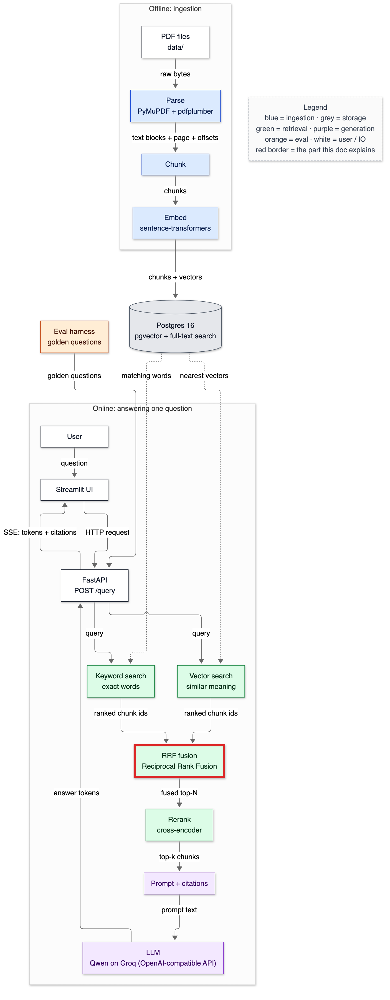
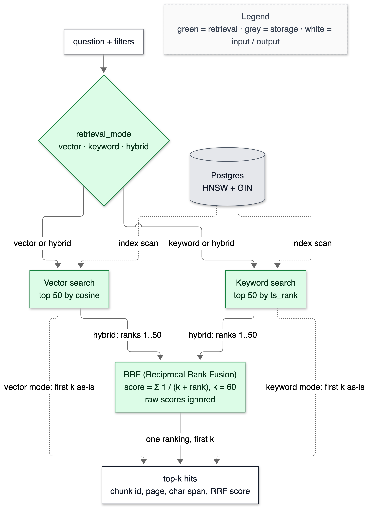
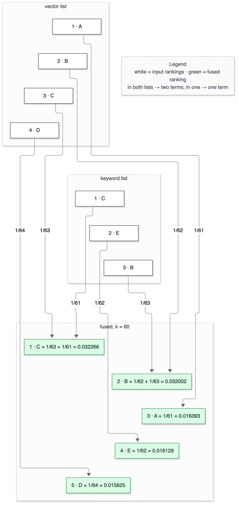

# 11 — Hybrid search and RRF

**Status:** written in Phase 7 (2026-10-02). The default is hybrid with RRF at k = 60. A reranker re-sorts its top-N in Phase 8, and the Phase 12 ablation on the golden set makes the final call. This doc owns these terms: rank fusion, RRF, the RRF k constant, weighted-score fusion, min-max normalisation, learned fusion, retrieval depth, interleaving, tie-break.

> **Prerequisites:** [09-vector-search.md](09-vector-search.md) and [10-keyword-search.md](10-keyword-search.md), which build the two lists being fused. All numbers come from `make bench-hybrid` and `tests/test_hybrid.py`, run on 2026-10-02.

---

## 1. In one paragraph

We have two search methods that fail in different places. Vector search understands paraphrase but blurs exact figures. Keyword search finds "16,434" exactly but misses "sales grew" when the text says "revenue increased". Hybrid search runs both and merges the two ranked lists into one. The merge rule is **Reciprocal Rank Fusion (RRF)**: each chunk scores `1 / (k + rank)` in every list it appears in, and those scores are summed. RRF looks only at positions, never at raw scores. That matters because a cosine of 0.61 and a ts_rank of 0.016 are on unrelated scales. This doc derives RRF by hand on a toy example and explains what k controls. It then measures, honestly, where hybrid wins (exact figures: 0 of 50 found → 50 of 50) and where it loses (paraphrased FinanceBench questions: 10 of 28 → 8 of 28 at hit@10).

## 2. Why it exists

Phase 6 measured two failures that mirror each other:

- For the query "16,434", vector search found the chunk containing that figure in its top 20 for **1** of 50 rare-figure queries. Keyword search found it at rank 1 for 49 of them.
- On the 28 paraphrased FinanceBench questions, vector search found the evidence page in its top 10 for 10 questions. Keyword search did so for 4.

A system that picks only one of them gives up one of these columns. Fusion is the cheapest way to keep both, and it needs no training data, no score calibration, and only a few lines of code.

## 3. Where it sits



<details><summary>Same diagram as text (for terminal viewing)</summary>

```text
 OFFLINE
 ┌───────────┐  ┌───────┐  ┌───────┐  ┌───────┐   ┌─────────────────────────────┐
 │ PDF files │─▶│ Parse │─▶│ Chunk │─▶│ Embed │──▶│ Postgres 16                 │
 └───────────┘  └───────┘  └───────┘  └───────┘   │ pgvector + full-text search │
                                                  └──────────────┬──────────────┘
 ONLINE                                                          │ searched by
 ┌───────────┐  ┌─────────┐     query     ┌──────────────────────▼──────────────┐
 │ Streamlit │─▶│ FastAPI │──────────────▶│ Vector search  +  Keyword search    │
 └─────▲─────┘  └──┬───▲──┘               └──────────────────────┬──────────────┘
       │    SSE    │   │ answer tokens                           │ two ranked lists
       └───────────┘   │                                         ▼
               ┌───────┴──────┐  ┌────────────────────┐  ┌────────┐  ╔════════════╗
               │ LLM (Groq)   │◀─│ Prompt + citations │◀─│ Rerank │◀─║ RRF fusion ║
               └──────────────┘  └────────────────────┘  └────────┘  ╚════════════╝

 Double-line box (╔═╗) = this doc. RRF = Reciprocal Rank Fusion.
```
</details>

## 4. The flow



<details><summary>Same diagram as text (for terminal viewing)</summary>

```text
                       ┌────────────────────┐
                       │ question + filters │
                       └─────────┬──────────┘
                                 ▼
                 ┌───────────────────────────────┐          ┌──────────────┐
                 │ retrieval_mode                │          │ Postgres     │
                 │ vector · keyword · hybrid     │          │ HNSW + GIN   │
                 └───────┬───────────────┬───────┘          └──────┬───────┘
       vector or hybrid  │               │  keyword or hybrid      ┆ index scans
                         ▼               ▼                         ┆ (both searches)
              ┌──────────────────┐  ┌───────────────────┐ ◀┄┄┄┄┄┄┄┄┘
              │ Vector search    │  │ Keyword search    │
              │ top 50 by cosine │  │ top 50 by ts_rank │
              └──┬────────┬──────┘  └──────┬────────┬───┘
                 ┆        │ hybrid:        │ hybrid:┆
   vector mode:  ┆        │ ranks 1..50    │ ranks  ┆  keyword mode:
   first k as-is ┆        ▼                ▼ 1..50  ┆  first k as-is
                 ┆   ┌───────────────────────────┐  ┆
                 ┆   │ RRF (Reciprocal Rank      │  ┆
                 ┆   │ Fusion) Σ 1/(k+rank), k=60│  ┆
                 ┆   │ raw scores ignored        │  ┆
                 ┆   └─────────────┬─────────────┘  ┆
                 ┆                 │ one ranking, first k
                 ▼                 ▼                ▼
              ┌──────────────────────────────────────────┐
              │ top-k hits: chunk id, page, char span,   │
              │ score                                    │
              └──────────────────────────────────────────┘
 Legend (colours appear in the image): green = retrieval · grey = storage · white = I/O
```
</details>

1. `retrieval_mode` in the settings (default `hybrid`) picks the path. `get_retriever(mode, chunk_set_id)` builds the matching object, and all three objects have the same `search(conn, query, k, filters)` method.
2. In hybrid mode, both retrievers run with the same filters at **depth** 50, which is more than the k the caller wants. A chunk at keyword rank 30 can still end up in the fused top 10 if vector search also likes it.
3. RRF throws away the raw scores, keeps each chunk's rank in each list, sums `1/(k + rank)`, and sorts.
4. The first k hits come back as ordinary `Hit` objects. Page, character span and section survive fusion unchanged, so citations work the same in every mode.

## 5. The code — `app/retrieve/hybrid.py`

```python
def rrf(ranked_lists: list[list[Hit]], k: int = 60) -> list[Hit]:
    scores: dict[int, float] = {}
    ...
    for hits in ranked_lists:
        for h in hits:
            scores[h.chunk_id] = scores.get(h.chunk_id, 0.0) + 1.0 / (k + h.rank)
            if h.chunk_id not in best or h.rank < best_rank[h.chunk_id]:
                best[h.chunk_id], best_rank[h.chunk_id] = h, h.rank
    order = sorted(scores, key=lambda cid: (-scores[cid], best_rank[cid], cid))
```

The whole algorithm is one dictionary. Only `h.rank` is read; `h.score` is never touched. Two details:

- **The tie-break is explicit.** Order is by best single rank, then by chunk id. Ties are common: the two lists' rank-1 chunks both score exactly `1/61`. Without a fixed rule, the order would depend on dictionary insertion order. With one, every run is reproducible. §6 shows this rule decides more than you'd expect.
- **The returned hit is the copy from the list where the chunk ranked best.** Its `score` is replaced with the RRF score and its `rank` with the fused position (`dataclasses.replace`), because `Hit` is frozen.

```python
def weighted_fusion(ranked_lists, weights):
    ...
        lo, hi = min(h.score for h in hits), max(h.score for h in hits)
        for h in hits:
            norm = (h.score - lo) / (hi - lo) if hi > lo else 1.0
            totals[h.chunk_id] = totals.get(h.chunk_id, 0.0) + w * norm
```

This is the alternative RRF is compared against: rescale each list's scores to 0–1 (**min-max normalisation**), then take a weighted sum. The `if hi > lo` guard matters, and my first version got it wrong. It computed `(s - lo) / ((hi - lo) or 1.0)`, which gives a list with a single hit the score **0.0** instead of 1.0. A rare figure that keyword search found exactly once then contributed nothing, and the bench showed weighted fusion finding only 20 of 50 figures. The regression test is `test_weighted_fusion_single_hit_list_counts_as_its_best`, and the error is logged as T-032. The weak point that remains is built in: every list's best hit becomes exactly 1.0 and its worst 0.0, whether they were great or poor matches.

```python
@dataclass
class HybridRetriever:
    vector: object            # anything with .search(conn, query, k, filters)
    keyword: object
    rrf_k: int = 60
    depth: int = 50
```

The two retrievers are passed in rather than built inside. The tests use fakes, and Phase 8 can wrap the result without changing this class.

## 6. Data in / data out

### RRF by hand (the toy example — the same numbers are asserted in `tests/test_hybrid.py`)



<details><summary>Same diagram as text (for terminal viewing)</summary>

```text
  vector list        keyword list                 fused, k = 60
  ───────────        ────────────                 ─────────────────────────────────
  1 · A ─────────────────────────── 1/61 ───────▶ 3 · A = 1/61         = 0.016393
  2 · B ─────────────────────────── 1/62 ──┐
  3 · C ─────────────────────────── 1/63 ─┐│
  4 · D ─────────────────────────── 1/64 ─┼┼────▶ 5 · D = 1/64         = 0.015625
                     1 · C ──────── 1/61 ─┴┼────▶ 1 · C = 1/63 + 1/61 = 0.032266
                     2 · E ──────── 1/62 ──┼────▶ 4 · E = 1/62         = 0.016129
                     3 · B ──────── 1/63 ──┴────▶ 2 · B = 1/62 + 1/63 = 0.032002

  In both lists → two terms. In one list → one term.
  Legend (colours appear in the image): white = input rankings · green = fused ranking
```
</details>

Vector search returned A, B, C, D. Keyword search returned C, E, B. With k = 60:

```text
chunk  vector rank  keyword rank  1/(60+rv)  1/(60+rk)   RRF score   fused rank
C           3            1        1/63 = 0.015873 + 1/61 = 0.016393 = 0.032266     1
B           2            3        1/62 = 0.016129 + 1/63 = 0.015873 = 0.032002     2
A           1            —        1/61 = 0.016393                   = 0.016393     3
E           —            2                          1/62 = 0.016129 = 0.016129     4
D           4            —        1/64 = 0.015625                   = 0.015625     5
```

Three things to see:

1. **Agreement beats a single top rank.** A was vector's #1 and ends up third, behind two chunks that both lists returned. Under RRF, two mid-ranked appearances (≈ 2/62) are worth almost twice one rank-1 appearance (1/61).
2. **The gaps between ranks are tiny at k = 60.** Rank 1 versus rank 4 in one list is 0.016393 versus 0.015625, a 5% difference. Large k makes ranking "how many lists found it?" first and "how high?" second.
3. **k decides the trade.** At k = 0: A = 1/1 = 1.0, B = 1/2 + 1/3 = 0.833, so A jumps above B and the order becomes C, A, B, E, D (`test_k_changes_the_order_in_the_worked_example`). Small k trusts each list's top hit; large k trusts consensus.

### Real fusion: the query "16,434"

(Top 5 of each list, depth 50. Shell: `.venv/bin/python` with `rrf` on the two retrievers' results.)

```text
vector                                   keyword                                  RRF k=60
1 0.6104 CORNING_2022 p106 '| 640 | …'   1 0.0162 AMD_2022 p48 'Net revenue…' ✔   1 0.0164 CORNING_2022 p106  (vector #1)
2 0.6052 PEPSICO_2021 p89  '$ 16,216…'  2 0.0159 AMD_2022 p68 'United States…'  2 0.0164 AMD_2022 p48 ✔       (keyword #1)
3 0.6031 PEPSICO_2021 p70  'FLNA | $…'  3 0.0155 AMD_2021 p46 'Comparison…'     3 0.0161 PEPSICO_2021 p89   (vector #2)
4 0.5982 CORNING_2022 p85  '434 | $…'   4 0.0150 AMD_2022 p49 'Comparison…'     4 0.0161 AMD_2022 p68       (keyword #2)
5 0.5865 VERIZON_2021 p3   'Item 9B…'   5 0.0148 AMD_2021 p76 'Net revenue…'    5 0.0159 PEPSICO_2021 p70   (vector #3)
```

The fused list is a **zipper**: vector #1, keyword #1, vector #2, keyword #2 and so on. Neither chunk is in the other list, so each one's score comes from its own rank alone, and equal ranks give equal scores. The correct chunk lands at rank 2 rather than rank 1 only because vector's junk has a lower chunk id (4,853 < 5,759) and wins the tie-break. This is why the bench below shows figure-query hit@1 at 0.46 but hit@5 at 1.00: in 27 of 50 queries the fused #1 is wrong, almost always vector's #1 winning this tie. RRF can't know which list to trust for a particular query. A reranker, which reads the text, can (Phase 8).

### The comparison (`make bench-hybrid`)

Every method fuses *the same* depth-50 lists, so differences come only from the fusion rule.

- **FinanceBench (FB):** the 28 labelled questions. A hit means a top-k chunk covers an evidence page.
- **Exact figures (fig):** 50 numbers written with thousands separators. Each occurs in at most two chunks and was sampled with seed 13. A hit means a top-k chunk contains the figure. Labels are mechanical and exact, but the queries are artificial.

```text
method                 FB hit@5 FB hit@10 FB hit@20 fig hit@1 fig hit@5 fig hit@20
vector only               0.286     0.357     0.429     0.000     0.000      0.020
keyword only              0.071     0.143     0.214     0.980     1.000      1.000
hybrid RRF k=1            0.214     0.357     0.393     0.460     1.000      1.000
hybrid RRF k=10           0.179     0.321     0.393     0.460     1.000      1.000
hybrid RRF k=60           0.143     0.286     0.393     0.460     1.000      1.000
hybrid RRF k=100          0.143     0.286     0.393     0.460     1.000      1.000
weighted α_vec=0.3        0.107     0.214     0.357     0.980     0.980      0.980
weighted α_vec=0.5        0.143     0.357     0.393     0.460     0.980      0.980
weighted α_vec=0.7        0.357     0.357     0.429     0.000     0.200      0.980

latency on the FinanceBench questions, k=10 (warm, sequential, one connection)
  vector             p50    3.6 ms   max    6.7 ms
  keyword            p50   31.6 ms   max  273.9 ms
  hybrid RRF k=60    p50   48.5 ms   max  280.2 ms
```

**Read honestly:**

- **Exact figures:** hybrid fixes vector's blind spot completely by hit@5 (0.00 → 1.00). Hit@1 is decided by the tie-break, as shown above.
- **FinanceBench:** hybrid is *worse* than vector alone. At hit@10, 8 questions versus 10 for k = 60. With 28 questions, one question is 3.6 points. The per-question breakdown (shell, same lists): hybrid gained 2 questions and lost 4.
  - *Gained:* AMD's products, evidence at vector rank 13, keyword 7, fused 6. Boeing's operating-margin average, evidence at vector 24, keyword 36, fused 6. Both lists ranked the evidence mediocre, and agreement lifted it.
  - *Lost:* AMD customer concentration (vector 1 → fused 20), Boeing legal proceedings (4 → 16), PepsiCo capex (4 → 14), Verizon capital intensity (8 → 21). In three of the four, keyword search didn't have the evidence in its top 50 at all. Its noise **interleaved** with vector's list and pushed vector rank *r* down to roughly 2*r* or worse. That is the zipper again.
- **k barely matters here.** k = 1 recovers vector's hit@10 (0.357) and k = 60 loses two questions. That difference is 2 questions out of 28, which is inside the noise of a set this small. At hit@20, every k gives the same 0.393.
- **Weighted fusion is competitive, and the weight is a dial between the two columns.** α_vec = 0.3 behaves like keyword (figures hit@1 0.98, FinanceBench hit@10 0.214). α_vec = 0.7 behaves like vector (FinanceBench 0.357, figures hit@5 0.20). At α_vec = 0.5 it matches vector on FinanceBench hit@10 (0.357, two questions better than RRF) and finds 49 of 50 figures in the top 5 against RRF's 50. Its hit@1 on figures is 0.46, the same as RRF and for the same reason: two normalised 1.0s tie. On 28 + 50 queries, RRF k = 60 and weighted α = 0.5 aren't separable; the 2-question gap is noise. RRF stays the default because it needs no weight. The 0.5 here was picked from three values on the same queries it's scored on, and a weight is exactly what has to be re-tuned per corpus. Both go into the Phase 12 ablation.
- **Latency:** hybrid costs about 45 ms more than vector alone (48.5 vs 3.6 ms p50). The vector figure is low because the query embedding was already in the in-process LRU cache from the hit-rate run, so read it as pure database time. Keyword search at depth 50 is the expensive half, and its cost follows question length. Timed one by one (shell, warm), the slowest question has 58 words and 69 tsquery nodes after OR-ing, and takes 269 ms. A 10-word question takes 12 ms.

**The decision, and why it isn't "vector only":** the default stays `hybrid`, RRF, k = 60.

- Losing 2 FinanceBench questions out of 28 is within noise. Missing 49 of 50 exact figures is not.
- From Phase 8 on, a cross-encoder re-sorts the fused top-N. What fusion must deliver is then *recall at N*. At hit@20, hybrid is 0.393 against vector's 0.429 (one question), and 1.00 against 0.02 on figures.
- k = 60 is the published default, and nothing here shows a better k beyond noise. The Phase 12 ablation reruns this comparison on the 50+ question golden set, which includes exact-token, table, multi-hop and unanswerable questions. If hybrid still loses there, the default changes and this doc says so.

## 7. Decisions & alternatives

<!-- card:start id=20 -->
#### Decision: hybrid retrieval (vector + keyword, fused) as the default  (rejected: dense-only, sparse-only)

**One-line defence.** The two searches fail on disjoint queries. Vector search found 0 of 50 exact figures in its top 5 and keyword search found all 50. Keyword search found evidence for 4 of 28 paraphrased questions and vector for 10. Fusing keeps both strengths, at about 45 ms of extra latency.

**What problem is this even solving?** One retriever can't be good at both meaning and exact tokens. Users ask "how did sales do?" and also "where does 16,434 come from?"

**The options, compared.**

| Option | How it works (1 line) | Strengths | Weaknesses | When it's the right call |
|---|---|---|---|---|
| Dense-only (vector) | Embed the question, nearest chunks by cosine | Paraphrase, synonyms; 3.6 ms DB time | Blurs figures, codes, names: fig hit@20 0.02 | Conversational queries without exact tokens |
| Sparse-only (keyword / FTS) | Lexeme match, ts_rank | Exact tokens: fig hit@1 0.98 | Lexical mismatch ("FY22" vs "fiscal 2022"): FB hit@10 0.14 | Search boxes, codes, log search |
| ✅ Hybrid (both + fusion) | Run both at depth 50, fuse ranks | fig hit@5 1.00 *and* FB hit@20 0.39 | Interleaving noise: FB hit@10 0.29 vs 0.36; 48.5 ms | Mixed queries, a reranker downstream |

**What would actually change if we swapped it.** Going dense-only: one setting (`retrieval_mode=vector`), keyword search ~45 ms faster to skip, and every exact-figure question breaks. Going sparse-only: most paraphrased questions break. The code stays the same either way, because the switch is a factory argument.

**The decision rule.** Look at the query mix. If any meaningful share of queries contains exact tokens (figures, IDs, names, section numbers), fuse. If queries are purely conversational and latency is tight, dense-only is defensible. Measure both columns, not one average.

**Where our choice breaks.** When one list is pure noise for a query, RRF still gives that noise half the slots (the zipper). A reranker or query-type routing fixes it; RRF alone can't.

**The number.** Exact figures hit@5: vector 0.00, keyword 1.00, hybrid 1.00. FinanceBench hit@10: vector 0.357, keyword 0.143, hybrid 0.286 (k = 60); hit@20: 0.429 / 0.214 / 0.393. p50 latency 3.6 / 31.6 / 48.5 ms.

**Interview script (3 sentences).** "I run vector and keyword search and fuse them with RRF, because I measured that they fail on disjoint queries: vector found no exact figures, and keyword missed most paraphrased questions. Fusion fixed the figures completely but cost two of 28 FinanceBench questions at top-10, because keyword noise interleaves with good vector hits. I kept hybrid since a reranker re-sorts the top-N next, and at top-20 the loss is one question."

**Follow-ups they will ask:**
- Q: Your hybrid is worse than vector on the real benchmark. Why ship it? → A: On 28 questions the gap is 2 questions, which is noise, while the exact-figure gain is 0 → 50 of 50. The reranker reads the text and undoes interleaving. The golden-set ablation is the final judge.
- Q: Why not route queries, sending figures to keyword? → A: It's a valid design. It needs a classifier that can itself be wrong. Fusion plus rerank needs no classifier, so I'd try routing only if rerank can't recover the loss.
- Q: Why depth 50 instead of 10? → A: A chunk that each list puts at rank 15 should beat one that only one list puts at rank 5. RRF needs to see past k to find that agreement.
- Q (the hard one): Isn't fusion just averaging two bad systems? → A: No, averaging would give the mean. Here hybrid matches the *better* system on each query type at hit@5 for figures and at hit@20 on FinanceBench within one question. That works because the two systems' errors barely overlap.

**The trap.** "Hybrid is always better." It wasn't here at hit@10, and saying so is the strong answer.
<!-- card:end -->

<!-- card:start id=22 -->
#### Decision: Reciprocal Rank Fusion  (rejected for now: weighted-score fusion; rejected: learned fusion)

**One-line defence.** RRF uses only ranks, so it never compares a cosine (0.6) with a ts_rank (0.016) and needs no weight to tune. On our bench a weighted fusion at α = 0.5 was as good within noise, but only after picking that weight on the same queries.

**What problem is this even solving?** Two lists, two incompatible score scales. A cosine between 0.58 and 0.61, a ts_rank around 0.015 and a BM25 of 16.9 can't be added.

**The options, compared.**

| Option | How it works (1 line) | Strengths | Weaknesses | When it's the right call |
|---|---|---|---|---|
| ✅ RRF | Σ 1/(k + rank) over lists | No calibration, no training; k barely mattered (§6) | Ignores how *confident* each list is; ties between the lists' tops | Default, especially with a reranker after |
| Weighted score fusion | Normalise each list (min-max / z-score), weighted sum | Uses score magnitudes; α = 0.5 matched RRF here | Weight must be tuned per corpus (α 0.3 ↔ 0.7 swung FB hit@10 0.214 ↔ 0.357 and figures hit@5 0.98 ↔ 0.20); normalisation edge cases (one-hit lists, T-032) | Calibrated scores, or labelled queries to tune α |
| Learned fusion | A model (e.g. logistic regression, LambdaMART) on features (both scores, ranks, query type) | Can learn when to trust each list | Needs labelled training queries; can overfit; more to maintain | Large labelled query logs |

**What would actually change if we swapped it.** Weighted: one function call (`weighted_fusion` exists) plus a weight that must be tuned on held-out queries per corpus. Learned: a training set (the 50-question golden set is too small to be both train and test), a model artifact, and feature logging.

**The decision rule.** Use RRF unless you have calibrated scores or enough labelled queries to tune or learn the fusion on data you don't report results on.

**Where our choice breaks.** When one list is confident and right and the other is noise, RRF still splits the top slots 50/50. That is the "16,434" zipper: fused hit@1 0.46 while keyword alone gets 0.98. Weighted fusion at α = 0.5 has the same problem, because two normalised 1.0s tie.

**The number.** RRF k = 60 vs weighted α = 0.5: FinanceBench hit@10 0.286 vs 0.357, hit@20 0.393 vs 0.393; figures hit@1 0.46 vs 0.46, hit@5 1.00 vs 0.98. Weighted α = 0.3 / 0.7 hit@10: 0.214 / 0.357; figures hit@5 0.98 / 0.20.

**Interview script (3 sentences).** "Raw scores from different retrievers live on different scales, cosine near 0.6 and ts_rank near 0.016, so I fuse ranks with RRF and avoid calibration entirely. I benchmarked weighted fusion too: at an even weight it was as good within noise, but moving the weight 0.2 either way traded one query type away, and I'd have been choosing the weight on my test set. RRF has nothing to tune that mattered, so it's the default and weighted fusion is in the ablation."

**Follow-ups they will ask:**
- Q: Why is score normalisation hard? → A: Min-max depends on the result set, not on how good the results are. A list of junk still has a best hit at 1.0, and edge cases like a one-hit list (my own bug: it scored 0) are easy to get wrong. Z-scores assume a distribution the scores don't follow, and proper calibration needs labelled data.
- Q: Isn't throwing away scores wasteful? → A: Yes. Rank 1 with cosine 0.95 and rank 1 with cosine 0.61 count the same. That loss is the price of not needing calibration, and the reranker recovers relevance from the text itself.
- Q: Where does RRF come from? → A: Cormack, Clarke and Büttcher, SIGIR 2009, fusing TREC runs. k = 60 is their value.
- Q (the hard one): Weighted 0.5 beat RRF by two questions. Why not ship it? → A: Two of 28 is noise, and I picked 0.5 from three values on those same questions. I'd ship it only if it still wins on held-out queries. The golden set ablation tests exactly that.

**The trap.** Adding cosine and ts_rank directly, or claiming normalisation "fixes" the scale problem.
<!-- card:end -->

<!-- card:start id=23 -->
#### Decision: RRF k = 60, the published default  (rejected for now: tuned k such as 1 or 10)

**One-line defence.** k sets how steeply rank 1 outweighs rank 10. On our 28 questions, k = 1 and k = 60 differ by 2 questions at hit@10 and not at all at hit@20, which is noise. So the published default stays until the larger golden set says otherwise.

**What problem is this even solving?** Deciding how much a list's top hit should count against agreement between lists.

**The options, compared.**

| Option | How it works (1 line) | Strengths | Weaknesses | When it's the right call |
|---|---|---|---|---|
| k → 0 | 1/rank: rank 1 = 1.0, rank 2 = 0.5 | Trusts each list's top hit | One list's #1 beats consensus (A beats B in the toy example) | When each list's top hit is very reliable |
| ✅ k = 60 | 1/61 vs 1/70: ranks nearly flat | Rewards appearing in both lists; paper default | Single-list top hits get little credit | Default; noisy lists |
| k → ∞ | All ranks ≈ equal | Pure "count the lists" | Order within a list ignored | Almost never |

**What would actually change if we swapped it.** One setting (`RRF_K`). Nothing else changes.

**The decision rule.** Keep k = 60 unless a labelled set *larger than the noise* shows a different k winning. Ratio of rank-1 to rank-10 weight: k = 0 → 10×, k = 10 → 1.82×, k = 60 → 1.15×.

**Where our choice breaks.** When one list is reliably right at rank 1, as keyword is for exact figures, high k wastes that signal. A small k would help there, and our figures bench shows no difference only because the ties are symmetric.

**The number.** FB hit@10: k = 1 0.357, k = 10 0.321, k = 60 0.286, k = 100 0.286. FB hit@20: 0.393 for every k. Figures: identical for every k (hit@1 0.46, hit@5 1.00).

**Interview script (3 sentences).** "k is a smoothing constant. It sets the ratio between rank 1's and rank 10's contribution: 10× at k = 0, 1.15× at k = 60. So large k rewards appearing in both lists and small k rewards being top of one. I swept 1, 10, 60 and 100; the spread was two questions out of 28, so I kept the published 60 and deferred tuning to the golden-set ablation."

**Follow-ups they will ask:**
- Q: Why does the figure bench give the same result for every k? → A: In those queries the two lists don't overlap. Each chunk's score comes from one rank in one list, and equal ranks give equal scores for any k, so k changes the scores but not the order.
- Q: Why not just pick k = 1 since it scored best? → A: Picking the best of four on 28 questions is fitting noise. I'd be tuning to this sample.
- Q: Does k interact with depth? → A: Yes. With large k, a chunk at rank 50 in both lists (2/110 ≈ 0.018) beats one at rank 1 in a single list (1/61 ≈ 0.016). Depth bounds how deep agreement can come from.
- Q (the hard one): What does k = 60 mean intuitively? → A: It works as if every list had 60 imaginary results ahead of its real ones. That dampens the difference between the top few positions.

**The trap.** Treating k = 60 as magic, or tuning k on the same small set you report results on.
<!-- card:end -->

## 7a. Prerequisite concepts

**Rank vs score.** A score is a retriever's own number (a cosine, a ts_rank, a BM25). A rank is a position in its list: 1, 2, 3… Ranks are comparable across retrievers; scores are not.

**Why raw scores can't be compared.** Cosine for this model sits between about 0.58 and 0.83 on our queries. ts_rank sits around 0.015, and BM25 reaches 16.9. Each has its own range, and the range changes per query. Adding them lets whichever scale is bigger dominate.

**Score normalisation.**
- *Min-max:* (s − min) / (max − min), computed per list per query, so the top hit is always 1.0.
- *Z-score:* (s − mean) / std. Both are computed from the result set itself, so they can't tell a strong list from a weak one.

**The RRF formula, term by term.** `RRF(d) = Σ_{L ∈ lists} 1 / (k + rank_L(d))`.
- **Σ over lists:** a chunk earns once per list that returned it. A chunk missing from a list earns 0 from it.
- **rank_L(d):** its 1-based position in list L.
- **1/(…):** reciprocal, so the contribution falls as rank grows, quickly at first and then slowly.
- **k:** a constant added to every rank before inverting. It flattens the curve.

**The k constant.** The weight of rank 1 relative to rank r is (k + r)/(k + 1). For r = 10: k = 0 gives 10×, k = 10 gives 1.82×, and k = 60 gives 1.15×.

**Retrieval depth.** How many results each retriever returns before fusion (50 here). It must be larger than the final k, or fusion can't find agreement below the cut.

**Interleaving.** When two lists don't overlap, RRF alternates them (#1, #1, #2, #2…), because equal ranks earn equal scores.

## 7b. What if we used something else?

| If we had used… | Immediate effect | Effect on quality metrics | Effect on latency/cost | Effect on complexity | Would I defend it? |
|---|---|---|---|---|---|
| Vector only | No exact-token matches | FB hit@10 0.357 (+2 q); figures hit@5 0.00 | 3.6 ms DB time | Simpler | Only without exact-token queries |
| Keyword only | No paraphrase | FB hit@10 0.143 | 31 ms | Simpler | No |
| Raw score addition | Larger scale dominates | Effectively one list wins | Same | Same | No |
| Weighted fusion (min-max), α = 0.5 | Score magnitudes used | FB hit@10 0.357 (+2 q vs RRF), figures hit@5 0.98 | Same | One weight to tune per corpus | As an ablation; not as default without held-out tuning |
| Depth 10 instead of 50 | Agreement below rank 10 invisible | Not measured; expected lower recall@20 | Faster keyword (fewer rows ranked) | Same | Not measured; Phase 12 |
| Query routing (figures → keyword) | Each query hits one list | Would fix the zipper if the router is right | Same or faster | A classifier to maintain | Maybe, if rerank can't recover |
| Learned fusion | Learns trust per query type | Unknown; 50 labels is too few | Same | Training + model | Not at this data size |

## 8. Failure modes

| What you see | Cause | Fix |
|---|---|---|
| Vector's good rank-4 hit drops to fused rank 16 | Keyword list is noise for this query; interleaving | Reranker (Phase 8); routing |
| Exact figure found but at fused rank 2, not 1 | Tie between lists' #1s, broken by chunk id | Reranker; or a tie rule that prefers a list with a required phrase match (not built) |
| Hybrid noticeably slower than vector | Keyword search at depth 50 scores many OR matches | Lower depth; run both searches concurrently (not built: one connection, sequential) |
| Fused order differs between runs | No deterministic tie-break | Tie-break by best rank, then chunk id (done) |
| A chunk appears twice in results | Fusing by text or doc instead of chunk id | Key by `chunk_id` (done) |
| Weighted fusion ranks junk high | Min-max makes each list's top 1.0 | Use RRF (done) or tune α |
| Weighted fusion ignores a list that has one hit | `(s - lo) / ((hi - lo) or 1)` = 0 for a single hit (T-032) | All-equal scores normalise to 1.0 (fixed) |
| `ValueError: unknown retrieval mode` | Typo in `RETRIEVAL_MODE` | Use vector / keyword / hybrid |

## 9. Try it yourself

```bash
make bench-hybrid
```

Expected: the table in §6. Hit rates are identical across runs; latencies vary by a few ms.

```bash
.venv/bin/python -m pytest tests/test_hybrid.py -q
```

Expected: `12 passed`.

```bash
.venv/bin/python -c "from app.retrieve.hybrid import rrf; from tests.test_hybrid import VECTOR, KEYWORD; print([(h.chunk_id, round(h.score, 6)) for h in rrf([VECTOR, KEYWORD], k=0)])"
```

Expected: `[(3, 1.333333), (1, 1.0), (2, 0.833333), (5, 0.5), (4, 0.25)]`. That is C, A, B, E, D: at k = 0, A overtakes B.

## 10. Numbers

| What | Value | Command |
|---|---|---|
| Exact figures hit@5: vector / keyword / hybrid | 0.00 / 1.00 / 1.00 | `make bench-hybrid` |
| Exact figures hit@1, hybrid (tie-break decided) | 0.46 | same |
| FinanceBench hit@10: vector / keyword / hybrid k=60 | 0.357 / 0.143 / 0.286 | same |
| FinanceBench hit@20: vector / hybrid (any k) | 0.429 / 0.393 | same |
| FinanceBench questions gained / lost by hybrid at hit@10 | 2 / 4 | per-question shell script, §6 |
| p50 latency: vector / keyword / hybrid | 3.6 / 31.6 / 48.5 ms | `make bench-hybrid` |
| Weighted α = 0.5: FB hit@10 / figures hit@5 | 0.357 / 0.98 | same |
| Rank-1 : rank-10 weight at k = 0 / 10 / 60 | 10× / 1.82× / 1.15× | arithmetic, §7a |

## 11. Interview talking points

- "RRF fuses ranks, not scores, because cosine and ts_rank live on unrelated scales. I derived it by hand: agreement between lists beats a single top rank at k = 60."
- "Hybrid fixed exact figures completely (0 → 50 of 50 in the top 5) but cost 2 of 28 paraphrased questions at top-10. Keyword noise interleaves with good vector hits. I report that and rely on the reranker plus the golden-set ablation."
- "k = 1 to 100 made a two-question difference, which is noise, so I kept the published 60. Weighted fusion at 0.5 was as good within noise, but needs a weight tuned per corpus."
- Expect: "Why is hybrid worse than vector here?", "Why not weighted fusion?", "What does k do?"

## 12. Check yourself

1. Lists: vector [X, Y, Z], keyword [Z, W]. Compute the RRF scores and order at k = 60.
2. Why does hybrid get hit@5 = 1.00 but hit@1 = 0.46 on exact figures?
3. Before the T-032 fix, weighted fusion at α_vec = 0.3 found only 20 of 50 figures in the top 5. After it, 49. What did the bug do?

<details><summary>Answers</summary>

1. Z = 1/63 + 1/61 = 0.032266; X = 1/61 = 0.016393; W = 1/62 = 0.016129; Y = 1/62 = 0.016129. W and Y tie on score and on best rank (2), so the lower chunk id goes first. Order: Z, X, then W and Y by chunk id.
2. The two lists don't overlap, so fusion alternates them. Vector's junk #1 and keyword's correct #1 both score 1/61, and the tie-break (chunk id) picks vector's in 27 of 50 queries. The right chunk is still at rank 2 at worst.
3. A rare figure is usually matched by one or two keyword chunks. With one hit, min = max, and `(s − lo) / ((hi − lo) or 1)` gives 0 / 1 = 0, so keyword's only (correct) hit contributed nothing and vector's junk filled the top 5. With two hits, the second always normalises to 0 anyway. The fix treats an all-equal list as all 1.0.

</details>

## 13. New terms added to the glossary

rank fusion, RRF (Reciprocal Rank Fusion), RRF k constant, weighted-score fusion, min-max normalisation, learned fusion, retrieval depth, interleaving, tie-break, query routing — see [21-glossary.md](21-glossary.md).
