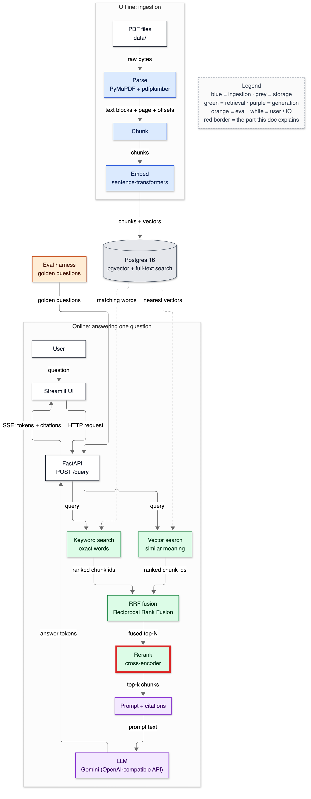
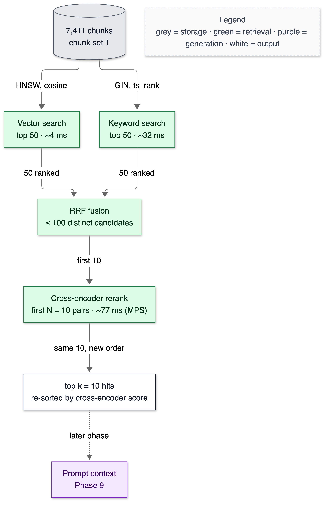
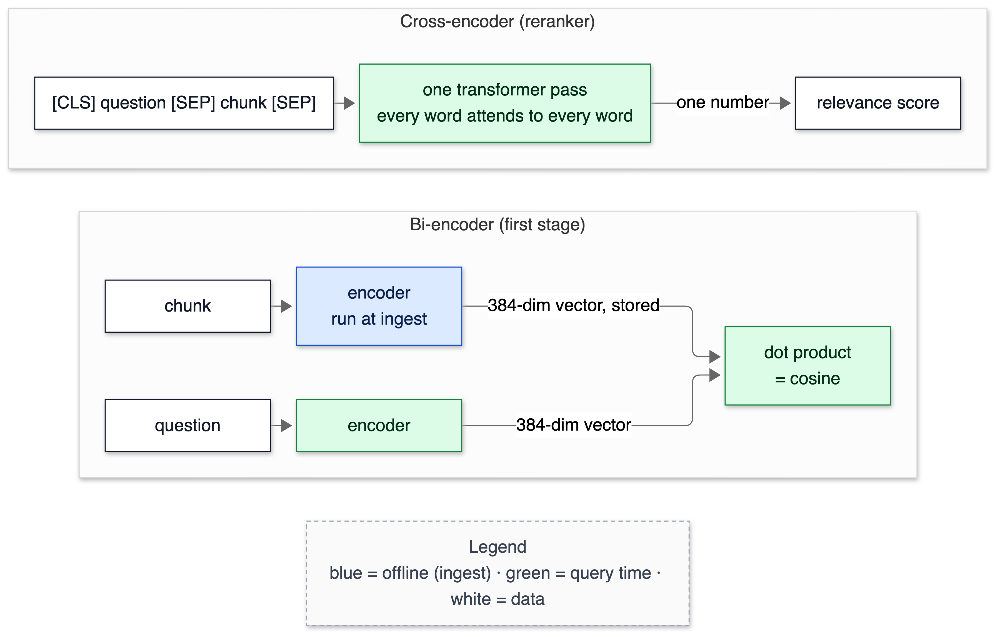

# 12 — Reranking

**Status:** written in Phase 8 (2026-10-02). The default is the cross-encoder `ms-marco-MiniLM-L6-v2` over the first N = 10 fused candidates, switchable with `RERANK_ENABLED` and `RERANK_N`. This doc owns these terms: bi-encoder, cross-encoder, reranker, retrieve-then-rerank funnel, recall ceiling, rerank depth N, ColBERT / late interaction, LLM-as-reranker, hard negative (in depth), oracle filter.

> **Prerequisites:** [07-embeddings.md](07-embeddings.md) (bi-encoders) and [11-hybrid-rrf.md](11-hybrid-rrf.md) (the fused list being reranked). All numbers come from `make bench-rerank` and its flags, and from `tests/test_rerank.py`, run on 2026-10-02 on the M1 (MPS unless stated).

---

## 1. In one paragraph

The first stage (vector + keyword search, fused) is built to be fast over 7,411 chunks. It compares precomputed vectors and index entries, and never reads a chunk together with the question. A **reranker** is a slower, more careful second reader. It takes the first stage's top N candidates and reads each one *together with* the question through a full transformer, a **cross-encoder**, which outputs a relevance score. Then it re-sorts. Here, MiniLM reranking of the top 10 costs 77 ms. It moves the right chunk to rank 1 for 41 of 50 exact-figure queries instead of 23. On FinanceBench it moves the evidence into the top 5 for 5 questions instead of 4. The bigger finding is what the reranker *can't* fix. For most FinanceBench misses, the candidates come from the wrong company or year. Restricting search to the right filing doubles top-10 hits (0.286 → 0.607), and no reranker setting came close to that.

## 2. Why it exists

Phase 7 ended with a ranking problem. Hybrid search finds exact figures, but RRF couldn't tell which list to trust. The right "16,434" chunk sat at rank 2 behind vector junk in 27 of 50 queries, and vector's good hits were pushed down by keyword noise. A component that reads the text can settle those ties. A cross-encoder is the standard way, and on exact figures it works: hit@1 goes from 0.46 to 0.82.

## 3. Where it sits



<details><summary>Same diagram as text (for terminal viewing)</summary>

```text
 OFFLINE
 ┌───────────┐  ┌───────┐  ┌───────┐  ┌───────┐   ┌─────────────────────────────┐
 │ PDF files │─▶│ Parse │─▶│ Chunk │─▶│ Embed │──▶│ Postgres 16                 │
 └───────────┘  └───────┘  └───────┘  └───────┘   │ pgvector + full-text search │
                                                  └──────────────┬──────────────┘
 ONLINE                                                          │ searched by
 ┌───────────┐  ┌─────────┐     query     ┌──────────────────────▼──────────────┐
 │ Streamlit │─▶│ FastAPI │──────────────▶│ Vector search  +  Keyword search    │
 └─────▲─────┘  └──┬───▲──┘               └──────────────────────┬──────────────┘
       │    SSE    │   │ answer tokens                           │ two ranked lists
       └───────────┘   │                                         ▼
               ┌───────┴──────┐  ┌────────────────────┐  ╔════════╗  ┌────────────┐
               │ LLM (Gemini) │◀─│ Prompt + citations │◀─║ Rerank ║◀─│ RRF fusion │
               └──────────────┘  └────────────────────┘  ╚════════╝  └────────────┘

 Double-line box (╔═╗) = this doc.
```
</details>

## 4. The flow



<details><summary>Same diagram as text (for terminal viewing)</summary>

```text
                        ┌──────────────────────┐
                        │ 7,411 chunks         │
                        │ chunk set 1          │
                        └────┬────────────┬────┘
                HNSW, cosine │            │ GIN, ts_rank
                             ▼            ▼
              ┌──────────────────┐  ┌──────────────────┐
              │ Vector search    │  │ Keyword search   │
              │ top 50 · ~4 ms   │  │ top 50 · ~32 ms  │
              └────────┬─────────┘  └─────────┬────────┘
                       │ 50 ranked            │ 50 ranked
                       ▼                      ▼
                    ┌────────────────────────────┐
                    │ RRF fusion                 │
                    │ ≤ 100 distinct candidates  │
                    └─────────────┬──────────────┘
                                  │ first 10
                                  ▼
                    ┌────────────────────────────┐
                    │ Cross-encoder rerank       │
                    │ N = 10 pairs · ~77 ms (MPS)│
                    └─────────────┬──────────────┘
                                  │ same 10, new order
                                  ▼
                    ┌────────────────────────────┐
                    │ top k = 10 hits, re-sorted │
                    │ by cross-encoder score     │
                    └─────────────┬──────────────┘
                                  ┆ later phase
                                  ▼
                    ┌────────────────────────────┐
                    │ Prompt context (Phase 9)   │
                    └────────────────────────────┘
 Legend (colours appear in the image): grey = storage · green = retrieval ·
 purple = generation · white = output
```
</details>

1. **The first stage narrows 7,411 chunks to at most 100 candidates** in about 50 ms (two depth-50 lists, fused by RRF).
2. **The reranker reads the first N = 10** as `(question, chunk)` pairs, one transformer pass each, batched on the GPU.
3. **It sorts by its own score.** With N = k = 10, reranking changes the *order* of the top 10, not which chunks are in it. Order is what matters downstream, because Phase 9 puts the best few chunks first in the prompt. A larger N would also let it change membership, but measured, that hurt (§6).
4. **Page, character span and section survive unchanged.** Only `score` (now the cross-encoder's logit) and `rank` change.

## 5. The code — `app/retrieve/rerank.py`

```python
        self.model = CrossEncoder(model, revision=revision, cache_folder=str(cache_dir), device=device,
                                  max_length=max_length)
```

The model is pinned by Hugging Face commit (`233902d2…`) like the embedder and stored in `data/models`. `max_length=512` is the model's limit for question + chunk tokens; longer pairs are cut from the end. Measured on the bench inputs: the longest pair was 298 tokens, because chunks are at most 256 tokens. Nothing was truncated.

```python
def rerank(scorer, query: str, hits: list[Hit]) -> list[Hit]:
    scores = scorer.score(query, [h.text for h in hits])
    order = sorted(range(len(hits)), key=lambda i: -scores[i])
    return [replace(hits[i], score=scores[i], rank=pos + 1) for pos, i in enumerate(order)]
```

Python's sort is **stable**, so chunks with equal scores keep their first-stage order (`test_rerank_ties_keep_first_stage_order`). `scorer` is anything with `.score(query, texts)`, which lets the tests use a fake one.

```python
@dataclass
class RerankingRetriever:
    base: object
    scorer: object
    n: int = 20

    def search(self, conn, query, k=10, filters=None):
        candidates = self.base.search(conn, query, k=max(self.n, k), filters=filters)
        return rerank(self.scorer, query, candidates)[:k]
```

It wraps any retriever, whether vector, keyword or hybrid. `max(self.n, k)` guarantees a caller asking for 15 hits gets 15 even if N is 10. Filters pass through to the first stage, because the reranker can only reorder what it's given.

```python
def retriever_from_settings(chunk_set_id: int, embedder=None):
    s = get_settings()
    base = get_retriever(s.retrieval_mode, chunk_set_id, embedder=embedder)
    if not s.rerank_enabled:
        return base
    return RerankingRetriever(base, get_reranker(), n=s.rerank_n)
```

This is the one place the app turns settings into a retriever: `RETRIEVAL_MODE`, `RERANK_ENABLED` and `RERANK_N`.

## 6. Data in / data out

### What the reranker changes, question by question (MiniLM, top 20 of hybrid; shell)

```text
question (abridged)                         evidence rank: fused → reranked   reranked #1
Verizon derivative instruments …                         3 → 1                the evidence ✔
Boeing production rate changes FY2023                    3 → 1                the evidence ✔
PepsiCo capital expenditure FY2021                      14 → 7                CORNING_2022 p37 'Capital Expenditures …'   ✗ wrong company
What drove revenue change as of FY22 for AMD             9 → 7                AMD_2021 p46 'Computing and Graphics …'    ✗ wrong year
Boeing materially important legal battles FY2022        16 → 13               BOEING_2021 p213 'SECTION 302 … certify'   ✗ boilerplate
Corning 3-year average operating margin                  6 → 15               CORNING_2022 p24 'Diluted earnings per share …'
```

The pattern behind most misses: the cross-encoder judges whether a passage is *about* the question's topic, such as capital expenditures. It barely checks *whose* capital expenditures, or *which year's*. MS MARCO, its training data, is web search, where every page is a different entity. In this corpus every topic exists ten times: five companies × two years. Those are **hard negatives**, chosen on purpose in Phase 1, and they beat the reranker. The larger bge-reranker-base made the same kind of mistake in a smoke test: for "What was AMD's net revenue in 2021?" it scored "Corning net sales were $14.1 billion in 2021" at 0.96 out of 1.

### The bench (`make bench-rerank`)

First stage is hybrid RRF k = 60, depth 50, computed once per query. Each reranker re-sorts the first N. Latency is reranker time only. The query sets are the same as in [11](11-hybrid-rrf.md): FB = 28 FinanceBench questions (hit = a chunk on an evidence page), fig = 50 rare exact figures.

```text
ranking                          FB@1   FB@5  FB@10  fig@1  fig@5  p50 ms  p95 ms
no rerank (hybrid)              0.036  0.143  0.286  0.460  1.000       —       —
minilm N=10                     0.107  0.179  0.286  0.820  1.000    76.5    91.4
minilm N=20                     0.107  0.179  0.286  0.800  1.000   136.0   158.5
minilm N=50                     0.071  0.179  0.214  0.720  0.980   267.2   363.4
minilm N=100                    0.071  0.214  0.250  0.720  0.980   285.3   666.8
bge-base N=10                   0.036  0.143  0.286  0.880  0.980   434.7   519.7
bge-base N=20                   0.036  0.107  0.286  0.860  0.920   882.0  1022.1
bge-base N=50                   0.000  0.179  0.250  0.800  0.900  2302.4  4095.9
bge-base N=100                  0.000  0.179  0.250  0.800  0.900  5306.9  9646.4

recall ceiling — share of queries whose evidence is anywhere in the first-stage top N:
  N=10   FinanceBench 0.286   figures 1.000
  N=20   FinanceBench 0.393   figures 1.000
  N=50   FinanceBench 0.500   figures 1.000
  N=100  FinanceBench 0.714   figures 1.000
```

Three more runs of the same script answer three questions.

**Does a pure-vector first stage do better?** (`--first vector --models minilm`)

```text
ranking                          FB@1   FB@5  FB@10  fig@1  fig@5  p50 ms
no rerank (vector)              0.071  0.286  0.357  0.000  0.000       —
minilm N=10                     0.107  0.286  0.357  0.000  0.000    76.2
minilm N=20                     0.107  0.250  0.393  0.000  0.020   135.9
minilm N=50                     0.071  0.214  0.286  0.020  0.040   320.9
minilm N=100                    0.071  0.214  0.357  0.020  0.040   714.8
ceiling N=10/20/50/100: FinanceBench 0.357/0.429/0.607/0.857 · figures 0/0.02/0.06/0.06
```

**What if the search is restricted to the right filing?** (`--oracle-filter --models minilm --ns 10,20,50`: FinanceBench questions filtered to the evidence document's company and year, an upper bound for "the user picked the filing")

```text
ranking                          FB@1   FB@5  FB@10  p50 ms
no rerank (hybrid)              0.143  0.357  0.607       —
minilm N=10                     0.179  0.464  0.607    77.1
minilm N=20                     0.214  0.393  0.571   143.5
minilm N=50                     0.143  0.321  0.500   286.3
ceiling N=10/20/50: 0.607 / 0.750 / 0.929
```

**CPU instead of the GPU?** (`--device cpu --models minilm`): quality is identical. p50 is 152.6 / 316.6 / 621.5 / 765.4 ms at N = 10 / 20 / 50 / 100, about 2× the MPS times.

**Read honestly:**

- **On exact figures, reranking works.** Hit@1 rises from 0.46 to 0.82 at N = 10: the cross-encoder reads "16,434" in the AMD table and settles RRF's tie.
- **On FinanceBench it helps the top of the list a little.** Hit@1 goes 1 → 3 questions and hit@5 4 → 5. Hit@10 can't change at N = 10, since it's the same 10 chunks. These are 1–2 question changes on 28.
- **Bigger N made things worse, not better.** The recall ceiling grows from 0.286 to 0.714 between N = 10 and 100, so the evidence *is* there to find. Yet reranked hit@10 *falls* to 0.25. More candidates means more wrong-company and wrong-year passages on the same topic, and the reranker prefers them. The vector-first run shows the same thing: 86% of questions have evidence in the top 100, but at most 39% reach the top 10 after reranking. Recall isn't the bottleneck; the reranker's judgement on this corpus is.
- **The bigger reranker didn't help.** bge-reranker-base (278 M parameters vs MiniLM's 22 M, 1.1 GB vs 91 MB) was 6× slower (435 vs 77 ms at N = 10) and no better on FinanceBench. It was better on figures hit@1 (0.88 vs 0.82, 3 queries) but worse on figures hit@5 (0.98 vs 1.00).
- **The fix with the biggest effect isn't a reranker.** Filtering to the right filing doubles top-10 hits (0.286 → 0.607), and with that filter MiniLM at N = 10 adds 3 questions at top 5 (0.357 → 0.464). The system already supports company and year filters (Phase 5). Phase 10 exposes them in the API and Phase 15 in the UI. Deriving them automatically from the question ("PepsiCo … FY2021") is a Phase 12 ablation candidate, measured on the golden set.
- **Latency.** MiniLM at N = 10 adds 77 ms p50 on MPS (153 ms on CPU) to the 49 ms first stage. The N = 100 MPS time (285 ms) is close to N = 50 because exact-figure queries have only about 51 fused candidates (keyword returns 1–2 hits), so "N = 100" is really about 51 for 50 of the 78 queries.

**The decisions:** reranking on; MiniLM; N = 10. N = 10 was never meaningfully worse than larger N on any of the four runs, and it costs half the latency of N = 20. The Phase 12 ablation retests N and on/off on the golden set.

## 7. Decisions & alternatives

<!-- card:start id=24 -->
#### Decision: top-k at each stage: 50 + 50 → ≤ 100 fused → rerank 10 → return 10  (rejected: one stage at k = 10; deep rerank of 50–100)

**One-line defence.** Each stage narrows the candidates for the next, more expensive one. Depth 50 lets RRF find agreement below rank 10. The reranker reads only 10 because, measured, reading more let wrong-filing passages in and cost 2–4× the latency.

**What problem is this even solving?** Cheap methods can look at everything but judge poorly; expensive methods judge well but can only look at a few. Over-retrieving then narrowing gets some of both, provided each stage's k is right.

**The options, compared.**

| Option | How it works (1 line) | Strengths | Weaknesses | When it's the right call |
|---|---|---|---|---|
| One stage, k = 10 | Return the first retriever's top 10 | Simplest, fastest (3.6 ms) | No fusion, no rereading; fig hit@1 0.00 (vector) | Prototype; latency budget under 10 ms |
| ✅ 50 + 50 → fuse → rerank 10 → 10 | Over-retrieve for fusion, rerank a short list | fig hit@1 0.82; FB@5 0.179; +77 ms | Reranker can't change top-10 membership | Default here, measured |
| Rerank 50–100 → 10 | Let the reranker pick from a deep pool | Recall ceiling 0.50–0.71 | Measured *worse* (FB@10 0.214–0.250) and 3.5–4× slower | A reranker that handles hard negatives |
| Three stages (… → LLM reranks 5) | An LLM orders the final few | Best judgement on entity and year | Seconds and money per query | High-value, low-QPS queries |

**What would actually change if we swapped it.** Each k is a setting (`RETRIEVAL_DEPTH`, `RERANK_N`, the API's k), and nothing else changes. A three-stage design adds an LLM call to retrieval (Phase 9's client).

**The decision rule.** Make the first stage's depth large enough that the evidence is *in* the pool (measure the recall ceiling). Make the reranker's N as large as its *judgement* stays good and latency allows. Those are two different curves; measure both.

**Where our choice breaks.** When the evidence sits at fused rank 11–20, N = 10 can't recover it. That covers 3 of 28 FinanceBench questions here (ceiling 0.286 → 0.393). A better reranker would make a larger N worth it.

**The number.** Recall ceiling at N = 10 / 20 / 50 / 100: 0.286 / 0.393 / 0.500 / 0.714. MiniLM reranked hit@10 over the same: 0.286 / 0.286 / 0.214 / 0.250. Latency p50 77 / 136 / 267 / 285 ms.

**Interview script (3 sentences).** "Every stage over-retrieves for the next: 50 per retriever so fusion can see agreement, then a cross-encoder rereads the top 10. I measured two curves, recall in the pool and reranker accuracy. The evidence for 71% of questions was in the top 100, but the reranker got worse as N grew, because more candidates meant more same-topic, wrong-company passages. So N = 10 is the knee, chosen from data, not habit."

**Follow-ups they will ask:**
- Q: Why not rerank everything? → A: Cost is one transformer pass per pair: 7,411 pairs at the measured ~7.7 ms per pair would take about 57 s per query. And here, quality dropped with N anyway.
- Q: Why is depth 50 but N only 10? → A: Different jobs. Depth feeds RRF's agreement signal, which is nearly free (fusion is microseconds). N feeds a model that costs ~7 ms per pair and was misled by deeper candidates.
- Q: What decides the final k? → A: The prompt's token budget and how many chunks the generator can use, which Phase 9 measures.
- Q (the hard one): Your recall ceiling is 0.71 but you return 0.29. Isn't that a failure? → A: Yes, and it's the most useful number in the phase. It says the remaining loss is judgement, mostly wrong company or year, not recall. With the right filing as a filter, hit@10 doubles to 0.607.

**The trap.** "Retrieve 100, rerank 100" because more is better. Here it measurably wasn't.
<!-- card:end -->

<!-- card:start id=25 -->
#### Decision: a small cross-encoder reranker, ms-marco-MiniLM-L6-v2  (rejected: no rerank, bge-reranker-base, ColBERT late interaction, LLM-as-reranker)

**One-line defence.** It settles the exact-figure ties RRF can't (hit@1 0.46 → 0.82) for 77 ms. The 12× larger bge-reranker-base was 6× slower and no better on FinanceBench.

**What problem is this even solving?** The first stage never reads question and chunk together. A bi-encoder compresses each into one vector separately, so subtle relevance (this table contains *that* figure) is lost.

**The options, compared.**

| Option | How it works (1 line) | Strengths | Weaknesses | When it's the right call |
|---|---|---|---|---|
| No rerank | Use the fused order | 0 ms; no model | fig hit@1 0.46; FB@1 0.036 | Latency-critical; a first stage that's already good |
| Bi-encoder only (re-score with cosine) | Re-sort by vector similarity | Precomputed, fast | That's the first stage; nothing new | Never as a "reranker" |
| ✅ Cross-encoder MiniLM-L6 (22 M) | Question + chunk through 6 layers → score | 77 ms / 10 pairs; fig hit@1 0.82 | Trained on web search: weak on entity and year (wrong-company #1s) | Default here |
| Cross-encoder bge-reranker-base (278 M) | Same, bigger, multilingual | fig hit@1 0.88 | 435 ms / 10 pairs; FB no better; scored Corning 0.96 for an AMD question | If a golden set shows a gain worth 6× |
| ColBERT (late interaction) | Per-token vectors; MaxSim between every question and chunk token | Near cross-encoder quality; chunk side precomputable | Index much larger: a vector per token (chunks here are ~200 tokens) before compression; new infra | Large corpora that need rerank-like quality cheaply |
| LLM-as-reranker | Prompt an LLM to order or score candidates | Best at "whose figure, which year" | Seconds and $ per query; non-deterministic; needs caching | Few, valuable queries; as a final stage |

**What would actually change if we swapped it.** Another cross-encoder: two settings (`RERANK_MODEL`, `RERANK_MODEL_REVISION`) plus a download. ColBERT: a token-level index (pgvector can't do MaxSim natively) and a new ingest step. LLM reranking: a prompt, the Phase 9 client, a cache and a cost line in Phase 13.

**The decision rule.** Start with the smallest cross-encoder and measure. Go bigger only if the golden set shows the gain. If failures are about *entities* (company, year) rather than topical relevance, fix them with filters or an entity-aware stage before buying a bigger reranker.

**Where our choice breaks.** On hard negatives: same topic, different filing. MiniLM ranked Corning's capex paragraph first for a PepsiCo capex question.

**The number.** N = 10, MPS: MiniLM 76.5 ms p50, FB@5 0.179, fig@1 0.82; bge-base 434.7 ms, FB@5 0.143, fig@1 0.88. Models: 91 MB vs 1.1 GB.

**Interview script (3 sentences).** "A cross-encoder reads the question and chunk together, so it can see that a table contains the exact figure asked about. That fixed the ties fusion couldn't, raising exact-figure top-1 from 46% to 82% for 77 ms. I compared a model 12× larger: 6× slower and no better on FinanceBench, because both fail the same way, ranking the right topic from the wrong company. That failure is fixed by filtering, not by a bigger reranker."

**Follow-ups they will ask:**
- Q: Why is a cross-encoder more accurate than a bi-encoder? → A: Attention runs across both texts, so each question token can attend to each chunk token. A bi-encoder must compress the chunk into one vector before it has seen the question.
- Q: Why can't you precompute cross-encoder scores? → A: The score depends on the question, which is unknown at ingest. Bi-encoder chunk vectors don't depend on it.
- Q: How does ColBERT sit between the two? → A: It keeps one vector per token on both sides and scores by summing each question token's best match (MaxSim). Chunk token vectors can be precomputed, and the interaction happens late, at query time.
- Q (the hard one): Would an LLM reranker fix the wrong-company problem? → A: Probably, since it reads "PepsiCo" and "FY2021" as constraints. But it costs seconds and money per query, and the oracle-filter run shows a free fix for most of the same failures. I'd measure filters first.

**The trap.** Assuming the biggest reranker on a leaderboard (trained on web search) transfers to financial filings full of near-duplicates.
<!-- card:end -->

<!-- card:start id=26 -->
#### Decision: rerank depth N = 10  (rejected: 20, 50, 100)

**One-line defence.** On all four runs, N = 10 was never meaningfully worse than larger N. Larger N was slower and, beyond 20, measurably worse: more same-topic distractors.

**What problem is this even solving?** Choosing where the reranker stops reading. Every extra candidate is ~7 ms more, and as it turned out here, one more chance to promote a wrong-filing passage.

**The options, compared.**

| Option | How it works (1 line) | Strengths | Weaknesses | When it's the right call |
|---|---|---|---|---|
| ✅ N = 10 | Rerank the fused top 10 | 77 ms; best or tied on 3 of 4 runs | Can't change top-10 membership | Default here |
| N = 20 | Rerank top 20 | Can recover evidence at 11–20 (ceiling +0.107) | 136 ms; recovered none on hybrid; oracle FB@5 0.393 vs 0.464 | A stronger reranker |
| N = 50 | Rerank top 50 | Ceiling 0.500 | 267 ms; FB@10 0.214 (lower than no rerank) | Rarely |
| N = 100 | Rerank everything fused | Ceiling 0.714 | 285 ms p50, 667 ms p95; FB@10 0.250 | Offline / batch |

**What would actually change if we swapped it.** One setting (`RERANK_N`). Latency scales roughly linearly: on CPU, 153 → 317 → 622 ms for 10 → 20 → 50.

**The decision rule.** Plot quality vs N next to the recall ceiling. Pick the smallest N past which quality stops rising. If quality *falls* with N, the reranker is the bottleneck, and no N fixes it.

**Where our choice breaks.** Evidence at fused ranks 11–20 (3 of 28 FinanceBench questions) can't be promoted. With a reranker that handles hard negatives, N = 20 would likely win.

**The number.** Hybrid first stage, MiniLM, N = 10 / 20 / 50 / 100: FB@10 0.286 / 0.286 / 0.214 / 0.250; fig@1 0.82 / 0.80 / 0.72 / 0.72; p50 76.5 / 136.0 / 267.2 / 285.3 ms. Oracle filter, N = 10 / 20 / 50: FB@5 0.464 / 0.393 / 0.321.

**Interview script (3 sentences).** "I swept N from 10 to 100 alongside the recall ceiling. The pool kept improving, from 29% to 71% of questions with evidence present, but reranked quality fell, because the extra candidates were same-topic passages from the wrong filing and the reranker liked them. So the smallest N is the best one here, and it's also the fastest at 77 ms."

**Follow-ups they will ask:**
- Q: Isn't N = 10 with k = 10 pointless? → A: It changes order, not membership. Order decides what goes first in the prompt: hit@1 went from 1 to 3 questions on FinanceBench and from 23 to 41 queries on figures.
- Q: Why does latency not double from N = 50 to 100? → A: For 50 of 78 queries (the figure queries), the fused list has only about 51 candidates, so N = 100 doesn't add pairs.
- Q: Would you set N per query? → A: Possibly: a short N for exact-token queries and a longer one for open questions. But that's routing again; I'd want golden-set evidence first.
- Q (the hard one): Your sample is 28 questions. Isn't "N = 10 is best" noise? → A: Partly. The FinanceBench differences are 1–3 questions. But the direction repeats on four runs and on the 50 figure queries, and N = 10 is also the cheapest, so the decision doesn't rest on noise. The golden set re-tests it.

**The trap.** Assuming quality rises monotonically with N.
<!-- card:end -->

## 7a. Prerequisite concepts

**Bi-encoder.** Two texts are encoded *separately* into vectors and compared by a dot product. Chunk vectors are computed once at ingest, which makes it fast, but the chunk is summarised before the model knows the question.



<details><summary>Same diagram as text (for terminal viewing)</summary>

```text
 Bi-encoder (first stage)
 ┌──────────┐   ┌─────────────────┐  384-dim vector, stored
 │ chunk    │──▶│ encoder         │───────────────────────┐
 └──────────┘   │ run at ingest   │                       ▼
                └─────────────────┘              ┌───────────────┐
 ┌──────────┐   ┌─────────────────┐  384-dim     │ dot product   │
 │ question │──▶│ encoder         │─────────────▶│ = cosine      │
 └──────────┘   └─────────────────┘  vector      └───────────────┘

 Cross-encoder (reranker)
 ┌──────────────────────────────────┐   ┌──────────────────────────┐ one  ┌──────────────┐
 │ [CLS] question [SEP] chunk [SEP] │──▶│ one transformer pass:    │─────▶│ relevance    │
 └──────────────────────────────────┘   │ every word attends to    │number│ score        │
                                        │ every word               │      └──────────────┘
                                        └──────────────────────────┘
 Legend (colours appear in the image): blue = offline (ingest) · green = query time ·
 white = data
```
</details>

**Cross-encoder.** The question and chunk are joined into one input, `[CLS] question [SEP] chunk [SEP]`, and run through the transformer together. The output is one relevance number. MiniLM's are unbounded logits (here from −11.3 to +10.8); bge-reranker's go through a sigmoid to 0–1. Every question token can attend to every chunk token, so it's accurate. It's also slow: nothing can be precomputed, and each pair is a full model pass.

**Retrieve-then-rerank funnel.** A cheap stage over everything, then an expensive stage over a few. The cost is (cheap × all) + (expensive × N).

**Recall ceiling.** The share of queries whose evidence is anywhere in the reranker's input. No reranker can beat it; the gap between the ceiling and the reranked result is the reranker's own loss.

**ColBERT / late interaction.** One vector per token. The score sums, for each question token, its maximum similarity to any chunk token (MaxSim). It's precomputable on the chunk side, but the index is far larger.

**LLM-as-reranker.** Ask a generative model to score or order candidates ("pointwise", "listwise"). It's strong on constraints like company and year, but slow, costly and non-deterministic.

**Hard negative.** A passage that looks relevant (same topic, similar words) but isn't the answer: the other company's capex, the other year's revenue. This corpus is built from them (five companies × two years).

**Oracle filter.** A filter set from the ground truth, here the evidence document. It's an *upper bound* for what a perfect filter (or a user choosing the filing) would give, not a realistic number by itself.

## 7b. What if we used something else?

| If we had used… | Immediate effect | Effect on quality metrics | Effect on latency/cost | Effect on complexity | Would I defend it? |
|---|---|---|---|---|---|
| No reranker | Fused order returned | fig hit@1 0.46 (vs 0.82); FB@1 0.036 (vs 0.107) | −77 ms | Simpler; no model | Only under a tight latency budget |
| bge-reranker-base | 12× larger model | fig@1 +0.06, FB@5 −0.036, fig@5 −0.02 | 435 ms (6×); 1.1 GB | Same code | Not on this evidence |
| N = 50 | Deeper pool | FB@10 0.214 (worse than no rerank) | 267 ms | Same | No |
| Rerank on CPU | No GPU needed | Identical | 153 ms (2×) | Same | Yes, for a CPU-only deploy |
| Vector-only first stage + rerank | No keyword | FB@10 0.357–0.393; figures 0.00–0.04 | ~45 ms less | Simpler | No: exact figures vanish |
| Company/year filter (oracle) | Wrong filings excluded | FB@10 0.286 → 0.607 | Faster (fewer rows) | Needs a filter source | Yes: Phase 10 API, Phase 12 auto-filter ablation |
| LLM reranker | Model reads constraints | Not measured | Seconds + $ per query | Client + cache | Not before filters |

## 8. Failure modes

| What you see | Cause | Fix |
|---|---|---|
| Reranked #1 is the right topic from the wrong company or year | Cross-encoder trained on web search ignores entity constraints | Company/year filters; entity-aware stage (Phase 12) |
| Quality drops as N grows | More hard negatives in the pool | Keep N small (10); better reranker |
| Boilerplate (SOX certification) ranked #1 for a legal question | Legal vocabulary overlap | Exclude exhibit/certification sections; filters |
| Rerank latency spikes on first query | Model load and MPS warm-up | Load at startup and warm up (the bench does) |
| Bench on CPU never finishes when run in the background | I'm not sure. Same command finished in ~2 min in the foreground; suspected macOS background throttling (T-033) | Run benchmarks in the foreground |
| Scores look different between models | MiniLM outputs logits, bge-reranker a sigmoid | Compare ranks, not raw scores |
| Pair silently truncated | Question + chunk > 512 tokens | Chunks ≤ 256 tokens (max pair measured 298) |

## 9. Try it yourself

```bash
make bench-rerank
```

Expected: the main table in §6. Hit rates are identical; latencies vary ±10%. It takes about 10 minutes, most of it bge-base. The first run downloads 1.2 GB.

```bash
.venv/bin/python scripts/bench_rerank.py --models minilm --ns 10,20,50 --oracle-filter
```

Expected: the oracle-filter table, FB@10 0.607 without reranking.

```bash
.venv/bin/python -m pytest tests/test_rerank.py -q
```

Expected: `8 passed`.

## 10. Numbers

| What | Value | Command |
|---|---|---|
| Exact figures hit@1: hybrid / + MiniLM N=10 / + bge-base N=10 | 0.46 / 0.82 / 0.88 | `make bench-rerank` |
| FinanceBench hit@5: hybrid / + MiniLM N=10 | 0.143 / 0.179 | same |
| Recall ceiling, FinanceBench, N = 10 / 20 / 50 / 100 | 0.286 / 0.393 / 0.500 / 0.714 | same |
| MiniLM rerank p50 / p95, N=10, MPS | 76.5 / 91.4 ms | same |
| MiniLM rerank p50, N=10, CPU | 152.6 ms | `--device cpu` |
| bge-reranker-base p50, N=10, MPS | 434.7 ms | `make bench-rerank` |
| FinanceBench hit@10 with the oracle filing filter (no rerank) | 0.607 (vs 0.286) | `--oracle-filter` |
| Longest (question + chunk) pair | 298 tokens (limit 512) | shell, §5 |
| Model sizes: MiniLM / bge-base | 91 MB / 1.1 GB | Hugging Face file listing |

## 11. Interview talking points

- "A cross-encoder rereads the top 10 with the question. It fixed the exact-figure ties RRF couldn't, raising top-1 from 46% to 82% for 77 ms."
- "Bigger N and a 12× bigger reranker both failed to help. The evidence was in the pool for 71% of questions, but rerankers trained on web search pick the right topic from the wrong company."
- "Filtering to the right filing doubled top-10 hits. The biggest lever was metadata, not a model."
- Expect: "Bi-encoder vs cross-encoder?", "How did you choose N?", "Why not an LLM reranker?"

## 12. Check yourself

1. Why can bi-encoder chunk vectors be precomputed but cross-encoder scores can't?
2. At N = 100 the recall ceiling was 0.714, yet reranked hit@10 was 0.250. What does that gap tell you, and what would you try?
3. With N = 10 and k = 10, can reranking change hit@10? Then why do it?

<details><summary>Answers</summary>

1. A bi-encoder's chunk vector depends only on the chunk; the question is encoded separately. A cross-encoder's score is a function of the (question, chunk) pair, and the question is unknown at ingest.
2. Recall isn't the problem; the reranker's judgement is. The per-question examples show wrong-company and wrong-year passages winning. Try company/year filters (the oracle filter doubles hit@10), or an entity-aware or LLM final stage, before a bigger cross-encoder.
3. No: the same 10 chunks come back. But the order changes. Hit@1 and hit@5 improve (exact figures top-1 0.46 → 0.82), and order decides what goes first into the prompt.

</details>

## 13. New terms added to the glossary

bi-encoder, cross-encoder, reranker, retrieve-then-rerank funnel, recall ceiling, rerank depth N, ColBERT, late interaction, MaxSim, LLM-as-reranker, hard negative (in depth), oracle filter, logit — see [21-glossary.md](21-glossary.md).
