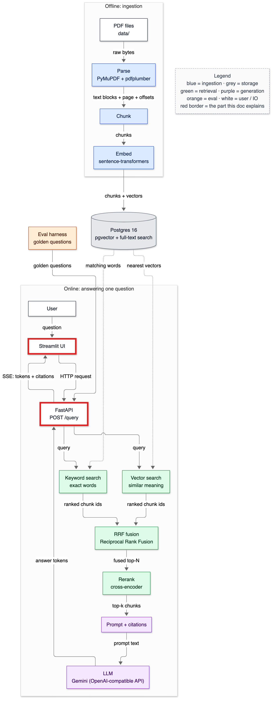
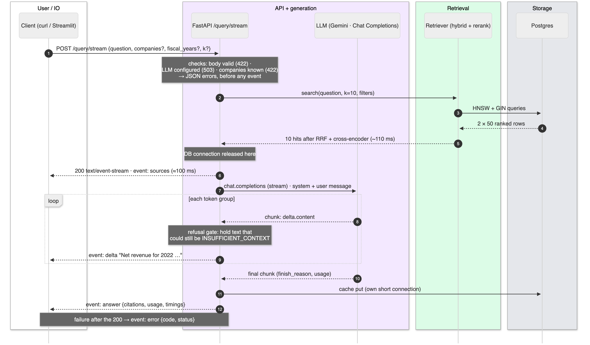

# 14 — API and streaming

**Status:** written in Phase 10 (2026-10-02). FastAPI app with `GET /health`, `GET /documents`, `POST /query` (JSON) and `POST /query/stream` (Server-Sent Events). Every example below is real output from `make serve`: with `LLM_PROVIDER=fake`, except one stream marked as Gemini. Since the provider switch the same day, the LLM is Gemini (`gemini-3.5-flash`) through its OpenAI-compatible endpoint; §6 adds one real streamed answer. Latency percentiles with the real model are *not yet measured* (Phase 13). This doc owns these terms: ASGI, endpoint, path operation, request/response model, OpenAPI, SSE, event stream, time to first token, backpressure, thread pool, event loop, request id, error envelope.

> **Prerequisites:** [13-prompting-and-citations.md](13-prompting-and-citations.md) (`answer_question`, `stream_answer`). Numbers come from `make bench-api` against `make serve`, and from `tests/test_api.py`, run on 2026-10-02.

---

## 1. In one paragraph

The API is the front door: a program (the Streamlit UI, curl, another service) sends a question as JSON over HTTP and gets the answer back with its citations. There are two ways to get it. `POST /query` waits until the whole answer is ready and returns one JSON object. `POST /query/stream` returns a **stream** of small events instead: first the sources, then the answer text in pieces as the model writes it, then the final answer with citations. A reader starts reading after ~100 ms instead of waiting for the whole answer. Everything around that is about failing well: wrong input gets a 422 with a reason, a missing or broke LLM account gets a 503 that says which, and a failure mid-stream arrives as an `error` event. Every response carries a request id you can find in the server log.

## 2. Why it exists

Phases 1–9 built a library. Phase 15's UI and Phase 11's eval harness need it over a network boundary, with a fixed contract. Streaming matters because LLM answers take seconds, and a user staring at a blank box for three seconds thinks the system is broken. Showing sources at 100 ms and text as it arrives makes the same total time feel fast.

## 3. Where it sits



<details><summary>Same diagram as text (for terminal viewing)</summary>

```text
 OFFLINE
 ┌───────────┐  ┌───────┐  ┌───────┐  ┌───────┐   ┌─────────────────────────────┐
 │ PDF files │─▶│ Parse │─▶│ Chunk │─▶│ Embed │──▶│ Postgres 16                 │
 └───────────┘  └───────┘  └───────┘  └───────┘   │ pgvector + full-text search │
                                                  └──────────────┬──────────────┘
 ONLINE                                                          │ searched by
 ╔═══════════╗  ╔═════════╗     query     ┌──────────────────────▼──────────────┐
 ║ Streamlit ║─▶║ FastAPI ║──────────────▶│ Vector search  +  Keyword search    │
 ╚═════▲═════╝  ╚══╤═══▲══╝               └──────────────────────┬──────────────┘
       │    SSE    │   │ answer tokens                           │ two ranked lists
       └───────────┘   │                                         ▼
               ┌───────┴──────┐  ┌────────────────────┐  ┌────────┐  ┌────────────┐
               │ LLM (Gemini) │◀─│ Prompt + citations │◀─│ Rerank │◀─│ RRF fusion │
               └──────────────┘  └────────────────────┘  └────────┘  └────────────┘

 Double-line boxes (╔═╗) = this doc (the API) and its client (the UI, Phase 15).
```
</details>

## 4. The flow



<details><summary>Same diagram as text (for terminal viewing)</summary>

```text
 Client              FastAPI /query/stream        Retriever        LLM (Gemini)     Postgres
   │ 1 POST {question…}    │                          │                 │              │
   │──────────────────────▶│ checks: body valid (422) · LLM configured (503) ·        │
   │                       │ companies known (422) → JSON errors, before any event   │
   │                       │ 2 search(q, k=10, f)     │                 │              │
   │                       │─────────────────────────▶│ 3 HNSW + GIN    │              │
   │                       │                          │────────────────────────────────▶│
   │                       │                          │◀─ 4 2 × 50 rows ───────────────│
   │                       │◀─ 5 10 hits (~110 ms) ───│                 │              │
   │                       │ (DB connection released) │                 │              │
   │◀─ 6 200 event: sources│ (≈100 ms)                │                 │              │
   │                       │ 7 chat.completions stream│                 │              │
   │                       │─────────────────────────────────────────▶│              │
   │                       │◀─ 8 chunk: delta.content ────────────────│ (loop)       │
   │                       │  refusal gate: hold text that could still be the token  │
   │◀─ 9 event: delta "…"  │                          │                 │              │
   │                       │◀─ 10 final chunk (finish, usage) ────────│              │
   │                       │ 11 cache put (own short connection) ────────────────────▶│
   │◀─ 12 event: answer {citations, usage, timings}   │                 │              │
   │  failure after the 200 → event: error {code, status}              │              │
 Legend (colours appear in the image): white = user/IO · purple = API + generation ·
 green = retrieval · grey = storage
```
</details>

1. **Validate before streaming.** Pydantic checks the body. The LLM dependency checks configuration, and the company list is checked against the database. Any failure here is an ordinary JSON error with a status code. Once the `200 OK` and the first event are sent, the status can't change any more, so everything that *can* be checked early *is*.
2. **Retrieve**, then **release the database connection** before the LLM starts. A stream can last seconds, and holding a Postgres connection for it would cap concurrent streams at the connection limit.
3. **Send `sources` immediately**, so the UI can show which filings and pages are being used while the model is still thinking.
4. **Relay deltas**, through the refusal gate (§5).
5. **Send `answer`** with the checked citations, usage and timings. If anything fails after step 3, send an `error` event instead.

## 5. The code — `app/api/`

### Contracts: `schemas.py`

```python
class QueryRequest(BaseModel):
    question: str = Field(min_length=1, max_length=MAX_QUESTION_CHARS, ...)
    companies: list[str] | None = Field(default=None, max_length=10, ...)
    fiscal_years: list[int] | None = Field(default=None, max_length=10, ...)
    k: int | None = Field(default=None, ge=1, le=20, ...)
```

The request model *is* the input validation. Empty or whitespace-only questions, questions over 2,000 characters, k outside 1–20, implausible years, and more than 10 filter values are rejected with a 422 before any code runs. The same models generate the OpenAPI schema served at `/docs` (`test_openapi_documents_the_contract`). Company names are additionally checked against the database (`unknown_company`). Filter values are always sent to Postgres as bound parameters (`d.company = ANY(%(companies)s)`), never formatted into SQL. A company string like `AMD'; DROP TABLE chunks; --` is just an unknown company (tested); Phase 14 tests this properly.

### Sync endpoints on purpose: `main.py`

```python
@app.post("/query", response_model=QueryResponse, ...)
def query(req: QueryRequest, request: Request, conn=Depends(db), llm=Depends(llm_client)):
```

`def`, not `async def`. Everything inside blocks: psycopg's sync driver, torch on MPS, the OpenAI SDK's sync client. FastAPI runs `def` endpoints, and iterates sync generators, in a thread pool, so the event loop stays free to accept connections. Writing `async def` around blocking calls would be the classic mistake: it runs on the event loop thread and freezes every other request for the duration. The models aren't thread-safe on MPS, so `Embedder` and `Reranker` take a lock around each forward pass. Measured below: with 4 concurrent clients, throughput still doubles, because the database half of each request runs in parallel.

### Startup: `lifespan`

```python
    embedder = get_embedder()
    embedder.embed_query("warm up")                 # first MPS call compiles kernels
    if s.rerank_enabled:
        get_reranker().score("warm up", ["warm up"])
```

Model loading and the first GPU call are paid once at startup, not by the first user. The chunk set is resolved from the chunking settings and must exist (`make ingest`). A reader never creates one.

### Errors

```python
def classify(exc: Exception) -> tuple[int, str, str]:
    if isinstance(exc, MissingAPIKey):
        return 503, "llm_not_configured", str(exc)
    ...
    if isinstance(exc, openai.RateLimitError):
        if quota_exhausted(exc):
            return 503, "llm_quota_exhausted", "The LLM account has no credits left; add credits, then retry."
        return 503, "llm_rate_limited", "The LLM provider is rate-limiting requests; retry later."
```

Every error has the same envelope: `{request_id, error, message}`. `error` is a stable machine code, and `message` is safe to show: it never echoes SQL, stack traces or the key. The quota branch exists because of T-038. OpenAI reports an empty balance as HTTP 429, the same status as a rate limit. My first version told the user to "retry later", which would never work. Known failure types get dedicated handlers. The catch-all `Exception` handler runs in Starlette's outermost middleware, which re-raises after responding, so expected failures registered there would be logged as crashes (found by `test_missing_api_key_is_a_503_before_any_stream`).

### The stream

```python
    def sse(event: str, data, id: str | None = None) -> bytes:
        # JSON for every payload (a delta is a JSON string), so newlines inside text are escaped.
        return format_sse_event(event=event, id=id, data_str=json.dumps(data, ensure_ascii=False))
```

SSE frames are `event:` and `data:` lines ending in a blank line. Model text can contain blank lines, and raw text could then end a frame early or even forge an `event: answer` line. Every payload is JSON-encoded, so a newline travels as `\n` inside a string. `test_newlines_in_deltas_cannot_break_sse_framing` streams exactly that attack and checks the frames survive.

```python
class RefusalGate:
    def feed(self, delta: str) -> str:
        ...
        probe = self.held.strip().strip("`'\"").upper()
        if REFUSAL_TOKEN.startswith(probe) or probe.rstrip(".") == REFUSAL_TOKEN:
            return ""                                   # still possibly a refusal: keep holding
```

The model refuses by writing `INSUFFICIENT_CONTEXT`, and it arrives in pieces (`INSUFF`, `ICIENT_`, …). The gate holds text while it could still become the token. A real answer is released as soon as it diverges, which is usually the first piece. "IN" is held, then "INTEREST rose" goes out. A refusal never leaks as raw text; it arrives once, cleanly, in the `answer` event.

## 6. Data in / data out — real requests

```bash
curl -s -i http://127.0.0.1:8000/health
```

```text
HTTP/1.1 200 OK
content-type: application/json
x-request-id: fb5786fa491c4aa6

{"status":"ok","database":true,"chunk_set_id":1,"retrieval_mode":"hybrid","rerank_enabled":true,"llm_provider":"fake","llm_model":"fake-extractive-1","llm_ready":true,"detail":null}
```

`llm_model` reports the *active* client. A first version showed `gpt-6-luna` while the fake was answering, which would have been misleading.

```bash
curl -s http://127.0.0.1:8000/documents
```

```text
[{"doc_key": "AMD_2021_10K", "company": "AMD", "ticker": "AMD", "fiscal_year": 2021, "form": "10-K", "pages": 118, "chunks": 506},
 {"doc_key": "AMD_2022_10K", "company": "AMD", "ticker": "AMD", "fiscal_year": 2022, "form": "10-K", "pages": 121, "chunks": 536},
 … 8 more]
```

```bash
curl -s -X POST http://127.0.0.1:8000/query -H 'content-type: application/json' \
  -d '{"question":"What was AMD'"'"'s net revenue in 2022?","companies":["AMD"],"fiscal_years":[2022]}'
```

```text
{
  "request_id": "e1035fd705df4d05",
  "answer": "Net revenue for 2022 was $23.6 billion, an increase of 44% compared to 2021 net revenue of $16.4 billion. [1]",
  "refused": false,
  "refusal_reason": null,
  "citations": [{"n": 1, "label": "AMD 2022 10-K, p. 43", "chunk_id": 5736, "doc_key": "AMD_2022_10K",
                 "page_number": 43, "page_end": 43, "char_start": 185634, "char_end": 186892}],
  "sources": [{"n": 1, "chunk_id": 5736, "doc_key": "AMD_2022_10K", "company": "AMD", "fiscal_year": 2022,
               "page_number": 43, "page_end": 43, "section": ["PART II", "ITEM 7. MANAGEMENT’S DISCUSSION …"],
               "score": 5.20389461517334, "text": "Our 2022 financial results reflect the strength of our diver…"},
              … 9 more (text shortened here)],
  "invalid_markers": [],
  "uncited_sentences": [],
  "usage": {"provider": "fake", "model": "fake-extractive-1", "input_tokens": 2644, "output_tokens": 36, "cached": true},
  "timings_ms": {"retrieve": 198.1, "generate": 10.5}
}
```

`"cached": true` because the same request had been answered before (by `make ask`), and the 10.5 ms "generate" is two short cache-lookup connections. `score` is the cross-encoder's logit for the source (reranking on).

```bash
curl -s -i -N -X POST http://127.0.0.1:8000/query/stream -H 'content-type: application/json' \
  -d '{"question":"What was AMD'"'"'s net revenue in 2022?","companies":["AMD"],"fiscal_years":[2022]}'
```

```text
HTTP/1.1 200 OK
cache-control: no-cache
x-accel-buffering: no
content-type: text/event-stream; charset=utf-8
x-request-id: 1141168bf2354279
Transfer-Encoding: chunked

event: sources
data: [{"n": 1, "chunk_id": 5736, "doc_key": "AMD_2022_10K", "company": "AMD", "fiscal_year": 2022, "page_number": 43, … }, … ]
id: 1141168bf2354279

event: delta
data: "Net revenue for 2022 was $23.6 billion, an increase of 44% compared to 2021 net revenue of $16.4 billion. [1]"

event: answer
data: {"request_id": "1141168bf2354279", "answer": "Net revenue for 2022 was $23.6 billion, …", "refused": false, "citations": [{"n": 1, "label": "AMD 2022 10-K, p. 43", … }], … }
```

There's one `delta` here because the answer came from the cache in one piece. The fake model streams word by word when uncached, and the real client streams token groups. A real, uncached Gemini stream (Corning question below) arrived as two deltas. `cache-control: no-cache` and `x-accel-buffering: no` stop proxies such as nginx from buffering the stream into one late lump.

**The same stream with the real model** (`make serve`, Gemini, an uncached question, 2026-10-02):

```text
curl -s -N -X POST http://127.0.0.1:8000/query/stream -H 'content-type: application/json' \
  -d '{"question":"What share of Corning's total segment net sales did Display Technologies represent in 2022?",
       "companies":["Corning"],"fiscal_years":[2022]}'

event: sources
data: [{"n": 1, "chunk_id": 4418, "doc_key": "CORNING_2022_10K", "company": "Corning", "fiscal_year": 2022, "page_number": 4, … }, … ]
id: 1fe41c44ee864042

event: delta
data: "In 2022, the Display Technologies segment represented 22% of Corning's total segment net sales"

event: delta
data: " [1]."

event: answer
data: {"request_id": "1fe41c44ee864042", "answer": "In 2022, the Display Technologies segment represented 22% of Corning's total segment net sales [1].", "refused": false, … "citations": [{"n": 1, "label": "Corning 2022 10-K, p. 4", … }], … }

[curl total 7.03 s, first byte 0.014 s]
```

curl's "first byte" (14 ms) is the response *headers*: Starlette sends the status line and headers before the generator yields its first event, so this number is not the time to the `sources` event, which wasn't timed separately in this request (`make bench-api` measures it). The whole answer took 7.0 s, most of it Gemini. The answer is correct: the golden label G009 quotes "The Display Technologies segment represented 22%…".

**A refusal** (`{"question":"What is the capital of France?"}`): `sources`, then straight to `answer` with `"refused": true`. The raw `INSUFFICIENT_CONTEXT` never appears as a delta.

**Errors** (all real):

```text
{"question":"   "}                          → 422 {"error":"invalid_request","message":"question: Value error, question must contain non-whitespace characters"}
{"question":"revenue","companies":["Apple"]} → 422 {"error":"unknown_company","message":"unknown companies ['Apple']; see GET /documents"}
{"question":"revenue","k":500}             → 422 {"error":"invalid_request","message":"k: Input should be less than or equal to 20"}
no key, LLM_PROVIDER=openai                → 503 {"error":"llm_not_configured", …}  (tested; JSON, not a stream)
key present, account without credits       → 503 {"error":"llm_quota_exhausted","message":"The LLM account has no credits left; add credits, then retry."}
```

### Latency through HTTP (`make bench-api`, server running `LLM_PROVIDER=fake`)

```text
server: provider fake · model fake-extractive-1 · mode hybrid · rerank True · 28 questions

POST /query sequential     p50  143.0 ms  p95  182.9  (server-side retrieve p50 112.9 ms; cached LLM 0/28)
POST /query/stream         first `sources` p50  100.3 ms · first `delta` p50  111.9 ms (26/28 streamed text; the rest refused)
POST /query ×4 concurrent    p50  280.6 ms  p95  313.8  · throughput 13.7 req/s (sequential: 6.8 req/s)
```

**Read honestly:**

- **HTTP and API overhead** is about 30 ms per request (143 total − 113 retrieval). That covers JSON, the per-request database connection (6.4 ms p50, measured separately), the cache read and write on their own connections, and the fake model (~1 ms). The real model will add seconds on top; *not yet measured*.
- **Time to first event is about 100 ms.** The UI can show sources before any LLM call returns, which is the point of streaming.
- **Concurrency:** 4 clients get 2.0× the throughput (13.7 vs 6.8 req/s), not 4×, at about 2× the latency each. The lock serialises the embedder and reranker forward passes, while Postgres queries overlap. On this laptop the model passes are the shared bottleneck.

## 7. Decisions & alternatives

<!-- card:start id=30 -->
#### Decision: FastAPI  (rejected: Flask, Django, Express)

**One-line defence.** Typed request/response models give validation, error messages and OpenAPI docs from one definition. It has native SSE (`fastapi.sse`) and a thread pool for blocking code, all in the same language as the ML stack.

**What problem is this even solving?** Exposing the Python pipeline over HTTP with a checked contract, streaming support and good errors, with minimal glue.

**The options, compared.**

| Option | How it works (1 line) | Strengths | Weaknesses | When it's the right call |
|---|---|---|---|---|
| ✅ FastAPI | ASGI; pydantic models per endpoint; sync endpoints in a thread pool | Validation + OpenAPI from types; SSE; async-capable | Easy to misuse `async def` with blocking code; lifespan/middleware subtleties (T-039) | Python ML services, typed APIs |
| Flask | WSGI; decorators; extensions for everything | Simple, mature | No built-in validation or OpenAPI; streaming ties up a WSGI worker per client | Small sync apps, existing Flask shops |
| Django (+ DRF) | Full framework: ORM, admin, auth | Batteries included | ORM and admin unused here (plain SQL by design); heavier | Apps with users, admin, CRUD |
| Express (Node) | JS HTTP framework | Huge ecosystem; streaming natural | A second language; the pipeline would sit behind another HTTP hop | JS front-end teams; BFF layers |

**What would actually change if we swapped it.** Flask: hand-written validation, a separate OpenAPI tool, gunicorn workers with threads for streaming. Django: an app scaffold around the same `answer_question`. Express: the Python pipeline becomes its own service, plus a second contract.

**The decision rule.** Stay in the language of your core logic. Pick the framework whose request model is your validation. Use a full framework only when you need what it bundles.

**Where our choice breaks.** CPU-heavy work inside the API process: the model locks cap throughput at roughly one forward pass at a time. Scaling means a separate model service (card #32), whatever the framework.

**The number.** 4 endpoints; 23 API tests; 8 malformed or unknown-filter requests rejected with stable codes (tested); OpenAPI includes the `text/event-stream` response.

**Interview script (3 sentences).** "FastAPI, because the pydantic request model is the input validation, the error messages and the OpenAPI docs in one place, and it has native SSE. The pipeline is blocking (psycopg, torch, the OpenAI SDK), so endpoints are plain `def` and run in FastAPI's thread pool, with a lock around model passes. Flask would have meant hand-rolling validation and docs; Django brings an ORM and admin I don't use."

**Follow-ups they will ask:**
- Q: Why not `async def` everywhere? → A: The code inside blocks. In `async def` it would run on the event loop and stall every other request. Async only pays off if the whole call chain is async.
- Q: How are errors kept consistent? → A: One envelope, `{request_id, error, message}`, with stable codes, from typed handlers. Validation errors are reshaped to the same envelope.
- Q: How do you document the stream? → A: The route declares a `text/event-stream` 200 response, and doc 14 lists the event types. OpenAPI can't fully describe an event sequence, so the doc and tests do.
- Q (the hard one): Is FastAPI a performance choice here? → A: No. At 143 ms per request with 113 ms in retrieval, the framework is noise. It's a correctness and contract choice.

**The trap.** "FastAPI is fast, so the API is fast."
<!-- card:end -->

<!-- card:start id=31 -->
#### Decision: Server-Sent Events for streaming  (rejected: WebSockets, polling; kept alongside: plain JSON)

**One-line defence.** The answer flows one way, server to client. SSE is just a long HTTP response with `text/event-stream`, so it works through proxies and curl, browsers reconnect it natively, and it shows sources at ~100 ms. Plain JSON stays for scripts and the eval harness.

**What problem is this even solving?** Making a multi-second generation feel responsive, and showing progress (sources first, then text).

**The options, compared.**

| Option | How it works (1 line) | Strengths | Weaknesses | When it's the right call |
|---|---|---|---|---|
| ✅ SSE (`POST /query/stream`) | One HTTP response; `event:`/`data:` frames | Simple; HTTP semantics, headers, auth; curl-able; first event ~100 ms | One-way; status fixed after the first byte (errors in-band); browser `EventSource` is GET-only (use fetch streaming for POST) | Token streaming |
| ✅ JSON (`POST /query`) | Wait, return one object | Simplest client; easy to cache and test | Blank screen until done | Scripts, evals, batch |
| WebSockets | Upgraded, bidirectional, persistent socket | Two-way, low overhead per message | Custom protocol; proxies and load balancers need config; no HTTP status per message | Chat with interruptions, collaborative editing |
| Polling | Start a job; GET its progress repeatedly | Works anywhere | Latency = poll interval; wasted requests; job storage | Long jobs (minutes), unreliable clients |

**What would actually change if we swapped it.** WebSockets: a connection handler, a message protocol (start/cancel/delta/answer), and reconnection logic in the UI. Polling: a job table and a progress endpoint.

**The decision rule.** One-way server push of a single response: SSE. Two-way conversational control (cancel mid-stream, typing indicators): WebSockets. Minutes-long work: a job plus polling.

**Where our choice breaks.** Cancellation: the client can only disconnect. Generation then continues server-side until the next write fails (Starlette detects the disconnect), so tokens may be billed for an abandoned answer. Measure that once the account has credits.

**The number.** First `sources` event p50 100.3 ms, first `delta` 111.9 ms (fake model); JSON `/query` p50 143.0 ms. Real-model time to first token: *not yet measured*.

**Interview script (3 sentences).** "The answer only flows server to client, so I used SSE, a plain streamed HTTP response, rather than WebSockets. The sources event arrives at about 100 ms, before the model has produced anything. Everything that can fail is checked before the 200 goes out, and failures after it arrive as an `error` event, because the status line can't change mid-stream."

**Follow-ups they will ask:**
- Q: How do you send an error once streaming started? → A: In-band: an `error` event with a code and the HTTP-equivalent status. That's why validation, configuration and filter checks run first.
- Q: What can break SSE in production? → A: Buffering proxies (hence `X-Accel-Buffering: no`), idle timeouts on long gaps (send `: ping` comments), and HTTP/1.1 per-domain connection limits in browsers (HTTP/2 fixes that).
- Q: Why JSON-encode every delta? → A: A raw newline in model text would end the frame. With JSON it's `\n` inside a string. A test streams a forged `event: answer` line and the framing holds.
- Q (the hard one): What's backpressure here? → A: If the client reads slowly, the server's writes block. In a sync generator that holds a thread-pool thread. Many slow clients exhaust the pool. The fix is limits and timeouts per stream, or async end to end.

**The trap.** Choosing WebSockets for one-way streaming, or forgetting that errors after the first byte can't use status codes.
<!-- card:end -->

<!-- card:start id=32 -->
#### Decision: sync endpoints in FastAPI's thread pool, one lock per model; model inference in-process  (rejected for now: async end to end, a separate model server)

**One-line defence.** All the work is blocking (psycopg, torch, the OpenAI SDK), so plain `def` endpoints in the thread pool keep the event loop free with no async rewrite. A lock per model keeps MPS safe. Measured: 4 clients get 2× throughput, so the database half parallelises and the model half queues.

**What problem is this even solving?** Where CPU- and GPU-bound work (embedding the question, reranking) runs, so one request doesn't freeze the others.

**The options, compared.**

| Option | How it works (1 line) | Strengths | Weaknesses | When it's the right call |
|---|---|---|---|---|
| ✅ Sync `def` + thread pool + model locks | FastAPI runs each request in a worker thread | No rewrite; simple; safe on MPS | Throughput capped by the serialised model passes (13.7 req/s at 4 clients here) | One machine, modest traffic |
| `async def` + async drivers | psycopg async, AsyncOpenAI, models via `run_in_executor` | Thousands of idle streams cheaply | Models still need a thread or process; an all-async chain or it's worse | Many concurrent slow streams |
| Separate model server | Embed and rerank behind their own service with dynamic batching | GPU used efficiently; scales independently | A network hop (~ms); another deployment | Real traffic, a shared GPU |
| Multiple worker processes | `uvicorn --workers N` | True parallelism | Each process loads both models again (bge-small 133 MB + MiniLM 91 MB of weights); GPU contention | CPU-only, more RAM than traffic |

**What would actually change if we swapped it.** Async: `psycopg.AsyncConnection`, `AsyncOpenAI`, async generators for SSE, executors around torch. Model server: `Embedder`/`Reranker` become HTTP clients with the same interface, so retrieval code is unchanged.

**The decision rule.** Match the concurrency model to the code you actually have: blocking calls go in threads. Go async when idle connections dominate. Split out models when GPU efficiency or independent scaling matters.

**Where our choice breaks.** Long streams with real LLM latency: each open stream holds a pool thread (default 40 in AnyIO). At about 40 concurrent streams the pool is exhausted and new requests queue. That's the point to move streaming to async.

**The number.** Sequential 6.8 req/s, 4 concurrent 13.7 req/s (p50 143 → 281 ms); DB connect 6.4 ms p50 per request, released before the LLM streams.

**Interview script (3 sentences).** "The pipeline is blocking end to end, so endpoints are sync and FastAPI runs them in its thread pool. The event loop never blocks, and the models get a lock because MPS isn't thread-safe. With 4 clients throughput doubled, not quadrupled, because the model passes serialise. That's the measured signal for when to split inference into its own batched service."

**Follow-ups they will ask:**
- Q: What happens if you write `async def` with these calls inside? → A: They run on the event loop thread, so every other request, including health checks, stalls for the duration.
- Q: Why release the DB connection before streaming? → A: A stream lasts seconds. Holding a connection would cap concurrent streams at Postgres's connection limit, and the cache writes use their own short connections.
- Q: Why no connection pool? → A: Connect costs 6.4 ms p50 locally, about 4% of the request. A pool (psycopg_pool) is the next step under load or with a remote database.
- Q (the hard one): Where does the GPU work go at scale? → A: A model server with dynamic batching. Cross-encoder throughput rises with batch size, so batching across requests uses the GPU far better than per-request locks.

**The trap.** "async makes it faster."
<!-- card:end -->

**Plain Python orchestration vs LangChain / LlamaIndex** is Decision Card #34, in [02-architecture-overview.md](02-architecture-overview.md). This API is what that choice looks like in practice: four short modules in `app/generate/` (540 lines), a fake for each dependency, and 53 generation and API tests that run without the network.

## 7a. Prerequisite concepts

**ASGI.** The Python interface between async web servers (uvicorn) and apps (FastAPI). WSGI is its older, synchronous predecessor.

**Event loop vs thread pool.** The event loop runs async code on one thread and switches tasks whenever one waits. A thread pool runs blocking code in parallel threads. A blocking call on the event loop freezes everything.

**Request/response model.** A pydantic class describing a body. FastAPI validates against it and documents it in **OpenAPI**, the machine-readable API description served at `/openapi.json` and rendered at `/docs`.

**SSE.** `content-type: text/event-stream`. Frames are lines like `event: delta` and `data: "…"`, ending with a blank line. Comment lines start with `:` (keepalives).

**Time to first token (TTFT).** Delay until the first piece of the answer. It's what users perceive as speed.

**Backpressure.** When a consumer is slower than the producer, the producer must wait (a blocked write) or buffer. Unbounded buffering means unbounded memory.

**Request id.** A short random id per request, returned in `x-request-id` and logged, so a user-reported error can be found in the logs. A client-supplied id is echoed.

## 7b. What if we used something else?

| If we had used… | Immediate effect | Effect on quality metrics | Effect on latency/cost | Effect on complexity | Would I defend it? |
|---|---|---|---|---|---|
| `async def` with blocking calls | Event loop blocked per request | Same | Concurrency collapses to 1 | Same code | No |
| Errors raised after the stream started | Client sees 200 then a broken stream | Same | Same | Less | No: in-band `error` event |
| Raw text in `data:` | Newlines break frames | Corrupted answers | Same | Less | No (tested attack) |
| Streaming the raw refusal token | User sees "INSUFFICIENT_CONTEXT" | Same | Same | Less | No |
| Holding the DB connection during the stream | Connection count = open streams | Same | Pool exhaustion under load | Less | No |
| No company check | Unknown names silently filter to nothing | Confusing empty answers | Same | Less | No: 422 with the list hint |
| Connection pool | −~6 ms per request | Same | Small gain locally | New dependency | Yes, under load |

## 8. Failure modes

| What you see | Cause | Fix |
|---|---|---|
| `TypeError: 'EventSourceResponse' object is not iterable` | Route declared `response_class=EventSourceResponse` (FastAPI then expects a `yield` endpoint) but returned a response (T-039) | Declare `StreamingResponse`; return `EventSourceResponse(...)` |
| 503 handled correctly but logged as "Exception in ASGI application" | Expected failures in the catch-all `Exception` handler, which re-raises | Dedicated handlers for known types (fixed) |
| `503 llm_quota_exhausted` | Provider account has no credits (seen with OpenAI, T-038) | Add credits; not fixed by retrying |
| `503 llm_unavailable` after a long wait | Provider 5xx (e.g. Gemini 503 "high demand") outlasted 6 retries with backoff | Retry later, or set `LLM_MODEL` to a less loaded model |
| `503 llm_rate_limited` | Real rate limit | Retry with backoff (the SDK already retries twice) |
| Stream arrives all at once at the end | A proxy buffering the response | `X-Accel-Buffering: no`, `Cache-Control: no-cache` (sent) |
| Stream drops after a long silence | Idle timeout on a proxy or load balancer | Periodic `: ping` comments (not needed locally; not built) |
| First request after start is slow | Model load and first GPU call | Lifespan warm-up (done) |
| `RuntimeError: no chunk set …` at startup | Settings point at a chunking config that was never ingested | `make ingest` with those settings |

## 9. Try it yourself

```bash
LLM_PROVIDER=fake make serve
```

Then in another terminal:

```bash
curl -s -N -X POST http://127.0.0.1:8000/query/stream -H 'content-type: application/json' -d '{"question":"What was AMD'"'"'s net revenue in 2022?","companies":["AMD"],"fiscal_years":[2022]}'
```

Expected: `event: sources`, one or more `event: delta`, then `event: answer`. Interactive docs are at <http://127.0.0.1:8000/docs>.

```bash
make bench-api
```

Expected: the table in §6 (±20 ms).

```bash
.venv/bin/python -m pytest tests/test_api.py -q
```

Expected: `23 passed`.

## 10. Numbers

| What | Value | Command |
|---|---|---|
| `POST /query` p50 / p95, sequential (fake LLM) | 143.0 / 182.9 ms | `make bench-api` |
| Of which server-side retrieval p50 | 112.9 ms | same |
| First `sources` event / first `delta`, p50 | 100.3 / 111.9 ms | same |
| Throughput, 1 vs 4 concurrent clients | 6.8 vs 13.7 req/s | same |
| Postgres connect + `SELECT 1` + close, p50 | 6.35 ms | shell |
| Real-model TTFT and total latency | *not yet measured* (account has no credits) | `make bench-api` with `LLM_PROVIDER=openai` |

## 11. Interview talking points

- "Two endpoints for the same answer: JSON for scripts and evals, SSE for people. Sources arrive at 100 ms, before the model starts."
- "Everything checkable is checked before the 200. After it, errors are in-band events, because the status can't change mid-stream."
- "Sync endpoints in the thread pool because the stack is blocking; a lock per model; 4 clients give 2× throughput, the measured case for a separate model server later."
- "A 429 can mean 'slow down' or 'no money'. My first version said 'retry later' to an empty account."
- Expect: "SSE vs WebSockets?", "async vs sync?", "how do you handle errors mid-stream?"

## 12. Check yourself

1. Why does `/query/stream` validate the company list *before* returning the response, instead of inside the stream?
2. A model delta contains "\n\nevent: answer\ndata: {…}". Why doesn't it break the stream?
3. With 4 concurrent clients, throughput rose 2×, not 4×. What's the shared bottleneck, and how would you remove it?

<details><summary>Answers</summary>

1. Once the 200 status line and first event are sent, the status can't change. A bad filter would then have to be an in-band error. Checking first gives a normal 422 JSON error that any HTTP client understands.
2. Every payload is JSON-encoded, so the newlines travel as `\n` escapes inside one `data:` line, and no blank line ends the frame early. `test_newlines_in_deltas_cannot_break_sse_framing` checks exactly this.
3. The embedder and reranker forward passes, serialised by their locks on one GPU. Remove it with a separate model server using dynamic batching (more pairs per pass), or more GPUs/processes, while Postgres keeps running queries in parallel.

</details>

## 13. New terms added to the glossary

ASGI, WSGI, endpoint / path operation, request/response model, OpenAPI, SSE, event stream, time to first token, backpressure, event loop, thread pool, request id, error envelope, lifespan — see [21-glossary.md](21-glossary.md).
