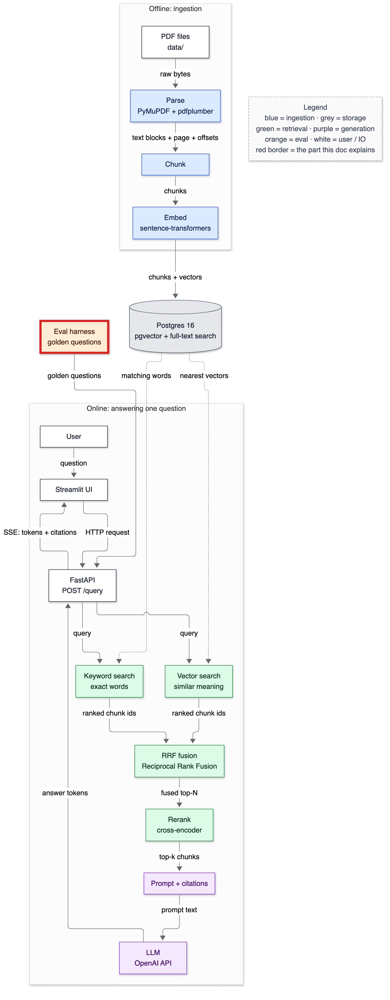
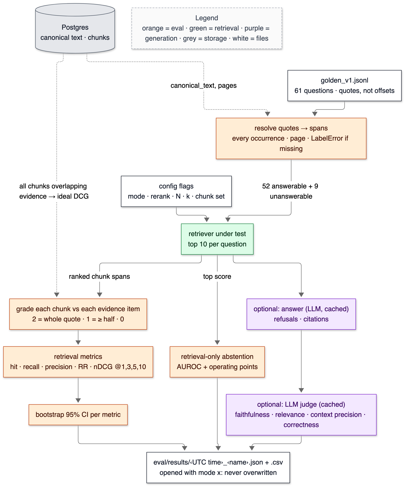

# 15 — The eval harness

**Status:** written in Phase 11 (2026-10-02). Golden set `eval/golden/golden_v1.jsonl` (61 questions, sha256 `733f8fe4…`). Retrieval and abstention metrics are measured. Answer metrics (LLM judge: faithfulness, answer relevance, context precision, correctness) are implemented and tested, but **not yet measured**: the OpenAI account has no credits (T-038). This doc owns these terms: golden set, evidence span, graded relevance, hit@k, recall@k, precision@k, MRR, DCG / nDCG, bootstrap confidence interval, sign test, LLM-as-judge, faithfulness, answer relevance, context precision, abstention precision / recall, false-refusal rate, AUROC, operating point, label leakage, label incompleteness.

> **Prerequisites:** [12-reranking.md](12-reranking.md) (the retriever under test) and [13-prompting-and-citations.md](13-prompting-and-citations.md) (refusals and citations). Numbers come from `make eval NAME=…` (files in `eval/results/`) and `tests/test_eval.py`, run on 2026-10-02.

---

## 1. In one paragraph

Every earlier phase made claims like "hybrid finds exact figures" or "the reranker helps the top". The eval harness turns those claims into numbers on one fixed set of 61 questions. The questions were written from the filings themselves. Each answerable question carries the *exact sentence or table row* that answers it (an **evidence span**). For each question, the harness runs the retriever and asks, for every returned chunk, how much of the evidence it contains, then summarises: did we find it (hit), find all of it (recall), find it high up (MRR, nDCG), and how much of the context is noise (precision)? Nine questions have no answer in the corpus, so the harness also measures whether the system knows when to say "I don't know". Every number comes with a 95% interval, because with 52 answerable questions one question moves a score by 1.9 points. Every run writes a new timestamped file that is never overwritten. The default system finds the evidence in its top 5 for **77% of questions [65–88%]**. It's strong on single facts (91%) and weak on multi-hop questions (33% of the needed pieces in the top 5).

## 2. Why it exists

Without a fixed, labelled set, every change is judged by a few hand-picked queries, and those are the ones the author already knows work. This harness paid for itself in its first hour:

- **It found a bug.** "What does the figure $404,381 represent in Boeing's FY2022 10-K?" returned *nothing* from keyword search. The query required the figure *and* at least one other question word, and the backlog table contains neither "Boeing" nor "figure". Fixed (T-042): hit@5 went from 0.692 to 0.731.
- **It found label gaps.** A full-text audit found 8 questions whose answer also appears in places the labels didn't list, such as PepsiCo's net income in the income statement itself. Completing them raised hit@5 to 0.769. The retriever was being under-credited.
- **It killed a plausible idea.** "Refuse when the reranker is unsure" sounds sensible. Measured, catching every unanswerable question that way would also refuse 88% of answerable ones (§6).

## 3. Where it sits



<details><summary>Same diagram as text (for terminal viewing)</summary>

```text
 OFFLINE
 ┌───────────┐  ┌───────┐  ┌───────┐  ┌───────┐   ┌─────────────────────────────┐
 │ PDF files │─▶│ Parse │─▶│ Chunk │─▶│ Embed │──▶│ Postgres 16                 │
 └───────────┘  └───────┘  └───────┘  └───────┘   │ pgvector + full-text search │
                                                  └──────────────┬──────────────┘
 ONLINE                                                          │ searched by
 ┌───────────┐  ┌─────────┐     query     ┌──────────────────────▼──────────────┐
 │ Streamlit │─▶│ FastAPI │──────────────▶│ Vector search  +  Keyword search    │
 └───────────┘  └─────────┘               └──────────────────────┬──────────────┘
                                                                 ▼
               ┌──────────────┐  ┌────────────────────┐  ┌────────┐  ┌────────────┐
               │ LLM (OpenAI) │◀─│ Prompt + citations │◀─│ Rerank │◀─│ RRF fusion │
               └──────┬───────┘  └────────────────────┘  └────────┘  └────────────┘
                      │ answers, citations, ranked chunks
               ╔══════▼══════════════════╗
               ║ Eval harness            ║  golden questions in → metrics + result files out
               ║ golden questions        ║
               ╚═════════════════════════╝
 Double-line box (╔═╗) = this doc.
```
</details>

## 4. The flow



<details><summary>Same diagram as text (for terminal viewing)</summary>

```text
 ┌──────────────────────┐   ┌───────────────────────────────────────┐   ┌───────────────┐
 │ golden_v1.jsonl      │──▶│ resolve quotes → spans (every         │◀┄┄│ Postgres:     │
 │ 61 q · quotes, not   │   │ occurrence, page; LabelError if gone) │   │ canonical     │
 │ offsets              │   └───────────────────┬───────────────────┘   │ text, chunks  │
 └──────────────────────┘                       │ 52 answerable + 9     └──────┬────────┘
   ┌───────────────────────┐                    │ unanswerable                ┆ all chunks
   │ config: mode · rerank │───────────────────▶▼                             ┆ overlapping
   │ · N · k · chunk set   │      ┌────────────────────────────┐              ┆ evidence
   └───────────────────────┘      │ retriever under test: top 10│             ┆ (ideal DCG)
                                  └──┬──────────┬──────────┬───┘              ┆
                  ranked chunk spans │ top score│          │                  ┆
                                     ▼          ▼          ▼                  ┆
          ┌────────────────────────────┐ ┌─────────────────┐ ┌──────────────────────────┐
          │ grade chunk vs evidence    │◀┤ retrieval-only  │ │ optional: answer (LLM,   │
          │ 2 whole · 1 ≥ half · 0     │┄│ abstention:     │ │ cached) → optional judge │
          └─────────────┬──────────────┘ │ AUROC + points  │ └────────────┬─────────────┘
                        ▼                └────────┬────────┘              │
          ┌────────────────────────────┐          │                       │
          │ hit · recall · precision · │          │                       │
          │ RR · nDCG @1,3,5,10        │          │                       │
          │ + bootstrap 95% CI         │          │                       │
          └─────────────┬──────────────┘          │                       │
                        ▼                         ▼                       ▼
          ┌───────────────────────────────────────────────────────────────────────┐
          │ eval/results/<UTC time>_<name>.json + .csv  (mode "x": never overwritten)│
          └───────────────────────────────────────────────────────────────────────┘
 Legend (colours appear in the image): orange = eval · green = retrieval ·
 purple = generation · grey = storage · white = files
```
</details>

1. **Load and resolve.** Every evidence quote is looked up in the stored filing text. *Every* occurrence counts: a figure printed in both MD&A and the financial statements is evidence in both places. A quote that isn't there is a `LabelError`, so labels can't silently rot when a PDF is re-parsed.
2. **Retrieve** with the configuration under test, k = 10 (as the app does).
3. **Grade** each returned chunk against each evidence item by character overlap.
4. **Score** the ranking (§6), with **ideal** rankings computed from *all* chunks in the chunk set that overlap the evidence, not only the retrieved ones.
5. **Abstention without an LLM.** The top reranker score is used to separate answerable from unanswerable questions.
6. **Optionally** generate answers and judge them (both through the response cache).
7. **Write** JSON (config, git commit, golden-file hash, summary, per-question rows) and CSV, under a new timestamped name.

## 5. The code — `eval/`

### `golden.py` — labels as quotes

```python
        for item in row["evidence"]:
            spans = []
            for alt in item:
                text, pages = doc(alt["doc"])
                starts = occurrences(text, alt["quote"])
                if not starts:
                    raise LabelError(f"{row['id']}: quote not found in {alt['doc']}: {alt['quote'][:60]!r}")
```

The label format has three layers.

- A question has **evidence items**, the facts the answer needs. A multi-hop question has two.
- Each item has **alternatives**, different passages that each state the fact (the income statement row, or the MD&A sentence).
- Each alternative may occur several times.

Why quotes rather than chunk ids, as the original spec suggested ("ground-truth chunk ids")? Chunk ids change with every chunking configuration, and Phase 12 compares six of them. A quote is configuration-independent: any chunking can be graded against it. Decision A in the plan. A test resolves every label against the database.

### `metrics/retrieval.py` — graded relevance

```python
def span_grade(chunk: ChunkRef, span) -> int:
    ...
    overlap = min(chunk.char_end, span.char_end) - max(chunk.char_start, span.char_start)
    ...
    if overlap >= length:
        return GRADE_FULL
    return GRADE_PARTIAL if overlap * 2 >= length else 0
```

Grade 2 means the chunk contains the whole quote. Grade 1 means at least half of it: the quote straddles a chunk boundary, so the chunk shows *most* of the evidence. Below half doesn't count. These grades feed nDCG; the binary metrics count grade ≥ 1.

### `metrics/abstention.py`, `metrics/stats.py`, `metrics/judge.py`

These are covered in §6 and §7a. The judge asks for JSON and *counts* parse failures; it never guesses a score. It refuses to run on the fake model (`--judge needs a real model`), because "fake-graded" numbers would be worse than none.

### `run.py` — never overwrite

```python
def open_exclusive(stem: str, suffix: str):
    for i in range(1, 1000):
        path = RESULTS / f"{stem}{'' if i == 1 else f'-{i}'}{suffix}"
        try:
            return path, path.open("x", newline="")
```

Mode `"x"` fails if the file exists, so two runs in the same second get `-2`, and history can't be lost (`test_results_are_never_overwritten`). Each file records the git commit, whether the tree was dirty, the golden file's sha256, and every config value. **Determinism, measured:** two runs of the same config produced identical per-question rows except timings (61/61; shell comparison of `baseline-v2` and `e2e-fake`).

## 6. Data in / data out

### Every metric, by hand: a toy multi-hop question

The question needs two facts: item A (doc X, chars 100–200) and item B (doc Y, chars 50–150). The retriever returns:

```text
rank  chunk            vs A   vs B   grade   relevant?
 1    X 900–1500        0      0      0       no
 2    X   0–400         2      0      2       yes  (contains all of A)
 3    Y 100–600         0      1      1       yes  (contains 50 of B's 100 chars: half)
 4    Z   0–100         0      0      0       no
best possible: one grade-2 chunk for A and one for B → ideal grades [2, 2]
```

At k = 3:

```text
hit@3        = 1                      (something relevant in the top 3)
recall@3     = 2 items covered / 2    = 1.0
precision@3  = 2 relevant / 3         = 0.667
RR           = 1 / 2                  = 0.5      (first relevant at rank 2)
DCG@3        = (2²−1)/log₂(3) + (2¹−1)/log₂(4) = 3/1.585 + 1/2 = 1.893 + 0.500 = 2.393
IDCG@3       = (2²−1)/log₂(2) + (2²−1)/log₂(3) = 3/1 + 3/1.585    = 3.000 + 1.893 = 4.893
nDCG@3       = 2.393 / 4.893          = 0.489
```

At k = 1 everything is 0. At k = 2, recall is 0.5, because only A is covered. All of these are asserted in `test_worked_example_from_the_doc`. Things to see:

- **recall and hit differ for multi-hop:** hit = 1 already at k = 2, but half the answer is still missing.
- **nDCG penalises** both the junk at rank 1 and the partial (grade 1) chunk for B.
- **precision falls** as k grows even when nothing changes at the top, because it's divided by k.

### The same arithmetic on a real question

G045, "Which had higher revenue in 2022, Boeing or Corning, and by how much?", baseline run:

```text
rank 1  CORNING_2022 p74   grade 0
rank 2  BOEING_2022  p43   grade 0
rank 3  CORNING_2022 p24   grade 2   ← the MD&A highlights table "Net sales | $ 14,189 | …"
ranks 4–10: no chunk with Boeing's revenue line            9 relevant chunks exist in the set
hit@3 = 1 · recall@3 = 1/2 = 0.5 · precision@3 = 1/3 · RR = 1/3
nDCG@3  = (3/log₂4) / (3/1 + 3/1.585 + 3/2) = 1.5 / 6.393 = 0.2346      (matches the result file)
nDCG@10 = 1.5 / (3 × Σ_{i=1..9} 1/log₂(i+1)) = 1.5 / (3 × 4.2545) = 0.1175
```

Half the answer was found (Corning) and half wasn't (Boeing). An LLM given these ten chunks can't answer, and should refuse.

### The baseline (`make eval NAME=baseline-labels-audited`: hybrid + MiniLM rerank N = 10, k = 10, chunk set 1)

```text
52 answerable questions · mean [bootstrap 95% CI]
            @1                 @3                 @5                 @10
hit        0.404 [0.27–0.54]  0.635 [0.50–0.75]  0.769 [0.65–0.88]  0.808 [0.69–0.90]
recall     0.385 [0.25–0.51]  0.596 [0.46–0.72]  0.731 [0.61–0.84]  0.760 [0.64–0.87]
precision  0.404 [0.27–0.54]  0.231 [0.18–0.28]  0.185 [0.15–0.22]  0.104 [0.08–0.12]
nDCG       0.404 [0.27–0.54]  0.456 [0.34–0.57]  0.509 [0.41–0.61]  0.523 [0.42–0.62]
MRR        0.535 [0.42–0.64]
retrieval p50 115.8 ms · whole run 11.9 s
```

By question type:

```text
type          n   hit@5   recall@5  recall@10  nDCG@10  MRR
factual      22   0.909   0.909     0.909      0.750    0.744
exact_token   8   0.875   0.875     0.875      0.601    0.619
table        13   0.615   0.615     0.692      0.282    0.267
multi_hop     9   0.556   0.333     0.389      0.247    0.336
```

**Read honestly:**

- **Single facts in prose are mostly solved.** 20 of 22 in the top 5. Both misses are the same kind: "How many employees did AMD have…" for each year. The Human Capital paragraph sits at vector rank 32, below keyword-noise and other years' paragraphs. That's the hard negative again.
- **Tables are found late, or not at all.** recall@10 is 0.69, but MRR is only 0.27. Of the 13 table questions, the evidence row is first for 1, at rank 2–5 for 7, at rank 10 for 1, and missing from the top 10 for 4 (R&D, PepsiCo revenue, Boeing backlog, Boeing tax rate). The top slot usually goes to a prose paragraph on the same topic, or to the same table in the other year's filing.
- **Multi-hop is the weakness.** 33% of the needed pieces are in the top 5. A single query for "Boeing or Corning" retrieves one company well and the other badly (G045 above). Splitting the question into one sub-query per entity is the obvious fix: not built, and a Phase 12 candidate.
- **Precision is low by design.** Most questions have 1–2 relevant chunks, so precision@10 ≤ 0.2 even for a perfect retriever. Use it to compare configurations, not as an absolute.
- **Intervals are wide.** hit@5 [0.65–0.88] means a change has to move a score by roughly 10 points before this set can tell it from noise. The paired sign test (in `stats.py`) is the right tool for comparing two runs: Phase 12 uses it.

### History of the baseline (why every run is kept)

| Run (file stem) | Change | hit@5 | recall@10 | MRR |
|---|---|---|---|---|
| `…T161508Z_baseline` | first run | 0.692 | 0.702 | 0.487 |
| `…T161649Z_baseline-kwfix` | keyword: a required figure no longer needs another word to match (T-042) | 0.731 | 0.721 | 0.498 |
| `…T161807Z_baseline-v2` | same code + abstention operating points (identical metrics) | 0.731 | 0.721 | 0.498 |
| `…T162142Z_baseline-labels-audited` | 8 questions gain alternative evidence (label audit) | 0.769 | 0.760 | 0.535 |
| `20261002T163255Z_phase11-baseline` | same, re-run on a clean commit (`dirty: false`): **the canonical Phase 11 baseline** | 0.769 | 0.760 | 0.535 |

The Phase 6 and 7 benches were re-run after the keyword fix and are unchanged, because their figure queries contain no other words.

### Abstention without an LLM (card #3)

Policy: refuse when the top reranker score is below t. Scores of the 9 unanswerable questions: −0.47, 2.00, 2.02, 2.21, 3.82, 4.10, 4.54, 7.91, 8.64. Five answerable questions score lower than even the *lowest-scoring* unanswerable one.

```text
AUROC 0.662   (0.5 = coin flip, 1.0 = perfect separation)
operating point                      threshold t   unanswerables caught   answerable refused
catch ≥ 1/3                          2.38          0.44 (4 of 9)          0.13 (7 of 52)
catch ≥ 2/3                          4.30          0.67 (6 of 9)          0.29 (15 of 52)
catch all                            8.79          1.00                   0.88 (46 of 52)
best accuracy (85.2%)                −5.25         0.00                   0.00  ← "never refuse" wins on accuracy
```

The reranker's confidence is a poor refusal signal here. Unanswerable questions about familiar topics ("Lisa Su's base salary", "Verizon's Fios video churn") retrieve confident-looking passages on the same subject. So refusal stays the *model's* job (`INSUFFICIENT_CONTEXT`), and no score threshold is set. Generation-side abstention metrics are *not yet measured*. The fake model's run (`e2e-fake`) refused nothing, because extractive matching always finds two overlapping words; it says nothing about a real model.

### External check

FinanceBench (28 questions, page-level labels, [12](12-reranking.md)): hybrid + rerank hit@10 0.286. It's much lower than the golden set's 0.808 because FinanceBench questions are long and paraphrased ("FY22", "unadjusted EBITDA") and many need calculations across statements, while golden questions use the filings' own wording. The truth for real users is probably in between, which is why both are reported.

## 7. Decisions & alternatives

<!-- card:start id=3 -->
#### Decision: refusal is the model's decision (a fixed token), with no retrieval-score threshold  (rejected: refuse below a reranker score; always answer)

**One-line defence.** I measured the score threshold: catching all 9 unanswerable questions would also refuse 88% of answerable ones (AUROC 0.66). The model, which reads the passages, is the right judge, and its refusals are made detectable with a fixed token.

**What problem is this even solving?** For a filing assistant, a confident wrong number is worse than "I can't find that". The system needs a policy for weak evidence.

**The options, compared.**

| Option | How it works (1 line) | Strengths | Weaknesses | When it's the right call |
|---|---|---|---|---|
| Always answer | No refusal path | Never wrongly silent | Confident nonsense on unanswerable questions | Never for factual QA |
| Refuse below a reranker score | Threshold the top cross-encoder score | No LLM call needed; cheap | Measured AUROC 0.66: catching 4/9 costs 7/52 answerable | When scores are well calibrated for the domain |
| ✅ Model refuses with `INSUFFICIENT_CONTEXT` | Prompt rule + exact-token detection | Reads the evidence; detectable; measurable | Depends on model compliance (not yet measured) | Default |
| Both (threshold as a pre-filter for clear cases) | Skip the LLM below a very low score | Saves calls on hopeless queries | Must not cost answerable questions | Once the model's refusal accuracy is known |

**What would actually change if we swapped it.** A threshold would be one setting and one `if` in `answer.py`. The cost is false refusals, measured above.

**The decision rule.** Measure the separation (AUROC) before using any score as a gate. Below ~0.8, let the model decide and measure *its* abstention precision and recall.

**Where our choice breaks.** If the model ignores the rule (answers anyway, or refuses in free text), abstention silently degrades. The eval measures both rates once real generation runs.

**The number.** AUROC 0.662. Operating points: 44% caught / 13% false refusals; 67% / 29%; 100% / 88%. Model abstention precision / recall: *not yet measured*.

**Interview script (3 sentences).** "I tested the intuitive policy first: refuse when the reranker isn't confident. On 9 unanswerable versus 52 answerable questions it barely separates them (AUROC 0.66), because an unanswerable question about a familiar topic still retrieves confident-looking passages. So refusal is the model's call, signalled by a fixed token the API detects, and the harness measures its precision and recall rather than trusting it."

**Follow-ups they will ask:**
- Q: Why is accuracy the wrong criterion for the threshold? → A: With 52 answerable and 9 unanswerable questions, "never refuse" scores 85% accuracy. Look at the two error rates separately.
- Q: How would you calibrate a threshold properly? → A: More unanswerable examples, including near-miss ones (right company, wrong metric), and choose t from a stated cost ratio between a false refusal and a false answer.
- Q: What makes a good unanswerable question? → A: Close to answerable ones: familiar entities, plausible metrics, wrong years. Easy ones ("Tesla deliveries") make abstention look better than it is.
- Q (the hard one): Isn't letting the model decide unmeasurable? → A: It's measured the same way: abstention recall on the 9, false refusals on the 52. It just needs the generation run.

**The trap.** Picking a threshold by maximising accuracy on an imbalanced set.
<!-- card:end -->

<!-- card:start id=35 -->
#### Decision: a self-built harness  (rejected: RAGAS, TruLens, DeepEval)

**One-line defence.** Our labels are character spans in the stored text, which no framework grades natively. Every metric is about 20 lines I derived by hand and test exactly, and the harness found a retrieval bug and 8 label gaps in its first runs.

**What problem is this even solving?** Repeatable, comparable measurement of retrieval and answers, with numbers you can defend line by line in an interview.

**The options, compared.**

| Option | How it works (1 line) | Strengths | Weaknesses | When it's the right call |
|---|---|---|---|---|
| ✅ Self-built (`eval/`) | Span-graded retrieval metrics, our judge prompts, timestamped results | Exact, transparent, tested (15 tests); fits span labels | More code (628 lines); judge prompts are ours to validate | Learning, custom labels, research-style comparisons |
| RAGAS | LLM-based metrics (faithfulness, context precision/recall) over (q, contexts, answer) | Quick start; standard metric names | Mostly LLM-judged even where labels exist; version churn; costs per metric | No labels yet; quick baselines |
| TruLens | Feedback functions + tracing dashboard | Observability of production traces | Heavier; dashboard-centric | Monitoring deployed apps |
| DeepEval | pytest-style LLM test cases and metrics | CI integration | LLM-judged; opinionated thresholds | Regression gates in CI |

**What would actually change if we swapped it.** RAGAS: convert each run to its dataset format, and lose span-graded recall and nDCG (it would judge context relevance with an LLM instead). Our result files and history format would change.

**The decision rule.** Labels you trust plus metrics that use them beat LLM-judged proxies. Use frameworks for LLM-judged parts when you have no labels, or for production monitoring.

**Where our choice breaks.** Breadth: no dashboards, no tracing UI, no ready-made metric zoo. And our judge prompts haven't yet been validated against human labels.

**The number.** 17 retrieval metric values per run, each with a bootstrap CI; run time 11.9 s for 61 questions (retrieval only); 15 harness tests; 5 result runs kept, none overwritten.

**Interview script (3 sentences).** "I built the harness because my labels are exact evidence spans, and I wanted metrics that use them: graded recall and nDCG computed against every chunk that overlaps the evidence, not an LLM's opinion of relevance. Each formula is derived by hand in the docs and asserted in tests. The proof it was worth it: its first runs found a keyword-search bug and incomplete labels, and each fix shows up as a separate, kept result file."

**Follow-ups they will ask:**
- Q: Isn't this reinventing RAGAS? → A: For the LLM-judged half, partly, and I'd happily compare against RAGAS's faithfulness. For retrieval, RAGAS has nothing equivalent to span-graded metrics.
- Q: How do you keep the harness itself correct? → A: Hand-computed worked examples as tests, labels re-resolved on every load, determinism checked by comparing two runs.
- Q: How do results stay comparable over time? → A: Each file stores the golden sha256, the git commit and the full config, and files are never overwritten.
- Q (the hard one): What if your metrics have a bug? → A: That's what the worked-example tests are for, and the results history makes any later fix visible as a step change.

**The trap.** "We use RAGAS" as if a library made the numbers trustworthy.
<!-- card:end -->

<!-- card:start id=36 -->
#### Decision: report hit, recall, precision, MRR and nDCG at k = 1, 3, 5, 10, headline hit@5 and recall@10  (rejected: a single metric)

**One-line defence.** Each metric answers a different question (§ decision tree). The headline pair is what the product needs: is the evidence in the five chunks the model reads first (hit@5), and is *all* of it in the context (recall@10)? Multi-hop shows why one number isn't enough: hit@5 0.56 but recall@5 0.33.

**What problem is this even solving?** Choosing which numbers decide between configurations, and not being fooled by a metric that hides a failure.


<details><summary>Same diagram as text (for terminal viewing)</summary>

```text
 What do you need to know?
 ├─ retrieval: is the evidence retrieved?
 │   ├─ any piece ............................ hit@k
 │   ├─ all pieces (multi-hop) ............... recall@k (fraction of items covered)
 │   ├─ how high? first hit only ............. MRR (1 / first relevant rank)
 │   │             all hits, graded .......... nDCG@k (graded, position-discounted)
 │   └─ how much context is noise? ........... precision@k
 ├─ generation: right and supported? ......... faithfulness · correctness (LLM judge)
 └─ unanswerable: refuses when it should? .... abstention precision / recall ·
                                                false-refusal rate · AUROC
 Legend (colours appear in the image): white = question you're asking ·
 orange = metric that answers it
```
</details>

**The options, compared.**

| Option | How it works (1 line) | Strengths | Weaknesses | When it's the right call |
|---|---|---|---|---|
| ✅ Panel: hit, recall, precision, MRR, nDCG @{1,3,5,10} | All from the same graded labels | Each failure visible somewhere | More numbers to read | Comparing configurations |
| recall@k only | Share of evidence found | Directly "is it in the context" | Ignores rank; can't see noise | Pure recall stages (first-stage tuning) |
| MRR only | 1 / first relevant rank | Rewards getting the top right | Ignores the 2nd piece of multi-hop | One-answer lookups |
| nDCG only | Graded, discounted gain vs ideal | Uses grades and all relevant chunks | Hard to explain; depends on IDCG choice | Ranking research |

**What would actually change if we swapped it.** Nothing in code: all are computed per run. The choice is which ones decide.

**The decision rule.** Pick the headline from the product: how many chunks the generator sees (k) and whether answers need several pieces (recall over hit). Keep the rest to explain *why* a headline moved.

**Where our choice breaks.** Precision@k is capped by how many relevant chunks exist (1–2 here), so it's useless as an absolute. And nDCG's ideal uses every overlapping chunk in the set, so questions with many occurrences have a harder ideal.

**The number.** Baseline hit@5 0.769 [0.65–0.88], recall@10 0.760 [0.64–0.87], MRR 0.535, nDCG@10 0.523, precision@10 0.104. Multi-hop: hit@5 0.556 vs recall@5 0.333.

**Interview script (3 sentences).** "hit@k asks 'did I find anything', recall@k 'did I find everything the answer needs', MRR 'how high was the first hit', nDCG 'how good was the whole ranking, with partial matches counting less', and precision 'how much is noise'. My headline is hit@5 and recall@10, because the generator reads ten chunks and multi-hop answers need all their pieces. The panel matters: on multi-hop questions hit@5 says 56% but recall@5 says only a third of the needed facts are there."

**Follow-ups they will ask:**
- Q: Derive nDCG. → A: DCG = Σ (2^g − 1)/log₂(i + 1); divide by the same sum over the ideal ordering of all relevant chunks. Worked example: 2.393 / 4.893 = 0.489.
- Q: Why graded relevance? → A: A chunk with half a table row is less useful than one with the whole row. Grade 1 vs 2 captures that.
- Q: MRR vs nDCG? → A: MRR stops at the first hit; nDCG counts every relevant chunk and their grades.
- Q (the hard one): Why not report one score to make decisions simple? → A: Because the failures differ. A change that helps tables can hurt multi-hop, and a single average hides it. Decide on the headline, explain with the panel.

**The trap.** Using precision@k as an absolute quality measure when only one chunk can be relevant.
<!-- card:end -->

<!-- card:start id=37 -->
#### Decision: an LLM judge (a stronger model than the generator) for answer quality, labels for retrieval  (rejected: ROUGE/BLEU; human-only labels)

**One-line defence.** Overlap metrics punish a correct answer worded differently ("$23.6 billion" vs "$23,601 million"). Humans don't scale to every run. So a pinned, cached, stronger judge model (`gpt-6.1-sol`) grades faithfulness, relevance, context precision and correctness, while retrieval, where labels exist, uses no judge at all.

**What problem is this even solving?** Scoring free-text answers repeatedly and consistently, without paying a person per run.

**The options, compared.**

| Option | How it works (1 line) | Strengths | Weaknesses | When it's the right call |
|---|---|---|---|---|
| ROUGE / BLEU | n-gram overlap with a reference | Free, deterministic | Rewards wording, not facts; "$23.6 billion" vs "$23,601 million" scores low | Summarisation baselines |
| Human labels | People grade each answer | Ground truth | Slow, costly, per run | Validating the judge; final reports |
| ✅ LLM judge, stronger than the generator, cached | JSON verdicts per claim / answer | Scales; reads meaning; cache makes re-runs free | Bias (length, self-preference), variance, cost; needs validation | Every run, with a human-checked sample |
| Exact-match on extracted numbers | Parse the figure, compare | Deterministic for numeric questions | Only numeric questions; units and rounding | A cheap pre-check before the judge |

**What would actually change if we swapped it.** Human grading would need a labelling UI and per-run spending. ROUGE would be one function, with misleading numbers.

**The decision rule.** Use labels wherever you can (retrieval). Use a judge for free text, never the same model as the generator. Validate the judge against a human-labelled sample before trusting small differences.

**Where our choice breaks.** Untested so far: no API credits, so the judge has graded nothing, and its agreement with humans is unknown. The prompts are implemented and unit-tested with scripted replies (parsing, scoring, refusals, bad JSON counted, not guessed).

**The number.** 4 judge metrics implemented; judge parse errors counted per run; judge model `gpt-6.1-sol` at $2 / $10 per 1M tokens; estimated cost for 61 questions × 4 prompts about $1 (≈ 320 k input and 25 k output tokens; estimate from prompt sizes). Measured judge scores: *not yet measured*.

**Interview script (3 sentences).** "For retrieval I don't need a judge: I have exact evidence spans. For free-text answers I use an LLM judge, a stronger model than the generator so it isn't grading itself, with JSON outputs, parse failures counted rather than guessed, and every verdict cached so re-runs are identical and free. Before trusting it on small differences I'd hand-grade a sample and measure agreement. That's the step still pending, along with the credits to run it."

**Follow-ups they will ask:**
- Q: What biases do LLM judges have? → A: Preference for longer answers, for their own model family, and for position in pairwise comparisons; plus run-to-run variance. Mitigate with pinned models, caching, and a human-checked sample.
- Q: Why is faithfulness different from correctness? → A: Faithful means supported by the sources given; correct means it matches the truth. An answer can be faithful to a wrong retrieved passage.
- Q: How is context precision computed? → A: The judge marks each retrieved chunk useful or not; average precision over the useful positions, so useful chunks ranked higher score more.
- Q (the hard one): Why not compare numbers directly? → A: For numeric questions I would, as a pre-check. But units, rounding and multi-part answers make pure exact match brittle, so the judge stays for the general case.

**The trap.** Reporting judge scores as ground truth without validating the judge.
<!-- card:end -->

<!-- card:start id=38 -->
#### Decision: golden set v1 — 61 hand-written questions, five types, exact-quote evidence, full-text-checked negatives, audited labels  (rejected: FinanceBench only; LLM-generated questions)

**One-line defence.** The questions cover the failure modes earlier phases found (exact tokens, tables, wrong-year traps, multi-hop, unanswerables). Labels are exact quotes verified on every load. And each unanswerable question was checked absent by full-text search, not by assumption.

**What problem is this even solving?** A test set that's large enough to rank configurations, hard in the right places, and trustworthy enough to defend.


<details><summary>Same diagram as text (for terminal viewing)</summary>

```text
 ┌──────────────┐   ┌──────────────────────────┐   ┌──────────────────────────────┐
 │ canonical    │──▶│ scripts/find_quote.py    │──▶│ write question + reference   │
 │ text, 10     │   │ search the text, not the │   │ answer + exact quote(s)      │
 │ filings      │   │ retriever                │   └──────────────┬───────────────┘
 └──┬───────┬───┘   └──────────────────────────┘                  ┆ bias risk: same
    │       │                                                     ┆ author as the
    │       └──▶ unanswerable: absence checked by full-text search┆ system; wording
    │                       │                                     ┆ from the text
    │                       ▼                                     ▼
    │         ┌──────────────────────────────────────────────────────────────┐
    │         │ type mix: 22 factual · 13 table · 8 exact-token · 9 multi-hop │
    │         │ · 9 unanswerable                                              │
    │         └──────────────────────────────┬───────────────────────────────┘
    │                                        ▼
    │                         ┌──────────────────────────────┐
    └┄┄ label audit ┄┄┄┄┄┄┄┄┄▶│ golden_v1.jsonl (sha256 in   │
        (answer figures       │ every result); 8 questions   │
        elsewhere in filing)  │ gained alternatives          │
                              └──────────────────────────────┘
 Legend (colours appear in the image): orange = eval step · grey = storage ·
 white = artifact · red dashed = known risk
```
</details>

**The options, compared.**

| Option | How it works (1 line) | Strengths | Weaknesses | When it's the right call |
|---|---|---|---|---|
| ✅ Hand-written, span-labelled, typed | Read the filing, quote the answer | Exact labels; chosen difficulty mix; traps | Author bias; small (52 + 9); wording close to the text | A project like this; seed for a larger set |
| FinanceBench only | External analyst questions, page labels | Independent author; realistic phrasing | 28 questions here; page-level labels; few exact-token or unanswerable | External check (kept, reported alongside) |
| LLM-generated questions | Generate Q&A from chunks | Hundreds cheaply | Questions mirror chunk wording (leakage); errors in labels; biased to retrievable text | Augmentation, with human review |
| Real user logs | Sample production questions | The true distribution | Needs users and labelling | Once deployed |

**What would actually change if we swapped it.** LLM generation: a generation script plus a review pass, and every number would mean "on questions shaped like our chunks". User logs: a labelling workflow.

**The decision rule.** Write the first set by hand from the source, with a deliberate type mix and verified negatives. Add an independent set (FinanceBench) to check for author bias. Grow with reviewed generated questions or user logs.

**Where our choice breaks.** Leakage and bias: I wrote the questions and built the system, and the questions reuse the filings' own words, which helps keyword search. That's why FinanceBench, with different authors and wording, scores far lower (hit@10 0.29 vs 0.81). Also *label incompleteness*: an audit found 8 questions with unlisted answer locations. The audit itself searched only the answers' exact figures, so rounded restatements ("$23.6 billion") can still be missing.

**The number.** 61 questions (52 answerable, 9 unanswerable); 22 / 13 / 8 / 9 / 9 by type; 9 multi-hop questions span two filings each; 20 questions with several evidence occurrences or alternatives; label audit +8 questions → hit@5 0.731 → 0.769.

**Interview script (3 sentences).** "I wrote 61 questions from the filings, mixing single facts, table lookups, exact figures and codes, two-filing multi-hop questions and nine unanswerable ones whose absence I verified by full-text search, with wrong-year traps throughout. Labels are exact quotes, re-checked against the stored text every run, and a full-text audit found 8 questions with answer locations I'd missed. Because I wrote both the questions and the system, I always report FinanceBench next to it, and the gap is large."

**Follow-ups they will ask:**
- Q: Why only 61? → A: Hand-labelling with exact spans takes time. It's enough to see ~10-point differences (the CI width), not 2-point ones. I say so and use paired tests.
- Q: How do you avoid tuning on the test set? → A: Phase 12 compares configurations on it, so the winner is optimistic for this set. FinanceBench is the held-out check, and changes are kept only if they don't hurt there.
- Q: What makes the unanswerable questions credible? → A: Each was searched for in all ten filings, and several are near-misses: Apple is mentioned in three filings, and "base salary" appears, but not for AMD.
- Q (the hard one): Your labels were incomplete. Why trust them now? → A: Less than perfectly. Incompleteness under-credits retrieval, so the reported numbers are conservative. The audit is repeatable, and each change is a new labelled version with its own hash.

**The trap.** Generating the test set from the same chunks you retrieve, then celebrating high recall.
<!-- card:end -->

## 7a. Prerequisite concepts

**Golden set.** A fixed list of questions with known right answers and evidence, used for every comparison.

**Evidence span.** (document, char_start, char_end) of the text that answers a question.

**Graded relevance.** Relevance on a scale (here 0, 1, 2) rather than yes/no.

**hit@k / recall@k / precision@k.** Did the top k contain *any* evidence / what *fraction* of the needed evidence / what fraction of the top k *is* evidence.

**MRR (mean reciprocal rank).** Average of 1 / rank of the first relevant result (0 if none).

**DCG / nDCG.** Discounted cumulative gain: sum the gains (2^grade − 1), each divided by log₂(position + 1) so lower positions count less. Normalise by the ideal ordering's DCG to get 0–1.

**Bootstrap CI.** Resample the questions with replacement 2,000 times and take the 2.5th and 97.5th percentiles of the mean. It shows how much the score would wobble with a different sample of questions.

**Sign test.** For two systems on the same questions, count the questions where A beats B and where B beats A. The probability of a split at least that lopsided under "no difference" is the p-value.

**AUROC.** Probability that a random positive (answerable) scores above a random negative (unanswerable).

**Operating point.** One chosen threshold and its two error rates.

**Faithfulness / answer relevance / context precision.** Is every claim supported by the sources; does the answer address the question; are the useful retrieved chunks ranked high.

**Label leakage / incompleteness.** Test questions shaped by the system or its data (optimistic scores); correct answers missing from the labels (pessimistic scores).

## 7b. What if we used something else?

| If we had used… | Immediate effect | Effect on quality metrics | Effect on latency/cost | Effect on complexity | Would I defend it? |
|---|---|---|---|---|---|
| Chunk-id labels | Labels tied to one chunking | Can't compare chunkings (Phase 12) | Same | Simpler | No |
| Binary relevance (any overlap) | A chunk with 1 char of the quote counts | Inflated hit/recall | Same | Simpler | No |
| No CIs | Point estimates only | 2-point "wins" look real | Same | Simpler | No |
| Overwriting results | Latest run only | History of bug and label fixes lost | Same | Simpler | No |
| LLM-generated questions | 10× more questions | Optimistic (leakage) | API cost | Review pass | As augmentation only |
| Threshold refusals | Fewer LLM calls | 13–88% false refusals (measured) | Cheaper | One setting | No |

## 8. Failure modes

| What you see | Cause | Fix |
|---|---|---|
| `LabelError: quote not found` | PDF re-parsed and text changed, or a typo in the quote | Re-copy with `scripts/find_quote.py` |
| A retriever change "loses" a question that it clearly answers | Label incompleteness (answer stated elsewhere) | Audit and add an alternative; new golden hash |
| Keyword search returns nothing for a question with a figure | Required phrase AND another word (T-042) | Phrases required alone; words rank (fixed) |
| Edit script crashed with `IndexError` on a question id | Ids misremembered (T-043) | Assert the id's question text before editing |
| Two runs differ | Index rebuilt with different parameters, or uncached LLM | Check `meta.git`, config, golden hash; use the cache |
| `--judge needs a real model` | `LLM_PROVIDER=fake` | Real key with credits |
| Precision@10 "terrible" | 1–2 relevant chunks per question | Compare configurations, don't read it absolutely |

## 9. Try it yourself

```bash
make eval NAME=baseline
```

Expected: hit@5 0.769, recall@10 0.760, MRR 0.535 (identical), retrieval-only AUROC 0.662, and two new files under `eval/results/`.

```bash
make eval NAME=vector-only ARGS="--mode vector --no-rerank"
```

Compare against the baseline; Phase 12 does this systematically.

```bash
.venv/bin/python -m pytest tests/test_eval.py -q
```

Expected: `15 passed`.

## 10. Numbers

| What | Value | Command |
|---|---|---|
| Golden set | 61 q (22 factual, 13 table, 8 exact-token, 9 multi-hop, 9 unanswerable) | `eval/golden/golden_v1.jsonl` |
| Baseline hit@5 / recall@10 / MRR / nDCG@10 | 0.769 / 0.760 / 0.535 / 0.523 | `make eval NAME=baseline` |
| 95% CI of hit@5 | 0.65–0.88 | same |
| Multi-hop recall@5 / tables MRR | 0.333 / 0.267 | same |
| Keyword fix effect (hit@5) | 0.692 → 0.731 | result history |
| Label audit effect (hit@5) | 0.731 → 0.769 | result history |
| Retrieval-only abstention AUROC | 0.662 | same |
| Catch all unanswerables by score → false refusals | 88% | same |
| Run time, 61 questions, retrieval only | 11.9 s | same |
| Answer metrics (faithfulness, relevance, context precision, correctness), model abstention | *not yet measured* (no API credits) | `make eval ARGS="--generate --judge"` |

## 11. Interview talking points

- "61 hand-written questions with exact evidence quotes, five types, verified unanswerables; each run is a new file with git commit and label hash."
- "The harness found a keyword bug and 8 label gaps in its first hour. Every fix is a separate, kept result."
- "Strong on single facts (91% top-5), weak on multi-hop (a third of the pieces): the next fix is query decomposition."
- "Refusing on a low reranker score would cost 88% of answerable questions to catch all unanswerables. Measured, not assumed."
- Expect: "Derive nDCG", "How do you know your test set isn't biased?", "LLM-as-judge pitfalls?"

## 12. Check yourself

1. A question needs two facts; the top 5 contain one of them at rank 1. What are hit@5, recall@5 and RR?
2. Why does "never refuse" maximise accuracy on this set, and why is that the wrong conclusion?
3. Why are labels quotes rather than chunk ids?

<details><summary>Answers</summary>

1. hit@5 = 1, recall@5 = 1/2 = 0.5, RR = 1/1 = 1.0. The perfect RR hides that half the answer is missing.
2. 52 of 61 questions are answerable, so answering everything is 85% "accurate". But it answers all 9 unanswerable questions, which is the costly error. Judge the two error rates (false refusals, false answers) separately, at a stated cost ratio.
3. Chunk ids exist only for one chunking configuration. A quote can grade any chunking (Phase 12 compares six), and it is re-verified against the stored text on every load.

</details>

## 13. New terms added to the glossary

golden set, evidence span, graded relevance, hit@k, recall@k, precision@k, MRR, DCG, nDCG, bootstrap CI, sign test, AUROC, operating point, faithfulness, answer relevance, context precision, abstention precision / recall, false-refusal rate, label leakage, label incompleteness — see [21-glossary.md](21-glossary.md).
