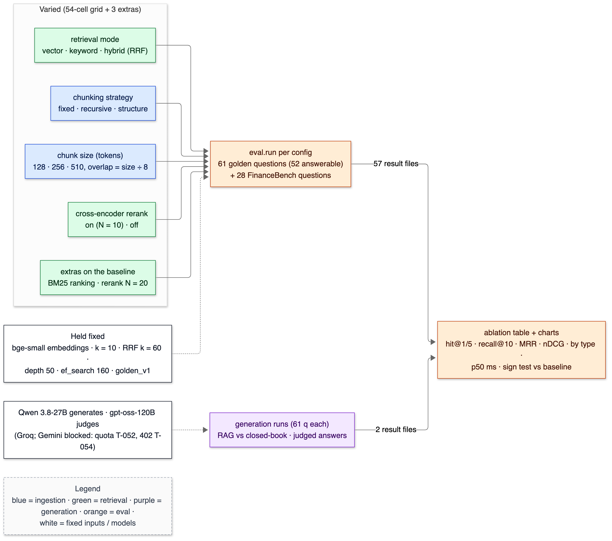
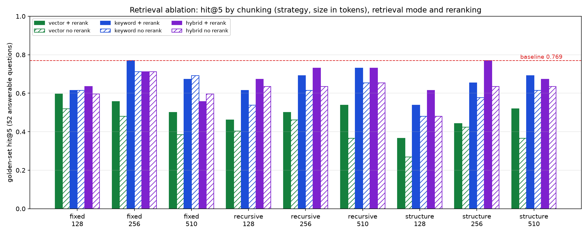
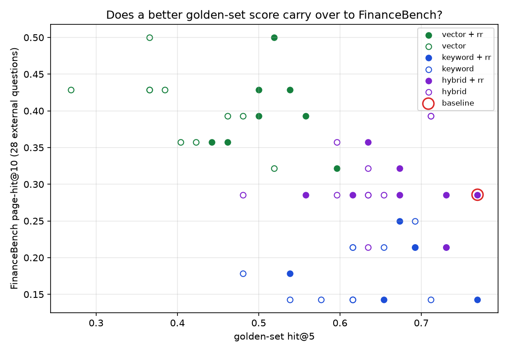

# 16 — Experiments and ablations

**Status:** written in Phase 12 (2026-10-02/03). Two parts, both complete. **Retrieval ablation:** 54 grid configurations plus 3 extras, each scored on the 61-question golden set and the 28 FinanceBench questions. **Generation:** the RAG system and a closed-book baseline, 61 questions each, with real answers from `qwen/qwen3.8-27b` judged by `openai/gpt-oss-120b`, both on Groq. Gemini was the plan, but its free tier allows 20 Flash requests/day (T-052) and the project then returned 402 (T-054); see README "Models". Owns: ablation, controlled experiment, confounder, interaction effect, paired comparison, multiple comparisons, winner's curse, external validity, closed-book baseline.

> **Prerequisites:** [15-eval-harness.md](15-eval-harness.md) (the metrics and the golden set). Numbers come from `python -m eval.ablate --tag v1` → `eval/results/20261002T175959Z_ablation-v1.{csv,md}` (57 result files `*_abl-v1-*.json`), and from `make eval NAME=gen-v2-rag ARGS="--generate --judge"` → `20261002T205049Z_gen-v2-rag.json` and `make eval NAME=closed-book ARGS="--closed-book --judge"` → `20261002T205101Z_closed-book.json`.

---

## 1. In one paragraph

An **ablation** changes one design choice at a time and measures what it does. Here: three chunking strategies × three chunk sizes × three retrieval modes × reranker on/off, 54 combinations, each re-run on the same 61 questions. The result is more interesting than "the fancy option wins":

- **The reranker is the one choice that clearly pays.** It improves hit@5 in 23 of 27 paired configurations, by +0.067 on average.
- **No configuration beats our default significantly.** Our default is structure-aware 256-token chunks, hybrid search, rerank.
- **The two test sets disagree.** Configurations that do best on our golden set tend to do *worse* on FinanceBench: rank correlation −0.53 across the 54. Vector-only search is worst on our set and best on FinanceBench; keyword-only is the reverse.

That last finding is the most important number in the project. The golden set's wording favours keyword matching, so any choice made only on it would be tuned to its author.

## 2. Why it exists

Every earlier decision (structure-aware chunking, 256 tokens, hybrid search, reranking) was made in its phase with partial evidence. This phase re-tests them together, because choices interact. For example, keyword search is strong at 256-token fixed chunks (0.769) and weak at 128-token structure chunks (0.538). It also produces the table that every "why did you choose X?" answer points to.

## 3. Where it sits


<details><summary>Same diagram as text (for terminal viewing)</summary>

```text
 OFFLINE                                       (9 chunk sets: 3 strategies × 3 sizes)
 ┌───────────┐  ┌───────┐  ┌───────┐  ┌───────┐   ┌─────────────────────────────┐
 │ PDF files │─▶│ Parse │─▶│ Chunk │─▶│ Embed │──▶│ Postgres 16                 │
 └───────────┘  └───────┘  └───────┘  └───────┘   │ pgvector + full-text search │
                                                  └──────────────┬──────────────┘
 ONLINE                                                          │ searched by
 ┌───────────┐  ┌─────────┐     query     ┌──────────────────────▼──────────────┐
 │ Streamlit │─▶│ FastAPI │──────────────▶│ Vector search  +  Keyword search    │
 └───────────┘  └─────────┘               └──────────────────────┬──────────────┘
                                                                 ▼
               ┌──────────────┐  ┌────────────────────┐  ┌────────┐  ┌────────────┐
               │ LLM (Groq)   │◀─│ Prompt + citations │◀─│ Rerank │◀─│ RRF fusion │
               └──────┬───────┘  └────────────────────┘  └────────┘  └────────────┘
                      │ every configuration of the boxes above, one at a time
               ╔══════▼══════════════════╗
               ║ Eval harness (ablation) ║
               ╚═════════════════════════╝
 Double-line box (╔═╗) = this doc: the eval harness run across the configuration grid.
```
</details>

## 4. The flow



<details><summary>Same diagram as text (for terminal viewing)</summary>

```text
 Varied (54-cell grid + 3 extras)
 ┌───────────────────────────────────────┐
 │ chunking strategy                     │
 │   fixed · recursive · structure       │
 │ chunk size (tokens)                   │
 │   128 · 256 · 510 (overlap = size ÷ 8)│
 │ retrieval mode                        │
 │   vector · keyword · hybrid (RRF)     │
 │ cross-encoder rerank on (N=10) · off  │
 │ extras: BM25 · rerank N = 20          │
 └───────────────────┬───────────────────┘
                     │        Held fixed: bge-small · k = 10 · RRF k = 60 ·
                     ▼        depth 50 · ef_search 160 · golden_v1
 ┌───────────────────────────────────────┐
 │ eval.run per configuration            │
 │ 61 golden + 28 FinanceBench questions │
 └───────────────────┬───────────────────┘
                     │ 57 result files
                     ▼
 ┌───────────────────────────────────────┐
 │ ablation table + charts + sign tests  │
 └───────────────────────────────────────┘

 ┌────────────────────────────────────────────┐   ┌───────────────────────────────────────┐
 │ Qwen 3.8-27B generates · gpt-oss-120B      │┄┄▶│ generation runs (61 q each):          │
 │ judges (Groq; Gemini blocked: T-052, T-054)│   │ RAG vs closed book · judged answers   │
 └────────────────────────────────────────────┘   └──────────────────┬────────────────────┘
                                                                     │ 2 result files
                                                                     ▼ (into the same table)
 Legend (colours appear in the image): blue = ingestion · green = retrieval ·
 purple = generation · orange = eval · white = fixed inputs / models
```
</details>

1. **Ingest each chunking configuration once.** That's 8 new chunk sets next to the original (structure/256). Each took 61–107 s (pipeline total). The database grew from 66 MB to 418 MB. The **embedding model is unchanged**: new chunk sets were embedded with the same pinned bge-small, so the Phase 4–11 numbers stay valid.
2. **Run the golden set** for every cell through the same `eval.run` (the Phase 11 runner). One result file per configuration, named `abl-v1-<config>`.
3. **Resume, don't redo.** A configuration whose result already exists for this golden-set hash is reused, so the grid finished across two invocations (2 min 25 s + 5 min 34 s).
4. **Score FinanceBench** with the same retriever, as the external check.
5. **Tabulate:** per-question hit@5 is compared with the baseline by a paired sign test, the winner is found per metric, and charts are written.

## 5. The code — `eval/ablate.py`

```python
def grid() -> list[tuple[str, list[str]]]:
    for st in STRATEGIES:
        for size in SIZES:
            for mode in MODES:
                for rr in (True, False):
                    args = ["--chunk-strategy", st, "--chunk-size", str(size), "--chunk-overlap", str(size // 8),
                            "--mode", mode, "--rerank" if rr else "--no-rerank"]
```

Each cell is a list of `eval.run` flags, so an ablation run is exactly an ordinary eval run, with the same code, metrics and result format. Nothing is computed differently for the table.

```python
        w, l, p = sign_test([rows[i]["hit@5"] for i in ids], [base_rows[i]["hit@5"] for i in ids])
```

**Paired** comparison against the baseline, question by question. Two configurations are evaluated on the *same* 52 questions, so only the questions where they disagree carry information. That's far more sensitive than comparing two means with overlapping intervals.

```python
            if existing(a.tag, name, sha):
                continue
```

Resumability is keyed on the golden file's sha256. If the labels change, every configuration is re-run.

`eval/run.py` gained what the grid needed:

- `--rank-function` (BM25);
- `--closed-book` (no retrieval: the model answers from its own knowledge, with its own prompt in `eval/closed_book.py`);
- `run()`, which returns the result path.

When the LLM's quota runs out mid-run, the runner now stops calling it and marks the remaining questions as skipped, instead of failing 60 calls one by one (T-052).

## 6. Data in / data out

### The headline table (top 10 of 57 by golden hit@5, plus selected rows)

From `eval/results/20261002T175959Z_ablation-v1.md`. W/L = questions where the configuration hits@5 and the baseline doesn't / vice versa; p = two-sided sign test.

```text
config                       hit@1 hit@5 [95% CI]      R@10  MRR   nDCG@10 multi R@5 table@5 exact@5 FB@10 p50ms W/L (p)
structure256-hybrid-rr (BASE) .404 .769 [.65–.88]      .760  .535  .523    .333      .615    .875    .286  104   –
fixed256-keyword-rr           .365 .769 [.65–.88]      .817  .530  .522    .278      .846    .875    .143  102   6/6 (1.00)
recursive256-hybrid-rr        .423 .731 [.62–.85]      .750  .555  .544    .278      .615    .750    .214  105   2/4 (0.69)
recursive510-keyword-rr       .327 .731 [.60–.85]      .740  .492  .499    .278      .769    .875    .214  155   3/5 (0.73)
recursive510-hybrid-rr        .269 .731 [.60–.85]      .769  .464  .484    .333      .846    .750    .286  165   3/5 (0.73)
fixed256-hybrid-rr            .385 .712 [.58–.83]      .817  .518  .514    .389      .846    .625    .393  108   6/9 (0.61)
fixed256-keyword-norr         .365 .712 [.60–.83]      .817  .506  .501    .222      .692    .875    .143   31   4/7 (0.55)
fixed256-hybrid-norr          .288 .712 [.58–.83]      .817  .468  .463    .389      .923    .875    .393   35   7/10 (0.63)
structure256-hybrid-rr-bm25   .385 .692 [.56–.81]      .760  .504  .501    .278      .615    .750    .214  153   0/4 (0.12)
recursive256-keyword-rr       .346 .692 [.56–.81]      .673  .476  .500    .333      .615    .875    .214  102   2/6 (0.29)
…
structure256-hybrid-rr-n20    .423 .673 [.54–.79]      .740  .534  .527    .222      .538    .625    .286  175   1/6 (0.12)
structure256-hybrid-norr      .269 .635 [.50–.77]      .760  .412  .438    .167      .615    .625    .286   33   1/8 (0.04)
structure256-vector-rr        .308 .442 [.31–.58]      .452  .364  .329    .111      .538    .250    .357   76   0/17 (0.00)
structure510-vector-norr      .173 .365 [.23–.50]      .510  .261  .274    .056      .692    .125    .500    4   2/23 (0.00)
structure128-vector-norr      .096 .269 [.15–.40]      .356  .153  .187    .056      .231    .250    .429    4   0/26 (0.00)
```

### The grid as a chart



<details><summary>Same chart as text (for terminal viewing)</summary>

```text
 golden hit@5 (52 q)    vector       keyword      hybrid          (rr = rerank on / off)
 chunking               rr    off    rr    off    rr    off
 fixed      128         .60   .52    .62   .62    .63   .60
 fixed      256         .56   .48    .77   .71    .71   .71
 fixed      510         .50   .38    .67   .69    .56   .60
 recursive  128         .46   .40    .62   .54    .67   .63
 recursive  256         .50   .46    .69   .62    .73   .63
 recursive  510         .54   .37    .73   .65    .73   .65
 structure  128         .37   .27    .54   .48    .62   .48
 structure  256         .44   .42    .65   .58    .77   .63   ← baseline .769 (red dashed line)
 structure  510         .52   .37    .69   .62    .67   .63
```
</details>

### Golden set vs FinanceBench



<details><summary>Same chart as text (for terminal viewing)</summary>

```text
 Each of the 54 grid configurations is one point: x = golden hit@5, y = FinanceBench page-hit@10.
 mode       golden hit@5 range    FinanceBench hit@10 range   where its points sit
 vector     0.269 – 0.596         0.321 – 0.500               left and high
 keyword    0.481 – 0.769         0.143 – 0.250               right and low
 hybrid     0.481 – 0.769         0.214 – 0.393               right and middle
 baseline (structure256-hybrid-rr): golden 0.769, FinanceBench 0.286  (circled)
 Spearman rank correlation across the 54 points: −0.53 (higher golden → lower FinanceBench)
```
</details>

Averages by factor over the 54-cell grid (`hit@5` on golden, `hit@10` on FinanceBench):

```text
factor              golden hit@5   FinanceBench hit@10
mode    vector         0.453            0.401
        keyword        0.638            0.183
        hybrid         0.649            0.302
rerank  on             0.613 (hit@1 0.319, MRR 0.439)   0.295
        off            0.546 (hit@1 0.244, MRR 0.370)   0.295
size    128            0.536            0.278
        256            0.615            0.282
        510            0.588            0.325
strategy fixed         0.607            0.302
        recursive      0.591            0.282
        structure      0.542            0.302
```

**Read honestly:**

1. **The reranker is the robust win.** It improves golden hit@5 in 23 of 27 configuration pairs (2 ties, 2 losses), +0.067 on average; for the baseline chunking it's 0.635 → 0.769 (1 vs 8 questions, p = 0.04). On FinanceBench its average effect is exactly zero (0.295 both): it re-sorts the top 10, so it can't change page-hit@10. That's the Phase 8 finding again.
2. **The golden set rewards keyword search; FinanceBench punishes it.**
   - Keyword-only averages 0.638 on golden but 0.183 on FinanceBench.
   - Vector-only averages 0.453 on golden but 0.401 on FinanceBench.
   - Across all 54 configurations the two scores are *negatively* correlated (Spearman −0.53).

   The cause was predicted in [15](15-eval-harness.md) card #38: I wrote the golden questions from the filings' text, so they reuse its words ("Display Technologies segment represented…"), and keyword search matches words. FinanceBench's analysts paraphrase ("FY22", "unadjusted EBITDA"), where meaning-based search wins. **Hybrid is the only mode in the middle on both.** It never wins either set outright, but it never collapses on either. That's the case for keeping it.
3. **No configuration significantly beats the baseline on golden.** The closest rival, fixed256-keyword-rr, ties at 0.769, splitting 6/6 on the questions where they differ (p = 1.00). But it scores 0.143 on FinanceBench, half the baseline's 0.286.
4. **The best balanced candidate is fixed256-hybrid-rr**, and it's not a significant improvement. Golden hit@5 is 0.712 (−0.057, 6/9, p = 0.61), but recall@10 is 0.817 (vs 0.760), tables 0.846 (vs 0.615), multi-hop 0.389 (vs 0.333), and FinanceBench 0.393 (vs 0.286: 11 vs 8 of 28 questions). It's the configuration I'd test first on fresh questions. But a 3-of-28 difference on FinanceBench and a non-significant golden difference don't justify switching the default, which would also invalidate the Phase 11 baseline.
5. **Structure-aware chunking is not the win I expected.** On average it's the *weakest* strategy on golden (0.542 vs 0.607 fixed). Only its 256-token hybrid + rerank cell is top. 128-token structure chunks are the worst row (0.27–0.62), because tiny heading-bounded pieces lose the context that makes a paragraph findable. The baseline being the best cell of an otherwise weak strategy looks like a **winner's curse**. It's also the configuration I debugged and audited labels on in Phase 11, so its score is optimistic.
6. **Both "obvious upgrades" lost a little.** BM25 instead of ts_rank: 0.692 (0/4, p = 0.12), and 50 ms slower. Reranking 20 instead of 10: 0.673 (1/6, p = 0.12), and 70 ms slower. Neither difference is significant, and both agree with Phases 6 and 8: on this corpus, neither IDF nor a deeper rerank pool helps.
7. **Latency:** vector-only, no rerank: 4 ms p50. Keyword or hybrid, no rerank: 22–48 ms. Reranking adds about 50–80 ms at 128–256 tokens (it reads 10 pairs) and 120–140 ms at 510 tokens, because longer pairs cost more per pass.
8. **Multiple comparisons.** With 57 configurations, a few "p < 0.05" differences would appear by chance. Here 30 configurations are significantly *worse* than the baseline at p < 0.05, 20 of them at p ≤ 0.01, mostly vector modes and 128-token structure chunks; that's far more than chance would produce. **None** is significantly *better*.

### Generation: the RAG system vs the closed-book baseline (61 questions, real models)

Same 61 questions. **RAG** = the default pipeline (hybrid + rerank, k = 10, citations). **Closed book** = the same generator with no retrieval and its own prompt (`eval/closed_book.py`), answering from what it learned in training, allowed to refuse. Both are judged by the same model (`openai/gpt-oss-120b`), against the reference answers.

```text
                                        RAG (hybrid + rerank)     closed book (no retrieval)
answerable questions (52)
  correctness (judge)                   0.721 [0.60–0.84]         0.067 [0.02–0.12]
  answer relevance (judge)              0.769 [0.63–0.88]         0.567 [0.43–0.70]
  refused (false refusals)              12 / 52 (23%)             22 / 52 (42%)
  faithfulness to cited sources         0.923 [0.84–0.99] (40)    — (no sources)
  answers citing an evidence passage    92.5% (37 of 40)          —
  context precision (labels)            0.521 [0.41–0.63]         —
unanswerable questions (9)
  refused                               9 / 9                     6 / 9
  answered from memory or guesswork     0                         3: Apple FY2022 revenue, AMD FY2024 revenue,
                                                                     Tesla 2022 deliveries
paired sign test on correctness         RAG better on 37 questions, closed book on 4: p < 0.000001
by type: correctness (refused)
  factual (22)                          0.909 (2)                 0.045 (11)
  table (13)                            0.769 (2)                 0.077 (1)
  exact token (8)                       0.750 (2)                 0.062 (5)
  multi-hop (9)                         0.167 (6)                 0.111 (5)
answers truncated / invalid [n] markers 0 / 0                     0 / —
```

**Read honestly:**

1. **The documents do the work.** Without retrieval the same model gets 6.7% of answerable questions right; with retrieval it gets 72.1% (37 vs 4 questions won, paired). The figures in a 10-K (headcounts, segment shares, backlog values) are mostly not memorised. Where the closed-book model did score, it was well-known facts: it got Boeing ending 747 production fully right, and PepsiCo's and Boeing's 2022 revenue partly right.
2. **Closed book also guesses on what the corpus can't answer.** It gave Apple's FY2022 revenue and Tesla's 2022 deliveries (real public numbers it knows), and an AMD fiscal 2024 revenue figure, a year after its sources end. RAG refused all 9 unanswerable questions. The refusal contract only works when the model is told what its evidence is.
3. **Refusal is cautious, and that costs answerable questions.** RAG refused 12 of 52 answerable questions. Of these, 8 are retrieval misses: the evidence wasn't in the top 10, so refusing was the correct response. The other 4 are refusals despite relevant evidence in the top 10: G040 (exact token), and G045, G051 and G052, multi-hop questions where only one of the two needed facts was retrieved. Multi-hop is the weak type again: 6 of 9 refused, correctness 0.167. It's the same retrieval weakness Phase 11 found, now visible end to end.
4. **The dangerous errors are cited and wrong, and the judge can miss them.**
   - G032 "What was Boeing's total backlog at the end of 2022?" was answered "$54,373 million [2]", a number from the cited table but a different line item; the reference is $404,381 million. The judge scored it **faithful (1.0)**, because the number does appear in the source, and **incorrect** on correctness.
   - G048 took the 2021 column as 2022 (wrong-year misattribution), with faithfulness 0.25.

   Faithfulness alone would have hidden G032. That's why correctness against a reference is measured separately (card #37).
5. **The model ignores the exact refusal format about one time in 15.** In 4 RAG answers and 4 closed-book answers, it explained first and then wrote `INSUFFICIENT_CONTEXT`, or wrapped the token in brackets. The first scoring counted those as wrong *answers*, giving false refusals 15% and faithfulness 0.859. The detector now accepts the token anywhere in an uncited response (T-055), giving the corrected 23% and 0.923 above. A measurement bug the eval itself exposed: the first pass of a judged run is not the result.
6. **Cost of these runs: $0**, on Groq's free tier. All Groq calls today, from the llm_cache table: generator `qwen/qwen3.8-27b` made 122 calls with 160,279 input and 5,307 output tokens (RAG, closed book and smoke runs); judge `gpt-oss-120b` made 273 calls with 72,418 in and 17,089 out. Both are under the 200k tokens/day per-model cap. The binding limit was 8k tokens per minute. Every batch hit 12–15 per-minute 429s, each retried once after Groq's `Retry-After` (12–27 s), and the four RAG batches took 4–5 minutes each.

### What the ablation says about earlier decisions

| Decision (card) | Ablation verdict |
|---|---|
| Structure-aware chunking (#8) | Weakest strategy on average; its 256/hybrid/rerank cell is top on golden. Kept, with the winner's-curse caveat; fixed256-hybrid-rr is the candidate to re-test |
| 256-token chunks (#9) | Best size on golden on average (0.615); 510 best on FinanceBench (0.325); 128 worst on both. Kept |
| Hybrid search (#20) | Only mode that's mid-range on both test sets. Kept, now with an external-validity argument, not just a golden-set one |
| ts_rank over BM25 (#21) | BM25 −0.077 on golden (n.s.), −0.07 on FinanceBench. Kept ts_rank |
| Rerank on, N = 10 (#25, #26) | Rerank helps in 23 of 27 pairs (+0.067); N = 20 slightly worse (n.s.). Kept |

## 7. Decisions & alternatives

<!-- card:start id=x-default-after-ablation -->
#### Decision: keep the default (structure-aware 256-token chunks, hybrid RRF, MiniLM rerank N = 10) after the ablation  (rejected: switching to the golden-set winner; switching to the FinanceBench winner)

**One-line defence.** Nothing beat it significantly on the golden set. The configurations that look better on one test set look worse on the other (rank correlation −0.53), and hybrid + rerank is the only family that is mid-to-top on both.

**What problem is this even solving?** Choosing a default from 57 measured configurations without fooling yourself: small samples, many comparisons, and a test set written by the system's author.

**The options, compared.**

| Option | How it works (1 line) | Strengths | Weaknesses | When it's the right call |
|---|---|---|---|---|
| ✅ Keep structure256-hybrid-rr | No change | Tied-best golden hit@5 (0.769); Phase 11 history stays comparable | Best cell of the weakest strategy (winner's curse); FinanceBench 0.286 is middling | No significant alternative and conflicting test sets |
| Switch to fixed256-keyword-rr | Golden co-winner | Same golden hit@5; simpler (no vectors) | FinanceBench 0.143, half the baseline | Never: it overfits the golden wording |
| Switch to fixed256-hybrid-rr | Balanced candidate | FinanceBench 0.393 (+3/28); tables 0.846; recall@10 0.817 | Golden hit@5 0.712 (n.s.); a new baseline breaks comparability | If it wins on *fresh* questions |
| Switch to a vector-only FinanceBench winner (structure510-vector) | Best FB@10 0.500 | Best on paraphrased questions | Golden hit@5 0.365–0.519; exact tokens 0.125–0.25 | Only if users never quote figures or codes |

**What would actually change if we swapped it.** Three settings (`CHUNK_STRATEGY`, `CHUNK_SIZE`, `CHUNK_OVERLAP`); the chunk set already exists, so no re-ingest. A new canonical baseline file, with Phase 11's history kept but no longer the comparison point.

**The decision rule.** Change a default only for a difference that's significant on the set you tuned on *and* holds on a set you didn't. With conflicting test sets, prefer the option that's robust across both over the one that wins either.

**Where our choice breaks.** If the real question mix is like FinanceBench (paraphrased, analyst-style), the default leaves recall on the table: vector-heavier configurations find more evidence pages (0.40–0.50 vs 0.286). Migration path: write 30–50 *new* questions in users' own words, re-run the top 5 configurations, and switch on a significant win.

**The number.** Baseline golden hit@5 0.769 [0.65–0.88], FB@10 0.286. Best rival on golden: fixed256-keyword-rr 0.769 (6/6, p = 1.00), FB 0.143. Balanced candidate fixed256-hybrid-rr: 0.712 (6/9, p = 0.61), FB 0.393. Spearman(golden, FB) over 54 configurations: −0.53.

**Interview script (3 sentences).** "I ran 54 chunking × retrieval × rerank configurations plus three extras through the same harness, with paired sign tests against the default. The one robust win was the reranker, +0.067 hit@5 in 23 of 27 pairs. The surprising result was that scores on my own question set and on FinanceBench were negatively correlated, because my questions reuse the filings' wording, which flatters keyword search. So I kept the hybrid default, which is the only family that holds up on both, rather than crowning the winner of a test set I wrote myself."

**Follow-ups they will ask:**
- Q: Why not just pick the best number? → A: The best golden number ties and fails FinanceBench, and the best FinanceBench number fails exact figures. The headline is the disagreement, not either winner.
- Q: Isn't 57 comparisons a multiple-comparisons problem? → A: Yes, so I only act on effects far beyond chance. 30 configurations are significantly worse than the default (20 at p ≤ 0.01); none is significantly better.
- Q: What's the winner's curse here? → A: The default is the top cell of the strategy that's weakest on average, and the configuration I debugged on in Phase 11. Its score is likely optimistic, which is why fixed256-hybrid-rr gets re-tested on fresh questions.
- Q: Why does the reranker not change FinanceBench? → A: That metric is page-hit@10, and reranking only reorders the same 10 chunks. Its gains show up in hit@1, MRR and hit@5.
- Q (the hard one): So which configuration is actually best? → A: I don't know for real users. That needs a question set in their words. What I can say is which choice is robust (hybrid + rerank), which consistently hurts (128-token structure chunks, vector-only on exact tokens), and that my own test set is biased toward keyword matching.

**The trap.** Declaring the top row of an ablation table the winner.
<!-- card:end -->

## 7a. Prerequisite concepts

**Ablation.** Remove or change one component and measure the effect. Here, a full grid, so interactions are visible too.

**Controlled experiment.** Everything else is held fixed: the same questions, embedding model, k, RRF k, depth and ef_search. Only the varied factors change.

**Confounder.** Something that changes along with the factor you're studying. Example: chunk size changes how many chunks exist (2,809 to 14,513), which changes how many can be relevant, which changes precision's ceiling. So precision isn't compared across sizes.

**Interaction effect.** A factor's effect depends on another factor. Keyword search is 0.769 at fixed/256 with rerank but 0.538 at structure/128, so "keyword is good" isn't true on its own.

**Paired comparison.** Compare two systems on the *same* questions and count only the disagreements (sign test).

**Multiple comparisons.** Run 57 tests at p < 0.05 and about 3 will look significant by chance. Be sceptical of marginal results, or correct for it (Bonferroni: 0.05 / 57 ≈ 0.0009).

**Winner's curse.** The best of many noisy measurements is, on average, overestimated. Re-measure it on new data before believing it.

**External validity.** Whether a result holds outside the test set. FinanceBench is our external check, and here it disagrees.

## 7b. What if we used something else?

| If we had used… | Immediate effect | Effect on quality metrics | Effect on latency/cost | Effect on complexity | Would I defend it? |
|---|---|---|---|---|---|
| One-factor-at-a-time instead of a grid | 10 runs instead of 54 | Misses interactions (keyword: 0.538–0.769 by chunking) | Faster | Simpler | Only for a quick first look |
| Golden set only, no FinanceBench | One table | Would have crowned keyword-only (0.769) | Same | Simpler | No: it hid the wording bias |
| Mean comparison instead of paired tests | Overlapping CIs everywhere | Can't separate anything | Same | Simpler | No |
| Pick the FinanceBench winner | Vector-only 510 | Exact-token hit@5 0.125 | Fastest (4 ms) | Simpler | No |
| Switch default to fixed256-hybrid-rr now | New baseline | +3/28 FB, −3 golden (n.s.) | Same | One settings change | Not without fresh questions |

## 8. Failure modes

| What you see | Cause | Fix |
|---|---|---|
| `RateLimitError 429` retried for minutes, few questions done | Gemini free tier: 20 Flash requests/day/model; daily quota retried as if per-minute (T-052) | Daily quotas now fail fast; the runner stops calling the LLM and marks the rest skipped |
| `pipeline.py: error: argument --size: expected one argument` | A zsh loop didn't word-split `$cfg` (T-053) | Pass arguments explicitly (shell function with positional args) |
| A configuration "improves" golden but drops FinanceBench | Test-set wording bias | Report both; prefer robust options |
| Precision higher for 510-token chunks | Fewer, larger chunks: a different ceiling (confounder) | Don't compare precision across chunk sizes |
| Ablation re-run takes the full 8 minutes again | Golden labels changed (new sha) | Expected: results are tied to the label hash |

## 9. Try it yourself

```bash
.venv/bin/python -m eval.ablate --tag v1 --report
```

Expected: rebuilds the table and charts from the 57 existing result files in seconds. Copy `20261002T175959Z_ablation-v1.md` and compare.

```bash
.venv/bin/python -m eval.ablate --tag v2
```

That runs the whole grid again under a new tag: about 8 minutes, no LLM calls. Results should be identical to v1 except timings.

## 10. Numbers

| What | Value | Command |
|---|---|---|
| Configurations run | 54 grid + 3 extras = 57 | `python -m eval.ablate --tag v1` |
| Chunk sets ingested | 9 (2,809 … 14,513 chunks), 65–113 s each; DB 66 → 418 MB | `python -m app.ingest.pipeline --strategy … --size … --overlap …` |
| Grid wall time | 8 min (2 invocations) | same |
| Baseline golden hit@5 / FB hit@10 | 0.769 / 0.286 | ablation table |
| Reranker effect | +0.067 hit@5 mean; better in 23 of 27 pairs | grid pairs |
| Spearman(golden hit@5, FB hit@10) | −0.53 over 54 configurations | shell on the CSV |
| Mode averages, golden / FB | vector 0.453 / 0.401 · keyword 0.638 / 0.183 · hybrid 0.649 / 0.302 | same |
| BM25 / rerank N=20 on the baseline | 0.692 (p 0.12) / 0.673 (p 0.12) | ablation table |
| RAG vs closed-book correctness (52 answerable) | 0.721 vs 0.067 (37 vs 4 questions won, p < 0.000001) | `make eval NAME=gen-v2-rag ARGS="--generate --judge"`, `make eval NAME=closed-book ARGS="--closed-book --judge"` |
| Unanswerable refused: RAG / closed book | 9 of 9 / 6 of 9 | same |
| False refusals: RAG / closed book | 23% / 42% | same |
| RAG faithfulness to cited sources · answers citing evidence | 0.923 · 92.5% | same |
| Refusal-format misses (token not alone) | 4 of 61 RAG, 4 of 61 closed book | T-055 |

## 11. Interview talking points

- "57 configurations through one harness, paired sign tests against the default, and an external set as a check."
- "The reranker is the robust win: +0.067 hit@5, better in 23 of 27 pairs."
- "My own test set and FinanceBench rank configurations in opposite orders (Spearman −0.53), because my questions reuse the filings' wording. Hybrid is the only mode that holds up on both, so it stays."
- "Nothing beat the default significantly. My default is the best cell of the weakest chunking strategy, so I'd re-test the balanced runner-up on fresh questions before claiming anything."
- "Closed book, the same model gets 6.7% right; with retrieval, 72.1%. And without its sources it answered 3 unanswerable questions from memory, while RAG refused all 9."
- Expect: "How did you avoid overfitting?", "What's the winner's curse?", "Which config is best?"

## 12. Check yourself

1. Why is the reranker's effect zero on FinanceBench page-hit@10 but positive on golden hit@5?
2. What does a Spearman correlation of −0.53 between the two test sets tell you, and what would you do next?
3. Why is precision@k not compared across chunk sizes?

<details><summary>Answers</summary>

1. Reranking reorders the same 10 retrieved chunks, so anything measured over all 10 (page-hit@10) can't change. hit@5, hit@1 and MRR measure order within them, which is what the reranker improves.
2. Configurations that do better on one set tend to do worse on the other: the sets measure different things (here, exact wording vs paraphrase). Don't tune on either alone. Write fresh questions in users' own words and re-test the robust candidates.
3. Chunk size changes how many chunks exist and how many can contain the evidence. With fewer, longer chunks, the share of relevant ones in the top k has a different ceiling. That's a confounder, not a quality difference.

</details>

## 13. New terms added to the glossary

ablation, controlled experiment, confounder, interaction effect, paired comparison, multiple comparisons, Bonferroni correction, winner's curse, external validity, Spearman rank correlation — see [21-glossary.md](21-glossary.md).
