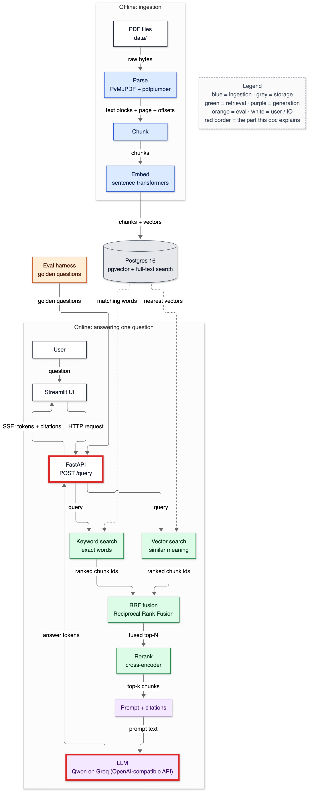
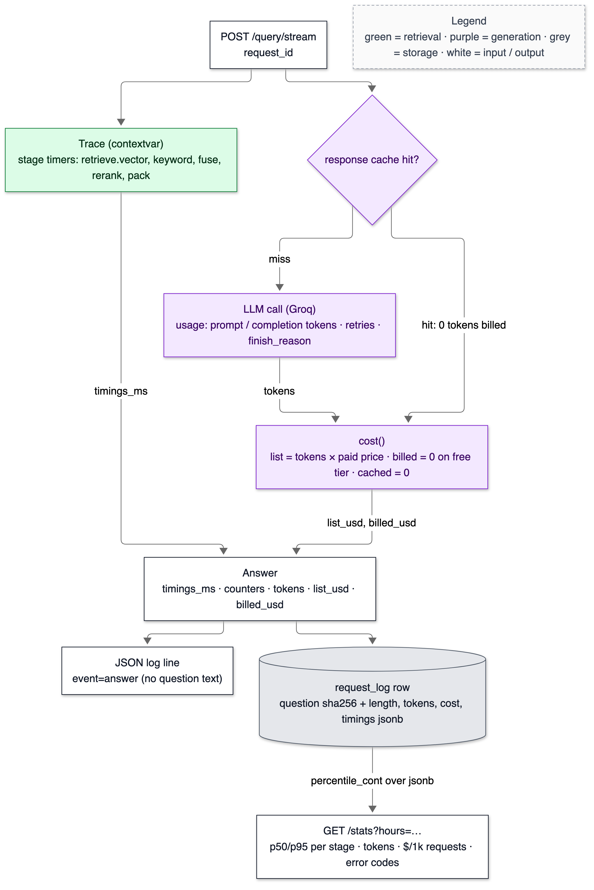
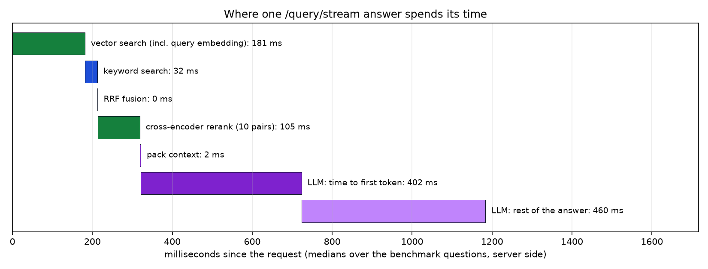

# 17 — Cost and observability

**Status:** written in Phase 13 (2026-10-03). Every `/query` and `/query/stream` request now carries a per-stage latency breakdown, token counts and cost, both the list price and what was actually billed. Each one writes a JSON log line and a `request_log` row, and `GET /stats` aggregates them. Numbers come from `scripts/bench_latency.py` against the real API (Qwen on Groq) on 2026-10-03, plus the shell experiments quoted in §6. Owns: observability, trace / span, stage timing, contextvar, structured logging, p50 / p95, token accounting, list vs billed cost, rate-limit wait, cold GPU.

> **Prerequisites:** [14-api-and-streaming.md](14-api-and-streaming.md) (the endpoints being measured) and [13-prompting-and-citations.md](13-prompting-and-citations.md) (the LLM client, the cache, retries).

---

## 1. In one paragraph

"It's slow" and "it's expensive" are useless until you can say *which part* and *how much*. This phase gives every answered request a receipt. It records:

- how long each stage took: embedding the question, vector search, keyword search, fusion, reranking, packing, the model's first token, the whole answer, and time spent waiting on rate-limit retries;
- how many tokens went in and out;
- what that would cost at the provider's paid price, and what was actually billed (nothing, on Groq's free tier).

The receipt is returned in the response, logged as one JSON line, and stored as one database row. `GET /stats` turns the rows into percentiles and totals.

The first real measurements already changed what I believed. Uncached, an answer takes about 1 s: retrieval ~0.3 s, model ~0.9 s. But on the free tier a request can spend **16 s waiting on a rate-limit retry**, and the slowest retrieval stage is **embedding the question on an idle GPU**, not search.

## 2. Why it exists

Doc 14's latency numbers came from a stopwatch around the whole request, which can't tell a slow database from a slow model. Phase 12's runs showed why that matters: every batch hit 12–15 per-minute 429s, and the "first token" times of 20 s were rate-limit waits, not model speed. Cost was the same kind of blind spot. A free tier hides the bill, and the number you need when it ends is what the same traffic would cost.

## 3. Where it sits



<details><summary>Same diagram as text (for terminal viewing)</summary>

```text
 OFFLINE
 ┌───────────┐  ┌───────┐  ┌───────┐  ┌───────┐   ┌─────────────────────────────┐
 │ PDF files │─▶│ Parse │─▶│ Chunk │─▶│ Embed │──▶│ Postgres 16                 │
 └───────────┘  └───────┘  └───────┘  └───────┘   │ pgvector + full-text search │
                                                  └──────────────┬──────────────┘
 ONLINE                                                          │ searched by
 ┌───────────┐  ╔═════════╗     query     ┌──────────────────────▼──────────────┐
 │ Streamlit │─▶║ FastAPI ║──────────────▶│ Vector search  +  Keyword search    │
 └─────▲─────┘  ╚══╤═══▲══╝               └──────────────────────┬──────────────┘
       │    SSE    │   │ answer tokens                           │ two ranked lists
       └───────────┘   │                                         ▼
               ╔═══════╧══════╗  ┌────────────────────┐  ┌────────┐  ┌────────────┐
               ║ LLM (Groq)   ║◀─│ Prompt + citations │◀─│ Rerank │◀─│ RRF fusion │
               ╚══════════════╝  └────────────────────┘  └────────┘  └────────────┘

 Double-line boxes (╔═╗) = where tokens, cost and the request record are produced.
 Every box on the online path times itself into the request's trace.
```
</details>

## 4. The flow



<details><summary>Same diagram as text (for terminal viewing)</summary>

```text
 ┌──────────────────────┐
 │ POST /query/stream   │
 │ request_id           │
 └──┬────────────────┬──┘
    │                ▼
    │      ┌────────────────────┐  hit: 0 tokens billed
    │      │ response cache hit?│─────────────────────────────┐
    │      └─────────┬──────────┘                             │
    │                │ miss                                   │
    ▼                ▼                                        ▼
 ┌────────────────────────┐  ┌──────────────────────────┐  ┌───────────────────────────────┐
 │ Trace (contextvar):    │  │ LLM call (Groq): usage = │─▶│ cost(): list = tokens × paid  │
 │ retrieve.vector,       │  │ prompt/completion tokens,│  │ price · billed = 0 on free    │
 │ keyword, fuse, rerank, │  │ retries, finish_reason   │  │ tier · cached = 0             │
 │ pack                   │  └──────────────────────────┘  └──────────────┬────────────────┘
 └───────────┬────────────┘                                               │ list_usd, billed_usd
             │ timings_ms                                                 │
             ▼                                                            ▼
          ┌────────────────────────────────────────────────────────────────────┐
          │ Answer: timings_ms · counters · tokens · list_usd · billed_usd     │
          └────────────┬──────────────────────────────────────┬────────────────┘
                       ▼                                      ▼
          ┌──────────────────────────┐        ┌────────────────────────────────────┐
          │ JSON log line            │        │ request_log row: question sha256 + │
          │ event=answer (no text)   │        │ length, tokens, cost, timings jsonb│
          └──────────────────────────┘        └──────────────────┬─────────────────┘
                                                                  │ percentile_cont
                                                                  ▼
                                            ┌──────────────────────────────────────┐
                                            │ GET /stats?hours=…: p50/p95 per      │
                                            │ stage · tokens · $/1k · error codes  │
                                            └──────────────────────────────────────┘
 Legend (colours appear in the image): green = retrieval · purple = generation ·
 grey = storage · white = input / output
```
</details>

1. The answer pipeline creates a **Trace** and *activates* it for the retrieval call. Each retriever, the fusion step and the reranker wrap their work in `stage("…")` and add their time to whichever trace is active. No timing objects are passed through function signatures.
2. The LLM client reports token usage, the number of retries and the total time spent sleeping between them (`retry_wait_ms`).
3. `cost()` turns tokens into two numbers: **list** (paid price per token) and **billed** (0 on the free tier). A cache hit costs 0 on both.
4. The API writes a JSON log line and a `request_log` row (best effort: telemetry failing must never fail a request), and `/stats` aggregates the rows.

## 5. The code

### `app/telemetry/trace.py` — timing without plumbing

```python
_current: contextvars.ContextVar["Trace | None"] = contextvars.ContextVar("trace", default=None)

@contextmanager
def stage(name: str):
    tr = _current.get()
    if tr is None:
        yield
        return
    t0 = time.perf_counter()
    try:
        yield
    finally:
        tr.add(name, (time.perf_counter() - t0) * 1000)
```

A **contextvar** is a variable whose value is private to the current thread or async task. The vector retriever can call `stage("retrieve.vector")` without knowing whether it's running inside the API, the eval runner, or a test. With no active trace, it's a no-op. FastAPI runs each sync endpoint (and each step of a streaming generator) in one worker thread, and the trace is activated and reset inside that same call, so two concurrent requests can't mix their timings. Stages nest by name: `retrieve.vector` includes `retrieve.vector.embed`.

### `app/telemetry/cost.py` — list vs billed

```python
def cost(input_tokens, output_tokens, price, cached=False):
    if cached:
        return Cost(input_tokens, output_tokens, 0.0, 0.0)
    list_usd = input_tokens / 1e6 * price.input_per_m + output_tokens / 1e6 * price.output_per_m
    return Cost(input_tokens, output_tokens, round(list_usd, 8), 0.0 if price.free_tier else round(list_usd, 8))
```

Prices are settings: Groq's paid list price, from its models page on 2026-10-03, is $0.80 / $4.00 per 1M input/output tokens for `qwen/qwen3.8-27b` and $0.15 / $0.60 for `gpt-oss-120b`. `LLM_FREE_TIER=true` makes billed = 0 while list is still reported. Free has a limit (§6), and list is the number to budget with when it runs out.

### `app/generate/llm.py` — retry time is its own number

```python
            if on_wait:
                on_wait(wait)
            sleep(wait)
```

`with_retries` reports each wait. The client sums them into `retry_wait_ms`, and the answer records them as stage `llm.retry_wait`. Without this, a 16-second rate-limit sleep looked like a 16-second "time to first token".

### `app/api/main.py` — one receipt per request

```python
def record(rid, endpoint, status, error_code, question, a, total_ms) -> None:
    row = {"request_id": rid, "endpoint": endpoint, "status": status, "error": error_code, ...}
    if question is not None:
        row.update(question_sha256=hashlib.sha256(question.encode()).hexdigest(), question_chars=len(question))
```

The question **text is never logged or stored**, because users can type anything, including personal data. A sha256 hash and the length are enough to spot repeated questions and outliers. Requests that fail before an answer exists (422, 503) still get a row from the middleware, with their error code, so `/stats` counts failures too.

### `app/store/repository.py` — `/stats` in SQL

```sql
SELECT count(*), percentile_cont(0.5) WITHIN GROUP (ORDER BY (timings_ms->>%(st)s)::float8), …
FROM request_log WHERE ts > now() - make_interval(secs => %(secs)s) AND timings_ms ? %(st)s
```

Per-stage percentiles come straight from the `jsonb` timings. `?` tests that a key exists, so a stage that didn't run (no `first_token` for `/query`) isn't counted as zero.

## 6. Data in / data out

### A real request record (JSON log line, Groq, 2026-10-03)

```json
{"ts": "2026-10-02T21:44:00.747164Z", "level": "INFO", "logger": "rag.request", "event": "answer",
 "request_id": "e8ab57fae6184db8", "endpoint": "/query/stream", "status": 200, "error": null, "total_ms": 905.09,
 "question_chars": 44, "provider": "groq", "model": "qwen/qwen3.8-27b", "input_tokens": 1548, "output_tokens": 100,
 "cached": false, "refused": false, "truncated": false, "list_usd": 0.0016384, "billed_usd": 0.0,
 "timings_ms": {"retrieve": 430.28, "retrieve.vector.embed": 265.08, "retrieve.vector": 290.04,
                "retrieve.keyword": 32.73, "retrieve.fuse": 0.29, "rerank": 107.1, "pack": 3.84,
                "first_token": 254.64, "generate": 459.83},
 "counters": {"query_embedding_computed": 1, "rerank_pairs": 10}}
```

Check it by hand: list = 1,548 × $0.80/1M + 100 × $4.00/1M = $0.0012384 + $0.0004 = **$0.0016384**. The same pipeline one request earlier, throttled:

```json
{"request_id": "6411bb78f2ff4bb9", "total_ms": 16771.2, … "timings_ms": {… "first_token": 16591.19, "generate": 16619.39,
 "llm.retry_wait": 16000.0}, "counters": {… "llm_retries": 2}}
```

16.0 of its 16.8 seconds were spent sleeping on two rate-limit retries.

### The latency breakdown (`scripts/bench_latency.py --n 4 --offset 8`, uncached FinanceBench questions)



<details><summary>Same chart as text (for terminal viewing)</summary>

```text
 stage (server side, median of 4 requests)            ms      0        400       800      1200
 vector search (incl. query embedding 158 ms)        181      ███▋
 keyword search                                       32          ▋
 RRF fusion                                            0.4
 cross-encoder rerank (10 pairs)                     105          ██
 pack context                                          2.5
 LLM: time to first token                            402            ████████
 LLM: rest of the answer                             460                    █████████
 client-side: `sources` event 365 ms · first delta 704 ms · end 1,303 ms (medians)
 one of the 4 requests also waited 16,000 ms on rate-limit retries (not drawn: 18× the chart)
```
</details>

```text
server: groq / qwen/qwen3.8-27b · rerank True
  ea113bf5438a4013 status 200 · sources 576.8 ms · first delta 1068.8 ms · end 1627.6 ms
  123dbcdca62a4a9f status 200 · sources 281.6 ms · first delta 595.0 ms · end 979.0 ms
  6411bb78f2ff4bb9 status 200 · sources 153.8 ms · first delta None ms · end 16791.9 ms
  e8ab57fae6184db8 status 200 · sources 448.7 ms · first delta 703.9 ms · end 923.9 ms

server-side stage medians (ms): {"llm.retry_wait": 16000.0, "retrieve.vector.embed": 157.7, "retrieve.vector": 181.3,
  "retrieve.keyword": 31.7, "retrieve.fuse": 0.4, "rerank": 105.4, "pack": 2.5, "first_token": 402.1, "generate": 862.5}
tokens in/out: 8934 / 540 · list $0.009307 · billed $0.000000 · cached 0 · refused 1
```

(The request without a first delta was a refusal: no text streams before the `answer` event.)

**Read honestly:**

1. **Unthrottled, the model is two thirds of the time:** retrieval ~320 ms, model ~860 ms (first token at ~400 ms). The reranker (105 ms) and keyword search (32 ms) are small. Fusion and packing round to zero.
2. **On the free tier, rate limits dominate.** Groq allows 8k tokens per minute per model, and one answer sends 1.5–2.8k. In the first benchmark (8 questions, before retry waits were separated), 6 of 8 requests took 11–25 s. A later request, with the waits separated, shows they were 16 s of sleeping. That's not latency you fix with code: it's a quota, and the fix is a paid tier, fewer tokens per request, or spreading requests over time.
3. **Embedding the question is the slowest retrieval stage, because the GPU goes idle.** Shell experiments, same model and process:

   ```text
   MPS, idle 0 s before each call: [17.3, 16.6, 16.8] ms      CPU, idle 0 s: [17.0, 14.7, 15.0] ms
   MPS, idle 2 s:                  [93.1, 92.3, 95.0] ms      CPU, idle 2 s: [36.6, 33.2, 34.0] ms
   MPS, idle 5 s:                  [226.2, 174.2, 83.8] ms    CPU, idle 5 s: [38.2, 21.4, 25.9] ms
   MPS, idle 10 s:                 [211.4, 112.7, 188.1] ms
   first MPS call from a new worker thread: 392.0 ms, then 15.9–18.9 ms
   ```

   Back to back, GPU and CPU are equally fast for one short question (~17 ms). After a few seconds idle, which is normal when the model takes a second or more between requests, the GPU takes 84–226 ms and the CPU 21–38 ms. My first guess, a recompile per new input length, was tested and rejected (new lengths 17.6–22.1 ms). The likely cause is the Apple GPU's power management, but I'm not sure. The GPU is still 2.5× faster for *batch* embedding at ingest (Phase 4). So the measured option is query embeddings on the CPU and ingest on the GPU. Not switched: CPU and GPU vectors differ by up to 3.3e-7 (Phase 4), which could reorder near-ties and nudge the published eval numbers, so it's an ablation for Phase 16, not a silent change.
4. **Cost at list price is about $0.002 per answer** ($1.6–2.6 per 1,000 requests from `/stats`: 2.5984 on the second benchmark). Billed: $0. All of Phase 12 (122 generator + 273 judge calls) would have cost about $0.17 at list price: 160,279 × 0.80 + 5,307 × 4.00 + 72,418 × 0.15 + 17,089 × 0.60, per 1M tokens.

### `GET /stats` (real, after the benchmarks)

```text
{"requests": 12, "errors": 0, "cache_hit_rate": 0.0, "refusal_rate": 0.3333, "list_usd_per_1k_requests": 2.5984,
 "total_ms": {"p50": 13885.9, "p95": 25028.4}, …}
```

The p50 of 13.9 s is honest: most of these 12 requests were throttled. The per-stage block, and `llm.retry_wait` within it, shows why.

## 7. Decisions & alternatives

<!-- card:start id=33 -->
#### Decision: exact-match response cache (Postgres) + in-process query-embedding cache; no semantic cache  (rejected: semantic cache; no cache)

**One-line defence.** An exact-match cache keyed by the whole request can never return an answer to a different question. It made every eval re-run free (101 s → 13 s smoke; full judged run 26 s, 0 tokens) and survived the provider switches, because provider, endpoint and model are in the key. A semantic cache would serve "AMD revenue 2021" for "AMD revenue 2022", which is this corpus's main hard negative.

**What problem is this even solving?** Not paying, or waiting, twice for the same work: LLM calls (seconds, tokens, quota) and query embeddings (17–226 ms).

**The options, compared.**

| Option | How it works (1 line) | Strengths | Weaknesses | When it's the right call |
|---|---|---|---|---|
| No cache | Every call goes to the model | Always fresh | Every eval re-pays; quota burns (Phase 12 hit 8k TPM constantly) | Never for evals |
| ✅ Exact-match response cache | sha256(prompt version, provider, URL, model, instructions, input incl. sources, params) → stored text, tokens, finish reason | Deterministic re-runs; 0 tokens on hits; invalidates itself when anything in the key changes | Misses paraphrases; grows forever (no TTL) | Evals, repeated questions |
| ✅ Query-embedding cache (LRU, in process) | text → vector, 4,096 entries | Skips the 17–226 ms embed for repeats | Per process; lost on restart | Repeated questions |
| Semantic cache | Embed the question; reuse an answer if a past question is within a similarity threshold | Hits paraphrases | Serves wrong-year / wrong-company answers (hard negatives); threshold tuning; stale answers | FAQ-style traffic with no near-duplicate entities |

**What would actually change if we swapped it.** Semantic: an embedding lookup per request plus a vector index of past questions, a threshold, and the risk of confidently serving the 2021 answer to a 2022 question.

**The decision rule.** Cache exactly when wrong answers are expensive. Use semantic caching only where near-duplicate questions really do have the same answer, and validate the threshold on hard negatives.

**Where our choice breaks.**
- **No expiry.** If a filing were re-ingested with corrected text, its chunks change, so the input and the key change too: that case is safe. But a provider silently changing a pinned model would serve stale answers.
- **No hit-rate benefit for real users** unless they repeat questions: `/stats` measured a 0.0 cache hit rate on the benchmark's fresh questions.

**The number.** Smoke eval: 101 s / 16,572 tokens → 13 s / 0 tokens on re-run. Full judged RAG run from cache: 26 s, 0 tokens. `/stats` cache hit rate on fresh benchmark questions: 0.0. Embedding on an idle GPU: 84–226 ms, so the embedding cache saves that on repeats.

**Interview script (3 sentences).** "I cache LLM responses by an exact hash of everything that determines them, including the retrieved sources and the model. Re-running a 61-question judged eval costs nothing and returns identical results. I deliberately didn't add a semantic cache: in a corpus where the 2021 and 2022 filings say nearly the same thing, 'close enough' questions are exactly the ones with different answers."

**Follow-ups they will ask:**
- Q: How does the cache invalidate? → A: Implicitly. The key includes the prompt version, model, endpoint, params and full input, so any change is a new key. There's no TTL, which is a gap for silently-updated models.
- Q: Why Postgres, not Redis? → A: It's already there, durable, and the cached responses are part of the eval record. Lookups cost milliseconds next to seconds of LLM time.
- Q: Would a semantic cache help real users? → A: For an FAQ, maybe. Here, near-identical questions differ by year or company, so similarity is the wrong signal.
- Q: What's the embedding cache for? → A: A repeated question skips the encoder: 17 ms when the GPU is warm, up to 226 ms when it's idle.
- Q (the hard one): Doesn't caching hide real latency in your benchmarks? → A: It would, so every receipt records `cached`, and latency benchmarks use uncached questions (`--offset` past the cached ones).

**The trap.** Adding a semantic cache because it sounds smarter, in a domain full of near-duplicates with different answers.
<!-- card:end -->

<!-- card:start id=x-observability -->
#### Decision: in-house tracing (contextvar stages) + JSON logs + a Postgres request log, served by `/stats`  (rejected for now: OpenTelemetry + a tracing backend; Prometheus metrics; LangSmith-style LLM tracing SaaS)

**One-line defence.** One small module gives per-stage timings, token cost and error codes for every request, queryable with SQL, with no new services on an 8 GB laptop. It was enough to find the two surprises (rate-limit waits and idle-GPU embedding) on day one.

**What problem is this even solving?** Knowing where time and money go, per request and in aggregate, without adding infrastructure the project can't run locally.

**The options, compared.**

| Option | How it works (1 line) | Strengths | Weaknesses | When it's the right call |
|---|---|---|---|---|
| ✅ Contextvar trace + JSON logs + request_log table | Stages time themselves; one row per request; SQL percentiles | No new services; SQL-queryable; privacy-aware (no question text) | Single process; no cross-service spans; DB write per request | One service, low traffic |
| OpenTelemetry → Jaeger/Tempo | Standard spans exported to a tracing backend | Industry standard; cross-service; flame graphs | Collector + backend to run; more config | Multiple services, production |
| Prometheus metrics + Grafana | Counters/histograms scraped over HTTP | Cheap aggregates, alerting | No per-request detail; two more services | Alerting on SLOs |
| LLM tracing SaaS | Send prompts and outputs to a vendor | Prompt-level debugging UI | Sends user data to a third party; cost | Teams that accept the data flow |

**What would actually change if we swapped it.** OpenTelemetry: `stage()` becomes a span (same call sites), plus an exporter and a backend container. The receipts and `/stats` could stay.

**The decision rule.** Start with structured per-request records you can query. Add a tracing backend when there's more than one service to follow a request through, and metrics when you need alerts.

**Where our choice breaks.** Write load: one INSERT per request is fine for tens per second, not thousands. `/stats` scans by time index. And cross-process work isn't stitched together; there's only one process now.

**The number.** 10 stages timed per request; `/stats` over 12 requests returned per-stage p50/p95; the request_log write is best-effort, outside the response's timings.

**Interview script (3 sentences).** "Every request carries a trace: stages time themselves into a contextvar, so no timing objects are threaded through the code. The result, with tokens and cost at list and billed price, goes into a JSON log line and a Postgres row, and `/stats` computes percentiles in SQL. It's deliberately not OpenTelemetry yet: one process on a laptop doesn't need a collector, and the stage names map one-to-one onto spans when it does."

**Follow-ups they will ask:**
- Q: Why contextvars and not passing a trace object? → A: Retrievers, the embedder and the reranker would all need a new parameter. With a contextvar they call `stage()` and stay independent of who's measuring.
- Q: Are contextvars safe with threads? → A: Each thread has its own context. The trace is activated and reset within one worker-thread call, so concurrent requests can't mix.
- Q: Why not log the question? → A: It can contain personal data. A sha256 and the length cover dedup and outliers.
- Q: What did it find? → A: Rate-limit sleeps of 16 s hiding inside "time to first token", and query embedding on an idle GPU taking up to 226 ms.
- Q (the hard one): Is a DB write per request a bottleneck? → A: Not at this scale. At high volume I'd batch the rows, or log to a file and load them, or move to OTel plus metrics.

**The trap.** Shipping a tracing stack before you know what question you're asking of it, or logging raw prompts by default.
<!-- card:end -->

## 7a. Prerequisite concepts

**Observability.** Being able to answer new questions about a running system from what it records (logs, metrics, traces), without redeploying.

**Trace / span.** A trace is everything one request did; a span (here, a *stage*) is one timed part of it.

**Contextvar.** Python's per-thread / per-task variable (`contextvars.ContextVar`); `set()` returns a token for `reset()`.

**p50 / p95.** The median and the 95th percentile: half of requests are faster than p50, and 1 in 20 is slower than p95. Means hide tails.

**Token accounting.** Counting input and output tokens per call, from the provider's `usage` field, not our own tokenizer (§13: they differ).

**List vs billed cost.** What the tokens cost at the paid price vs what you actually paid.

**Rate limit vs quota.** A per-minute limit (Groq: 8k tokens/min) clears in seconds, so retry. A per-day quota or a payment failure doesn't, so stop. Doc 13 and T-052 cover how each is detected.

**Cold GPU.** An idle accelerator lowers its clocks; the first work after idle runs slower until it ramps up.

## 7b. What if we used something else?

| If we had used… | Immediate effect | Effect on quality metrics | Effect on latency/cost | Effect on complexity | Would I defend it? |
|---|---|---|---|---|---|
| Whole-request stopwatch only | One number | Same | Can't separate model vs retrieval vs throttling | Simpler | No: it hid 16 s rate-limit waits |
| Logging question text | Easy debugging | Same | Same | Same | No: personal data in logs |
| Billed cost only | $0 everywhere | Same | No budget signal for after the free tier | Simpler | No |
| OpenTelemetry now | Standard spans | Same | Collector overhead | Two more services | Later, with more services |
| Query embedding on CPU | 21–38 ms instead of 84–226 ms after idle | Possible tiny reordering (≤ 3.3e-7) | −50 to −200 ms per request at low traffic | One setting | Yes, after an ablation confirms the eval is unchanged |

## 8. Failure modes

| What you see | Cause | Fix |
|---|---|---|
| "Time to first token" of 20 s | Rate-limit retry sleeps folded into it | `llm.retry_wait` reported separately (fixed) |
| `/stats` shows requests you never sent | Tests wrote to the real request_log (T-056) | Autouse fixture disables logging in tests; the logging test uses the test DB |
| p50 latency of 14 s | Free-tier throttling, not slowness | Read `stages.llm.retry_wait`; paid tier or fewer tokens |
| `retrieve.vector.embed` 150–260 ms | GPU idle between requests (measured) | CPU query embedding (ablation), or keep the GPU warm |
| Cost $0 everywhere | Free tier: billed = 0 | Read `list_usd` |
| Request succeeds but no row | request_log write failed (warning logged) | Best effort by design; check the DB |

## 9. Try it yourself

```bash
make serve
```

```bash
make bench-latency ARGS="--n 4 --offset 12"
```

Expected: 4 requests, the stage medians, and a refreshed `docs/diagrams/out/17-latency-waterfall.png`. Use an `--offset` past questions already cached, or the model isn't called.

```bash
curl -s "http://127.0.0.1:8000/stats?hours=1"
```

## 10. Numbers

| What | Value | Command |
|---|---|---|
| Unthrottled answer, server side (median of 4) | retrieval ~320 ms + model 862 ms (first token 402) | `scripts/bench_latency.py --n 4 --offset 8` |
| Client side: `sources` event / first delta / end (medians) | 365 / 704 / 1,303 ms | same |
| Rate-limit wait in one request | 16,000 ms (2 retries) | same (`llm.retry_wait`) |
| Query embedding: MPS warm / after 2–10 s idle / CPU after idle | 17 / 84–226 / 21–38 ms | shell, §6 |
| First MPS call on a new worker thread | 392 ms (then ~17 ms) | shell, §6 |
| Cost per answer at list price | ~$0.0016–0.0026; $2.60 per 1k (`/stats`) | same |
| Phase 12 runs at list price | ≈ $0.17 (billed $0) | arithmetic on token totals |

## 11. Interview talking points

- "Every request carries a receipt: ten stage timings, tokens, list and billed cost, in a JSON log line and a Postgres row; `/stats` does the percentiles in SQL."
- "Measuring separated model latency (~0.9 s) from free-tier rate-limit sleeps (16 s), which had been hiding inside 'time to first token'."
- "The slowest retrieval stage was embedding the question on an idle GPU, up to 226 ms vs 17 ms warm. On a CPU it's 21–38 ms after idle."
- "No question text in logs, only a hash and the length."
- Expect: "How do you trace a request?", "What does an answer cost?", "Semantic cache?"

## 12. Check yourself

1. Why does `/stats` report both `list_usd` and `billed_usd`?
2. A request shows `first_token` 16,591 ms and `llm.retry_wait` 16,000 ms. What was the model's real time to first token, roughly?
3. Why is the question stored as a hash?

<details><summary>Answers</summary>

1. Billed is what this deployment pays (0 on the free tier). List is what the same traffic would cost on the paid tier, which is the number to plan with.
2. About 590 ms (16,591 − 16,000). The rest was sleeping before a retry.
3. The text can contain personal data. A sha256 still lets you count repeated questions without storing them, and the length catches outliers.

</details>

## 13. New terms added to the glossary

observability, trace, span / stage, contextvar, structured logging, p50 / p95, token accounting, list vs billed cost, rate limit vs quota, cold GPU — see [21-glossary.md](21-glossary.md).
