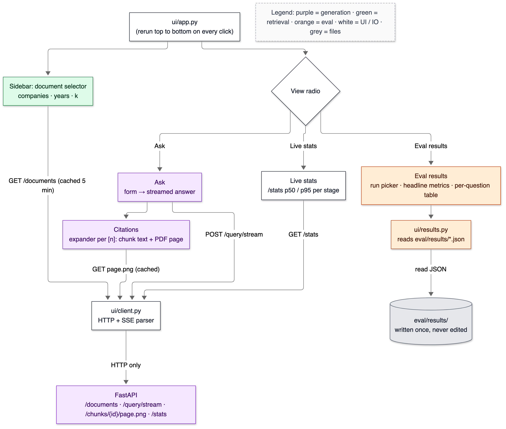
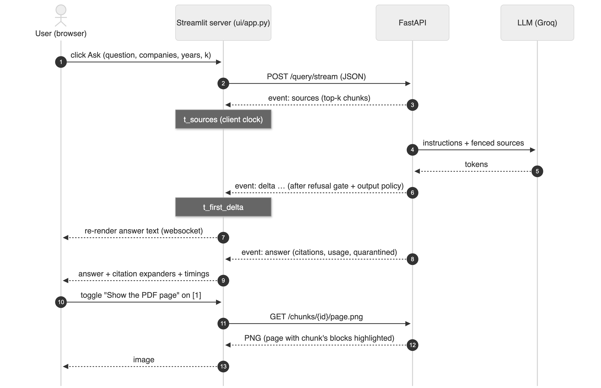
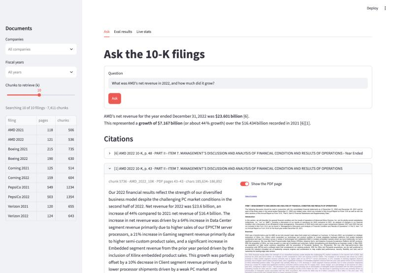
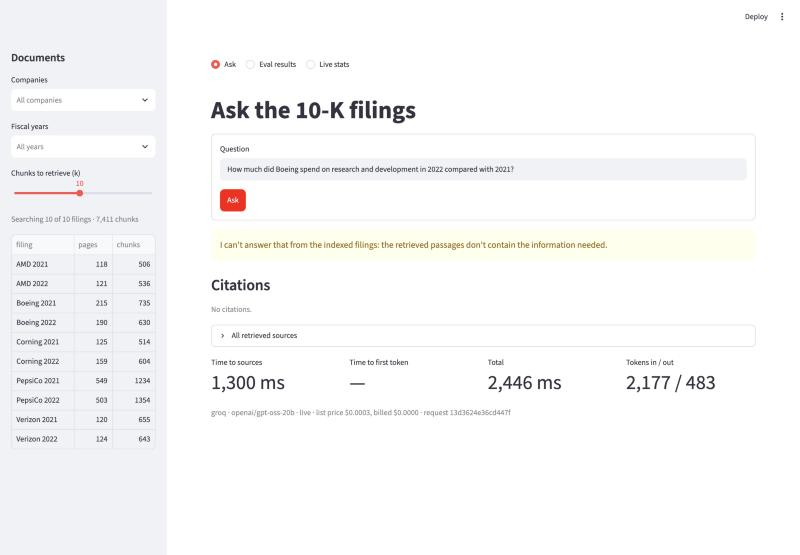
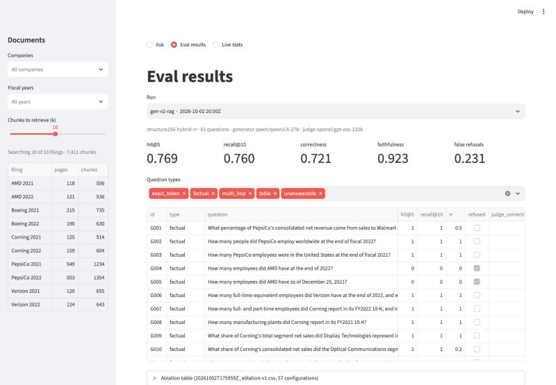
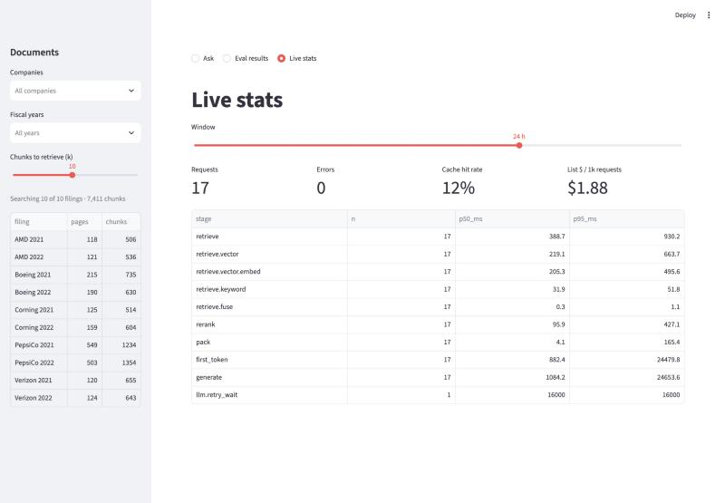

# 19 — Frontend

**Status:** written in Phase 15 (2026-10-03). Screenshots are from the real app. The live answers in them were generated by `openai/gpt-oss-20b` on Groq (labelled in each footer), because the production generator's daily quota was used up (T-063); the UI is model-agnostic.

## 1. In one paragraph

The demo UI is one Streamlit script, `ui/app.py`, plus two plain modules: `ui/client.py` (HTTP and **Server-Sent Events** parsing) and `ui/results.py` (reads eval result files). It has three views:
- **Ask:** a sidebar document selector (companies, years, k), a question box, and the answer streaming in. Every citation `[n]` expands to its exact chunk text, character span and the real PDF page with the cited blocks highlighted.
- **Eval results:** pick any saved run and see its headline metrics, per-question rows and the ablation table.
- **Live stats:** `/stats` p50/p95 per stage.

The UI talks to the system **only over HTTP**, enforced by a test. So it gets the same validation, injection guards, output policy and request log as any other client. A screenshot-level check found and fixed five UI bugs, the worst being that `$23.6 billion … $16.4 billion` rendered as LaTeX math.

## 2. Why it exists

Two reasons. First, the citation story (doc 13) is only convincing when you can *see* it: click [1], and the page the number came from appears with the sentence highlighted. Second, an interviewer will ask "can I try it?". A curl command doesn't demo. Without the UI, the eval results live in JSON files nobody opens, and the page-highlight data (block bounding boxes stored since Phase 2) is never shown to a human.

## 3. Where it sits


<details><summary>Same diagram as text (for terminal viewing)</summary>

```text
 OFFLINE
 ┌───────────┐  ┌───────┐  ┌───────┐  ┌───────┐   ┌─────────────────────────────┐
 │ PDF files │─▶│ Parse │─▶│ Chunk │─▶│ Embed │──▶│ Postgres 16                 │
 └───────────┘  └───────┘  └───────┘  └───────┘   │ pgvector + full-text search │
                                                  └──────────────┬──────────────┘
 ONLINE                                                          │ searched by
 ╔═══════════╗  ╔═════════╗     query     ┌──────────────────────▼──────────────┐
 ║ Streamlit ║─▶║ FastAPI ║──────────────▶│ Vector search  +  Keyword search    │
 ╚═════▲═════╝  ╚══╤═══▲══╝               └──────────────────────┬──────────────┘
       │    SSE    │   │ answer tokens                           │ two ranked lists
       └───────────┘   │                                         ▼
               ┌───────┴──────┐  ┌────────────────────┐  ┌────────┐  ┌────────────┐
               │ LLM (Groq)   │◀─│ Prompt + citations │◀─│ Rerank │◀─│ RRF fusion │
               └──────────────┘  └────────────────────┘  └────────┘  └────────────┘

 Double-line boxes (╔═╗) = this doc: the Streamlit UI and the API endpoints it calls
 (/documents, /query/stream, /chunks/{id}/page.png, /stats).
```
</details>

## 4. The flow



<details><summary>Same diagram as text (for terminal viewing)</summary>

```text
                    ┌──────────────────────────────────────┐
                    │ ui/app.py (reruns on every click)    │
                    └───────┬───────────────────┬──────────┘
                            ▼                   ▼
 ┌──────────────────────────────┐    ┌────────────────────┐
 │ Sidebar: document selector   │    │ View radio         │
 │ companies · years · k        │    └──┬──────┬──────┬───┘
 └──────────────┬───────────────┘  Ask  │ Live │ stats│ Eval results
                │                       ▼      ▼      ▼
                │        ┌─────────────────┐ ┌───────────┐ ┌──────────────────────┐
                │        │ Ask: form →     │ │ Live      │ │ Eval results: run    │
                │        │ streamed answer │ │ stats     │ │ picker · metrics ·   │
                │        └───┬─────────┬───┘ └─────┬─────┘ │ per-question table   │
                │            ▼         │           │       └──────────┬───────────┘
                │   ┌─────────────────┐│           │                  ▼
                │   │ Citations: chunk││           │       ┌──────────────────────┐
                │   │ text + PDF page ││           │       │ ui/results.py        │
                │   └───────┬─────────┘│           │       └──────────┬───────────┘
 GET /documents │  page.png │ POST     │ GET /stats│                  │ read JSON
                ▼           ▼ /query/stream        ▼                  ▼
 ┌─────────────────────────────────────────────────────┐   ┌──────────────────────┐
 │ ui/client.py — HTTP + SSE parser                    │   │ eval/results/*.json  │
 └──────────────────────────┬──────────────────────────┘   └──────────────────────┘
                            │ HTTP only
                            ▼
 ┌─────────────────────────────────────────────────────┐
 │ FastAPI                                             │
 └─────────────────────────────────────────────────────┘
```
</details>

One question, from click to highlighted page:



<details><summary>Same diagram as text (for terminal viewing)</summary>

```text
 User            Streamlit server            FastAPI                LLM (Groq)
  │ 1 click Ask        │                        │                        │
  │───────────────────▶│ 2 POST /query/stream   │                        │
  │                    │───────────────────────▶│                        │
  │                    │ 3 event: sources       │                        │
  │                    │◀───────────────────────│  (t_sources)           │
  │                    │                        │ 4 instructions+sources │
  │                    │                        │───────────────────────▶│
  │                    │                        │ 5 tokens               │
  │                    │ 6 event: delta …       │◀───────────────────────│
  │ 7 re-render text   │◀───────────────────────│  (t_first_delta)       │
  │◀───────────────────│ 8 event: answer        │                        │
  │ 9 answer+citations │◀───────────────────────│                        │
  │◀───────────────────│                        │                        │
  │ 10 toggle page [1] │                        │                        │
  │───────────────────▶│ 11 GET page.png        │                        │
  │                    │───────────────────────▶│                        │
  │ 13 image           │ 12 PNG (highlighted)   │                        │
  │◀───────────────────│◀───────────────────────│                        │
```
</details>

## 5. The code

### `ui/client.py` — the only door into the system

`Client` wraps an `httpx.Client` with five methods: `health`, `documents`, `stats`, `page_png`, `stream`. Any non-2xx response becomes `APIError(status, code, message)`, carrying the API's own error code (`unknown_company`, `llm_rate_limited`, …), so the UI can show "unknown_company: …" instead of a stack trace.

`parse_sse` implements the parts of the **SSE** format the API uses:
- an event is a block of `field: value` lines ended by a blank line;
- several `data:` lines join with newlines;
- lines starting with `:` are comments (keep-alives).

The API sends every payload as one JSON value, so a delta containing a newline (`"a\nb"`) stays inside one JSON string. That's the framing fix from Phase 10, and it is tested from both ends now.

`stream()` also keeps a **client-side clock** (`StreamTimings`): ms from sending the request to the `sources` event, to the first `delta`, and to the `answer`. That's the latency a person waits through, not the server's internal stage times. Example: in the Verizon screenshot it's 514 / 940 / 1,019 ms.

Why the UI never imports `app`: it then uses exactly the public contract. It gets the same 422s, the same injection quarantine, the same output policy, and its requests land in `request_log` like anyone's. It could be replaced by a React app without touching the backend. `tests/test_ui.py::test_ui_talks_to_the_system_only_over_http` walks the syntax tree of every file in `ui/` and fails on any `import app…`.

### `GET /chunks/{chunk_id}/page.png` — the citation preview (new endpoint)

`app/api/pages.py`:
1. Finds the document's PDF through `data/manifest.json`.
2. Checks that its **sha256** equals `documents.source_sha256`, the file that was ingested. A different file under the same name would put the boxes on the wrong text, so it's refused with `404 page_unavailable` instead.
3. Draws translucent rectangles over every parsed block that overlaps the chunk's character span (`repo.chunk_regions`, from Phase 2's stored bounding boxes).
4. Returns a PNG.

`dpi` is limited to 50–200, because rendering cost grows with dpi², and `page` must lie inside the chunk's own page range. The response is `cache-control: max-age=3600`, and the UI also caches images with `st.cache_data`.

### `ui/app.py` — Streamlit's model, and the four places it bit

**Streamlit** reruns the whole script, top to bottom, on every interaction: a click, a keystroke in a widget, a toggle. Three consequences shape the code:

- **State that must survive a click lives in `st.session_state`.** The last answer and its sources are stored there after the stream ends. Otherwise toggling "Show the PDF page" would rerun the script and the answer would vanish.
- **Slow, repeatable reads are cached.**
  - `st.cache_data(ttl=300)` on `/documents`.
  - `st.cache_data(max_entries=64)` on page images.
  - `st.cache_resource` on the HTTP client, so the connection pool is reused.
  - An exception isn't cached, so a UI started before the API recovers on reload (T-065).
- **Widgets must keep their own state across reruns.** The citation expander is opened with `expanded=session_state["show-n"]`. Without it, switching on the page toggle *inside* the expander reruns the script and closes the expander again (T-066).

The view selector is a horizontal `st.radio`, not `st.tabs`. Tabs run *every* tab's code on every rerun: a `/stats` request per keystroke. And a data grid drawn in a hidden tab came out at zero width (T-067). A radio runs only the selected view.

Answer text goes through `safe_markdown`. It HTML-escapes, defuses `![`, and escapes `$`. Streamlit markdown treats `$…$` as LaTeX, so "$23.6 billion … $16.4 billion" rendered as italic math until this fix (T-068). The `![` escape is a second layer behind the API's output policy (doc 18): the UI would not render an image even if one got through.

**Streaming in Streamlit.** Inside the form handler, an `st.empty()` placeholder is rewritten with each delta (`box.markdown(text + " ▌")`). The Streamlit server pushes each rewrite to the browser over its websocket. When the `answer` event arrives, the placeholder is cleared, and the final answer is rendered with its citations from session state.

### `ui/results.py` — eval results, read straight from disk

`list_runs()` parses the `YYYYMMDDTHHMMSSZ_name.json` file names, newest first. It hides the 54 ablation cells (`abl-*`) and partial `-batch` files. `headline()` flattens the summary into the numbers a reader wants first. A closed-book run is labelled "no retrieval", not with a retrieval config it never used. `injection_table()` turns an attack-suite file into one row per attack. There is deliberately no API endpoint for results: they're artefacts of offline runs, written once and never edited (Phase 11), not part of the serving system.

### Tests: `tests/test_ui.py` (7)

- The HTTP-only import rule.
- The SSE parser (comments, ids, multi-line data, unterminated final event).
- `Client` against the real FastAPI app through `TestClient` (sources → deltas → answer, timings in order, errors raised both before and during the stream).
- The results reader against the real Phase 12 files: hit@5 0.7692, correctness 0.721, default run `gen-v2-rag`.
- The **Streamlit app itself**, run headless with `streamlit.testing.v1.AppTest` and a fake client. It submits a question and asserts the escaped answer, the quarantine warning, the citation expander and the three timing metrics.

## 6. Data in / data out

**The answer view** (live, `openai/gpt-oss-20b`, question not cached):


Field by field:
- the answer "Verizon had approximately **117,100** full-time-equivalent employees as of December 31, 2022. [1]";
- one citation, "[1] Verizon 2022 10-K, p. 12 · PART I › Item 1. Business › Human Capital Resources";
- time to sources 514 ms, first token 940 ms, total 1,019 ms;
- tokens 2,212 in / 122 out;
- footer: `groq · openai/gpt-oss-20b · live · list price $0.0002, billed $0.0000`.

117,100 is the golden answer to G006.

**A citation opened on its page** (AMD 2022 10-K, PDF page 43, chunk 5736, chars 185,634–186,892; the purple box is the highlighted paragraph):



**A refusal**: "How much did Boeing spend on research and development in 2022 compared with 2021?" The retrieved passages didn't contain it, so the model refused. Time to first token shows "—" because the refusal gate (Phase 10) never releases a delta for a refusal. Total 2,446 ms.



**Eval results** (the Phase 12 RAG run, the default selection): hit@5 0.769 · recall@10 0.760 · correctness 0.721 · faithfulness 0.923 · false refusals 0.231. These are the same numbers as doc 16, read from `20261002T205049Z_gen-v2-rag.json`.



**Live stats** (`/stats`, 24 h window, 17 requests, list $1.88 per 1k requests, cache hit rate 12%):



## 7. Decisions & alternatives

<!-- card:start id=42 -->
#### Decision: Streamlit, in Python, calling the API over HTTP  (rejected: React + TypeScript SPA; Gradio; server-rendered HTML with htmx; Jupyter widgets)

**One-line defence.** The UI's job is to demonstrate retrieval, citations and evals to an interviewer, not to be a product. Streamlit got all three views built and tested in one phase, in the language the rest of the system uses, with a headless test runner.

**What problem is this even solving?** A human-usable way to ask questions, watch the answer stream, check every citation against its PDF page, and browse eval results, without writing a frontend build chain.

**The options, compared.**

| Option | How it works (1 line) | Strengths | Weaknesses | When it's the right call |
|---|---|---|---|---|
| ✅ Streamlit | A Python script re-run per interaction; widgets pushed over a websocket | One language; dataframes, images, metrics built in; `AppTest` for headless tests | Rerun model (4 of the 5 UI bugs here came from it); limited layout control; a server process per app; not built for many concurrent users | Demos, internal tools, data apps |
| React + TypeScript SPA | Browser app consuming the SSE stream directly | Full control; true per-token rendering; scales as static files | Build chain, second language, state management, its own tests; days not hours | A product with real users |
| Gradio | Python components with a chat widget | Very fast chat demos | Less suited to the eval-browser and page-preview views | ML model demos |
| htmx + server templates | FastAPI renders HTML; htmx swaps fragments; SSE extension | One server, no JS build | More hand-written UI code than Streamlit | Simple CRUD plus streaming |
| Jupyter | Notebook cells | Zero setup for the author | Not a demo for someone else | Exploration only |

**What would actually change if we swapped it.**
- **React:** replace `ui/` with a TypeScript app; reuse the API unchanged (the HTTP-only rule makes that possible). Port the SSE parser to the browser's `EventSource`. One snag: `EventSource` only sends GET, so it would need either a fetch-based reader or a GET variant of `/query/stream`.
- **Cost:** roughly a few days of work (my estimate).
- **Gains:** true per-token rendering in the browser, and no Streamlit server process.

**The decision rule.** Use the tool in your backend language while the UI is a window onto the system. Switch to a real frontend stack when the UI becomes the product: many users, custom interaction, design requirements.

**Where our choice breaks.**
- **Every user is a Python session on the Streamlit server**, and each rerun re-executes the script. Fine for a demo, wrong for 100 concurrent users.
- **Streaming is server-relayed.** Tokens go API → Streamlit server → websocket → browser, adding a hop; the API itself stays SSE.
- **Migration path:** the API contract doesn't change; build the SPA against it.

**The number.** Client-side, measured by the UI on three live questions (gpt-oss-20b): sources 514–1,300 ms, first token 940–2,178 ms, total 1,019–2,446 ms. The slowest is the first question after idle (cold GPU, doc 17). 7 UI tests, including a headless run of the app, in about 6–9 s.

**Interview script (3 sentences).** "The UI is a Streamlit script that talks to the API only over HTTP, which a test enforces, so it gets exactly the validation, injection guards and logging any client would. It streams the answer, and each citation opens the real PDF page with the cited blocks highlighted, from bounding boxes stored at parse time. I chose Streamlit because the UI is a demo of the system, not the product. The API contract is what would let a React app replace it without backend changes."

**Follow-ups they will ask:**
- Q: How does streaming work through Streamlit? → A: The Streamlit server reads the API's SSE stream and rewrites an `st.empty()` placeholder per delta; Streamlit pushes each update to the browser over its websocket. It's a relay, not browser-side SSE.
- Q: Why not import the pipeline directly; wouldn't it be faster? → A: It would skip a network hop, but also validation, the injection guards and the request log. The UI would test a different system than the API serves.
- Q: How do you test a Streamlit app? → A: `streamlit.testing.v1.AppTest` runs the script headless. I inject a fake client, set the text input, click the button and assert on the rendered markdown, errors, expanders and metrics.
- Q: What broke? → A: Five things: `$` rendered as LaTeX; the expander closed on its own toggle; hidden-tab grids at zero width; a stale imported module after editing; and a UI started before the API showed an error until reload. Four of them come from the rerun model.
- Q (the hard one): Would this survive 100 concurrent users? → A: Not well. Each session is a Python thread rerunning the script, and each stream holds a connection to the API through the Streamlit server. I haven't load-tested it. For real users I'd serve a static SPA that talks to the API directly.

**The trap.** Presenting a Streamlit demo as the production frontend.
<!-- card:end -->

## 7a. Prerequisite concepts

**Streamlit's execution model.** A normal web app keeps running code and changes what it shows. A Streamlit app is a script that runs from the first line to the last, building the page as it goes. A click doesn't call a handler; it reruns the script with the widget's new value. Worked example from this UI:
1. You submit a question. The script reruns with `submitted=True`, streams, and saves the answer in `session_state`.
2. You toggle the page preview. The script reruns with `submitted=False`, so the streaming block is skipped, and the answer is drawn from `session_state`.

Lose `session_state` and step 2 shows an empty page.

**Session state vs cache.** `st.session_state` is per browser session (this user's last answer). `st.cache_data` is shared by all sessions and keyed by the function arguments (the document list, a page image). Put user-specific data in the cache and users see each other's answers. Put shared data in session state and every user refetches it.

**SSE (Server-Sent Events).** A long HTTP response in which the server writes events as `event: …` / `data: …` lines separated by blank lines. It runs one way (server to client) over plain HTTP, which is why the API uses it for tokens. Doc 14 owns the server side; `ui/client.py::parse_sse` is the client side.

**Perceived latency.** What the user feels is time to the first visible change, not total time. Here: 514 ms until "Retrieved 10 sources", 940 ms until the first words, 1,019 ms to the end. Streaming matters most when generation is long. For short answers like these, the gap between first token and done was only 79 ms.

## 7b. What if we used something else?

| Instead of… | We could use… | What changes | Why we didn't |
|---|---|---|---|
| Streamlit | React + TypeScript | Per-token rendering in the browser; static hosting | Days of work for a demo |
| Streamlit | Gradio `ChatInterface` | Chat UI in a few lines | Eval browser and page preview fit Streamlit's widgets better |
| `st.radio` views | `st.tabs` | Familiar tabs | Runs every tab per rerun; zero-width hidden grids (T-067) |
| Page PNG from the API | PDF.js in the browser with highlight overlays | Zoomable, selectable text | A JS viewer and serving PDFs to the browser |
| Results from disk | An API endpoint | Remote viewers | Results are offline artefacts, not part of serving |

## 8. Failure modes

| Symptom | Cause | Fix |
|---|---|---|
| "API not reachable at http://127.0.0.1:8000: … Connection refused" | UI started before the API finished loading models (T-065) | Reload; errors aren't cached |
| Citation expander closes when "Show the PDF page" is switched on | Rerun redraws the expander collapsed (T-066) | `expanded=` bound to the toggle's session state |
| A data grid is blank or one narrow column | Rendered in a hidden `st.tabs` tab (T-067) | Radio view selector |
| "$23.6 billion … $16.4" in italics, dollar signs missing | Streamlit LaTeX on `$…$` (T-068) | Escape `$` in `safe_markdown` and captions |
| `AttributeError: module 'ui.results' has no attribute 'default_index'` after an edit | Streamlit reloads the script but not modules it already imported (T-069) | Restart `make ui` after editing `ui/client.py` or `ui/results.py` |
| `ERROR: Invalid requirement: 'jsonschema-specifications==2025.9.1# Phase 15 …'` | No space before `#` (T-070) | Fixed; `test_inline_comments_are_separated_by_whitespace` |
| "Page preview unavailable: … differs from the ingested file (sha256 mismatch)" | The PDF on disk isn't the one that was ingested | `make corpus` restores the pinned files |

## 9. Try it yourself

```bash
make serve
```

In a second terminal:

```bash
make ui
```

Expected: Streamlit prints `Local URL: http://127.0.0.1:8501`. The sidebar says "Searching 10 of 10 filings · 7,411 chunks". Ask "How many full-time-equivalent employees did Verizon have at the end of 2022?" and expect an answer containing 117,100 with one citation to Verizon 2022 10-K, p. 12. Open it and switch on "Show the PDF page".

```bash
curl -s -o /tmp/page.png -w '%{http_code} %{content_type}\n' 'localhost:8000/chunks/5736/page.png?dpi=80'
```

Expected: `200 image/png`.

```bash
.venv/bin/pytest -q tests/test_ui.py
```

Expected: `7 passed`.

## 10. Numbers

| What | Number | Source |
|---|---|---|
| Client-side time to sources / first token / done, live (3 questions) | 514–1,300 / 940–2,178 / 1,019–2,446 ms | UI metrics (`StreamTimings`), screenshots §6 |
| Same, from the response cache | 602 / 620 / 635 ms | second run of the AMD question |
| Fastest live answer (Verizon headcount) | 514 / 940 / 1,019 ms; 2,212 tokens in / 122 out | §6 screenshot |
| UI tests | 7, including a headless app run | `pytest tests/test_ui.py` |
| New dependencies | streamlit 1.65.0 + 14 transitive, all pinned | `requirements.txt` |

**What the numbers don't show.** Three questions on one laptop with one model, measured from the Streamlit server process (the browser's render time is not included). The production generator (qwen3.8-27b) wasn't available for UI timing. Doc 17 has its server-side latency: first token 402 ms, full answer 862 ms, median of 4.

## 11. Interview talking points

- "Click a citation and you see the actual PDF page with the cited paragraph highlighted. That comes from block bounding boxes stored at parse time, and the API refuses to draw them if the PDF's sha256 differs from the ingested file."
- "The UI only talks HTTP, and a test enforces it, so the demo exercises the same guards and logging as any client."
- "Streamlit's rerun model caused four of my five UI bugs; the fix each time was explicit state: session state, cached reads, an expander bound to its toggle."
- "Perceived latency was 940 ms to the first token on a live question. The answer was short, so streaming saved only 79 ms there; it matters for long answers."

## 12. Check yourself

1. Why does the last answer live in `st.session_state` and not in a variable?
2. Why is the document list in `st.cache_data`, but the last answer is not?
3. The UI could import `answer_question` and skip HTTP. Name two things it would silently stop testing.

<details><summary>Answers</summary>

1. Every click reruns the script from the top, so a local variable is recreated empty. Toggling the page preview would erase the answer. Session state survives reruns, per browser session.
2. The document list is the same for every user and changes rarely: cache it once, shared, for 5 minutes. The answer belongs to one user's session; a shared cache keyed by function arguments is the wrong scope for it.
3. Any two of:
   - request validation (the NUL-byte 422);
   - the SSE framing and refusal gate;
   - the request log;
   - and, if it called lower functions, the API's error classification (`llm_rate_limited`, `unknown_company`).
</details>

## 13. New terms added to the glossary

Streamlit rerun model · Session state · `st.cache_data` / `st.cache_resource` · Server-Sent Events (client side) · Perceived latency · AppTest (headless Streamlit testing) · Citation preview
