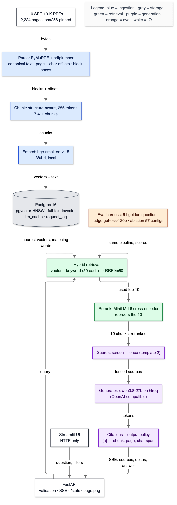

# 20 — Deployment and demo

**Status:** written in Phase 16 (2026-10-03). The fresh-clone run below was executed from `https://github.com/Deoxy7/rag-assistant` at commit `984758c`, on the build machine, into a separate directory and a separate Postgres container.

## 1. In one paragraph

"Deployment" here means one thing: someone clones the repository and gets the same system and the same numbers. The project runs locally, with Postgres in Docker (via Colima) and Python on the host. Two Make targets bring it up from nothing: `make ingest` (venv, pinned packages, database, sha256-verified corpus, parse, chunk, embed, index) and `make test`. The proof is a **fresh-clone run**: clone from GitHub into an empty directory, with its own database container on another port, no API key and no cached data. Run everything, then compare the retrieval eval to the published baseline. Result: in 8 minutes from `git clone` to a scored eval (483 s of steps), **479 of 479 tests pass**, and the retrieval eval is **identical to the published baseline**: hit@5 0.769, recall@10 0.760, nDCG@10 0.523, MRR 0.535, abstention AUROC 0.662. Per question, all 18 retrieval metrics agree on all 61 questions, and 60 of 61 retrieved lists are identical. This doc also has the five-minute demo, as a script (`make demo`) and as a talk track for the UI.

## 2. Why it exists

A number nobody else can reproduce is an anecdote. This project's claims are numbers: hit@5 0.769, correctness 0.721, 6 → 1 attacks. Each depends on pinned versions, pinned PDFs, a pinned embedding model revision and a golden file with a known hash. The fresh-clone run tests that whole chain at once. If any pin were missing (a package installed by hand, a file only on my disk, a model downloaded once and never recorded), it would fail here, not in front of an interviewer. The demo exists because an interviewer gives you five minutes, and the system's best features (cited pages, refusals, the eval) have to be visible in that time.

## 3. Where it sits



<details><summary>Same diagram as text (for terminal viewing)</summary>

```text
 ┌──────────────────────────────┐
 │ 10 SEC 10-K PDFs             │
 │ 2,224 pages, sha256-pinned   │
 └──────────────┬───────────────┘
                │ bytes
                ▼
 ┌──────────────────────────────┐
 │ Parse: PyMuPDF + pdfplumber  │
 │ canonical text · offsets ·   │
 │ block boxes                  │
 └──────────────┬───────────────┘
                │ blocks + offsets
                ▼
 ┌──────────────────────────────┐
 │ Chunk: structure, 256 tokens │
 │ 7,411 chunks                 │
 └──────────────┬───────────────┘
                │ chunks
                ▼
 ┌──────────────────────────────┐
 │ Embed: bge-small-en-v1.5     │
 └──────────────┬───────────────┘
                │ vectors + text
                ▼
 ┌──────────────────────────────┐     ┌─────────────────────────────────┐
 │ Postgres 16: pgvector HNSW · │     │ Eval harness: 61 golden q ·     │
 │ tsvector · llm_cache ·       │     │ judge gpt-oss-120b · 57 configs │
 │ request_log                  │     └────────────────┬────────────────┘
 └──────────────┬───────────────┘                      │ same pipeline, scored
                │ nearest vectors, matching words      │
                ▼                                      ▼
 ┌─────────────────────────────────────────────────────────────────────┐
 │ Hybrid retrieval: vector + keyword (50 each) → RRF k=60             │
 └───────────────────────────────▲───────────────────┬─────────────────┘
                                 │ query             │ fused top 10
                                 │                   ▼
                                 │     ┌───────────────────────────────┐
                                 │     │ Rerank: MiniLM-L6 (reorders)  │
                                 │     └─────────────┬─────────────────┘
                                 │                   │ 10 chunks, reranked
                                 │                   ▼
                                 │     ┌───────────────────────────────┐
                                 │     │ Guards: screen + fence        │
                                 │     └─────────────┬─────────────────┘
                                 │                   │ fenced sources
                                 │                   ▼
                                 │     ┌───────────────────────────────┐
                                 │     │ Generator: qwen3.8-27b (Groq) │
                                 │     └─────────────┬─────────────────┘
                                 │                   │ tokens
                                 │                   ▼
 ┌──────────────────┐            │     ┌───────────────────────────────┐
 │ Streamlit UI     │            │     │ Citations + output policy     │
 │ (HTTP only)      │            │     │ [n] → chunk, page, char span  │
 └────────┬─────────┘            │     └─────────────┬─────────────────┘
          │ question, filters    │                   │ SSE: sources, deltas, answer
          ▼                      │                   ▼
 ┌─────────────────────────────────────────────────────────────────────┐
 │ FastAPI: validation · SSE · /stats · /chunks/{id}/page.png          │
 └─────────────────────────────────────────────────────────────────────┘
```
</details>

## 4. The flow

From an empty directory to a scored eval, each step with what it guarantees:

| Step | Command | What it pins or checks |
|---|---|---|
| 1 | `git clone …` | Code, golden set, migrations, manifest with sha256 of every PDF |
| 2 | `cp .env.example .env` | All settings have documented defaults; keys stay empty |
| 3 | `make install` | Python 3.11 venv; every package `==`-pinned (direct + transitive); `test_environment.py` fails if the venv differs |
| 4 | `make up` | Postgres 16 + pgvector 0.8.7 pulled **by digest**, bound to 127.0.0.1 |
| 5 | `make corpus` | Downloads the 10 filings + FinanceBench files; refuses any file whose sha256 differs |
| 6 | `make ingest` | Migrations, parse (parser version recorded), chunk, embed with the pinned model revision, build HNSW |
| 7 | `make test` | The full suite, against the freshly ingested database |
| 8 | `make eval NAME=…` | The golden set scored; the result file records git commit and golden-file sha256 |

## 5. The code

There is almost no new code in this phase. That's the point: packaging should be the existing targets, run in order.

- **`scripts/demo.py`** (`make demo`): four questions through the running API using `ui/client.py`, so it goes over HTTP like any client. For each it prints the answer, every citation (chunk id, character span, and the page-preview URL), and the client-side timings. The four show:
  1. a cited single fact;
  2. a table figure plus the change between years;
  3. the company filter;
  4. a question about a company not in the corpus, which must be refused.
- **Isolation for the fresh clone.** `docker-compose.yml` names the project `rag-assistant`, so a second checkout would otherwise attach to the *same* container and database. The clone's `.env` sets `COMPOSE_PROJECT_NAME=rag-fresh` and `POSTGRES_PORT=5433`. Compose then creates a new container and an empty volume, so nothing from the build machine's database can leak in. `LLM_PROVIDER=fake` stands in for "no API key".
- **`docs/diagrams/src/20-final-architecture.mmd`**: the as-built system with its measured defaults on the boxes.

## 6. Data in / data out

The fresh-clone log, step by step (wall-clock seconds on the 8 GB M1):

| Step | Command | Seconds | Result |
|---|---|---|---|
| clone | `git clone -q https://github.com/Deoxy7/rag-assistant` | 3 | commit `984758c` |
| install | `make install` | 40 | venv + all pins (warm pip cache; a cold install downloads torch and is much longer, not measured) |
| up | `make up` | 6 | new container `rag-fresh-db-1`, empty volume |
| corpus | `make corpus` | 18 | `corpus OK: 12 files verified against data/manifest.json` |
| ingest | `make ingest` | 360 | migrations 0001–0005 applied; parse, chunk, embed, index (models downloaded into the clone's `data/models/`) |
| test | `make test` | 38 | `479 passed in 34.53s` |
| eval | `make eval NAME=fresh-clone` | 18 | `eval/results/20261002T231122Z_fresh-clone.json` |
| **total** | | **483** | |

Retrieval eval from the fresh clone vs the published baseline (`20261002T163255Z_phase11-baseline.json`):

```text
fresh-clone: 61 questions (52 answerable) · structure/256 · mode hybrid · rerank True · chunk set 1
  hit@5 0.769 [0.65–0.88]  recall@5 0.731 [0.61–0.84]  recall@10 0.760 [0.64–0.87]  ndcg@10 0.523 [0.42–0.62]  rr 0.535 [0.42–0.64]
  retrieval-only abstention: AUROC 0.662 · catch 0.44 costs 0.13 false refusals (t=2.38) · catch 0.67 costs 0.29 false refusals (t=4.30) · catch 1.00 costs 0.88 false refusals (t=8.79)
```

| | Published (build machine, commit `ad4247c`) | Fresh clone (commit `984758c`) |
|---|---|---|
| hit@1 / hit@5 / hit@10 | 0.404 / 0.769 / 0.808 | identical |
| recall@10 · nDCG@10 · MRR | 0.760 · 0.523 · 0.535 | identical |
| Per-question metrics (18 × 61) | — | 0 differences |
| Retrieved top-10 lists | — | 60 / 61 identical; G042 differs only at rank 10 (chunk 19 vs 1254), changing no metric |
| Top reranker score per question | — | max difference 0.0 |
| Golden file sha256 | `733f8fe40883…` | `733f8fe40883…` |

The G042 difference: I'm not sure of the cause. The likeliest is a near-tie at the bottom of the fused list resolved differently, or a slightly different HNSW graph built in the new database. A reviewer could check it by comparing the two databases' fused scores for that question. It's the kind of variation a reproducibility check exists to surface; it doesn't change any reported number.

## 7. Decisions & alternatives

<!-- card:start id=x-local-deploy -->
#### Decision: local-first packaging (Make + Docker Compose for Postgres, app on the host), verified by a fresh-clone run  (rejected for now: full Docker image of the app; a cloud deployment; a hosted demo)

**One-line defence.** The deliverable is reproducible numbers on a laptop. A fresh clone with no key and no cache reaches the same retrieval scores using the same Make targets I used. Measured: 479/479 tests and identical retrieval metrics on all 61 questions.

**What problem is this even solving?** Letting a reviewer rebuild the system and the measurements without my machine, my keys or my judgement calls.

**The options, compared.**

| Option | How it works (1 line) | Strengths | Weaknesses | When it's the right call |
|---|---|---|---|---|
| ✅ Make + Compose (DB only), app on host | Pinned venv + DB container by digest | Fast edit-run loop; MPS GPU usable; small VM (2 GB) | Needs Python 3.11, Colima and Docker on the host; macOS-tested only | Development, teaching, demos |
| App in Docker too | A Dockerfile for API + UI | One command anywhere; closer to production | No MPS GPU inside the Linux VM, so CPU-only embedding and reranking (slower; doc 07); a larger VM on an 8 GB machine | Linux servers, CI |
| Cloud deploy (e.g. a VM + managed Postgres) | Public URL | Demo without setup | Cost; secrets management; the corpus licence and the API key are now internet-facing; injection guards become essential | A product |
| Hosted demo (Streamlit Community Cloud) | Push and share | Zero setup for viewers | Needs the DB and models hosted somewhere; free tiers are small | Showing the UI only |

**What would actually change if we swapped it.** A Dockerfile per service, a compose service for the API and the UI, model weights baked into the image or a volume (~200 MB), and a CPU-only torch wheel. Query embedding on CPU was 21–38 ms after idle vs 84–226 ms on an idle MPS GPU (doc 17), so latency might even improve for single queries. Batch ingest would be ~2.5× slower (Phase 4: 116 vs 46 chunks/s).

**The decision rule.** Containerise what must be identical everywhere (the database, pinned by digest). Leave on the host what benefits from the host (the GPU) while there's one developer. Containerise the app when there's a second machine to deploy to.

**Where our choice breaks.**
- On Linux or Windows hosts, which aren't tested (MPS is macOS-only; the code falls back to CPU, but that path isn't benchmarked).
- For anyone without Python 3.11.
- **Migration path:** add the app Dockerfile and a CI job that runs the fresh-clone script on every push.

**The number.** Fresh clone → scored eval in 483 s; 479/479 tests; hit@5 0.769 = published; 0 differences across 18 metrics × 61 questions; 60/61 retrieved lists identical (`eval/results/20261002T231122Z_fresh-clone.json`).

**Interview script (3 sentences).** "Everything that affects a number is pinned: packages with `==`, the Postgres image by digest, the PDFs by sha256, the embedding model by revision, the golden set by hash in every result file. I proved it by cloning the repo into an empty directory with its own database and no API key, and running install, ingest, tests and the eval. All 479 tests passed and every retrieval metric matched the published baseline on all 61 questions; one retrieved list differed at rank 10 without changing any score."

**Follow-ups they will ask:**
- Q: Why isn't the app in Docker? → A: On this Mac, Docker runs in a Linux VM with no access to the Apple GPU, so embedding and reranking would be CPU-only. It's the right next step for CI or a server; it's the wrong trade on an 8 GB laptop for development.
- Q: What did the fresh clone catch? → A: Nothing broken this time, which is the useful result, plus one honest difference: G042's 10th result differs (no metric changes). It also forced the isolation fix: without `COMPOSE_PROJECT_NAME` the clone would have silently used my existing database. The pip comment bug (T-070) was caught by the same kind of clean install one phase earlier.
- Q: How do you keep secrets out of the repo? → A: `.env` is git-ignored, keys are `SecretStr` (never in repr or logs), and before every push I scan the outgoing history for key patterns. The fresh clone ran with no keys at all, on the deterministic fake model.
- Q: Is the eval deterministic? → A: Retrieval is: same pins, same scores, and the fresh-clone run is the check. LLM answers are made reproducible by the response cache, keyed by the full prompt; a fresh clone has an empty cache, so its generated answers would differ in wording.
- Q (the hard one): Would this work on a colleague's Linux laptop? → A: I believe so: the code falls back to CPU, and Compose is the same. But I haven't run it. "I believe so" is exactly what a CI job on Linux would turn into a fact.

**The trap.** Claiming reproducibility without having reproduced anything from a clean checkout.
<!-- card:end -->

## 7a. Prerequisite concepts

**Reproducibility vs repeatability.** Repeatable: I get the same result twice on my machine. Reproducible: someone else gets it from the artefacts alone. The fresh clone is a cheap stand-in for "someone else": a new directory, a new database, no cache, no keys.

**Pinning layers.** Each layer that can drift needs its own pin:
- source code (git commit);
- packages (`==` versions, transitive included);
- the database (image digest, not tag: tags can be re-pushed, digests cannot);
- data (sha256 per file);
- models (Hugging Face revision hash);
- labels (golden file sha256, recorded in each result).

Miss one and the numbers can move with no code change.

**Isolation.** Two checkouts on one machine share anything with a fixed name: Compose project names, ports, volumes, cache directories. Isolating them means renaming each one. Here: `COMPOSE_PROJECT_NAME`, `POSTGRES_PORT`, and a separate `data/` directory, which holds the model cache too.

## 7b. What if we used something else?

| Instead of… | We could use… | What changes | Why we didn't |
|---|---|---|---|
| Make targets | `just`, `tox`, `nox`, shell scripts | Similar | Make is preinstalled on macOS and Linux |
| Hand-pinned `requirements.txt` | `uv`/`pip-tools` lockfile with hashes | Hash-pinned artefacts, auto-generated | The file carries a per-package "why"; hashes are a next step |
| Colima | Docker Desktop | GUI; licence terms for companies | Colima is free and lighter (agreed in Phase 0) |
| Fresh clone on the same machine | CI runner (GitHub Actions) | A truly different machine | No CI configured; macOS runners can't run Colima-in-VM cheaply |

## 8. Failure modes

| Symptom | Cause | Fix |
|---|---|---|
| Second checkout's tests see the first checkout's data | Shared Compose project `rag-assistant` | `COMPOSE_PROJECT_NAME` + `POSTGRES_PORT` in that checkout's `.env` |
| `set POSTGRES_USER in .env (copy .env.example)` | No `.env` | `cp .env.example .env` |
| `MissingAPIKey: LLM_PROVIDER=groq but GROQ_API_KEY is empty` | Defaults expect Groq | Add the key, or `LLM_PROVIDER=fake` |
| `corpus` refuses a file | sha256 mismatch (partial download or changed upstream) | Delete it and rerun `make corpus` |
| `ERROR: Invalid requirement …` | A malformed pin (T-070) | Fixed; `test_inline_comments_are_separated_by_whitespace` |
| Demo prints `API not reachable` | `make serve` not running, or still loading models | Start it; wait for `models ready` in its log |

## 9. Try it yourself

The whole fresh-clone check (about 8 minutes on the build machine, with a warm pip cache):

```bash
git clone https://github.com/Deoxy7/rag-assistant /tmp/rag-fresh && cd /tmp/rag-fresh && cp .env.example .env && printf '\nCOMPOSE_PROJECT_NAME=rag-fresh\nLLM_PROVIDER=fake\n' >> .env && sed -i '' 's/^POSTGRES_PORT=5432/POSTGRES_PORT=5433/' .env
```

```bash
make ingest && make test && make eval NAME=fresh-clone
```

Expected: the test summary line shows all passing, and the eval prints hit@5 0.769 for the default configuration (§6).

The demo, with the API running:

```bash
make demo
```

Expected: four blocks, the last one refused. Real output, abridged (2026-10-03, API started with `LLM_MODEL=openai/gpt-oss-20b` because Qwen's daily quota was spent; questions 1 and 2 had been asked in the UI earlier, so they came from the response cache):

```text
── 1. A single fact, cited to its page ──────────────────────────────────────
Q: How many full-time-equivalent employees did Verizon have at the end of 2022?
A: Verizon had approximately **117,100** full‑time‑equivalent employees as of December 31, 2022. [1]
   [1] Verizon 2022 10-K, p. 12 · chunk 3324 · chars 53,865–55,003 · preview: http://127.0.0.1:8000/chunks/3324/page.png
   sources 335 ms · first token 345 ms · done 354 ms · 2,212 in / 122 out · openai/gpt-oss-20b (cached)
── 3. The company filter ────────────────────────────────────────────────────
Q: What were total net sales in 2022?   [filter: Corning]
A: Total net sales for Corning in 2022 were $14.2 billion (about $14,189 million)[2][6][10]
   sources 558 ms · first token 1,659 ms · done 1,734 ms · 2,770 in / 235 out · openai/gpt-oss-20b
── 4. Not in the filings: the system should refuse ──────────────────────────
Q: What was Apple's revenue in fiscal 2022?
A: I can't answer that from the indexed filings: the retrieved passages don't contain the
   information needed.
   refused (model)
   sources 146 ms · first token — · done 923 ms · 2,103 in / 88 out · openai/gpt-oss-20b
```

Question 3 shows the filter at work: "total net sales" names no company, and the filter makes the answer Corning's.

### The five-minute demo (talk track)

1. **(30 s) The problem.** Open the Eval results view on the closed-book run: correctness 0.067. "This is the same model with no documents."
2. **(90 s) Ask.** "How many full-time-equivalent employees did Verizon have at the end of 2022?" Point at sources arriving first, then the answer. Open [1], switch on "Show the PDF page": the highlighted paragraph is where 117,100 comes from. "The model only wrote [1]; code mapped it to this page and these characters."
3. **(45 s) Refusal.** Ask about a company that isn't in the corpus. "It refuses instead of answering from memory; 9 of 9 unanswerable questions in the eval."
4. **(90 s) The eval.** Switch to the RAG run: hit@5 0.769, correctness 0.721, false refusals 0.231. Open the ablation table: "57 configurations; reranking helps in 23 of 27 pairs; nothing beat the default significantly, and my own test set flatters keyword search, which is why I kept hybrid."
5. **(45 s) Security and ops.** "Poisoned documents: 6 of 28 attacks got through before, 1 after." Then Live stats: p50/p95 per stage, cost per thousand requests.

## 10. Numbers

| What | Number | Source |
|---|---|---|
| Fresh clone: wall-clock per step | clone 3 · install 40 (warm cache) · up 6 · corpus 18 · ingest 360 · test 38 · eval 18 = 483 s | §6 |
| Fresh clone: tests | 479 / 479 passed in 34.5 s | §6 |
| Fresh clone: retrieval eval vs published | identical: hit@5 0.769, recall@10 0.760, MRR 0.535; 0 per-question differences; 60/61 lists identical | §6 |
| Pinned packages | 111 (`==`, direct + transitive) | `requirements.txt` |
| Tests on the build machine | 483 passed (`make test`, 2026-10-03) | `make test` |

## 11. Interview talking points

- "I cloned my own repo into an empty directory with its own database and no API key, and got the same retrieval numbers. 479 of 479 tests, hit@5 0.769 on both, in 8 minutes; the one difference I found, a rank-10 swap on one question, is written up rather than hidden."
- "Every layer that can drift is pinned separately: packages, the DB image by digest, PDFs by sha256, the model by revision, labels by hash."
- "The demo is five minutes because the best features are visual: click a citation and see the highlighted page; ask about Apple and get a refusal."

## 12. Check yourself

1. Why does the fresh clone set `COMPOSE_PROJECT_NAME`, and what would happen without it?
2. Which pin would you lose first if you installed one package with `pip install` and forgot to add it, and which test catches it?
3. Why would a fresh clone reproduce the retrieval numbers exactly, but not the generated answers?

<details><summary>Answers</summary>

1. `docker-compose.yml` names the project `rag-assistant`. Without an override the second checkout attaches to the same container and volume, so its "fresh" tests run against the already-ingested database and prove nothing. With `rag-fresh` and port 5433 it gets an empty database.
2. The package pin: the venv now contains something `requirements.txt` doesn't, so `tests/test_environment.py::test_venv_matches_requirements_exactly` fails.
3. Retrieval is deterministic given the pinned PDFs, parser, chunker, model revision and index. Generation depends on a remote model that samples. The build machine reproduces its answers from the response cache, but a fresh clone has an empty cache (and here no key).
</details>

## 13. New terms added to the glossary

Fresh-clone run · Reproducibility vs repeatability · Image digest · Compose project name · Pinning layers
