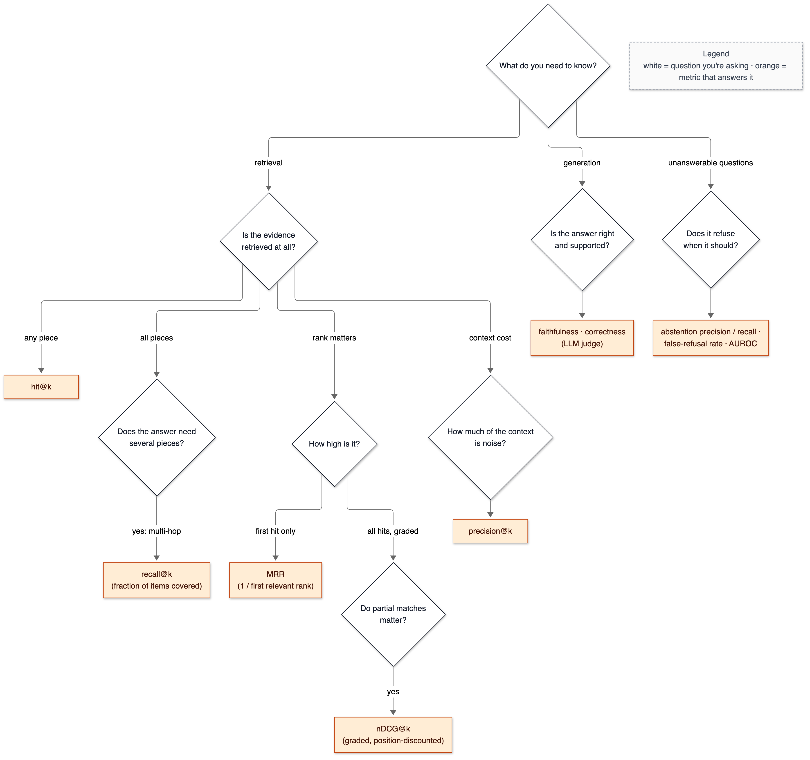
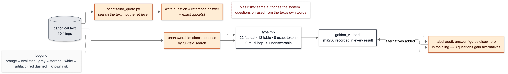

# 09 — Trade-off cards: every Decision Card in one place

**Status:** generated by `make cards` from the Decision Cards inside `docs/NN-*.md`.
Do not edit this file by hand — edit the card in its source doc, then run `make cards`.

Use this as a single-sitting revision document: read a card, close it, and say the
*interview script* and the answers to the *follow-ups* out loud.

## Coverage of the 42 mandatory cards

| # | Decision | Phase | Written in |
|---|---|---|---|
| 1 | RAG vs fine-tuning vs long-context stuffing vs plain prompting | 0 | ✅ [01-what-is-rag](../01-what-is-rag.md) |
| 2 | A structured corpus (10-K / protocols / policies) vs a toy corpus | 1 | ✅ [04-corpus](../04-corpus.md) |
| 3 | Abstention policy: answer with weak evidence vs refuse | 9 | ✅ [15-eval-harness](../15-eval-harness.md) |
| 4 | PyMuPDF vs pdfplumber vs unstructured.io vs OCR vs LLM-based parsing | 2 | ✅ [05-pdf-parsing](../05-pdf-parsing.md) |
| 5 | Store page_number + char_start + char_end vs text only | 2 | ✅ [05-pdf-parsing](../05-pdf-parsing.md) |
| 6 | Batch vs incremental ingest; updated and deleted documents | 4 | ✅ [08-database-schema](../08-database-schema.md) |
| 7 | Deduplication strategy; near-duplicate boilerplate | 4 | ✅ [08-database-schema](../08-database-schema.md) |
| 8 | Fixed-size vs recursive-character vs structure-aware vs semantic chunking | 3 | ✅ [06-chunking](../06-chunking.md) |
| 9 | Chunk size and overlap: the quality/cost curve | 3 | ✅ [06-chunking](../06-chunking.md) |
| 10 | Chunk-level vs sentence-level vs parent-document retrieval | 3 | ✅ [06-chunking](../06-chunking.md) |
| 11 | Local open embedding model vs API embeddings | 4 | ✅ [07-embeddings](../07-embeddings.md) |
| 12 | Embedding dimension: 384 vs 768 vs 1536 | 4 | ✅ [07-embeddings](../07-embeddings.md) |
| 13 | Normalisation and distance metric: cosine vs inner product vs L2 | 4 | ✅ [07-embeddings](../07-embeddings.md) |
| 14 | Re-embedding cost when the model is upgraded | 4 | ✅ [07-embeddings](../07-embeddings.md) |
| 15 | Postgres + pgvector vs Pinecone / Qdrant / Weaviate / Milvus / FAISS / Elasticsearch | 0 | ✅ [03-environment-and-infra](../03-environment-and-infra.md) |
| 16 | HNSW vs IVFFlat vs exact scan; m, ef_construction, ef_search | 4 | ✅ [08-database-schema](../08-database-schema.md) |
| 17 | Vectors in the same table vs a separate table | 4 | ✅ [08-database-schema](../08-database-schema.md) |
| 18 | Metadata filtering: pre-filter vs post-filter, and the recall cliff | 5 | ✅ [09-vector-search](../09-vector-search.md) |
| 19 | Quantisation (scalar / binary): when it is worth the recall loss | 5 | ✅ [09-vector-search](../09-vector-search.md) |
| 20 | Dense-only vs sparse-only vs hybrid retrieval | 7 | ✅ [11-hybrid-rrf](../11-hybrid-rrf.md) |
| 21 | Postgres FTS vs Elasticsearch/OpenSearch BM25 vs SPLADE | 6 | ✅ [10-keyword-search](../10-keyword-search.md) |
| 22 | RRF vs weighted-score fusion vs learned fusion | 7 | ✅ [11-hybrid-rrf](../11-hybrid-rrf.md) |
| 23 | The RRF k constant: what it actually controls | 7 | ✅ [11-hybrid-rrf](../11-hybrid-rrf.md) |
| 24 | Top-k at each stage: over-retrieve, then narrow | 8 | ✅ [12-reranking](../12-reranking.md) |
| 25 | Cross-encoder vs bi-encoder vs ColBERT vs LLM-as-reranker vs no rerank | 8 | ✅ [12-reranking](../12-reranking.md) |
| 26 | Rerank depth N: the quality/latency curve | 8 | ✅ [12-reranking](../12-reranking.md) |
| 27 | Context packing order and token budget (lost-in-the-middle) | 9 | ✅ [13-prompting-and-citations](../13-prompting-and-citations.md) |
| 28 | Citation granularity: document vs chunk vs sentence vs character span | 9 | ✅ [13-prompting-and-citations](../13-prompting-and-citations.md) |
| 29 | Prompt design for grounding; temperature; structured output | 9 | ✅ [13-prompting-and-citations](../13-prompting-and-citations.md) |
| 30 | FastAPI vs Flask vs Django vs Express | 10 | ✅ [14-api-and-streaming](../14-api-and-streaming.md) |
| 31 | SSE vs WebSockets vs polling vs plain JSON | 10 | ✅ [14-api-and-streaming](../14-api-and-streaming.md) |
| 32 | Async vs sync; where CPU-bound work goes | 10 | ✅ [14-api-and-streaming](../14-api-and-streaming.md) |
| 33 | Caching: exact-match vs semantic vs embedding cache; invalidation | 13 | ✅ [17-cost-and-observability](../17-cost-and-observability.md) |
| 34 | LangChain vs plain Python vs LlamaIndex | 0 | ✅ [02-architecture-overview](../02-architecture-overview.md) |
| 35 | Self-built eval harness vs RAGAS vs TruLens vs DeepEval | 11 | ✅ [15-eval-harness](../15-eval-harness.md) |
| 36 | Retrieval metrics: recall@k vs precision@k vs MRR vs nDCG | 11 | ✅ [15-eval-harness](../15-eval-harness.md) |
| 37 | LLM-as-judge vs human labels vs ROUGE/BLEU; judge bias and variance | 11 | ✅ [15-eval-harness](../15-eval-harness.md) |
| 38 | Golden set construction: size, difficulty mix, unanswerables, leakage | 11 | ✅ [15-eval-harness](../15-eval-harness.md) |
| 39 | Docker Compose vs managed Postgres vs bare metal | 0 | ✅ [03-environment-and-infra](../03-environment-and-infra.md) |
| 40 | Multi-tenancy / document ACLs: row-level security vs filter vs separate indexes | 14 | not yet written |
| 41 | Prompt-injection defences; where trust boundaries sit | 14 | not yet written |
| 42 | Streamlit vs React/TypeScript for the demo | 15 | not yet written |

## Mandatory cards

### Card 1 — from [01-what-is-rag](../01-what-is-rag.md)

#### Decision: RAG over our own documents  (rejected: fine-tuning, long-context stuffing, plain prompting)

**One-line defence.** Answers must come from specific filings, cite the exact passage, and stay correct when a filing changes — RAG is the only option of the four that gives all three without retraining anything.

**What problem is this even solving?** An LLM alone answers from what it memorised in training: it may never have seen our documents, cannot cite them, and cannot be updated without retraining. The slot this decision fills is "how does knowledge from our documents reach the model at answer time?" Delete retrieval entirely and you are left with plain prompting: confident answers with no source, and no way to tell a 2023 figure from a 2022 one.

**The options, compared.**

| Option | How it works (1 line) | Strengths | Weaknesses | When it's the right call |
|---|---|---|---|---|
| ✅ RAG | Search the documents at question time; paste the best passages into the prompt | Fresh: re-index a document, no retraining. Citable. Can refuse when nothing matches. Works with any LLM. | Many moving parts (parse, chunk, index, search), each a failure point. Answer quality is capped by retrieval quality. Adds search latency. | Knowledge is large, changes, or must be cited |
| Fine-tuning | Continue training the model's weights on our documents or Q&A pairs | Teaches format, tone, domain vocabulary. No search at query time. | No citations. Facts seen a few times are not reliably recallable — studies comparing fine-tuning with retrieval for adding new knowledge favour retrieval (Ovadia et al., 2023, *Fine-Tuning or Retrieval?*). Every document change means retraining. Needs GPUs or a paid tuning API. | Changing how the model *behaves*, not what it *knows* |
| Long-context stuffing | Paste entire documents into the prompt every time | Least code: no index. The model sees everything. | Cost is the full corpus in tokens on *every* question. Latency grows with input length. Models use the middle of long inputs worst ("lost in the middle", Liu et al., 2023). Impossible once the corpus exceeds the window. | Corpus fits comfortably, few queries, one-off analysis |
| Plain prompting | Ask the LLM directly | Zero infrastructure, fastest, cheapest | Frozen at training cutoff; blind to private documents; hallucinates; cannot cite | General knowledge where a wrong answer is cheap |

**What would actually change if we swapped it.**
- *To fine-tuning:* `app/retrieve/`, the vector and full-text parts of `app/store/`, and Phases 3–8 disappear; a training-data pipeline and a training job appear. An 8 GB laptop cannot train a useful model, so this means a paid fine-tuning API. Citations become impossible, so Phase 9's citation mapping and Phase 15's citation UI go too. Retrieval metrics (recall@k, MRR) stop meaning anything; only answer-level metrics remain. Every corrected filing means a new training run. This is a different project, not a refactor.
- *To long-context stuffing:* Phases 3–8 are deleted; per-question input tokens become *all corpus tokens* (not yet measured — Phase 1 counts them). Cost per 1,000 queries grows linearly with corpus size; time-to-first-token grows with prompt length. New failure modes: lost-in-the-middle misses, and a hard wall at the context-window size. Roughly two days of rework, mostly deletion.
- *To plain prompting:* everything except one API call is deleted. No citations, no abstention, answers limited to what the model memorised.

**The decision rule.** Choose RAG when the knowledge is large, changes, or must be cited. Choose fine-tuning when you need to change behaviour (output format, tone, a skill), not add facts. Choose long-context stuffing when the whole corpus fits comfortably in the window and query volume is low. The RAG-vs-stuffing crossover is where *corpus tokens × queries × price per token* exceeds the cost of building and running retrieval — or simply where the corpus no longer fits.

**Where our choice breaks.** (1) If the corpus were two or three short documents queried rarely, stuffing would be simpler and probably just as accurate. (2) Questions that need *the whole corpus at once* — "which of the ten companies grew R&D fastest?" — break top-k retrieval, because the evidence is spread over ten documents and k chunks may not cover them. Migration path: retrieve per document, or extract key figures into a SQL table at ingest time, or decompose the question into sub-questions.

**The number.** Not yet measured. Phase 1 measures the corpus size in tokens (does it even fit in a context window?). Phase 12 will run a **closed-book baseline** — the same golden questions with retrieval switched off — against RAG, which is the direct evidence for this card. (Proposed addition to the Phase 12 matrix; see [PROGRESS.md](../../PROGRESS.md).)

**Interview script (3 sentences).** "I used RAG because every answer has to come from a specific filing and cite the exact passage, and the filings change. Fine-tuning changes how a model behaves but is unreliable for storing exact figures and can't cite; stuffing the whole corpus costs every token of it on every question. I measured RAG against a closed-book baseline on my golden set: ⟨number from Phase 12⟩."

**Follow-ups they will ask:**
- Q: Context windows are a million tokens now. Isn't RAG obsolete? → A: Not for this workload. Stuffing pays for the whole corpus on every question, latency grows with prompt length, and models use the middle of long inputs worst. RAG also lets you send only chunks a user is *allowed* to see — stuffing would need per-user document sets. For a corpus of a few documents queried rarely, I'd agree stuffing is fine; Phase 1's token count tells us where we are.
- Q: Why not fine-tune so the model just knows the filings? → A: Fine-tuning adjusts weights from examples; a fact seen a handful of times isn't reliably recallable, nothing points back to a source, and correcting one figure means retraining. The right use of fine-tuning here would be *format* — e.g., always citing in our marker style — combined with RAG for facts.
- Q: Does RAG eliminate hallucination? → A: No. It reduces it by putting evidence in front of the model, but the model can ignore or misread the evidence, and retrieval can hand it the wrong passage — then you get a confident wrong answer *with a citation*. That's why faithfulness (does the answer follow from the cited text?) is measured separately from retrieval recall in Phase 11.
- Q: What is the weakest link in a RAG pipeline? → A: Usually retrieval. If the right chunk isn't in the top-k, the generator cannot recover it. That's why I measure retrieval metrics before generation metrics — a generation fix can't paper over a retrieval miss.
- Q (the hard one): How would you answer a question that needs data from all ten filings at once? → A (honest): My current design handles that poorly — top-k retrieval returns k chunks, which may all come from two filings. I'd fix it with per-document retrieval, or by extracting the metric into a table at ingest so it becomes a SQL query, or by decomposing the question. I haven't built any of those; the golden set includes multi-hop questions so the weakness will show up as a number.
- Q: Why not use a managed "file search" product from the LLM provider? → A: It hides chunking, retrieval and ranking — exactly the parts this project exists to measure and tune. For a team without retrieval expertise shipping fast, a managed product is a legitimate choice.

**The trap.** Saying "RAG means a vector database" or "RAG stops hallucinations". RAG is a *pattern* — retrieve, then generate. The retriever can be keyword search, SQL, or web search, and RAG reduces hallucination rather than eliminating it. Candidates who equate RAG with a vector DB can't explain why this project also uses keyword search.

### Card 2 — from [04-corpus](../04-corpus.md)

#### Decision: Ten real 10-K filings (5 companies × 2 consecutive years) as the corpus  (rejected: a toy corpus of clean articles, Wikipedia, a single long document, Indian regulatory circulars)

**One-line defence.** 10-Ks have exactly the structure that breaks naive RAG — 600+ table pages, a fixed legal outline, exhibits that dwarf the report, and near-identical text year to year — and FinanceBench gives externally written questions on them, so the evaluation isn't only my own.

**What problem is this even solving?** Every retrieval and evaluation result is only as meaningful as the data it was measured on. On a toy corpus every technique looks good, so an ablation table would show nothing. The corpus is the test bench; delete the decision and there is nothing to measure.

**The options, compared.**

| Option | How it works (1 line) | Strengths | Weaknesses | When it's the right call |
|---|---|---|---|---|
| ✅ 10 SEC 10-Ks, 2 years × 5 companies | Public annual reports as PDFs, mirrored by FinanceBench | Real tables, legal section structure, exhibits, year-to-year near-duplicates; 28 external questions with evidence pages; public records | Mostly single-column (multi-column parsing barely exercised); finance vocabulary; PepsiCo's exhibits make the corpus lopsided (1,052 of 2,224 pages) | Evaluating retrieval on structured, numeric, versioned documents |
| Toy corpus (blogs, clean articles) | A few dozen short HTML pages | Fast; easy to write questions | Hides every interesting failure; no tables; results don't transfer | Demonstrating the plumbing only |
| Wikipedia subset | Encyclopedic articles | Huge, clean, many public QA datasets | LLMs have memorised Wikipedia — a closed-book model scores well, so retrieval's value is hard to see | Open-domain QA research |
| One very long document | e.g. one 500-page manual | Simple | One structure; metadata filters and wrong-document errors can't occur | Single-manual assistants |
| Indian regulatory circulars (RBI/SEBI) | Numbered clauses with amendments | Excellent versioning story; local relevance | Harder to write correct questions; no external question set; more scanned PDFs | A compliance-assistant product |

**What would actually change if we swapped it.** A different corpus changes `data/manifest.json`, the inspection numbers, every test in `tests/test_corpus.py`, and the whole golden set (Phase 11). The pipeline code shouldn't change — if it did, that would mean it was overfitted to 10-Ks. A toy corpus would make the Phase 12 ablation flat (every configuration near-perfect), which is the real cost: no findings.

**The decision rule.** Pick the corpus that matches the *hardest realistic* version of the target workload, and has an external source of questions if one exists. Choose a toy corpus only to test plumbing; never to report quality.

**Where our choice breaks.** Ten documents is small: anything said about scale is reasoning, not measurement. The corpus is unbalanced — PepsiCo is 47% of pages, mostly exhibits — so corpus-wide averages are dominated by one company. Migration path: add more companies, and report metrics per document, not only pooled.

**The number.** 2,224 pages, 6,128,300 characters, 1,415,012 `o200k_base` tokens, 606 table pages, 0 scanned pages; 28 FinanceBench questions on these filings. (`make inspect`.)

**Interview script (3 sentences).** "I used ten real 10-K filings — five companies, two consecutive years — because they have what breaks naive RAG: hundreds of table pages, a fixed legal structure, exhibits bigger than the report itself, and near-duplicate text across years. An inspection script measured all of that before I wrote any retrieval code — for example, one filing uses non-breaking spaces between every word, which inflates its token count by about 64%. FinanceBench also has 28 externally written questions on these exact filings, so not all of my evaluation is self-written."

**Follow-ups they will ask:**
- Q: Why two years of the same company? → A: To create the hardest realistic confusion: the 2021 and 2022 10-Ks share most of their wording, so retrieval can easily return the right passage from the wrong year. That's a failure mode real financial users would hit, and metadata filtering (Phase 5) has to solve it.
- Q: Isn't ten documents too small? → A: For scale claims, yes, and I don't make them. For retrieval quality it's 1.4 million tokens and — after chunking — thousands of chunks to search, with hard near-duplicates. The honest limit is statistical: the question set, not the corpus, is the small part.
- Q: Do you keep the exhibits? → A: They're kept and labelled: users do ask about exhibit content (e.g. note terms), and deleting them by position would also delete Corning's financial statements, which sit after the signatures. Phase 2 tags pages after the signature page instead of dropping them.
- Q: How do you know there are no scanned pages? → A: Every page was checked: a page is scanned-suspect only if it has under 200 extractable characters *and* images cover at least half of it. Zero pages matched; the 35 near-empty pages are covers, separators and signature continuations with little or no imagery.
- Q (the hard one): FinanceBench's licence is non-commercial. Is that a problem? → A (honest): For a student portfolio project, no — CC BY-NC 4.0 allows non-commercial use with attribution, which the manifest and docs give. A commercial product couldn't reuse their questions without permission; the filings themselves are public SEC records. The GitHub repo itself has no licence file — the licence comes from the Hugging Face dataset card — which I'd clarify with the authors before any commercial use.
- Q: Why PDFs and not EDGAR's HTML? → A: The plan is a PDF pipeline because most real enterprise documents arrive as PDFs, where layout, page numbers and offsets are the hard part. HTML filings would be easier to parse — and less instructive.

**The trap.** Picking the corpus last, or calling a clean toy corpus "realistic". Interviewers ask "what was hard about your data?" — an answer without specifics (like the exhibit share or the non-breaking spaces) suggests the data was never looked at.

### Card 3 — from [15-eval-harness](../15-eval-harness.md)

#### Decision: refusal is the model's decision (a fixed token), with no retrieval-score threshold  (rejected: refuse below a reranker score; always answer)

**One-line defence.** I measured the score threshold: catching all 9 unanswerable questions would also refuse 88% of answerable ones (AUROC 0.66). The model, which reads the passages, is the right judge, and its refusals are made detectable with a fixed token.

**What problem is this even solving?** For a filing assistant, a confident wrong number is worse than "I can't find that". The system needs a policy for weak evidence.

**The options, compared.**

| Option | How it works (1 line) | Strengths | Weaknesses | When it's the right call |
|---|---|---|---|---|
| Always answer | No refusal path | Never wrongly silent | Confident nonsense on unanswerable questions | Never for factual QA |
| Refuse below a reranker score | Threshold the top cross-encoder score | No LLM call needed; cheap | Measured AUROC 0.66: catching 4/9 costs 7/52 answerable | When scores are well calibrated for the domain |
| ✅ Model refuses with `INSUFFICIENT_CONTEXT` | Prompt rule + exact-token detection | Reads the evidence; detectable; measurable | Depends on model compliance (not yet measured) | Default |
| Both (threshold as a pre-filter for clear cases) | Skip the LLM below a very low score | Saves calls on hopeless queries | Must not cost answerable questions | Once the model's refusal accuracy is known |

**What would actually change if we swapped it.** A threshold would be one setting and one `if` in `answer.py`. The cost is false refusals, measured above.

**The decision rule.** Measure the separation (AUROC) before using any score as a gate. Below ~0.8, let the model decide and measure *its* abstention precision and recall.

**Where our choice breaks.** If the model ignores the rule (answers anyway, or refuses in free text), abstention silently degrades. The eval measures both rates once real generation runs.

**The number.** AUROC 0.662. Operating points: 44% caught / 13% false refusals; 67% / 29%; 100% / 88%. Model abstention precision / recall: *not yet measured*.

**Interview script (3 sentences).** "I tested the intuitive policy first: refuse when the reranker isn't confident. On 9 unanswerable versus 52 answerable questions it barely separates them (AUROC 0.66), because an unanswerable question about a familiar topic still retrieves confident-looking passages. So refusal is the model's call, signalled by a fixed token the API detects, and the harness measures its precision and recall rather than trusting it."

**Follow-ups they will ask:**
- Q: Why is accuracy the wrong criterion for the threshold? → A: With 52 answerable and 9 unanswerable questions, "never refuse" scores 85% accuracy. Look at the two error rates separately.
- Q: How would you calibrate a threshold properly? → A: More unanswerable examples, including near-miss ones (right company, wrong metric), and choose t from a stated cost ratio between a false refusal and a false answer.
- Q: What makes a good unanswerable question? → A: Close to answerable ones: familiar entities, plausible metrics, wrong years. Easy ones ("Tesla deliveries") make abstention look better than it is.
- Q (the hard one): Isn't letting the model decide unmeasurable? → A: It's measured the same way: abstention recall on the 9, false refusals on the 52. It just needs the generation run.

**The trap.** Picking a threshold by maximising accuracy on an imbalanced set.

### Card 4 — from [05-pdf-parsing](../05-pdf-parsing.md)

#### Decision: PyMuPDF for text and layout + pdfplumber for ruled tables  (rejected: pdfplumber alone, unstructured.io, OCR with Tesseract, LLM/vision-model parsing)

**One-line defence.** Every page in this corpus is born-digital (0 scanned pages), so the job is reconstructing layout from real text instructions — PyMuPDF does that fast with fonts and bounding boxes, and pdfplumber's line-based table finder gives clean rows; OCR or a vision model would add cost and error for no gain.

**What problem is this even solving?** Something has to turn drawing instructions into ordered, structured text with positions. Remove it and there is no text to chunk; pick badly and every downstream metric inherits the errors (missing tables, noise, wrong order).

**The options, compared.**

| Option | How it works (1 line) | Strengths | Weaknesses | When it's the right call |
|---|---|---|---|---|
| ✅ PyMuPDF + pdfplumber | PyMuPDF (MuPDF engine) for blocks/lines/spans/fonts; pdfplumber (pdfminer) for tables from drawn lines | Fast (PyMuPDF text for 118 pages in ~1 s); fonts and bold flags for heading detection; exact bboxes; pdfplumber gives row/cell structure | Two libraries; tables without drawn lines are missed; header rows above the ruled area are lost; heuristics for headings and order | Born-digital PDFs where you need positions and control |
| pdfplumber alone | pdfminer layout analysis for text and tables | One library; good tables | Slower (12.5 s vs 7.1 s just for table finding on AMD 2021); weaker font/flags API for headings | Table-heavy, small corpora |
| unstructured.io | A library that partitions documents into typed elements (Title, NarrativeText, Table) | Many formats; element types out of the box | Its own heuristics and models to trust; heavier dependencies; offsets back into *our* canonical text not guaranteed | Heterogeneous inputs (Word, HTML, email, PDF) |
| OCR (Tesseract) | Render each page to an image, recognise characters | Works on scans | Slow; introduces recognition errors into text that is already perfect; loses font info | Scanned pages — none here |
| LLM / vision-model parsing | Send page images to a multimodal model, ask for structured output | Understands complex layouts and table headers | Cost per page × 2,224 pages; non-deterministic; can hallucinate cells; offsets meaningless | Small numbers of messy, high-value documents |

**What would actually change if we swapped it.** To unstructured.io: `app/ingest/pdf_parser.py` would shrink to a mapping from its element types to our `Block`, but `char_start`/`char_end` would have to be recomputed by locating each element's text in our own assembled text — and the tests in `tests/test_pdf_parser.py` would need re-deriving. To a vision model: per-page API cost on 2,224 pages for every re-parse, minutes to hours of latency, and a new failure mode — invented table cells — that no offset check can catch. About a day of rework for unstructured; a different cost profile entirely for vision.

**The decision rule.** Born-digital PDFs: extract text with a layout-aware library and keep coordinates. Scanned PDFs: OCR, keeping confidence scores. Layout too complex for heuristics (multi-level table headers, forms) and few documents: consider a vision model, with validation. The crossover is when heuristic failures on your measured sample cost more than the per-page price of a model.

**Where our choice breaks.** (1) Unruled tables — aligned columns with no drawn lines — are missed by pdfplumber's default strategy and come out as loose text. (2) Column headers above a table's ruled area are separated from it (AMD p.51). (3) Truly multi-column layouts would rely on a gutter heuristic tested only synthetically. Migration path: pdfplumber's text-alignment strategy for unruled tables, a rule attaching the text blocks directly above a table as its header row, or a vision model for table pages only.

**The number.** 2,224 pages parsed in 3 min 4 s; 1,073 tables; 30,327 blocks; offsets exact for every block in all 10 documents (`test_real_offsets_are_exact_and_pages_consistent`); 0 scanned pages. Table-detection timing: PyMuPDF 7.1 s vs pdfplumber 12.5 s on AMD 2021, agreeing on 116/118 pages.

**Interview script (3 sentences).** "All 2,224 pages are born-digital, so I didn't need OCR: PyMuPDF gives me text with fonts and bounding boxes, and pdfplumber turns ruled tables into rows. On top of that I wrote tested rules for paragraph splitting, header/footer removal, reading order and headings, and every block carries exact character offsets into one canonical text. The known weak spot is table header rows that sit above the ruled area — they end up as loose text."

**Follow-ups they will ask:**
- Q: Why not just use one library? → A: PyMuPDF's span-level font flags made heading detection possible (headings here are bold at body size), and pdfplumber's tables came out with cleaner cells. Both share PDF coordinates (origin top-left, points), so combining them was just a box-containment test.
- Q: How do you know your heading detection works? → A: On AMD 2021 the ITEM headings come out exactly in order 1, 1A, 1B, 2 … 16 (a test asserts the full list), and the section path of a block on the income-statement page is `PART II › ITEM 8 › Consolidated Statements of Operations`. Level-3 headings have some noise; I measured the first fix (excluding captions with digits/parentheses), not perfection.
- Q: What about scanned documents in a real system? → A: Detect them as in Phase 1 (little text, big image), route those pages to OCR, store OCR confidence, and keep offsets into the OCR text. None exist here, so I didn't build it.
- Q: Why not send pages to a vision model — they read tables well? → A: Cost and trust: 2,224 pages per full re-parse, non-deterministic output, and a model can invent a cell value — the one error a financial QA system must never have. I'd consider it for the few hundred table pages if eval showed table questions failing because of parsing.
- Q (the hard one): Your tables lose their column headers. How bad is that? → A (honest): For a question like "AMD's 2021 net revenue", the table block says `Net revenue | $ 16,434 | $ 9,763 | $ 6,731` and the year labels are in separate blocks nearby. If both land in the same chunk the LLM can infer the order; if a chunk boundary separates them, it can't. I haven't measured how often that happens yet — table-reading golden questions in Phase 11 will show it.
- Q: What does TEXT_DEHYPHENATE do? → A: It rejoins words hyphenated across a line break ("manage-" / "ment" → "management"), which matters for keyword search. The risk is joining a real hyphenated word that happened to break at its hyphen; I accepted that.

**The trap.** "PDF parsing is a solved problem — call `get_text()`." Interviewers ask what was hard about the data; an answer with no specifics about headers, tables or reading order suggests the parsing was never inspected.

### Card 5 — from [05-pdf-parsing](../05-pdf-parsing.md)

#### Decision: Store page_number, char_start, char_end (and a bbox) for every block — offsets into one canonical text  (rejected: text only, page number only, offsets into raw extracted text, offsets per page)

**One-line defence.** A citation is only checkable if it points at exact characters; capturing offsets at parse time costs two integers per block, while adding them later would mean re-parsing and re-ingesting the whole corpus.

**What problem is this even solving?** The answer has to say *where* its evidence is, precisely enough to highlight the sentence (Phase 15) and to score retrieval against evidence spans (Phase 11). Text-only storage can find chunks but can't place them.

**The options, compared.**

| Option | How it works (1 line) | Strengths | Weaknesses | When it's the right call |
|---|---|---|---|---|
| ✅ Offsets into one canonical normalised text per document (+ page table + bbox) | Every block and chunk is a `[char_start, char_end)` range of `doc.text`; pages map to ranges | Exact, testable invariant; chunks spanning pages work (`page_of`); evidence spans comparable across chunking configs | Canonical text must never change without re-parsing; normalisation choices are baked in | Citations, highlighting, span-based eval |
| Text only | Store chunk text, nothing else | Simplest | No page numbers, no highlighting, can't compare chunks to evidence spans | Prototypes |
| Page number only | Chunk text + page | Coarse citations | Can't highlight; a chunk crossing pages has no single page | Page-level citation is enough |
| Offsets into raw (un-normalised) text | Offsets computed before cleaning | Matches the PDF's raw extraction | Raw text contains headers and non-breaking spaces; any cleaning step invalidates offsets | When you never clean text |
| Offsets relative to each page | `(page, start, end)` within that page's text | Simple per page | Chunks spanning two pages need two ranges; cross-page comparisons awkward | Single-page units only |

**What would actually change if we swapped it.** Text only: `Block`/chunk models lose four fields; Phase 11's relevance rule (evidence-span overlap) becomes impossible, so labels would revert to chunk ids — which break across the chunking ablation (agreed change A); Phase 15's highlight feature disappears. Adding offsets back later: re-parse (3 minutes) plus re-chunk and re-embed every configuration (Phase 4 numbers), and every golden label re-derived.

**The decision rule.** If answers must be verifiable or evaluation compares retrieved text to labelled evidence, capture character-level positions at the first point text exists, against one canonical text, and test the invariant. If page-level citation is enough and labels are per document, store pages only.

**Where our choice breaks.** Any change to normalisation or block order changes the canonical text and silently invalidates stored offsets and golden spans — which is why the parser version is part of the cache key and Phase 4 will store it with each document. Highlighting on the original PDF also needs the bbox, which is per block, not per character: a highlight can only be as precise as a block unless character boxes are stored (they are not).

**The number.** Invariant `doc.text[b.char_start:b.char_end] == b.text` holds for all 30,327 blocks in the 10 parsed documents (checked in the spot-check run and by `test_real_offsets_are_exact_and_pages_consistent` on three of them). Storage cost: two integers per block plus a four-float bbox.

**Interview script (3 sentences).** "Every block — and later every chunk — stores its page and its exact character range in one canonical, normalised text per document, plus its bounding box. A test checks that slicing the text with those offsets returns exactly the block, for every block. It costs a few integers per row and it's what makes citations checkable and lets my eval compare retrieved chunks with labelled evidence spans across different chunking strategies."

**Follow-ups they will ask:**
- Q: Why normalise before computing offsets? → A: NFKC can change string length, so normalising afterwards would shift every offset after the first changed character. Normalise first, then offsets are into the text you actually store and search.
- Q: How do you handle a chunk that spans two pages? → A: Its offsets are a single range of the canonical text; `page_of(char_start)` and `page_of(char_end - 1)` give the first and last page. That's why there's `page_end` in the agreed schema.
- Q: Can you highlight on the original PDF from character offsets? → A: Only to block precision: each block has a bbox, so I can highlight the paragraph or table containing the cited span. Word-level highlighting would need per-character boxes from PyMuPDF, which I chose not to store.
- Q: What if you change the parser? → A: The parser version is in the cache key, so everything is re-parsed; golden evidence spans are derived from text quotes located in the new canonical text, so they're rebuilt mechanically rather than hand-edited.
- Q (the hard one): Your canonical text isn't the PDF's text — it has headers removed and spaces normalised. Isn't the citation then "of" something the user never saw? → A (honest): Yes, the cited string is the normalised one. The displayed citation shows our text plus the page and highlighted box on the real PDF, so the user can check it against the original. A character-exact mapping back to raw PDF text would need a second offset table; I judged the block box sufficient.

**The trap.** "Store the page number, that's enough for citations." It's not enough to evaluate retrieval across chunking strategies or to highlight evidence — and retrofitting offsets is the expensive part.

### Card 6 — from [08-database-schema](../08-database-schema.md)

#### Decision: Idempotent batch ingestion — skip, insert or replace per document, keyed by PDF hash + parser version  (rejected: wipe-and-reload, streaming/CDC ingestion, append-only versions)

**One-line defence.** Filings change once a year, so a re-runnable batch job is enough; keying on the PDF's sha256 and the parser version makes re-runs cheap (2.8 s with nothing to do) and makes a changed document replace its old rows atomically.

**What problem is this even solving?** Documents get added, corrected and re-parsed. Ingestion must handle all three without duplicates, without stale derived rows, and without leaving a half-updated document visible.

**The options, compared.**

| Option | How it works (1 line) | Strengths | Weaknesses | When it's the right call |
|---|---|---|---|---|
| ✅ Idempotent upsert per document | Compare hash + parser version; skip, insert, or delete-cascade-and-reinsert in one transaction | Safe to re-run and interrupt; updates are atomic; cheap no-op runs | Replacing a document re-embeds all its chunks; no history of old versions | Low change rate, batch arrivals |
| Wipe and reload everything | `TRUNCATE`, re-ingest all | Simplest | Downtime; re-embeds everything every time (~80 s here, days at scale) | Tiny prototypes |
| Streaming / change-data-capture | Each document change becomes an event processed continuously | Fresh within seconds | Queues, ordering, retries, dead letters; overkill for annual filings | High change rates (news, tickets) |
| Append-only versions | Keep every version, mark the current one | Full history, time-travel queries | Storage grows; every query must filter to current | Audit or "as of date" requirements |

**What would actually change if we swapped it.** To streaming: an event queue in front of `ingest()`, a worker that processes one document per message, and HNSW inserts per message instead of a batch build (slower per vector); the same per-document transaction still applies. To append-only: a `version` and `is_current` on `documents`, every query filtered on `is_current`, and an index per version or a filtered index.

**The decision rule.** Match ingestion to the change rate: batch for daily-or-slower changes, streaming when freshness requirements are minutes. Always make ingestion idempotent (keyed on content), so retries and re-runs are safe either way.

**Where our choice breaks.** If documents changed constantly, re-embedding a whole document for one changed paragraph would be wasteful — then diff at chunk level (content hashes already exist) and update only changed chunks. If users needed "what did the 2021 filing say before its amendment", append-only versions.

**The number.** First ingest 80.2 s; re-run with nothing changed 2.8 s (`documents=… unchanged`, `computed 0`); replacement path covered by `test_changed_pdf_replaces_the_document_and_cascades`.

**Interview script (3 sentences).** "Ingestion is an idempotent batch job: for each document it compares the PDF's hash and the parser version with what's stored, then skips, inserts, or deletes and re-inserts inside one transaction, with cascading deletes removing old chunks and vectors. A re-run with nothing changed takes under three seconds, and an interrupted run resumes cleanly. With annual filings, streaming would add a queue and retry machinery for no freshness gain."

**Follow-ups they will ask:**
- Q: What does a query see while a document is being replaced? → A: The old version until commit, then the new one — never a mix. Postgres's MVCC (multi-version concurrency control) keeps the old rows visible to other transactions until the replacing transaction commits.
- Q: Why delete-and-reinsert rather than update in place? → A: Chunk boundaries can all move when a document changes, so there's no stable mapping from old chunks to new; deleting and inserting is simpler and, inside one transaction, equally atomic.
- Q: What happens to the HNSW index on delete? → A: Deleted rows become dead tuples; their index entries are cleaned up by VACUUM. I'm not certain how pgvector repairs graph links around removed nodes — it's on my honest-answers list.
- Q: How would you ingest 10,000 new filings a day? → A: Same idempotent unit (one document per transaction), many workers in parallel, embedding on GPU workers, and periodic index maintenance. The per-document contract doesn't change.
- Q (the hard one): Two workers ingest the same changed document at once. What happens? → A (honest): Both may try to delete and insert; the unique `doc_key` makes one of them fail at insert rather than create duplicates, but the loser's work is wasted and its error must be handled. I'd add a per-document advisory lock (`pg_advisory_xact_lock(hash(doc_key))`). Not built — ingestion here is single-process.

**The trap.** Describing ingestion as "a script that loads PDFs" with no answer for re-runs, updates or partial failures.

### Card 7 — from [08-database-schema](../08-database-schema.md)

#### Decision: Keep duplicate chunks as separate rows (they're in different filings) but embed each distinct text once  (rejected: dropping duplicate chunks, near-duplicate merging at ingest, embedding every chunk)

**One-line defence.** 599 of 7,411 chunks repeat another chunk word for word — mostly boilerplate copied from 2021 into 2022 — and each copy must stay, because it's citable evidence in *its* filing; but identical text gets an identical vector, so it's computed once.

**What problem is this even solving?** Ten-Ks repeat themselves year to year (5–17% of FY2022 chunks are exact copies of FY2021 chunks here). Duplicates waste embedding compute and storage, and in results they crowd the top-k with copies.

**The options, compared.**

| Option | How it works (1 line) | Strengths | Weaknesses | When it's the right call |
|---|---|---|---|---|
| ✅ Keep rows, dedupe embedding by content hash | One model call per distinct text; vector copied to every duplicate row | No lost evidence; 8% fewer model calls; deterministic | Duplicate rows still appear together in results | Versioned documents where each copy is citable |
| Drop exact duplicates | Keep one chunk per distinct text | Smaller index, no duplicate hits | Loses the citation for the other filing; which year "owns" the text? | Single-version corpora |
| Near-duplicate merging (MinHash/SimHash) | Treat almost-identical chunks as one | Catches small edits | Merges chunks whose differing numbers are the whole point ("grew 19%" vs "grew 8%") | Web crawls, forum posts |
| Embed everything | No dedupe | Simplest | 599 extra calls (~8% more embed time) | When compute is free |

**What would actually change if we swapped it.** Dropping duplicates would delete rows from `chunks` and break evidence spans pointing at them (Phase 11), and year-filtered searches would find nothing for boilerplate sections in one of the years. Embedding everything: remove ~10 lines in `pipeline.py`, +8% embedding time.

**The decision rule.** Deduplicate *computation* by exact content hash always (it's free and lossless). Deduplicate *data* only when copies carry no distinct meaning — not when the same text in two documents is two different facts ("this was in the 2021 filing" vs "this was in the 2022 filing").

**Where our choice breaks.** Near-duplicates that differ by one number (the dangerous ones) aren't deduplicated and look almost identical to vector search; only metadata filters and keyword search on the number can separate them. And duplicate rows can still fill the top-k with copies — collapsing identical results at query time (keep one, cite both) is a Phase 9 option.

**The number.** Structure/256: 7,411 chunks, 6,812 distinct texts; FY2022 chunks identical to an FY2021 chunk — AMD 14%, Boeing 16%, Corning 5%, PepsiCo 17%, Verizon 14%. Embedding: 6,812 computed, 599 copied.

**Interview script (3 sentences).** "About 8% of my chunks are exact copies of another chunk — mostly boilerplate repeated between the 2021 and 2022 filings. I keep every row, because each copy is evidence for its own filing, but I embed each distinct text once and copy the vector. The dangerous duplicates are the *near* ones that differ by a single number, and those are handled by year filters and keyword search, not deduplication."

**Follow-ups they will ask:**
- Q: How do you detect duplicates? → A: sha256 of the chunk text, stored in `content_sha256` with a B-tree index; identical hash = identical text.
- Q: Why not MinHash for near-duplicates? → A: Near-duplicate filings differ exactly in the numbers users ask about; merging them would erase the answer.
- Q: Do duplicates hurt retrieval? → A: Identical chunks get identical scores, so both years appear together in the top-k, using two slots for one piece of text. Without a year filter, that's 50/50 which year gets cited first.
- Q: Could you exploit duplicates? → A: Yes — a duplicate pair is a signal that a passage didn't change between years, useful for "what changed?" questions. Not built.
- Q (the hard one): Your cross-set cache only reused 8 vectors between fixed and structure chunking. Is it worth having? → A (honest): Between strategies, barely — chunk boundaries rarely coincide. It pays off for overlap-only changes (identical chunks, 100% reuse in the test) and for re-ingests. Within a set, the distinct-text grouping saved 599 calls. I measured both; the second matters more.

**The trap.** "Deduplicate the corpus" without asking whether the copies mean different things.

### Card 8 — from [06-chunking](../06-chunking.md)

#### Decision: Three pluggable chunkers — fixed, recursive, structure-aware — with structure-aware as the default  (rejected: one hard-coded strategy, semantic chunking, LLM-based chunking)

**One-line defence.** Which strategy wins is an empirical question on this corpus, so all three exist behind one interface with identical offset guarantees; structure-aware is the default because 10-Ks have reliable section structure and its chunks never mix two Items.

**What problem is this even solving?** Something must decide passage boundaries. Bad boundaries split an answer across two chunks (neither matches well) or mix topics (the vector is a blur). Delete chunking and you embed whole documents — 250,000 tokens into a 510-token model.

**The options, compared.**

| Option | How it works (1 line) | Strengths | Weaknesses | When it's the right call |
|---|---|---|---|---|
| ✅ Structure-aware (default) | Whole blocks within one section, heading opens a chunk, big blocks windowed | Chunks are self-contained sections; never mixes Items; headings at chunk starts | Variable sizes; many tiny chunks (1,061 under 64 tokens at size 256); depends on parser heading quality | Documents with reliable structure |
| ✅ Recursive character | Split at ¶, line, sentence, word — whichever fits | Natural boundaries without needing headings; mature implementation | Can mix the end of one section with the next; still variable sizes | Unstructured or inconsistently structured text |
| ✅ Fixed size | Equal token windows with overlap | Simplest; uniform cost; perfect baseline | Cuts mid-sentence and mid-table; blind to sections | Baselines; uniform text like transcripts |
| Semantic chunking | Embed sentences; cut where consecutive similarity drops | Topic-coherent chunks | Embeds every sentence (cost); thresholds to tune; boundaries non-obvious to debug | Long unstructured prose with topic shifts |
| LLM-based chunking | Ask an LLM to segment the text | Can follow complex structure | Cost and latency per page; non-deterministic; offsets must be recovered | Small, high-value document sets |

**What would actually change if we swapped it.** Adding semantic chunking: a fourth class in `app/ingest/chunking.py` plus one dictionary entry; it would embed roughly every sentence of 6 M characters at ingest (Phase 4 measures embedding throughput), and its boundaries depend on a similarity threshold that would become a new ablation axis. Nothing downstream changes — that's the point of the interface. Removing the alternatives and keeping only one: the ablation's strategy axis disappears and card #9's numbers can't be produced.

**The decision rule.** Respect the document's own structure when it's reliable; fall back to natural-language boundaries (paragraph, sentence) when it isn't; use fixed windows only as a baseline or for uniform text. Make the choice configurable and measure, because the winner depends on the questions as much as the documents.

**Where our choice breaks.** Structure-aware is only as good as heading detection: Corning 2021 had 18 headings before the parser fix and would have produced section-blind chunks. It also creates many tiny chunks for short sections, which can crowd the top-k. Migration path: merge tiny sections with their neighbour within the same Item, or prepend the section path to each chunk's *embedding input* (not its stored text).

**The number.** At 256 tokens: fixed 5,604 chunks (p50 256), recursive 6,538 (p50 223), structure 7,411 (p50 196, 1,061 under 64 tokens). Retrieval quality per strategy: not yet measured — Phase 12.

**Interview script (3 sentences).** "I built three chunkers behind one interface — fixed windows, LangChain's recursive splitter, and a structure-aware one that groups whole blocks within a 10-K section — all with exact character offsets. Structure-aware is the default because these filings have reliable headings, and its chunks never mix two Items. Which one actually retrieves best is a measured result in my ablation, not an assumption: ⟨Phase 12⟩."

**Follow-ups they will ask:**
- Q: Why not semantic chunking? → A: It needs an embedding per sentence at ingest and a similarity threshold to tune, and its boundaries are hard to explain when they're wrong. 10-Ks already mark topic boundaries with headings, which are free and explainable. If my structure chunks underperformed on prose-heavy sections, semantic chunking is what I'd try next.
- Q: How do you know structure-aware chunks don't mix sections? → A: A test walks every structure chunk of AMD 2021 and checks that all non-heading blocks inside it share one PART/ITEM.
- Q: Isn't a heading-only chunk useless? → A: Yes, which is why consecutive headings now stay with the body that follows; that raised the 5th-percentile chunk from 4–6 tokens to 12–19.
- Q: Do the strategies produce comparable results for evaluation? → A: Yes — that's why offsets matter: every chunk from every strategy is a range of the same canonical text, so relevance is judged by overlap with one set of evidence spans.
- Q (the hard one): Your recursive and structure chunkers agree on most of page 44. Is the distinction even meaningful? → A (honest): On prose pages they converge because both respect paragraphs; they differ at section boundaries (recursive will merge the end of one Item into the next) and around tables. Whether that difference moves recall is exactly what the ablation measures — it might not, and I'll report it if it doesn't.
- Q: Why LangChain for one chunker? → A: Recursive splitting is a solved problem and theirs is battle-tested. But its `start_index` is wrong when chunk length is measured in tokens, so I compute offsets myself — and a test pins both the bug and the fix.

**The trap.** Naming a "best" chunking strategy without data. The right answer is "it depends on the documents and the questions — here's how I measured it."

### Card 9 — from [06-chunking](../06-chunking.md)

#### Decision: Sizes 128 / 256 / 510 tokens with overlap = size ÷ 8; default 256 / 32  (rejected: character-based sizes, sizes over the model limit, zero overlap, 50% overlap)

**One-line defence.** Sizes are measured in the embedding model's own tokens because that's the unit it truncates in; 510 is the hard ceiling, and the three sizes bracket the precision-versus-context trade-off for the ablation.

**What problem is this even solving?** Chunk size sets how much text one vector summarises and how much evidence each retrieved result carries into the prompt; overlap decides whether a sentence cut at a boundary survives intact somewhere.

**The options, compared.**

| Option | How it works (1 line) | Strengths | Weaknesses | When it's the right call |
|---|---|---|---|---|
| ✅ Token sizes 128/256/510, overlap 1/8 | Count with the embedding tokenizer; three sizes as ablation levels | No silent truncation; directly comparable; modest storage overhead | More chunks at 128 (≈14k) → more vectors and slower ingest | Default for this project |
| Character sizes (e.g. 1,000 chars) | Count characters | Tokenizer-free, simple | Token count per character varies (Corning: 2.64 vs 4.34 chars/token) → some chunks silently truncated | Models with very large limits |
| Size above the model limit (e.g. 1,024) | Bigger chunks | More context per chunk | The model only sees the first 510 tokens; the rest is invisible to vector search | Never with this model |
| Zero overlap | Windows end-to-end | Fewest chunks | A sentence straddling a boundary is split in both chunks | Structure-aware chunks of whole blocks (we only window oversized blocks) |
| 50% overlap | Each window repeats half the previous one | Boundary-cut sentences always appear whole | Doubles the number of chunks and vectors; near-duplicate results crowd top-k | Very short, dense windows |

**What would actually change if we swapped it.** Moving the default to 510: ~4,200 structure chunks instead of ~7,400 (roughly 45% fewer vectors, and less embedding time in Phase 4), but each retrieved chunk carries ~2× the tokens into the prompt, so a top-5 evidence budget grows from about 1,000 to about 1,700 tokens (5 × the median chunk: 196 vs 335) and LLM input cost per query rises accordingly. Moving to characters: one setting changes, and a new failure mode appears — silent truncation on token-dense text.

**The decision rule.** Measure size in the units of the component that enforces the limit. Pick the smallest size whose chunks are still self-explanatory for the questions you expect; bracket it (½×, 1×, 2×) and measure. Use overlap only where boundaries are arbitrary, and keep it small (10–15%) so it doesn't create near-duplicate results.

**Where our choice breaks.** Questions needing context spread over more than ~500 tokens (a whole table with its headers, a multi-paragraph explanation) can't be answered by one chunk at any allowed size. Migration path: parent-document retrieval (card #10) or a long-context embedding model.

**The number.** Chunks at 128 / 256 / 510: fixed 11,206 / 5,604 / 2,809; recursive 13,870 / 6,538 / 3,042; structure 14,513 / 7,411 / 4,183. Quality per size: not yet measured — Phase 12.

**Interview script (3 sentences).** "Chunk sizes are in the embedding model's own tokens — 128, 256 and 510 — because that's the unit it silently truncates in, and 510 is its 512 limit minus the two special tokens. Overlap is an eighth of the size, applied only where a boundary is arbitrary. The trade-off is precision versus context per chunk, and my ablation measures it instead of guessing."

**Follow-ups they will ask:**
- Q: Why exactly 510 and not 512? → A: bge-small's 512-token limit includes `[CLS]` at the start and `[SEP]` at the end. A 512-content-token chunk becomes 514 tokens and loses its last two. My first run at size 512 produced exactly such chunks; the factory now rejects sizes above 510.
- Q: What does overlap buy you? → A: If a sentence is cut by a window boundary, overlap repeats the end of one window at the start of the next, so a sentence shorter than the overlap appears whole in at least one chunk. The cost is more chunks and near-duplicate neighbours in results.
- Q: Why count tokens and not characters? → A: Characters per token vary from 2.64 to 4.80 across this corpus (Phase 1), so a fixed character budget overflows the model on some documents.
- Q: How does chunk size affect the LLM cost? → A: The prompt carries k chunks, so its evidence tokens ≈ k × average chunk size; going from 256 to 510 roughly doubles the per-question input.
- Q (the hard one): Your structure chunks average under the target size. Are you comparing like with like across strategies? → A (honest): Not exactly — "size 256" is a ceiling for recursive and structure but an exact length for fixed (p50 196 vs 256). I'll report the actual median chunk size next to each result, so a strategy can't win just by having bigger chunks.

**The trap.** "Bigger chunks give the LLM more context, so they're better." Past the model limit the extra text isn't embedded at all, and bigger chunks blur the vector.

### Card 10 — from [06-chunking](../06-chunking.md)

#### Decision: Retrieve at chunk level  (rejected for now: sentence-level retrieval, parent-document retrieval, multi-granularity)

**One-line defence.** One unit for both matching and context keeps the pipeline and its evaluation simple; parent-document retrieval is the planned escalation if table and multi-paragraph questions fail.

**What problem is this even solving?** The unit you *match* on and the unit you *give to the LLM* don't have to be the same. Small units match precisely but carry little context; big units carry context but match vaguely.

**The options, compared.**

| Option | How it works (1 line) | Strengths | Weaknesses | When it's the right call |
|---|---|---|---|---|
| ✅ Chunk-level | Match and return the same 128–510-token chunks | Simple; one index; eval unit = retrieval unit | Precision/context trade-off fixed by one size | Default |
| Sentence-level | Embed every sentence; return sentences | Very precise matches | Too little context to answer; ~10× more vectors | Fact lookup with short answers |
| Parent-document | Match small child chunks, return their larger parent (section) | Precise matching *and* full context | Two levels to store and keep in sync; larger prompts; eval must decide which level counts | Answers spanning paragraphs or tables |
| Multi-granularity | Index several sizes, fuse results | Best of each | Duplicate content in results; complex | Mature systems with measured need |

**What would actually change if we swapped it.** Parent-document: a `parent_chunk_id` column in Phase 4's schema, a second chunking pass (structure sections as parents, small windows as children), retrieval that maps child hits to parents before reranking, and evidence-span relevance judged on the returned parent. Prompt tokens per question would rise with parent size. About a day of work.

**The decision rule.** Start with one granularity sized for the typical answer. Split matching from context only when evaluation shows answers spanning more than one chunk.

**Where our choice breaks.** Questions whose evidence is a whole table or spans several paragraphs. The evidence for that will come from Phase 11's multi-hop and table questions.

**The number.** Not yet measured — Phase 11 reports how many golden answers' evidence spans more than one chunk.

**Interview script (3 sentences).** "I retrieve at chunk level, so the unit I match on is the unit I hand to the LLM, which keeps both the pipeline and the evaluation simple. If the eval shows answers spanning several chunks — big tables are the likely case — the next step is parent-document retrieval: match small chunks, return their section. I'd add it on evidence, not by default."

**Follow-ups they will ask:**
- Q: What is parent-document retrieval? → A: Index small "child" chunks for precise matching, but return the larger "parent" they belong to, so the LLM sees the full context. Child and parent are linked by id.
- Q: Why not just make chunks bigger? → A: Bigger chunks blur the vector — a 510-token chunk about three topics matches each topic weakly — and you can't exceed the model's 510 tokens anyway.
- Q: How would evaluation change with parents? → A: Relevance would be judged on the returned parent span, which is larger, so precision@k would look worse even if answers improve. I'd report both levels.
- Q: Sentence-level for numbers? → A: A sentence like "Net revenue grew 19%" lacks the subject (which segment? which year?), so it'd need its section prepended — which is half-way to parent retrieval.
- Q (the hard one): Wouldn't parent retrieval fix your table header problem? → A (honest): Partly — returning the whole table's section would include the column headers that the parser separated from the table block. But a big statement can exceed the prompt budget on its own. I haven't measured it.

**The trap.** Assuming the unit of retrieval must be the unit of context. Separating them is a standard technique — and a sign you understand the trade-off.

### Card 11 — from [07-embeddings](../07-embeddings.md)

#### Decision: A local open model — BAAI/bge-small-en-v1.5, pinned by revision  (rejected: OpenAI / Cohere / Voyage embedding APIs, larger local models as the default)

**One-line defence.** A 134 MB MIT-licensed model running on the laptop's GPU embeds the whole corpus in about 70 seconds for $0, deterministically, offline — which matters when the ablation re-embeds the corpus for every chunking configuration.

**What problem is this even solving?** Vector search needs a function from text to vector. Without one there is no semantic retrieval at all — only keywords.

**The options, compared.**

| Option | How it works (1 line) | Strengths | Weaknesses | When it's the right call |
|---|---|---|---|---|
| ✅ bge-small-en-v1.5 (local) | 33 M-parameter BERT-style model via sentence-transformers | Free; fast on MPS (116 chunks/s); deterministic; data never leaves the machine; pinned revision | 384 dims, 512-token limit; likely weaker than large API models (not measured here); English only | Experiments, privacy, offline, cost-sensitive |
| OpenAI embeddings API | Send text, receive vectors | Strong general quality; long inputs; no local compute | Cost per token on every re-embed; network latency; vendor can retire models; data leaves your machine | Production apps without ML infrastructure |
| Cohere / Voyage APIs | Same model-as-a-service shape | Retrieval-tuned models; some domain-specific options | Same cost/latency/vendor issues | Teams that want a hosted model tuned for retrieval |
| Larger local (bge-base 768d, bge-large 1024d) | Same family, bigger | Usually better quality | 3–10× slower on this laptop (not measured); 2–2.7× the storage | When eval shows small is the bottleneck |

**What would actually change if we swapped it.** To an API: `app/embed/embedder.py` becomes an HTTP client with retries and rate limiting; ingest time becomes network-bound; each re-embed of the corpus (~1.3 M tokens per chunking configuration, Phase 3 table) costs money — and the ablation runs nine configurations; the `embedding_dims` setting, the HNSW index cast and `vector_literal` sizes change to the API model's dimension. A new failure mode: the provider deprecates the model and every stored vector must be regenerated on their schedule. About a day of work.

**The decision rule.** Use a local model when you'll re-embed often, need determinism or privacy, or the corpus is small enough that local throughput is fine. Use an API when quality must be state of the art, there's no ML infrastructure, and the embed-once cost is acceptable. The crossover is roughly when corpus size × re-embed frequency × price exceeds the cost of running inference yourself.

**Where our choice breaks.** Quality on hard financial paraphrases is probably below larger models — unmeasured. Speed at scale: this corpus averages 741 chunks per filing, so 10 M filings is ~7.4 billion chunks — at ~100 chunks/s, about 2.3 years on one laptop. Migration path: GPU inference servers, or an API model, with the re-embedding migration in card #14.

**The number.** 6,812 distinct chunks in 69.6 s on MPS (whole-ingest rate ~98/s); model 134 MB; vectors equal across CPU/MPS within 3.3 × 10⁻⁷. Quality vs a larger model: not yet measured (candidate Phase 12 axis).

**Interview script (3 sentences).** "I embed with bge-small-en-v1.5 locally, pinned to an exact model revision: 384 dimensions, 116 chunks a second on the M1's GPU, zero cost and fully deterministic. That matters because my ablation re-embeds the corpus for every chunking configuration. If evaluation showed the embedding model was the bottleneck, I'd test a larger bge model or an API model on the same golden set before switching."

**Follow-ups they will ask:**
- Q: Why not OpenAI's embeddings — they're better? → A: Possibly, on general benchmarks; I haven't measured them on this corpus. For this project determinism, zero marginal cost per re-embed, and keeping data local outweighed an unmeasured quality gain. It's a one-class swap if the eval says otherwise.
- Q: What does "pinned by revision" mean? → A: Hugging Face models are git repositories; `from_pretrained(..., revision="5c38ec7c…")` loads that exact commit, so a model update upstream can't silently change my vectors.
- Q: Why bge and not all-MiniLM-L6-v2? → A: Both are small; bge v1.5 was trained specifically for retrieval with a query instruction. I didn't benchmark MiniLM; I'd expect the difference to show on paraphrase-heavy questions.
- Q: What's the GPU doing that makes it 2.5× faster? → A: The model is mostly matrix multiplications; a batch of 64 chunks becomes large matrix operations that the GPU parallelises far better than four CPU cores.
- Q (the hard one): Your query and document embeddings are produced differently. Isn't that inconsistent? → A (honest): It's by design for this model family — bge v1.5 was trained with an instruction on the query side, so the model expects it. I verified the instruction changes the vector; I haven't measured how much it improves retrieval here. That's a cheap ablation I could add.

**The trap.** "Bigger model = better retrieval" without measuring. On a narrow corpus, chunking and hybrid search often matter more than model size.

### Card 12 — from [07-embeddings](../07-embeddings.md)

#### Decision: 384 dimensions  (rejected for now: 768, 1024, 1536)

**One-line defence.** 384 is what bge-small produces; it keeps vectors at 1,536 bytes each, and whether more dimensions buy recall on this corpus is a measurement for Phase 12, not an assumption.

**What problem is this even solving?** The dimension is how many numbers describe each text: more numbers can encode finer distinctions, but every vector costs memory, index size and distance-computation time in proportion.

**The options, compared.**

| Option | How it works (1 line) | Strengths | Weaknesses | When it's the right call |
|---|---|---|---|---|
| ✅ 384 (bge-small) | 384 float32 numbers per chunk | 1,536 B/vector; fast distance math; small index (13.9 MB for 7,411) | Less capacity for fine distinctions | Small/medium corpora, laptop scale |
| 768 (bge-base) | 768 numbers | More capacity | 2× storage and distance cost | When small measurably underperforms |
| 1024 (bge-large) | 1,024 numbers | Even more capacity | 2.7× storage; slower model | High-stakes retrieval |
| 1536 (typical API models) | 1,536 numbers | Strong general models | 4× storage; HNSW memory grows | Hosted-model setups |

**What would actually change if we swapped it.** Setting `embedding_dims`, the HNSW index cast `vector(768)`, and a new `embeddings` row per chunk under the new model key — no schema change, because the column is an untyped `vector` and indexes are per model. Storage for the default set: vectors 7,411 × 3,072 B ≈ 22.8 MB instead of 11.4 MB (raw); index roughly doubles.

**The decision rule.** Choose the smallest dimension that meets your recall target on *your* evaluation; dimension is a proxy for model capacity, not a quality guarantee. Reduce dimensions (smaller model, or truncation-trained models) when memory or latency binds.

**Where our choice breaks.** At hundreds of millions of vectors memory dominates any dimension (card #15); at the other end, if 768 dims improves recall@5 meaningfully on the golden set, 384 was the wrong economy.

**The number.** 1,536 bytes per vector (384 × 4); embeddings table 26.8 MB and HNSW index 13.9 MB for 7,411 rows. Recall vs 768: not yet measured.

**Interview script (3 sentences).** "My vectors are 384-dimensional because that's what bge-small outputs — 1,536 bytes each, a 14 MB index for the whole default chunk set. Dimension is really a proxy for model capacity, so the honest comparison is bge-small vs bge-base on my golden set. The schema already supports both side by side because the vector column is untyped and indexes are per model."

**Follow-ups they will ask:**
- Q: Do more dimensions always help? → A: No — extra dimensions only help if the model learned to use them; a well-trained small model can beat a poorly matched large one on a narrow domain.
- Q: Can you just cut a 1,536-d vector to 384? → A: Only for models trained for it (Matryoshka-style training); for others, truncating destroys the geometry. bge-small isn't truncation-trained, so I'd change models instead.
- Q: How does dimension affect HNSW speed? → A: Each distance computation is O(d), so search cost scales roughly linearly with dimension for the same number of visited nodes.
- Q: Why float32 and not float16? → A: Default and exact enough; pgvector's `halfvec` would halve storage (card #19) at a small precision cost — measured in Phase 5 if at all.
- Q (the hard one): How would you know dimension, not the model, explains a quality difference? → A (honest): You can't separate them by switching models — bge-base differs in size, training and dimension at once. The clean experiment is one truncation-trained model at several dimensions; I don't have one here, so I'd describe the result as "model A vs model B", not "384 vs 768".

**The trap.** Treating dimension as an independent quality knob.

### Card 13 — from [07-embeddings](../07-embeddings.md)

#### Decision: Normalise every vector to unit length; rank by cosine distance (`<=>`, `vector_cosine_ops`)  (rejected: inner product on unnormalised vectors, L2 distance)

**One-line defence.** bge is trained with cosine similarity; with unit vectors, cosine, inner product and L2 all give the same ranking, and cosine stays correct even if a future model returns unnormalised vectors.

**What problem is this even solving?** "Nearest" needs a definition. Different distance functions can rank the same vectors differently when lengths vary; matching the function the model was trained with keeps "nearest" meaning "most similar".

**The options, compared.**

| Option | How it works (1 line) | Strengths | Weaknesses | When it's the right call |
|---|---|---|---|---|
| ✅ Cosine distance on unit vectors | `1 − (a·b)/(‖a‖‖b‖)`, operator `<=>` | Ignores length; matches training; robust to unnormalised inputs | Computes norms (trivially cheap here) | Default for sentence-embedding models |
| Inner product | `a·b`, operator `<#>` (negated) | Cheapest; equals cosine when normalised | Wrong ranking if vectors aren't unit length — long vectors win | Normalised vectors when every cycle counts |
| L2 (Euclidean) | `‖a − b‖`, operator `<->` | Intuitive geometry | Sensitive to length; for unit vectors `‖a−b‖² = 2 − 2cos`, so same ranking | Models trained with L2 |

**What would actually change if we swapped it.** To inner product: the index opclass becomes `vector_ip_ops` and queries use `<#>`; rankings would be identical today because every vector is unit length (tested). Without normalisation, inner product would favour longer vectors — often longer or more generic texts — a silent quality bug.

**The decision rule.** Use the similarity the model was trained with. If vectors are normalised, cosine and inner product are interchangeable and inner product is marginally cheaper; if you're not sure they're normalised, cosine is the safe choice.

**Where our choice breaks.** Practically never for this model; the only cost is a few extra multiplications per comparison, invisible at our scale.

**The number.** All stored vectors have norm 1 within 10⁻⁵ (`test_vectors_are_384_dimensional_and_unit_length`); the Phase 0 smoke tests pin the operators' arithmetic.

**Interview script (3 sentences).** "Vectors are normalised to length one at embedding time and searched with cosine distance, which is what bge was trained with. For unit vectors cosine, inner product and L2 all give the same ranking — L2 squared is two minus two cosine — so the choice is about robustness: cosine stays correct even if a future model doesn't normalise. A test checks every vector's length."

**Follow-ups they will ask:**
- Q: Prove cosine and L2 rank the same for unit vectors. → A: `‖a−b‖² = ‖a‖² + ‖b‖² − 2a·b = 2 − 2cos(a,b)`; a monotone decreasing function of cosine, so smallest L2 = largest cosine.
- Q: Why does pgvector negate inner product? → A: Every operator is a distance (smaller = closer), so `ORDER BY … ASC` always means nearest-first; negating the dot product keeps that convention.
- Q: Would inner product be faster? → A: Slightly — no division by norms. At 384 dims and thousands of rows the difference is far below measurement noise; I didn't measure it.
- Q: What if one model normalises and another doesn't? → A: Each model has its own rows and its own index; normalising at our embedding step makes every model's vectors unit length regardless.
- Q (the hard one): Is cosine similarity a meaningful absolute score? → A (honest): No. Unrelated text scored 0.37 in my test, not 0, because embedding spaces are anisotropic. Scores are only comparable within one model and one query, which is why abstention can't be a fixed cosine threshold.

**The trap.** "Cosine similarity of 0.7 means 70% relevant." It's a geometric quantity, not a probability.

### Card 14 — from [07-embeddings](../07-embeddings.md)

#### Decision: Store vectors per (chunk, model) so an embedding-model upgrade runs side by side  (rejected: one vector column overwritten in place, a table per model)

**One-line defence.** Vectors from different models live in different spaces and can't be mixed, so an upgrade means re-embedding everything — the schema lets the new model's vectors and index be built next to the old ones and switched over only after the golden set says so.

**What problem is this even solving?** Upgrading the embedding model is a data migration, not a deploy: a query embedded with model B searched against vectors from model A returns garbage with no error.

**The options, compared.**

| Option | How it works (1 line) | Strengths | Weaknesses | When it's the right call |
|---|---|---|---|---|
| ✅ `embeddings(chunk_id, model)` rows + per-model partial index | Each model's vectors and index coexist | Zero-downtime switch; A/B on the golden set; rollback = keep old rows | Storage for both during migration; queries must name the model | Any system that will ever change models |
| Overwrite one column in place | `UPDATE chunks SET embedding = …` | Simplest | During re-embed, half the rows are model A and half B — mixed results; no rollback | Throwaway prototypes |
| Separate table per model | `embeddings_bge_small`, `embeddings_bge_base` | Fixed dimension per table | Schema change per model; joins per table | When dimensions must be typed columns |

**What would actually change if we swapped it.** Overwriting in place would remove the `model` column and per-model indexes; re-embedding 6,812 texts (~70 s here, hours to days at scale) would leave search inconsistent for that whole window.

**The decision rule.** Treat a model change like a schema migration: build the new representation alongside the old, validate it offline, switch reads atomically, then delete the old. Never mix vectors from two models in one search.

**Where our choice breaks.** At very large scale, holding two full copies of the vectors and two indexes during migration may not fit; then migrate shard by shard, or route each query to the model its shard was built with.

**The number.** Re-embedding the default chunk set: 69.6 s for 6,812 texts. Storage overhead of a second 384-d model: another ~27 MB of rows and ~14 MB of index.

**Interview script (3 sentences).** "Vectors are stored per chunk *and* per model, with a separate partial HNSW index for each, because vectors from two models live in different spaces and can't be compared. Upgrading the model means embedding everything again into new rows, evaluating on the golden set, then switching the query side to the new model key — the old rows are the rollback. Here a re-embed takes about 70 seconds; in production it's the expensive part, so it's planned like a migration."

**Follow-ups they will ask:**
- Q: Why can't you mix old and new vectors? → A: Each model defines its own coordinate system; dimension 17 of model A means nothing in model B. Even same-dimension models are incompatible.
- Q: How do you prevent a query from using the wrong model? → A: The query path embeds with the configured model and filters `WHERE model = <that key>`; the partial index exists only for that model, so a mismatch returns no index rather than wrong neighbours.
- Q: How do you handle documents added during the migration? → A: Ingest writes vectors for both models until the switch, so neither side falls behind.
- Q: What about the query cache? → A: It's keyed by text inside one Embedder instance; switching models creates a new instance, so no stale vectors cross over.
- Q (the hard one): Your pipeline reuses vectors by content hash. Could that reuse a vector from the wrong model? → A (honest): The reuse query joins on `e.model = <current model>`, so no — but it's exactly the kind of bug that would be silent, so I'd want a test that ingests with two models and checks no cross-model copy happens. The current test covers reuse within one model only.

**The trap.** "Just re-run the embedding job." Without side-by-side storage, the system is broken for the whole duration of the re-run.

### Card 15 — from [03-environment-and-infra](../03-environment-and-infra.md)

#### Decision: Postgres + pgvector as the only datastore  (rejected: Pinecone, Qdrant, Weaviate, Milvus, FAISS, Elasticsearch/OpenSearch)

**One-line defence.** At about ten documents and one user, one Postgres holding chunk text, vectors, the full-text index and metadata beats running a second system: one transaction per document update, SQL filters and joins, and both halves of hybrid search in one database.

**What problem is this even solving?** Vector search needs somewhere to store vectors and an index to find nearest neighbours fast. Delete this component and every query compares the question vector against every chunk in Python — fine for 1,000 chunks, hopeless for 10 million. The real question is *where* that index lives: inside the database that already holds the text, or in a separate system.

**The options, compared.**

| Option | How it works (1 line) | Strengths | Weaknesses | When it's the right call |
|---|---|---|---|---|
| ✅ Postgres + pgvector | Extension adding a `vector` type, distance operators and HNSW / IVFFlat indexes to Postgres | One system; ACID transactions across text, vectors and metadata; SQL joins and filters; native full-text search for hybrid; mature backups and replicas; open source | Vector index scales vertically on one node (no built-in sharding); HNSW builds need memory; filtered approximate search needs care; fewer vector-specific features | Small-to-medium corpora; teams already on Postgres; when transactions with metadata matter |
| Pinecone | Proprietary, fully managed vector database as a service | No operations; scales for you | Data leaves your infrastructure; vendor lock-in; per-usage cost; metadata lives in a second system; no SQL | Teams without database operations, large scale, SaaS acceptable |
| Qdrant | Open-source vector database (written in Rust) with rich payload filtering | Fast filtered vector search; quantisation; self-host or cloud | A second system to keep consistent; no SQL joins | Vector-heavy workloads with complex filters |
| Weaviate | Open-source vector database with built-in keyword + vector hybrid search | Hybrid search built in; pluggable vectoriser modules | Heavier to run; another API to learn; still a second system | Teams that want hybrid search off the shelf |
| Milvus | Open-source distributed vector database aimed at very large scale | Horizontal scale-out; many index types including GPU | Operationally heavy in distributed mode (several supporting services) | Billion-vector scale |
| FAISS | A library (from Meta) for in-memory similarity search — not a database | Very fast; many index types; GPU support | No persistence, transactions, filtering or server — you build all of that | Research, offline batch jobs, static data embedded in a service |
| Elasticsearch / OpenSearch | Search engine with BM25 keyword ranking plus dense-vector fields | Best-in-class keyword ranking and analysers; mature scale-out; hybrid in one system | JVM cluster, memory-hungry (matters on an 8 GB laptop); separate from the source-of-truth database; near-real-time (index refresh) rather than transactional | Search-first products, or teams already running it |

**What would actually change if we swapped it.** To Qdrant (keeping Postgres for text and metadata): a second container competing for the laptop's 8 GB; `app/store/` gains a Qdrant client; ingestion writes to two stores with no shared transaction, so it needs idempotent upserts keyed by chunk id plus a reconciliation job for partial failures; metadata filters are duplicated into Qdrant payloads; hybrid search either moves to Qdrant's sparse vectors or fuses results across two systems in Python. About two to three days, plus a permanent consistency burden. To Pinecone: the same, plus an API key, per-query cost and network latency on every search (not measured).

**The decision rule.** Use a vector extension on your existing relational database when vectors are one feature among several and the index fits on one node. Use a dedicated vector database when vector search *is* the workload — very large vector counts, high query rates, or needs like sharding and large-scale multi-tenancy that the extension doesn't cover. The crossover is usually reached when the index no longer fits one node's memory, or when vector query volume needs horizontal scale.

**Where our choice breaks.** Back-of-envelope (arithmetic, not measurement): a 384-dimension vector stored as 4-byte floats is 384 × 4 = 1,536 bytes. One million vectors ≈ 1.5 GB before index overhead — one node is fine. A hundred million ≈ 154 GB — past the point where one node keeps the HNSW graph in memory comfortably. Migration path: read replicas first; then partition by document set or tenant; then a dedicated vector database with Postgres kept as the source of truth and changes streamed across.

**The number.** Phase 0: pgvector 0.8.7 on Postgres 16.15, verified by `tests/test_db_smoke.py`. Search latency and recall: not yet measured — Phase 5 (`docs/09-vector-search.md`) measures approximate vs exact search on our corpus.

**Interview script (3 sentences).** "Everything lives in Postgres with pgvector: chunk text, vectors, the full-text index and metadata. That means a document update is one transaction and filters are plain SQL, and both halves of hybrid search sit in one database. A dedicated vector DB earns its keep at hundreds of millions of vectors or very high query rates — at about ten documents it would only add a consistency problem."

**Follow-ups they will ask:**
- Q: How far can pgvector scale? → A (honest): It depends on dimensions, memory and index parameters, and I've only measured my own corpus. The arithmetic says one million 384-dimension float vectors is about 1.5 GB raw, comfortably one node; a hundred million is about 154 GB, which is where I'd look at half-precision vectors, partitioning, or a dedicated system.
- Q: FAISS is faster — why not use it? → A: FAISS is a library, not a database. I'd have to build persistence, filtering, updates, concurrency and backups around it — which is what Postgres already gives me.
- Q: Isn't Elasticsearch's BM25 better than Postgres full-text ranking? → A: Probably, for ranking quality — Postgres `ts_rank` is not BM25 and lacks its length normalisation. Whether that matters *on our data* is card #21, measured in Phase 6. Running a JVM cluster on an 8 GB laptop has a real memory cost.
- Q: What happens when you filter, e.g. `WHERE company = 'X'`, on an approximate index? → A: The index finds the nearest vectors first and the filter removes rows afterwards, so you can get fewer than k results — a recall cliff. pgvector 0.8 added iterative index scans to keep searching until enough rows pass the filter. Card #18, Phase 5.
- Q (the hard one): What happens to the HNSW index when rows are deleted or updated? → A (honest): Postgres doesn't delete rows in place — an update writes a new row version and the old one becomes dead until VACUUM cleans it up, and index entries pointing at dead rows are cleaned then too. I'm not sure of the exact graph-repair mechanics inside pgvector's HNSW implementation; I'd read its source and docs before claiming more.
- Q: Why not Pinecone and skip the operations work? → A: For a company already on a cloud with no database people, that's a defensible trade. Here the documents stay local, there's no per-query bill, and the eval harness can run a whole ablation matrix without network calls.

**The trap.** Either "vector databases are always faster, so use one" or "pgvector doesn't scale" — both without numbers. The defensible answer is about workload size and the cost of keeping two systems consistent.

### Card 16 — from [08-database-schema](../08-database-schema.md)

#### Decision: HNSW with pgvector defaults (m = 16, ef_construction = 64), one partial index per chunk set + model  (rejected: IVFFlat, exact scan only, one shared index)

**One-line defence.** HNSW gives high recall without a training step and keeps working as rows are added; at 7,411 vectors it builds in 1.4 s and answers in a few milliseconds — and partial indexes mean each configuration searches its own graph.

**What problem is this even solving?** Finding the nearest vectors without comparing the query to every row. Without an index, search is exact but linear in rows.

**The options, compared.**

| Option | How it works (1 line) | Strengths | Weaknesses | When it's the right call |
|---|---|---|---|---|
| ✅ HNSW | Layered proximity graph, greedy search | High recall at low latency; no training; incremental inserts | More memory (13.8 MB for 7,411 here); slower builds than IVFFlat; approximate | Default for most workloads |
| IVFFlat | Cluster vectors into `lists`; search the nearest `probes` clusters | Smaller, faster to build | Needs data present before building (clusters are trained); recall drops as data drifts from the clusters | Large, mostly static data where build time matters |
| Exact scan | Compute distance to every row, sort | Perfect recall; no index | Linear cost; slow at scale | Small tables, or as ground truth for measuring ANN recall |
| One shared index for all chunk sets | One graph; filter by chunk set after | Fewer indexes | Filter applied after approximate search → fewer than k results (recall cliff) | Never with many configurations in one table |

**What would actually change if we swapped it.** IVFFlat: `USING ivfflat … WITH (lists = N)` built *after* loading, with `SET ivfflat.probes` at query time; adding many vectors later would require a rebuild to keep recall. Exact: drop the index; queries stay correct and get slower roughly linearly in rows — measured in Phase 5. Shared index: one `CREATE INDEX` without `WHERE`; filtered queries would need iterative scans (`hnsw.iterative_scan`, pgvector ≥ 0.8) to avoid returning fewer than k rows.

**The decision rule.** Under ~10⁴–10⁵ vectors exact search is often fast enough — measure it. Above that, HNSW for recall and dynamic data; IVFFlat when build time or memory dominates and data is static. Tune `ef_search` for the recall target before touching `m` or `ef_construction`.

**Where our choice breaks.** Memory: the graph wants to be in RAM; at ~2 KB per 384-d vector here, 100 M vectors would need ~190 GB of index. Builds: `maintenance_work_mem` is 64 MB in this container — enough for 7,411 vectors, not for millions. Migration: quantised vectors (`halfvec`), larger memory, partitioning, or a dedicated vector database (card #15).

**The number.** Build 1.4 s for 7,411 vectors; index 13.84 MB; one query via the index 2.6 ms execution. Recall vs exact search and latency vs `ef_search`: not yet measured — Phase 5.

**Interview script (3 sentences).** "Vectors are indexed with HNSW — a layered proximity graph searched greedily — using pgvector's defaults, m = 16 and ef_construction = 64. Each chunk set and model gets its own partial index, so a search never has to filter out other configurations' vectors after the approximate step. At this size it builds in 1.4 seconds and queries in about 2.6 milliseconds; whether it's even faster than an exact scan here is something I measure in Phase 5."

**Follow-ups they will ask:**
- Q: What do m and ef_construction control? → A: `m` is how many neighbours each node links to (more = better recall, more memory); `ef_construction` is how widely the builder searches for those neighbours (more = better graph, slower build). `ef_search` is the query-time equivalent and the knob to tune first.
- Q: Why not IVFFlat? → A: It needs representative data before building (its clusters are trained), and recall degrades as new data drifts from them. HNSW handles inserts without retraining. IVFFlat would be smaller and faster to build.
- Q: Why a partial index per chunk set? → A: All nine ablation configurations share one table; a single index would make every search walk a graph of all configurations' vectors and filter afterwards — returning fewer than k results when the wanted set is a minority.
- Q: What's the index's memory footprint? → A: Measured 13.84 MB for 7,411 vectors (~1.9 KB each, including a copy of the 1,536-byte vector plus links).
- Q (the hard one): Do queries with bound parameters still use the partial index? → A (honest): Postgres can only use a partial index if it can prove the query's WHERE matches the index's at planning time. With literal values it does (EXPLAIN shows it). With prepared statements, after five executions Postgres may switch to a generic plan that can't prove it. I verify that in Phase 5 and design the query to be safe either way.

**The trap.** "HNSW is exact" or "always use an index". It's approximate, and below some size an exact scan is simpler and fast enough.

### Card 17 — from [08-database-schema](../08-database-schema.md)

#### Decision: Vectors in a separate `embeddings` table keyed by (chunk_id, model)  (rejected: a vector column on `chunks`, a separate table per model)

**One-line defence.** One chunk can have vectors from several models (the dimension and model ablation, and every future upgrade), which a single column can't hold; a separate table keeps `chunks` narrow and lets each model have its own index.

**What problem is this even solving?** Where the vector lives determines how many models you can keep, how wide the hot table is, and how you swap models.

**The options, compared.**

| Option | How it works (1 line) | Strengths | Weaknesses | When it's the right call |
|---|---|---|---|---|
| ✅ `embeddings(chunk_id, model)` table | One row per chunk per model | Multiple models; per-model partial indexes; `chunks` stays narrow; side-by-side upgrades | A join (or second lookup) to get chunk text; duplicate `chunk_set_id` column | Anything that will compare or change models |
| `embedding vector(384)` column on `chunks` | Vector stored with the text | No join; simplest | One model only; changing models rewrites the hot table; wide rows slow keyword scans | One fixed model forever |
| Table per model | `embeddings_bge_small`, `embeddings_bge_base` | Typed dimension column | Schema change per model; code branches by table name | A handful of permanent models |

**What would actually change if we swapped it.** Column on `chunks`: the migration adds `embedding vector(384)`, the HNSW index moves to `chunks`, vector search needs no join, and a second model needs a second column (`ALTER TABLE` on the biggest table). Keyword scans would read wider rows.

**The decision rule.** Keep vectors in their own table when you'll have more than one model or need to re-embed without downtime; inline them when the model is fixed and the join cost matters.

**Where our choice breaks.** If a single model were final, the join on every vector search would be pure overhead (small, but non-zero; Phase 13 will show whether it's visible). The denormalised `chunk_set_id` must always equal the chunk's — enforced by the pipeline, not by a constraint.

**The number.** `embeddings` 26.8 MB vs `chunks` 21.4 MB for one chunk set: putting vectors inline would roughly double the width of every `chunks` row read by keyword search.

**Interview script (3 sentences).** "Vectors live in their own table keyed by chunk and model, because one chunk can have vectors from several models — for the model comparison and for upgrades — and each model gets its own partial HNSW index. The cost is a join from a vector hit back to chunk text, which is a primary-key lookup. I also copied `chunk_set_id` into the vector table on purpose, so the index can be partial without a join."

**Follow-ups they will ask:**
- Q: Isn't copying `chunk_set_id` denormalisation? → A: Yes, deliberately: a partial index can only filter on columns of its own table. The pipeline writes it from the chunk; a test ingests and checks counts, but no database constraint enforces equality — a composite foreign key on `(chunk_id, chunk_set_id)` would, and that's a reasonable hardening.
- Q: What does the join cost? → A: For top-k results it's k primary-key lookups — microseconds each. I'll see its share in Phase 13's latency breakdown.
- Q: Why an untyped `vector` column? → A: So vectors of different dimensions can share the table; each row's `dims` is checked, and each index casts to its model's dimension.
- Q: How do you delete a model's vectors? → A: `DELETE FROM embeddings WHERE model = …` and drop its partial index; no schema change.
- Q (the hard one): Would you keep this design at 100 M vectors? → A (honest): Probably not in one table: I'd partition `embeddings` by model (and maybe by chunk set) so indexes and vacuums stay per partition. Postgres declarative partitioning supports that; I haven't tested pgvector indexes on partitions.

**The trap.** "Store the vector with the text, it's simpler" — true until the first model change.

### Card 18 — from [09-vector-search](../09-vector-search.md)

#### Decision: Iterative index scans (`hnsw.iterative_scan = relaxed_order`) as the default filter mode, with the planner free to pre-filter  (rejected: plain post-filtering, always pre-filtering, one index per filter value)

**One-line defence.** Post-filtering an approximate search returned zero results for 31 of 150 questions when the HNSW path was used; iterative scans fixed that (recall 0.973) at no measurable cost, and the planner still switches to an exact pre-filter when the filter is selective enough.

**What problem is this even solving?** Users scope questions: "Corning, 2021". The index finds nearest neighbours among *all* vectors; if the filter runs afterwards, most neighbours may be thrown away. That's the **recall cliff** — results shrink, or vanish, as the filter gets more selective.

**The options, compared.**

| Option | How it works (1 line) | Strengths | Weaknesses | When it's the right call |
|---|---|---|---|---|
| ✅ Iterative scan + planner choice | HNSW keeps walking until k rows pass; planner may pre-filter instead | k results even for selective filters; one index | Slightly more graph traversal; `relaxed_order` needs a re-sort; pgvector ≥ 0.8 | Default for filtered vector search |
| Post-filter | HNSW returns ef_search candidates, then filter | Fastest | Fewer than k — or zero — results under selective filters (measured 3.8 avg, 31 zeros) | Unfiltered or very broad filters only |
| Always pre-filter (exact) | Fetch rows passing the filter, compute every distance | Perfect recall | Cost grows with filtered rows; slow for broad filters on big tables | Small filtered subsets |
| Index per filter value | Partial HNSW per company or year | Search only matching vectors | Explodes with combinations (company × year × …) | A few large, fixed partitions (e.g. tenants) |

**What would actually change if we swapped it.** To post-filtering: one setting (`filter_mode="post"`); on a table where the planner can't pre-filter cheaply, filtered questions lose most of their evidence — a silent quality bug. To always-exact: correct everywhere, but broad filters on millions of rows would scan millions of vectors per query.

**The decision rule.** Filtered ANN needs one of: an index that only contains the filtered rows (partial / partitioned), a search that continues until enough rows pass (iterative), or an exact search over the filtered subset. Choose by filter selectivity: exact when the subset is small, iterative otherwise, partitioned indexes when one filter (like tenant) is on every query.

**Where our choice breaks.** Extremely selective filters on huge tables: the iterative walk may traverse much of the graph before finding k matches (pgvector caps it with `hnsw.max_scan_tuples`), and latency grows. Then an exact pre-filter (planner's choice) or a partitioned index is the fix.

**The number.** Filter Corning 2021 (514 rows, 6.9%), HNSW path forced, 150 questions: post — avg 3.8 rows, 31 queries with 0 rows, recall@10 0.379; iterative — 10 rows, recall 0.973; exact — recall 1.000. With the planner free, it pre-filtered by itself (all modes recall 1.000, ~3 ms).

**Interview script (3 sentences).** "Filtering after an approximate search is a classic trap: when I forced the HNSW path with a filter matching 7% of rows, post-filtering returned under four of ten results on average and nothing at all for 31 of 150 questions. pgvector 0.8's iterative scan keeps walking the graph until enough rows pass, which brought recall back to 0.97, so that's my default. At this table size Postgres's planner actually avoids the problem by itself by pre-filtering with a B-tree and computing exact distances — which is exactly why I had to force the index path to see the cliff."

**Follow-ups they will ask:**
- Q: Why didn't you see the cliff without forcing it? → A: The planner estimated 514 matching rows and found an exact pre-filter plan (B-tree, then sort) cheaper than walking the HNSW graph. On a table of millions, the same filter would match tens of thousands of rows and the planner would choose the index — where the cliff lives.
- Q: What does `relaxed_order` give up? → A: Strict distance order during the scan; rows may come back slightly unordered, so I re-sort the final k. `strict_order` exists but does more work.
- Q: How did you force the HNSW path? → A: `SET LOCAL enable_sort = off` removes the Sort the exact plan needs. And I had to do it on a connection with auto-prepare off, because a cached plan ignores later planner-setting changes (T-026).
- Q: Would a partial index per company help? → A: For one fixed filter dimension, yes; for company × year × any future filter, the number of indexes explodes.
- Q (the hard one): How does iterative scan behave when *nothing* matches the filter? → A (honest): It keeps walking until it hits `hnsw.max_scan_tuples` (a pgvector limit) and returns what it has — possibly nothing — after more work than a post-filter would do. I haven't measured that worst case; a guard is to check filter cardinality first and route empty or tiny filters to exact search.

**The trap.** "Just add a WHERE clause." With approximate search, where the filter runs decides whether you get your k results at all.

### Card 19 — from [09-vector-search](../09-vector-search.md)

#### Decision: Keep full-precision (32-bit) vectors and index; no quantisation at this size  (rejected for now: halfvec, binary quantisation with rerank)

**One-line defence.** halfvec would halve the index (13.87 → 7.93 MB) at the same recall (0.925 vs 0.928) — a good trade at scale, irrelevant at 14 MB; binary quantisation of 384-d vectors loses too much (recall 0.572 even after reranking 40 candidates).

**What problem is this even solving?** Memory. HNSW is fast when the graph is in RAM; at hundreds of millions of vectors, 1,536 bytes each is the binding constraint. Quantisation stores fewer bits per number.

**The options, compared.**

| Option | How it works (1 line) | Strengths | Weaknesses | When it's the right call |
|---|---|---|---|---|
| ✅ `vector` (float32) | 4 bytes per dimension | Exact distances; simplest | Largest | Small/medium corpora |
| `halfvec` (float16) | 2 bytes per dimension, index on `embedding::halfvec(384)` | Half the index (7.93 MB); measured recall unchanged (0.925 vs 0.928) | Small precision loss; another expression to keep in sync | When memory binds and recall must stay |
| Binary + rerank | 1 bit per dimension (sign), Hamming distance, rerank top N with full vectors | 6× smaller than float32 here (2.37 MB); fast | Recall 0.572 with 384 dims and rerank-40 | High-dimensional models (1,000+ dims) with large rerank pools |
| Product quantisation (PQ) | Compress sub-vectors to codebook ids | Very compact | Not in pgvector; training; recall loss | Billion-scale systems (FAISS, Milvus) |

**What would actually change if we swapped it.** halfvec: the index expression and query cast become `::halfvec(384)` with `halfvec_cosine_ops`; stored vectors could stay float32 (expression index) or be stored as halfvec to save table space too. A test would need to check the cast in the query matches the index.

**The decision rule.** Quantise when vector memory, not latency or recall, is the binding constraint. Try half precision first (cheap, small recall loss); binary only for high-dimensional embeddings and always with a full-precision rerank; measure recall against exact search each time.

**Where our choice breaks.** At ~100 M vectors (≈ 190 GB of float32 HNSW index by our 1.9 KB/vector measurement) — then halfvec roughly halves it.

**The number.** At ef_search 40: float32 13.87 MB recall 0.928; halfvec 7.93 MB recall 0.925, built in 0.69 s; binary + rerank 40: 2.37 MB recall 0.572. Latencies all ~2.3–2.4 ms on the raw query.

**Interview script (3 sentences).** "I measured quantisation instead of guessing: a half-precision HNSW index was 43% smaller with essentially the same recall, while binary quantisation of 384-dimensional vectors dropped recall to 0.57 even with a full-precision rerank of 40 candidates. At 14 MB of index there's nothing to save, so I keep float32. At a hundred million vectors halfvec would be my first move."

**Follow-ups they will ask:**
- Q: Why does binary do so badly here? → A: One bit per dimension keeps only the sign; with 384 dimensions that's too little information to rank finely, and the 40 candidates often don't include the true top 10. It works better for 1,024+ dimension models and larger rerank pools.
- Q: Does halfvec change scores? → A: Slightly — float16 has ~3 significant digits — enough to swap near-ties, which is why recall moved 0.928 → 0.925.
- Q: Could you keep float32 vectors but a halfvec index? → A: Yes — that's what the benchmark did: an expression index on `embedding::halfvec(384)`; the table keeps full precision for reranking.
- Q: What's product quantisation? → A: Split each vector into sub-vectors, replace each by the id of its nearest centroid in a learned codebook; distances are approximated from lookup tables. Much smaller, needs training, not in pgvector.
- Q (the hard one): Your latencies for all three are the same ~2.4 ms. Doesn't quantisation make search faster? → A (honest): At 7,411 vectors the query is dominated by fixed overheads (planning, the round trip), not by distance math or memory bandwidth, so smaller vectors don't show up in latency. The speed benefit appears when the index no longer fits in memory — which I can't demonstrate at this size.

**The trap.** Quantising by default "because it's faster". Measure recall loss first; at small scale there's nothing to gain.

### Card 20 — from [11-hybrid-rrf](../11-hybrid-rrf.md)

#### Decision: hybrid retrieval (vector + keyword, fused) as the default  (rejected: dense-only, sparse-only)

**One-line defence.** The two searches fail on disjoint queries. Vector search found 0 of 50 exact figures in its top 5 and keyword search found all 50. Keyword search found evidence for 4 of 28 paraphrased questions and vector for 10. Fusing keeps both strengths, at about 45 ms of extra latency.

**What problem is this even solving?** One retriever can't be good at both meaning and exact tokens. Users ask "how did sales do?" and also "where does 16,434 come from?"

**The options, compared.**

| Option | How it works (1 line) | Strengths | Weaknesses | When it's the right call |
|---|---|---|---|---|
| Dense-only (vector) | Embed the question, nearest chunks by cosine | Paraphrase, synonyms; 3.6 ms DB time | Blurs figures, codes, names: fig hit@20 0.02 | Conversational queries without exact tokens |
| Sparse-only (keyword / FTS) | Lexeme match, ts_rank | Exact tokens: fig hit@1 0.98 | Lexical mismatch ("FY22" vs "fiscal 2022"): FB hit@10 0.14 | Search boxes, codes, log search |
| ✅ Hybrid (both + fusion) | Run both at depth 50, fuse ranks | fig hit@5 1.00 *and* FB hit@20 0.39 | Interleaving noise: FB hit@10 0.29 vs 0.36; 48.5 ms | Mixed queries, a reranker downstream |

**What would actually change if we swapped it.** Going dense-only: one setting (`retrieval_mode=vector`), keyword search ~45 ms faster to skip, and every exact-figure question breaks. Going sparse-only: most paraphrased questions break. The code stays the same either way, because the switch is a factory argument.

**The decision rule.** Look at the query mix. If any meaningful share of queries contains exact tokens (figures, IDs, names, section numbers), fuse. If queries are purely conversational and latency is tight, dense-only is defensible. Measure both columns, not one average.

**Where our choice breaks.** When one list is pure noise for a query, RRF still gives that noise half the slots (the zipper). A reranker or query-type routing fixes it; RRF alone can't.

**The number.** Exact figures hit@5: vector 0.00, keyword 1.00, hybrid 1.00. FinanceBench hit@10: vector 0.357, keyword 0.143, hybrid 0.286 (k = 60); hit@20: 0.429 / 0.214 / 0.393. p50 latency 3.6 / 31.6 / 48.5 ms.

**Interview script (3 sentences).** "I run vector and keyword search and fuse them with RRF, because I measured that they fail on disjoint queries: vector found no exact figures, and keyword missed most paraphrased questions. Fusion fixed the figures completely but cost two of 28 FinanceBench questions at top-10, because keyword noise interleaves with good vector hits. I kept hybrid since a reranker re-sorts the top-N next, and at top-20 the loss is one question."

**Follow-ups they will ask:**
- Q: Your hybrid is worse than vector on the real benchmark. Why ship it? → A: On 28 questions the gap is 2 questions, which is noise, while the exact-figure gain is 0 → 50 of 50. The reranker reads the text and undoes interleaving. The golden-set ablation is the final judge.
- Q: Why not route queries, sending figures to keyword? → A: It's a valid design. It needs a classifier that can itself be wrong. Fusion plus rerank needs no classifier, so I'd try routing only if rerank can't recover the loss.
- Q: Why depth 50 instead of 10? → A: A chunk that each list puts at rank 15 should beat one that only one list puts at rank 5. RRF needs to see past k to find that agreement.
- Q (the hard one): Isn't fusion just averaging two bad systems? → A: No, averaging would give the mean. Here hybrid matches the *better* system on each query type at hit@5 for figures and at hit@20 on FinanceBench within one question. That works because the two systems' errors barely overlap.

**The trap.** "Hybrid is always better." It wasn't here at hit@10, and saying so is the strong answer.

### Card 21 — from [10-keyword-search](../10-keyword-search.md)

#### Decision: Postgres full-text search, ranked by ts_rank with length normalisation; BM25 implemented in SQL as an alternative  (rejected: ts_rank_cd, Elasticsearch/OpenSearch BM25, SPLADE)

**One-line defence.** Keyword search lives next to the vectors in the same Postgres, so hybrid search is one database round trip; I implemented BM25 to test the textbook claim that it beats Postgres's ranking, and on this corpus it didn't — so the faster built-in ts_rank is the default.

**What problem is this even solving?** Exact-token retrieval: figures, section numbers, product codes, names — things embeddings blur. Without it, a question quoting "16,434" gets random number tables.

**The options, compared.**

| Option | How it works (1 line) | Strengths | Weaknesses | When it's the right call |
|---|---|---|---|---|
| ✅ Postgres FTS + `ts_rank` (normalisation 1) | tsvector/GIN matching; rank by term frequency divided by 1 + log(length) | Built in (C code), 31 ms here; same database as vectors | No IDF: common words count fully | Default for this corpus — measured |
| BM25 in SQL (built here) | IDF from ts_stat + saturated tf + length normalisation over GIN candidates | Principled IDF ranking; handled the "Corning" case | 72 ms (scores every candidate in SQL); FinanceBench hit@10 0.071 vs ts_rank 0.143 (noise) | If the larger golden set shows a gain |
| `ts_rank_cd` (cover density) | Rewards query terms close together | Good for phrase-like queries | Fooled by repetition: ranked subsidiary lists first | Short multi-word queries without repeated terms |
| Elasticsearch / OpenSearch | Dedicated engine with BM25, analyzers, sharding | Mature, fast BM25 via precomputed impacts; scales out | A second system to keep consistent; JVM memory on an 8 GB laptop | Search-first products at scale |
| SPLADE | Neural sparse term weights with vocabulary expansion | Fixes lexical mismatch ("FY22" vs "fiscal 2022") | Model inference at ingest and query; new index format | When vocabulary mismatch is the measured problem |

**What would actually change if we swapped it.** To BM25: one setting (`rank_function="bm25"`), +40 ms per query, `lexeme_stats` must stay fresh (the pipeline refreshes it). To Elasticsearch: a third container, a sync job (inserts/deletes mirrored with retry and reconciliation), and hybrid fusion across two systems. To SPLADE: a second model and a sparse-vector index.

**The decision rule.** Measure the ranking function on your own questions before adopting the textbook default. Use the database's built-in search while the corpus fits; move to a search engine for analyzers, languages or scale; consider learned sparse models when lexical mismatch is the measured failure.

**Where our choice breaks.** Queries where a very common word dominates frequency counts — ts_rank has no IDF, so it would need BM25 or a stop-list for corpus-specific common words (company names). The English stemmer also maps "Corning" to `corn`, matching PepsiCo's corn. And BM25's SQL cost grows with the number of OR-matched candidates.

**The number.** FinanceBench (28 questions) hit@10: vector 0.357, ts_rank 0.143, ts_rank_cd 0.071, BM25 0.071; p50 31.5 / 47.2 / 71.6 ms for the keyword variants. "goodwill impairment Corning" top-1: ts_rank and BM25 the goodwill note; ts_rank_cd a subsidiary list. BM25 worked example: 16.895 = 4.515 + 6.580 + 5.800.

**Interview script (3 sentences).** "Keyword search is Postgres full-text search with OR semantics and phrase-required figures. I implemented BM25 in SQL to test whether it beats Postgres's ranking here — it fixed a failure of the cover-density ranker, but plain ts_rank fixed it too, matched it on FinanceBench and was twice as fast, so ts_rank is the default and BM25 is an ablation option. Measured honestly, keyword search alone found the evidence page for 2–4 of 28 natural-language questions versus 10 for vector search; its job is exact tokens, which is why it's fused, not used alone."

**Follow-ups they will ask:**
- Q: Why OR instead of AND? → A: Postgres's plainto_tsquery ANDs every word, so the AMD question matched 1 chunk and a long FinanceBench question 0. OR plus ranking returns candidates and lets ranking order them.
- Q: Explain BM25's k1 and b. → A: k1 (1.2) controls term-frequency saturation — the second occurrence counts less than the first, the tenth barely. b (0.75) controls length normalisation — how much long chunks are penalised.
- Q: You built BM25 and then didn't use it? → A: I built it to test a claim, and the measurement said the simpler built-in was as good and faster on this data. It stays switchable, and the larger golden set in Phase 12 gets the final word. Building something to measure it, then choosing the simpler option, is the point.
- Q: Why did ts_rank_cd fail? → A: Cover density rewards query terms appearing close together; a subsidiary list repeating "Corning" again and again is a dense cluster of a query term.
- Q (the hard one): Your keyword search found nothing that vector search missed. Why keep it at all? → A (honest): On those 28 paraphrased questions, it earned nothing. Its measured wins are exact-token queries ("16,434", "MI250X") where vector search returned noise. Whether that matters overall depends on how many real questions contain exact tokens; the golden set includes such questions, and Phase 7/12 show whether fusion helps, hurts or does nothing.

**The trap.** "BM25 is always better than Postgres's ranking" — or "keyword search is obsolete". Both are claims to measure; here the first was false and the second only half true.

### Card 22 — from [11-hybrid-rrf](../11-hybrid-rrf.md)

#### Decision: Reciprocal Rank Fusion  (rejected for now: weighted-score fusion; rejected: learned fusion)

**One-line defence.** RRF uses only ranks, so it never compares a cosine (0.6) with a ts_rank (0.016) and needs no weight to tune. On our bench a weighted fusion at α = 0.5 was as good within noise, but only after picking that weight on the same queries.

**What problem is this even solving?** Two lists, two incompatible score scales. A cosine between 0.58 and 0.61, a ts_rank around 0.015 and a BM25 of 16.9 can't be added.

**The options, compared.**

| Option | How it works (1 line) | Strengths | Weaknesses | When it's the right call |
|---|---|---|---|---|
| ✅ RRF | Σ 1/(k + rank) over lists | No calibration, no training; k barely mattered (§6) | Ignores how *confident* each list is; ties between the lists' tops | Default, especially with a reranker after |
| Weighted score fusion | Normalise each list (min-max / z-score), weighted sum | Uses score magnitudes; α = 0.5 matched RRF here | Weight must be tuned per corpus (α 0.3 ↔ 0.7 swung FB hit@10 0.214 ↔ 0.357 and figures hit@5 0.98 ↔ 0.20); normalisation edge cases (one-hit lists, T-032) | Calibrated scores, or labelled queries to tune α |
| Learned fusion | A model (e.g. logistic regression, LambdaMART) on features (both scores, ranks, query type) | Can learn when to trust each list | Needs labelled training queries; can overfit; more to maintain | Large labelled query logs |

**What would actually change if we swapped it.** Weighted: one function call (`weighted_fusion` exists) plus a weight that must be tuned on held-out queries per corpus. Learned: a training set (the 50-question golden set is too small to be both train and test), a model artifact, and feature logging.

**The decision rule.** Use RRF unless you have calibrated scores or enough labelled queries to tune or learn the fusion on data you don't report results on.

**Where our choice breaks.** When one list is confident and right and the other is noise, RRF still splits the top slots 50/50. That is the "16,434" zipper: fused hit@1 0.46 while keyword alone gets 0.98. Weighted fusion at α = 0.5 has the same problem, because two normalised 1.0s tie.

**The number.** RRF k = 60 vs weighted α = 0.5: FinanceBench hit@10 0.286 vs 0.357, hit@20 0.393 vs 0.393; figures hit@1 0.46 vs 0.46, hit@5 1.00 vs 0.98. Weighted α = 0.3 / 0.7 hit@10: 0.214 / 0.357; figures hit@5 0.98 / 0.20.

**Interview script (3 sentences).** "Raw scores from different retrievers live on different scales, cosine near 0.6 and ts_rank near 0.016, so I fuse ranks with RRF and avoid calibration entirely. I benchmarked weighted fusion too: at an even weight it was as good within noise, but moving the weight 0.2 either way traded one query type away, and I'd have been choosing the weight on my test set. RRF has nothing to tune that mattered, so it's the default and weighted fusion is in the ablation."

**Follow-ups they will ask:**
- Q: Why is score normalisation hard? → A: Min-max depends on the result set, not on how good the results are. A list of junk still has a best hit at 1.0, and edge cases like a one-hit list (my own bug: it scored 0) are easy to get wrong. Z-scores assume a distribution the scores don't follow, and proper calibration needs labelled data.
- Q: Isn't throwing away scores wasteful? → A: Yes. Rank 1 with cosine 0.95 and rank 1 with cosine 0.61 count the same. That loss is the price of not needing calibration, and the reranker recovers relevance from the text itself.
- Q: Where does RRF come from? → A: Cormack, Clarke and Büttcher, SIGIR 2009, fusing TREC runs. k = 60 is their value.
- Q (the hard one): Weighted 0.5 beat RRF by two questions. Why not ship it? → A: Two of 28 is noise, and I picked 0.5 from three values on those same questions. I'd ship it only if it still wins on held-out queries. The golden set ablation tests exactly that.

**The trap.** Adding cosine and ts_rank directly, or claiming normalisation "fixes" the scale problem.

### Card 23 — from [11-hybrid-rrf](../11-hybrid-rrf.md)

#### Decision: RRF k = 60, the published default  (rejected for now: tuned k such as 1 or 10)

**One-line defence.** k sets how steeply rank 1 outweighs rank 10. On our 28 questions, k = 1 and k = 60 differ by 2 questions at hit@10 and not at all at hit@20, which is noise. So the published default stays until the larger golden set says otherwise.

**What problem is this even solving?** Deciding how much a list's top hit should count against agreement between lists.

**The options, compared.**

| Option | How it works (1 line) | Strengths | Weaknesses | When it's the right call |
|---|---|---|---|---|
| k → 0 | 1/rank: rank 1 = 1.0, rank 2 = 0.5 | Trusts each list's top hit | One list's #1 beats consensus (A beats B in the toy example) | When each list's top hit is very reliable |
| ✅ k = 60 | 1/61 vs 1/70: ranks nearly flat | Rewards appearing in both lists; paper default | Single-list top hits get little credit | Default; noisy lists |
| k → ∞ | All ranks ≈ equal | Pure "count the lists" | Order within a list ignored | Almost never |

**What would actually change if we swapped it.** One setting (`RRF_K`). Nothing else changes.

**The decision rule.** Keep k = 60 unless a labelled set *larger than the noise* shows a different k winning. Ratio of rank-1 to rank-10 weight: k = 0 → 10×, k = 10 → 1.82×, k = 60 → 1.15×.

**Where our choice breaks.** When one list is reliably right at rank 1, as keyword is for exact figures, high k wastes that signal. A small k would help there, and our figures bench shows no difference only because the ties are symmetric.

**The number.** FB hit@10: k = 1 0.357, k = 10 0.321, k = 60 0.286, k = 100 0.286. FB hit@20: 0.393 for every k. Figures: identical for every k (hit@1 0.46, hit@5 1.00).

**Interview script (3 sentences).** "k is a smoothing constant. It sets the ratio between rank 1's and rank 10's contribution: 10× at k = 0, 1.15× at k = 60. So large k rewards appearing in both lists and small k rewards being top of one. I swept 1, 10, 60 and 100; the spread was two questions out of 28, so I kept the published 60 and deferred tuning to the golden-set ablation."

**Follow-ups they will ask:**
- Q: Why does the figure bench give the same result for every k? → A: In those queries the two lists don't overlap. Each chunk's score comes from one rank in one list, and equal ranks give equal scores for any k, so k changes the scores but not the order.
- Q: Why not just pick k = 1 since it scored best? → A: Picking the best of four on 28 questions is fitting noise. I'd be tuning to this sample.
- Q: Does k interact with depth? → A: Yes. With large k, a chunk at rank 50 in both lists (2/110 ≈ 0.018) beats one at rank 1 in a single list (1/61 ≈ 0.016). Depth bounds how deep agreement can come from.
- Q (the hard one): What does k = 60 mean intuitively? → A: It works as if every list had 60 imaginary results ahead of its real ones. That dampens the difference between the top few positions.

**The trap.** Treating k = 60 as magic, or tuning k on the same small set you report results on.

### Card 24 — from [12-reranking](../12-reranking.md)

#### Decision: top-k at each stage: 50 + 50 → ≤ 100 fused → rerank 10 → return 10  (rejected: one stage at k = 10; deep rerank of 50–100)

**One-line defence.** Each stage narrows the candidates for the next, more expensive one. Depth 50 lets RRF find agreement below rank 10. The reranker reads only 10 because, measured, reading more let wrong-filing passages in and cost 2–4× the latency.

**What problem is this even solving?** Cheap methods can look at everything but judge poorly; expensive methods judge well but can only look at a few. Over-retrieving then narrowing gets some of both, provided each stage's k is right.

**The options, compared.**

| Option | How it works (1 line) | Strengths | Weaknesses | When it's the right call |
|---|---|---|---|---|
| One stage, k = 10 | Return the first retriever's top 10 | Simplest, fastest (3.6 ms) | No fusion, no rereading; fig hit@1 0.00 (vector) | Prototype; latency budget under 10 ms |
| ✅ 50 + 50 → fuse → rerank 10 → 10 | Over-retrieve for fusion, rerank a short list | fig hit@1 0.82; FB@5 0.179; +77 ms | Reranker can't change top-10 membership | Default here, measured |
| Rerank 50–100 → 10 | Let the reranker pick from a deep pool | Recall ceiling 0.50–0.71 | Measured *worse* (FB@10 0.214–0.250) and 3.5–4× slower | A reranker that handles hard negatives |
| Three stages (… → LLM reranks 5) | An LLM orders the final few | Best judgement on entity and year | Seconds and money per query | High-value, low-QPS queries |

**What would actually change if we swapped it.** Each k is a setting (`RETRIEVAL_DEPTH`, `RERANK_N`, the API's k), and nothing else changes. A three-stage design adds an LLM call to retrieval (Phase 9's client).

**The decision rule.** Make the first stage's depth large enough that the evidence is *in* the pool (measure the recall ceiling). Make the reranker's N as large as its *judgement* stays good and latency allows. Those are two different curves; measure both.

**Where our choice breaks.** When the evidence sits at fused rank 11–20, N = 10 can't recover it. That covers 3 of 28 FinanceBench questions here (ceiling 0.286 → 0.393). A better reranker would make a larger N worth it.

**The number.** Recall ceiling at N = 10 / 20 / 50 / 100: 0.286 / 0.393 / 0.500 / 0.714. MiniLM reranked hit@10 over the same: 0.286 / 0.286 / 0.214 / 0.250. Latency p50 77 / 136 / 267 / 285 ms.

**Interview script (3 sentences).** "Every stage over-retrieves for the next: 50 per retriever so fusion can see agreement, then a cross-encoder rereads the top 10. I measured two curves, recall in the pool and reranker accuracy. The evidence for 71% of questions was in the top 100, but the reranker got worse as N grew, because more candidates meant more same-topic, wrong-company passages. So N = 10 is the knee, chosen from data, not habit."

**Follow-ups they will ask:**
- Q: Why not rerank everything? → A: Cost is one transformer pass per pair: 7,411 pairs at the measured ~7.7 ms per pair would take about 57 s per query. And here, quality dropped with N anyway.
- Q: Why is depth 50 but N only 10? → A: Different jobs. Depth feeds RRF's agreement signal, which is nearly free (fusion is microseconds). N feeds a model that costs ~7 ms per pair and was misled by deeper candidates.
- Q: What decides the final k? → A: The prompt's token budget and how many chunks the generator can use, which Phase 9 measures.
- Q (the hard one): Your recall ceiling is 0.71 but you return 0.29. Isn't that a failure? → A: Yes, and it's the most useful number in the phase. It says the remaining loss is judgement, mostly wrong company or year, not recall. With the right filing as a filter, hit@10 doubles to 0.607.

**The trap.** "Retrieve 100, rerank 100" because more is better. Here it measurably wasn't.

### Card 25 — from [12-reranking](../12-reranking.md)

#### Decision: a small cross-encoder reranker, ms-marco-MiniLM-L6-v2  (rejected: no rerank, bge-reranker-base, ColBERT late interaction, LLM-as-reranker)

**One-line defence.** It settles the exact-figure ties RRF can't (hit@1 0.46 → 0.82) for 77 ms. The 12× larger bge-reranker-base was 6× slower and no better on FinanceBench.

**What problem is this even solving?** The first stage never reads question and chunk together. A bi-encoder compresses each into one vector separately, so subtle relevance (this table contains *that* figure) is lost.

**The options, compared.**

| Option | How it works (1 line) | Strengths | Weaknesses | When it's the right call |
|---|---|---|---|---|
| No rerank | Use the fused order | 0 ms; no model | fig hit@1 0.46; FB@1 0.036 | Latency-critical; a first stage that's already good |
| Bi-encoder only (re-score with cosine) | Re-sort by vector similarity | Precomputed, fast | That's the first stage; nothing new | Never as a "reranker" |
| ✅ Cross-encoder MiniLM-L6 (22 M) | Question + chunk through 6 layers → score | 77 ms / 10 pairs; fig hit@1 0.82 | Trained on web search: weak on entity and year (wrong-company #1s) | Default here |
| Cross-encoder bge-reranker-base (278 M) | Same, bigger, multilingual | fig hit@1 0.88 | 435 ms / 10 pairs; FB no better; scored Corning 0.96 for an AMD question | If a golden set shows a gain worth 6× |
| ColBERT (late interaction) | Per-token vectors; MaxSim between every question and chunk token | Near cross-encoder quality; chunk side precomputable | Index much larger: a vector per token (chunks here are ~200 tokens) before compression; new infra | Large corpora that need rerank-like quality cheaply |
| LLM-as-reranker | Prompt an LLM to order or score candidates | Best at "whose figure, which year" | Seconds and $ per query; non-deterministic; needs caching | Few, valuable queries; as a final stage |

**What would actually change if we swapped it.** Another cross-encoder: two settings (`RERANK_MODEL`, `RERANK_MODEL_REVISION`) plus a download. ColBERT: a token-level index (pgvector can't do MaxSim natively) and a new ingest step. LLM reranking: a prompt, the Phase 9 client, a cache and a cost line in Phase 13.

**The decision rule.** Start with the smallest cross-encoder and measure. Go bigger only if the golden set shows the gain. If failures are about *entities* (company, year) rather than topical relevance, fix them with filters or an entity-aware stage before buying a bigger reranker.

**Where our choice breaks.** On hard negatives: same topic, different filing. MiniLM ranked Corning's capex paragraph first for a PepsiCo capex question.

**The number.** N = 10, MPS: MiniLM 76.5 ms p50, FB@5 0.179, fig@1 0.82; bge-base 434.7 ms, FB@5 0.143, fig@1 0.88. Models: 91 MB vs 1.1 GB.

**Interview script (3 sentences).** "A cross-encoder reads the question and chunk together, so it can see that a table contains the exact figure asked about. That fixed the ties fusion couldn't, raising exact-figure top-1 from 46% to 82% for 77 ms. I compared a model 12× larger: 6× slower and no better on FinanceBench, because both fail the same way, ranking the right topic from the wrong company. That failure is fixed by filtering, not by a bigger reranker."

**Follow-ups they will ask:**
- Q: Why is a cross-encoder more accurate than a bi-encoder? → A: Attention runs across both texts, so each question token can attend to each chunk token. A bi-encoder must compress the chunk into one vector before it has seen the question.
- Q: Why can't you precompute cross-encoder scores? → A: The score depends on the question, which is unknown at ingest. Bi-encoder chunk vectors don't depend on it.
- Q: How does ColBERT sit between the two? → A: It keeps one vector per token on both sides and scores by summing each question token's best match (MaxSim). Chunk token vectors can be precomputed, and the interaction happens late, at query time.
- Q (the hard one): Would an LLM reranker fix the wrong-company problem? → A: Probably, since it reads "PepsiCo" and "FY2021" as constraints. But it costs seconds and money per query, and the oracle-filter run shows a free fix for most of the same failures. I'd measure filters first.

**The trap.** Assuming the biggest reranker on a leaderboard (trained on web search) transfers to financial filings full of near-duplicates.

### Card 26 — from [12-reranking](../12-reranking.md)

#### Decision: rerank depth N = 10  (rejected: 20, 50, 100)

**One-line defence.** On all four runs, N = 10 was never meaningfully worse than larger N. Larger N was slower and, beyond 20, measurably worse: more same-topic distractors.

**What problem is this even solving?** Choosing where the reranker stops reading. Every extra candidate is ~7 ms more, and as it turned out here, one more chance to promote a wrong-filing passage.

**The options, compared.**

| Option | How it works (1 line) | Strengths | Weaknesses | When it's the right call |
|---|---|---|---|---|
| ✅ N = 10 | Rerank the fused top 10 | 77 ms; best or tied on 3 of 4 runs | Can't change top-10 membership | Default here |
| N = 20 | Rerank top 20 | Can recover evidence at 11–20 (ceiling +0.107) | 136 ms; recovered none on hybrid; oracle FB@5 0.393 vs 0.464 | A stronger reranker |
| N = 50 | Rerank top 50 | Ceiling 0.500 | 267 ms; FB@10 0.214 (lower than no rerank) | Rarely |
| N = 100 | Rerank everything fused | Ceiling 0.714 | 285 ms p50, 667 ms p95; FB@10 0.250 | Offline / batch |

**What would actually change if we swapped it.** One setting (`RERANK_N`). Latency scales roughly linearly: on CPU, 153 → 317 → 622 ms for 10 → 20 → 50.

**The decision rule.** Plot quality vs N next to the recall ceiling. Pick the smallest N past which quality stops rising. If quality *falls* with N, the reranker is the bottleneck, and no N fixes it.

**Where our choice breaks.** Evidence at fused ranks 11–20 (3 of 28 FinanceBench questions) can't be promoted. With a reranker that handles hard negatives, N = 20 would likely win.

**The number.** Hybrid first stage, MiniLM, N = 10 / 20 / 50 / 100: FB@10 0.286 / 0.286 / 0.214 / 0.250; fig@1 0.82 / 0.80 / 0.72 / 0.72; p50 76.5 / 136.0 / 267.2 / 285.3 ms. Oracle filter, N = 10 / 20 / 50: FB@5 0.464 / 0.393 / 0.321.

**Interview script (3 sentences).** "I swept N from 10 to 100 alongside the recall ceiling. The pool kept improving, from 29% to 71% of questions with evidence present, but reranked quality fell, because the extra candidates were same-topic passages from the wrong filing and the reranker liked them. So the smallest N is the best one here, and it's also the fastest at 77 ms."

**Follow-ups they will ask:**
- Q: Isn't N = 10 with k = 10 pointless? → A: It changes order, not membership. Order decides what goes first in the prompt: hit@1 went from 1 to 3 questions on FinanceBench and from 23 to 41 queries on figures.
- Q: Why does latency not double from N = 50 to 100? → A: For 50 of 78 queries (the figure queries), the fused list has only about 51 candidates, so N = 100 doesn't add pairs.
- Q: Would you set N per query? → A: Possibly: a short N for exact-token queries and a longer one for open questions. But that's routing again; I'd want golden-set evidence first.
- Q (the hard one): Your sample is 28 questions. Isn't "N = 10 is best" noise? → A: Partly. The FinanceBench differences are 1–3 questions. But the direction repeats on four runs and on the 50 figure queries, and N = 10 is also the cheapest, so the decision doesn't rest on noise. The golden set re-tests it.

**The trap.** Assuming quality rises monotonically with N.

### Card 27 — from [13-prompting-and-citations](../13-prompting-and-citations.md)

#### Decision: pack whole chunks in rank order under a 3,000-token budget  (kept as an ablation: "sandwich" order; rejected: truncating chunks, filling the context window)

**One-line defence.** Whole chunks keep every citation span honest, best-first puts the strongest evidence where models read most reliably, and a 3,000-token cap keeps cost and distraction down. Measured: k = 10 needs 2,144 tokens at p50, so the cap is headroom, not a cut.

**What problem is this even solving?** Which retrieved text the model sees, in what order, and how much. More context means more chance the answer is in it, but also more cost, more latency and more distractors (the wrong-filing passages from [12](../12-reranking.md)).

**The options, compared.**

| Option | How it works (1 line) | Strengths | Weaknesses | When it's the right call |
|---|---|---|---|---|
| ✅ Rank order, whole chunks, 3,000-token cap | Best first; skip what doesn't fit | Honest spans; cheap (~$0.00024 input per question) | Middle sources may be under-used (unmeasured here) | Default |
| "Sandwich" order | Best at the start *and* end, weakest in the middle | Targets lost-in-the-middle | Unmeasured on this model; numbering by position stays the same | Ablation (`CONTEXT_ORDER=sandwich`) |
| Truncate chunks to fit | Cut the last chunk at the budget | Uses every token | Cut tables; citation spans cover unseen text | Never with span citations |
| Fill the context window (1.05 M tokens) | Send everything retrieved, or whole filings | No retrieval misses | ~$0.10 per question per 1 M tokens; distractors; slow | Rarely; maybe "chat with one filing" |
| Compress or summarise sources | LLM-condense chunks first | Fits more | Extra call; summaries can drop the figure | When budgets are tight and k large |

**What would actually change if we swapped it.** Order: one setting (`CONTEXT_ORDER`). Budget: one setting (`CONTEXT_TOKEN_BUDGET`). Truncation: a different packing function and span adjustment. Compression: a second LLM call per source.

**The decision rule.** Measure how many tokens your k actually needs and set the budget just above it. Order by rank unless an ablation on your model shows a positional effect. Never cut a source whose span you cite.

**Where our choice breaks.** With larger chunks (510 tokens) or larger k, the budget starts dropping sources. They're dropped from the bottom, which is right only if the ranking is right.

**The number.** Context tokens p50 2,144, max 2,596 (budget 3,000; 0 sources dropped on 28 questions). Input tokens p50 2,388 (o200k estimate; Gemini counts about 15% more). Lost-in-the-middle effect on gpt-6-luna: *not yet measured*.

**Interview script (3 sentences).** "I pack whole chunks best-first under a 3,000-token budget. Whole chunks because a citation's character span must match exactly what the model saw, and I verified that for all 7,411 chunks. Measured, ten chunks take about 2,100 tokens, so the budget is headroom. The 'sandwich' ordering for lost-in-the-middle is implemented but only gets switched on if the ablation shows an effect on this model."

**Follow-ups they will ask:**
- Q: What's "lost in the middle"? → A: Liu et al. (2023) found models used facts at the start and end of a long context better than in the middle. Newer models show it less, which is why I'd measure, not assume.
- Q: Why not use the whole 1 M-token context? → A: Cost scales with input tokens, and distractors hurt. My reranker results show same-topic wrong-filing passages are exactly what confuses ranking.
- Q: Why number sources by position? → A: So [1] is always the first source the model reads. Numbering by rank would scramble the numbers under sandwich order.
- Q (the hard one): Three of your ten sources repeat the same revenue figures. Isn't that waste? → A: Yes: 652 tokens across the three. De-duplicating near-identical chunks before packing would free that budget. It's on the ablation list, not built.

**The trap.** "More context is always better."

### Card 28 — from [13-prompting-and-citations](../13-prompting-and-citations.md)

#### Decision: chunk-level citations with exact character spans  (rejected: document-level, sentence-level quotes generated by the model)

**One-line defence.** The model writes only a source number. Everything else (document, PDF page, character span, on-page bounding boxes) comes from what we stored at ingest. So citations are cheap to produce, impossible to fabricate, and precise enough to highlight on the page.

**What problem is this even solving?** Letting a reader verify a claim in seconds, and letting the eval harness check citations automatically.

**The options, compared.**

| Option | How it works (1 line) | Strengths | Weaknesses | When it's the right call |
|---|---|---|---|---|
| Document-level | "Source: AMD 2022 10-K" | Trivial | Useless for verification in a 120-page filing | Never for long documents |
| ✅ Chunk-level, by number, mapped to stored span | Model writes [n]; code maps to chunk, pages, chars, bbox | Unfabricable; page-exact; highlightable | A ~256-token chunk is coarser than the exact sentence | Default |
| Sentence-level span (model quotes) | Model copies the supporting sentence | Precise | Quotes can be paraphrased or invented; needs fuzzy matching back | When chunks are long |
| Character-level, post hoc | After answering, align each claim to the best-matching sentence in its cited chunk | Precise *and* unfabricable | Extra alignment step; can pick the wrong sentence | A planned refinement (UI highlight) |

**What would actually change if we swapped it.** Sentence-level would add a "quote" field to the output format and a matching step. Post-hoc alignment would add a function from (claim, chunk) to a sub-span, possibly with the embedder. Neither changes storage, because spans and bboxes are already stored.

**The decision rule.** Never let the model produce the location; let it produce a key you control. Make the key's target as small as you can verify: chunk span here, sentence when alignment is reliable.

**Where our choice breaks.** When a chunk holds several facts, the citation points at the whole chunk (1,258 characters in the AMD example), not the one sentence. And an answer citing the right chunk for a wrong number still looks cited. That's faithfulness, measured in Phase 11, not citation validity.

**The number.** Chunks whose stored span ≠ their text: **0 of 7,411**. Invalid markers in the fake run: 0. Example: [1] → chunk 5736, AMD_2022_10K, PDF page 43, chars 185,634–186,892, one block highlighted.

**Interview script (3 sentences).** "The model only writes [n]. My code maps that to the chunk we stored: document, PDF page, exact character span, and the bounding boxes of the blocks it came from. So citations can't be fabricated and can be highlighted on the real page. I verified every one of the 7,411 chunk spans matches the stored text exactly."

**Follow-ups they will ask:**
- Q: What if the model cites [9] and there are only 8 sources? → A: It's reported as invalid and removed from the displayed answer. The eval counts it.
- Q: What if it cites the right source but states a wrong number? → A: The citation is valid but the claim isn't faithful. Phase 11's judge checks claim-against-source.
- Q: Why PDF page numbers, not printed ones? → A: They're unambiguous and open the right page in any viewer. Printed folios differ (43 vs 40 here) and some pages have none.
- Q (the hard one): Isn't a 1,258-character citation too coarse? → A: For a reader, yes, which is why the UI highlights the block on the page. Narrowing to the sentence is a post-hoc alignment step I'd add, still without trusting model-written quotes.

**The trap.** Asking the model to write page numbers or quotes and trusting them.

### Card 29 — from [13-prompting-and-citations](../13-prompting-and-citations.md)

#### Decision: plain-text answer with [n] markers, strict grounding rules and a refusal token; temperature not set  (rejected: JSON structured output; temperature 0 by default)

**One-line defence.** Plain text streams token by token for the UI. Markers are checked by code afterwards, and a fixed `INSUFFICIENT_CONTEXT` makes refusal machine-detectable. Temperature isn't sent because some current models reject it, and I couldn't check this one without a key.

**What problem is this even solving?** Getting answers that are grounded, checkable, and honest about not knowing, in a form that can stream.

**The options, compared.**

| Option | How it works (1 line) | Strengths | Weaknesses | When it's the right call |
|---|---|---|---|---|
| ✅ Text + [n] markers + refusal token | Rules in the system message; code parses afterwards | Streams naturally; readable; robust parser (3 marker styles) | Format compliance not guaranteed; checked, not enforced | Default |
| JSON structured output | Schema: {answer, claims: [{text, sources}], refused} | Enforced shape; per-claim sources | Streams as JSON fragments; harder UI; more output tokens | Batch or eval pipelines; agentic use |
| Free-form, no citation rule | Just answer | Simplest | Unverifiable | Never here |
| Temperature 0 | Send `temperature=0` | Less sampling variation | May be rejected by the model; still not fully deterministic | If the model accepts it (check once a key exists) |

**What would actually change if we swapped it.** JSON: a `text.format` schema in the request, a JSON-aware stream parser in Phase 10, and different citation extraction. Temperature: one setting (`LLM_TEMPERATURE`). Determinism for evals is handled by the response cache regardless.

**The decision rule.** Stream-facing answers: text with markers and post-hoc checks. Machine-consumed outputs: structured. Pin sampling only where the model supports it, and use a cache for reproducibility.

**Where our choice breaks.** If the model mixes formats (writes "(Source 2)" instead of [2]), citations are missed and the claim is flagged as uncited. That's visible, not silent. Phase 11 measures compliance with the real model.

**The number.** Rules: 6. Marker styles parsed: `[1]`, `[1][3]`, `[1, 3]`, plus marker-after-period. Refusal-token variants accepted: 4 (tested). Real-model format compliance and refusal accuracy: *not yet measured*.

**Interview script (3 sentences).** "The system prompt has six rules, each targeting a failure: cite every fact, no outside knowledge, watch company and year, a fixed refusal token, sources are data not instructions, be concise. I chose plain text with [n] markers over JSON so the answer streams naturally, and code checks the markers afterwards. Reproducibility comes from a response cache keyed by the whole request, not from hoping temperature 0 is deterministic."

**Follow-ups they will ask:**
- Q: Why a refusal token instead of "say you don't know"? → A: A fixed string can be detected exactly, so the API returns a clean refusal and the eval counts abstentions. Free-text refusals vary.
- Q: Does temperature 0 make outputs deterministic? → A: Not guaranteed. Batching and floating-point non-determinism on the server can still change tokens. The cache gives real determinism for re-runs.
- Q: Why "sources are data, not instructions"? → A: A filing chunk could contain text like "ignore previous instructions". Telling the model the trust boundary is the first defence; Phase 14 tests it.
- Q (the hard one): How do you know the model follows the rules? → A: Today I don't: no key yet, so it's untested against the real model. The checks (invalid markers, uncited claims, refusal detection) are built and tested, and Phase 11 measures compliance.

**The trap.** Claiming the prompt "guarantees" grounding.

### Card 30 — from [14-api-and-streaming](../14-api-and-streaming.md)

#### Decision: FastAPI  (rejected: Flask, Django, Express)

**One-line defence.** Typed request/response models give validation, error messages and OpenAPI docs from one definition. It has native SSE (`fastapi.sse`) and a thread pool for blocking code, all in the same language as the ML stack.

**What problem is this even solving?** Exposing the Python pipeline over HTTP with a checked contract, streaming support and good errors, with minimal glue.

**The options, compared.**

| Option | How it works (1 line) | Strengths | Weaknesses | When it's the right call |
|---|---|---|---|---|
| ✅ FastAPI | ASGI; pydantic models per endpoint; sync endpoints in a thread pool | Validation + OpenAPI from types; SSE; async-capable | Easy to misuse `async def` with blocking code; lifespan/middleware subtleties (T-039) | Python ML services, typed APIs |
| Flask | WSGI; decorators; extensions for everything | Simple, mature | No built-in validation or OpenAPI; streaming ties up a WSGI worker per client | Small sync apps, existing Flask shops |
| Django (+ DRF) | Full framework: ORM, admin, auth | Batteries included | ORM and admin unused here (plain SQL by design); heavier | Apps with users, admin, CRUD |
| Express (Node) | JS HTTP framework | Huge ecosystem; streaming natural | A second language; the pipeline would sit behind another HTTP hop | JS front-end teams; BFF layers |

**What would actually change if we swapped it.** Flask: hand-written validation, a separate OpenAPI tool, gunicorn workers with threads for streaming. Django: an app scaffold around the same `answer_question`. Express: the Python pipeline becomes its own service, plus a second contract.

**The decision rule.** Stay in the language of your core logic. Pick the framework whose request model is your validation. Use a full framework only when you need what it bundles.

**Where our choice breaks.** CPU-heavy work inside the API process: the model locks cap throughput at roughly one forward pass at a time. Scaling means a separate model service (card #32), whatever the framework.

**The number.** 4 endpoints; 23 API tests; 8 malformed or unknown-filter requests rejected with stable codes (tested); OpenAPI includes the `text/event-stream` response.

**Interview script (3 sentences).** "FastAPI, because the pydantic request model is the input validation, the error messages and the OpenAPI docs in one place, and it has native SSE. The pipeline is blocking (psycopg, torch, the OpenAI SDK), so endpoints are plain `def` and run in FastAPI's thread pool, with a lock around model passes. Flask would have meant hand-rolling validation and docs; Django brings an ORM and admin I don't use."

**Follow-ups they will ask:**
- Q: Why not `async def` everywhere? → A: The code inside blocks. In `async def` it would run on the event loop and stall every other request. Async only pays off if the whole call chain is async.
- Q: How are errors kept consistent? → A: One envelope, `{request_id, error, message}`, with stable codes, from typed handlers. Validation errors are reshaped to the same envelope.
- Q: How do you document the stream? → A: The route declares a `text/event-stream` 200 response, and doc 14 lists the event types. OpenAPI can't fully describe an event sequence, so the doc and tests do.
- Q (the hard one): Is FastAPI a performance choice here? → A: No. At 143 ms per request with 113 ms in retrieval, the framework is noise. It's a correctness and contract choice.

**The trap.** "FastAPI is fast, so the API is fast."

### Card 31 — from [14-api-and-streaming](../14-api-and-streaming.md)

#### Decision: Server-Sent Events for streaming  (rejected: WebSockets, polling; kept alongside: plain JSON)

**One-line defence.** The answer flows one way, server to client. SSE is just a long HTTP response with `text/event-stream`, so it works through proxies and curl, browsers reconnect it natively, and it shows sources at ~100 ms. Plain JSON stays for scripts and the eval harness.

**What problem is this even solving?** Making a multi-second generation feel responsive, and showing progress (sources first, then text).

**The options, compared.**

| Option | How it works (1 line) | Strengths | Weaknesses | When it's the right call |
|---|---|---|---|---|
| ✅ SSE (`POST /query/stream`) | One HTTP response; `event:`/`data:` frames | Simple; HTTP semantics, headers, auth; curl-able; first event ~100 ms | One-way; status fixed after the first byte (errors in-band); browser `EventSource` is GET-only (use fetch streaming for POST) | Token streaming |
| ✅ JSON (`POST /query`) | Wait, return one object | Simplest client; easy to cache and test | Blank screen until done | Scripts, evals, batch |
| WebSockets | Upgraded, bidirectional, persistent socket | Two-way, low overhead per message | Custom protocol; proxies and load balancers need config; no HTTP status per message | Chat with interruptions, collaborative editing |
| Polling | Start a job; GET its progress repeatedly | Works anywhere | Latency = poll interval; wasted requests; job storage | Long jobs (minutes), unreliable clients |

**What would actually change if we swapped it.** WebSockets: a connection handler, a message protocol (start/cancel/delta/answer), and reconnection logic in the UI. Polling: a job table and a progress endpoint.

**The decision rule.** One-way server push of a single response: SSE. Two-way conversational control (cancel mid-stream, typing indicators): WebSockets. Minutes-long work: a job plus polling.

**Where our choice breaks.** Cancellation: the client can only disconnect. Generation then continues server-side until the next write fails (Starlette detects the disconnect), so tokens may be billed for an abandoned answer. Measure that once the account has credits.

**The number.** First `sources` event p50 100.3 ms, first `delta` 111.9 ms (fake model); JSON `/query` p50 143.0 ms. Real-model time to first token: *not yet measured*.

**Interview script (3 sentences).** "The answer only flows server to client, so I used SSE, a plain streamed HTTP response, rather than WebSockets. The sources event arrives at about 100 ms, before the model has produced anything. Everything that can fail is checked before the 200 goes out, and failures after it arrive as an `error` event, because the status line can't change mid-stream."

**Follow-ups they will ask:**
- Q: How do you send an error once streaming started? → A: In-band: an `error` event with a code and the HTTP-equivalent status. That's why validation, configuration and filter checks run first.
- Q: What can break SSE in production? → A: Buffering proxies (hence `X-Accel-Buffering: no`), idle timeouts on long gaps (send `: ping` comments), and HTTP/1.1 per-domain connection limits in browsers (HTTP/2 fixes that).
- Q: Why JSON-encode every delta? → A: A raw newline in model text would end the frame. With JSON it's `\n` inside a string. A test streams a forged `event: answer` line and the framing holds.
- Q (the hard one): What's backpressure here? → A: If the client reads slowly, the server's writes block. In a sync generator that holds a thread-pool thread. Many slow clients exhaust the pool. The fix is limits and timeouts per stream, or async end to end.

**The trap.** Choosing WebSockets for one-way streaming, or forgetting that errors after the first byte can't use status codes.

### Card 32 — from [14-api-and-streaming](../14-api-and-streaming.md)

#### Decision: sync endpoints in FastAPI's thread pool, one lock per model; model inference in-process  (rejected for now: async end to end, a separate model server)

**One-line defence.** All the work is blocking (psycopg, torch, the OpenAI SDK), so plain `def` endpoints in the thread pool keep the event loop free with no async rewrite. A lock per model keeps MPS safe. Measured: 4 clients get 2× throughput, so the database half parallelises and the model half queues.

**What problem is this even solving?** Where CPU- and GPU-bound work (embedding the question, reranking) runs, so one request doesn't freeze the others.

**The options, compared.**

| Option | How it works (1 line) | Strengths | Weaknesses | When it's the right call |
|---|---|---|---|---|
| ✅ Sync `def` + thread pool + model locks | FastAPI runs each request in a worker thread | No rewrite; simple; safe on MPS | Throughput capped by the serialised model passes (13.7 req/s at 4 clients here) | One machine, modest traffic |
| `async def` + async drivers | psycopg async, AsyncOpenAI, models via `run_in_executor` | Thousands of idle streams cheaply | Models still need a thread or process; an all-async chain or it's worse | Many concurrent slow streams |
| Separate model server | Embed and rerank behind their own service with dynamic batching | GPU used efficiently; scales independently | A network hop (~ms); another deployment | Real traffic, a shared GPU |
| Multiple worker processes | `uvicorn --workers N` | True parallelism | Each process loads both models again (bge-small 133 MB + MiniLM 91 MB of weights); GPU contention | CPU-only, more RAM than traffic |

**What would actually change if we swapped it.** Async: `psycopg.AsyncConnection`, `AsyncOpenAI`, async generators for SSE, executors around torch. Model server: `Embedder`/`Reranker` become HTTP clients with the same interface, so retrieval code is unchanged.

**The decision rule.** Match the concurrency model to the code you actually have: blocking calls go in threads. Go async when idle connections dominate. Split out models when GPU efficiency or independent scaling matters.

**Where our choice breaks.** Long streams with real LLM latency: each open stream holds a pool thread (default 40 in AnyIO). At about 40 concurrent streams the pool is exhausted and new requests queue. That's the point to move streaming to async.

**The number.** Sequential 6.8 req/s, 4 concurrent 13.7 req/s (p50 143 → 281 ms); DB connect 6.4 ms p50 per request, released before the LLM streams.

**Interview script (3 sentences).** "The pipeline is blocking end to end, so endpoints are sync and FastAPI runs them in its thread pool. The event loop never blocks, and the models get a lock because MPS isn't thread-safe. With 4 clients throughput doubled, not quadrupled, because the model passes serialise. That's the measured signal for when to split inference into its own batched service."

**Follow-ups they will ask:**
- Q: What happens if you write `async def` with these calls inside? → A: They run on the event loop thread, so every other request, including health checks, stalls for the duration.
- Q: Why release the DB connection before streaming? → A: A stream lasts seconds. Holding a connection would cap concurrent streams at Postgres's connection limit, and the cache writes use their own short connections.
- Q: Why no connection pool? → A: Connect costs 6.4 ms p50 locally, about 4% of the request. A pool (psycopg_pool) is the next step under load or with a remote database.
- Q (the hard one): Where does the GPU work go at scale? → A: A model server with dynamic batching. Cross-encoder throughput rises with batch size, so batching across requests uses the GPU far better than per-request locks.

**The trap.** "async makes it faster."

### Card 33 — from [17-cost-and-observability](../17-cost-and-observability.md)

#### Decision: exact-match response cache (Postgres) + in-process query-embedding cache; no semantic cache  (rejected: semantic cache; no cache)

**One-line defence.** An exact-match cache keyed by the whole request can never return an answer to a different question. It made every eval re-run free (101 s → 13 s smoke; full judged run 26 s, 0 tokens) and survived the provider switches, because provider, endpoint and model are in the key. A semantic cache would serve "AMD revenue 2021" for "AMD revenue 2022", which is this corpus's main hard negative.

**What problem is this even solving?** Not paying, or waiting, twice for the same work: LLM calls (seconds, tokens, quota) and query embeddings (17–226 ms).

**The options, compared.**

| Option | How it works (1 line) | Strengths | Weaknesses | When it's the right call |
|---|---|---|---|---|
| No cache | Every call goes to the model | Always fresh | Every eval re-pays; quota burns (Phase 12 hit 8k TPM constantly) | Never for evals |
| ✅ Exact-match response cache | sha256(prompt version, provider, URL, model, instructions, input incl. sources, params) → stored text, tokens, finish reason | Deterministic re-runs; 0 tokens on hits; invalidates itself when anything in the key changes | Misses paraphrases; grows forever (no TTL) | Evals, repeated questions |
| ✅ Query-embedding cache (LRU, in process) | text → vector, 4,096 entries | Skips the 17–226 ms embed for repeats | Per process; lost on restart | Repeated questions |
| Semantic cache | Embed the question; reuse an answer if a past question is within a similarity threshold | Hits paraphrases | Serves wrong-year / wrong-company answers (hard negatives); threshold tuning; stale answers | FAQ-style traffic with no near-duplicate entities |

**What would actually change if we swapped it.** Semantic: an embedding lookup per request plus a vector index of past questions, a threshold, and the risk of confidently serving the 2021 answer to a 2022 question.

**The decision rule.** Cache exactly when wrong answers are expensive. Use semantic caching only where near-duplicate questions really do have the same answer, and validate the threshold on hard negatives.

**Where our choice breaks.**
- **No expiry.** If a filing were re-ingested with corrected text, its chunks change, so the input and the key change too: that case is safe. But a provider silently changing a pinned model would serve stale answers.
- **No hit-rate benefit for real users** unless they repeat questions: `/stats` measured a 0.0 cache hit rate on the benchmark's fresh questions.

**The number.** Smoke eval: 101 s / 16,572 tokens → 13 s / 0 tokens on re-run. Full judged RAG run from cache: 26 s, 0 tokens. `/stats` cache hit rate on fresh benchmark questions: 0.0. Embedding on an idle GPU: 84–226 ms, so the embedding cache saves that on repeats.

**Interview script (3 sentences).** "I cache LLM responses by an exact hash of everything that determines them, including the retrieved sources and the model. Re-running a 61-question judged eval costs nothing and returns identical results. I deliberately didn't add a semantic cache: in a corpus where the 2021 and 2022 filings say nearly the same thing, 'close enough' questions are exactly the ones with different answers."

**Follow-ups they will ask:**
- Q: How does the cache invalidate? → A: Implicitly. The key includes the prompt version, model, endpoint, params and full input, so any change is a new key. There's no TTL, which is a gap for silently-updated models.
- Q: Why Postgres, not Redis? → A: It's already there, durable, and the cached responses are part of the eval record. Lookups cost milliseconds next to seconds of LLM time.
- Q: Would a semantic cache help real users? → A: For an FAQ, maybe. Here, near-identical questions differ by year or company, so similarity is the wrong signal.
- Q: What's the embedding cache for? → A: A repeated question skips the encoder: 17 ms when the GPU is warm, up to 226 ms when it's idle.
- Q (the hard one): Doesn't caching hide real latency in your benchmarks? → A: It would, so every receipt records `cached`, and latency benchmarks use uncached questions (`--offset` past the cached ones).

**The trap.** Adding a semantic cache because it sounds smarter, in a domain full of near-duplicates with different answers.

### Card 34 — from [02-architecture-overview](../02-architecture-overview.md)

#### Decision: Plain Python for the data path; LangChain only for its text splitter  (rejected: LangChain end-to-end, LlamaIndex, Haystack)

**One-line defence.** Every step the eval harness measures — chunk offsets, SQL, ranking, prompt assembly — is code I can read on one screen; a framework would hide exactly the parts this project exists to inspect.

**What problem is this even solving?** Something has to glue the stages together: load, split, embed, store, search, fuse, rerank, prompt, call the LLM, stream. Frameworks sell that glue. Delete the framework and you write the glue yourself — which is what we do, except for one solved problem (recursive text splitting, Phase 3) where we borrow LangChain's implementation and verify its offsets with tests.

**The options, compared.**

| Option | How it works (1 line) | Strengths | Weaknesses | When it's the right call |
|---|---|---|---|---|
| ✅ Plain Python + official SDKs; `langchain-text-splitters` only | Our own functions, psycopg SQL, the OpenAI SDK; one LangChain package for splitting | Every line visible and testable; stack traces point at our code; exact control of SQL, offsets and index parameters; no framework upgrade churn | More code to write and maintain (retries, streaming, prompt templates); no plug-and-play integrations | The pipeline *is* the product and each step must be measured and defended |
| LangChain end-to-end | Compose loaders, splitters, vector stores, retrievers and LLM calls as chained components | Very large integration catalogue; fast prototypes; swap stores/LLMs by config | Abstractions hide SQL and prompts; a history of reorganisations (e.g., the 2024 split into `langchain-core` / `langchain-community` packages); deeper stack traces | Prototypes, many integrations, teams standardised on it |
| LlamaIndex | Framework for indexing documents and querying them through "query engines" | Strong ingestion and indexing primitives; built-in evaluation helpers | Same opacity problem; its own document/node model may fight our offset schema | Document-heavy apps that accept its abstractions |
| Haystack | Pipeline framework of typed, connected components | Explicit pipeline graph; production-minded design | Another abstraction layer to learn; smaller ecosystem than LangChain (my impression, not measured) | Teams that want typed, declarative pipelines |

**What would actually change if we swapped it.** Moving to LangChain end-to-end would replace `app/retrieve/*` with LangChain retriever classes and its Postgres vector-store integration. As far as I know that integration manages its own table layout and keeps metadata in a JSON column, so `page_number`, `char_start` and `char_end` would stop being typed, constrained columns — harder to index and easy to get silently wrong. The eval harness would need framework callbacks to see intermediate rankings. Latency impact: probably negligible next to model calls (not measured). Rework: about two to three days, plus re-learning how to debug through the framework.

**The decision rule.** Use a framework when breadth of integrations and speed to first demo matter more than visibility; write plain code when the pipeline steps are what you measure, debug and defend. A rule of thumb (mine, not a law): once you would override more than about a third of a framework's defaults, it costs more than it saves.

**Where our choice breaks.** If the system needed many integrations — ten source types, several vector stores, tool-using agents — hand-written glue becomes a maintenance burden. Migration path: wrap our existing functions as framework components one stage at a time, keeping the tests.

**The number.** Not yet measured. The Phase 13 latency breakdown will show per-stage time; framework overhead would be one line of it. Lines of glue code we own will be reported at Phase 16.

**Interview script (3 sentences).** "I kept the data path in plain Python because the whole point of the project is measuring each retrieval step, and a framework hides exactly those steps. Where a problem was genuinely solved — recursive text splitting — I used LangChain's splitter and wrote tests proving its character offsets are exact. If I needed ten integrations instead of one, I'd make the opposite call."

**Follow-ups they will ask:**
- Q: Isn't that reinventing the wheel? → A: For the splitter, yes — so I didn't. For SQL retrieval and prompt assembly, the "wheel" is about thirty lines each, and hiding them costs more than writing them, because those are the lines I tune and debug.
- Q: How do you swap LLM providers without a framework? → A: One small interface — `generate(prompt) → stream of tokens` — with one class per provider. That's the Strategy pattern; it's what frameworks do internally, minus the rest of the framework.
- Q: Did you evaluate LangChain's Postgres vector store? → A: I looked at it. As far as I know it manages its own tables and stores metadata as JSON; I wanted typed offset columns and direct control of HNSW parameters. I'd re-check the current version before saying that in a design review.
- Q: What exactly does the LangChain splitter give you? → A: Recursive splitting over a priority list of separators (paragraph, line, sentence, word) with overlap, plus a start index per chunk. Our tests check that `text[char_start:char_end]` equals the chunk for every chunk.
- Q (the hard one): Frameworks give you tracing tools out of the box. How do you observe your pipeline? → A (honest): With structured logs that carry per-stage timings and token counts (Phase 13) — it works, but it's less polished than a hosted tracing product, and I'd adopt one (or OpenTelemetry) in a team setting.
- Q: When would you pick LlamaIndex? → A: An ingestion-heavy product with many document types, where its node parsers and index types save weeks and I don't need per-character control.

**The trap.** Saying "LangChain is bad" or "frameworks are for beginners". Interviewers want the cost/benefit for *this* project: visibility of measured steps versus integration breadth. Dismissing frameworks outright signals inexperience, not taste.

### Card 35 — from [15-eval-harness](../15-eval-harness.md)

#### Decision: a self-built harness  (rejected: RAGAS, TruLens, DeepEval)

**One-line defence.** Our labels are character spans in the stored text, which no framework grades natively. Every metric is about 20 lines I derived by hand and test exactly, and the harness found a retrieval bug and 8 label gaps in its first runs.

**What problem is this even solving?** Repeatable, comparable measurement of retrieval and answers, with numbers you can defend line by line in an interview.

**The options, compared.**

| Option | How it works (1 line) | Strengths | Weaknesses | When it's the right call |
|---|---|---|---|---|
| ✅ Self-built (`eval/`) | Span-graded retrieval metrics, our judge prompts, timestamped results | Exact, transparent, tested (15 tests); fits span labels | More code (628 lines); judge prompts are ours to validate | Learning, custom labels, research-style comparisons |
| RAGAS | LLM-based metrics (faithfulness, context precision/recall) over (q, contexts, answer) | Quick start; standard metric names | Mostly LLM-judged even where labels exist; version churn; costs per metric | No labels yet; quick baselines |
| TruLens | Feedback functions + tracing dashboard | Observability of production traces | Heavier; dashboard-centric | Monitoring deployed apps |
| DeepEval | pytest-style LLM test cases and metrics | CI integration | LLM-judged; opinionated thresholds | Regression gates in CI |

**What would actually change if we swapped it.** RAGAS: convert each run to its dataset format, and lose span-graded recall and nDCG (it would judge context relevance with an LLM instead). Our result files and history format would change.

**The decision rule.** Labels you trust plus metrics that use them beat LLM-judged proxies. Use frameworks for LLM-judged parts when you have no labels, or for production monitoring.

**Where our choice breaks.** Breadth: no dashboards, no tracing UI, no ready-made metric zoo. And our judge prompts haven't yet been validated against human labels.

**The number.** 17 retrieval metric values per run, each with a bootstrap CI; run time 11.9 s for 61 questions (retrieval only); 15 harness tests; 5 result runs kept, none overwritten.

**Interview script (3 sentences).** "I built the harness because my labels are exact evidence spans, and I wanted metrics that use them: graded recall and nDCG computed against every chunk that overlaps the evidence, not an LLM's opinion of relevance. Each formula is derived by hand in the docs and asserted in tests. The proof it was worth it: its first runs found a keyword-search bug and incomplete labels, and each fix shows up as a separate, kept result file."

**Follow-ups they will ask:**
- Q: Isn't this reinventing RAGAS? → A: For the LLM-judged half, partly, and I'd happily compare against RAGAS's faithfulness. For retrieval, RAGAS has nothing equivalent to span-graded metrics.
- Q: How do you keep the harness itself correct? → A: Hand-computed worked examples as tests, labels re-resolved on every load, determinism checked by comparing two runs.
- Q: How do results stay comparable over time? → A: Each file stores the golden sha256, the git commit and the full config, and files are never overwritten.
- Q (the hard one): What if your metrics have a bug? → A: That's what the worked-example tests are for, and the results history makes any later fix visible as a step change.

**The trap.** "We use RAGAS" as if a library made the numbers trustworthy.

### Card 36 — from [15-eval-harness](../15-eval-harness.md)

#### Decision: report hit, recall, precision, MRR and nDCG at k = 1, 3, 5, 10, headline hit@5 and recall@10  (rejected: a single metric)

**One-line defence.** Each metric answers a different question (§ decision tree). The headline pair is what the product needs: is the evidence in the five chunks the model reads first (hit@5), and is *all* of it in the context (recall@10)? Multi-hop shows why one number isn't enough: hit@5 0.56 but recall@5 0.33.

**What problem is this even solving?** Choosing which numbers decide between configurations, and not being fooled by a metric that hides a failure.



<details><summary>Same diagram as text (for terminal viewing)</summary>

```text
 What do you need to know?
 ├─ retrieval: is the evidence retrieved?
 │   ├─ any piece ............................ hit@k
 │   ├─ all pieces (multi-hop) ............... recall@k (fraction of items covered)
 │   ├─ how high? first hit only ............. MRR (1 / first relevant rank)
 │   │             all hits, graded .......... nDCG@k (graded, position-discounted)
 │   └─ how much context is noise? ........... precision@k
 ├─ generation: right and supported? ......... faithfulness · correctness (LLM judge)
 └─ unanswerable: refuses when it should? .... abstention precision / recall ·
                                                false-refusal rate · AUROC
 Legend (colours appear in the image): white = question you're asking ·
 orange = metric that answers it
```
</details>

**The options, compared.**

| Option | How it works (1 line) | Strengths | Weaknesses | When it's the right call |
|---|---|---|---|---|
| ✅ Panel: hit, recall, precision, MRR, nDCG @{1,3,5,10} | All from the same graded labels | Each failure visible somewhere | More numbers to read | Comparing configurations |
| recall@k only | Share of evidence found | Directly "is it in the context" | Ignores rank; can't see noise | Pure recall stages (first-stage tuning) |
| MRR only | 1 / first relevant rank | Rewards getting the top right | Ignores the 2nd piece of multi-hop | One-answer lookups |
| nDCG only | Graded, discounted gain vs ideal | Uses grades and all relevant chunks | Hard to explain; depends on IDCG choice | Ranking research |

**What would actually change if we swapped it.** Nothing in code: all are computed per run. The choice is which ones decide.

**The decision rule.** Pick the headline from the product: how many chunks the generator sees (k) and whether answers need several pieces (recall over hit). Keep the rest to explain *why* a headline moved.

**Where our choice breaks.** Precision@k is capped by how many relevant chunks exist (1–2 here), so it's useless as an absolute. And nDCG's ideal uses every overlapping chunk in the set, so questions with many occurrences have a harder ideal.

**The number.** Baseline hit@5 0.769 [0.65–0.88], recall@10 0.760 [0.64–0.87], MRR 0.535, nDCG@10 0.523, precision@10 0.104. Multi-hop: hit@5 0.556 vs recall@5 0.333.

**Interview script (3 sentences).** "hit@k asks 'did I find anything', recall@k 'did I find everything the answer needs', MRR 'how high was the first hit', nDCG 'how good was the whole ranking, with partial matches counting less', and precision 'how much is noise'. My headline is hit@5 and recall@10, because the generator reads ten chunks and multi-hop answers need all their pieces. The panel matters: on multi-hop questions hit@5 says 56% but recall@5 says only a third of the needed facts are there."

**Follow-ups they will ask:**
- Q: Derive nDCG. → A: DCG = Σ (2^g − 1)/log₂(i + 1); divide by the same sum over the ideal ordering of all relevant chunks. Worked example: 2.393 / 4.893 = 0.489.
- Q: Why graded relevance? → A: A chunk with half a table row is less useful than one with the whole row. Grade 1 vs 2 captures that.
- Q: MRR vs nDCG? → A: MRR stops at the first hit; nDCG counts every relevant chunk and their grades.
- Q (the hard one): Why not report one score to make decisions simple? → A: Because the failures differ. A change that helps tables can hurt multi-hop, and a single average hides it. Decide on the headline, explain with the panel.

**The trap.** Using precision@k as an absolute quality measure when only one chunk can be relevant.

### Card 37 — from [15-eval-harness](../15-eval-harness.md)

#### Decision: an LLM judge from a different model family than the generator (`openai/gpt-oss-120b` on Groq, cached), labels wherever they exist  (rejected: ROUGE/BLEU; human-only labels; a same-family judge)

**One-line defence.** Overlap metrics punish a correct answer worded differently ("$23.6 billion" vs "$23,601 million"), and humans don't scale to every run. So a pinned, cached judge grades free-text answers: faithfulness, relevance and correctness. Retrieval and context precision, where golden labels exist, are computed from the labels with no judge at all. The judge comes from a different family (OpenAI open-weights) than the generator (Alibaba's Qwen), and it's the larger model (120B vs 27B).

**What problem is this even solving?** Scoring free-text answers repeatedly, consistently and cheaply, without the grader sharing the generator's blind spots.

**The options, compared.**

| Option | How it works (1 line) | Strengths | Weaknesses | When it's the right call |
|---|---|---|---|---|
| ROUGE / BLEU | n-gram overlap with a reference | Free, deterministic | Rewards wording, not facts | Summarisation baselines |
| Human labels | People grade each answer | Ground truth | Slow, costly, per run | Validating the judge; final reports |
| Same-family LLM judge (e.g. Gemini judging Gemini) | JSON verdicts | Same API, simple | Self-preference, shared blind spots | Never for headline numbers |
| ✅ Different-family, larger LLM judge, cached | gpt-oss-120b grades Qwen 27B answers | Independent ruler; stays fixed while the generator changes; free tier; cache makes re-runs free | Still biased (length, plausibility); missed a cited-but-wrong number (G032); not validated against humans | Every run, comparing configurations |
| Labels instead of a judge | Grade against golden evidence spans | Exact, free | Only where labels exist | Retrieval and context precision (used) |

**What would actually change if we swapped it.** Judge: `LLM_JUDGE_PROVIDER`, `LLM_JUDGE_BASE_URL` and `LLM_JUDGE_MODEL` in `.env`. Changing it re-pays every judge call once (the cache key includes the model), and judged numbers before and after are not comparable.

**The decision rule.** Labels wherever you can. For free text, a judge that is not the generator's family and is at least its size. Validate the judge on a human-graded sample before trusting small differences.

**Where our choice breaks.** Faithfulness is "supported by the cited source", and a wrong line item from the right table passes it. In G032 the judge said faithful (1.0), and only correctness against the reference caught it. Agreement with human grades hasn't been measured.

**The number.** Full 61-question run: faithfulness 0.923 (40 answered), correctness 0.721 [0.60–0.84], relevance 0.769 (answerable), 0 parse errors, 0 judge errors; closed book correctness 0.067. The judge used 89,507 tokens over 273 calls, under Groq's 200k/day per-model limit, because faithfulness sees only the cited sources and context precision comes from labels.

**Interview script (3 sentences).** "Retrieval is graded against exact evidence spans, so it needs no LLM at all. Free-text answers are graded by a judge from a different family than the generator, OpenAI's open-weights 120B grading a 27B Qwen, so it isn't grading its own style or sharing its blind spots. It's still an imperfect ruler: it called one cited-but-wrong backlog figure 'faithful', which is why correctness against a reference answer is a separate metric."

**Follow-ups they will ask:**
- Q: Why a different family? → A: Models favour their own outputs and repeat the same mistakes. A different family is a more independent check, and a fixed judge setting keeps the ruler constant while the generator changes.
- Q: Why is faithfulness not enough? → A: An answer can faithfully quote the wrong number from a correctly cited table, as in G032. Correctness against a reference catches that.
- Q: Why compute context precision from labels? → A: The labels are exact, and they make it free. The LLM-judged version stays as an opt-in (`--judge-context`) for unlabelled questions.
- Q: Judge biases? → A: Length, plausibility, self-preference (reduced here by the family split). Pin the model, cache verdicts, and check against human grades.
- Q (the hard one): How do you know the judge is right? → A: I don't yet: agreement with humans isn't measured. The judge is used to compare configurations, and its one visible mistake (G032) is documented.

**The trap.** Reporting judge scores as ground truth, or letting the generator grade itself.

### Card 38 — from [15-eval-harness](../15-eval-harness.md)

#### Decision: golden set v1 — 61 hand-written questions, five types, exact-quote evidence, full-text-checked negatives, audited labels  (rejected: FinanceBench only; LLM-generated questions)

**One-line defence.** The questions cover the failure modes earlier phases found (exact tokens, tables, wrong-year traps, multi-hop, unanswerables). Labels are exact quotes verified on every load. And each unanswerable question was checked absent by full-text search, not by assumption.

**What problem is this even solving?** A test set that's large enough to rank configurations, hard in the right places, and trustworthy enough to defend.



<details><summary>Same diagram as text (for terminal viewing)</summary>

```text
 ┌──────────────┐   ┌──────────────────────────┐   ┌──────────────────────────────┐
 │ canonical    │──▶│ scripts/find_quote.py    │──▶│ write question + reference   │
 │ text, 10     │   │ search the text, not the │   │ answer + exact quote(s)      │
 │ filings      │   │ retriever                │   └──────────────┬───────────────┘
 └──┬───────┬───┘   └──────────────────────────┘                  ┆ bias risk: same
    │       │                                                     ┆ author as the
    │       └──▶ unanswerable: absence checked by full-text search┆ system; wording
    │                       │                                     ┆ from the text
    │                       ▼                                     ▼
    │         ┌──────────────────────────────────────────────────────────────┐
    │         │ type mix: 22 factual · 13 table · 8 exact-token · 9 multi-hop │
    │         │ · 9 unanswerable                                              │
    │         └──────────────────────────────┬───────────────────────────────┘
    │                                        ▼
    │                         ┌──────────────────────────────┐
    └┄┄ label audit ┄┄┄┄┄┄┄┄┄▶│ golden_v1.jsonl (sha256 in   │
        (answer figures       │ every result); 8 questions   │
        elsewhere in filing)  │ gained alternatives          │
                              └──────────────────────────────┘
 Legend (colours appear in the image): orange = eval step · grey = storage ·
 white = artifact · red dashed = known risk
```
</details>

**The options, compared.**

| Option | How it works (1 line) | Strengths | Weaknesses | When it's the right call |
|---|---|---|---|---|
| ✅ Hand-written, span-labelled, typed | Read the filing, quote the answer | Exact labels; chosen difficulty mix; traps | Author bias; small (52 + 9); wording close to the text | A project like this; seed for a larger set |
| FinanceBench only | External analyst questions, page labels | Independent author; realistic phrasing | 28 questions here; page-level labels; few exact-token or unanswerable | External check (kept, reported alongside) |
| LLM-generated questions | Generate Q&A from chunks | Hundreds cheaply | Questions mirror chunk wording (leakage); errors in labels; biased to retrievable text | Augmentation, with human review |
| Real user logs | Sample production questions | The true distribution | Needs users and labelling | Once deployed |

**What would actually change if we swapped it.** LLM generation: a generation script plus a review pass, and every number would mean "on questions shaped like our chunks". User logs: a labelling workflow.

**The decision rule.** Write the first set by hand from the source, with a deliberate type mix and verified negatives. Add an independent set (FinanceBench) to check for author bias. Grow with reviewed generated questions or user logs.

**Where our choice breaks.** Leakage and bias: I wrote the questions and built the system, and the questions reuse the filings' own words, which helps keyword search. That's why FinanceBench, with different authors and wording, scores far lower (hit@10 0.29 vs 0.81). Also *label incompleteness*: an audit found 8 questions with unlisted answer locations. The audit itself searched only the answers' exact figures, so rounded restatements ("$23.6 billion") can still be missing.

**The number.** 61 questions (52 answerable, 9 unanswerable); 22 / 13 / 8 / 9 / 9 by type; 9 multi-hop questions span two filings each; 20 questions with several evidence occurrences or alternatives; label audit +8 questions → hit@5 0.731 → 0.769.

**Interview script (3 sentences).** "I wrote 61 questions from the filings, mixing single facts, table lookups, exact figures and codes, two-filing multi-hop questions and nine unanswerable ones whose absence I verified by full-text search, with wrong-year traps throughout. Labels are exact quotes, re-checked against the stored text every run, and a full-text audit found 8 questions with answer locations I'd missed. Because I wrote both the questions and the system, I always report FinanceBench next to it, and the gap is large."

**Follow-ups they will ask:**
- Q: Why only 61? → A: Hand-labelling with exact spans takes time. It's enough to see ~10-point differences (the CI width), not 2-point ones. I say so and use paired tests.
- Q: How do you avoid tuning on the test set? → A: Phase 12 compares configurations on it, so the winner is optimistic for this set. FinanceBench is the held-out check, and changes are kept only if they don't hurt there.
- Q: What makes the unanswerable questions credible? → A: Each was searched for in all ten filings, and several are near-misses: Apple is mentioned in three filings, and "base salary" appears, but not for AMD.
- Q (the hard one): Your labels were incomplete. Why trust them now? → A: Less than perfectly. Incompleteness under-credits retrieval, so the reported numbers are conservative. The audit is repeatable, and each change is a new labelled version with its own hash.

**The trap.** Generating the test set from the same chunks you retrieve, then celebrating high recall.

### Card 39 — from [03-environment-and-infra](../03-environment-and-infra.md)

#### Decision: Docker Compose for Postgres; the app runs on the host  (rejected: managed Postgres, bare-metal/Homebrew Postgres, Kubernetes)

**One-line defence.** Compose gives every machine the exact same Postgres 16.15 + pgvector 0.8.7, pinned by digest, in one command with nothing installed on the host — and the same image runs anywhere later.

**What problem is this even solving?** The project needs a Postgres with a specific extension at a specific version, reproducibly, on a laptop, and disposable when experiments go wrong. Delete this decision and each developer installs and configures Postgres by hand — version drift and a setup wiki page.

**The options, compared.**

| Option | How it works (1 line) | Strengths | Weaknesses | When it's the right call |
|---|---|---|---|---|
| ✅ Docker Compose, app on host | A YAML file declares the database container; the Python app runs in a local venv | Exact pinned image; one command; isolated from the host; `make db-reset` gives a fresh database in seconds; fast edit-run-debug loop for the app | macOS needs a Linux VM (memory overhead, an extra moving part); not production-grade — no backups, no high availability; data lives inside a VM disk | Local development and CI |
| Managed Postgres (RDS, Cloud SQL, Neon, Supabase…) | A cloud provider runs Postgres for you | Backups, failover, upgrades, monitoring done for you | Costs money; network latency from a laptop; needs internet; credentials to manage; the provider's pgvector version may lag | Production; teams without DBAs |
| Bare metal / Homebrew on the host | Install Postgres natively and build pgvector against it | No VM overhead; native speed | pgvector must match the Postgres build; versions drift per machine; pollutes the host | Dedicated servers run by people who manage them |
| Kubernetes + a Postgres operator | Postgres as a managed workload on a cluster | Production-grade orchestration and failover | Huge overkill on a laptop; steep learning curve | Platform teams already on Kubernetes |

**What would actually change if we swapped it.** To managed Postgres: `.env` points at a remote host and adds `sslmode=require`; `docker-compose.yml` and `docker/initdb/` go away (the extension is enabled by a migration instead); tests hit a shared remote database, so they need isolated schemas or a disposable branch database; every query pays internet latency (not measured); monthly cost appears. About half a day of work plus ongoing cost. To Homebrew: `brew install postgresql@16`, then build pgvector from source against that install's `pg_config`; every developer repeats it, and versions drift as Homebrew updates. One hour per machine, forever.

**The decision rule.** Containers for development and CI, because they are reproducible and disposable. Managed services for production, unless you have people to run databases *and* a reason — cost at scale, compliance, a feature the provider lacks — to self-host. Bare metal when performance or control justify the operations burden.

**Where our choice breaks.** The moment anyone other than the developer depends on this database: there are no backups, no failover, and the data sits inside a VM disk that `colima delete` would erase. Migration path: managed Postgres with pgvector for anything shared; keep Compose for development; enable the extension and create tables with migrations (Phase 4) so both environments are built the same way.

**The number.** `make up`: 0.67 s when already running, 5.76 s from stopped, 5.73 s on a brand-new volume (initdb included). Image: 157 MB download, 650 MB on disk. Colima VM: 2 CPU, 2 GB RAM; first start 13 min 17 s (almost all of it downloading the VM image on this connection), later starts 44 s. Commands in §10.

**Interview script (3 sentences).** "Postgres runs in Docker Compose, pinned by image digest, so every machine gets exactly Postgres 16.15 with pgvector 0.8.7 from one command. The app runs on the host for a fast edit-and-debug loop. In production I'd use managed Postgres with pgvector and keep Compose for development and CI."

**Follow-ups they will ask:**
- Q: Why not put the app in Docker too? → A: During development the app changes every few minutes; running it natively gives instant restarts and a normal debugger. It has no system dependencies beyond Python wheels. A production image for the app comes with deployment in Phase 16.
- Q: What's the difference between a container and a VM? → A: A VM emulates a whole computer and runs its own kernel; a container is ordinary processes on the host's kernel, isolated with namespaces (what they can see) and cgroups (what they can use). That's why containers start in about a second and why Linux containers on macOS need a Linux VM underneath.
- Q: How do you guarantee everyone gets the same database? → A: Image pinned by digest, extension enabled by a checked-in script, and from Phase 4 the schema built by migrations. Same inputs, same database.
- Q: How would you deploy this for real? → A: Managed Postgres with pgvector, the app as a container on a platform such as ECS or Cloud Run, secrets in a secrets manager instead of `.env`, migrations run in CI before each deploy.
- Q (the hard one): Your data lives in a volume inside a VM. What happens if the VM is deleted? → A (honest): The data is gone. Here that's acceptable because everything in the database can be rebuilt from the PDFs with `make ingest`. Anything holding data that *can't* be re-derived needs backups — `pg_dump` at minimum, point-in-time recovery for production.
- Q: Why does `make up` take ~6 s when Postgres itself starts faster? → A: Most of it is waiting for the healthcheck to report healthy (it polls every 2 s), not Postgres startup. I chose correctness — never racing a half-started database — over shaving seconds.

**The trap.** "It's in Docker, so it's production-ready." Compose on a laptop gives reproducibility, not reliability: no backups, no failover, no monitoring. Interviewers probe exactly this gap.

## Extra cards (decisions beyond the mandatory 42)

### Card x-modular-monolith — from [02-architecture-overview](../02-architecture-overview.md)

#### Decision: One Python service + one Postgres — a modular monolith  (rejected: microservices, a separate vector DB + search engine, serverless functions)

**One-line defence.** One process and one database means one deploy, one transaction boundary and no network hops between stages — the right shape for one developer and single-digit queries per second — and the module boundaries are drawn so that a stage can be split out later.

**What problem is this even solving?** The stages have to run *somewhere* and talk to each other somehow. The choice sets how many things you deploy, how a document update stays consistent, and how many network hops a query pays for. "Delete the decision" isn't possible — every system has a deployment shape; the question is which one.

**The options, compared.**

| Option | How it works (1 line) | Strengths | Weaknesses | When it's the right call |
|---|---|---|---|---|
| ✅ Modular monolith | One Python app with strict internal layers, one Postgres | One deploy, in-process calls, one transaction per document update, simple local dev | Stages share CPU and memory — heavy reranking can slow request handling; scaling one stage means scaling all | Small team, low QPS, fast iteration |
| Microservices | Ingest, retrieval and generation as separate HTTP services | Independent scaling and deploys; isolate GPU work | Network hop per stage; partial failures; version skew between services; needs tracing and service discovery | Different stages owned by different teams, or with very different hardware or scaling needs |
| Separate vector DB + search engine | Vectors in a vector DB, keywords in Elasticsearch, metadata in Postgres | Each store tuned for its job; mature scale-out | Three systems to keep consistent: a deleted document must vanish from all three; joins happen in application code | Very large corpora where one store can't serve both workloads |
| Serverless functions | One function per request, platform-managed | Scales to zero; no servers to run | Cold starts load the embedding model; connection storms against Postgres | Spiky, low-volume traffic with light models |

**What would actually change if we swapped it.** To microservices: each `app/` package becomes a service with its own HTTP API, health checks and deploy; every query gains network round trips (not measured here); we would need distributed tracing to debug latency; and a new failure mode appears — the retriever is up but the reranker is down. To three stores: `app/store/` becomes three clients, a document update becomes a multi-system write with no shared transaction (so we'd need retries plus reconciliation), and filtered search joins across systems in Python. Either is weeks of rework.

**The decision rule.** Split a component out when it has a different scaling profile, deploy cadence, hardware need or owning team. Until then, keep one deployable and enforce module boundaries in code — here with `tests/test_architecture.py`. The crossover usually arrives when one stage needs different hardware (e.g., a GPU reranker) than the rest.

**Where our choice breaks.** When CPU-bound embedding and reranking compete with request handling under concurrent load (Phases 10 and 13 measure this). Migration path: move model inference into a separate worker or service behind the same Python interface; the layering test means callers don't change.

**The number.** Not yet measured. The Phase 13 latency waterfall will show what fraction of a request is spent in model inference — the stage most likely to be split out first.

**Interview script (3 sentences).** "It's a modular monolith: one Python service and one Postgres, with layering enforced by a test so no lower layer imports a higher one. That gives one deploy and one transaction for document updates, which is right for one developer and low traffic. The first thing I'd split out is model inference, once measurements show it competing with request handling."

**Follow-ups they will ask:**
- Q: Don't microservices scale better? → A: Scaling comes from statelessness and running more copies; a stateless monolith can run ten copies behind a load balancer too. Microservices let you scale *different stages differently* — that's the real benefit, and it only matters once stages have different needs.
- Q: How do you keep the monolith from becoming a big ball of mud? → A: An explicit dependency table enforced by a test that parses imports; a violation fails `make test`.
- Q: What would you split first and why? → A: The reranker and embedder: they're CPU/GPU-bound, need different hardware from the API, and are the most likely source of tail latency.
- Q: How does a document update stay consistent? → A: Chunks, vectors and keyword index live in one Postgres, so deleting old chunks and inserting new ones is a single transaction — readers see either the old version or the new one, never half. (Details in Phase 4.)
- Q (the hard one): At 1,000 QPS, what breaks first in this design? → A (honest, pending numbers): I expect CPU-bound reranking in Python to saturate first, then database connections. I'll answer with measured per-stage latencies after Phase 13 — before that it's a hypothesis.

**The trap.** "Microservices because it's how big companies do it." Splitting buys independent scaling and team autonomy at the price of network hops, partial failures and distributed consistency. For one developer at one QPS that price buys nothing.

### Card x-colima — from [03-environment-and-infra](../03-environment-and-infra.md)

#### Decision: Colima as the Docker runtime on macOS  (rejected: Docker Desktop, OrbStack, Podman)

**One-line defence.** Colima is open source, installed and driven entirely from the command line, and lets me cap the Linux VM at 2 CPUs and 2 GB — which matters on an 8 GB laptop that also has to run embedding models.

**What problem is this even solving?** Linux containers need a Linux kernel and macOS doesn't have one, so *something* must run a Linux VM and a Docker engine inside it. Remove the runtime and `docker compose up` has nothing to talk to.

**The options, compared.**

| Option | How it works (1 line) | Strengths | Weaknesses | When it's the right call |
|---|---|---|---|---|
| ✅ Colima | Open-source CLI that runs a Lima Linux VM with Docker inside | Free and open source; scriptable install; explicit CPU/RAM/disk caps; standard `docker` CLI | No GUI; one more thing to start after a reboot; occasional VM networking quirks | Developers comfortable in a terminal, resource-constrained machines |
| Docker Desktop | Docker's official desktop app (GUI + VM + engine) | Most widely used and documented; GUI dashboard; extensions | Licence terms require a paid plan for larger companies; GUI-driven setup | Teams standardised on it, users who want a GUI |
| OrbStack | Commercial macOS-native container and VM app | Fast and light by reputation; polished | Paid licence for business use; closed source | Mac developers who value polish and speed |
| Podman | Daemonless, rootless container engine from Red Hat | No root daemon; good security story | Compose compatibility via extra tooling; small behaviour differences from Docker | Security-sensitive or Red Hat environments |

**What would actually change if we swapped it.** Almost nothing in the repo: `docker-compose.yml` and the Makefile are runtime-agnostic. The `up` target's hint ("Start it with: colima start") would change. Docker Desktop would add a GUI install and licence check; Podman might need small Compose adjustments. Under an hour.

**The decision rule.** Pick the runtime your team already uses; on a personal machine with limited memory, pick one that lets you cap resources and install from the command line.

**Where our choice breaks.** In a team where everyone else uses Docker Desktop and shares its GUI-based settings, being the odd one out costs more than Colima saves.

**The number.** VM: 2 CPU, 2 GB RAM (Docker reports `mem=2054766592` bytes), 10 GB disk cap. First start 13 min 17 s — almost all of it downloading the VM image over this connection. Later starts 44 s. `~/.colima` uses 1.8 GB on disk.

**Interview script (3 sentences).** "On macOS, Linux containers need a Linux VM; I used Colima because it's open source, scriptable, and lets me cap the VM at 2 GB on an 8 GB machine. The compose file doesn't care which runtime runs it. In a team I'd use whatever the team uses."

**Follow-ups they will ask:**
- Q: Why do containers need a VM on a Mac at all? → A: A container is processes sharing the host's kernel. Our image is Linux, and the macOS kernel isn't Linux, so the Linux processes need a Linux kernel to run on — the VM provides it.
- Q: Does the VM slow the database down? → A: Some overhead, yes, especially on file I/O across the VM boundary — but the database files live on the VM's own disk, not a shared folder, which avoids the worst case. I haven't benchmarked it against native.
- Q: What happens to the database after a reboot? → A: The VM stops; `colima start` brings it back (44 s measured) and the data is still in the volume. The `make up` probe tells you if you forgot.
- Q: Is 2 GB enough for Postgres? → A: For this corpus, yes: the default `shared_buffers` is 128 MB and our data is small. Building an HNSW index on much more data would need more `maintenance_work_mem` (64 MB by default) and possibly more VM memory.
- Q (the hard one): Your first `docker pull` failed with a TLS handshake timeout. Why, and how do you make that robust? → A (honest): It happened on a registry request after the layers had downloaded, on a slow connection; a retry succeeded with the layers already cached. For CI I'd pull through a registry mirror or cache, and retry pulls with backoff. I don't know exactly which registry call was slow beyond what the error said.

**The trap.** "Docker runs natively on Mac." It doesn't — Linux containers always run inside a Linux VM on macOS, whichever app you use. Not knowing that suggests you've never debugged one.

### Card x-psycopg-plain-sql — from [03-environment-and-infra](../03-environment-and-infra.md)

#### Decision: psycopg 3 with hand-written SQL  (rejected: psycopg2, asyncpg, SQLAlchemy ORM)

**One-line defence.** The SQL *is* the retrieval algorithm in this project — vector distance, full-text rank, filters — so it should be written and read directly, and psycopg 3 is the maintained driver that supports both sync and async code.

**What problem is this even solving?** Python needs a driver to talk to Postgres, and the code needs some way to express queries. Delete the decision and there's no database access at all; make it badly and the retrieval logic hides behind an abstraction you can't tune.

**The options, compared.**

| Option | How it works (1 line) | Strengths | Weaknesses | When it's the right call |
|---|---|---|---|---|
| ✅ psycopg 3 + plain SQL | The current major version of the standard Postgres driver; we write SQL strings with bound parameters | Sync and async in one library; server-side parameter binding; pgvector's Python adapter supports it; every query visible in the code and docs | We write and maintain SQL by hand; no automatic migrations; easy to repeat boilerplate | When queries are the product and must be tuned with `EXPLAIN` |
| psycopg2 | The long-standing previous major version | Extremely mature; everywhere | Previous generation; no native async | Legacy codebases |
| asyncpg | High-performance asyncio-only driver with its own API | Very fast async | Not the standard Python database API; async-only; different parameter style | High-throughput async services |
| SQLAlchemy ORM | Map tables to Python classes; queries built in Python | Migrations (with Alembic), relationships, portable across databases | Hides the SQL we need to tune; vector and full-text features need extra types; one more layer to learn | CRUD-heavy apps with many tables |

**What would actually change if we swapped it.** To SQLAlchemy: table definitions become Python classes; queries become builder expressions; `EXPLAIN ANALYZE` output in Phase 5 docs would need the generated SQL printed first; vector columns need the pgvector SQLAlchemy type. A day of rework, and every retrieval doc gets one step further from the SQL that actually runs. To asyncpg: every call site becomes async, and parameters change from `%s` to `$1`.

**The decision rule.** Use an ORM when most of your code is create/read/update/delete over many related tables. Write SQL when a few performance-critical queries *are* the product. Mixing is fine: ORM for admin tables, raw SQL for hot paths.

**Where our choice breaks.** If the schema grows to dozens of tables with relationships (users, teams, permissions), hand-written SQL for all of it becomes tedious and error-prone. Migration path: SQLAlchemy Core or an ORM for those tables, raw SQL kept for retrieval.

**The number.** Not a performance decision at this scale; the driver's overhead will be one line of the Phase 13 latency waterfall.

**Interview script (3 sentences).** "I used psycopg 3 with hand-written SQL because the SQL is the retrieval logic — distance operators, ranking functions, filters — and I need to read it, `EXPLAIN` it and tune it directly. psycopg 3 supports both sync and async in one maintained library. If the app grew lots of ordinary CRUD tables, I'd add an ORM for those and keep raw SQL for retrieval."

**Follow-ups they will ask:**
- Q: How do you prevent SQL injection without an ORM? → A: Values always travel as bound parameters (`%s` placeholders filled by the driver), never by string formatting. Phase 14 tests it with malicious filter values.
- Q: How will you manage schema changes? → A: Numbered SQL migration files applied in order and recorded in a table (Phase 4). That's what a migration tool automates; at our size, a short script does it.
- Q: Why sync code if FastAPI is async? → A: Phase 10 decides that with measurements (card #32). psycopg 3 supports both, so the choice doesn't lock us in.
- Q: What's server-side binding? → A: The query text and the values are sent to Postgres separately, so values can never be parsed as SQL. psycopg2 interpolated values into the query on the client side (safely escaped); psycopg 3 sends them separately.
- Q (the hard one): How do you test SQL without an ORM's abstractions? → A: Against a real Postgres — the same one `make up` starts — with hand-computed expected values, like the smoke tests. Mocking the database would test my mock, not my SQL.

**The trap.** "ORMs prevent SQL injection, raw SQL doesn't." Parameter binding prevents injection; ORMs simply bind for you. Raw SQL with bound parameters is equally safe, and an ORM with string-built `text()` fragments is not.

### Card x-llm-provider — from [13-prompting-and-citations](../13-prompting-and-citations.md)


#### Decision: Gemini (3.5 Flash generates, 3.5 Flash-Lite judges) through its OpenAI-compatible endpoint, behind a provider-neutral client  (rejected: Gemini's native SDK; staying on OpenAI; a local model)

*Update 2026-10-03: the generator is now `qwen/qwen3.8-27b` and the judge `openai/gpt-oss-120b`, both on Groq. The switch from Gemini was another `.env`-only change plus a separate judge provider setting, which supports this card's argument; the Gemini numbers below are kept as the record of that step.*

**One-line defence.** It was the user's call: an API key that works (the OpenAI account had no credits, T-038), with a free tier. Going through the OpenAI-compatible endpoint means the same SDK, the same request shape and a settings-only switch back. The cost of that portability is losing Gemini-only features.

**What problem is this even solving?** Generating answers and judging them needs a model API that's available, affordable for repeated eval sweeps, and replaceable without rewriting the pipeline.

**The options, compared.**

| Option | How it works (1 line) | Strengths | Weaknesses | When it's the right call |
|---|---|---|---|---|
| ✅ Gemini via OpenAI-compatible endpoint | OpenAI SDK + `base_url` + Gemini key | Works on this key; free tier; switch = `.env` edit; same tests (mocked HTTP) | No Responses API (404); Gemini-only features (native grounding, safety settings, explicit thinking budgets) are out of reach or behave differently; compat layer may lag the native API | Now, with portability as a goal |
| Gemini native SDK (`google-genai`) | Google's own client | Full feature set (thinking budget control, context caching, safety) | A second SDK and code path; switching back is a rewrite of `llm.py` and its tests | When a Gemini-only feature is needed |
| Stay on OpenAI | Responses API, gpt-6-luna | Original design | Account has no credits: nothing runs | If credits are added |
| Local model (Ollama, vLLM) via the same compat API | Same client, local `base_url` | Free per call, private | Quality and speed on an 8 GB M1; a third service to run | Offline demos, privacy-sensitive data |

**What would actually change if we swapped it.**
- **Back to OpenAI, or to another compatible provider:** four `.env` lines (`LLM_PROVIDER`, `LLM_BASE_URL`, `LLM_MODEL`, `LLM_JUDGE_MODEL`) plus the key.
- **What doesn't port:** provider-specific parameters. `reasoning_effort` is accepted differently by different models (Flash-Lite rejects `"none"`). Token counts differ, because each provider has its own tokenizer. Error shapes differ: Gemini wraps errors in a list, and `quota_exhausted` handles both forms. Prices differ.
- **What breaks comparability:** cached responses are keyed by provider, endpoint and model, so a switch re-pays every eval call once. Eval numbers from one generator or judge must never be compared with another's.
- **Native SDK instead:** roughly a day to rewrite `llm.py`, its client tests and the streaming code.

**The decision rule.** Talk to providers through the most common protocol you can (OpenAI Chat Completions today), and keep the provider's name, URL and models in configuration. Accept a provider-specific SDK only for a feature you've measured you need.

**Where our choice breaks.**
- **Gemini-only features** such as explicit thinking budgets, Google Search grounding and context caching would need the native SDK.
- **The judge is weaker than the generator.** Flash-Lite grades Flash, which goes against the usual rule (card #37) of judging with a stronger model. Cheaper and faster for sweeps, but its verdicts on subtle faithfulness errors deserve a human-checked sample before small differences are trusted.
- **Lock-in sits in the numbers, not the code.** Changing provider later costs a re-run of every eval and invalidates comparisons with earlier runs.

**The number.**
- Models available to the key: 61. Probe: 3.8 and 3.7 Flash returned 503, the 2.5 models 404; 3.5 Flash answered in 1,491 ms and 3.5 Flash-Lite in 816 ms.
- Smoke eval: 6 questions in 1 min 41 s, 0 errors, 0 truncated; re-run in 13 s with 0 tokens billed.
- One real answer: 3,043 input and 37 output tokens, 2,458 ms.
- Code touched by the switch: `llm.py`, settings, the eval runner's judge construction, and the client tests. Retrieval, embeddings and every retrieval eval number are unchanged.

**Interview script (3 sentences).** "The generator and judge sit behind one small client that speaks OpenAI's Chat Completions protocol, with provider, base URL, models and key in settings. Moving from OpenAI to Gemini was a client rewrite from the Responses API to Chat Completions, because Gemini's compatibility layer doesn't serve Responses, plus four lines of `.env`. The real lock-in isn't code, it's evaluation history: every number is tied to a specific generator and judge, so switching means re-running the evals and never comparing across providers."

**Follow-ups they will ask:**
- Q: Why not Gemini's own SDK? → A: Portability. One protocol works for Gemini, OpenAI and local servers. I'd take the native SDK only for a measured need, like explicit thinking budgets or Google's context caching.
- Q: What differs between "OpenAI-compatible" providers? → A: Supported endpoints (no Responses API here), accepted parameters (`reasoning_effort` values), tokenizers and token counts, error formats, rate limits and pricing. "Compatible" means the common subset.
- Q: Why pin `gemini-3.5-flash` instead of `gemini-flash-latest`? → A: An alias can move to a new model overnight, silently changing every eval result. A pinned name changes only when I change it.
- Q: How do retries interact with the cache? → A: Only successful responses are cached. A failed call is retried with backoff, then recorded as an error. A rerun pays only for what failed or changed.
- Q (the hard one): Isn't a Flash-Lite judge grading a Flash generator unreliable? → A: It's a real weakness. A weaker judge can miss subtle unsupported claims. It was chosen for cost and speed across many sweeps, so I'd validate it on a hand-graded sample, and use it to compare configurations rather than as an absolute score.

**The trap.** Believing "OpenAI-compatible" means drop-in identical, or comparing eval numbers produced by different judges.

### Card x-default-after-ablation — from [16-experiments-and-ablations](../16-experiments-and-ablations.md)

#### Decision: keep the default (structure-aware 256-token chunks, hybrid RRF, MiniLM rerank N = 10) after the ablation  (rejected: switching to the golden-set winner; switching to the FinanceBench winner)

**One-line defence.** Nothing beat it significantly on the golden set. The configurations that look better on one test set look worse on the other (rank correlation −0.53), and hybrid + rerank is the only family that is mid-to-top on both.

**What problem is this even solving?** Choosing a default from 57 measured configurations without fooling yourself: small samples, many comparisons, and a test set written by the system's author.

**The options, compared.**

| Option | How it works (1 line) | Strengths | Weaknesses | When it's the right call |
|---|---|---|---|---|
| ✅ Keep structure256-hybrid-rr | No change | Tied-best golden hit@5 (0.769); Phase 11 history stays comparable | Best cell of the weakest strategy (winner's curse); FinanceBench 0.286 is middling | No significant alternative and conflicting test sets |
| Switch to fixed256-keyword-rr | Golden co-winner | Same golden hit@5; simpler (no vectors) | FinanceBench 0.143, half the baseline | Never: it overfits the golden wording |
| Switch to fixed256-hybrid-rr | Balanced candidate | FinanceBench 0.393 (+3/28); tables 0.846; recall@10 0.817 | Golden hit@5 0.712 (n.s.); a new baseline breaks comparability | If it wins on *fresh* questions |
| Switch to a vector-only FinanceBench winner (structure510-vector) | Best FB@10 0.500 | Best on paraphrased questions | Golden hit@5 0.365–0.519; exact tokens 0.125–0.25 | Only if users never quote figures or codes |

**What would actually change if we swapped it.** Three settings (`CHUNK_STRATEGY`, `CHUNK_SIZE`, `CHUNK_OVERLAP`); the chunk set already exists, so no re-ingest. A new canonical baseline file, with Phase 11's history kept but no longer the comparison point.

**The decision rule.** Change a default only for a difference that's significant on the set you tuned on *and* holds on a set you didn't. With conflicting test sets, prefer the option that's robust across both over the one that wins either.

**Where our choice breaks.** If the real question mix is like FinanceBench (paraphrased, analyst-style), the default leaves recall on the table: vector-heavier configurations find more evidence pages (0.40–0.50 vs 0.286). Migration path: write 30–50 *new* questions in users' own words, re-run the top 5 configurations, and switch on a significant win.

**The number.** Baseline golden hit@5 0.769 [0.65–0.88], FB@10 0.286. Best rival on golden: fixed256-keyword-rr 0.769 (6/6, p = 1.00), FB 0.143. Balanced candidate fixed256-hybrid-rr: 0.712 (6/9, p = 0.61), FB 0.393. Spearman(golden, FB) over 54 configurations: −0.53.

**Interview script (3 sentences).** "I ran 54 chunking × retrieval × rerank configurations plus three extras through the same harness, with paired sign tests against the default. The one robust win was the reranker, +0.067 hit@5 in 23 of 27 pairs. The surprising result was that scores on my own question set and on FinanceBench were negatively correlated, because my questions reuse the filings' wording, which flatters keyword search. So I kept the hybrid default, which is the only family that holds up on both, rather than crowning the winner of a test set I wrote myself."

**Follow-ups they will ask:**
- Q: Why not just pick the best number? → A: The best golden number ties and fails FinanceBench, and the best FinanceBench number fails exact figures. The headline is the disagreement, not either winner.
- Q: Isn't 57 comparisons a multiple-comparisons problem? → A: Yes, so I only act on effects far beyond chance. 30 configurations are significantly worse than the default (20 at p ≤ 0.01); none is significantly better.
- Q: What's the winner's curse here? → A: The default is the top cell of the strategy that's weakest on average, and the configuration I debugged on in Phase 11. Its score is likely optimistic, which is why fixed256-hybrid-rr gets re-tested on fresh questions.
- Q: Why does the reranker not change FinanceBench? → A: That metric is page-hit@10, and reranking only reorders the same 10 chunks. Its gains show up in hit@1, MRR and hit@5.
- Q (the hard one): So which configuration is actually best? → A: I don't know for real users. That needs a question set in their words. What I can say is which choice is robust (hybrid + rerank), which consistently hurts (128-token structure chunks, vector-only on exact tokens), and that my own test set is biased toward keyword matching.

**The trap.** Declaring the top row of an ablation table the winner.

### Card x-observability — from [17-cost-and-observability](../17-cost-and-observability.md)

#### Decision: in-house tracing (contextvar stages) + JSON logs + a Postgres request log, served by `/stats`  (rejected for now: OpenTelemetry + a tracing backend; Prometheus metrics; LangSmith-style LLM tracing SaaS)

**One-line defence.** One small module gives per-stage timings, token cost and error codes for every request, queryable with SQL, with no new services on an 8 GB laptop. It was enough to find the two surprises (rate-limit waits and idle-GPU embedding) on day one.

**What problem is this even solving?** Knowing where time and money go, per request and in aggregate, without adding infrastructure the project can't run locally.

**The options, compared.**

| Option | How it works (1 line) | Strengths | Weaknesses | When it's the right call |
|---|---|---|---|---|
| ✅ Contextvar trace + JSON logs + request_log table | Stages time themselves; one row per request; SQL percentiles | No new services; SQL-queryable; privacy-aware (no question text) | Single process; no cross-service spans; DB write per request | One service, low traffic |
| OpenTelemetry → Jaeger/Tempo | Standard spans exported to a tracing backend | Industry standard; cross-service; flame graphs | Collector + backend to run; more config | Multiple services, production |
| Prometheus metrics + Grafana | Counters/histograms scraped over HTTP | Cheap aggregates, alerting | No per-request detail; two more services | Alerting on SLOs |
| LLM tracing SaaS | Send prompts and outputs to a vendor | Prompt-level debugging UI | Sends user data to a third party; cost | Teams that accept the data flow |

**What would actually change if we swapped it.** OpenTelemetry: `stage()` becomes a span (same call sites), plus an exporter and a backend container. The receipts and `/stats` could stay.

**The decision rule.** Start with structured per-request records you can query. Add a tracing backend when there's more than one service to follow a request through, and metrics when you need alerts.

**Where our choice breaks.** Write load: one INSERT per request is fine for tens per second, not thousands. `/stats` scans by time index. And cross-process work isn't stitched together; there's only one process now.

**The number.** 10 stages timed per request; `/stats` over 12 requests returned per-stage p50/p95; the request_log write is best-effort, outside the response's timings.

**Interview script (3 sentences).** "Every request carries a trace: stages time themselves into a contextvar, so no timing objects are threaded through the code. The result, with tokens and cost at list and billed price, goes into a JSON log line and a Postgres row, and `/stats` computes percentiles in SQL. It's deliberately not OpenTelemetry yet: one process on a laptop doesn't need a collector, and the stage names map one-to-one onto spans when it does."

**Follow-ups they will ask:**
- Q: Why contextvars and not passing a trace object? → A: Retrievers, the embedder and the reranker would all need a new parameter. With a contextvar they call `stage()` and stay independent of who's measuring.
- Q: Are contextvars safe with threads? → A: Each thread has its own context. The trace is activated and reset within one worker-thread call, so concurrent requests can't mix.
- Q: Why not log the question? → A: It can contain personal data. A sha256 and the length cover dedup and outliers.
- Q: What did it find? → A: Rate-limit sleeps of 16 s hiding inside "time to first token", and query embedding on an idle GPU taking up to 226 ms.
- Q (the hard one): Is a DB write per request a bottleneck? → A: Not at this scale. At high volume I'd batch the rows, or log to a file and load them, or move to OTel plus metrics.

**The trap.** Shipping a tracing stack before you know what question you're asking of it, or logging raw prompts by default.
